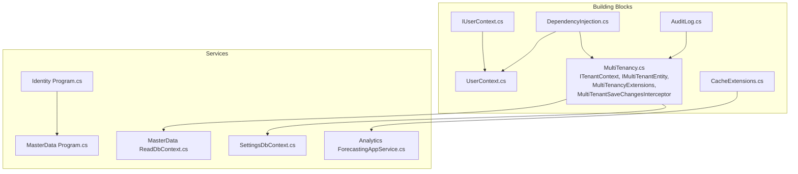
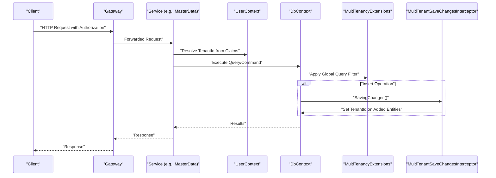
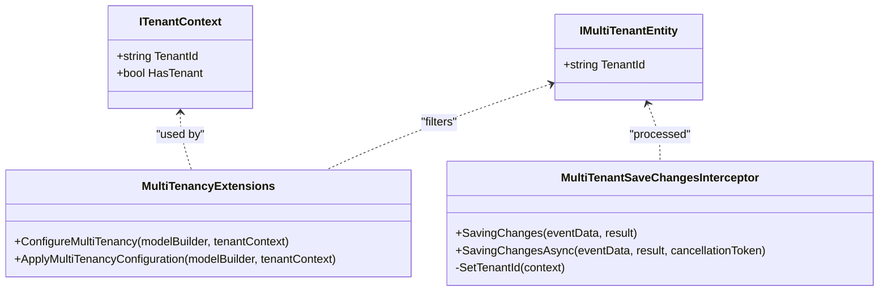
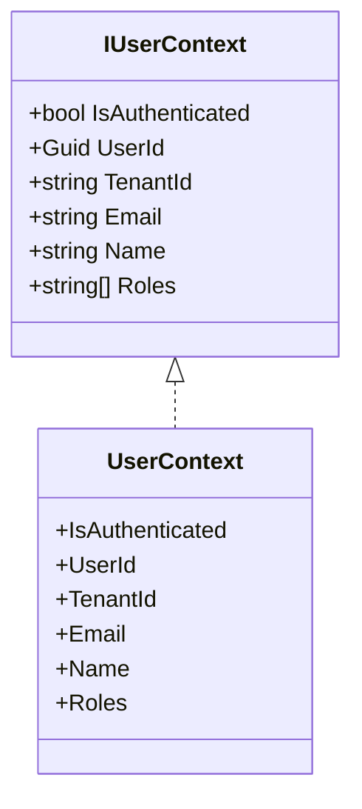
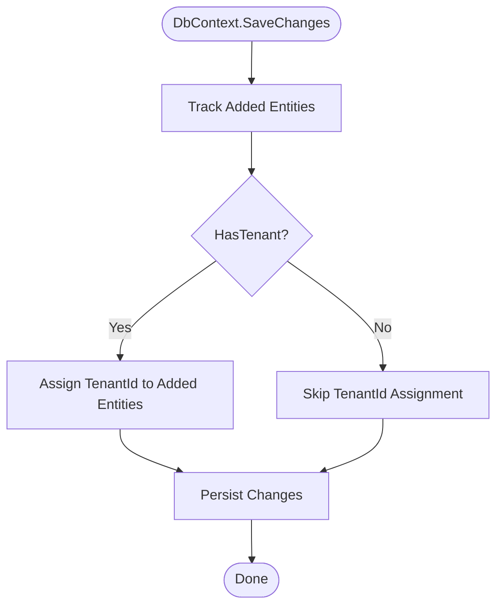
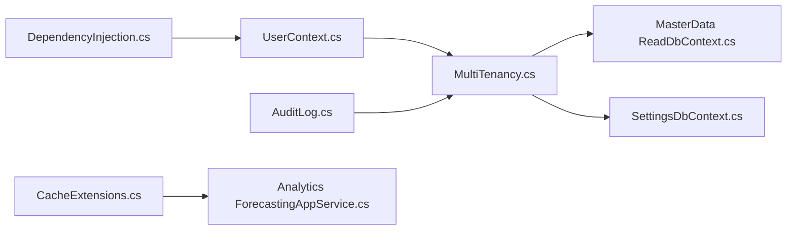

# Multi-Tenant Architecture

<cite>
**Referenced Files in This Document**
- [MultiTenancy.cs](file://src/BuildingBlocks/ErpSystem.BuildingBlocks/MultiTenancy/MultiTenancy.cs)
- [IUserContext.cs](file://src/BuildingBlocks/ErpSystem.BuildingBlocks/Auth/IUserContext.cs)
- [UserContext.cs](file://src/BuildingBlocks/ErpSystem.BuildingBlocks/Auth/UserContext.cs)
- [DependencyInjection.cs](file://src/BuildingBlocks/ErpSystem.BuildingBlocks/DependencyInjection.cs)
- [ReadDbContext.cs](file://src/Services/MasterData/ErpSystem.MasterData/Infrastructure/ReadDbContext.cs)
- [SettingsDbContext.cs](file://src/Services/Settings/ErpSystem.Settings/Infrastructure/SettingsDbContext.cs)
- [AuditLog.cs](file://src/BuildingBlocks/ErpSystem.BuildingBlocks/Auditing/AuditLog.cs)
- [CacheExtensions.cs](file://src/BuildingBlocks/ErpSystem.BuildingBlocks/Caching/CacheExtensions.cs)
- [Program.cs (Identity)](file://src/Services/Identity/ErpSystem.Identity/Program.cs)
- [Program.cs (MasterData)](file://src/Services/MasterData/ErpSystem.MasterData/Program.cs)
- [ForecastingAppService.cs](file://src/Services/Analytics/ErpSystem.Analytics/Application/ForecastingAppService.cs)
</cite>

## Table of Contents
1. [Introduction](#introduction)
2. [Project Structure](#project-structure)
3. [Core Components](#core-components)
4. [Architecture Overview](#architecture-overview)
5. [Detailed Component Analysis](#detailed-component-analysis)
6. [Dependency Analysis](#dependency-analysis)
7. [Performance Considerations](#performance-considerations)
8. [Troubleshooting Guide](#troubleshooting-guide)
9. [Conclusion](#conclusion)
10. [Appendices](#appendices)

## Introduction
This document explains the multi-tenant architecture implemented in the ERP system. It focuses on tenant isolation strategies, tenant context management, user context resolution, and tenant-aware data access patterns. It also covers query filters, tenant validation, security boundaries, provisioning and segregation examples, cross-tenant operations, tenant-specific configurations, audit requirements, performance considerations, caching strategies, and tenant lifecycle management.

## Project Structure
The multi-tenant capabilities are primarily implemented in the building blocks and applied across microservices:
- Tenant context and multi-tenant entity model are defined in the building blocks.
- User context resolves tenant claims from the HTTP context.
- Database contexts demonstrate tenant-aware entities and indexes.
- Audit logging captures tenant-aware events.
- Caching utilities provide distributed caching helpers.
- Service programs show database connection configuration and startup behavior.

**Diagram sources**
- [MultiTenancy.cs](file://src/BuildingBlocks/ErpSystem.BuildingBlocks/MultiTenancy/MultiTenancy.cs#L12-L100)
- [IUserContext.cs](file://src/BuildingBlocks/ErpSystem.BuildingBlocks/Auth/IUserContext.cs#L3-L11)
- [UserContext.cs](file://src/BuildingBlocks/ErpSystem.BuildingBlocks/Auth/UserContext.cs#L6-L33)
- [DependencyInjection.cs](file://src/BuildingBlocks/ErpSystem.BuildingBlocks/DependencyInjection.cs#L10-L30)
- [ReadDbContext.cs](file://src/Services/MasterData/ErpSystem.MasterData/Infrastructure/ReadDbContext.cs#L5-L47)
- [SettingsDbContext.cs](file://src/Services/Settings/ErpSystem.Settings/Infrastructure/SettingsDbContext.cs#L6-L32)
- [Program.cs (Identity)](file://src/Services/Identity/ErpSystem.Identity/Program.cs#L9-L71)
- [Program.cs (MasterData)](file://src/Services/MasterData/ErpSystem.MasterData/Program.cs#L9-L68)
- [ForecastingAppService.cs](file://src/Services/Analytics/ErpSystem.Analytics/Application/ForecastingAppService.cs#L10-L39)

**Section sources**
- [MultiTenancy.cs](file://src/BuildingBlocks/ErpSystem.BuildingBlocks/MultiTenancy/MultiTenancy.cs#L12-L100)
- [IUserContext.cs](file://src/BuildingBlocks/ErpSystem.BuildingBlocks/Auth/IUserContext.cs#L3-L11)
- [UserContext.cs](file://src/BuildingBlocks/ErpSystem.BuildingBlocks/Auth/UserContext.cs#L6-L33)
- [DependencyInjection.cs](file://src/BuildingBlocks/ErpSystem.BuildingBlocks/DependencyInjection.cs#L10-L30)
- [ReadDbContext.cs](file://src/Services/MasterData/ErpSystem.MasterData/Infrastructure/ReadDbContext.cs#L5-L47)
- [SettingsDbContext.cs](file://src/Services/Settings/ErpSystem.Settings/Infrastructure/SettingsDbContext.cs#L6-L32)
- [Program.cs (Identity)](file://src/Services/Identity/ErpSystem.Identity/Program.cs#L9-L71)
- [Program.cs (MasterData)](file://src/Services/MasterData/ErpSystem.MasterData/Program.cs#L9-L68)
- [ForecastingAppService.cs](file://src/Services/Analytics/ErpSystem.Analytics/Application/ForecastingAppService.cs#L10-L39)

## Core Components
- Tenant context abstraction: Defines the current tenant identifier and availability.
- Multi-tenant entity marker: Entities implementing this marker participate in tenant isolation.
- Global query filter: Applies tenant scoping to all multi-tenant entities via a model-level filter and index.
- Save changes interceptor: Automatically assigns TenantId on newly inserted entities when a tenant is active.
- User context: Resolves authenticated user identity, tenant claim, roles, and other attributes from HTTP claims.
- Dependency injection: Registers HttpContext accessor and user context, enabling tenant-aware services.
- Tenant-aware database contexts: Define tenant-scoped entities and indexes; analytics app service demonstrates tenant-scoped operations.

**Section sources**
- [MultiTenancy.cs](file://src/BuildingBlocks/ErpSystem.BuildingBlocks/MultiTenancy/MultiTenancy.cs#L12-L100)
- [IUserContext.cs](file://src/BuildingBlocks/ErpSystem.BuildingBlocks/Auth/IUserContext.cs#L3-L11)
- [UserContext.cs](file://src/BuildingBlocks/ErpSystem.BuildingBlocks/Auth/UserContext.cs#L6-L33)
- [DependencyInjection.cs](file://src/BuildingBlocks/ErpSystem.BuildingBlocks/DependencyInjection.cs#L10-L30)
- [ReadDbContext.cs](file://src/Services/MasterData/ErpSystem.MasterData/Infrastructure/ReadDbContext.cs#L5-L47)
- [SettingsDbContext.cs](file://src/Services/Settings/ErpSystem.Settings/Infrastructure/SettingsDbContext.cs#L6-L32)
- [ForecastingAppService.cs](file://src/Services/Analytics/ErpSystem.Analytics/Application/ForecastingAppService.cs#L10-L39)

## Architecture Overview
The system enforces tenant isolation at the persistence layer using global query filters and automatic TenantId assignment. Tenant identity is resolved from user claims and propagated to the persistence layer. Audit logging records tenant-aware events. Caching utilities support distributed caching with tenant-aware keys.

**Diagram sources**
- [UserContext.cs](file://src/BuildingBlocks/ErpSystem.BuildingBlocks/Auth/UserContext.cs#L6-L33)
- [MultiTenancy.cs](file://src/BuildingBlocks/ErpSystem.BuildingBlocks/MultiTenancy/MultiTenancy.cs#L29-L63)
- [MultiTenancy.cs](file://src/BuildingBlocks/ErpSystem.BuildingBlocks/MultiTenancy/MultiTenancy.cs#L68-L99)
- [ReadDbContext.cs](file://src/Services/MasterData/ErpSystem.MasterData/Infrastructure/ReadDbContext.cs#L5-L47)

## Detailed Component Analysis

### Tenant Context and Multi-Tenant Entities
- ITenantContext exposes the current TenantId and a convenience property indicating whether a tenant is active.
- IMultiTenantEntity marks domain entities that must be isolated by tenant.
- MultiTenancyExtensions applies a global query filter ensuring queries only return records matching the current tenant, and adds an index on TenantId for performance.
- MultiTenantSaveChangesInterceptor ensures newly added multi-tenant entities inherit the current tenant identifier during save operations.

**Diagram sources**
- [MultiTenancy.cs](file://src/BuildingBlocks/ErpSystem.BuildingBlocks/MultiTenancy/MultiTenancy.cs#L12-L100)

**Section sources**
- [MultiTenancy.cs](file://src/BuildingBlocks/ErpSystem.BuildingBlocks/MultiTenancy/MultiTenancy.cs#L12-L100)

### User Context Resolution
- IUserContext defines the contract for accessing authenticated user identity, including tenant claim, roles, and identifiers.
- UserContext extracts the tenant identifier from the "tenant_id" claim and other standard claims from the HTTP context.

**Diagram sources**
- [IUserContext.cs](file://src/BuildingBlocks/ErpSystem.BuildingBlocks/Auth/IUserContext.cs#L3-L11)
- [UserContext.cs](file://src/BuildingBlocks/ErpSystem.BuildingBlocks/Auth/UserContext.cs#L6-L33)

**Section sources**
- [IUserContext.cs](file://src/BuildingBlocks/ErpSystem.BuildingBlocks/Auth/IUserContext.cs#L3-L11)
- [UserContext.cs](file://src/BuildingBlocks/ErpSystem.BuildingBlocks/Auth/UserContext.cs#L6-L33)

### Tenant-Aware Data Access Patterns
- Global query filter: Ensures all queries for IMultiTenantEntity instances are scoped to the current tenant.
- Index on TenantId: Improves query performance for tenant-scoped reads.
- Automatic TenantId assignment: During insertions, the interceptor sets TenantId on new entities when a tenant is active.

**Diagram sources**
- [MultiTenancy.cs](file://src/BuildingBlocks/ErpSystem.BuildingBlocks/MultiTenancy/MultiTenancy.cs#L68-L99)

**Section sources**
- [MultiTenancy.cs](file://src/BuildingBlocks/ErpSystem.BuildingBlocks/MultiTenancy/MultiTenancy.cs#L29-L63)
- [MultiTenancy.cs](file://src/BuildingBlocks/ErpSystem.BuildingBlocks/MultiTenancy/MultiTenancy.cs#L68-L99)

### Tenant Provisioning and Data Segregation
- Provisioning: Tenant identity is established via user claims. The system does not include explicit tenant provisioning APIs in the shown files; provisioning would typically occur in the identity or admin service and propagate tenant_id in JWT claims.
- Data segregation: Tenant-aware entities and global query filters ensure data isolation. TenantId is indexed for efficient filtering.

Examples of tenant-aware entities and indexes:
- SettingsDbContext defines a UserPreference entity with TenantId and UserId, including a unique index on UserId and a tenant-aware property.
- Analytics ForecastingAppService accepts a tenantId parameter and creates aggregates scoped to that tenant.

**Section sources**
- [SettingsDbContext.cs](file://src/Services/Settings/ErpSystem.Settings/Infrastructure/SettingsDbContext.cs#L14-L31)
- [ForecastingAppService.cs](file://src/Services/Analytics/ErpSystem.Analytics/Application/ForecastingAppService.cs#L18-L39)

### Cross-Tenant Operations
- The current implementation enforces tenant isolation via global query filters and automatic TenantId assignment. Cross-tenant operations are not present in the analyzed files and would require explicit opt-in mechanisms (e.g., elevated permissions, administrative endpoints, or separate cross-tenant contexts) outside the standard tenant-aware pipeline.

[No sources needed since this section provides conceptual guidance derived from the presence of tenant isolation mechanisms]

### Tenant-Specific Configurations and Customizations
- Tenant-aware entities: Entities marked with IMultiTenantEntity automatically benefit from tenant scoping.
- TenantId indexing: Improves performance for tenant-scoped queries.
- Tenant-specific preferences: UserPreference in SettingsDbContext stores tenant-aware user settings.

**Section sources**
- [MultiTenancy.cs](file://src/BuildingBlocks/ErpSystem.BuildingBlocks/MultiTenancy/MultiTenancy.cs#L34-L42)
- [SettingsDbContext.cs](file://src/Services/Settings/ErpSystem.Settings/Infrastructure/SettingsDbContext.cs#L18-L30)

### Audit Requirements
- AuditLog captures tenant-aware audit entries, including TenantId, UserId, IP address, and user agent, enabling compliance and auditing across tenants.

**Section sources**
- [AuditLog.cs](file://src/BuildingBlocks/ErpSystem.BuildingBlocks/Auditing/AuditLog.cs#L12-L133)

### Tenant Lifecycle Management
- Tenant activation/deactivation: Controlled by setting or clearing the TenantId in the user context. The ITenantContext.HasTenant property reflects whether a tenant is active.
- Database connections: Services configure database connections using named connection strings. Tenant lifecycle changes can be reflected by switching connection strings or scoping connections appropriately.

**Section sources**
- [MultiTenancy.cs](file://src/BuildingBlocks/ErpSystem.BuildingBlocks/MultiTenancy/MultiTenancy.cs#L12-L16)
- [Program.cs (Identity)](file://src/Services/Identity/ErpSystem.Identity/Program.cs#L20-L24)
- [Program.cs (MasterData)](file://src/Services/MasterData/ErpSystem.MasterData/Program.cs#L16-L21)

## Dependency Analysis
The building blocks register the user context and tenant-related infrastructure. Service programs configure databases and MediatR. Tenant-awareness propagates from user claims through the building blocks to the persistence layer.

**Diagram sources**
- [DependencyInjection.cs](file://src/BuildingBlocks/ErpSystem.BuildingBlocks/DependencyInjection.cs#L10-L30)
- [UserContext.cs](file://src/BuildingBlocks/ErpSystem.BuildingBlocks/Auth/UserContext.cs#L6-L33)
- [MultiTenancy.cs](file://src/BuildingBlocks/ErpSystem.BuildingBlocks/MultiTenancy/MultiTenancy.cs#L12-L100)
- [ReadDbContext.cs](file://src/Services/MasterData/ErpSystem.MasterData/Infrastructure/ReadDbContext.cs#L5-L47)
- [SettingsDbContext.cs](file://src/Services/Settings/ErpSystem.Settings/Infrastructure/SettingsDbContext.cs#L6-L32)
- [AuditLog.cs](file://src/BuildingBlocks/ErpSystem.BuildingBlocks/Auditing/AuditLog.cs#L12-L133)
- [CacheExtensions.cs](file://src/BuildingBlocks/ErpSystem.BuildingBlocks/Caching/CacheExtensions.cs#L9-L71)
- [ForecastingAppService.cs](file://src/Services/Analytics/ErpSystem.Analytics/Application/ForecastingAppService.cs#L10-L39)

**Section sources**
- [DependencyInjection.cs](file://src/BuildingBlocks/ErpSystem.BuildingBlocks/DependencyInjection.cs#L10-L30)
- [Program.cs (Identity)](file://src/Services/Identity/ErpSystem.Identity/Program.cs#L9-L71)
- [Program.cs (MasterData)](file://src/Services/MasterData/ErpSystem.MasterData/Program.cs#L9-L68)

## Performance Considerations
- Global query filters: Ensure all tenant-scoped queries include TenantId filtering to avoid scanning entire tables.
- TenantId indexing: Applied to multi-tenant entities to accelerate tenant-scoped reads.
- SaveChanges interception: Prevents missing TenantId assignments, reducing runtime errors and retries.
- Distributed caching: Cache extensions provide typed get/set and get-or-set helpers; use tenant-aware keys to prevent cross-tenant cache pollution.

**Section sources**
- [MultiTenancy.cs](file://src/BuildingBlocks/ErpSystem.BuildingBlocks/MultiTenancy/MultiTenancy.cs#L34-L42)
- [MultiTenancy.cs](file://src/BuildingBlocks/ErpSystem.BuildingBlocks/MultiTenancy/MultiTenancy.cs#L68-L99)
- [CacheExtensions.cs](file://src/BuildingBlocks/ErpSystem.BuildingBlocks/Caching/CacheExtensions.cs#L9-L71)

## Troubleshooting Guide
- Missing TenantId in queries: Verify that global query filters are applied to all multi-tenant entities and that TenantId is indexed.
- Incorrect tenant scoping: Confirm that the user context resolves the correct "tenant_id" claim and that ITenantContext.HasTenant is true when expected.
- Insertion without TenantId: Ensure the MultiTenantSaveChangesInterceptor is registered and active so that TenantId is set on new entities.
- Audit gaps: Confirm AuditLog captures TenantId and other metadata consistently.

**Section sources**
- [MultiTenancy.cs](file://src/BuildingBlocks/ErpSystem.BuildingBlocks/MultiTenancy/MultiTenancy.cs#L29-L63)
- [MultiTenancy.cs](file://src/BuildingBlocks/ErpSystem.BuildingBlocks/MultiTenancy/MultiTenancy.cs#L68-L99)
- [UserContext.cs](file://src/BuildingBlocks/ErpSystem.BuildingBlocks/Auth/UserContext.cs#L23-L23)
- [AuditLog.cs](file://src/BuildingBlocks/ErpSystem.BuildingBlocks/Auditing/AuditLog.cs#L28-L40)

## Conclusion
The system implements robust tenant isolation using global query filters, tenant-aware entity markers, and automatic TenantId assignment during persistence. Tenant identity is resolved from user claims and propagated through the building blocks to the persistence layer. Audit logging and caching utilities complement the multi-tenant design. Cross-tenant operations are not present in the analyzed files and would require explicit opt-in mechanisms. Performance is supported by TenantId indexing and caching helpers.

## Appendices
- Tenant provisioning: Establish tenant_id in user claims; the system consumes this claim via UserContext.
- Tenant-specific configurations: Use tenant-aware entities and indexes; store tenant-scoped preferences in dedicated tenant-aware tables.
- Tenant lifecycle: Switch tenant by changing the active tenant claim; ensure database connections reflect the intended tenant scope.

[No sources needed since this section provides general guidance]