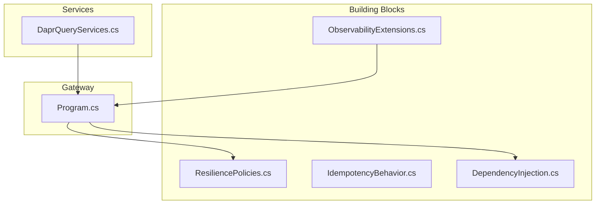
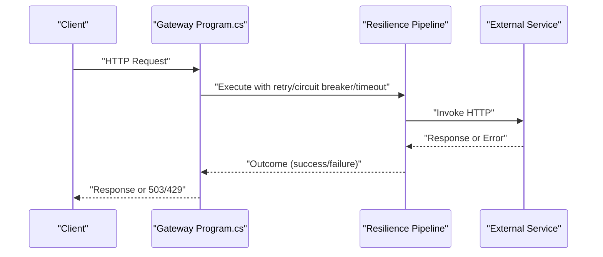
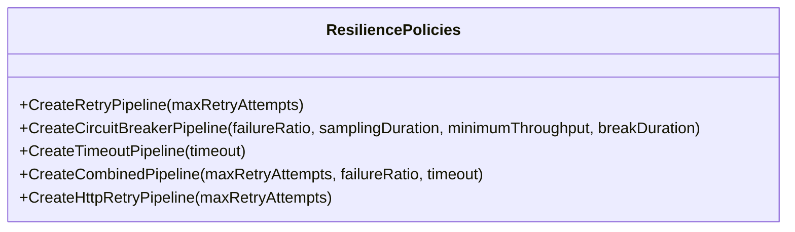
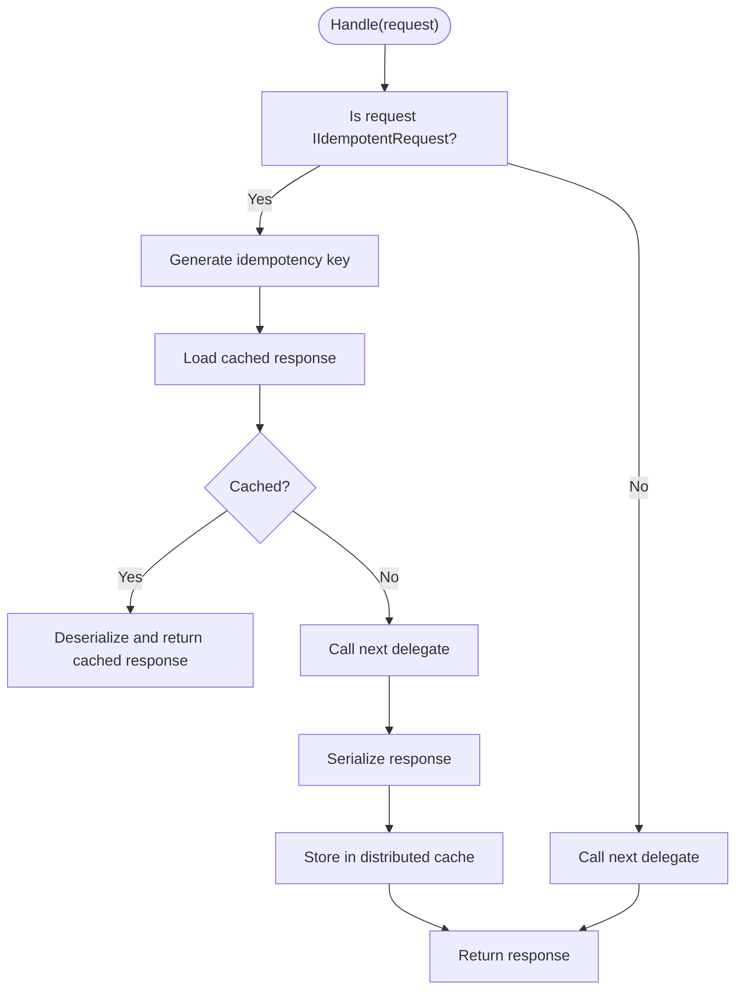
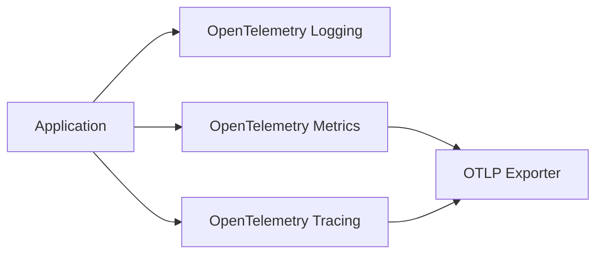
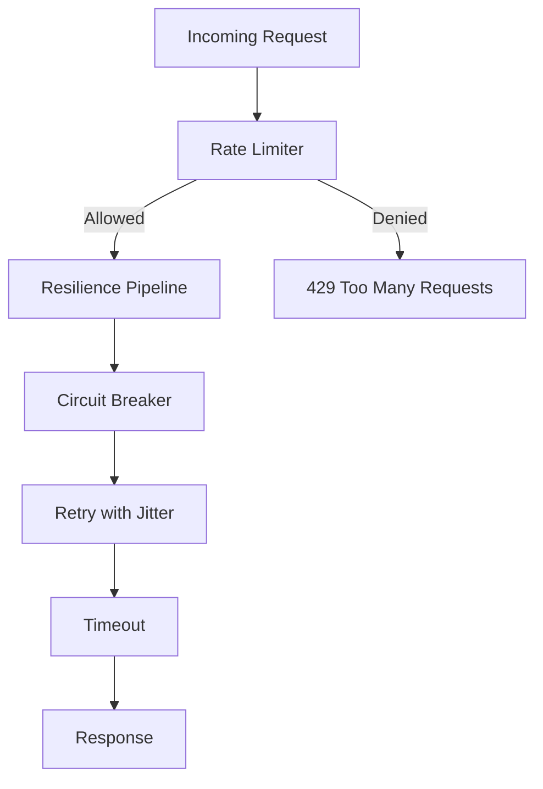
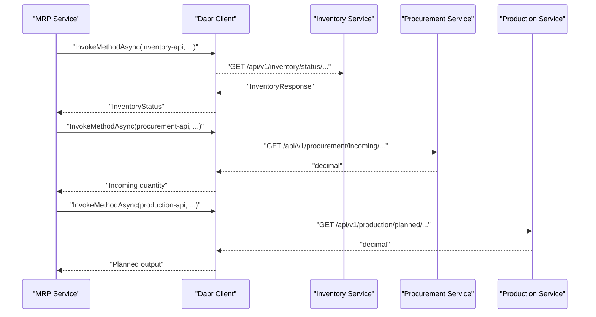
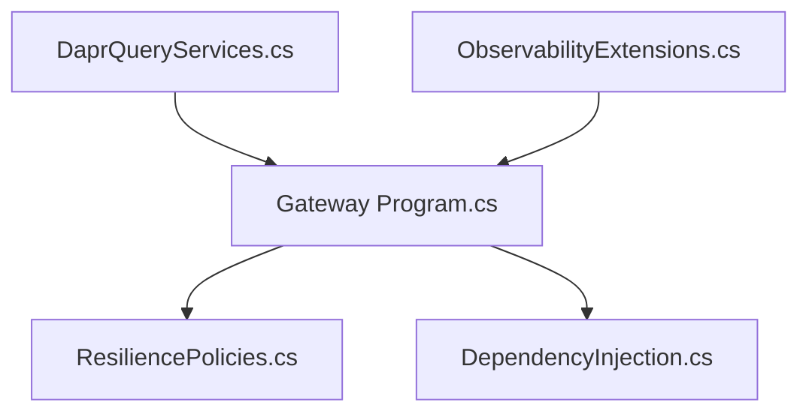

# Resilience and Fault Tolerance

<cite>
**Referenced Files in This Document**
- [ResiliencePolicies.cs](file://src/BuildingBlocks/ErpSystem.BuildingBlocks/Resilience/ResiliencePolicies.cs)
- [IdempotencyBehavior.cs](file://src/BuildingBlocks/ErpSystem.BuildingBlocks/Behaviors/IdempotencyBehavior.cs)
- [ObservabilityExtensions.cs](file://src/BuildingBlocks/ErpSystem.BuildingBlocks/Observability/ObservabilityExtensions.cs)
- [Program.cs](file://src/Gateways/ErpSystem.Gateway/Program.cs)
- [DependencyInjection.cs](file://src/BuildingBlocks/ErpSystem.BuildingBlocks/DependencyInjection.cs)
- [DaprQueryServices.cs](file://src/Services/MRP/ErpSystem.Mrp/Infrastructure/DaprQueryServices.cs)
</cite>

## Table of Contents
1. [Introduction](#introduction)
2. [Project Structure](#project-structure)
3. [Core Components](#core-components)
4. [Architecture Overview](#architecture-overview)
5. [Detailed Component Analysis](#detailed-component-analysis)
6. [Dependency Analysis](#dependency-analysis)
7. [Performance Considerations](#performance-considerations)
8. [Troubleshooting Guide](#troubleshooting-guide)
9. [Conclusion](#conclusion)
10. [Appendices](#appendices)

## Introduction
This document explains the resilience and fault tolerance mechanisms implemented in the ERP system. It covers circuit breaker patterns, retry policies, timeout configurations, and combined resilience pipelines. It documents idempotency behaviors to handle duplicate requests safely, and explains performance monitoring and health checks for distributed systems. Practical examples show how to configure resilience policies, handle transient failures, and apply graceful degradation. Observability patterns, circuit breaker state management, fallback strategies, and integration with external services via Dapr are included alongside rate limiting and load shedding techniques.

## Project Structure
The resilience and fault tolerance features are implemented across building blocks, gateway, and service integrations:
- Building Blocks: Shared resilience policies, idempotency behavior, and observability extensions
- Gateway: Centralized resilience pipeline configuration and rate limiting
- Services: Dapr-based invocation to external services with resilience-aware calls

**Diagram sources**
- [ResiliencePolicies.cs](file://src/BuildingBlocks/ErpSystem.BuildingBlocks/Resilience/ResiliencePolicies.cs#L1-L111)
- [IdempotencyBehavior.cs](file://src/BuildingBlocks/ErpSystem.BuildingBlocks/Behaviors/IdempotencyBehavior.cs#L1-L71)
- [ObservabilityExtensions.cs](file://src/BuildingBlocks/ErpSystem.BuildingBlocks/Observability/ObservabilityExtensions.cs#L1-L44)
- [DependencyInjection.cs](file://src/BuildingBlocks/ErpSystem.BuildingBlocks/DependencyInjection.cs#L1-L31)
- [Program.cs](file://src/Gateways/ErpSystem.Gateway/Program.cs#L1-L107)
- [DaprQueryServices.cs](file://src/Services/MRP/ErpSystem.Mrp/Infrastructure/DaprQueryServices.cs#L1-L67)

**Section sources**
- [ResiliencePolicies.cs](file://src/BuildingBlocks/ErpSystem.BuildingBlocks/Resilience/ResiliencePolicies.cs#L1-L111)
- [IdempotencyBehavior.cs](file://src/BuildingBlocks/ErpSystem.BuildingBlocks/Behaviors/IdempotencyBehavior.cs#L1-L71)
- [ObservabilityExtensions.cs](file://src/BuildingBlocks/ErpSystem.BuildingBlocks/Observability/ObservabilityExtensions.cs#L1-L44)
- [DependencyInjection.cs](file://src/BuildingBlocks/ErpSystem.BuildingBlocks/DependencyInjection.cs#L1-L31)
- [Program.cs](file://src/Gateways/ErpSystem.Gateway/Program.cs#L1-L107)
- [DaprQueryServices.cs](file://src/Services/MRP/ErpSystem.Mrp/Infrastructure/DaprQueryServices.cs#L1-L67)

## Core Components
- Resilience Policies: Pre-configured Polly resilience pipelines for retry, circuit breaker, timeout, and combined strategies
- Idempotency Behavior: Pipeline behavior to prevent duplicate command execution using distributed caching
- Observability Extensions: OpenTelemetry-based logging, metrics, and tracing setup
- Gateway Resilience: Centralized resilience pipeline and rate limiting for reverse proxy traffic
- Dapr Integration: Service invocation to external services with resilient patterns

**Section sources**
- [ResiliencePolicies.cs](file://src/BuildingBlocks/ErpSystem.BuildingBlocks/Resilience/ResiliencePolicies.cs#L13-L110)
- [IdempotencyBehavior.cs](file://src/BuildingBlocks/ErpSystem.BuildingBlocks/Behaviors/IdempotencyBehavior.cs#L14-L71)
- [ObservabilityExtensions.cs](file://src/BuildingBlocks/ErpSystem.BuildingBlocks/Observability/ObservabilityExtensions.cs#L10-L44)
- [Program.cs](file://src/Gateways/ErpSystem.Gateway/Program.cs#L30-L68)
- [DaprQueryServices.cs](file://src/Services/MRP/ErpSystem.Mrp/Infrastructure/DaprQueryServices.cs#L9-L67)

## Architecture Overview
The system applies layered resilience:
- Gateway level: Standardized resilience pipeline for outbound HTTP calls, rate limiting, and health checks
- Service level: Idempotency behavior for commands, observability instrumentation, and Dapr service invocation
- Building Blocks: Reusable resilience policies and behaviors

**Diagram sources**
- [Program.cs](file://src/Gateways/ErpSystem.Gateway/Program.cs#L30-L68)

## Detailed Component Analysis

### Resilience Policies
The building block defines reusable resilience pipelines:
- Retry pipeline with exponential backoff
- Circuit breaker pipeline with configurable failure ratio, sampling duration, minimum throughput, and break duration
- Timeout pipeline
- Combined pipeline chaining timeout → retry → circuit breaker
- Typed HTTP retry pipeline targeting transient errors

**Diagram sources**
- [ResiliencePolicies.cs](file://src/BuildingBlocks/ErpSystem.BuildingBlocks/Resilience/ResiliencePolicies.cs#L13-L110)

**Section sources**
- [ResiliencePolicies.cs](file://src/BuildingBlocks/ErpSystem.BuildingBlocks/Resilience/ResiliencePolicies.cs#L18-L110)

### Idempotency Behavior
The idempotency behavior prevents duplicate command execution by:
- Checking if a request implements the idempotency marker interface
- Generating a stable key from request type and idempotency key
- Using distributed cache to short-circuit repeated requests
- Serializing and caching the response for the key

**Diagram sources**
- [IdempotencyBehavior.cs](file://src/BuildingBlocks/ErpSystem.BuildingBlocks/Behaviors/IdempotencyBehavior.cs#L20-L50)

**Section sources**
- [IdempotencyBehavior.cs](file://src/BuildingBlocks/ErpSystem.BuildingBlocks/Behaviors/IdempotencyBehavior.cs#L14-L71)

### Observability Patterns
Observability is configured with:
- OpenTelemetry logging with formatted messages and scopes
- Metrics instrumentation for ASP.NET Core, HttpClient, and runtime
- Tracing instrumentation for ASP.NET Core, HttpClient, and service source
- OTLP exporter for telemetry export

**Diagram sources**
- [ObservabilityExtensions.cs](file://src/BuildingBlocks/ErpSystem.BuildingBlocks/Observability/ObservabilityExtensions.cs#L12-L42)

**Section sources**
- [ObservabilityExtensions.cs](file://src/BuildingBlocks/ErpSystem.BuildingBlocks/Observability/ObservabilityExtensions.cs#L10-L44)

### Gateway Resilience and Rate Limiting
The gateway configures:
- A named resilience pipeline with retry (exponential backoff + jitter), circuit breaker, and timeout
- Global rate limiting with 429 rejection status
- Health checks endpoint

**Diagram sources**
- [Program.cs](file://src/Gateways/ErpSystem.Gateway/Program.cs#L30-L68)

**Section sources**
- [Program.cs](file://src/Gateways/ErpSystem.Gateway/Program.cs#L30-L81)

### Dapr Service Invocation Integration
MRP service integrates with external services using Dapr:
- Service invocation to Inventory, Procurement, and Production services
- Calls are invoked by appId and route, returning typed responses

**Diagram sources**
- [DaprQueryServices.cs](file://src/Services/MRP/ErpSystem.Mrp/Infrastructure/DaprQueryServices.cs#L9-L67)

**Section sources**
- [DaprQueryServices.cs](file://src/Services/MRP/ErpSystem.Mrp/Infrastructure/DaprQueryServices.cs#L9-L67)

## Dependency Analysis
The gateway composes resilience and observability into the application pipeline. The building blocks provide shared behaviors and policies. Services integrate with Dapr for cross-service communication.

**Diagram sources**
- [Program.cs](file://src/Gateways/ErpSystem.Gateway/Program.cs#L1-L107)
- [ResiliencePolicies.cs](file://src/BuildingBlocks/ErpSystem.BuildingBlocks/Resilience/ResiliencePolicies.cs#L1-L111)
- [DependencyInjection.cs](file://src/BuildingBlocks/ErpSystem.BuildingBlocks/DependencyInjection.cs#L1-L31)
- [DaprQueryServices.cs](file://src/Services/MRP/ErpSystem.Mrp/Infrastructure/DaprQueryServices.cs#L1-L67)
- [ObservabilityExtensions.cs](file://src/BuildingBlocks/ErpSystem.BuildingBlocks/Observability/ObservabilityExtensions.cs#L1-L44)

**Section sources**
- [Program.cs](file://src/Gateways/ErpSystem.Gateway/Program.cs#L1-L107)
- [ResiliencePolicies.cs](file://src/BuildingBlocks/ErpSystem.BuildingBlocks/Resilience/ResiliencePolicies.cs#L1-L111)
- [DependencyInjection.cs](file://src/BuildingBlocks/ErpSystem.BuildingBlocks/DependencyInjection.cs#L1-L31)
- [DaprQueryServices.cs](file://src/Services/MRP/ErpSystem.Mrp/Infrastructure/DaprQueryServices.cs#L1-L67)
- [ObservabilityExtensions.cs](file://src/BuildingBlocks/ErpSystem.BuildingBlocks/Observability/ObservabilityExtensions.cs#L1-L44)

## Performance Considerations
- Use combined resilience pipelines to fail fast and reduce resource contention
- Tune circuit breaker thresholds based on downstream reliability and traffic volume
- Apply jitter in retries to avoid synchronized retry storms
- Monitor slow requests and adjust timeouts accordingly
- Enable observability to detect hotspots and degrade non-critical features under load

## Troubleshooting Guide
- Circuit breaker trips: Inspect failure ratio and sampling duration; verify downstream health
- Retry loops: Confirm ShouldHandle predicates and ensure non-transient exceptions are not retried
- Duplicate requests: Verify idempotency keys and cache TTL; check for request replay
- Telemetry export: Ensure OTEL_EXPORTER_OTLP_ENDPOINT is configured for OTLP exporter
- Rate limiting: Review rejection status and adjust limits per service capacity

**Section sources**
- [ResiliencePolicies.cs](file://src/BuildingBlocks/ErpSystem.BuildingBlocks/Resilience/ResiliencePolicies.cs#L33-L110)
- [IdempotencyBehavior.cs](file://src/BuildingBlocks/ErpSystem.BuildingBlocks/Behaviors/IdempotencyBehavior.cs#L20-L50)
- [ObservabilityExtensions.cs](file://src/BuildingBlocks/ErpSystem.BuildingBlocks/Observability/ObservabilityExtensions.cs#L36-L39)
- [Program.cs](file://src/Gateways/ErpSystem.Gateway/Program.cs#L60-L68)

## Conclusion
The ERP system implements robust resilience and fault tolerance through centralized gateway policies, reusable building block components, and Dapr-based service invocation. Idempotency safeguards against duplicate executions, while observability and health checks enable effective monitoring and diagnostics. These patterns support graceful degradation, controlled load shedding, and reliable operation under stress.

## Appendices

### Practical Examples

- Configure a combined resilience pipeline for outbound HTTP calls
  - See: [Program.cs](file://src/Gateways/ErpSystem.Gateway/Program.cs#L30-L58)
- Apply retry with jitter and circuit breaker for transient failures
  - See: [ResiliencePolicies.cs](file://src/BuildingBlocks/ErpSystem.BuildingBlocks/Resilience/ResiliencePolicies.cs#L18-L48)
- Enforce idempotency for commands
  - Implement IIdempotentRequest and rely on IdempotencyBehavior
  - See: [IdempotencyBehavior.cs](file://src/BuildingBlocks/ErpSystem.BuildingBlocks/Behaviors/IdempotencyBehavior.cs#L14-L71)
- Enable observability and health checks
  - See: [ObservabilityExtensions.cs](file://src/BuildingBlocks/ErpSystem.BuildingBlocks/Observability/ObservabilityExtensions.cs#L12-L42), [Program.cs](file://src/Gateways/ErpSystem.Gateway/Program.cs#L66-L81)
- Integrate with external services via Dapr
  - See: [DaprQueryServices.cs](file://src/Services/MRP/ErpSystem.Mrp/Infrastructure/DaprQueryServices.cs#L9-L67)