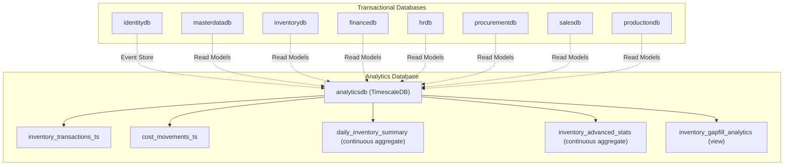
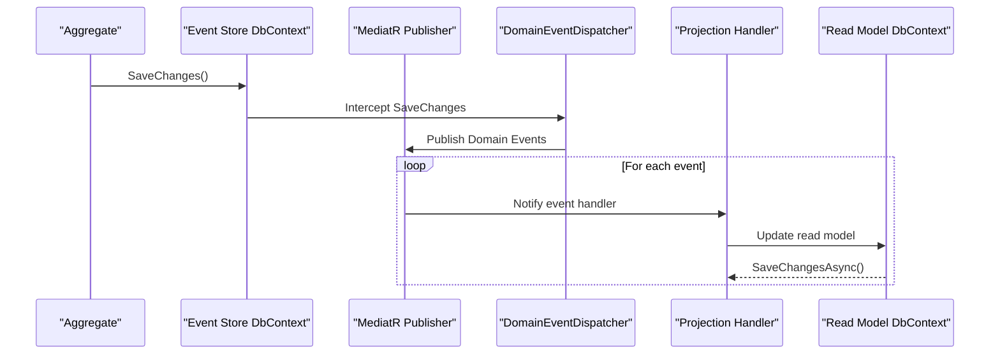
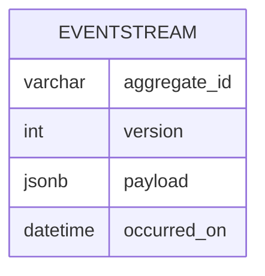
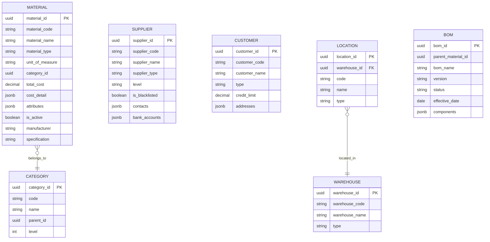
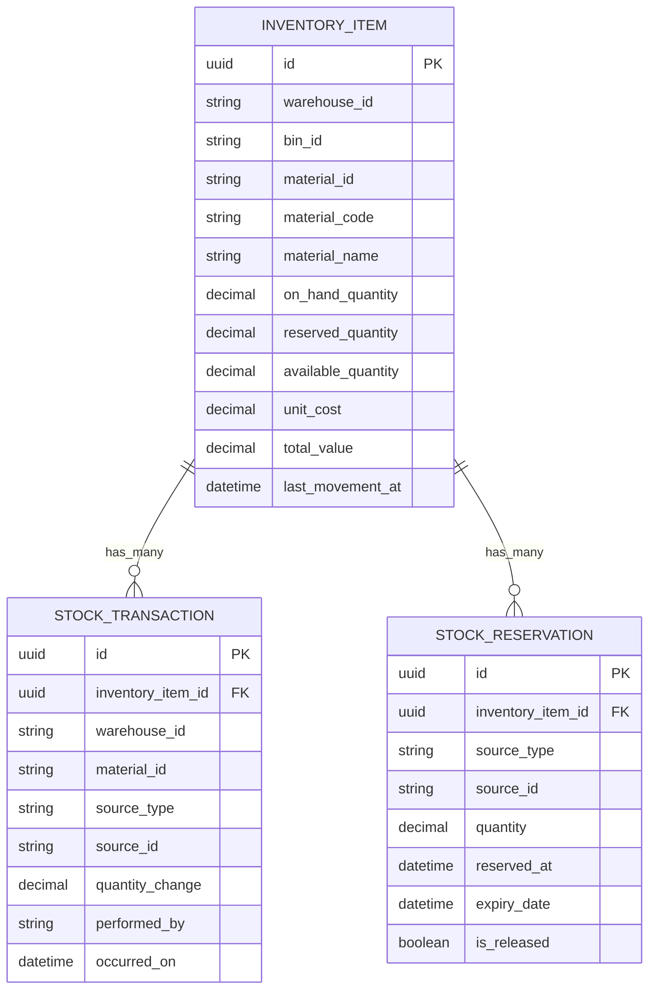
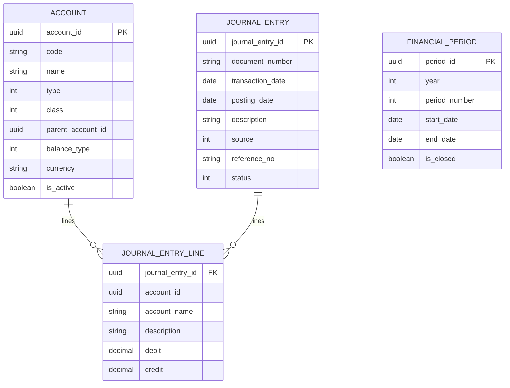
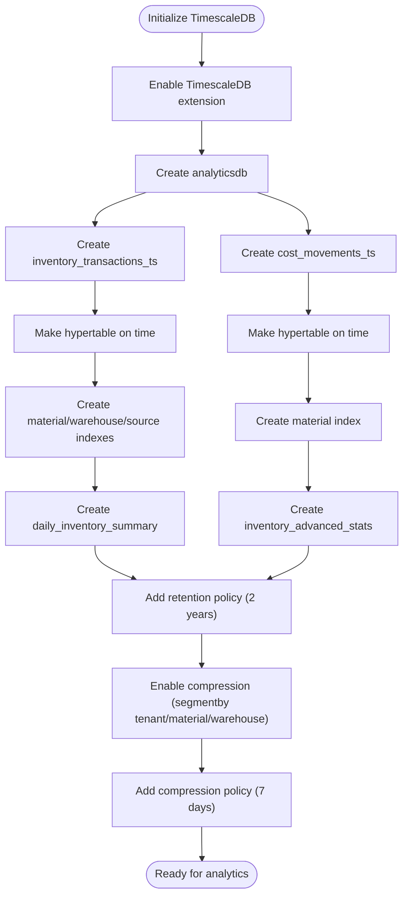
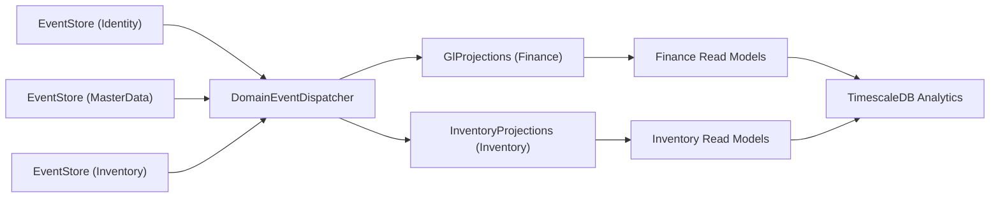

# Database Design

<cite>
**Referenced Files in This Document**
- [init.sql](file://infrastructure/init.sql)
- [timescale-init.sql](file://infrastructure/timescale-init.sql)
- [EventStore.cs (Identity)](file://src/Services/Identity/ErpSystem.Identity/Infrastructure/EventStore.cs)
- [EventStore.cs (MasterData)](file://src/Services/MasterData/ErpSystem.MasterData/Infrastructure/EventStore.cs)
- [Persistence.cs (Inventory)](file://src/Services/Inventory/ErpSystem.Inventory/Infrastructure/Persistence.cs)
- [Projections.cs (Inventory)](file://src/Services/Inventory/ErpSystem.Inventory/Infrastructure/Projections.cs)
- [ReadDbContext.cs (MasterData)](file://src/Services/MasterData/ErpSystem.MasterData/Infrastructure/ReadDbContext.cs)
- [GlProjections.cs (Finance)](file://src/Services/Finance/ErpSystem.Finance/Infrastructure/GLProjections.cs)
- [DomainEventDispatcher.cs](file://src/BuildingBlocks/ErpSystem.BuildingBlocks/Domain/DomainEventDispatcher.cs)
- [TimescaleDataExtractor.cs](file://src/Services/Analytics/ErpSystem.Analytics/Infrastructure/TimescaleDataExtractor.cs)
</cite>

## Table of Contents
1. [Introduction](#introduction)
2. [Project Structure](#project-structure)
3. [Core Components](#core-components)
4. [Architecture Overview](#architecture-overview)
5. [Detailed Component Analysis](#detailed-component-analysis)
6. [Dependency Analysis](#dependency-analysis)
7. [Performance Considerations](#performance-considerations)
8. [Troubleshooting Guide](#troubleshooting-guide)
9. [Conclusion](#conclusion)
10. [Appendices](#appendices)

## Introduction
This document describes the database design for the ERP system, focusing on the dual-database architecture and time-series analytics. It documents the event store schema for auditability, master data structures, read model tables optimized for querying, entity relationships, indexing strategies, performance optimizations, projection tables for reporting, data partitioning strategies, time-series data modeling, lifecycle and backup strategies, and schema evolution patterns.

## Project Structure
The database design spans two primary environments:
- Transactional databases per microservice, using PostgreSQL for operational data and event sourcing.
- Analytics database using TimescaleDB for time-series analytics and reporting.

**Diagram sources**
- [init.sql](file://infrastructure/init.sql#L1-L9)
- [timescale-init.sql](file://infrastructure/timescale-init.sql#L1-L140)

**Section sources**
- [init.sql](file://infrastructure/init.sql#L1-L9)
- [timescale-init.sql](file://infrastructure/timescale-init.sql#L1-L140)

## Core Components
- Dual-database architecture:
  - PostgreSQL databases per service for transactional workloads and event sourcing.
  - TimescaleDB database for time-series analytics and reporting.
- Event store schema:
  - Stores domain events as immutable records with composite keys for ordering.
  - Uses JSONB for event payloads to support flexible auditing and replay.
- Read model tables:
  - Optimized denormalized tables for fast querying across services.
  - JSONB fields for semi-structured attributes and metadata.
- Projection handlers:
  - Event-driven projections maintain read models from domain events.
- Time-series schema:
  - Hypertables for inventory and cost movements with time-based partitioning.
  - Continuous aggregates and retention policies for performance and compliance.

**Section sources**
- [EventStore.cs (Identity)](file://src/Services/Identity/ErpSystem.Identity/Infrastructure/EventStore.cs#L6-L18)
- [EventStore.cs (MasterData)](file://src/Services/MasterData/ErpSystem.MasterData/Infrastructure/EventStore.cs#L6-L18)
- [Persistence.cs (Inventory)](file://src/Services/Inventory/ErpSystem.Inventory/Infrastructure/Persistence.cs#L6-L37)
- [ReadDbContext.cs (MasterData)](file://src/Services/MasterData/ErpSystem.MasterData/Infrastructure/ReadDbContext.cs#L5-L47)
- [GlProjections.cs (Finance)](file://src/Services/Finance/ErpSystem.Finance/Infrastructure/GLProjections.cs#L7-L151)
- [timescale-init.sql](file://infrastructure/timescale-init.sql#L14-L84)

## Architecture Overview
The system follows CQRS with event sourcing:
- Write path: Aggregates emit domain events captured in the event store.
- Domain event dispatcher publishes events after SaveChanges.
- Projection handlers update read models for efficient querying.
- Analytics extracts time-series data from TimescaleDB for dashboards and ML.

**Diagram sources**
- [DomainEventDispatcher.cs](file://src/BuildingBlocks/ErpSystem.BuildingBlocks/Domain/DomainEventDispatcher.cs#L17-L62)
- [GlProjections.cs (Finance)](file://src/Services/Finance/ErpSystem.Finance/Infrastructure/GLProjections.cs#L18-L149)
- [Projections.cs (Inventory)](file://src/Services/Inventory/ErpSystem.Inventory/Infrastructure/Projections.cs#L16-L209)

## Detailed Component Analysis

### Event Store Schema
- Purpose: Immutable audit trail of all domain events.
- Keys: Composite key on AggregateId and Version to ensure ordering.
- Payload: JSONB for flexible event payloads.
- Usage: Each service maintains its own event store database.

**Diagram sources**
- [EventStore.cs (Identity)](file://src/Services/Identity/ErpSystem.Identity/Infrastructure/EventStore.cs#L12-L16)
- [EventStore.cs (MasterData)](file://src/Services/MasterData/ErpSystem.MasterData/Infrastructure/EventStore.cs#L12-L16)

**Section sources**
- [EventStore.cs (Identity)](file://src/Services/Identity/ErpSystem.Identity/Infrastructure/EventStore.cs#L6-L18)
- [EventStore.cs (MasterData)](file://src/Services/MasterData/ErpSystem.MasterData/Infrastructure/EventStore.cs#L6-L18)

### Master Data Structures
- Purpose: Denormalized read models for materials, categories, suppliers, customers, warehouses, locations, and BOMs.
- Data types: JSONB for semi-structured attributes and metadata.
- Keys: Surrogate keys for normalized joins; JSON fields for extensibility.

**Diagram sources**
- [ReadDbContext.cs (MasterData)](file://src/Services/MasterData/ErpSystem.MasterData/Infrastructure/ReadDbContext.cs#L17-L46)

**Section sources**
- [ReadDbContext.cs (MasterData)](file://src/Services/MasterData/ErpSystem.MasterData/Infrastructure/ReadDbContext.cs#L5-L125)

### Inventory Read Models and Projections
- Purpose: Fast querying of inventory positions, transactions, and reservations.
- Indexing: Unique compound index on warehouse/bin/material for fast lookups.
- Projections: Event-driven updates for stock received, issued, reserved, adjusted, transferred.

**Diagram sources**
- [Persistence.cs (Inventory)](file://src/Services/Inventory/ErpSystem.Inventory/Infrastructure/Persistence.cs#L26-L37)

**Section sources**
- [Persistence.cs (Inventory)](file://src/Services/Inventory/ErpSystem.Inventory/Infrastructure/Persistence.cs#L20-L79)
- [Projections.cs (Inventory)](file://src/Services/Inventory/ErpSystem.Inventory/Infrastructure/Projections.cs#L7-L211)

### Finance Read Models and Projections
- Purpose: Ledger accounts, journal entries, and financial periods for reporting.
- Projections: Handle account creation, updates, journal entry lifecycle, and period management.

**Diagram sources**
- [GlProjections.cs (Finance)](file://src/Services/Finance/ErpSystem.Finance/Infrastructure/GLProjections.cs#L18-L149)

**Section sources**
- [GlProjections.cs (Finance)](file://src/Services/Finance/ErpSystem.Finance/Infrastructure/GLProjections.cs#L7-L151)

### TimescaleDB Time-Series Schema
- Purpose: Efficiently store and query time-series data for analytics and ML.
- Tables:
  - inventory_transactions_ts: Inventory movements with time dimension.
  - cost_movements_ts: Financial cost movements with time dimension.
- Continuous aggregates:
  - daily_inventory_summary: Daily net change and counts.
  - inventory_advanced_stats: Rolling statistics and percentiles.
- Views:
  - inventory_gapfill_analytics: Gap-filled series for forecasting.
- Policies:
  - Retention: Keep detailed data for 2 years.
  - Compression: Columnar compression for historical chunks.
  - Refresh: Scheduled refresh of continuous aggregates.

**Diagram sources**
- [timescale-init.sql](file://infrastructure/timescale-init.sql#L4-L140)

**Section sources**
- [timescale-init.sql](file://infrastructure/timescale-init.sql#L14-L140)
- [TimescaleDataExtractor.cs](file://src/Services/Analytics/ErpSystem.Analytics/Infrastructure/TimescaleDataExtractor.cs#L8-L131)

### Data Lifecycle Management and Backup Strategies
- Lifecycle:
  - Retention policies keep detailed time-series data for 2 years.
  - Historical chunks are compressed to reduce storage footprint.
- Backup:
  - PostgreSQL databases per service should be backed up regularly using logical or physical backups.
  - TimescaleDB database should be backed up with retention-aware policies.
- Compliance:
  - Event stores provide immutable audit trails suitable for compliance.
  - Read models are updated via projections; ensure idempotent handlers for disaster recovery.

[No sources needed since this section provides general guidance]

### Schema Evolution Patterns
- Event versioning: Extend event payloads with optional fields to avoid breaking changes.
- Read model migrations: Add new columns to read models and backfill data via projections.
- JSONB fields: Use for attributes and metadata to minimize schema churn.
- Migration scripts: Apply schema changes to TimescaleDB and PostgreSQL consistently across environments.

[No sources needed since this section provides general guidance]

## Dependency Analysis
- Event sourcing and projections:
  - DomainEventDispatcher intercepts SaveChanges and publishes events.
  - Projection handlers update read models asynchronously.
- Cross-service dependencies:
  - Read models are populated from multiple services’ event streams.
  - Analytics consumes TimescaleDB for unified reporting.

**Diagram sources**
- [DomainEventDispatcher.cs](file://src/BuildingBlocks/ErpSystem.BuildingBlocks/Domain/DomainEventDispatcher.cs#L17-L62)
- [GlProjections.cs (Finance)](file://src/Services/Finance/ErpSystem.Finance/Infrastructure/GLProjections.cs#L7-L151)
- [Projections.cs (Inventory)](file://src/Services/Inventory/ErpSystem.Inventory/Infrastructure/Projections.cs#L7-L211)

**Section sources**
- [DomainEventDispatcher.cs](file://src/BuildingBlocks/ErpSystem.BuildingBlocks/Domain/DomainEventDispatcher.cs#L17-L62)
- [GlProjections.cs (Finance)](file://src/Services/Finance/ErpSystem.Finance/Infrastructure/GLProjections.cs#L7-L151)
- [Projections.cs (Inventory)](file://src/Services/Inventory/ErpSystem.Inventory/Infrastructure/Projections.cs#L7-L211)

## Performance Considerations
- Indexing:
  - Unique compound index on warehouse/bin/material in inventory read models.
  - Secondary indexes on material_id, warehouse_id, and source_type for time-series analytics.
- Partitioning:
  - Hypertables partitioned by time for automatic chunking and pruning.
- Aggregations:
  - Continuous aggregates precompute daily summaries and statistics.
- Storage:
  - Columnar compression for historical chunks reduces storage and improves scan performance.
- Query patterns:
  - Prefer time-bucketed queries and gap-filled views for forecasting and dashboards.

**Section sources**
- [Persistence.cs (Inventory)](file://src/Services/Inventory/ErpSystem.Inventory/Infrastructure/Persistence.cs#L32-L36)
- [timescale-init.sql](file://infrastructure/timescale-init.sql#L33-L84)
- [TimescaleDataExtractor.cs](file://src/Services/Analytics/ErpSystem.Analytics/Infrastructure/TimescaleDataExtractor.cs#L22-L83)

## Troubleshooting Guide
- Event store anomalies:
  - Verify composite key ordering and JSONB payload integrity.
  - Ensure event handlers are idempotent to handle replay scenarios.
- Projection failures:
  - Check for missing foreign keys or missing account names during journal entry line updates.
  - Validate unique constraints on inventory item identifiers.
- TimescaleDB issues:
  - Confirm continuous aggregate policies and retention policies are applied.
  - Validate compression policies and segmentby configuration.
- Connectivity:
  - Ensure analytics connection string is configured for TimescaleDB extraction service.

**Section sources**
- [GlProjections.cs (Finance)](file://src/Services/Finance/ErpSystem.Finance/Infrastructure/GLProjections.cs#L74-L76)
- [Projections.cs (Inventory)](file://src/Services/Inventory/ErpSystem.Inventory/Infrastructure/Projections.cs#L18-L36)
- [timescale-init.sql](file://infrastructure/timescale-init.sql#L71-L84)
- [TimescaleDataExtractor.cs](file://src/Services/Analytics/ErpSystem.Analytics/Infrastructure/TimescaleDataExtractor.cs#L10-L131)

## Conclusion
The ERP system’s database design leverages PostgreSQL for transactional data and event sourcing, and TimescaleDB for scalable time-series analytics. Event-driven projections maintain optimized read models across services, enabling fast querying and robust reporting. Continuous aggregates, retention, and compression policies ensure performance and compliance. The design supports schema evolution and cross-service data integration for comprehensive business intelligence.

## Appendices
- Database initialization:
  - Transactional databases per service are created during bootstrap.
  - Analytics database and hypertables are initialized with partitioning and policies.

**Section sources**
- [init.sql](file://infrastructure/init.sql#L1-L9)
- [timescale-init.sql](file://infrastructure/timescale-init.sql#L7-L140)