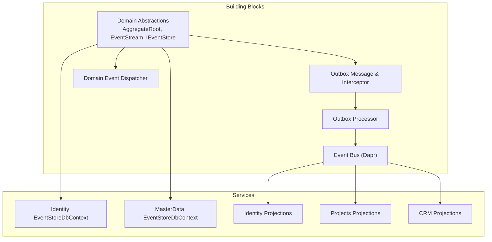
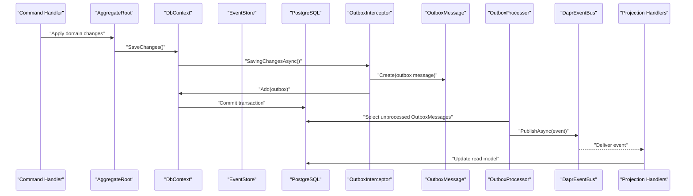
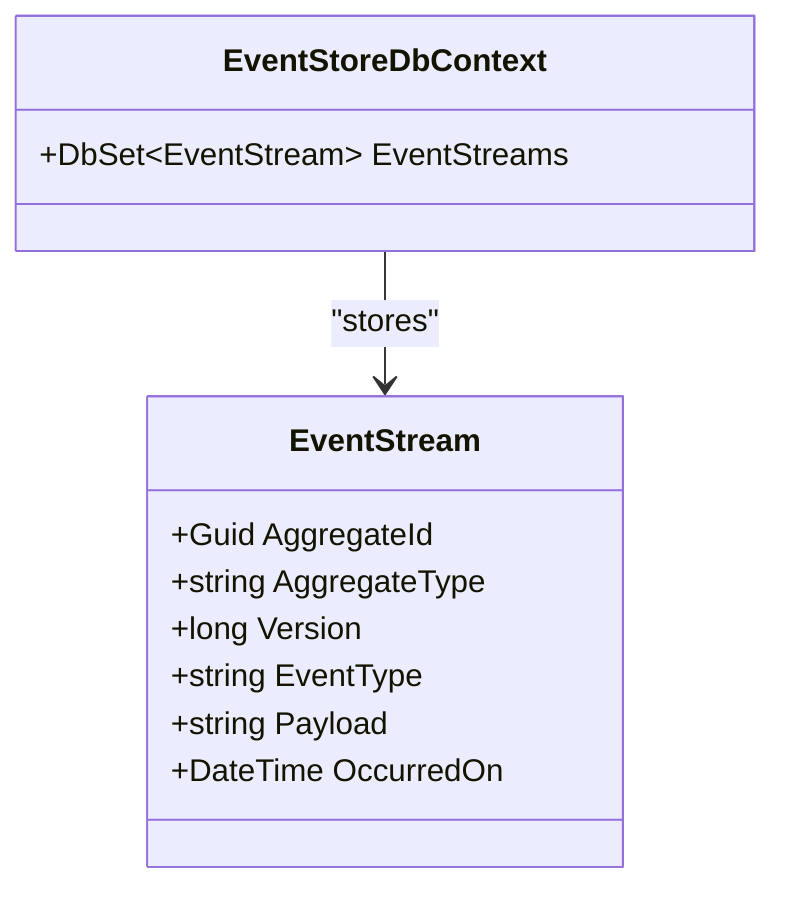
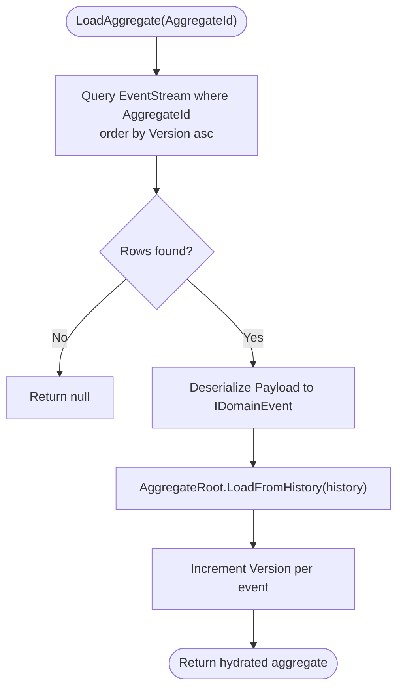
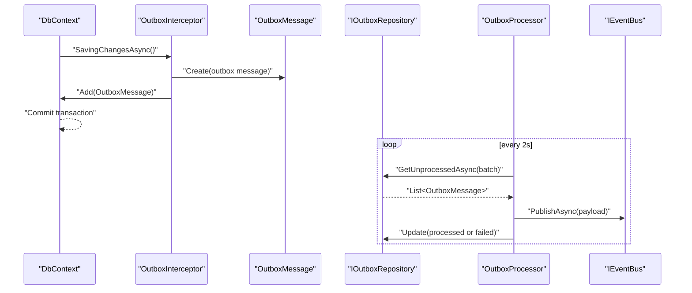
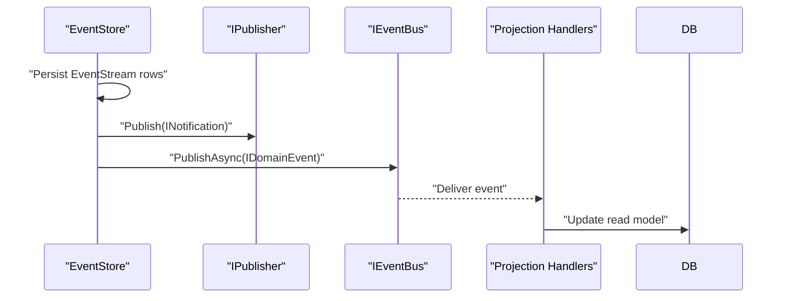
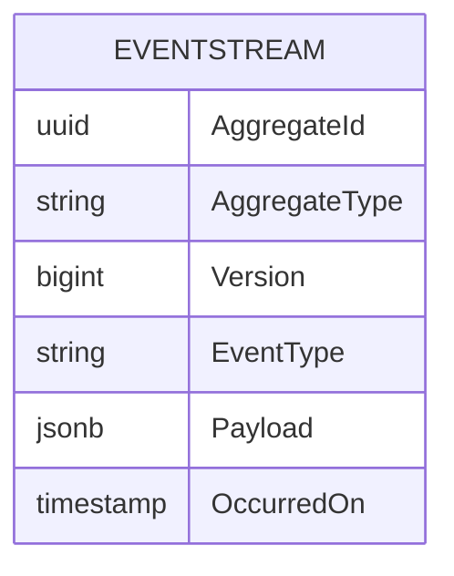
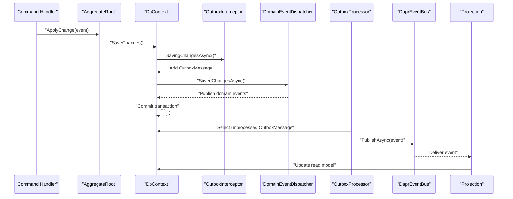
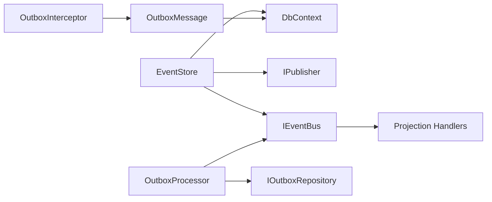

# Event Store Schema

<cite>
**Referenced Files in This Document**
- [DDDBase.cs](file://src/BuildingBlocks/ErpSystem.BuildingBlocks/Domain/DDDBase.cs)
- [DomainEventDispatcher.cs](file://src/BuildingBlocks/ErpSystem.BuildingBlocks/Domain/DomainEventDispatcher.cs)
- [OutboxMessage.cs](file://src/BuildingBlocks/ErpSystem.BuildingBlocks/Outbox/OutboxMessage.cs)
- [OutboxInterceptor.cs](file://src/BuildingBlocks/ErpSystem.BuildingBlocks/Outbox/OutboxInterceptor.cs)
- [OutboxProcessor.cs](file://src/BuildingBlocks/ErpSystem.BuildingBlocks/Outbox/OutboxProcessor.cs)
- [DaprEventBus.cs](file://src/BuildingBlocks/ErpSystem.BuildingBlocks/EventBus/DaprEventBus.cs)
- [EventStore.cs (Identity)](file://src/Services/Identity/ErpSystem.Identity/Infrastructure/EventStore.cs)
- [EventStore.cs (MasterData)](file://src/Services/MasterData/ErpSystem.MasterData/Infrastructure/EventStore.cs)
- [Persistence.cs (Finance)](file://src/Services/Finance/ErpSystem.Finance/Infrastructure/Persistence.cs)
- [Projections.cs (Identity)](file://src/Services/Identity/ErpSystem.Identity/Infrastructure/Projections.cs)
- [Projections.cs (Projects)](file://src/Services/Projects/ErpSystem.Projects/Infrastructure/Projections.cs)
- [Projections.cs (CRM)](file://src/Services/CRM/ErpSystem.CRM/Infrastructure/Projections.cs)
- [SalesOrderAggregate.cs](file://src/Services/Sales/ErpSystem.Sales/Domain/SalesOrderAggregate.cs)
- [DemandForecastAggregate.cs](file://src/Services/Analytics/ErpSystem.Analytics/Domain/DemandForecastAggregate.cs)
</cite>

## Table of Contents
1. [Introduction](#introduction)
2. [Project Structure](#project-structure)
3. [Core Components](#core-components)
4. [Architecture Overview](#architecture-overview)
5. [Detailed Component Analysis](#detailed-component-analysis)
6. [Dependency Analysis](#dependency-analysis)
7. [Performance Considerations](#performance-considerations)
8. [Troubleshooting Guide](#troubleshooting-guide)
9. [Conclusion](#conclusion)
10. [Appendices](#appendices)

## Introduction
This document explains the event store schema and event sourcing implementation using PostgreSQL-backed event streams and an outbox pattern for eventual consistency. It covers:
- Event table structure and event ordering
- Replay capabilities and event versioning
- Outbox pattern for reliable asynchronous publishing
- How domain events are persisted, retrieved, and processed by projection handlers
- Example event schemas for aggregates and the end-to-end workflow from command execution to event publication

## Project Structure
The event sourcing and outbox implementation spans shared building blocks and service-specific infrastructure:
- Shared domain and event store abstractions
- Outbox persistence and processing pipeline
- Service-specific event store contexts
- Projection handlers for read model updates
- Domain aggregates emitting events

**Diagram sources**
- [DDDBase.cs](file://src/BuildingBlocks/ErpSystem.BuildingBlocks/Domain/DDDBase.cs#L43-L51)
- [OutboxMessage.cs](file://src/BuildingBlocks/ErpSystem.BuildingBlocks/Outbox/OutboxMessage.cs#L10-L55)
- [OutboxInterceptor.cs](file://src/BuildingBlocks/ErpSystem.BuildingBlocks/Outbox/OutboxInterceptor.cs#L8-L49)
- [OutboxProcessor.cs](file://src/BuildingBlocks/ErpSystem.BuildingBlocks/Outbox/OutboxProcessor.cs#L8-L71)
- [DaprEventBus.cs](file://src/BuildingBlocks/ErpSystem.BuildingBlocks/EventBus/DaprEventBus.cs#L11-L21)
- [EventStore.cs (Identity)](file://src/Services/Identity/ErpSystem.Identity/Infrastructure/EventStore.cs#L6-L18)
- [EventStore.cs (MasterData)](file://src/Services/MasterData/ErpSystem.MasterData/Infrastructure/EventStore.cs#L6-L18)
- [Projections.cs (Identity)](file://src/Services/Identity/ErpSystem.Identity/Infrastructure/Projections.cs#L172-L207)
- [Projections.cs (Projects)](file://src/Services/Projects/ErpSystem.Projects/Infrastructure/Projections.cs#L151-L185)
- [Projections.cs (CRM)](file://src/Services/CRM/ErpSystem.CRM/Infrastructure/Projections.cs#L246-L286)

**Section sources**
- [DDDBase.cs](file://src/BuildingBlocks/ErpSystem.BuildingBlocks/Domain/DDDBase.cs#L14-L51)
- [OutboxMessage.cs](file://src/BuildingBlocks/ErpSystem.BuildingBlocks/Outbox/OutboxMessage.cs#L10-L81)
- [OutboxProcessor.cs](file://src/BuildingBlocks/ErpSystem.BuildingBlocks/Outbox/OutboxProcessor.cs#L8-L71)
- [DaprEventBus.cs](file://src/BuildingBlocks/ErpSystem.BuildingBlocks/EventBus/DaprEventBus.cs#L11-L21)
- [EventStore.cs (Identity)](file://src/Services/Identity/ErpSystem.Identity/Infrastructure/EventStore.cs#L6-L18)
- [EventStore.cs (MasterData)](file://src/Services/MasterData/ErpSystem.MasterData/Infrastructure/EventStore.cs#L6-L18)

## Core Components
- EventStream entity: Stores serialized domain events with metadata for replay and ordering.
- EventStore: Persists events, publishes notifications and bus events, and supports aggregate replay.
- OutboxMessage: Reliable asynchronous messaging alongside domain changes.
- OutboxInterceptor: Captures domain events during SaveChanges and writes outbox rows.
- OutboxProcessor: Periodically reads unprocessed outbox messages and publishes them via the event bus.
- DaprEventBus: Publishes events to a pub/sub system by topic name derived from the event type.
- Projection handlers: Subscribe to events and update read models.

**Section sources**
- [DDDBase.cs](file://src/BuildingBlocks/ErpSystem.BuildingBlocks/Domain/DDDBase.cs#L43-L51)
- [DDDBase.cs](file://src/BuildingBlocks/ErpSystem.BuildingBlocks/Domain/DDDBase.cs#L59-L120)
- [OutboxMessage.cs](file://src/BuildingBlocks/ErpSystem.BuildingBlocks/Outbox/OutboxMessage.cs#L10-L55)
- [OutboxInterceptor.cs](file://src/BuildingBlocks/ErpSystem.BuildingBlocks/Outbox/OutboxInterceptor.cs#L8-L49)
- [OutboxProcessor.cs](file://src/BuildingBlocks/ErpSystem.BuildingBlocks/Outbox/OutboxProcessor.cs#L8-L71)
- [DaprEventBus.cs](file://src/BuildingBlocks/ErpSystem.BuildingBlocks/EventBus/DaprEventBus.cs#L11-L21)

## Architecture Overview
End-to-end event sourcing and outbox flow from command execution to event publication and projection updates.

**Diagram sources**
- [DomainEventDispatcher.cs](file://src/BuildingBlocks/ErpSystem.BuildingBlocks/Domain/DomainEventDispatcher.cs#L17-L42)
- [OutboxInterceptor.cs](file://src/BuildingBlocks/ErpSystem.BuildingBlocks/Outbox/OutboxInterceptor.cs#L8-L49)
- [OutboxProcessor.cs](file://src/BuildingBlocks/ErpSystem.BuildingBlocks/Outbox/OutboxProcessor.cs#L29-L70)
- [DaprEventBus.cs](file://src/BuildingBlocks/ErpSystem.BuildingBlocks/EventBus/DaprEventBus.cs#L11-L21)
- [Projections.cs (Identity)](file://src/Services/Identity/ErpSystem.Identity/Infrastructure/Projections.cs#L172-L207)

## Detailed Component Analysis

### Event Stream Schema and Ordering
- EventStream fields:
  - AggregateId: identifies the aggregate instance
  - AggregateType: type name of the aggregate
  - Version: monotonically increasing event version per aggregate
  - EventType: type name of the event
  - Payload: JSON representation of the event
  - OccurredOn: event timestamp
- Composite primary key: (AggregateId, Version) ensures per-aggregate ordering and uniqueness.
- Persistence:
  - Service-specific DbContexts define DbSet<EventStream> and configure Payload as jsonb.
  - EventStore persists each pending change as a new EventStream row and increments version.

**Diagram sources**
- [DDDBase.cs](file://src/BuildingBlocks/ErpSystem.BuildingBlocks/Domain/DDDBase.cs#L43-L51)
- [EventStore.cs (Identity)](file://src/Services/Identity/ErpSystem.Identity/Infrastructure/EventStore.cs#L6-L18)
- [EventStore.cs (MasterData)](file://src/Services/MasterData/ErpSystem.MasterData/Infrastructure/EventStore.cs#L6-L18)

**Section sources**
- [DDDBase.cs](file://src/BuildingBlocks/ErpSystem.BuildingBlocks/Domain/DDDBase.cs#L43-L51)
- [EventStore.cs (Identity)](file://src/Services/Identity/ErpSystem.Identity/Infrastructure/EventStore.cs#L10-L17)
- [EventStore.cs (MasterData)](file://src/Services/MasterData/ErpSystem.MasterData/Infrastructure/EventStore.cs#L10-L17)
- [DDDBase.cs](file://src/BuildingBlocks/ErpSystem.BuildingBlocks/Domain/DDDBase.cs#L59-L120)

### Replay Capabilities and Versioning
- Versioning:
  - AggregateRoot maintains a Version counter and increments it per applied event.
  - EventStore assigns Version = previousVersion + 1 for each emitted event.
- Replay:
  - LoadAggregate queries EventStream rows for an AggregateId, orders by Version, deserializes payloads, and rebuilds the aggregate state via LoadFromHistory.

**Diagram sources**
- [DDDBase.cs](file://src/BuildingBlocks/ErpSystem.BuildingBlocks/Domain/DDDBase.cs#L14-L41)
- [DDDBase.cs](file://src/BuildingBlocks/ErpSystem.BuildingBlocks/Domain/DDDBase.cs#L101-L119)

**Section sources**
- [DDDBase.cs](file://src/BuildingBlocks/ErpSystem.BuildingBlocks/Domain/DDDBase.cs#L14-L41)
- [DDDBase.cs](file://src/BuildingBlocks/ErpSystem.BuildingBlocks/Domain/DDDBase.cs#L59-L120)

### Outbox Pattern for Eventual Consistency
- Capture:
  - OutboxInterceptor runs during SaveChanges to detect aggregates with pending domain events and creates OutboxMessage entries.
- Persist:
  - OutboxMessage is stored in the same transaction as domain changes, ensuring durability.
- Deliver:
  - OutboxProcessor periodically selects unprocessed OutboxMessage rows (filtering by ProcessedAt IS NULL), deserializes the payload, publishes via IEventBus, marks as processed, and updates retry/error counters on failure.

**Diagram sources**
- [OutboxInterceptor.cs](file://src/BuildingBlocks/ErpSystem.BuildingBlocks/Outbox/OutboxInterceptor.cs#L8-L49)
- [OutboxMessage.cs](file://src/BuildingBlocks/ErpSystem.BuildingBlocks/Outbox/OutboxMessage.cs#L10-L55)
- [OutboxProcessor.cs](file://src/BuildingBlocks/ErpSystem.BuildingBlocks/Outbox/OutboxProcessor.cs#L29-L70)
- [DaprEventBus.cs](file://src/BuildingBlocks/ErpSystem.BuildingBlocks/EventBus/DaprEventBus.cs#L11-L21)

**Section sources**
- [OutboxInterceptor.cs](file://src/BuildingBlocks/ErpSystem.BuildingBlocks/Outbox/OutboxInterceptor.cs#L8-L49)
- [OutboxMessage.cs](file://src/BuildingBlocks/ErpSystem.BuildingBlocks/Outbox/OutboxMessage.cs#L10-L81)
- [OutboxProcessor.cs](file://src/BuildingBlocks/ErpSystem.BuildingBlocks/Outbox/OutboxProcessor.cs#L8-L71)
- [DaprEventBus.cs](file://src/BuildingBlocks/ErpSystem.BuildingBlocks/EventBus/DaprEventBus.cs#L11-L21)

### Domain Events, Publishing, and Projection Handlers
- Domain events:
  - Aggregates emit IDomainEvent instances; some events are also INotification for local publishing.
- Local publishing:
  - EventStore publishes events via IPublisher (MediatR) and IEventBus (Dapr) after persisting.
- Projection handlers:
  - Services subscribe to events and update read models (e.g., Identity, Projects, CRM projections).

**Diagram sources**
- [DDDBase.cs](file://src/BuildingBlocks/ErpSystem.BuildingBlocks/Domain/DDDBase.cs#L59-L99)
- [DaprEventBus.cs](file://src/BuildingBlocks/ErpSystem.BuildingBlocks/EventBus/DaprEventBus.cs#L11-L21)
- [Projections.cs (Identity)](file://src/Services/Identity/ErpSystem.Identity/Infrastructure/Projections.cs#L172-L207)
- [Projections.cs (Projects)](file://src/Services/Projects/ErpSystem.Projects/Infrastructure/Projections.cs#L151-L185)
- [Projections.cs (CRM)](file://src/Services/CRM/ErpSystem.CRM/Infrastructure/Projections.cs#L246-L286)

**Section sources**
- [DDDBase.cs](file://src/BuildingBlocks/ErpSystem.BuildingBlocks/Domain/DDDBase.cs#L59-L99)
- [DaprEventBus.cs](file://src/BuildingBlocks/ErpSystem.BuildingBlocks/EventBus/DaprEventBus.cs#L11-L21)
- [Projections.cs (Identity)](file://src/Services/Identity/ErpSystem.Identity/Infrastructure/Projections.cs#L172-L207)
- [Projections.cs (Projects)](file://src/Services/Projects/ErpSystem.Projects/Infrastructure/Projections.cs#L151-L185)
- [Projections.cs (CRM)](file://src/Services/CRM/ErpSystem.CRM/Infrastructure/Projections.cs#L246-L286)

### Example Event Schemas for Aggregates
- SalesOrder aggregate emits events such as SalesOrderCreatedEvent and SalesOrderShipmentProcessedEvent.
- Analytics aggregate emits DemandForecastCreatedEvent with tenant/material/warehouse identifiers and forecast metrics.
- These events are serialized to Payload and stored in EventStream.

**Diagram sources**
- [DDDBase.cs](file://src/BuildingBlocks/ErpSystem.BuildingBlocks/Domain/DDDBase.cs#L43-L51)

**Section sources**
- [SalesOrderAggregate.cs](file://src/Services/Sales/ErpSystem.Sales/Domain/SalesOrderAggregate.cs#L55-L62)
- [DemandForecastAggregate.cs](file://src/Services/Analytics/ErpSystem.Analytics/Domain/DemandForecastAggregate.cs#L56-L68)
- [DDDBase.cs](file://src/BuildingBlocks/ErpSystem.BuildingBlocks/Domain/DDDBase.cs#L73-L84)

### End-to-End Workflow: Command Execution to Event Publication
- Command handler applies changes to an aggregate.
- Aggregate emits IDomainEvent instances.
- SaveChanges triggers interceptors:
  - OutboxInterceptor captures events and writes OutboxMessage rows.
  - DomainEventDispatcher collects and publishes domain events locally.
- Commit succeeds; OutboxProcessor later picks up OutboxMessage entries and publishes via IEventBus.
- Projection handlers receive events and update read models.

**Diagram sources**
- [DomainEventDispatcher.cs](file://src/BuildingBlocks/ErpSystem.BuildingBlocks/Domain/DomainEventDispatcher.cs#L17-L62)
- [OutboxInterceptor.cs](file://src/BuildingBlocks/ErpSystem.BuildingBlocks/Outbox/OutboxInterceptor.cs#L8-L49)
- [OutboxProcessor.cs](file://src/BuildingBlocks/ErpSystem.BuildingBlocks/Outbox/OutboxProcessor.cs#L29-L70)
- [DaprEventBus.cs](file://src/BuildingBlocks/ErpSystem.BuildingBlocks/EventBus/DaprEventBus.cs#L11-L21)

**Section sources**
- [DomainEventDispatcher.cs](file://src/BuildingBlocks/ErpSystem.BuildingBlocks/Domain/DomainEventDispatcher.cs#L17-L62)
- [OutboxInterceptor.cs](file://src/BuildingBlocks/ErpSystem.BuildingBlocks/Outbox/OutboxInterceptor.cs#L8-L49)
- [OutboxProcessor.cs](file://src/BuildingBlocks/ErpSystem.BuildingBlocks/Outbox/OutboxProcessor.cs#L29-L70)
- [DaprEventBus.cs](file://src/BuildingBlocks/ErpSystem.BuildingBlocks/EventBus/DaprEventBus.cs#L11-L21)

## Dependency Analysis
- EventStore depends on:
  - DbContext for persistence
  - IPublisher for local notifications
  - IEventBus for cross-service delivery
- OutboxProcessor depends on:
  - IOutboxRepository for fetching messages
  - IEventBus for publishing
- Projection handlers depend on:
  - IEventBus subscriptions
  - Read model DbContexts

**Diagram sources**
- [DDDBase.cs](file://src/BuildingBlocks/ErpSystem.BuildingBlocks/Domain/DDDBase.cs#L59-L99)
- [OutboxInterceptor.cs](file://src/BuildingBlocks/ErpSystem.BuildingBlocks/Outbox/OutboxInterceptor.cs#L8-L49)
- [OutboxProcessor.cs](file://src/BuildingBlocks/ErpSystem.BuildingBlocks/Outbox/OutboxProcessor.cs#L29-L70)
- [DaprEventBus.cs](file://src/BuildingBlocks/ErpSystem.BuildingBlocks/EventBus/DaprEventBus.cs#L11-L21)

**Section sources**
- [DDDBase.cs](file://src/BuildingBlocks/ErpSystem.BuildingBlocks/Domain/DDDBase.cs#L59-L99)
- [OutboxProcessor.cs](file://src/BuildingBlocks/ErpSystem.BuildingBlocks/Outbox/OutboxProcessor.cs#L29-L70)

## Performance Considerations
- Event serialization/deserialization overhead: Keep payloads minimal; avoid embedding large objects.
- Indexing:
  - Composite primary key (AggregateId, Version) supports ordered replay.
  - Consider adding indexes on EventType and OccurredOn for filtering and analytics.
- Outbox batch size and polling interval:
  - Tune BatchSize and delay to balance throughput and latency.
- Concurrency:
  - Use optimistic concurrency on aggregates and handle conflicts in command handlers.
- Read model updates:
  - Batch projection updates where possible to reduce write amplification.

[No sources needed since this section provides general guidance]

## Troubleshooting Guide
- Events not reaching projections:
  - Verify OutboxProcessor is running and IOutboxRepository is registered.
  - Check ProcessedAt filter index and retry counts.
- Duplicate deliveries:
  - Ensure OutboxMessage is marked processed only after successful projection update.
- Serialization errors:
  - Confirm event types are resolvable and Payload matches the declared MessageType.
- Replay failures:
  - Validate EventType resolution and payload compatibility when reconstructing aggregates.

**Section sources**
- [OutboxProcessor.cs](file://src/BuildingBlocks/ErpSystem.BuildingBlocks/Outbox/OutboxProcessor.cs#L29-L70)
- [OutboxMessage.cs](file://src/BuildingBlocks/ErpSystem.BuildingBlocks/Outbox/OutboxMessage.cs#L67-L81)
- [DDDBase.cs](file://src/BuildingBlocks/ErpSystem.BuildingBlocks/Domain/DDDBase.cs#L101-L119)

## Conclusion
The system implements robust event sourcing with PostgreSQL-backed event streams and a transactional outbox for eventual consistency. Event ordering and replay rely on a composite key and versioned event sequences. The outbox guarantees delivery alongside domain changes, and projection handlers keep read models current. This design scales across services and integrates with Dapr pub/sub for cross-service event distribution.

[No sources needed since this section summarizes without analyzing specific files]

## Appendices

### Appendix A: EventStream Schema Definition
- Columns:
  - AggregateId: uuid
  - AggregateType: text
  - Version: bigint
  - EventType: text
  - Payload: jsonb
  - OccurredOn: timestamp
- Primary Key: (AggregateId, Version)
- Notes:
  - Payload stores serialized event data.
  - EventType enables type resolution during replay.

**Section sources**
- [DDDBase.cs](file://src/BuildingBlocks/ErpSystem.BuildingBlocks/Domain/DDDBase.cs#L43-L51)
- [EventStore.cs (Identity)](file://src/Services/Identity/ErpSystem.Identity/Infrastructure/EventStore.cs#L10-L17)
- [EventStore.cs (MasterData)](file://src/Services/MasterData/ErpSystem.MasterData/Infrastructure/EventStore.cs#L10-L17)