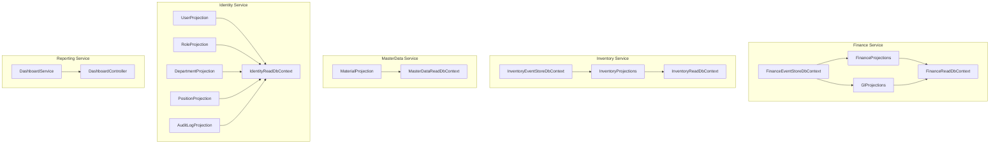
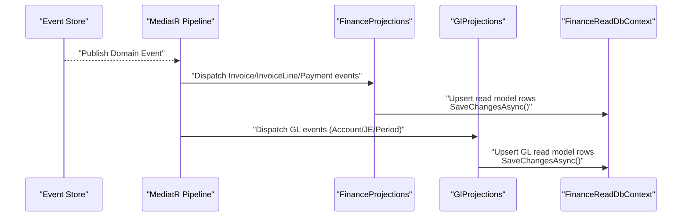
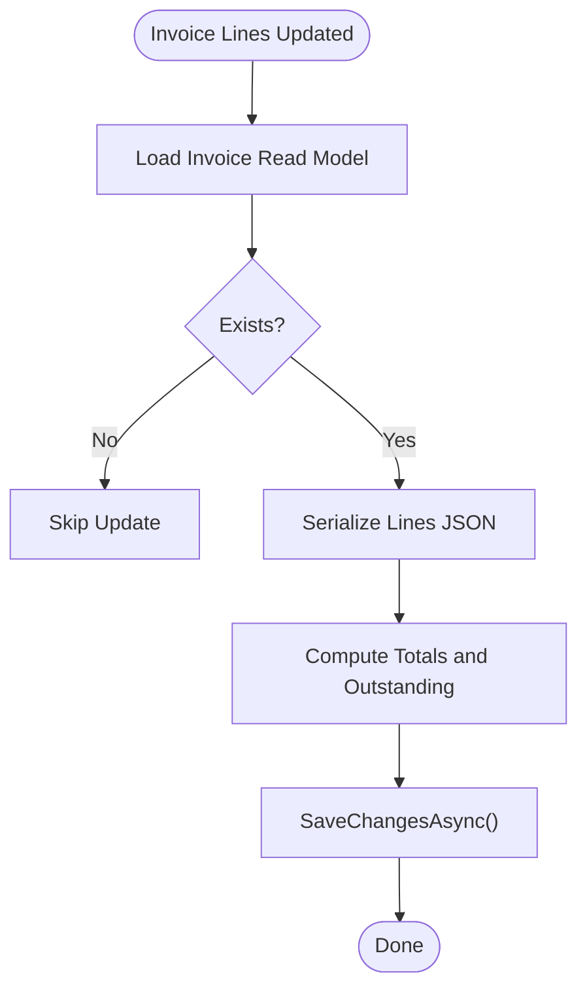
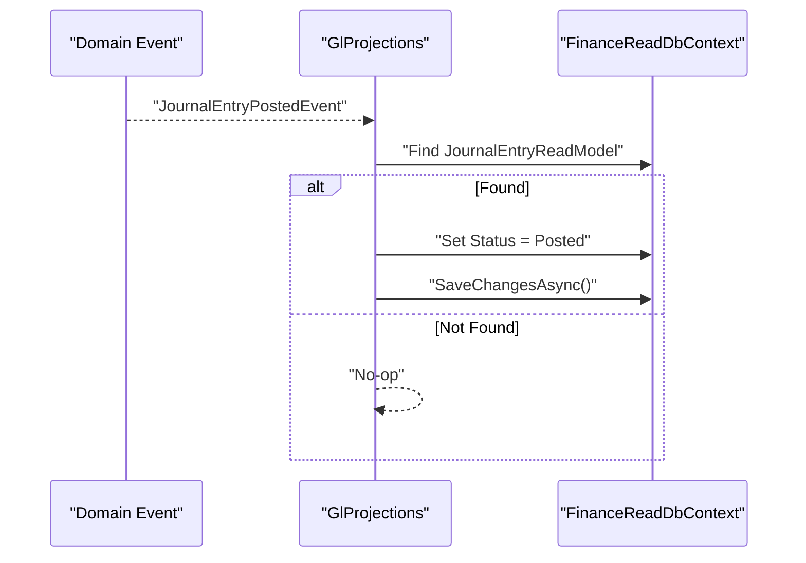
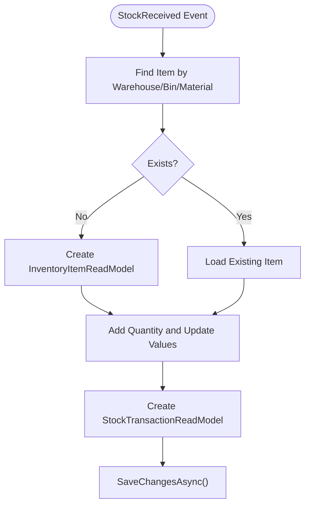
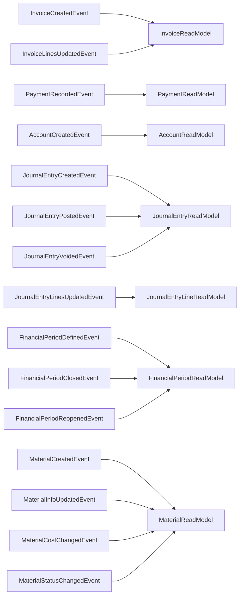
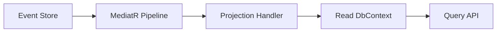

# Projection Models

<cite>
**Referenced Files in This Document**
- [GLProjections.cs](file://src/Services/Finance/ErpSystem.Finance/Infrastructure/GLProjections.cs)
- [Projections.cs](file://src/Services/Finance/ErpSystem.Finance/Infrastructure/Projections.cs)
- [Persistence.cs](file://src/Services/Finance/ErpSystem.Finance/Infrastructure/Persistence.cs)
- [InventoryProjections.cs](file://src/Services/Inventory/ErpSystem.Inventory/Infrastructure/Projections.cs)
- [Persistence.cs](file://src/Services/Inventory/ErpSystem.Inventory/Infrastructure/Persistence.cs)
- [MaterialProjections.cs](file://src/Services/MasterData/ErpSystem.MasterData/Infrastructure/MaterialProjections.cs)
- [ReadDbContext.cs](file://src/Services/MasterData/ErpSystem.MasterData/Infrastructure/ReadDbContext.cs)
- [Projections.cs](file://src/Services/Identity/ErpSystem.Identity/Infrastructure/Projections.cs)
- [DashboardService.cs](file://src/Services/Reporting/ErpSystem.Reporting/Application/DashboardService.cs)
- [DashboardController.cs](file://src/Services/Reporting/ErpSystem.Reporting/Controllers/DashboardController.cs)
</cite>

## Table of Contents
1. [Introduction](#introduction)
2. [Project Structure](#project-structure)
3. [Core Components](#core-components)
4. [Architecture Overview](#architecture-overview)
5. [Detailed Component Analysis](#detailed-component-analysis)
6. [Dependency Analysis](#dependency-analysis)
7. [Performance Considerations](#performance-considerations)
8. [Troubleshooting Guide](#troubleshooting-guide)
9. [Conclusion](#conclusion)
10. [Appendices](#appendices)

## Introduction
This document explains the projection models used to optimize query performance across the ERP system. It details how read model tables are built from event streams, how projections update those models, and how conflicts are resolved. It covers financial projections for the general ledger and accounts receivable/payable, inventory projections for stock levels and reservations, master data projections for materials and categories, identity projections for users and roles, and reporting projections for dashboard summaries. It also describes the projection pipeline from event consumption to read model updates, the projection processor architecture, and maintenance and rebuilding strategies.

## Project Structure
The projection system is implemented per service with dedicated read model contexts and projection handlers. Each service maintains:
- A read model Entity Framework context
- Read model entities
- Projection handlers that subscribe to domain events and update read models
- Optional specialized projections (e.g., GL projections)

**Diagram sources**
- [Persistence.cs](file://src/Services/Finance/ErpSystem.Finance/Infrastructure/Persistence.cs#L6-L50)
- [Projections.cs](file://src/Services/Finance/ErpSystem.Finance/Infrastructure/Projections.cs#L7-L16)
- [GLProjections.cs](file://src/Services/Finance/ErpSystem.Finance/Infrastructure/GLProjections.cs#L7-L16)
- [Persistence.cs](file://src/Services/Inventory/ErpSystem.Inventory/Infrastructure/Persistence.cs#L6-L37)
- [InventoryProjections.cs](file://src/Services/Inventory/ErpSystem.Inventory/Infrastructure/Projections.cs#L7-L14)
- [ReadDbContext.cs](file://src/Services/MasterData/ErpSystem.MasterData/Infrastructure/ReadDbContext.cs#L5-L46)
- [MaterialProjections.cs](file://src/Services/MasterData/ErpSystem.MasterData/Infrastructure/MaterialProjections.cs#L7-L12)
- [Projections.cs](file://src/Services/Identity/ErpSystem.Identity/Infrastructure/Projections.cs#L73-L88)
- [DashboardService.cs](file://src/Services/Reporting/ErpSystem.Reporting/Application/DashboardService.cs#L20-L37)
- [DashboardController.cs](file://src/Services/Reporting/ErpSystem.Reporting/Controllers/DashboardController.cs#L8-L18)

**Section sources**
- [Persistence.cs](file://src/Services/Finance/ErpSystem.Finance/Infrastructure/Persistence.cs#L6-L50)
- [Persistence.cs](file://src/Services/Inventory/ErpSystem.Inventory/Infrastructure/Persistence.cs#L6-L37)
- [ReadDbContext.cs](file://src/Services/MasterData/ErpSystem.MasterData/Infrastructure/ReadDbContext.cs#L5-L46)
- [Projections.cs](file://src/Services/Identity/ErpSystem.Identity/Infrastructure/Projections.cs#L73-L88)
- [DashboardService.cs](file://src/Services/Reporting/ErpSystem.Reporting/Application/DashboardService.cs#L20-L37)
- [DashboardController.cs](file://src/Services/Reporting/ErpSystem.Reporting/Controllers/DashboardController.cs#L8-L18)

## Core Components
- Finance read models and projections:
  - Invoices and payments read models with JSON fields for lines and totals
  - General ledger read models for accounts, journal entries, and financial periods
  - Projections handle creation, updates, posting, and closing of periods
- Inventory read models and projections:
  - Inventory items with on-hand, reserved, available quantities and valuation
  - Stock transactions and reservations
  - Projections handle receipts, issues, adjustments, transfers, and reservations
- Master data read models and projections:
  - Materials with cost details and attributes stored as JSON
  - Projections update material info, costs, and status
- Identity read models and projections:
  - Users, roles, departments, positions, and audit logs
  - Projections update profile, permissions, locks, and audit trail
- Reporting:
  - Dashboard service and controller expose summary, trends, inventory status, top products, and recent activities

**Section sources**
- [Projections.cs](file://src/Services/Finance/ErpSystem.Finance/Infrastructure/Projections.cs#L17-L121)
- [GLProjections.cs](file://src/Services/Finance/ErpSystem.Finance/Infrastructure/GLProjections.cs#L18-L149)
- [Persistence.cs](file://src/Services/Finance/ErpSystem.Finance/Infrastructure/Persistence.cs#L52-L131)
- [InventoryProjections.cs](file://src/Services/Inventory/ErpSystem.Inventory/Infrastructure/Projections.cs#L16-L210)
- [Persistence.cs](file://src/Services/Inventory/ErpSystem.Inventory/Infrastructure/Persistence.cs#L39-L79)
- [MaterialProjections.cs](file://src/Services/MasterData/ErpSystem.MasterData/Infrastructure/MaterialProjections.cs#L14-L73)
- [ReadDbContext.cs](file://src/Services/MasterData/ErpSystem.MasterData/Infrastructure/ReadDbContext.cs#L51-L65)
- [Projections.cs](file://src/Services/Identity/ErpSystem.Identity/Infrastructure/Projections.cs#L91-L134)
- [Projections.cs](file://src/Services/Identity/ErpSystem.Identity/Infrastructure/Projections.cs#L137-L179)
- [Projections.cs](file://src/Services/Identity/ErpSystem.Identity/Infrastructure/Projections.cs#L182-L197)
- [Projections.cs](file://src/Services/Identity/ErpSystem.Identity/Infrastructure/Projections.cs#L199-L208)
- [DashboardService.cs](file://src/Services/Reporting/ErpSystem.Reporting/Application/DashboardService.cs#L22-L91)
- [DashboardController.cs](file://src/Services/Reporting/ErpSystem.Reporting/Controllers/DashboardController.cs#L13-L58)

## Architecture Overview
The projection pipeline consumes domain events and updates read models atomically. Handlers are event subscribers that apply event semantics to read-side entities. Read models are optimized for queries and often denormalized. Indexes and JSON columns support fast filtering and aggregation.

**Diagram sources**
- [Projections.cs](file://src/Services/Finance/ErpSystem.Finance/Infrastructure/Projections.cs#L17-L121)
- [GLProjections.cs](file://src/Services/Finance/ErpSystem.Finance/Infrastructure/GLProjections.cs#L18-L149)
- [Persistence.cs](file://src/Services/Finance/ErpSystem.Finance/Infrastructure/Persistence.cs#L20-L49)

## Detailed Component Analysis

### Financial Projections (Invoices, Payments)
- Read models:
  - InvoiceReadModel: stores invoice header, currency, status, totals, and serialized lines
  - PaymentReadModel: stores payment header, direction, method, amounts, and allocation
- Projection logic:
  - Creates invoices and sets initial status
  - Updates invoice lines and recalculates totals and outstanding amounts
  - Records payments and updates paid/outstanding status
  - Allocates payments to invoices and marks payments completed
- Conflict resolution:
  - Handlers query current read model before updating
  - SaveChangesAsync persists atomically within handler invocation

**Diagram sources**
- [Projections.cs](file://src/Services/Finance/ErpSystem.Finance/Infrastructure/Projections.cs#L36-L46)

**Section sources**
- [Projections.cs](file://src/Services/Finance/ErpSystem.Finance/Infrastructure/Projections.cs#L17-L121)
- [Persistence.cs](file://src/Services/Finance/ErpSystem.Finance/Infrastructure/Persistence.cs#L52-L84)

### General Ledger Projections (Accounts, Journal Entries, Financial Periods)
- Read models:
  - AccountReadModel, JournalEntryReadModel, JournalEntryLineReadModel, FinancialPeriodReadModel
- Projection logic:
  - Creates accounts and journals, updates statuses on post/void
  - Maintains line items with account names for reporting
  - Manages financial periods lifecycle (define, close, reopen)
- Conflict resolution:
  - Handlers load existing read models by keys before updates
  - Uses SaveChangesAsync to persist single transaction per handler

**Diagram sources**
- [GLProjections.cs](file://src/Services/Finance/ErpSystem.Finance/Infrastructure/GLProjections.cs#L95-L103)

**Section sources**
- [GLProjections.cs](file://src/Services/Finance/ErpSystem.Finance/Infrastructure/GLProjections.cs#L18-L149)
- [Persistence.cs](file://src/Services/Finance/ErpSystem.Finance/Infrastructure/Persistence.cs#L86-L131)

### Inventory Projections (Stock Levels, Reservations, Transactions)
- Read models:
  - InventoryItemReadModel: on-hand, reserved, available, unit cost, total value
  - StockTransactionReadModel: per-event movement records
  - StockReservationReadModel: reservation lifecycle
- Projection logic:
  - Creates inventory items on first receipt or movement
  - Updates quantities and valuation on receipts, issues, adjustments, transfers
  - Manages reservations and releases
  - Emits transaction records for audit and drill-down
- Conflict resolution:
  - Handlers query by composite warehouse/bin/material index
  - Updates totals and persists atomically

**Diagram sources**
- [InventoryProjections.cs](file://src/Services/Inventory/ErpSystem.Inventory/Infrastructure/Projections.cs#L39-L81)
- [Persistence.cs](file://src/Services/Inventory/ErpSystem.Inventory/Infrastructure/Persistence.cs#L32-L36)

**Section sources**
- [InventoryProjections.cs](file://src/Services/Inventory/ErpSystem.Inventory/Infrastructure/Projections.cs#L16-L210)
- [Persistence.cs](file://src/Services/Inventory/ErpSystem.Inventory/Infrastructure/Persistence.cs#L20-L79)

### Master Data Projections (Materials)
- Read model:
  - MaterialReadModel with JSON fields for cost detail and attributes
- Projection logic:
  - Creates materials with initial cost and attributes
  - Updates material info, cost, attributes, and status on changes
- Conflict resolution:
  - Loads by key and updates fields, then saves

**Section sources**
- [MaterialProjections.cs](file://src/Services/MasterData/ErpSystem.MasterData/Infrastructure/MaterialProjections.cs#L14-L73)
- [ReadDbContext.cs](file://src/Services/MasterData/ErpSystem.MasterData/Infrastructure/ReadDbContext.cs#L51-L65)

### Identity Projections (Users, Roles, Departments, Positions, Audit)
- Read models:
  - UserReadModel, RoleReadModel (permissions and data permissions as JSON), DepartmentReadModel, PositionReadModel, AuditLogEntry
- Projection logic:
  - User: tracks login attempts, lockouts, profile updates
  - Role: accumulates permission codes and data permissions
  - Department: supports hierarchical moves
  - Audit: logs all domain events
- Conflict resolution:
  - Handlers query and update existing records atomically

**Section sources**
- [Projections.cs](file://src/Services/Identity/ErpSystem.Identity/Infrastructure/Projections.cs#L91-L134)
- [Projections.cs](file://src/Services/Identity/ErpSystem.Identity/Infrastructure/Projections.cs#L137-L170)
- [Projections.cs](file://src/Services/Identity/ErpSystem.Identity/Infrastructure/Projections.cs#L182-L197)
- [Projections.cs](file://src/Services/Identity/ErpSystem.Identity/Infrastructure/Projections.cs#L199-L208)
- [Projections.cs](file://src/Services/Identity/ErpSystem.Identity/Infrastructure/Projections.cs#L73-L88)

### Reporting Projections (Dashboard)
- The reporting service currently returns synthetic data for demonstration. In production, it would aggregate from multiple services via Dapr or similar.
- Endpoints expose:
  - Summary metrics
  - Sales trends
  - Inventory status by category
  - Top products
  - Recent activities

**Section sources**
- [DashboardService.cs](file://src/Services/Reporting/ErpSystem.Reporting/Application/DashboardService.cs#L22-L91)
- [DashboardController.cs](file://src/Services/Reporting/ErpSystem.Reporting/Controllers/DashboardController.cs#L13-L58)

## Dependency Analysis
- Event-to-read model mapping:
  - Finance: InvoiceCreated/InvoiceLinesUpdated/PaymentRecorded → InvoiceReadModel and PaymentReadModel
  - Finance GL: AccountCreated/AccountDetailsUpdated/JournalEntry* → GL read models
  - Inventory: InventoryItemCreated/StockReceived/StockIssued → InventoryItemReadModel and related
  - MasterData: MaterialCreated/MaterialInfoUpdated → MaterialReadModel
  - Identity: UserCreated/UserLoggedIn → UserReadModel; RolePermissionAssigned → RoleReadModel
- Read model contexts:
  - FinanceReadDbContext, InventoryReadDbContext, MasterDataReadDbContext, IdentityReadDbContext
- Indexes and JSON:
  - JSON columns for flexible attributes and line collections
  - Indexes on frequently filtered columns (e.g., JournalEntryLine.AccountId, InventoryItem.Warehouse/Bin/Material)

**Diagram sources**
- [Projections.cs](file://src/Services/Finance/ErpSystem.Finance/Infrastructure/Projections.cs#L17-L121)
- [GLProjections.cs](file://src/Services/Finance/ErpSystem.Finance/Infrastructure/GLProjections.cs#L18-L149)
- [MaterialProjections.cs](file://src/Services/MasterData/ErpSystem.MasterData/Infrastructure/MaterialProjections.cs#L14-L73)
- [Persistence.cs](file://src/Services/Finance/ErpSystem.Finance/Infrastructure/Persistence.cs#L52-L131)

**Section sources**
- [Projections.cs](file://src/Services/Finance/ErpSystem.Finance/Infrastructure/Projections.cs#L17-L121)
- [GLProjections.cs](file://src/Services/Finance/ErpSystem.Finance/Infrastructure/GLProjections.cs#L18-L149)
- [MaterialProjections.cs](file://src/Services/MasterData/ErpSystem.MasterData/Infrastructure/MaterialProjections.cs#L14-L73)
- [Persistence.cs](file://src/Services/Finance/ErpSystem.Finance/Infrastructure/Persistence.cs#L52-L131)

## Performance Considerations
- Indexing:
  - JournalEntryLine.AccountId for efficient account-level reporting
  - Composite unique index on InventoryItem.WarehouseId, BinId, MaterialId for fast lookups
- JSON storage:
  - Stores arrays and nested objects for invoices and master data, enabling flexible queries while keeping write paths simple
- Single save per handler:
  - Handlers batch minimal updates and commit atomically to reduce contention
- Denormalization:
  - Read models precompute totals and derived fields (e.g., outstanding amounts, available quantity) to avoid expensive joins during reads
- Asynchronous processing:
  - Projections are invoked synchronously via MediatR; ensure event throughput aligns with projection workload

[No sources needed since this section provides general guidance]

## Troubleshooting Guide
- Symptom: Missing account names in journal entry lines
  - Cause: Account names are fetched by AccountId; if accounts are missing, names may appear unknown
  - Resolution: Ensure AccountCreated events are processed before JournalEntryLinesUpdated; verify account existence
- Symptom: Inventory item not found for movement
  - Cause: First receipt creates the item; subsequent movements require the item to exist
  - Resolution: Confirm InventoryItemCreated is handled; check warehouse/bin/material combination uniqueness
- Symptom: Reservation release fails silently
  - Cause: Reservation may already be released
  - Resolution: Check IsReleased flag and skip if true
- Symptom: Dashboard returns demo data
  - Cause: Reporting service aggregates from multiple services in production; currently returns synthetic data
  - Resolution: Integrate Dapr or backend services to populate real-time metrics

**Section sources**
- [GLProjections.cs](file://src/Services/Finance/ErpSystem.Finance/Infrastructure/GLProjections.cs#L74-L80)
- [InventoryProjections.cs](file://src/Services/Inventory/ErpSystem.Inventory/Infrastructure/Projections.cs#L144-L156)
- [DashboardService.cs](file://src/Services/Reporting/ErpSystem.Reporting/Application/DashboardService.cs#L24-L36)

## Conclusion
The projection models provide a robust, event-sourced read-side optimized for performance and scalability. Finance, Inventory, Master Data, Identity, and Reporting services maintain dedicated read models with targeted projections. The pipeline ensures correctness via atomic saves and conflict-aware updates. For future enhancements, consider projection-specific checkpoints, idempotency guards, and incremental rebuild strategies.

[No sources needed since this section summarizes without analyzing specific files]

## Appendices

### Projection Pipeline and Processor Architecture
- Event ingestion: Event store persists domain events
- Dispatch: MediatR notifies registered projection handlers
- Apply: Handlers compute read model updates and persist via EF Core
- Query: Optimized read models serve dashboards and reports

[No sources needed since this diagram shows conceptual workflow, not actual code structure]

### Projection Maintenance and Rebuilding Strategies
- Idempotency:
  - Handlers query existing read models before updates to avoid duplicates
- Rebuilds:
  - Replay event streams from start to reconstruct read models
  - Use checkpoints to resume after partial rebuilds
- Monitoring:
  - Track projection lag and errors
  - Alert on repeated failures or missing account names in GL lines

[No sources needed since this section provides general guidance]