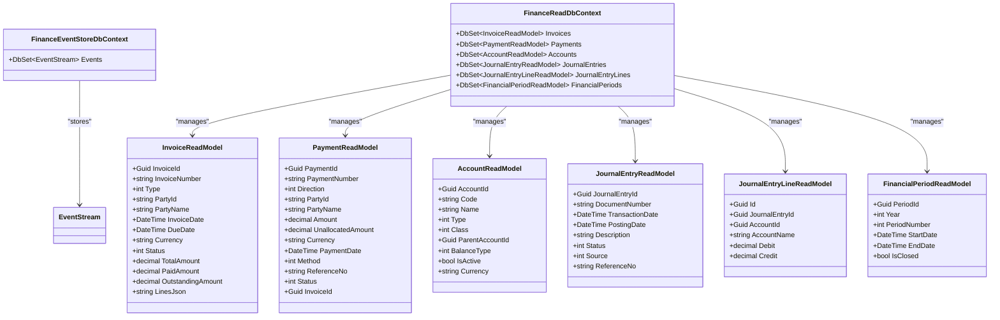

# Relational Schema

<cite>
**Referenced Files in This Document**
- [init.sql](file://infrastructure/init.sql)
- [timescale-init.sql](file://infrastructure/timescale-init.sql)
- [MaterialAggregate.cs](file://src/Services/MasterData/ErpSystem.MasterData/Domain/MaterialAggregate.cs)
- [CustomerAggregate.cs](file://src/Services/MasterData/ErpSystem.MasterData/Domain/CustomerAggregate.cs)
- [SupplierAggregate.cs](file://src/Services/MasterData/ErpSystem.MasterData/Domain/SupplierAggregate.cs)
- [CategoryAggregate.cs](file://src/Services/MasterData/ErpSystem.MasterData/Domain/CategoryAggregate.cs)
- [MaterialProjections.cs](file://src/Services/MasterData/ErpSystem.MasterData/Infrastructure/MaterialProjections.cs)
- [EventStore.cs (MasterData)](file://src/Services/MasterData/ErpSystem.MasterData/Infrastructure/EventStore.cs)
- [EventStore.cs (Identity)](file://src/Services/Identity/ErpSystem.Identity/Infrastructure/EventStore.cs)
- [Persistence.cs (Finance)](file://src/Services/Finance/ErpSystem.Finance/Infrastructure/Persistence.cs)
- [EmployeeAggregate.cs](file://src/Services/HR/ErpSystem.HR/Domain/EmployeeAggregate.cs)
- [InventoryItemAggregate.cs](file://src/Services/Inventory/ErpSystem.Inventory/Domain/InventoryItemAggregate.cs)
- [PurchaseOrderAggregate.cs](file://src/Services/Procurement/ErpSystem.Procurement/Domain/PurchaseOrderAggregate.cs)
- [SalesOrderAggregate.cs](file://src/Services/Sales/ErpSystem.Sales/Domain/SalesOrderAggregate.cs)
- [ProductionOrderAggregate.cs](file://src/Services/Production/ErpSystem.Production/Domain/ProductionOrderAggregate.cs)
- [appsettings.json (MasterData)](file://src/Services/MasterData/ErpSystem.MasterData/appsettings.Development.json)
- [appsettings.json (Finance)](file://src/Services/Finance/ErpSystem.Finance/appsettings.json)
- [appsettings.json (Sales)](file://src/Services/Sales/ErpSystem.Sales/appsettings.json)
- [appsettings.json (Analytics)](file://src/Services/Analytics/ErpSystem.Analytics/appsettings.json)
- [TimescaleDataExtractor.cs](file://src/Services/Analytics/ErpSystem.Analytics/Infrastructure/TimescaleDataExtractor.cs)
</cite>

## Table of Contents
1. [Introduction](#introduction)
2. [Project Structure](#project-structure)
3. [Core Components](#core-components)
4. [Architecture Overview](#architecture-overview)
5. [Detailed Component Analysis](#detailed-component-analysis)
6. [Dependency Analysis](#dependency-analysis)
7. [Performance Considerations](#performance-considerations)
8. [Troubleshooting Guide](#troubleshooting-guide)
9. [Conclusion](#conclusion)
10. [Appendices](#appendices)

## Introduction
This document provides comprehensive relational schema documentation for the ERP microservice system’s PostgreSQL databases. The system follows a database-per-service architecture with dedicated schemas for each microservice. It documents the master data structures for materials, customers, suppliers, and categories; financial ledger tables; inventory tracking tables; and HR employee records. It also explains indexing strategies, primary keys, and referential integrity constraints used across the system.

## Project Structure
The repository organizes microservices under src/Services/<ServiceName>, each with:
- Domain aggregates and events
- Infrastructure persistence (Entity Framework Core contexts)
- Read models and projections
- Configuration for connection strings

Key databases are provisioned by infrastructure scripts and used by services as described below.

**Diagram sources**
- [init.sql](file://infrastructure/init.sql#L1-L9)
- [timescale-init.sql](file://infrastructure/timescale-init.sql#L1-L140)

**Section sources**
- [init.sql](file://infrastructure/init.sql#L1-L9)
- [timescale-init.sql](file://infrastructure/timescale-init.sql#L1-L140)

## Core Components
This section outlines the core relational components and their roles across services.

- Identity service
  - Event-sourced event store using jsonb payloads
  - Stores audit/event streams keyed by aggregate and version

- Master Data service
  - Material, customer, supplier, category aggregates
  - Projection handlers update read models for master data

- Finance service
  - Event-sourced event store for financial events
  - Read models for invoices, payments, GL accounts, journal entries, and periods

- Procurement service
  - Purchase order aggregate with lifecycle and line items

- Inventory service
  - Inventory item aggregate tracking on-hand, reserved quantities, FIFO batches

- Sales service
  - Sales order aggregate with lifecycle and shipment processing

- Production service
  - Production order aggregate with consumption and completion reporting

- HR service
  - Employee aggregate with hiring, transfers, promotions, and termination

- Analytics service
  - TimescaleDB hypertables for inventory transactions and cost movements
  - Continuous aggregates and retention policies for time-series analytics

**Section sources**
- [EventStore.cs (Identity)](file://src/Services/Identity/ErpSystem.Identity/Infrastructure/EventStore.cs#L1-L20)
- [MaterialAggregate.cs](file://src/Services/MasterData/ErpSystem.MasterData/Domain/MaterialAggregate.cs#L1-L178)
- [MaterialProjections.cs](file://src/Services/MasterData/ErpSystem.MasterData/Infrastructure/MaterialProjections.cs#L1-L75)
- [Persistence.cs (Finance)](file://src/Services/Finance/ErpSystem.Finance/Infrastructure/Persistence.cs#L1-L132)
- [PurchaseOrderAggregate.cs](file://src/Services/Procurement/ErpSystem.Procurement/Domain/PurchaseOrderAggregate.cs#L1-L199)
- [InventoryItemAggregate.cs](file://src/Services/Inventory/ErpSystem.Inventory/Domain/InventoryItemAggregate.cs#L1-L255)
- [SalesOrderAggregate.cs](file://src/Services/Sales/ErpSystem.Sales/Domain/SalesOrderAggregate.cs#L1-L148)
- [ProductionOrderAggregate.cs](file://src/Services/Production/ErpSystem.Production/Domain/ProductionOrderAggregate.cs#L1-L142)
- [EmployeeAggregate.cs](file://src/Services/HR/ErpSystem.HR/Domain/EmployeeAggregate.cs#L1-L151)
- [timescale-init.sql](file://infrastructure/timescale-init.sql#L1-L140)

## Architecture Overview
The system employs a polyglot persistence model:
- Each microservice maintains its own PostgreSQL database.
- Event-sourced services persist domain events to an event store table with composite primary keys.
- Read models mirror domain state for efficient querying.
- Analytics leverages TimescaleDB for time-series optimization.

**Diagram sources**
- [EventStore.cs (MasterData)](file://src/Services/MasterData/ErpSystem.MasterData/Infrastructure/EventStore.cs#L1-L19)
- [EventStore.cs (Identity)](file://src/Services/Identity/ErpSystem.Identity/Infrastructure/EventStore.cs#L1-L20)
- [Persistence.cs (Finance)](file://src/Services/Finance/ErpSystem.Finance/Infrastructure/Persistence.cs#L1-L132)
- [timescale-init.sql](file://infrastructure/timescale-init.sql#L14-L84)

## Detailed Component Analysis

### Identity Service (identitydb)
- Event store table
  - Composite primary key: (AggregateId, Version)
  - Payload stored as jsonb
- Purpose: Persist domain events for identity and access control

**Diagram sources**
- [EventStore.cs (Identity)](file://src/Services/Identity/ErpSystem.Identity/Infrastructure/EventStore.cs#L6-L17)

**Section sources**
- [EventStore.cs (Identity)](file://src/Services/Identity/ErpSystem.Identity/Infrastructure/EventStore.cs#L1-L20)

### Master Data Service (masterdatadb)
- Aggregates
  - Material: code, name, type, unit of measure, category, cost details, attributes, status
  - Customer, Supplier, Category: partner and classification entities
- Event-sourced event store
  - Composite primary key: (AggregateId, Version), payload as jsonb
- Projections
  - Handlers update read models for materials and other master entities

**Diagram sources**
- [MaterialAggregate.cs](file://src/Services/MasterData/ErpSystem.MasterData/Domain/MaterialAggregate.cs#L84-L178)
- [MaterialProjections.cs](file://src/Services/MasterData/ErpSystem.MasterData/Infrastructure/MaterialProjections.cs#L7-L75)

**Section sources**
- [MaterialAggregate.cs](file://src/Services/MasterData/ErpSystem.MasterData/Domain/MaterialAggregate.cs#L1-L178)
- [MaterialProjections.cs](file://src/Services/MasterData/ErpSystem.MasterData/Infrastructure/MaterialProjections.cs#L1-L75)
- [EventStore.cs (MasterData)](file://src/Services/MasterData/ErpSystem.MasterData/Infrastructure/EventStore.cs#L1-L19)

### Finance Service (financedb)
- Event-sourced event store
  - Composite primary key: (AggregateId, Version), payload as jsonb
- Read models
  - Invoices: invoice number, party, dates, currency, amounts, status, lines as jsonb
  - Payments: payment number, direction, party, amount, allocation, status
  - General Ledger: accounts, journal entries, journal entry lines, financial periods
  - Indexes: journal entry lines indexed by JournalEntryId and AccountId for reporting

**Diagram sources**
- [Persistence.cs (Finance)](file://src/Services/Finance/ErpSystem.Finance/Infrastructure/Persistence.cs#L6-L132)

**Section sources**
- [Persistence.cs (Finance)](file://src/Services/Finance/ErpSystem.Finance/Infrastructure/Persistence.cs#L1-L132)

### Procurement Service (procurementdb)
- Purchase order aggregate
  - Lifecycle: draft → pending approval → approved → sent → partially/fully received → closed/cancelled
  - Lines include material, quantities, pricing, warehouse assignment, required date
  - Receipt processing updates received quantities and status

**Diagram sources**
- [PurchaseOrderAggregate.cs](file://src/Services/Procurement/ErpSystem.Procurement/Domain/PurchaseOrderAggregate.cs#L85-L199)

**Section sources**
- [PurchaseOrderAggregate.cs](file://src/Services/Procurement/ErpSystem.Procurement/Domain/PurchaseOrderAggregate.cs#L1-L199)

### Inventory Service (inventorydb)
- Inventory item aggregate
  - Tracks on-hand and reserved quantities
  - FIFO batch valuation with Received/Issued/Adjusted events
  - Supports transfers, reservations, and adjustments

**Diagram sources**
- [InventoryItemAggregate.cs](file://src/Services/Inventory/ErpSystem.Inventory/Domain/InventoryItemAggregate.cs#L91-L255)

**Section sources**
- [InventoryItemAggregate.cs](file://src/Services/Inventory/ErpSystem.Inventory/Domain/InventoryItemAggregate.cs#L1-L255)

### Sales Service (salesdb)
- Sales order aggregate
  - Lifecycle: draft/pending → confirmed → partially/fully shipped → closed/cancelled
  - Shipment processing updates shipped quantities and status

**Diagram sources**
- [SalesOrderAggregate.cs](file://src/Services/Sales/ErpSystem.Sales/Domain/SalesOrderAggregate.cs#L67-L148)

**Section sources**
- [SalesOrderAggregate.cs](file://src/Services/Sales/ErpSystem.Sales/Domain/SalesOrderAggregate.cs#L1-L148)

### Production Service (productiondb)
- Production order aggregate
  - Lifecycle: created → released → in progress → partially completed → completed → closed
  - Consumption and production reporting update quantities and status

**Diagram sources**
- [ProductionOrderAggregate.cs](file://src/Services/Production/ErpSystem.Production/Domain/ProductionOrderAggregate.cs#L63-L142)

**Section sources**
- [ProductionOrderAggregate.cs](file://src/Services/Production/ErpSystem.Production/Domain/ProductionOrderAggregate.cs#L1-L142)

### HR Service (hrdb)
- Employee aggregate
  - Hiring, transfers, promotions, terminations
  - Maintains department, position, and status

**Diagram sources**
- [EmployeeAggregate.cs](file://src/Services/HR/ErpSystem.HR/Domain/EmployeeAggregate.cs#L76-L151)

**Section sources**
- [EmployeeAggregate.cs](file://src/Services/HR/ErpSystem.HR/Domain/EmployeeAggregate.cs#L1-L151)

### Analytics Service (analyticsdb)
- TimescaleDB hypertables for time-series analytics
  - inventory_transactions_ts: inventory movement events partitioned by time
  - cost_movements_ts: financial cost movements partitioned by time
  - Indexes: material_id/time, warehouse_id/time, source_type/source_id/time
  - Continuous aggregates: daily_inventory_summary
  - Retention policies: 2 years for detailed data
  - Optional compression and gap-filling views for advanced analytics

**Diagram sources**
- [timescale-init.sql](file://infrastructure/timescale-init.sql#L14-L84)

**Section sources**
- [timescale-init.sql](file://infrastructure/timescale-init.sql#L1-L140)
- [TimescaleDataExtractor.cs](file://src/Services/Analytics/ErpSystem.Analytics/Infrastructure/TimescaleDataExtractor.cs#L53-L77)

## Dependency Analysis
- Database-per-service separation ensures loose coupling and independent scaling.
- Event sourcing decouples write models from read models, enabling projections to maintain normalized read tables.
- TimescaleDB enhances analytics performance for inventory and cost movements without impacting operational databases.

**Diagram sources**
- [EventStore.cs (MasterData)](file://src/Services/MasterData/ErpSystem.MasterData/Infrastructure/EventStore.cs#L1-L19)
- [EventStore.cs (Identity)](file://src/Services/Identity/ErpSystem.Identity/Infrastructure/EventStore.cs#L1-L20)
- [Persistence.cs (Finance)](file://src/Services/Finance/ErpSystem.Finance/Infrastructure/Persistence.cs#L1-L132)
- [timescale-init.sql](file://infrastructure/timescale-init.sql#L1-L140)

**Section sources**
- [EventStore.cs (MasterData)](file://src/Services/MasterData/ErpSystem.MasterData/Infrastructure/EventStore.cs#L1-L19)
- [EventStore.cs (Identity)](file://src/Services/Identity/ErpSystem.Identity/Infrastructure/EventStore.cs#L1-L20)
- [Persistence.cs (Finance)](file://src/Services/Finance/ErpSystem.Finance/Infrastructure/Persistence.cs#L1-L132)
- [timescale-init.sql](file://infrastructure/timescale-init.sql#L1-L140)

## Performance Considerations
- TimescaleDB hypertables enable efficient partitioning and aggregation for time-series data.
- Indexes on frequently filtered columns (material_id, warehouse_id, source_type/source_id) improve query performance.
- Continuous aggregates precompute daily summaries to accelerate reporting.
- Retention policies limit storage growth for historical data.
- JSONB fields in event stores support flexible event payloads without schema rigidity.

[No sources needed since this section provides general guidance]

## Troubleshooting Guide
- Ensure TimescaleDB extension is enabled and hypertables are created before querying analytics views.
- Verify connection strings for each service point to the correct database.
- Confirm EnsureCreatedAsync or equivalent initialization steps are executed during service startup for event stores and read models.
- Check projection handlers are running to keep read models up to date after event publishing.

**Section sources**
- [appsettings.json (MasterData)](file://src/Services/MasterData/ErpSystem.MasterData/appsettings.Development.json#L8-L10)
- [appsettings.json (Finance)](file://src/Services/Finance/ErpSystem.Finance/appsettings.json#L8-L10)
- [appsettings.json (Sales)](file://src/Services/Sales/ErpSystem.Sales/appsettings.json#L8-L10)
- [appsettings.json (Analytics)](file://src/Services/Analytics/ErpSystem.Analytics/appsettings.json#L8-L10)
- [timescale-init.sql](file://infrastructure/timescale-init.sql#L1-L140)

## Conclusion
The ERP system’s relational schema emphasizes service isolation, event-driven architecture, and time-series analytics. Each microservice maintains its own database with event-sourced writes and denormalized read models. TimescaleDB optimizes analytics workloads, while robust indexing and continuous aggregates deliver responsive reporting. This design supports scalability, maintainability, and real-time insights across the enterprise.

[No sources needed since this section summarizes without analyzing specific files]

## Appendices

### Database and Connection Strings
- identitydb: Identity service event store
- masterdatadb: Master data aggregates and read models
- procurementdb: Purchase orders and receipts
- financedb: Financial events, invoices, payments, GL
- inventorydb: Inventory items and transactions
- salesdb: Sales orders and shipments
- productiondb: Production orders and reports
- hrdb: Employee records
- analyticsdb: TimescaleDB for time-series analytics

**Section sources**
- [init.sql](file://infrastructure/init.sql#L1-L9)
- [appsettings.json (MasterData)](file://src/Services/MasterData/ErpSystem.MasterData/appsettings.Development.json#L8-L10)
- [appsettings.json (Finance)](file://src/Services/Finance/ErpSystem.Finance/appsettings.json#L8-L10)
- [appsettings.json (Sales)](file://src/Services/Sales/ErpSystem.Sales/appsettings.json#L8-L10)
- [appsettings.json (Analytics)](file://src/Services/Analytics/ErpSystem.Analytics/appsettings.json#L8-L10)