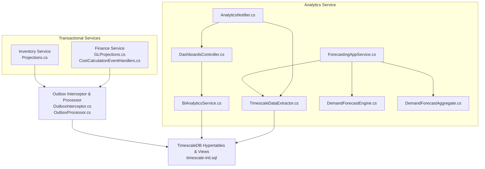
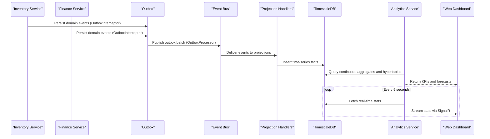
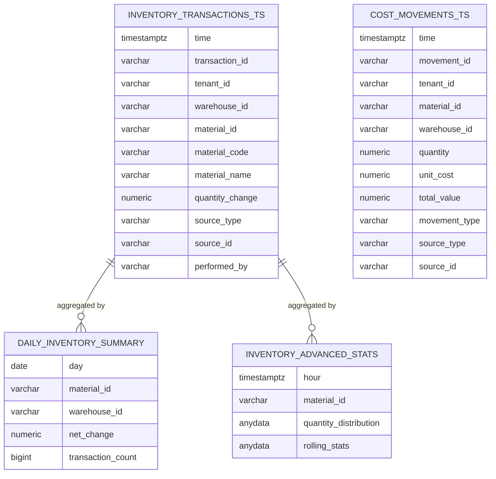
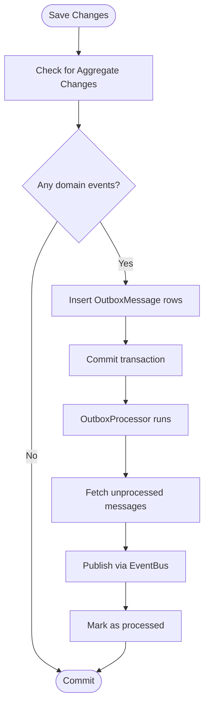
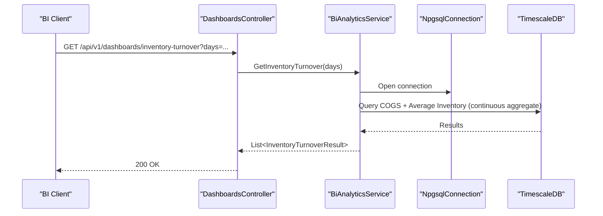
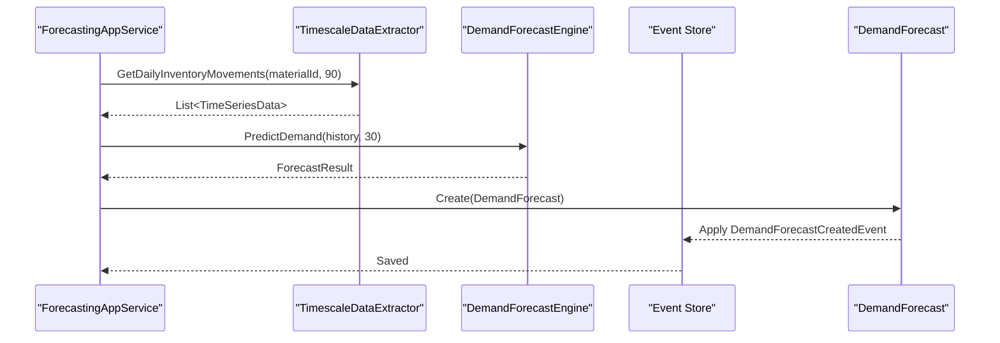
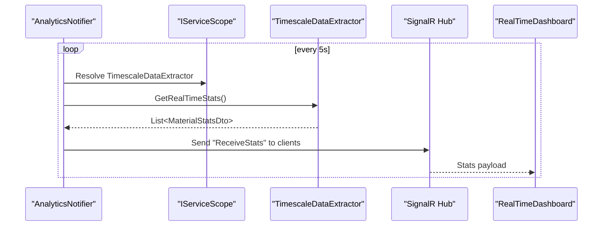
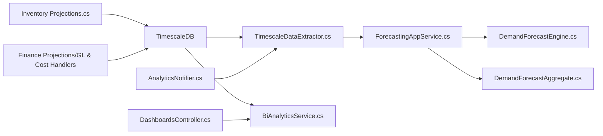

# Time-Series Analytics

<cite>
**Referenced Files in This Document**
- [timescale-init.sql](file://infrastructure/timescale-init.sql)
- [TimescaleDataExtractor.cs](file://src/Services/Analytics/ErpSystem.Analytics/Infrastructure/TimescaleDataExtractor.cs)
- [BiAnalyticsService.cs](file://src/Services/Analytics/ErpSystem.Analytics/Infrastructure/BiAnalyticsService.cs)
- [ForecastingAppService.cs](file://src/Services/Analytics/ErpSystem.Analytics/Application/ForecastingAppService.cs)
- [DemandForecastEngine.cs](file://src/Services/Analytics/ErpSystem.Analytics/Infrastructure/DemandForecastEngine.cs)
- [DemandForecastAggregate.cs](file://src/Services/Analytics/ErpSystem.Analytics/Domain/DemandForecastAggregate.cs)
- [DashboardsController.cs](file://src/Services/Analytics/ErpSystem.Analytics/API/DashboardsController.cs)
- [AnalyticsNotifier.cs](file://src/Services/Analytics/ErpSystem.Analytics/Infrastructure/BackgroundJobs/AnalyticsNotifier.cs)
- [OutboxProcessor.cs](file://src/BuildingBlocks/ErpSystem.BuildingBlocks/Outbox/OutboxProcessor.cs)
- [OutboxInterceptor.cs](file://src/BuildingBlocks/ErpSystem.BuildingBlocks/Outbox/OutboxInterceptor.cs)
- [Projections.cs](file://src/Services/Inventory/ErpSystem.Inventory/Infrastructure/Projections.cs)
- [GLProjections.cs](file://src/Services/Finance/ErpSystem.Finance/Infrastructure/GLProjections.cs)
- [CostCalculationEventHandlers.cs](file://src/Services/Finance/ErpSystem.Finance/Application/CostCalculationEventHandlers.cs)
- [RealTimeDashboard.tsx](file://src/Web/ErpSystem.Web/src/components/RealTimeDashboard.tsx)
</cite>

## Table of Contents
1. [Introduction](#introduction)
2. [Project Structure](#project-structure)
3. [Core Components](#core-components)
4. [Architecture Overview](#architecture-overview)
5. [Detailed Component Analysis](#detailed-component-analysis)
6. [Dependency Analysis](#dependency-analysis)
7. [Performance Considerations](#performance-considerations)
8. [Troubleshooting Guide](#troubleshooting-guide)
9. [Conclusion](#conclusion)
10. [Appendices](#appendices)

## Introduction
This document explains the TimescaleDB-based time-series analytics implementation used for financial metrics, inventory trends, and operational KPIs. It covers hypertable design with time-based partitioning, compression strategies, retention policies, and the analytics data models. It also documents the ETL pattern from transactional systems to the analytics database, incremental updates, and real-time streaming. Finally, it provides examples of time-series queries, aggregations, and analytical views, and explains how PostgreSQL transactional data integrates with TimescaleDB for comprehensive business insights.

## Project Structure
The analytics stack spans several microservices and building blocks:
- Transactional services publish domain events after processing business operations.
- An outbox pattern persists events and publishes them asynchronously.
- Projection handlers update read-side models and feed TimescaleDB with time-series facts.
- The Analytics service queries TimescaleDB for dashboards, forecasts, and real-time stats.
- A background job streams advanced statistics to the UI via SignalR.

**Diagram sources**
- [Projections.cs](file://src/Services/Inventory/ErpSystem.Inventory/Infrastructure/Projections.cs#L1-L211)
- [GLProjections.cs](file://src/Services/Finance/ErpSystem.Finance/Infrastructure/GLProjections.cs#L1-L151)
- [OutboxInterceptor.cs](file://src/BuildingBlocks/ErpSystem.BuildingBlocks/Outbox/OutboxInterceptor.cs#L1-L51)
- [OutboxProcessor.cs](file://src/BuildingBlocks/ErpSystem.BuildingBlocks/Outbox/OutboxProcessor.cs#L1-L72)
- [timescale-init.sql](file://infrastructure/timescale-init.sql#L1-L140)
- [ForecastingAppService.cs](file://src/Services/Analytics/ErpSystem.Analytics/Application/ForecastingAppService.cs#L1-L42)
- [TimescaleDataExtractor.cs](file://src/Services/Analytics/ErpSystem.Analytics/Infrastructure/TimescaleDataExtractor.cs#L1-L142)
- [BiAnalyticsService.cs](file://src/Services/Analytics/ErpSystem.Analytics/Infrastructure/BiAnalyticsService.cs#L1-L93)
- [DemandForecastEngine.cs](file://src/Services/Analytics/ErpSystem.Analytics/Infrastructure/DemandForecastEngine.cs#L1-L62)
- [DemandForecastAggregate.cs](file://src/Services/Analytics/ErpSystem.Analytics/Domain/DemandForecastAggregate.cs#L1-L69)
- [AnalyticsNotifier.cs](file://src/Services/Analytics/ErpSystem.Analytics/Infrastructure/BackgroundJobs/AnalyticsNotifier.cs#L1-L38)
- [DashboardsController.cs](file://src/Services/Analytics/ErpSystem.Analytics/API/DashboardsController.cs#L1-L26)

**Section sources**
- [timescale-init.sql](file://infrastructure/timescale-init.sql#L1-L140)
- [Projections.cs](file://src/Services/Inventory/ErpSystem.Inventory/Infrastructure/Projections.cs#L1-L211)
- [GLProjections.cs](file://src/Services/Finance/ErpSystem.Finance/Infrastructure/GLProjections.cs#L1-L151)
- [OutboxInterceptor.cs](file://src/BuildingBlocks/ErpSystem.BuildingBlocks/Outbox/OutboxInterceptor.cs#L1-L51)
- [OutboxProcessor.cs](file://src/BuildingBlocks/ErpSystem.BuildingBlocks/Outbox/OutboxProcessor.cs#L1-L72)
- [ForecastingAppService.cs](file://src/Services/Analytics/ErpSystem.Analytics/Application/ForecastingAppService.cs#L1-L42)
- [TimescaleDataExtractor.cs](file://src/Services/Analytics/ErpSystem.Analytics/Infrastructure/TimescaleDataExtractor.cs#L1-L142)
- [BiAnalyticsService.cs](file://src/Services/Analytics/ErpSystem.Analytics/Infrastructure/BiAnalyticsService.cs#L1-L93)
- [DemandForecastEngine.cs](file://src/Services/Analytics/ErpSystem.Analytics/Infrastructure/DemandForecastEngine.cs#L1-L62)
- [DemandForecastAggregate.cs](file://src/Services/Analytics/ErpSystem.Analytics/Domain/DemandForecastAggregate.cs#L1-L69)
- [AnalyticsNotifier.cs](file://src/Services/Analytics/ErpSystem.Analytics/Infrastructure/BackgroundJobs/AnalyticsNotifier.cs#L1-L38)
- [DashboardsController.cs](file://src/Services/Analytics/ErpSystem.Analytics/API/DashboardsController.cs#L1-L26)

## Core Components
- TimescaleDB initialization script defines hypertables, indexes, continuous aggregates, retention, compression, and advanced analytical views.
- TimescaleDataExtractor retrieves time-series data for forecasting and real-time stats.
- BiAnalyticsService computes KPIs (e.g., inventory turnover) using continuous aggregates.
- ForecastingAppService orchestrates demand forecasting using historical time-series from TimescaleDB.
- DemandForecastEngine performs SSA-based forecasting using ML.NET.
- DemandForecastAggregate stores forecast results as domain events.
- AnalyticsNotifier periodically streams advanced statistics to clients via SignalR.
- DashboardsController exposes BI endpoints for dashboards.
- OutboxInterceptor and OutboxProcessor implement asynchronous event publishing.
- Projection handlers in Inventory and Finance services write time-series facts to TimescaleDB.

**Section sources**
- [timescale-init.sql](file://infrastructure/timescale-init.sql#L1-L140)
- [TimescaleDataExtractor.cs](file://src/Services/Analytics/ErpSystem.Analytics/Infrastructure/TimescaleDataExtractor.cs#L1-L142)
- [BiAnalyticsService.cs](file://src/Services/Analytics/ErpSystem.Analytics/Infrastructure/BiAnalyticsService.cs#L1-L93)
- [ForecastingAppService.cs](file://src/Services/Analytics/ErpSystem.Analytics/Application/ForecastingAppService.cs#L1-L42)
- [DemandForecastEngine.cs](file://src/Services/Analytics/ErpSystem.Analytics/Infrastructure/DemandForecastEngine.cs#L1-L62)
- [DemandForecastAggregate.cs](file://src/Services/Analytics/ErpSystem.Analytics/Domain/DemandForecastAggregate.cs#L1-L69)
- [AnalyticsNotifier.cs](file://src/Services/Analytics/ErpSystem.Analytics/Infrastructure/BackgroundJobs/AnalyticsNotifier.cs#L1-L38)
- [DashboardsController.cs](file://src/Services/Analytics/ErpSystem.Analytics/API/DashboardsController.cs#L1-L26)
- [OutboxInterceptor.cs](file://src/BuildingBlocks/ErpSystem.BuildingBlocks/Outbox/OutboxInterceptor.cs#L1-L51)
- [OutboxProcessor.cs](file://src/BuildingBlocks/ErpSystem.BuildingBlocks/Outbox/OutboxProcessor.cs#L1-L72)
- [Projections.cs](file://src/Services/Inventory/ErpSystem.Inventory/Infrastructure/Projections.cs#L1-L211)
- [GLProjections.cs](file://src/Services/Finance/ErpSystem.Finance/Infrastructure/GLProjections.cs#L1-L151)

## Architecture Overview
The system follows an event-driven architecture:
- Transactional services emit domain events after processing operations.
- Outbox persists events and publishes them to the event bus.
- Projection handlers update read-side models and insert time-series facts into TimescaleDB.
- The Analytics service queries TimescaleDB for dashboards, forecasts, and real-time stats.
- A background job pushes advanced statistics to the UI via SignalR.

**Diagram sources**
- [OutboxInterceptor.cs](file://src/BuildingBlocks/ErpSystem.BuildingBlocks/Outbox/OutboxInterceptor.cs#L1-L51)
- [OutboxProcessor.cs](file://src/BuildingBlocks/ErpSystem.BuildingBlocks/Outbox/OutboxProcessor.cs#L1-L72)
- [Projections.cs](file://src/Services/Inventory/ErpSystem.Inventory/Infrastructure/Projections.cs#L1-L211)
- [GLProjections.cs](file://src/Services/Finance/ErpSystem.Finance/Infrastructure/GLProjections.cs#L1-L151)
- [timescale-init.sql](file://infrastructure/timescale-init.sql#L1-L140)
- [TimescaleDataExtractor.cs](file://src/Services/Analytics/ErpSystem.Analytics/Infrastructure/TimescaleDataExtractor.cs#L1-L142)
- [AnalyticsNotifier.cs](file://src/Services/Analytics/ErpSystem.Analytics/Infrastructure/BackgroundJobs/AnalyticsNotifier.cs#L1-L38)
- [DashboardsController.cs](file://src/Services/Analytics/ErpSystem.Analytics/API/DashboardsController.cs#L1-L26)

## Detailed Component Analysis

### Hypertables, Partitioning, Compression, and Retention
- Hypertables:
  - inventory_transactions_ts: time-series of inventory movements with composite primary key (time, transaction_id).
  - cost_movements_ts: time-series of financial cost movements with composite primary key (time, movement_id).
- Time-based partitioning:
  - Both tables are converted to hypertables on the time column.
- Indexes:
  - Material-centric and warehouse-centric indexes to accelerate common analytical queries.
- Continuous aggregates:
  - daily_inventory_summary: pre-aggregated daily net change and transaction counts.
  - inventory_advanced_stats: hourly percentiles and rolling statistics for anomaly detection.
- Retention:
  - Retention policies keep detailed time-series for two years.
- Compression:
  - Columnar compression enabled with segmentby on tenant_id, material_id, warehouse_id and order-by time descending.
  - Automated compression policy targets chunks older than seven days.
- Gap-filling and interpolation:
  - inventory_gapfill_analytics view provides gap-filled daily series using time_bucket_gapfill, locf, and interpolate.

**Diagram sources**
- [timescale-init.sql](file://infrastructure/timescale-init.sql#L14-L84)
- [timescale-init.sql](file://infrastructure/timescale-init.sql#L58-L76)
- [timescale-init.sql](file://infrastructure/timescale-init.sql#L119-L136)

**Section sources**
- [timescale-init.sql](file://infrastructure/timescale-init.sql#L1-L140)

### Data Extraction and ETL Patterns
- Outbox pattern:
  - OutboxInterceptor captures domain events during save and inserts OutboxMessage entities.
  - OutboxProcessor periodically reads unprocessed messages, publishes them via the event bus, and marks them processed.
- Projection handlers:
  - Inventory projections write stock transactions and adjustments to TimescaleDB.
  - Finance projections maintain GL and journal entry read models; cost calculations feed cost_movements_ts.
- Incremental updates:
  - Continuous aggregates refresh last N days on a schedule.
  - Compression policy compresses older chunks automatically.

**Diagram sources**
- [OutboxInterceptor.cs](file://src/BuildingBlocks/ErpSystem.BuildingBlocks/Outbox/OutboxInterceptor.cs#L1-L51)
- [OutboxProcessor.cs](file://src/BuildingBlocks/ErpSystem.BuildingBlocks/Outbox/OutboxProcessor.cs#L1-L72)

**Section sources**
- [OutboxInterceptor.cs](file://src/BuildingBlocks/ErpSystem.BuildingBlocks/Outbox/OutboxInterceptor.cs#L1-L51)
- [OutboxProcessor.cs](file://src/BuildingBlocks/ErpSystem.BuildingBlocks/Outbox/OutboxProcessor.cs#L1-L72)
- [Projections.cs](file://src/Services/Inventory/ErpSystem.Inventory/Infrastructure/Projections.cs#L1-L211)
- [GLProjections.cs](file://src/Services/Finance/ErpSystem.Finance/Infrastructure/GLProjections.cs#L1-L151)
- [CostCalculationEventHandlers.cs](file://src/Services/Finance/ErpSystem.Finance/Application/CostCalculationEventHandlers.cs#L1-L133)

### Analytics Data Models and Queries
- Inventory turnover:
  - COGS computed from cost_movements_ts (issues).
  - Average inventory value from daily_inventory_summary continuous aggregate.
  - Turnover rate derived as COGS / Average Inventory.
- Real-time advanced statistics:
  - inventory_advanced_stats continuous aggregate provides hourly percentiles and rolling stats.
  - TimescaleDB Toolkit functions enable approximate percentile and rolling statistics.
- Daily inventory usage:
  - Aggregated daily absolute sum of quantity_change for issues over a configurable window.

**Diagram sources**
- [DashboardsController.cs](file://src/Services/Analytics/ErpSystem.Analytics/API/DashboardsController.cs#L1-L26)
- [BiAnalyticsService.cs](file://src/Services/Analytics/ErpSystem.Analytics/Infrastructure/BiAnalyticsService.cs#L1-L93)

**Section sources**
- [BiAnalyticsService.cs](file://src/Services/Analytics/ErpSystem.Analytics/Infrastructure/BiAnalyticsService.cs#L1-L93)
- [DashboardsController.cs](file://src/Services/Analytics/ErpSystem.Analytics/API/DashboardsController.cs#L1-L26)

### Forecasting Workflow
- Historical data extraction:
  - TimescaleDataExtractor queries inventory_transactions_ts to produce daily usage series.
- Forecasting:
  - DemandForecastEngine trains an SSA forecasting pipeline and predicts future demand.
- Domain storage:
  - Forecast results are emitted as DemandForecastCreatedEvent and persisted via event store.

**Diagram sources**
- [ForecastingAppService.cs](file://src/Services/Analytics/ErpSystem.Analytics/Application/ForecastingAppService.cs#L1-L42)
- [TimescaleDataExtractor.cs](file://src/Services/Analytics/ErpSystem.Analytics/Infrastructure/TimescaleDataExtractor.cs#L1-L142)
- [DemandForecastEngine.cs](file://src/Services/Analytics/ErpSystem.Analytics/Infrastructure/DemandForecastEngine.cs#L1-L62)
- [DemandForecastAggregate.cs](file://src/Services/Analytics/ErpSystem.Analytics/Domain/DemandForecastAggregate.cs#L1-L69)

**Section sources**
- [ForecastingAppService.cs](file://src/Services/Analytics/ErpSystem.Analytics/Application/ForecastingAppService.cs#L1-L42)
- [TimescaleDataExtractor.cs](file://src/Services/Analytics/ErpSystem.Analytics/Infrastructure/TimescaleDataExtractor.cs#L1-L142)
- [DemandForecastEngine.cs](file://src/Services/Analytics/ErpSystem.Analytics/Infrastructure/DemandForecastEngine.cs#L1-L62)
- [DemandForecastAggregate.cs](file://src/Services/Analytics/ErpSystem.Analytics/Domain/DemandForecastAggregate.cs#L1-L69)

### Real-Time Streaming and UI Integration
- AnalyticsNotifier periodically queries inventory_advanced_stats and broadcasts results to connected clients.
- RealTimeDashboard displays live inventory velocity and receives stats via SignalR hub.

**Diagram sources**
- [AnalyticsNotifier.cs](file://src/Services/Analytics/ErpSystem.Analytics/Infrastructure/BackgroundJobs/AnalyticsNotifier.cs#L1-L38)
- [TimescaleDataExtractor.cs](file://src/Services/Analytics/ErpSystem.Analytics/Infrastructure/TimescaleDataExtractor.cs#L88-L131)
- [RealTimeDashboard.tsx](file://src/Web/ErpSystem.Web/src/components/RealTimeDashboard.tsx#L26-L47)

**Section sources**
- [AnalyticsNotifier.cs](file://src/Services/Analytics/ErpSystem.Analytics/Infrastructure/BackgroundJobs/AnalyticsNotifier.cs#L1-L38)
- [TimescaleDataExtractor.cs](file://src/Services/Analytics/ErpSystem.Analytics/Infrastructure/TimescaleDataExtractor.cs#L88-L131)
- [RealTimeDashboard.tsx](file://src/Web/ErpSystem.Web/src/components/RealTimeDashboard.tsx#L26-L47)

## Dependency Analysis
- Coupling:
  - Analytics service depends on TimescaleDB via TimescaleDataExtractor and BiAnalyticsService.
  - ForecastingAppService composes TimescaleDataExtractor and DemandForecastEngine.
  - Projection handlers depend on TimescaleDB schema defined in timescale-init.sql.
- Cohesion:
  - Each service encapsulates its own read models and projections.
- External dependencies:
  - TimescaleDB extension and Toolkit functions for advanced analytics.
  - ML.NET for SSA forecasting.
  - SignalR for real-time UI updates.

**Diagram sources**
- [Projections.cs](file://src/Services/Inventory/ErpSystem.Inventory/Infrastructure/Projections.cs#L1-L211)
- [GLProjections.cs](file://src/Services/Finance/ErpSystem.Finance/Infrastructure/GLProjections.cs#L1-L151)
- [CostCalculationEventHandlers.cs](file://src/Services/Finance/ErpSystem.Finance/Application/CostCalculationEventHandlers.cs#L1-L133)
- [timescale-init.sql](file://infrastructure/timescale-init.sql#L1-L140)
- [TimescaleDataExtractor.cs](file://src/Services/Analytics/ErpSystem.Analytics/Infrastructure/TimescaleDataExtractor.cs#L1-L142)
- [BiAnalyticsService.cs](file://src/Services/Analytics/ErpSystem.Analytics/Infrastructure/BiAnalyticsService.cs#L1-L93)
- [ForecastingAppService.cs](file://src/Services/Analytics/ErpSystem.Analytics/Application/ForecastingAppService.cs#L1-L42)
- [DemandForecastEngine.cs](file://src/Services/Analytics/ErpSystem.Analytics/Infrastructure/DemandForecastEngine.cs#L1-L62)
- [DemandForecastAggregate.cs](file://src/Services/Analytics/ErpSystem.Analytics/Domain/DemandForecastAggregate.cs#L1-L69)
- [AnalyticsNotifier.cs](file://src/Services/Analytics/ErpSystem.Analytics/Infrastructure/BackgroundJobs/AnalyticsNotifier.cs#L1-L38)
- [DashboardsController.cs](file://src/Services/Analytics/ErpSystem.Analytics/API/DashboardsController.cs#L1-L26)

**Section sources**
- [Projections.cs](file://src/Services/Inventory/ErpSystem.Inventory/Infrastructure/Projections.cs#L1-L211)
- [GLProjections.cs](file://src/Services/Finance/ErpSystem.Finance/Infrastructure/GLProjections.cs#L1-L151)
- [CostCalculationEventHandlers.cs](file://src/Services/Finance/ErpSystem.Finance/Application/CostCalculationEventHandlers.cs#L1-L133)
- [timescale-init.sql](file://infrastructure/timescale-init.sql#L1-L140)
- [TimescaleDataExtractor.cs](file://src/Services/Analytics/ErpSystem.Analytics/Infrastructure/TimescaleDataExtractor.cs#L1-L142)
- [BiAnalyticsService.cs](file://src/Services/Analytics/ErpSystem.Analytics/Infrastructure/BiAnalyticsService.cs#L1-L93)
- [ForecastingAppService.cs](file://src/Services/Analytics/ErpSystem.Analytics/Application/ForecastingAppService.cs#L1-L42)
- [DemandForecastEngine.cs](file://src/Services/Analytics/ErpSystem.Analytics/Infrastructure/DemandForecastEngine.cs#L1-L62)
- [DemandForecastAggregate.cs](file://src/Services/Analytics/ErpSystem.Analytics/Domain/DemandForecastAggregate.cs#L1-L69)
- [AnalyticsNotifier.cs](file://src/Services/Analytics/ErpSystem.Analytics/Infrastructure/BackgroundJobs/AnalyticsNotifier.cs#L1-L38)
- [DashboardsController.cs](file://src/Services/Analytics/ErpSystem.Analytics/API/DashboardsController.cs#L1-L26)

## Performance Considerations
- Partition pruning:
  - Hypertables with time partitioning ensure efficient pruning of old partitions.
- Columnar compression:
  - Reduces storage and I/O for historical data; configure segmentby to align with analytical filters.
- Continuous aggregates:
  - Pre-aggregations minimize runtime computation for dashboards and reports.
- Indexing:
  - Material and warehouse indexes accelerate filtering in analytical queries.
- Chunk sizing and retention:
  - Tune chunk time intervals and retention windows to balance query performance and storage costs.
- Streaming cadence:
  - Adjust background job interval to balance freshness and load.

[No sources needed since this section provides general guidance]

## Troubleshooting Guide
- Toolkit functions unavailable:
  - inventory_advanced_stats relies on TimescaleDB Toolkit. If unavailable, TimescaleDataExtractor.GetRealTimeStats falls back gracefully and returns empty results.
- Missing continuous aggregates:
  - Ensure continuous aggregate policies are configured and refreshed; verify refresh windows and schedule.
- Compression policy:
  - Confirm compression policy applies to hypertables and that chunks older than the threshold are compressed.
- Outbox delivery:
  - Verify OutboxProcessor is running and that events are being published; inspect failed messages and logs.
- Connection strings:
  - Ensure AnalyticsConnection is configured correctly for TimescaleDB connectivity.

**Section sources**
- [TimescaleDataExtractor.cs](file://src/Services/Analytics/ErpSystem.Analytics/Infrastructure/TimescaleDataExtractor.cs#L123-L128)
- [timescale-init.sql](file://infrastructure/timescale-init.sql#L71-L76)
- [timescale-init.sql](file://infrastructure/timescale-init.sql#L99-L100)
- [OutboxProcessor.cs](file://src/BuildingBlocks/ErpSystem.BuildingBlocks/Outbox/OutboxProcessor.cs#L1-L72)

## Conclusion
The system leverages TimescaleDB’s native time-series capabilities—hypertables, continuous aggregates, compression, and advanced analytics—to deliver scalable analytics for inventory, financial metrics, and operational KPIs. The event-driven ETL pipeline ensures incremental updates from transactional services, while the Analytics service provides dashboards, forecasting, and real-time streaming. Together, these components enable comprehensive business insights grounded in reliable, time-aware analytics.

[No sources needed since this section summarizes without analyzing specific files]

## Appendices

### Example Queries and Aggregations
- Daily inventory usage (issues only):
  - time_bucket('1 day', time), ABS(SUM(quantity_change))
- Daily cash flow:
  - time_bucket('1 day', time), SUM(total_value)
- Inventory turnover:
  - COGS from cost_movements_ts (issues) joined with average inventory from daily_inventory_summary
- Real-time stats:
  - approx_percentile(quantity_distribution, 0.5), average(rolling_stats), stddev(rolling_stats)

**Section sources**
- [TimescaleDataExtractor.cs](file://src/Services/Analytics/ErpSystem.Analytics/Infrastructure/TimescaleDataExtractor.cs#L23-L32)
- [TimescaleDataExtractor.cs](file://src/Services/Analytics/ErpSystem.Analytics/Infrastructure/TimescaleDataExtractor.cs#L61-L68)
- [BiAnalyticsService.cs](file://src/Services/Analytics/ErpSystem.Analytics/Infrastructure/BiAnalyticsService.cs#L24-L51)
- [TimescaleDataExtractor.cs](file://src/Services/Analytics/ErpSystem.Analytics/Infrastructure/TimescaleDataExtractor.cs#L98-L108)