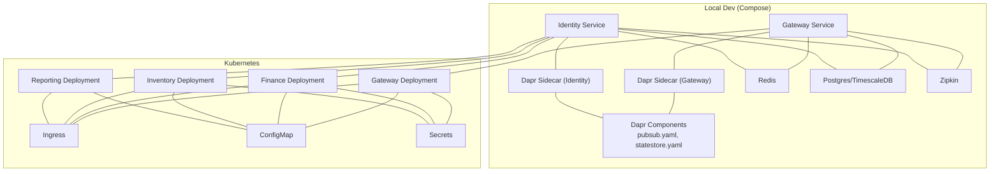
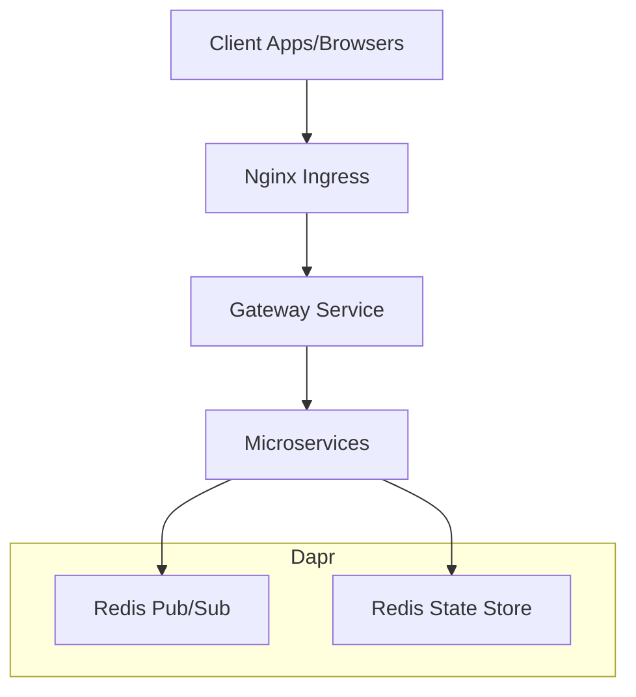
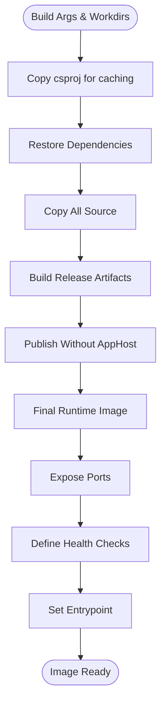
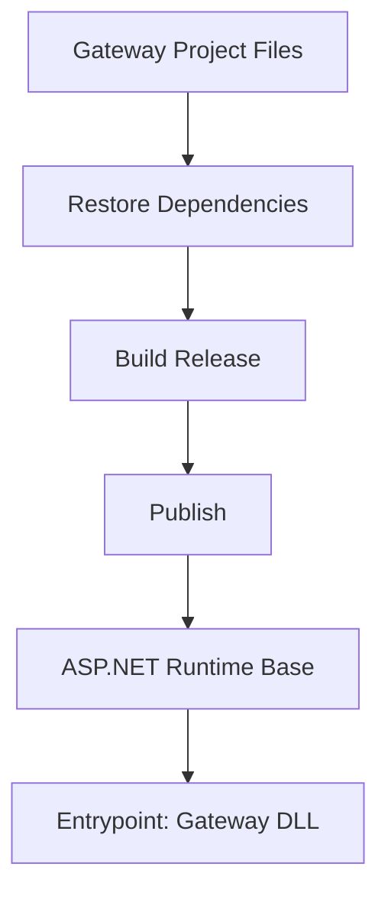
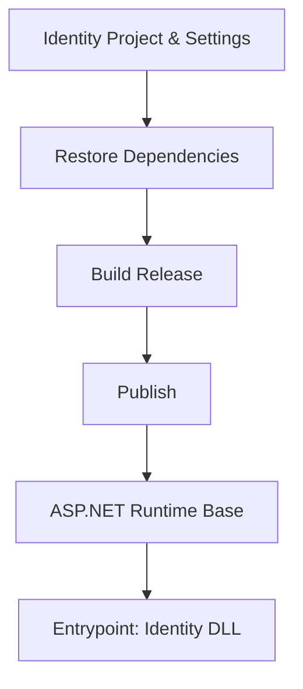
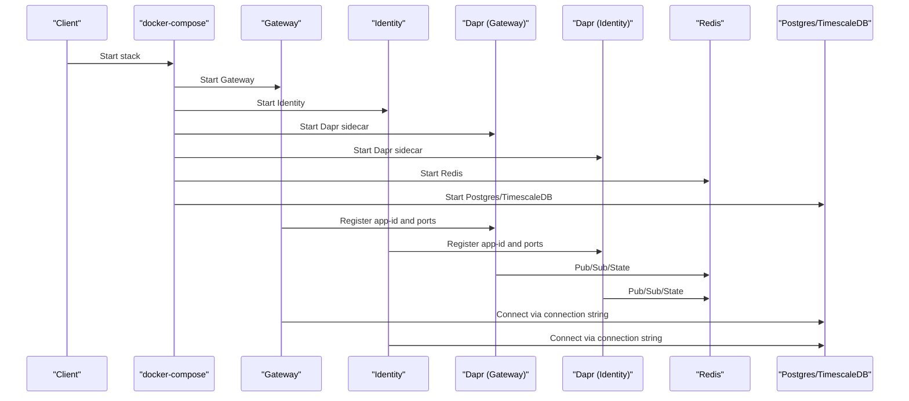
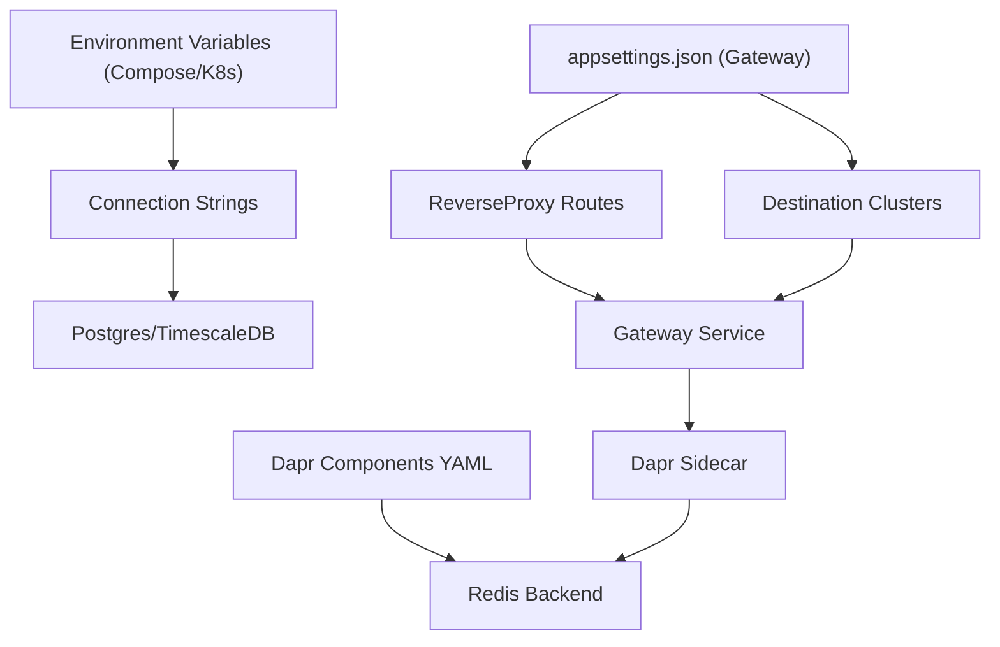
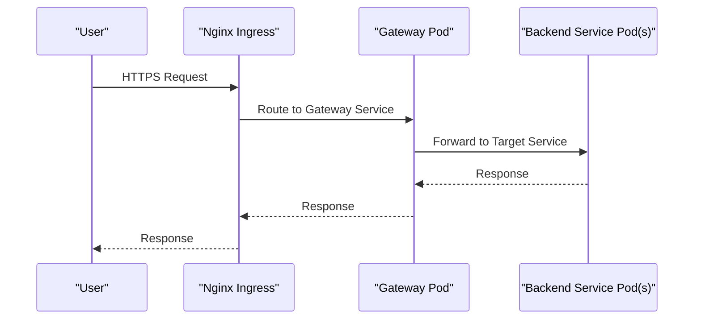
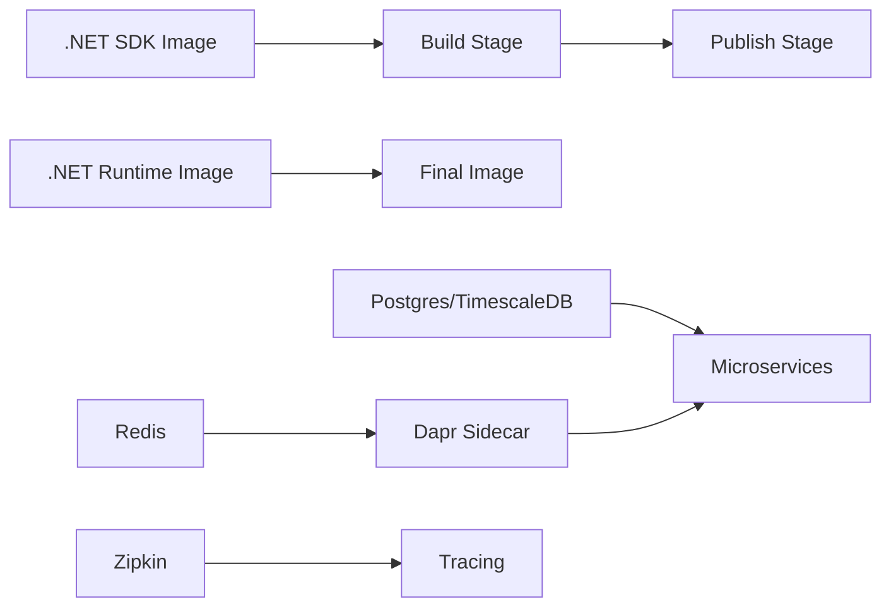

# Containerization and Docker

<cite>
**Referenced Files in This Document**
- [Dockerfile](file://Dockerfile)
- [docker-compose.yml](file://docker-compose.yml)
- [.dockerignore](file://src/.dockerignore)
- [ErpSystem.Gateway Dockerfile](file://src/Gateways/ErpSystem.Gateway/Dockerfile)
- [ErpSystem.Identity Dockerfile](file://src/Services/Identity/ErpSystem.Identity/Dockerfile)
- [Gateway appsettings.json](file://src/Gateways/ErpSystem.Gateway/appsettings.json)
- [Identity appsettings.json](file://src/Services/Identity/ErpSystem.Identity/appsettings.json)
- [pubsub.yaml](file://components/pubsub.yaml)
- [statestore.yaml](file://components/statestore.yaml)
- [Kubernetes Finance Deployment](file://deploy/k8s/services/finance.yaml)
- [Kubernetes Gateway Deployment](file://deploy/k8s/services/gateway.yaml)
- [Kubernetes Inventory Deployment](file://deploy/k8s/services/inventory.yaml)
- [Kubernetes Reporting Deployment](file://deploy/k8s/services/reporting.yaml)
- [Kubernetes Ingress](file://deploy/k8s/ingress.yaml)
</cite>

## Table of Contents
1. [Introduction](#introduction)
2. [Project Structure](#project-structure)
3. [Core Components](#core-components)
4. [Architecture Overview](#architecture-overview)
5. [Detailed Component Analysis](#detailed-component-analysis)
6. [Dependency Analysis](#dependency-analysis)
7. [Performance Considerations](#performance-considerations)
8. [Troubleshooting Guide](#troubleshooting-guide)
9. [Conclusion](#conclusion)
10. [Appendices](#appendices)

## Introduction
This document provides comprehensive containerization guidance for the ERP microservices system. It covers Dockerfile configurations (including multi-stage builds), docker-compose orchestration for local development, image building and tagging strategies, registry management, container networking and volumes, environment variable configuration, and best practices for image size optimization, security hardening, and dependency management. It also outlines local development workflows and production deployment strategies using Kubernetes manifests.

## Project Structure
The repository includes:
- A shared multi-stage Dockerfile for building all microservices with a single build argument to select the service.
- Individual service-specific Dockerfiles for the Gateway and Identity services.
- A docker-compose orchestration for local development including Dapr sidecars, Redis, Postgres/TimescaleDB, and Zipkin.
- Kubernetes manifests for deploying services with Dapr sidecars, probes, and an Ingress.

**Diagram sources**
- [docker-compose.yml](file://docker-compose.yml#L1-L99)
- [pubsub.yaml](file://components/pubsub.yaml#L1-L13)
- [statestore.yaml](file://components/statestore.yaml#L1-L13)
- [Kubernetes Gateway Deployment](file://deploy/k8s/services/gateway.yaml#L1-L60)
- [Kubernetes Finance Deployment](file://deploy/k8s/services/finance.yaml#L1-L66)
- [Kubernetes Inventory Deployment](file://deploy/k8s/services/inventory.yaml#L1-L66)
- [Kubernetes Reporting Deployment](file://deploy/k8s/services/reporting.yaml#L1-L64)
- [Kubernetes Ingress](file://deploy/k8s/ingress.yaml#L1-L37)

**Section sources**
- [Dockerfile](file://Dockerfile#L1-L37)
- [docker-compose.yml](file://docker-compose.yml#L1-L99)
- [.dockerignore](file://src/.dockerignore#L1-L20)

## Core Components
- Shared multi-stage Dockerfile for microservices:
  - Uses a build argument to select the service folder.
  - Copies project files for layer caching, restores dependencies, builds, publishes, and runs from a minimal runtime image.
  - Exposes ports and defines health checks.
- Service-specific Dockerfiles:
  - Gateway and Identity include explicit appsettings copying during build for configuration-driven behavior.
- docker-compose orchestration:
  - Defines services for Gateway and Identity, Dapr sidecars, Redis, Postgres/TimescaleDB, and Zipkin.
  - Configures environment variables, port mappings, volumes, and inter-service dependencies.
- Kubernetes manifests:
  - Deployments enable Dapr sidecars via annotations, define probes, resource requests/limits, and inject config/secrets.
  - An Ingress routes traffic to the Gateway and selected backend services.

**Section sources**
- [Dockerfile](file://Dockerfile#L1-L37)
- [ErpSystem.Gateway Dockerfile](file://src/Gateways/ErpSystem.Gateway/Dockerfile#L1-L22)
- [ErpSystem.Identity Dockerfile](file://src/Services/Identity/ErpSystem.Identity/Dockerfile#L1-L24)
- [docker-compose.yml](file://docker-compose.yml#L1-L99)
- [Kubernetes Gateway Deployment](file://deploy/k8s/services/gateway.yaml#L1-L60)
- [Kubernetes Finance Deployment](file://deploy/k8s/services/finance.yaml#L1-L66)
- [Kubernetes Inventory Deployment](file://deploy/k8s/services/inventory.yaml#L1-L66)
- [Kubernetes Reporting Deployment](file://deploy/k8s/services/reporting.yaml#L1-L64)
- [Kubernetes Ingress](file://deploy/k8s/ingress.yaml#L1-L37)

## Architecture Overview
The system uses a polyglot microservices architecture with .NET services behind a reverse proxy/Gateway. Local development leverages Docker Compose with Dapr sidecars for service invocation and pub/sub. Production targets Kubernetes with Dapr sidecars, Ingress for routing, and ConfigMaps/Secrets for configuration.

**Diagram sources**
- [Kubernetes Ingress](file://deploy/k8s/ingress.yaml#L1-L37)
- [Kubernetes Gateway Deployment](file://deploy/k8s/services/gateway.yaml#L1-L60)
- [pubsub.yaml](file://components/pubsub.yaml#L1-L13)
- [statestore.yaml](file://components/statestore.yaml#L1-L13)

## Detailed Component Analysis

### Shared Multi-Stage Dockerfile (for all services)
- Build stages:
  - SDK stage: copies project files for layer caching, restores dependencies, builds, and publishes artifacts.
  - Runtime stage: minimal ASP.NET base image, exposes ports, sets health checks, and runs the published DLL.
- Optimization:
  - Layer caching via early copy of csproj files.
  - Single publish with AppHost disabled to reduce image size.
- Entrypoint and health checks:
  - Starts the .NET assembly directly.
  - Health checks probe the standard health endpoints.

**Diagram sources**
- [Dockerfile](file://Dockerfile#L1-L37)

**Section sources**
- [Dockerfile](file://Dockerfile#L1-L37)

### Service-Specific Dockerfiles

#### Gateway Service Dockerfile
- Multi-stage build mirrors the shared approach.
- Publishes the Gateway project and runs the resulting DLL.
- Suitable for reverse proxy behavior.

**Diagram sources**
- [ErpSystem.Gateway Dockerfile](file://src/Gateways/ErpSystem.Gateway/Dockerfile#L1-L22)

**Section sources**
- [ErpSystem.Gateway Dockerfile](file://src/Gateways/ErpSystem.Gateway/Dockerfile#L1-L22)

#### Identity Service Dockerfile
- Multi-stage build with explicit copy of appsettings files during build.
- Publishes the Identity service and runs the DLL.

**Diagram sources**
- [ErpSystem.Identity Dockerfile](file://src/Services/Identity/ErpSystem.Identity/Dockerfile#L1-L24)

**Section sources**
- [ErpSystem.Identity Dockerfile](file://src/Services/Identity/ErpSystem.Identity/Dockerfile#L1-L24)

### docker-compose Orchestration (Local Development)
- Services:
  - identity-api: Hosts the Identity service, configured with ASP.NET URLs and connection strings.
  - identity-api-dapr: Dapr sidecar for Identity with component path and placement address.
  - gateway: Hosts the Gateway service with reverse proxy routes and connections.
  - gateway-dapr: Dapr sidecar for Gateway.
  - placement: Dapr placement service.
  - redis: Dapr pub/sub and state store backend.
  - postgres: TimescaleDB with initialization scripts and persistent volume.
  - zipkin: Distributed tracing backend.
- Networking:
  - All services share a bridge network named erp-network.
- Volumes:
  - Persistent volume for Postgres data.
  - Component mounts for Dapr sidecars.
- Environment variables:
  - ASPNETCORE_URLS and connection strings injected per service.

**Diagram sources**
- [docker-compose.yml](file://docker-compose.yml#L1-L99)

**Section sources**
- [docker-compose.yml](file://docker-compose.yml#L1-L99)

### Configuration and Environment Variables
- Gateway appsettings:
  - ReverseProxy routes and clusters define path-based routing to backend services.
  - Clusters specify destination addresses for each route.
- Identity appsettings:
  - Basic logging and allowed hosts configuration.
- docker-compose environment variables:
  - ASPNETCORE_URLS and connection strings are set per service.
- Kubernetes deployments:
  - ConfigMap and Secret references inject environment variables.
  - Dapr sidecars enabled via pod annotations.

**Diagram sources**
- [Gateway appsettings.json](file://src/Gateways/ErpSystem.Gateway/appsettings.json#L1-L229)
- [Identity appsettings.json](file://src/Services/Identity/ErpSystem.Identity/appsettings.json#L1-L10)
- [docker-compose.yml](file://docker-compose.yml#L11-L13)
- [pubsub.yaml](file://components/pubsub.yaml#L1-L13)
- [statestore.yaml](file://components/statestore.yaml#L1-L13)

**Section sources**
- [Gateway appsettings.json](file://src/Gateways/ErpSystem.Gateway/appsettings.json#L1-L229)
- [Identity appsettings.json](file://src/Services/Identity/ErpSystem.Identity/appsettings.json#L1-L10)
- [docker-compose.yml](file://docker-compose.yml#L11-L13)
- [pubsub.yaml](file://components/pubsub.yaml#L1-L13)
- [statestore.yaml](file://components/statestore.yaml#L1-L13)

### Kubernetes Manifests (Production Deployment)
- Gateway:
  - Deployment with Dapr annotations, probes, resource limits, and ConfigMap injection.
  - Service type LoadBalancer for external exposure.
- Finance/Inventory/Reporting:
  - Deployments with Dapr annotations, probes, resource limits, and ConfigMap/Secret injection.
  - ClusterIP services for internal communication.
- Ingress:
  - Nginx Ingress routes root and report paths to appropriate services.

**Diagram sources**
- [Kubernetes Ingress](file://deploy/k8s/ingress.yaml#L1-L37)
- [Kubernetes Gateway Deployment](file://deploy/k8s/services/gateway.yaml#L1-L60)
- [Kubernetes Finance Deployment](file://deploy/k8s/services/finance.yaml#L1-L66)
- [Kubernetes Inventory Deployment](file://deploy/k8s/services/inventory.yaml#L1-L66)
- [Kubernetes Reporting Deployment](file://deploy/k8s/services/reporting.yaml#L1-L64)

**Section sources**
- [Kubernetes Gateway Deployment](file://deploy/k8s/services/gateway.yaml#L1-L60)
- [Kubernetes Finance Deployment](file://deploy/k8s/services/finance.yaml#L1-L66)
- [Kubernetes Inventory Deployment](file://deploy/k8s/services/inventory.yaml#L1-L66)
- [Kubernetes Reporting Deployment](file://deploy/k8s/services/reporting.yaml#L1-L64)
- [Kubernetes Ingress](file://deploy/k8s/ingress.yaml#L1-L37)

## Dependency Analysis
- Build-time dependencies:
  - .NET SDK images for restore and build.
  - Minimal ASP.NET runtime images for final stage.
- Runtime dependencies:
  - Redis for Dapr pub/sub and state.
  - Postgres/TimescaleDB for persistence.
  - Zipkin for distributed tracing.
- Inter-service dependencies:
  - Gateway depends on backend services.
  - Dapr sidecars depend on placement and Redis.
- Kubernetes dependencies:
  - Dapr sidecars require annotations and component volumes.
  - ConfigMaps and Secrets supply environment variables.

**Diagram sources**
- [Dockerfile](file://Dockerfile#L5-L26)
- [docker-compose.yml](file://docker-compose.yml#L57-L91)

**Section sources**
- [Dockerfile](file://Dockerfile#L5-L26)
- [docker-compose.yml](file://docker-compose.yml#L57-L91)

## Performance Considerations
- Image size optimization:
  - Use multi-stage builds to separate build and runtime layers.
  - Publish without an app host to reduce image size.
  - Keep the runtime base image minimal.
- Dependency management:
  - Copy csproj files before source to leverage layer caching.
  - Restore dependencies in a dedicated stage.
- Resource allocation:
  - Set CPU/memory requests/limits in Kubernetes deployments.
  - Configure probes to ensure quick detection of unhealthy pods.
- Network and storage:
  - Use a dedicated bridge network for local dev.
  - Persist Postgres data via volumes.

[No sources needed since this section provides general guidance]

## Troubleshooting Guide
- Health checks failing:
  - Verify health endpoints are exposed and reachable.
  - Confirm health check intervals and timeouts align with service startup time.
- Dapr sidecar registration:
  - Ensure placement service is running and sidecar can reach it.
  - Confirm component paths and metadata values are correct.
- Database connectivity:
  - Validate connection strings and database credentials.
  - Check that Postgres/TimescaleDB is initialized and accepting connections.
- Port conflicts in Compose:
  - Adjust host port mappings to avoid conflicts.
- Kubernetes rollout issues:
  - Review pod logs and events.
  - Verify ConfigMap/Secret references and annotations.

**Section sources**
- [Dockerfile](file://Dockerfile#L31-L33)
- [docker-compose.yml](file://docker-compose.yml#L57-L91)
- [pubsub.yaml](file://components/pubsub.yaml#L1-L13)
- [statestore.yaml](file://components/statestore.yaml#L1-L13)

## Conclusion
The ERP microservices system employs robust containerization practices with multi-stage Dockerfiles, a cohesive docker-compose setup for local development, and Kubernetes manifests for production. Dapr sidecars integrate pub/sub and state capabilities, while reverse proxy routing centralizes API access. Adhering to the outlined best practices ensures secure, efficient, and maintainable deployments across environments.

[No sources needed since this section summarizes without analyzing specific files]

## Appendices

### A. Image Building and Tagging Strategies
- Build the shared multi-stage Dockerfile with a service-specific build argument to produce service-scoped images.
- Tag images consistently (e.g., erp-system/{service}:{version}) and push to a private registry for production.
- Use semantic versioning and immutable tags for reproducible deployments.

**Section sources**
- [Dockerfile](file://Dockerfile#L2-L4)

### B. Registry Management
- Push images to a private registry with access controls.
- Enforce image scanning policies and keep base images updated.
- Use pull secrets in Kubernetes for private registries.

[No sources needed since this section provides general guidance]

### C. Local Development Workflow (Docker Compose)
- Start the stack with compose up.
- Access the Gateway at the mapped host port.
- Use Dapr sidecars for service discovery and pub/sub.
- Persist Postgres data and mount Dapr components.

**Section sources**
- [docker-compose.yml](file://docker-compose.yml#L1-L99)

### D. Production Deployment Strategy (Kubernetes)
- Apply ConfigMaps and Secrets for environment variables.
- Enable Dapr sidecars via pod annotations.
- Configure probes, resource limits, and autoscaling where applicable.
- Use an Ingress controller for external routing.

**Section sources**
- [Kubernetes Gateway Deployment](file://deploy/k8s/services/gateway.yaml#L1-L60)
- [Kubernetes Finance Deployment](file://deploy/k8s/services/finance.yaml#L1-L66)
- [Kubernetes Inventory Deployment](file://deploy/k8s/services/inventory.yaml#L1-L66)
- [Kubernetes Reporting Deployment](file://deploy/k8s/services/reporting.yaml#L1-L64)
- [Kubernetes Ingress](file://deploy/k8s/ingress.yaml#L1-L37)