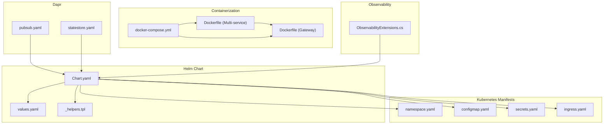
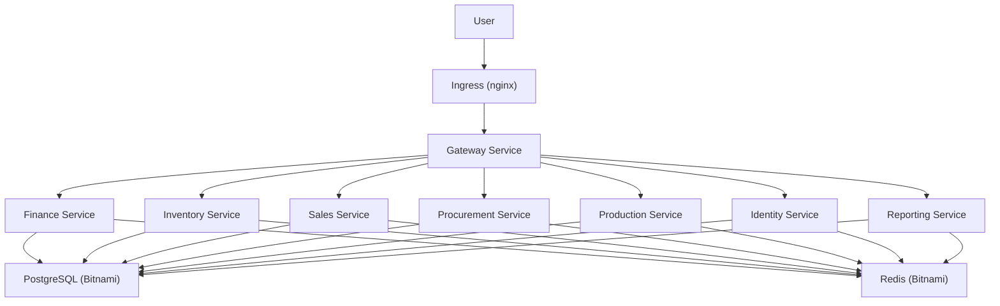
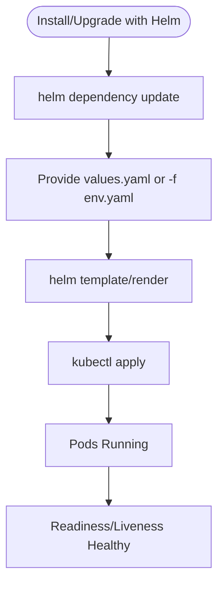
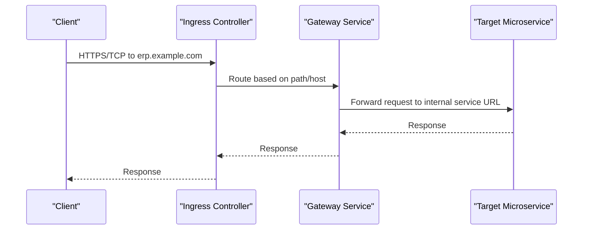
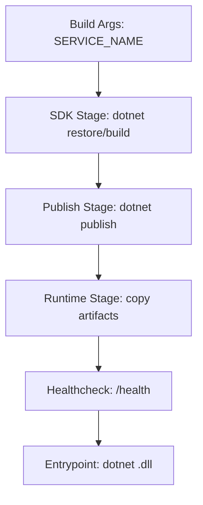
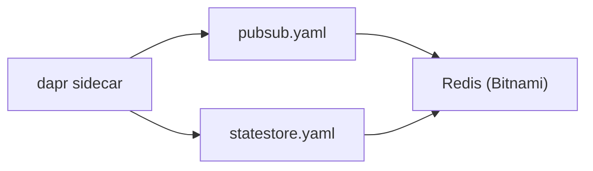
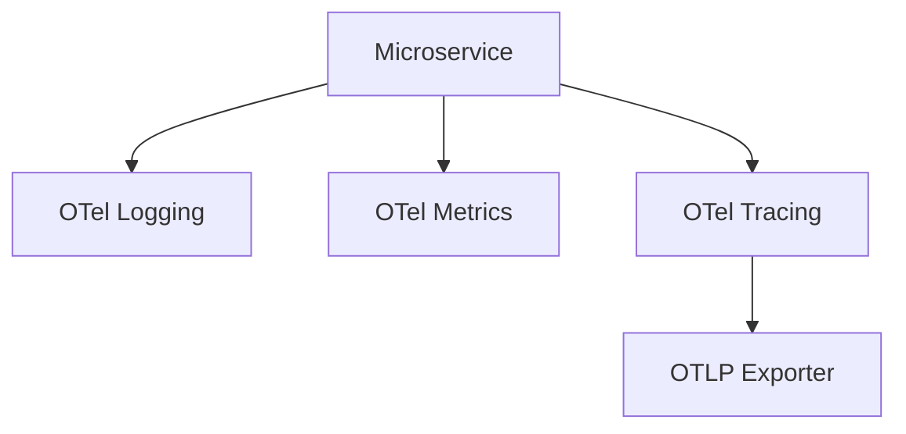
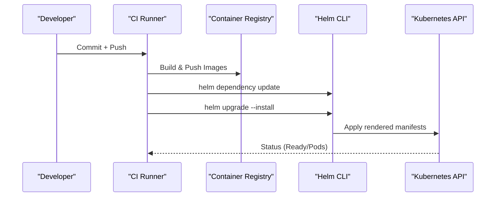
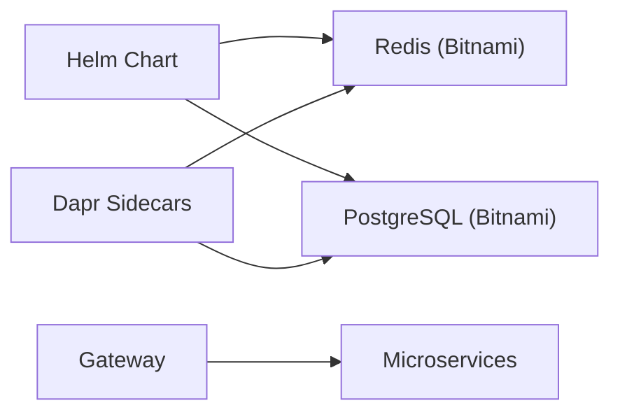

# Deployment and Operations

<cite>
**Referenced Files in This Document**
- [Chart.yaml](file://deploy/helm/erp-system/Chart.yaml)
- [values.yaml](file://deploy/helm/erp-system/values.yaml)
- [_helpers.tpl](file://deploy/helm/erp-system/templates/_helpers.tpl)
- [namespace.yaml](file://deploy/k8s/namespace.yaml)
- [ingress.yaml](file://deploy/k8s/ingress.yaml)
- [configmap.yaml](file://deploy/k8s/configmap.yaml)
- [secrets.yaml](file://deploy/k8s/secrets.yaml)
- [deployment.md](file://docs/deployment.md)
- [Dockerfile](file://Dockerfile)
- [Dockerfile (Gateway)](file://src/Gateways/ErpSystem.Gateway/Dockerfile)
- [docker-compose.yml](file://docker-compose.yml)
- [pubsub.yaml](file://components/pubsub.yaml)
- [statestore.yaml](file://components/statestore.yaml)
- [ObservabilityExtensions.cs](file://src/BuildingBlocks/ErpSystem.BuildingBlocks/Observability/ObservabilityExtensions.cs)
- [appsettings.json (Gateway)](file://src/Gateways/ErpSystem.Gateway/appsettings.json)
</cite>

## Table of Contents
1. [Introduction](#introduction)
2. [Project Structure](#project-structure)
3. [Core Components](#core-components)
4. [Architecture Overview](#architecture-overview)
5. [Detailed Component Analysis](#detailed-component-analysis)
6. [Dependency Analysis](#dependency-analysis)
7. [Performance Considerations](#performance-considerations)
8. [Troubleshooting Guide](#troubleshooting-guide)
9. [Conclusion](#conclusion)
10. [Appendices](#appendices)

## Introduction
This document provides comprehensive deployment and operations guidance for the ERP microservices system. It covers Kubernetes deployment using Helm charts, Docker containerization strategies, CI/CD and release management practices, monitoring and observability, scaling and high availability, and operational troubleshooting procedures. The content is grounded in the repository’s Helm chart, Kubernetes manifests, Dockerfiles, and service configuration files.

## Project Structure
The deployment assets are organized into two primary delivery mechanisms:
- Helm chart for packaged, templated deployments with environment-specific overrides
- Raw Kubernetes manifests for direct application and iterative development

Key directories and files:
- Helm chart: deploy/helm/erp-system
- Kubernetes manifests: deploy/k8s/*
- Containerization: root Dockerfile and per-service Dockerfiles
- Dapr components: components/*
- Gateway routing configuration: src/Gateways/ErpSystem.Gateway/appsettings.json
- Observability: ErpSystem.BuildingBlocks.Observability

**Diagram sources**
- [Chart.yaml](file://deploy/helm/erp-system/Chart.yaml#L1-L27)
- [values.yaml](file://deploy/helm/erp-system/values.yaml#L1-L127)
- [_helpers.tpl](file://deploy/helm/erp-system/templates/_helpers.tpl#L1-L51)
- [namespace.yaml](file://deploy/k8s/namespace.yaml#L1-L8)
- [configmap.yaml](file://deploy/k8s/configmap.yaml#L1-L25)
- [secrets.yaml](file://deploy/k8s/secrets.yaml#L1-L19)
- [ingress.yaml](file://deploy/k8s/ingress.yaml#L1-L37)
- [Dockerfile](file://Dockerfile#L1-L37)
- [Dockerfile (Gateway)](file://src/Gateways/ErpSystem.Gateway/Dockerfile#L1-L22)
- [docker-compose.yml](file://docker-compose.yml#L1-L99)
- [pubsub.yaml](file://components/pubsub.yaml#L1-L13)
- [statestore.yaml](file://components/statestore.yaml#L1-L13)
- [ObservabilityExtensions.cs](file://src/BuildingBlocks/ErpSystem.BuildingBlocks/Observability/ObservabilityExtensions.cs#L1-L44)

**Section sources**
- [Chart.yaml](file://deploy/helm/erp-system/Chart.yaml#L1-L27)
- [values.yaml](file://deploy/helm/erp-system/values.yaml#L1-L127)
- [namespace.yaml](file://deploy/k8s/namespace.yaml#L1-L8)
- [configmap.yaml](file://deploy/k8s/configmap.yaml#L1-L25)
- [secrets.yaml](file://deploy/k8s/secrets.yaml#L1-L19)
- [ingress.yaml](file://deploy/k8s/ingress.yaml#L1-L37)
- [Dockerfile](file://Dockerfile#L1-L37)
- [Dockerfile (Gateway)](file://src/Gateways/ErpSystem.Gateway/Dockerfile#L1-L22)
- [docker-compose.yml](file://docker-compose.yml#L1-L99)
- [pubsub.yaml](file://components/pubsub.yaml#L1-L13)
- [statestore.yaml](file://components/statestore.yaml#L1-L13)
- [ObservabilityExtensions.cs](file://src/BuildingBlocks/ErpSystem.BuildingBlocks/Observability/ObservabilityExtensions.cs#L1-L44)

## Core Components
- Helm chart: Defines the application metadata, dependencies (Redis and PostgreSQL), and default values for services, ingress, databases, and Dapr configuration.
- Kubernetes manifests: Provide namespace scoping, shared configuration via ConfigMap and Secrets, and ingress routing to services.
- Containerization: Multi-stage Dockerfiles produce optimized runtime images with health checks and minimal attack surface.
- Dapr components: Configure Redis-backed pub/sub and state stores for distributed coordination.
- Observability: OpenTelemetry integration for logs, metrics, and traces.

**Section sources**
- [Chart.yaml](file://deploy/helm/erp-system/Chart.yaml#L1-L27)
- [values.yaml](file://deploy/helm/erp-system/values.yaml#L1-L127)
- [namespace.yaml](file://deploy/k8s/namespace.yaml#L1-L8)
- [configmap.yaml](file://deploy/k8s/configmap.yaml#L1-L25)
- [secrets.yaml](file://deploy/k8s/secrets.yaml#L1-L19)
- [Dockerfile](file://Dockerfile#L1-L37)
- [Dockerfile (Gateway)](file://src/Gateways/ErpSystem.Gateway/Dockerfile#L1-L22)
- [pubsub.yaml](file://components/pubsub.yaml#L1-L13)
- [statestore.yaml](file://components/statestore.yaml#L1-L13)
- [ObservabilityExtensions.cs](file://src/BuildingBlocks/ErpSystem.BuildingBlocks/Observability/ObservabilityExtensions.cs#L1-L44)

## Architecture Overview
The system runs on Kubernetes with:
- A central Gateway service routing traffic to backend microservices
- Shared infrastructure: PostgreSQL and Redis managed via the Helm chart
- Dapr-enabled services using Redis for pub/sub and state
- Observability via OpenTelemetry exporters

**Diagram sources**
- [ingress.yaml](file://deploy/k8s/ingress.yaml#L1-L37)
- [appsettings.json (Gateway)](file://src/Gateways/ErpSystem.Gateway/appsettings.json#L1-L229)
- [values.yaml](file://deploy/helm/erp-system/values.yaml#L100-L123)

## Detailed Component Analysis

### Helm Chart: Structure and Configuration
- Chart metadata defines keywords and maintainers and declares Bitnami Redis and PostgreSQL dependencies.
- values.yaml centralizes:
  - Global defaults (image registry, namespace)
  - Common service settings (replicas, resources)
  - Per-service overrides (image repositories/tags, replica counts)
  - Ingress configuration (host, class, TLS)
  - Database and cache enablement and sizing
  - Dapr enablement and component selection
  - Environment variables (e.g., ASPNETCORE_ENVIRONMENT)

**Diagram sources**
- [Chart.yaml](file://deploy/helm/erp-system/Chart.yaml#L1-L27)
- [values.yaml](file://deploy/helm/erp-system/values.yaml#L1-L127)
- [deployment.md](file://docs/deployment.md#L26-L44)

**Section sources**
- [Chart.yaml](file://deploy/helm/erp-system/Chart.yaml#L1-L27)
- [values.yaml](file://deploy/helm/erp-system/values.yaml#L1-L127)
- [_helpers.tpl](file://deploy/helm/erp-system/templates/_helpers.tpl#L1-L51)
- [deployment.md](file://docs/deployment.md#L26-L44)

### Kubernetes Manifests: Namespaces, Config, Secrets, and Ingress
- Namespace isolates the platform resources.
- ConfigMap provides environment variables and service URLs for internal DNS resolution.
- Secrets store sensitive values (database password, JWT secret, Redis/Dapr tokens).
- Ingress routes traffic to the Gateway service and selected reporting endpoints.

**Diagram sources**
- [ingress.yaml](file://deploy/k8s/ingress.yaml#L1-L37)
- [configmap.yaml](file://deploy/k8s/configmap.yaml#L1-L25)
- [secrets.yaml](file://deploy/k8s/secrets.yaml#L1-L19)

**Section sources**
- [namespace.yaml](file://deploy/k8s/namespace.yaml#L1-L8)
- [configmap.yaml](file://deploy/k8s/configmap.yaml#L1-L25)
- [secrets.yaml](file://deploy/k8s/secrets.yaml#L1-L19)
- [ingress.yaml](file://deploy/k8s/ingress.yaml#L1-L37)

### Containerization Strategies and Image Builds
- Multi-stage build for generic services:
  - SDK stage restores and builds projects
  - Publish stage compiles output
  - Runtime stage copies published artifacts and sets health checks
- Gateway service has a dedicated Dockerfile optimized for runtime
- docker-compose demonstrates local Dapr sidecar wiring and service dependencies

**Diagram sources**
- [Dockerfile](file://Dockerfile#L1-L37)
- [Dockerfile (Gateway)](file://src/Gateways/ErpSystem.Gateway/Dockerfile#L1-L22)

**Section sources**
- [Dockerfile](file://Dockerfile#L1-L37)
- [Dockerfile (Gateway)](file://src/Gateways/ErpSystem.Gateway/Dockerfile#L1-L22)
- [docker-compose.yml](file://docker-compose.yml#L1-L99)

### Dapr Components and Sidecar Integration
- Redis-backed pub/sub and state components are defined for Dapr sidecars.
- These components integrate with the Helm-deployed Redis instance and are mounted into sidecars via the components directory.

**Diagram sources**
- [pubsub.yaml](file://components/pubsub.yaml#L1-L13)
- [statestore.yaml](file://components/statestore.yaml#L1-L13)
- [values.yaml](file://deploy/helm/erp-system/values.yaml#L110-L123)

**Section sources**
- [pubsub.yaml](file://components/pubsub.yaml#L1-L13)
- [statestore.yaml](file://components/statestore.yaml#L1-L13)
- [values.yaml](file://deploy/helm/erp-system/values.yaml#L110-L123)

### Observability and Metrics
- OpenTelemetry is integrated to capture logs, metrics, and traces.
- Metrics instrument ASP.NET Core and HttpClient; tracing includes sources and OTLP export.
- Configure OTEL_EXPORTER_OTLP_ENDPOINT in deployments to route telemetry.

**Diagram sources**
- [ObservabilityExtensions.cs](file://src/BuildingBlocks/ErpSystem.BuildingBlocks/Observability/ObservabilityExtensions.cs#L1-L44)

**Section sources**
- [ObservabilityExtensions.cs](file://src/BuildingBlocks/ErpSystem.BuildingBlocks/Observability/ObservabilityExtensions.cs#L1-L44)

### CI/CD Pipeline Setup and Release Management
- Build Docker images for each service using the multi-stage Dockerfile and the SERVICE_NAME argument.
- Deploy via Helm with environment-specific values files (e.g., values-prod.yaml, values-staging.yaml).
- Validate deployments using kubectl get commands for pods, services, and ingress.
- Promote releases by switching to environment-specific value files and re-running helm upgrade.

**Diagram sources**
- [deployment.md](file://docs/deployment.md#L12-L44)
- [Dockerfile](file://Dockerfile#L1-L37)

**Section sources**
- [deployment.md](file://docs/deployment.md#L12-L44)
- [values.yaml](file://deploy/helm/erp-system/values.yaml#L91-L101)

## Dependency Analysis
- Helm chart depends on Bitnami Redis and PostgreSQL charts.
- Services depend on shared infrastructure (PostgreSQL and Redis) and internal DNS service names.
- Gateway routes traffic to backend services using internal service URLs.
- Dapr sidecars consume Redis components for pub/sub and state.

**Diagram sources**
- [Chart.yaml](file://deploy/helm/erp-system/Chart.yaml#L18-L27)
- [values.yaml](file://deploy/helm/erp-system/values.yaml#L100-L123)
- [appsettings.json (Gateway)](file://src/Gateways/ErpSystem.Gateway/appsettings.json#L1-L229)

**Section sources**
- [Chart.yaml](file://deploy/helm/erp-system/Chart.yaml#L18-L27)
- [values.yaml](file://deploy/helm/erp-system/values.yaml#L100-L123)
- [appsettings.json (Gateway)](file://src/Gateways/ErpSystem.Gateway/appsettings.json#L1-L229)

## Performance Considerations
- Resource requests and limits are defined in values.yaml for predictable scheduling and QoS.
- Horizontal scaling is supported via replicaCount per service; adjust based on workload profiles.
- Use readiness probes (/health/ready) and liveness probes (/health) exposed by services.
- Enable Dapr sidecars for improved resilience and decoupling of cross-cutting concerns.

[No sources needed since this section provides general guidance]

## Troubleshooting Guide
Common deployment and operational issues:
- Pods not ready
  - Check readiness/liveness endpoints and service URLs in ConfigMap
  - Verify database connectivity and credentials in Secrets
- Ingress not routing
  - Confirm ingressClassName and host match the deployed Ingress
  - Validate path rules and backend service names
- Database connectivity failures
  - Ensure PostgreSQL is reachable and credentials are correct
  - Review persistence volume sizing and initialization scripts
- Dapr sidecar errors
  - Confirm Redis is reachable and component definitions are present
  - Check Dapr API token and component paths
- Observability gaps
  - Set OTEL_EXPORTER_OTLP_ENDPOINT and verify exporter configuration

Operational procedures:
- Rolling updates: Use helm upgrade to apply new images and configuration
- Rollbacks: Re-run helm upgrade with previous chart version or values
- Scaling: Adjust replicaCount in values.yaml and re-run helm upgrade
- Maintenance windows: Schedule upgrades during low-traffic periods and monitor readiness

**Section sources**
- [deployment.md](file://docs/deployment.md#L46-L57)
- [configmap.yaml](file://deploy/k8s/configmap.yaml#L11-L24)
- [secrets.yaml](file://deploy/k8s/secrets.yaml#L7-L18)
- [ingress.yaml](file://deploy/k8s/ingress.yaml#L11-L22)
- [values.yaml](file://deploy/helm/erp-system/values.yaml#L100-L123)
- [ObservabilityExtensions.cs](file://src/BuildingBlocks/ErpSystem.BuildingBlocks/Observability/ObservabilityExtensions.cs#L36-L38)

## Conclusion
The ERP microservices system is designed for scalable, observable, and operable deployments on Kubernetes. Helm provides a repeatable packaging mechanism, while Docker multi-stage builds deliver secure runtime images. Dapr enables robust messaging and state management, and OpenTelemetry ensures comprehensive observability. With environment-specific values and standardized CI/CD practices, teams can reliably deploy, scale, and operate the platform across environments.

[No sources needed since this section summarizes without analyzing specific files]

## Appendices

### Appendix A: Environment-Specific Values
- Create separate values files for staging and production and apply them with -f during installation or upgrade.

**Section sources**
- [deployment.md](file://docs/deployment.md#L91-L101)
- [values.yaml](file://deploy/helm/erp-system/values.yaml#L1-L127)

### Appendix B: Gateway Routing Configuration
- The Gateway uses ReverseProxy routes to forward requests to backend services based on path prefixes.

**Section sources**
- [appsettings.json (Gateway)](file://src/Gateways/ErpSystem.Gateway/appsettings.json#L1-L229)