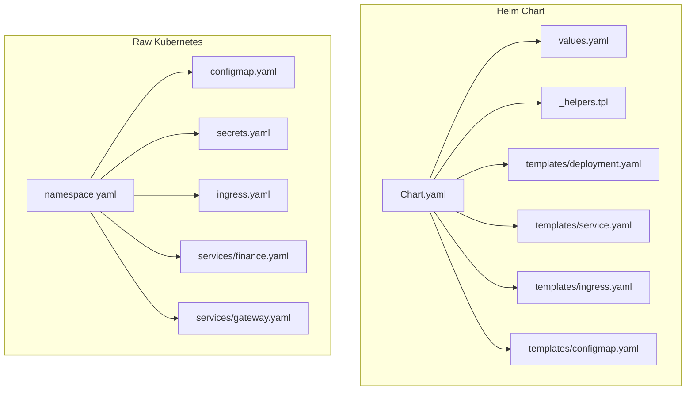
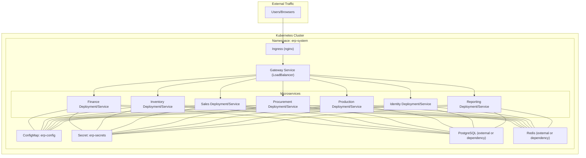
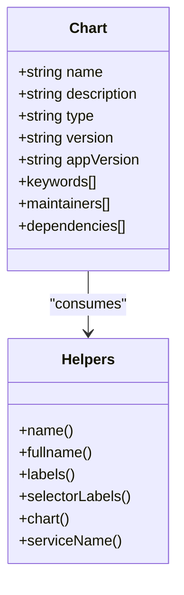
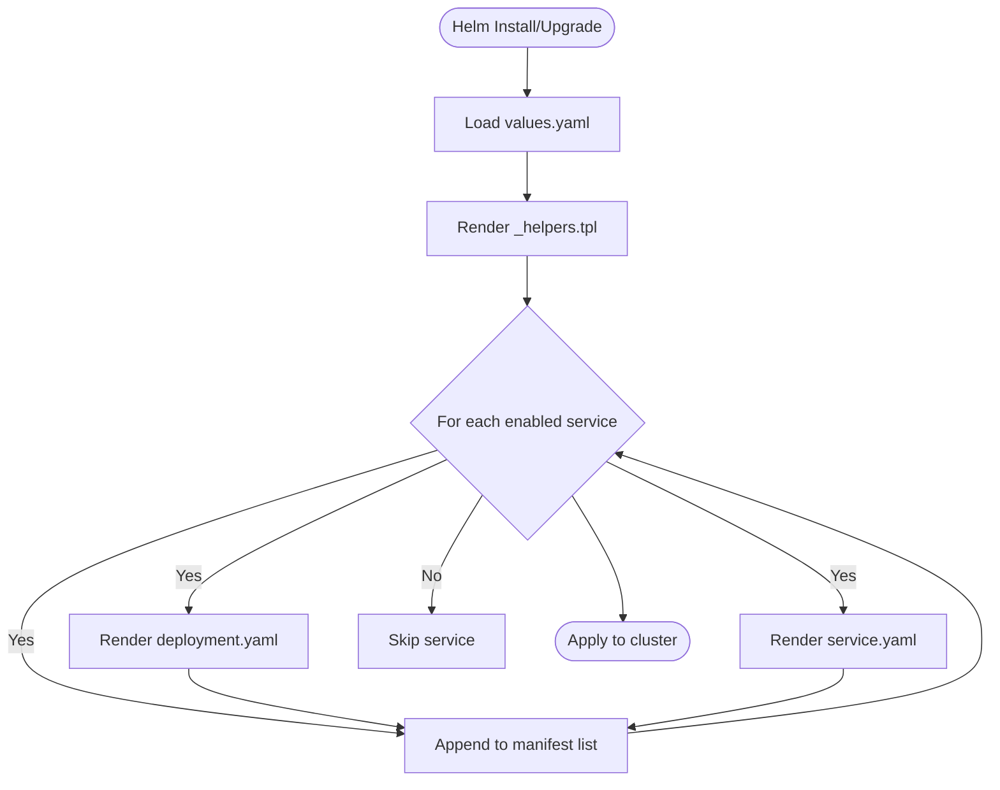
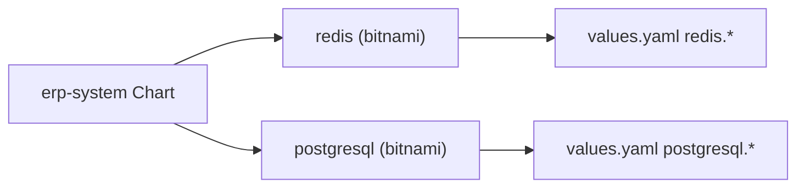

# Kubernetes and Helm Deployment

<cite>
**Referenced Files in This Document**
- [Chart.yaml](file://deploy/helm/erp-system/Chart.yaml)
- [values.yaml](file://deploy/helm/erp-system/values.yaml)
- [_helpers.tpl](file://deploy/helm/erp-system/templates/_helpers.tpl)
- [deployment.yaml](file://deploy/helm/erp-system/templates/deployment.yaml)
- [service.yaml](file://deploy/helm/erp-system/templates/service.yaml)
- [ingress.yaml](file://deploy/helm/erp-system/templates/ingress.yaml)
- [configmap.yaml](file://deploy/helm/erp-system/templates/configmap.yaml)
- [namespace.yaml](file://deploy/k8s/namespace.yaml)
- [ingress.yaml](file://deploy/k8s/ingress.yaml)
- [configmap.yaml](file://deploy/k8s/configmap.yaml)
- [secrets.yaml](file://deploy/k8s/secrets.yaml)
- [finance.yaml](file://deploy/k8s/services/finance.yaml)
- [gateway.yaml](file://deploy/k8s/services/gateway.yaml)
- [deployment.md](file://docs/deployment.md)
</cite>

## Table of Contents
1. [Introduction](#introduction)
2. [Project Structure](#project-structure)
3. [Core Components](#core-components)
4. [Architecture Overview](#architecture-overview)
5. [Detailed Component Analysis](#detailed-component-analysis)
6. [Dependency Analysis](#dependency-analysis)
7. [Performance Considerations](#performance-considerations)
8. [Troubleshooting Guide](#troubleshooting-guide)
9. [Conclusion](#conclusion)
10. [Appendices](#appendices)

## Introduction
This document provides comprehensive guidance for deploying the ERP microservices system to Kubernetes using Helm and as raw Kubernetes manifests. It explains the Helm chart structure, configuration options across environments, deployment workflows, and operational validation steps. It also covers namespace management, service discovery, ingress routing, and troubleshooting techniques.

## Project Structure
The deployment assets are organized into two primary approaches:
- Helm-based deployment under deploy/helm/erp-system with Chart.yaml, values.yaml, and templated Kubernetes manifests.
- Raw Kubernetes manifests under deploy/k8s for direct application without Helm.

Key directories and files:
- Helm chart: Chart.yaml, values.yaml, templates/* helpers and resource manifests.
- Raw Kubernetes: namespace.yaml, ingress.yaml, configmap.yaml, secrets.yaml, and per-service manifests under deploy/k8s/services/.

**Diagram sources**
- [Chart.yaml](file://deploy/helm/erp-system/Chart.yaml#L1-L27)
- [values.yaml](file://deploy/helm/erp-system/values.yaml#L1-L127)
- [_helpers.tpl](file://deploy/helm/erp-system/templates/_helpers.tpl#L1-L51)
- [deployment.yaml](file://deploy/helm/erp-system/templates/deployment.yaml#L1-L58)
- [service.yaml](file://deploy/helm/erp-system/templates/service.yaml#L1-L22)
- [ingress.yaml](file://deploy/helm/erp-system/templates/ingress.yaml#L1-L47)
- [configmap.yaml](file://deploy/helm/erp-system/templates/configmap.yaml#L1-L20)
- [namespace.yaml](file://deploy/k8s/namespace.yaml#L1-L8)
- [configmap.yaml](file://deploy/k8s/configmap.yaml#L1-L25)
- [secrets.yaml](file://deploy/k8s/secrets.yaml#L1-L19)
- [ingress.yaml](file://deploy/k8s/ingress.yaml#L1-L37)
- [finance.yaml](file://deploy/k8s/services/finance.yaml#L1-L66)
- [gateway.yaml](file://deploy/k8s/services/gateway.yaml#L1-L60)

**Section sources**
- [Chart.yaml](file://deploy/helm/erp-system/Chart.yaml#L1-L27)
- [values.yaml](file://deploy/helm/erp-system/values.yaml#L1-L127)
- [namespace.yaml](file://deploy/k8s/namespace.yaml#L1-L8)

## Core Components
- Helm Chart: Defines metadata, keywords, maintainers, and managed dependencies (Redis and PostgreSQL) with conditions.
- Values: Centralized configuration for global settings, common service defaults, per-service overrides, ingress, databases, caching, Dapr integration, and environment variables.
- Templates: Rendered Kubernetes resources for Deployments, Services, Ingress, and ConfigMaps using helper functions and values.
- Helpers: Provide naming, labels, and selector conventions reused across templates.
- Raw Kubernetes: Standalone manifests for namespace, configmap, secrets, ingress, and individual services.

Key capabilities:
- Dynamic service rendering via values.services loop.
- Dapr integration enabled per service via annotations.
- Centralized configuration via ConfigMap and Secrets.
- Optional external ingress with TLS support.

**Section sources**
- [Chart.yaml](file://deploy/helm/erp-system/Chart.yaml#L18-L27)
- [values.yaml](file://deploy/helm/erp-system/values.yaml#L4-L127)
- [_helpers.tpl](file://deploy/helm/erp-system/templates/_helpers.tpl#L1-L51)
- [deployment.yaml](file://deploy/helm/erp-system/templates/deployment.yaml#L1-L58)
- [service.yaml](file://deploy/helm/erp-system/templates/service.yaml#L1-L22)
- [ingress.yaml](file://deploy/helm/erp-system/templates/ingress.yaml#L1-L47)
- [configmap.yaml](file://deploy/helm/erp-system/templates/configmap.yaml#L1-L20)

## Architecture Overview
The system deploys microservices behind a gateway service exposed externally via an Ingress. Dapr is enabled for service communication and state/publish-subscribe abstractions. PostgreSQL and Redis are provisioned optionally via dependencies or raw manifests.

**Diagram sources**
- [ingress.yaml](file://deploy/helm/erp-system/templates/ingress.yaml#L21-L45)
- [service.yaml](file://deploy/helm/erp-system/templates/service.yaml#L13-L19)
- [deployment.yaml](file://deploy/helm/erp-system/templates/deployment.yaml#L22-L26)
- [configmap.yaml](file://deploy/helm/erp-system/templates/configmap.yaml#L13-L19)
- [Chart.yaml](file://deploy/helm/erp-system/Chart.yaml#L18-L27)

## Detailed Component Analysis

### Helm Chart Structure
- Chart metadata defines the chart name, description, type, versions, keywords, and maintainers.
- Dependencies declare optional Redis and PostgreSQL charts with repositories and conditions.
- Template helpers standardize naming, labels, and selector labels across resources.

**Diagram sources**
- [Chart.yaml](file://deploy/helm/erp-system/Chart.yaml#L1-L27)
- [_helpers.tpl](file://deploy/helm/erp-system/templates/_helpers.tpl#L1-L51)

**Section sources**
- [Chart.yaml](file://deploy/helm/erp-system/Chart.yaml#L1-L27)
- [_helpers.tpl](file://deploy/helm/erp-system/templates/_helpers.tpl#L1-L51)

### Values Configuration and Environments
- Global settings: image registry, pull secrets, and namespace.
- Common defaults: replica counts and resource requests/limits applied to services unless overridden.
- Per-service overrides: enable/disable, replicas, image repository/tag/pull policy, and optional service type.
- Ingress: enable/disable, class name, host, and TLS configuration.
- Databases: PostgreSQL and Redis toggles with credentials and persistence sizing.
- Dapr: enable flag and component bindings for state and pub/sub.
- Environment variables: ASPNETCORE_ENVIRONMENT propagated to containers.

Environment-specific overrides:
- Use separate values files (e.g., values-prod.yaml, values-staging.yaml) and pass with Helm’s -f flag during install/upgrade.

**Section sources**
- [values.yaml](file://deploy/helm/erp-system/values.yaml#L4-L127)

### Template Organization and Rendering
- deployment.yaml renders Deployments for each enabled service, injecting Dapr annotations, environment variables, and resource limits.
- service.yaml creates ClusterIP Services for internal traffic; gateway service type can be overridden.
- ingress.yaml provisions an Nginx-based Ingress with path-based routing to gateway and reporting services.
- configmap.yaml sets runtime configuration including database connection strings and Redis endpoints.

**Diagram sources**
- [deployment.yaml](file://deploy/helm/erp-system/templates/deployment.yaml#L1-L58)
- [service.yaml](file://deploy/helm/erp-system/templates/service.yaml#L1-L22)
- [ingress.yaml](file://deploy/helm/erp-system/templates/ingress.yaml#L1-L47)
- [configmap.yaml](file://deploy/helm/erp-system/templates/configmap.yaml#L1-L20)
- [_helpers.tpl](file://deploy/helm/erp-system/templates/_helpers.tpl#L1-L51)

**Section sources**
- [deployment.yaml](file://deploy/helm/erp-system/templates/deployment.yaml#L1-L58)
- [service.yaml](file://deploy/helm/erp-system/templates/service.yaml#L1-L22)
- [ingress.yaml](file://deploy/helm/erp-system/templates/ingress.yaml#L1-L47)
- [configmap.yaml](file://deploy/helm/erp-system/templates/configmap.yaml#L1-L20)

### Namespace Management
- The Helm chart uses a configurable namespace via global.namespace.
- Raw manifests also define the erp-system namespace with labels for platform identification.

Operational note:
- Ensure the namespace exists before applying resources. The Helm chart applies resources to the configured namespace.

**Section sources**
- [values.yaml](file://deploy/helm/erp-system/values.yaml#L5-L8)
- [namespace.yaml](file://deploy/k8s/namespace.yaml#L1-L8)

### Service Discovery and Dapr Integration
- Services are discoverable internally via DNS names: {service}-service.{namespace}.svc.cluster.local.
- Dapr is enabled per service via annotations for sidecar injection and app-id binding.
- ConfigMap provides DAPR_HTTP_PORT and DAPR_GRPC_PORT consumed by sidecars.

**Section sources**
- [deployment.yaml](file://deploy/helm/erp-system/templates/deployment.yaml#L22-L26)
- [configmap.yaml](file://deploy/helm/erp-system/templates/configmap.yaml#L10-L11)

### Ingress Configuration
- Helm-managed Ingress routes root path to the gateway service and API paths to the reporting service.
- Raw Kubernetes Ingress mirrors this behavior with explicit service names and path rules.
- TLS can be toggled with a secret name; annotations configure rewrite-target and body size.

Validation:
- Confirm ingress controller availability and class name alignment with your cluster.

**Section sources**
- [ingress.yaml](file://deploy/helm/erp-system/templates/ingress.yaml#L21-L45)
- [ingress.yaml](file://deploy/k8s/ingress.yaml#L12-L36)

### Raw Kubernetes Manifest Deployment
- Apply namespace, configmap, secrets, services, and ingress in order.
- Each service manifest includes Deployment and Service definitions with probes and resource limits.

Use cases:
- Quick deployments without Helm.
- Debugging template rendering by inspecting generated manifests.

**Section sources**
- [namespace.yaml](file://deploy/k8s/namespace.yaml#L1-L8)
- [configmap.yaml](file://deploy/k8s/configmap.yaml#L1-L25)
- [secrets.yaml](file://deploy/k8s/secrets.yaml#L1-L19)
- [finance.yaml](file://deploy/k8s/services/finance.yaml#L1-L66)
- [gateway.yaml](file://deploy/k8s/services/gateway.yaml#L1-L60)
- [ingress.yaml](file://deploy/k8s/ingress.yaml#L1-L37)

## Dependency Analysis
Helm dependencies are declared for Redis and PostgreSQL with repository and version constraints. Conditions allow enabling/disabling each dependency.

**Diagram sources**
- [Chart.yaml](file://deploy/helm/erp-system/Chart.yaml#L18-L27)
- [values.yaml](file://deploy/helm/erp-system/values.yaml#L100-L123)

**Section sources**
- [Chart.yaml](file://deploy/helm/erp-system/Chart.yaml#L18-L27)
- [values.yaml](file://deploy/helm/erp-system/values.yaml#L100-L123)

## Performance Considerations
- Resource requests and limits are defined centrally and can be overridden per service. Adjust based on observed CPU/memory usage.
- Replica counts vary by service; scale up for stateless APIs (e.g., gateway, reporting) and down for specialized services as needed.
- Dapr sidecars consume additional CPU/memory; monitor and tune accordingly.
- Use horizontal pod autoscaling (HPA) for stateless services after baseline metrics collection.

[No sources needed since this section provides general guidance]

## Troubleshooting Guide
Common issues and checks:
- Pods not ready: Inspect readiness/liveness probe endpoints (/health and /health/ready) and container logs.
- Service connectivity: Verify Service selectors match Pod labels and that Services are of type ClusterIP/LoadBalancer as intended.
- Ingress routing: Confirm Ingress controller is installed, class name matches, and host/path rules align with service names.
- Configuration and secrets: Ensure ConfigMap and Secret names match references in Deployments and contain required keys.
- Dependencies: If using Helm dependencies, verify PostgreSQL/Redis passwords and persistence sizes; otherwise, ensure raw manifests are applied in the correct order.

Validation commands:
- Check pods, services, and ingress in the namespace.
- Describe specific resources for events and status.
- Exec into a pod to test internal connectivity and endpoint reachability.

**Section sources**
- [deployment.md](file://docs/deployment.md#L46-L76)
- [deployment.yaml](file://deploy/helm/erp-system/templates/deployment.yaml#L44-L55)
- [service.yaml](file://deploy/helm/erp-system/templates/service.yaml#L13-L19)
- [ingress.yaml](file://deploy/helm/erp-system/templates/ingress.yaml#L14-L20)

## Conclusion
The ERP system provides a robust, configurable deployment story for Kubernetes using Helm with optional dependencies and a clean separation of concerns. The raw Kubernetes manifests offer an alternative path for environments where Helm is not preferred. By leveraging values overrides, Dapr integration, and centralized configuration, teams can deploy reliably across development, staging, and production environments.

[No sources needed since this section summarizes without analyzing specific files]

## Appendices

### Helm Deployment Commands
- Add dependencies and install/upgrade with default or custom values.
- Use -f to specify environment-specific values files.

**Section sources**
- [deployment.md](file://docs/deployment.md#L26-L44)

### Environment-Specific Values
- Create values-prod.yaml and values-staging.yaml to override global.namespace, replica counts, ingress.host, database credentials, and TLS settings.

**Section sources**
- [values.yaml](file://deploy/helm/erp-system/values.yaml#L4-L127)
- [deployment.md](file://docs/deployment.md#L91-L101)

### Service Exposure Options
- Gateway service type can be customized (e.g., LoadBalancer) via values.services.gateway.service.type.
- Internal services default to ClusterIP; adjust as needed for testing or integration.

**Section sources**
- [values.yaml](file://deploy/helm/erp-system/values.yaml#L86-L88)
- [service.yaml](file://deploy/helm/erp-system/templates/service.yaml#L19)