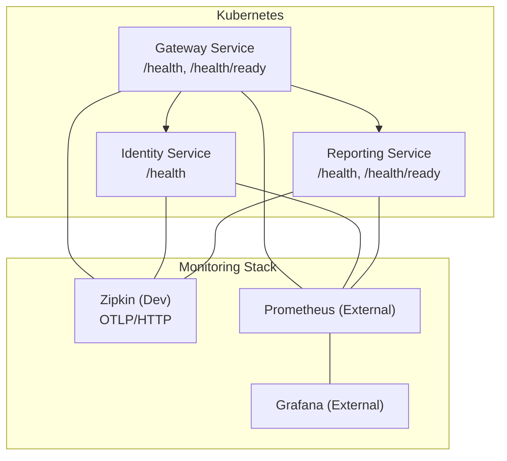
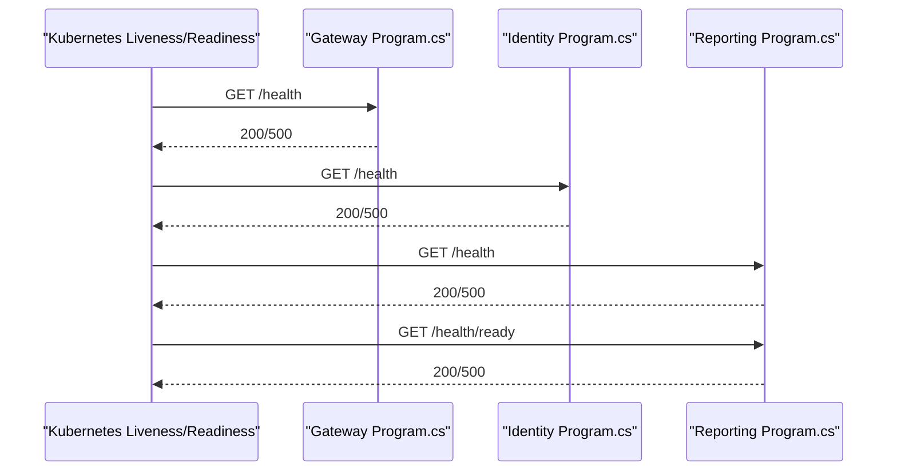
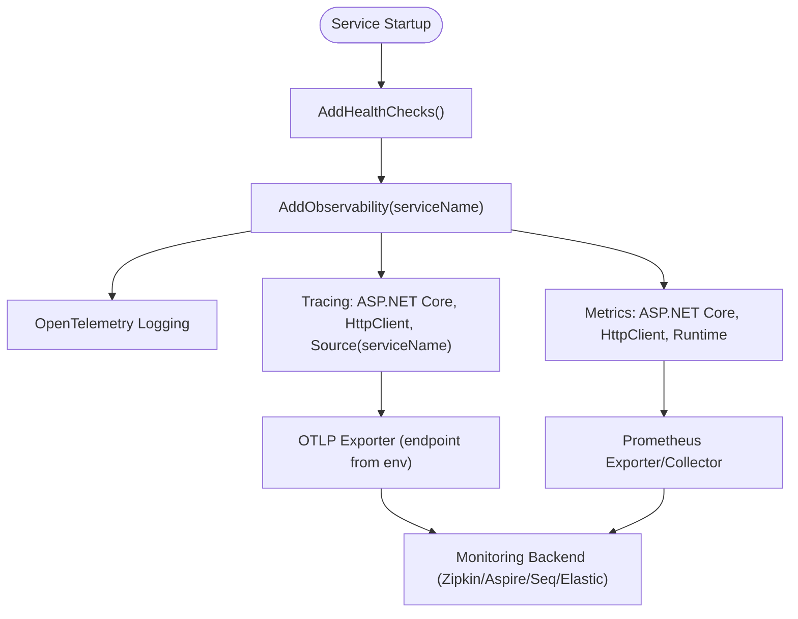
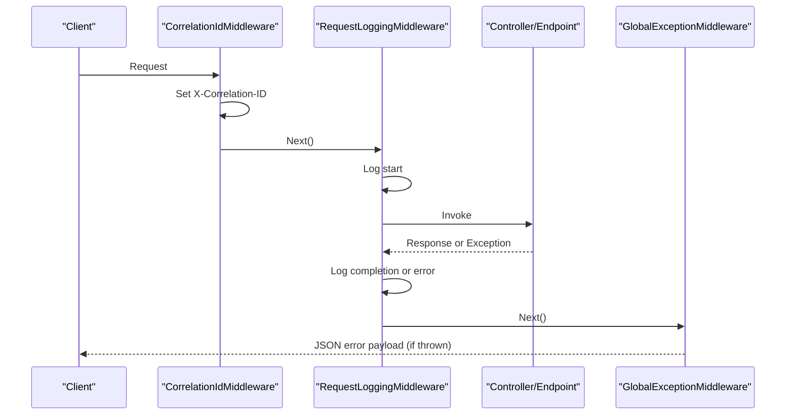
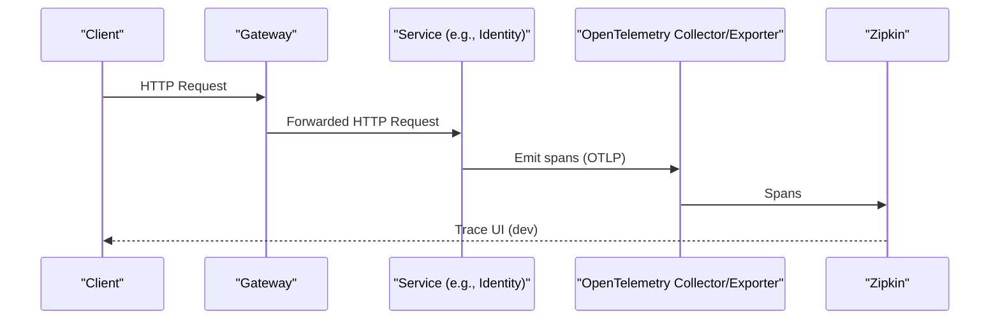
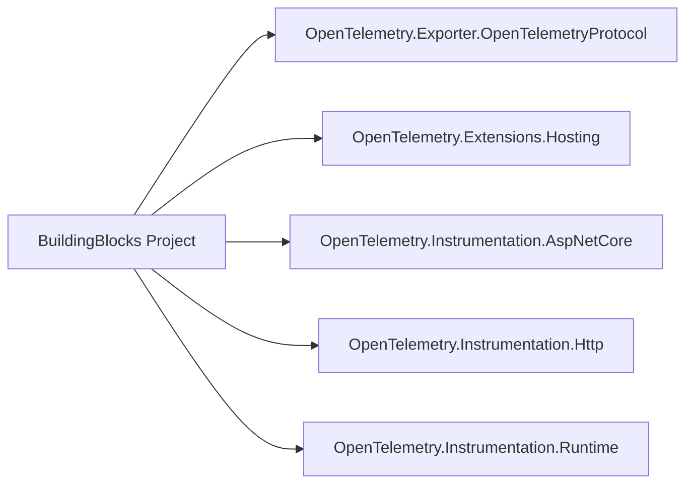

# Monitoring and Observability

<cite>
**Referenced Files in This Document**
- [ObservabilityExtensions.cs](file://src/BuildingBlocks/ErpSystem.BuildingBlocks/Observability/ObservabilityExtensions.cs)
- [ErpSystem.BuildingBlocks.csproj](file://src/BuildingBlocks/ErpSystem.BuildingBlocks/ErpSystem.BuildingBlocks.csproj)
- [Middlewares.cs](file://src/BuildingBlocks/ErpSystem.BuildingBlocks/Middleware/Middlewares.cs)
- [Program.cs (Gateway)](file://src/Gateways/ErpSystem.Gateway/Program.cs)
- [Program.cs (Identity)](file://src/Services/Identity/ErpSystem.Identity/Program.cs)
- [Program.cs (Reporting)](file://src/Services/Reporting/ErpSystem.Reporting/Program.cs)
- [deployment.yaml (Helm)](file://deploy/helm/erp-system/templates/deployment.yaml)
- [docker-compose.yml](file://docker-compose.yml)
- [ingress.yaml (K8s)](file://deploy/k8s/ingress.yaml)
</cite>

## Table of Contents
1. [Introduction](#introduction)
2. [Project Structure](#project-structure)
3. [Core Components](#core-components)
4. [Architecture Overview](#architecture-overview)
5. [Detailed Component Analysis](#detailed-component-analysis)
6. [Dependency Analysis](#dependency-analysis)
7. [Performance Considerations](#performance-considerations)
8. [Troubleshooting Guide](#troubleshooting-guide)
9. [Conclusion](#conclusion)
10. [Appendices](#appendices)

## Introduction
This document provides comprehensive monitoring and observability guidance for the ERP microservices system. It covers health checks, metrics collection via Prometheus-compatible exporters, structured logging, distributed tracing, alerting, and dashboard creation with Grafana. The goal is to enable reliable operations, fast incident response, and continuous improvement of the platform.

## Project Structure
The observability stack is implemented across building blocks and individual services:
- Centralized observability extensions for logging, metrics, and tracing
- Health checks mapped at service entry points
- Kubernetes and Docker Compose deployments exposing probes and routing
- Optional distributed tracing backend (Zipkin) for development

**Diagram sources**
- [Program.cs (Gateway)](file://src/Gateways/ErpSystem.Gateway/Program.cs#L78-L81)
- [Program.cs (Identity)](file://src/Services/Identity/ErpSystem.Identity/Program.cs#L54-L56)
- [Program.cs (Reporting)](file://src/Services/Reporting/ErpSystem.Reporting/Program.cs#L28-L31)
- [deployment.yaml (Helm)](file://deploy/helm/erp-system/templates/deployment.yaml#L44-L55)
- [docker-compose.yml](file://docker-compose.yml#L86-L91)

**Section sources**
- [Program.cs (Gateway)](file://src/Gateways/ErpSystem.Gateway/Program.cs#L78-L81)
- [Program.cs (Identity)](file://src/Services/Identity/ErpSystem.Identity/Program.cs#L54-L56)
- [Program.cs (Reporting)](file://src/Services/Reporting/ErpSystem.Reporting/Program.cs#L28-L31)
- [deployment.yaml (Helm)](file://deploy/helm/erp-system/templates/deployment.yaml#L44-L55)
- [docker-compose.yml](file://docker-compose.yml#L86-L91)

## Core Components
- Observability extensions configure OpenTelemetry for logs, metrics, and traces, exporting to OTLP targets.
- Health checks are registered and mapped at service entry points.
- Structured logging middleware captures request lifecycle and exceptions with correlation IDs.
- Distributed tracing is enabled via OpenTelemetry instrumentation and optional Zipkin exporter.

**Section sources**
- [ObservabilityExtensions.cs](file://src/BuildingBlocks/ErpSystem.BuildingBlocks/Observability/ObservabilityExtensions.cs#L12-L42)
- [ErpSystem.BuildingBlocks.csproj](file://src/BuildingBlocks/ErpSystem.BuildingBlocks/ErpSystem.BuildingBlocks.csproj#L21-L26)
- [Middlewares.cs](file://src/BuildingBlocks/ErpSystem.BuildingBlocks/Middleware/Middlewares.cs#L10-L49)
- [Middlewares.cs](file://src/BuildingBlocks/ErpSystem.BuildingBlocks/Middleware/Middlewares.cs#L54-L68)
- [Middlewares.cs](file://src/BuildingBlocks/ErpSystem.BuildingBlocks/Middleware/Middlewares.cs#L73-L124)

## Architecture Overview
The observability architecture integrates per-service telemetry with centralized systems:
- OpenTelemetry collects logs, metrics, and traces
- OTLP exporter sends data to external systems (e.g., Aspire Dashboard, Seq, Elastic, or Zipkin)
- Health checks support Kubernetes liveness/readiness probes
- Ingress routes traffic to services while exposing health endpoints

**Diagram sources**
- [Program.cs (Gateway)](file://src/Gateways/ErpSystem.Gateway/Program.cs#L78-L81)
- [Program.cs (Identity)](file://src/Services/Identity/ErpSystem.Identity/Program.cs#L54-L56)
- [Program.cs (Reporting)](file://src/Services/Reporting/ErpSystem.Reporting/Program.cs#L28-L31)
- [deployment.yaml (Helm)](file://deploy/helm/erp-system/templates/deployment.yaml#L44-L55)

## Detailed Component Analysis

### Health Checks
- Gateway, Identity, and Reporting services expose health endpoints.
- Kubernetes probes use /health and /health/ready to determine liveness and readiness.
- Ingress routes traffic to services; health endpoints are not exposed publicly via ingress.

Implementation highlights:
- Health checks registration and mapping in service programs
- Probe configuration in Helm deployment templates

**Section sources**
- [Program.cs (Gateway)](file://src/Gateways/ErpSystem.Gateway/Program.cs#L78-L81)
- [Program.cs (Identity)](file://src/Services/Identity/ErpSystem.Identity/Program.cs#L54-L56)
- [Program.cs (Reporting)](file://src/Services/Reporting/ErpSystem.Reporting/Program.cs#L28-L31)
- [deployment.yaml (Helm)](file://deploy/helm/erp-system/templates/deployment.yaml#L44-L55)
- [ingress.yaml (K8s)](file://deploy/k8s/ingress.yaml#L13-L36)

### Metrics Collection with OpenTelemetry
- Metrics instrumentation includes ASP.NET Core, HttpClient, and Runtime metrics.
- OTLP exporter is configured; endpoint is controlled by environment variable.
- Prometheus compatibility is achieved via OTLP-to-Prometheus bridges or exporters.

**Diagram sources**
- [ObservabilityExtensions.cs](file://src/BuildingBlocks/ErpSystem.BuildingBlocks/Observability/ObservabilityExtensions.cs#L12-L42)
- [ErpSystem.BuildingBlocks.csproj](file://src/BuildingBlocks/ErpSystem.BuildingBlocks/ErpSystem.BuildingBlocks.csproj#L21-L26)

**Section sources**
- [ObservabilityExtensions.cs](file://src/BuildingBlocks/ErpSystem.BuildingBlocks/Observability/ObservabilityExtensions.cs#L12-L42)
- [ErpSystem.BuildingBlocks.csproj](file://src/BuildingBlocks/ErpSystem.BuildingBlocks/ErpSystem.BuildingBlocks.csproj#L21-L26)

### Logging Strategies
- Structured logging via OpenTelemetry with formatted messages and scopes.
- Request logging middleware records start/completion/error with correlation IDs.
- Global exception middleware ensures consistent error responses and logging.

**Diagram sources**
- [Middlewares.cs](file://src/BuildingBlocks/ErpSystem.BuildingBlocks/Middleware/Middlewares.cs#L54-L68)
- [Middlewares.cs](file://src/BuildingBlocks/ErpSystem.BuildingBlocks/Middleware/Middlewares.cs#L10-L49)
- [Middlewares.cs](file://src/BuildingBlocks/ErpSystem.BuildingBlocks/Middleware/Middlewares.cs#L73-L124)

**Section sources**
- [ObservabilityExtensions.cs](file://src/BuildingBlocks/ErpSystem.BuildingBlocks/Observability/ObservabilityExtensions.cs#L14-L19)
- [Middlewares.cs](file://src/BuildingBlocks/ErpSystem.BuildingBlocks/Middleware/Middlewares.cs#L10-L49)
- [Middlewares.cs](file://src/BuildingBlocks/ErpSystem.BuildingBlocks/Middleware/Middlewares.cs#L54-L68)
- [Middlewares.cs](file://src/BuildingBlocks/ErpSystem.BuildingBlocks/Middleware/Middlewares.cs#L73-L124)

### Distributed Tracing
- OpenTelemetry tracing is enabled with ASP.NET Core and HttpClient instrumentation.
- Tracing source is set to the service name; OTLP exporter is configured.
- Development environment includes Zipkin for tracing visualization.

**Diagram sources**
- [ObservabilityExtensions.cs](file://src/BuildingBlocks/ErpSystem.BuildingBlocks/Observability/ObservabilityExtensions.cs#L29-L39)
- [docker-compose.yml](file://docker-compose.yml#L86-L91)

**Section sources**
- [ObservabilityExtensions.cs](file://src/BuildingBlocks/ErpSystem.BuildingBlocks/Observability/ObservabilityExtensions.cs#L29-L39)
- [docker-compose.yml](file://docker-compose.yml#L86-L91)

### Alerting Configuration
- Use Kubernetes probes to detect unhealthy pods; configure alerts on probe failures.
- For application-level alerts, define Prometheus recording/alerting rules on:
  - HTTP error rates and latency
  - Database connection failures
  - Cache connectivity issues
  - Circuit breaker triggers
- Example alert categories:
  - Critical: readiness probe failures, sustained >95th percentile latency
  - Warning: elevated error rates, GC pauses, memory pressure

[No sources needed since this section provides general guidance]

### Dashboard Creation with Grafana
- Connect Grafana to Prometheus datasource.
- Build dashboards for:
  - Service health (probe success rate, restart count)
  - Request volume, latency, error rates
  - Database and cache health
  - Business KPIs (where applicable)
- Use Loki (via OTel Logs) for log analytics and correlation with traces.

[No sources needed since this section provides general guidance]

## Dependency Analysis
Observability relies on OpenTelemetry packages and environment-driven exporters.

**Diagram sources**
- [ErpSystem.BuildingBlocks.csproj](file://src/BuildingBlocks/ErpSystem.BuildingBlocks/ErpSystem.BuildingBlocks.csproj#L21-L26)

**Section sources**
- [ErpSystem.BuildingBlocks.csproj](file://src/BuildingBlocks/ErpSystem.BuildingBlocks/ErpSystem.BuildingBlocks.csproj#L21-L26)

## Performance Considerations
- Keep OTLP exporter endpoints externalized via environment variables for flexibility.
- Prefer sampling strategies for high-throughput services.
- Use lightweight metrics and avoid excessive label cardinality.
- Tune probe intervals and timeouts to balance responsiveness and overhead.

[No sources needed since this section provides general guidance]

## Troubleshooting Guide
- Health check failures:
  - Verify /health and /health/ready mappings in service programs.
  - Confirm Kubernetes probe configuration aligns with service ports.
- Tracing gaps:
  - Ensure OTEL_EXPORTER_OTLP_ENDPOINT is set in production environments.
  - Validate that services are instrumented and spans are emitted.
- Logs missing correlation:
  - Confirm correlation ID middleware is registered before routing.
  - Ensure structured logging is enabled and configured.

**Section sources**
- [Program.cs (Gateway)](file://src/Gateways/ErpSystem.Gateway/Program.cs#L78-L81)
- [Program.cs (Identity)](file://src/Services/Identity/ErpSystem.Identity/Program.cs#L54-L56)
- [Program.cs (Reporting)](file://src/Services/Reporting/ErpSystem.Reporting/Program.cs#L28-L31)
- [deployment.yaml (Helm)](file://deploy/helm/erp-system/templates/deployment.yaml#L44-L55)
- [ObservabilityExtensions.cs](file://src/BuildingBlocks/ErpSystem.BuildingBlocks/Observability/ObservabilityExtensions.cs#L36-L38)
- [Middlewares.cs](file://src/BuildingBlocks/ErpSystem.BuildingBlocks/Middleware/Middlewares.cs#L54-L68)

## Conclusion
The ERP microservices system integrates robust observability through centralized OpenTelemetry configuration, standardized health endpoints, structured logging, and distributed tracing. By leveraging Kubernetes probes, external monitoring backends, and Grafana dashboards, teams can achieve strong operational visibility and reliability.

[No sources needed since this section summarizes without analyzing specific files]

## Appendices
- Environment variables to configure exporters:
  - OTEL_EXPORTER_OTLP_ENDPOINT: Target for OTLP exporter
- Development tracing backend:
  - Zipkin container included for local tracing visualization

**Section sources**
- [ObservabilityExtensions.cs](file://src/BuildingBlocks/ErpSystem.BuildingBlocks/Observability/ObservabilityExtensions.cs#L36-L38)
- [docker-compose.yml](file://docker-compose.yml#L86-L91)