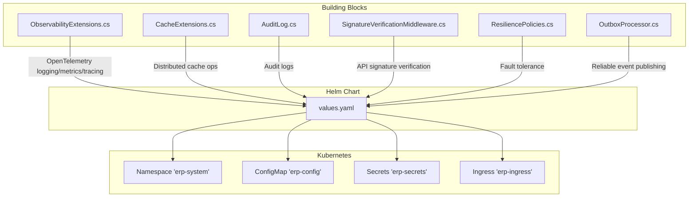
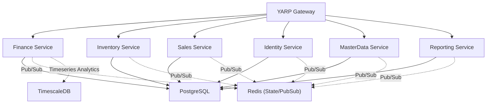
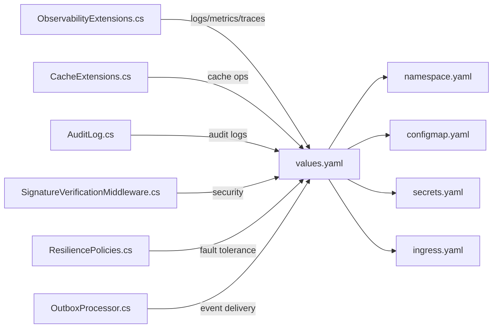

# Operational Procedures

<cite>
**Referenced Files in This Document**
- [README.md](file://README.md)
- [DEVELOPMENT_PLAN.md](file://DEVELOPMENT_PLAN.md)
- [docs/deployment.md](file://docs/deployment.md)
- [deploy/helm/erp-system/values.yaml](file://deploy/helm/erp-system/values.yaml)
- [deploy/k8s/namespace.yaml](file://deploy/k8s/namespace.yaml)
- [deploy/k8s/configmap.yaml](file://deploy/k8s/configmap.yaml)
- [deploy/k8s/secrets.yaml](file://deploy/k8s/secrets.yaml)
- [deploy/k8s/ingress.yaml](file://deploy/k8s/ingress.yaml)
- [src/BuildingBlocks/ErpSystem.BuildingBlocks/Observability/ObservabilityExtensions.cs](file://src/BuildingBlocks/ErpSystem.BuildingBlocks/Observability/ObservabilityExtensions.cs)
- [src/BuildingBlocks/ErpSystem.BuildingBlocks/Caching/CacheExtensions.cs](file://src/BuildingBlocks/ErpSystem.BuildingBlocks/Caching/CacheExtensions.cs)
- [src/BuildingBlocks/ErpSystem.BuildingBlocks/Auditing/AuditLog.cs](file://src/BuildingBlocks/ErpSystem.BuildingBlocks/Auditing/AuditLog.cs)
- [src/BuildingBlocks/ErpSystem.BuildingBlocks/Auth/SignatureVerificationMiddleware.cs](file://src/BuildingBlocks/ErpSystem.BuildingBlocks/Auth/SignatureVerificationMiddleware.cs)
- [src/BuildingBlocks/ErpSystem.BuildingBlocks/Resilience/ResiliencePolicies.cs](file://src/BuildingBlocks/ErpSystem.BuildingBlocks/Resilience/ResiliencePolicies.cs)
- [src/BuildingBlocks/ErpSystem.BuildingBlocks/Outbox/OutboxProcessor.cs](file://src/BuildingBlocks/ErpSystem.BuildingBlocks/Outbox/OutboxProcessor.cs)
- [infrastructure/init.sql](file://infrastructure/init.sql)
</cite>

## Table of Contents
1. [Introduction](#introduction)
2. [Project Structure](#project-structure)
3. [Core Components](#core-components)
4. [Architecture Overview](#architecture-overview)
5. [Detailed Component Analysis](#detailed-component-analysis)
6. [Dependency Analysis](#dependency-analysis)
7. [Performance Considerations](#performance-considerations)
8. [Troubleshooting Guide](#troubleshooting-guide)
9. [Conclusion](#conclusion)
10. [Appendices](#appendices)

## Introduction
This document defines comprehensive operational procedures for the ERP microservices system. It covers routine maintenance (database backups, log rotation, cache management), incident response (outages, data inconsistencies, performance degradation), backup and recovery strategies (point-in-time and disaster recovery), security maintenance (certificate renewal, vulnerability scanning, access control reviews), change management (deployments, configuration updates, dependency upgrades), and runbooks for common operational scenarios with escalation procedures.

## Project Structure
The system is a cloud-native microservices platform with Kubernetes/Helm-based deployment, Dapr integration, and observability built-in. The repository includes:
- Helm chart for orchestration and environment overrides
- Kubernetes manifests for namespace, config, secrets, ingress
- Building Blocks for caching, audit, resilience, observability, and outbox processing
- Infrastructure initialization scripts for database creation

**Diagram sources**
- [deploy/helm/erp-system/values.yaml](file://deploy/helm/erp-system/values.yaml#L1-L127)
- [deploy/k8s/namespace.yaml](file://deploy/k8s/namespace.yaml#L1-L8)
- [deploy/k8s/configmap.yaml](file://deploy/k8s/configmap.yaml#L1-L25)
- [deploy/k8s/secrets.yaml](file://deploy/k8s/secrets.yaml#L1-L19)
- [deploy/k8s/ingress.yaml](file://deploy/k8s/ingress.yaml#L1-L37)
- [src/BuildingBlocks/ErpSystem.BuildingBlocks/Observability/ObservabilityExtensions.cs](file://src/BuildingBlocks/ErpSystem.BuildingBlocks/Observability/ObservabilityExtensions.cs#L1-L44)
- [src/BuildingBlocks/ErpSystem.BuildingBlocks/Caching/CacheExtensions.cs](file://src/BuildingBlocks/ErpSystem.BuildingBlocks/Caching/CacheExtensions.cs#L1-L72)
- [src/BuildingBlocks/ErpSystem.BuildingBlocks/Auditing/AuditLog.cs](file://src/BuildingBlocks/ErpSystem.BuildingBlocks/Auditing/AuditLog.cs#L1-L135)
- [src/BuildingBlocks/ErpSystem.BuildingBlocks/Auth/SignatureVerificationMiddleware.cs](file://src/BuildingBlocks/ErpSystem.BuildingBlocks/Auth/SignatureVerificationMiddleware.cs#L1-L85)
- [src/BuildingBlocks/ErpSystem.BuildingBlocks/Resilience/ResiliencePolicies.cs](file://src/BuildingBlocks/ErpSystem.BuildingBlocks/Resilience/ResiliencePolicies.cs#L1-L111)
- [src/BuildingBlocks/ErpSystem.BuildingBlocks/Outbox/OutboxProcessor.cs](file://src/BuildingBlocks/ErpSystem.BuildingBlocks/Outbox/OutboxProcessor.cs#L1-L72)

**Section sources**
- [README.md](file://README.md#L255-L286)
- [docs/deployment.md](file://docs/deployment.md#L1-L115)
- [deploy/helm/erp-system/values.yaml](file://deploy/helm/erp-system/values.yaml#L1-L127)
- [deploy/k8s/namespace.yaml](file://deploy/k8s/namespace.yaml#L1-L8)
- [deploy/k8s/configmap.yaml](file://deploy/k8s/configmap.yaml#L1-L25)
- [deploy/k8s/secrets.yaml](file://deploy/k8s/secrets.yaml#L1-L19)
- [deploy/k8s/ingress.yaml](file://deploy/k8s/ingress.yaml#L1-L37)

## Core Components
- Observability: Built-in OpenTelemetry logging, metrics, and tracing with OTLP exporter support.
- Caching: Distributed cache helpers with typed get/set and GetOrSet semantics.
- Audit: Automatic audit logging for auditable commands with repository persistence.
- Security: Signature verification middleware for API clients with HMAC-SHA256 and time-window validation.
- Resilience: Pre-configured Polly resilience policies (retry, circuit breaker, timeout).
- Outbox: Background service to reliably publish domain events to the event bus.

**Section sources**
- [src/BuildingBlocks/ErpSystem.BuildingBlocks/Observability/ObservabilityExtensions.cs](file://src/BuildingBlocks/ErpSystem.BuildingBlocks/Observability/ObservabilityExtensions.cs#L1-L44)
- [src/BuildingBlocks/ErpSystem.BuildingBlocks/Caching/CacheExtensions.cs](file://src/BuildingBlocks/ErpSystem.BuildingBlocks/Caching/CacheExtensions.cs#L1-L72)
- [src/BuildingBlocks/ErpSystem.BuildingBlocks/Auditing/AuditLog.cs](file://src/BuildingBlocks/ErpSystem.BuildingBlocks/Auditing/AuditLog.cs#L1-L135)
- [src/BuildingBlocks/ErpSystem.BuildingBlocks/Auth/SignatureVerificationMiddleware.cs](file://src/BuildingBlocks/ErpSystem.BuildingBlocks/Auth/SignatureVerificationMiddleware.cs#L1-L85)
- [src/BuildingBlocks/ErpSystem.BuildingBlocks/Resilience/ResiliencePolicies.cs](file://src/BuildingBlocks/ErpSystem.BuildingBlocks/Resilience/ResiliencePolicies.cs#L1-L111)
- [src/BuildingBlocks/ErpSystem.BuildingBlocks/Outbox/OutboxProcessor.cs](file://src/BuildingBlocks/ErpSystem.BuildingBlocks/Outbox/OutboxProcessor.cs#L1-L72)

## Architecture Overview
The system leverages Kubernetes with Helm for deployment, Dapr for service invocation and pub/sub, and separate databases for PostgreSQL and TimescaleDB. Observability is integrated via OpenTelemetry, and resilience is handled by Polly policies.

**Diagram sources**
- [README.md](file://README.md#L130-L183)
- [docs/deployment.md](file://docs/deployment.md#L255-L286)
- [deploy/helm/erp-system/values.yaml](file://deploy/helm/erp-system/values.yaml#L117-L123)

## Detailed Component Analysis

### Observability and Monitoring
- Logging: OpenTelemetry structured logs with formatted messages and scopes.
- Metrics: ASP.NET Core and HttpClient instrumentation plus runtime metrics.
- Tracing: ASP.NET Core and HttpClient instrumentation with OTLP exporter.
- Exporters: Configure OTEL_EXPORTER_OTLP_ENDPOINT in deployment environment.

Operational guidance:
- Ensure OpenTelemetry exporter endpoint is configured in production.
- Use Prometheus/Grafana dashboards for metrics and traces.
- Monitor health endpoints (/health, /health/ready) exposed by services.

**Section sources**
- [src/BuildingBlocks/ErpSystem.BuildingBlocks/Observability/ObservabilityExtensions.cs](file://src/BuildingBlocks/ErpSystem.BuildingBlocks/Observability/ObservabilityExtensions.cs#L10-L42)
- [docs/deployment.md](file://docs/deployment.md#L103-L115)

### Caching Management
- Distributed cache helpers provide typed serialization and expiration controls.
- GetOrSetAsync avoids cache misses by computing values when absent.
- Cache keys are generated consistently via CacheKeyBuilder.

Operational guidance:
- Set appropriate absolute and sliding expirations per cache category.
- Monitor cache hit rates and tune TTLs based on workload.
- Clear or invalidate keys during configuration changes or hotfixes.

**Section sources**
- [src/BuildingBlocks/ErpSystem.BuildingBlocks/Caching/CacheExtensions.cs](file://src/BuildingBlocks/ErpSystem.BuildingBlocks/Caching/CacheExtensions.cs#L9-L72)

### Audit Logging
- Automatic audit entries for auditable commands capture entity type, action, user, tenant, and timestamps.
- Audit logs are persisted via an audit repository and indexed for efficient retrieval.

Operational guidance:
- Retain audit logs per compliance requirements.
- Monitor audit log storage growth and archive older entries.
- Use audit trails for forensic investigations and change tracking.

**Section sources**
- [src/BuildingBlocks/ErpSystem.BuildingBlocks/Auditing/AuditLog.cs](file://src/BuildingBlocks/ErpSystem.BuildingBlocks/Auditing/AuditLog.cs#L12-L135)

### API Security and Signature Verification
- Middleware enforces HMAC-SHA256 signatures for API clients using X-AppId, X-Timestamp, X-Nonce, and X-Signature headers.
- Timestamp validation prevents replay attacks.
- Secrets are stored securely in Kubernetes Secrets.

Operational guidance:
- Rotate JWT and API secrets regularly using Helm values or K8s Secrets.
- Review and revoke compromised AppIds promptly.
- Enforce TLS termination at the ingress and validate certificates.

**Section sources**
- [src/BuildingBlocks/ErpSystem.BuildingBlocks/Auth/SignatureVerificationMiddleware.cs](file://src/BuildingBlocks/ErpSystem.BuildingBlocks/Auth/SignatureVerificationMiddleware.cs#L14-L84)
- [deploy/k8s/secrets.yaml](file://deploy/k8s/secrets.yaml#L7-L18)
- [deploy/k8s/ingress.yaml](file://deploy/k8s/ingress.yaml#L6-L9)

### Resilience and Fault Tolerance
- Retry with exponential backoff.
- Circuit breaker with configurable failure ratio and break duration.
- Timeout policy for upstream calls.
- Combined pipeline for robust HTTP interactions.

Operational guidance:
- Tune retry attempts and circuit breaker thresholds per service SLAs.
- Monitor circuit breaker state transitions and failure ratios.
- Apply timeouts to external calls to prevent cascading failures.

**Section sources**
- [src/BuildingBlocks/ErpSystem.BuildingBlocks/Resilience/ResiliencePolicies.cs](file://src/BuildingBlocks/ErpSystem.BuildingBlocks/Resilience/ResiliencePolicies.cs#L13-L111)

### Outbox and Reliable Event Publishing
- Background service processes outbox messages in batches.
- Publishes to event bus and marks messages processed or failed.
- Supports idempotent processing via inbox patterns at consumers.

Operational guidance:
- Monitor outbox backlog and error counters.
- Investigate failed messages and retry policies.
- Ensure consumers implement inbox de-duplication.

**Section sources**
- [src/BuildingBlocks/ErpSystem.BuildingBlocks/Outbox/OutboxProcessor.cs](file://src/BuildingBlocks/ErpSystem.BuildingBlocks/Outbox/OutboxProcessor.cs#L8-L72)

### Database Initialization and Schema Management
- Initialization script creates dedicated databases for core services.
- PostgreSQL managed via Helm with persistent volumes.

Operational guidance:
- Use migrations for schema changes; keep init.sql for seed environments.
- Back up each service database separately and retain retention copies.

**Section sources**
- [infrastructure/init.sql](file://infrastructure/init.sql#L1-L9)
- [deploy/helm/erp-system/values.yaml](file://deploy/helm/erp-system/values.yaml#L100-L116)

## Dependency Analysis

**Diagram sources**
- [deploy/helm/erp-system/values.yaml](file://deploy/helm/erp-system/values.yaml#L1-L127)
- [deploy/k8s/namespace.yaml](file://deploy/k8s/namespace.yaml#L1-L8)
- [deploy/k8s/configmap.yaml](file://deploy/k8s/configmap.yaml#L1-L25)
- [deploy/k8s/secrets.yaml](file://deploy/k8s/secrets.yaml#L1-L19)
- [deploy/k8s/ingress.yaml](file://deploy/k8s/ingress.yaml#L1-L37)
- [src/BuildingBlocks/ErpSystem.BuildingBlocks/Observability/ObservabilityExtensions.cs](file://src/BuildingBlocks/ErpSystem.BuildingBlocks/Observability/ObservabilityExtensions.cs#L1-L44)
- [src/BuildingBlocks/ErpSystem.BuildingBlocks/Caching/CacheExtensions.cs](file://src/BuildingBlocks/ErpSystem.BuildingBlocks/Caching/CacheExtensions.cs#L1-L72)
- [src/BuildingBlocks/ErpSystem.BuildingBlocks/Auditing/AuditLog.cs](file://src/BuildingBlocks/ErpSystem.BuildingBlocks/Auditing/AuditLog.cs#L1-L135)
- [src/BuildingBlocks/ErpSystem.BuildingBlocks/Auth/SignatureVerificationMiddleware.cs](file://src/BuildingBlocks/ErpSystem.BuildingBlocks/Auth/SignatureVerificationMiddleware.cs#L1-L85)
- [src/BuildingBlocks/ErpSystem.BuildingBlocks/Resilience/ResiliencePolicies.cs](file://src/BuildingBlocks/ErpSystem.BuildingBlocks/Resilience/ResiliencePolicies.cs#L1-L111)
- [src/BuildingBlocks/ErpSystem.BuildingBlocks/Outbox/OutboxProcessor.cs](file://src/BuildingBlocks/ErpSystem.BuildingBlocks/Outbox/OutboxProcessor.cs#L1-L72)

**Section sources**
- [README.md](file://README.md#L255-L286)
- [docs/deployment.md](file://docs/deployment.md#L1-L115)

## Performance Considerations
- Horizontal scaling: Adjust replica counts per service in values.yaml based on load testing.
- Resource limits: Tune CPU/memory requests/limits to prevent throttling.
- Caching: Use GetOrSetAsync to reduce downstream load; monitor cache hit ratios.
- Resilience: Apply combined pipelines for upstream calls to avoid cascading failures.
- Observability: Track latency, error rates, and throughput; alert on regressions.

[No sources needed since this section provides general guidance]

## Troubleshooting Guide

### Service Outage
- Confirm pod status and readiness probes.
- Check ingress routing and TLS termination.
- Validate secrets and ConfigMap values.
- Inspect OpenTelemetry exporters for connectivity.

Runbook steps:
1. Verify namespace and resources exist.
2. Check service health endpoints.
3. Review recent Helm/K8s changes.
4. Scale replicas if needed.
5. Escalate to SRE team if persistent.

**Section sources**
- [docs/deployment.md](file://docs/deployment.md#L46-L57)
- [deploy/k8s/ingress.yaml](file://deploy/k8s/ingress.yaml#L1-L37)
- [deploy/k8s/configmap.yaml](file://deploy/k8s/configmap.yaml#L1-L25)
- [deploy/k8s/secrets.yaml](file://deploy/k8s/secrets.yaml#L1-L19)

### Data Inconsistencies
- Audit logs for unauthorized or unexpected changes.
- Outbox backlog inspection for failed event publishes.
- Database connection strings and credentials.

Runbook steps:
1. Identify affected entities via audit logs.
2. Replay outbox messages if safe.
3. Validate projections and read models.
4. Escalate to platform team for schema/data fixes.

**Section sources**
- [src/BuildingBlocks/ErpSystem.BuildingBlocks/Auditing/AuditLog.cs](file://src/BuildingBlocks/ErpSystem.BuildingBlocks/Auditing/AuditLog.cs#L56-L135)
- [src/BuildingBlocks/ErpSystem.BuildingBlocks/Outbox/OutboxProcessor.cs](file://src/BuildingBlocks/ErpSystem.BuildingBlocks/Outbox/OutboxProcessor.cs#L29-L72)

### Performance Degradation
- Review resilience pipeline metrics (failures, timeouts, breaker state).
- Inspect cache hit rates and TTLs.
- Analyze traces for slow upstream calls.

Runbook steps:
1. Enable profiling and inspect traces.
2. Increase retries or adjust circuit breaker thresholds.
3. Scale replicas or increase resources.
4. Escalate to platform team if capacity constrained.

**Section sources**
- [src/BuildingBlocks/ErpSystem.BuildingBlocks/Resilience/ResiliencePolicies.cs](file://src/BuildingBlocks/ErpSystem.BuildingBlocks/Resilience/ResiliencePolicies.cs#L13-L111)
- [src/BuildingBlocks/ErpSystem.BuildingBlocks/Caching/CacheExtensions.cs](file://src/BuildingBlocks/ErpSystem.BuildingBlocks/Caching/CacheExtensions.cs#L9-L72)

### Security Incidents
- Rotate JWT and API secrets immediately.
- Revoke compromised AppIds and reissue credentials.
- Renew TLS certificates at the ingress controller.
- Review signature verification logs for anomalies.

Runbook steps:
1. Change secrets via Helm or K8s Secrets.
2. Update ingress TLS secret.
3. Audit signature verification logs.
4. Escalate to InfoSec team for forensics.

**Section sources**
- [src/BuildingBlocks/ErpSystem.BuildingBlocks/Auth/SignatureVerificationMiddleware.cs](file://src/BuildingBlocks/ErpSystem.BuildingBlocks/Auth/SignatureVerificationMiddleware.cs#L14-L84)
- [deploy/k8s/secrets.yaml](file://deploy/k8s/secrets.yaml#L7-L18)
- [deploy/k8s/ingress.yaml](file://deploy/k8s/ingress.yaml#L6-L9)

## Backup and Recovery Strategies

### Routine Backups
- PostgreSQL: Schedule logical backups (e.g., pg_dump) for each service database; retain N daily/weekly snapshots.
- Redis: Snapshot RDB/AOF or enable Redis persistence; back up periodically.
- Helm values and K8s manifests: Store in version control; track drift via diffs.

### Point-in-Time Recovery (PITR)
- PostgreSQL: Enable WAL archiving and restore to a specific timestamp using base backups.
- TimescaleDB: Use TimescaleDB continuous archiving and restore to time slice.

### Disaster Recovery (DR)
- Multi-region clusters: Replicate PostgreSQL and Redis across zones.
- Immutable artifacts: Store container images in a registry with immutable tags.
- DR drills: Practice restoring from backups monthly.

[No sources needed since this section provides general guidance]

## Security Maintenance

### Certificate Renewal
- Automate renewal for ingress TLS certificates.
- Validate certificate chain and expiry in monitoring dashboards.

### Vulnerability Scanning
- Scan container images before deployment.
- Scan dependencies periodically and remediate critical CVEs.

### Access Control Reviews
- Review RBAC bindings and least privilege.
- Rotate service account tokens and API keys quarterly.

[No sources needed since this section provides general guidance]

## Change Management Procedures

### Deployments
- Use Helm with environment-specific values files.
- Perform blue/green or rolling updates; validate readiness probes.
- Rollback on health check failures.

### Configuration Updates
- Prefer Helm values for non-sensitive settings.
- Use K8s ConfigMaps for non-secret configuration; Secrets for sensitive data.

### Dependency Upgrades
- Upgrade .NET runtime and libraries in CI; test across services.
- Validate compatibility with Dapr and database versions.

**Section sources**
- [docs/deployment.md](file://docs/deployment.md#L26-L101)
- [deploy/helm/erp-system/values.yaml](file://deploy/helm/erp-system/values.yaml#L1-L127)

## Runbooks and Escalation Procedures

### Runbooks
- Service Outage: Verify health endpoints, ingress, and secrets; scale replicas if needed.
- Data Inconsistency: Audit logs review, outbox replay, projection validation.
- Performance Degradation: Inspect resilience metrics, cache hit rates, and traces.
- Security Incident: Rotate secrets, renew certificates, revoke AppIds.

### Escalation
- Tier 1: On-call engineer validates symptoms and applies runbook steps.
- Tier 2: Platform/SRE team for infrastructure and Helm/K8s issues.
- Tier 3: InfoSec for security incidents; platform for database/TimescaleDB issues.

[No sources needed since this section provides general guidance]

## Conclusion
This document consolidates operational procedures for maintaining the ERP microservices system. By leveraging built-in observability, resilient designs, and secure defaults, teams can sustain high availability, performance, and compliance while following disciplined change management and incident response practices.