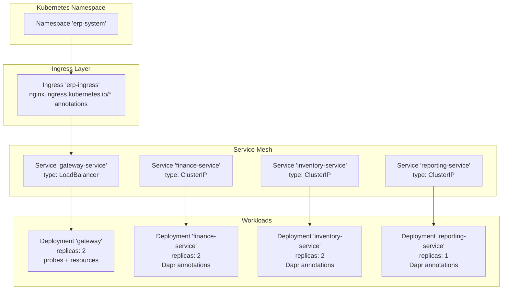
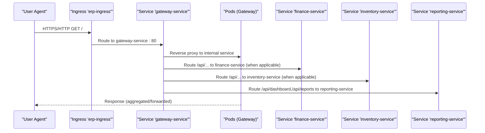
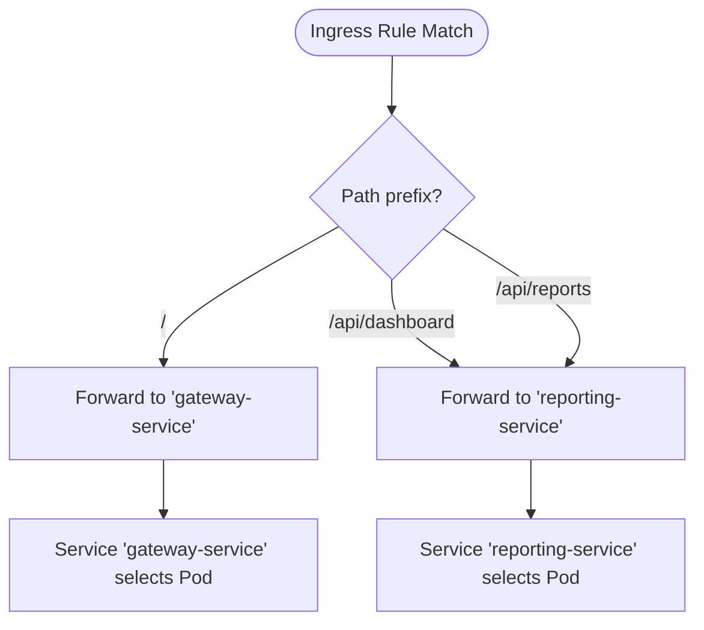
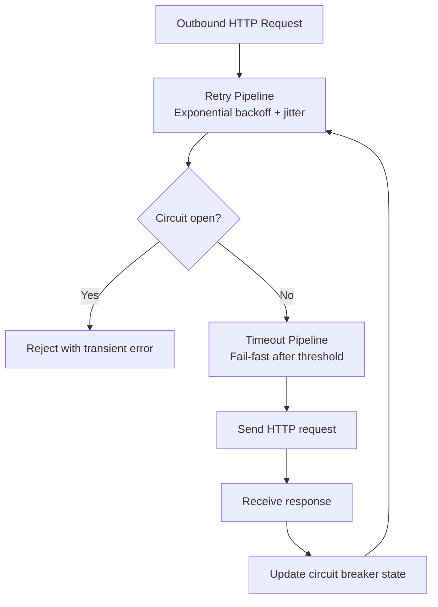
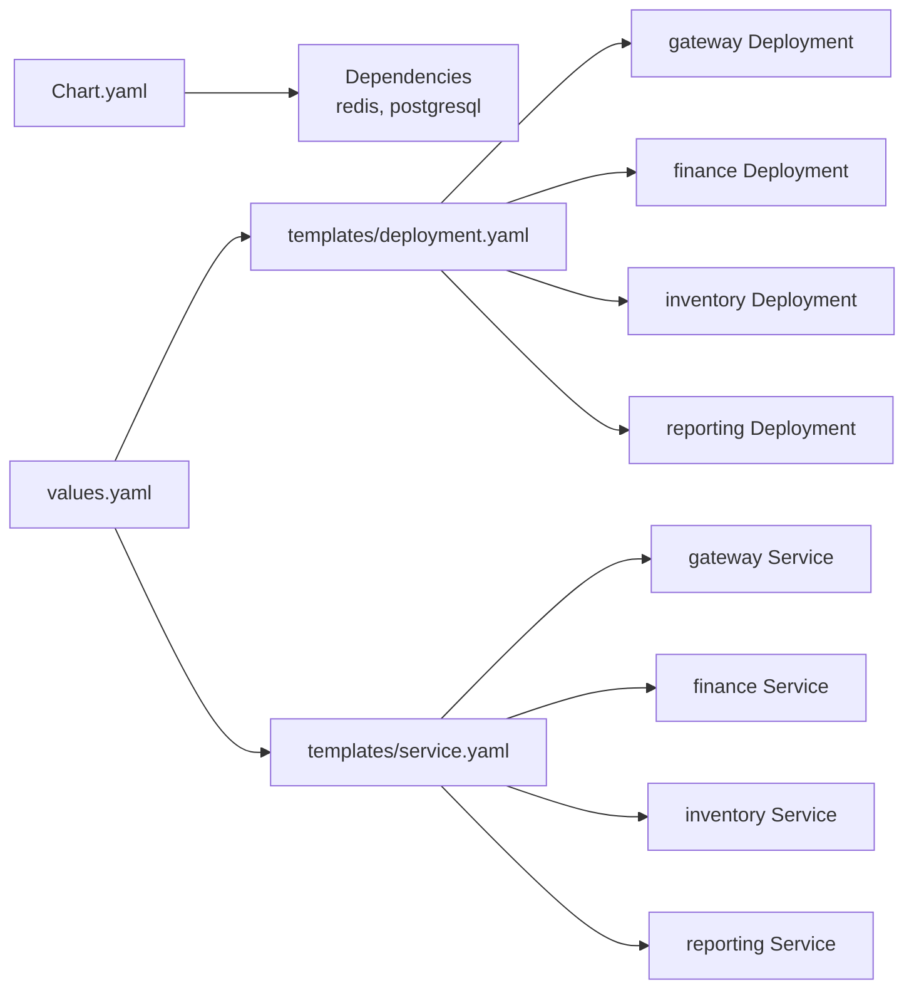

# Scaling and Load Balancing

<cite>
**Referenced Files in This Document**
- [ingress.yaml](file://deploy/k8s/ingress.yaml)
- [namespace.yaml](file://deploy/k8s/namespace.yaml)
- [configmap.yaml](file://deploy/k8s/configmap.yaml)
- [secrets.yaml](file://deploy/k8s/secrets.yaml)
- [gateway.yaml](file://deploy/k8s/services/gateway.yaml)
- [finance.yaml](file://deploy/k8s/services/finance.yaml)
- [inventory.yaml](file://deploy/k8s/services/inventory.yaml)
- [reporting.yaml](file://deploy/k8s/services/reporting.yaml)
- [values.yaml](file://deploy/helm/erp-system/values.yaml)
- [deployment.yaml](file://deploy/helm/erp-system/templates/deployment.yaml)
- [service.yaml](file://deploy/helm/erp-system/templates/service.yaml)
- [Chart.yaml](file://deploy/helm/erp-system/Chart.yaml)
- [_helpers.tpl](file://deploy/helm/erp-system/templates/_helpers.tpl)
- [deployment.md](file://docs/deployment.md)
- [Program.cs](file://src/Gateways/ErpSystem.Gateway/Program.cs)
- [ResiliencePolicies.cs](file://src/BuildingBlocks/ErpSystem.BuildingBlocks/Resilience/ResiliencePolicies.cs)
- [ObservabilityExtensions.cs](file://src/BuildingBlocks/ErpSystem.BuildingBlocks/Observability/ObservabilityExtensions.cs)
</cite>

## Table of Contents
1. [Introduction](#introduction)
2. [Project Structure](#project-structure)
3. [Core Components](#core-components)
4. [Architecture Overview](#architecture-overview)
5. [Detailed Component Analysis](#detailed-component-analysis)
6. [Dependency Analysis](#dependency-analysis)
7. [Performance Considerations](#performance-considerations)
8. [Troubleshooting Guide](#troubleshooting-guide)
9. [Conclusion](#conclusion)
10. [Appendices](#appendices)

## Introduction
This document provides comprehensive guidance for scaling and load balancing the ERP microservices system. It covers horizontal pod autoscaling configuration, service load balancing strategies, replica count management, deployment strategies for high availability, connection pooling and circuit breaker patterns, resilience mechanisms, capacity planning, performance benchmarking, traffic distribution, blue-green deployments, rolling updates, and troubleshooting scaling-related issues.

## Project Structure
The system uses a dual-deployment strategy:
- Helm-based deployment for scalable, repeatable installations across environments.
- Raw Kubernetes manifests for quick iteration and explicit control of core primitives (Ingress, Services, Deployments).

Key deployment artifacts:
- Helm chart defines service defaults, replica counts, resource requests/limits, and optional external dependencies (PostgreSQL, Redis).
- Kubernetes manifests define Ingress routing, Services, and per-service Deployments with probes and resource constraints.

**Diagram sources**
- [ingress.yaml](file://deploy/k8s/ingress.yaml#L1-L37)
- [gateway.yaml](file://deploy/k8s/services/gateway.yaml#L1-L60)
- [finance.yaml](file://deploy/k8s/services/finance.yaml#L1-L66)
- [inventory.yaml](file://deploy/k8s/services/inventory.yaml#L1-L66)
- [reporting.yaml](file://deploy/k8s/services/reporting.yaml#L1-L64)

**Section sources**
- [namespace.yaml](file://deploy/k8s/namespace.yaml#L1-L8)
- [ingress.yaml](file://deploy/k8s/ingress.yaml#L1-L37)
- [configmap.yaml](file://deploy/k8s/configmap.yaml#L1-L25)
- [secrets.yaml](file://deploy/k8s/secrets.yaml#L1-L19)
- [values.yaml](file://deploy/helm/erp-system/values.yaml#L1-L127)
- [deployment.md](file://docs/deployment.md#L1-L115)

## Core Components
- Ingress: Routes traffic to the Gateway service and specific backend services for reporting.
- Services: Expose workloads internally (ClusterIP) or externally (LoadBalancer).
- Deployments: Define replicas, probes, and resource constraints for each service.
- Helm chart: Centralizes configuration, enabling environment-specific overrides and repeatable deployments.

Replica counts and resource profiles:
- Gateway: 2 replicas with modest CPU/memory requests/limits and health probes.
- Finance/Inventory/Identity/Sales: 2 replicas each.
- Procurement/Production/Reporting: 1 replica each.
- Shared resource defaults: requests/limits defined centrally and overridden per service.

**Section sources**
- [ingress.yaml](file://deploy/k8s/ingress.yaml#L1-L37)
- [gateway.yaml](file://deploy/k8s/services/gateway.yaml#L10-L10)
- [finance.yaml](file://deploy/k8s/services/finance.yaml#L10-L10)
- [inventory.yaml](file://deploy/k8s/services/inventory.yaml#L10-L10)
- [reporting.yaml](file://deploy/k8s/services/reporting.yaml#L10-L10)
- [values.yaml](file://deploy/helm/erp-system/values.yaml#L11-L19)
- [values.yaml](file://deploy/helm/erp-system/values.yaml#L22-L85)

## Architecture Overview
The system routes external traffic through an Nginx Ingress to the Gateway service, which acts as a reverse proxy and applies enterprise-grade resilience policies. Internal services communicate via ClusterIP Services and Dapr-enabled Deployments.

**Diagram sources**
- [ingress.yaml](file://deploy/k8s/ingress.yaml#L12-L36)
- [gateway.yaml](file://deploy/k8s/services/gateway.yaml#L48-L60)
- [finance.yaml](file://deploy/k8s/services/finance.yaml#L54-L66)
- [inventory.yaml](file://deploy/k8s/services/inventory.yaml#L54-L66)
- [reporting.yaml](file://deploy/k8s/services/reporting.yaml#L52-L64)

## Detailed Component Analysis

### Horizontal Pod Autoscaling (HPA)
- Current state: No HPA resources are defined in the provided manifests. HPA can be configured to scale based on CPU and memory metrics.
- Recommended approach:
  - Create HPA resources targeting Deployments (e.g., gateway, finance, inventory).
  - Use metric types: Resource CPU and/or Memory.
  - Set min/max replicas aligned with capacity planning.
  - Combine with PodDisruptionBudgets for high availability during autoscaling events.

[No sources needed since this section provides general guidance]

### Service Load Balancing Strategies
- Ingress: Nginx-based Ingress with rewrite-target and body-size annotations; routes to gateway-service and specific backend services.
- Services:
  - Gateway: LoadBalancer for external exposure.
  - Internal services: ClusterIP for intra-cluster communication.
- Dapr: Enabled via annotations on Deployments, facilitating service invocation and state/pub-sub abstractions.

**Diagram sources**
- [ingress.yaml](file://deploy/k8s/ingress.yaml#L12-L36)
- [gateway.yaml](file://deploy/k8s/services/gateway.yaml#L48-L60)
- [reporting.yaml](file://deploy/k8s/services/reporting.yaml#L52-L64)

**Section sources**
- [ingress.yaml](file://deploy/k8s/ingress.yaml#L6-L9)
- [gateway.yaml](file://deploy/k8s/services/gateway.yaml#L48-L60)
- [finance.yaml](file://deploy/k8s/services/finance.yaml#L54-L66)
- [inventory.yaml](file://deploy/k8s/services/inventory.yaml#L54-L66)
- [reporting.yaml](file://deploy/k8s/services/reporting.yaml#L52-L64)

### Replica Count Management and High Availability
- Defaults:
  - Common replicaCount: 2.
  - Service-specific overrides: finance/inventory/sales/identity: 2; procurement/production/reporting: 1.
- HA considerations:
  - Spread pods across nodes using PodTopologySpreadConstraints.
  - Use PodDisruptionBudgets to maintain availability during maintenance.
  - Ensure anti-affinity rules to avoid colocating replicas on the same node.

**Section sources**
- [values.yaml](file://deploy/helm/erp-system/values.yaml#L11-L19)
- [values.yaml](file://deploy/helm/erp-system/values.yaml#L22-L85)

### Deployment Strategies (Rolling Updates and Blue-Green)
- Rolling updates:
  - Default strategy in Deployments; configure maxUnavailable and maxSurge for controlled rollouts.
- Blue-green:
  - Run two identical environments (blue/green) behind a single Ingress endpoint.
  - Switch traffic by updating the Ingress backend service reference atomically.
- Canary:
  - Gradually shift traffic to the new version using weighted routing (via Ingress controller features).

[No sources needed since this section provides general guidance]

### Connection Pooling, Circuit Breakers, and Resilience
- Gateway resilience:
  - Defines a composite resilience pipeline with retry (exponential backoff + jitter), circuit breaker, and timeout.
  - Applies rate limiting to protect backend services.
- Building blocks:
  - Predefined resilience policies (retry, circuit breaker, timeout) for HTTP and general use.
- Observability:
  - OpenTelemetry integration for metrics/traces/logging.

**Diagram sources**
- [Program.cs](file://src/Gateways/ErpSystem.Gateway/Program.cs#L30-L58)
- [ResiliencePolicies.cs](file://src/BuildingBlocks/ErpSystem.BuildingBlocks/Resilience/ResiliencePolicies.cs#L18-L90)

**Section sources**
- [Program.cs](file://src/Gateways/ErpSystem.Gateway/Program.cs#L30-L64)
- [ResiliencePolicies.cs](file://src/BuildingBlocks/ErpSystem.BuildingBlocks/Resilience/ResiliencePolicies.cs#L18-L110)
- [ObservabilityExtensions.cs](file://src/BuildingBlocks/ErpSystem.BuildingBlocks/Observability/ObservabilityExtensions.cs#L12-L42)

### Capacity Planning and Performance Benchmarking
- Resource sizing:
  - Use shared defaults and service overrides to establish baseline CPU/memory requests/limits.
  - Monitor real-world utilization and adjust replicas and limits accordingly.
- Benchmarking:
  - Use tools like k6/JMeter against the Ingress endpoint to simulate concurrent users.
  - Track latency percentiles, error rates, and saturation points (CPU, memory, network).
  - Validate HPA behavior under sustained load.

[No sources needed since this section provides general guidance]

### Traffic Distribution
- Ingress routing:
  - Host-based and path-based routing to specific services.
- Service-level distribution:
  - Kubernetes Service distributes traffic among available pods.
- External load balancers:
  - Gateway Service uses LoadBalancer to distribute external traffic across Gateway pods.

**Section sources**
- [ingress.yaml](file://deploy/k8s/ingress.yaml#L12-L36)
- [gateway.yaml](file://deploy/k8s/services/gateway.yaml#L48-L60)

## Dependency Analysis
Helm chart dependencies and relationships:
- Chart metadata declares Postgres and Redis dependencies.
- Values drive service configuration, replica counts, and resource allocations.
- Templates render Deployments and Services per service definition.

**Diagram sources**
- [Chart.yaml](file://deploy/helm/erp-system/Chart.yaml#L18-L27)
- [values.yaml](file://deploy/helm/erp-system/values.yaml#L1-L127)
- [deployment.yaml](file://deploy/helm/erp-system/templates/deployment.yaml#L1-L58)
- [service.yaml](file://deploy/helm/erp-system/templates/service.yaml#L1-L22)

**Section sources**
- [Chart.yaml](file://deploy/helm/erp-system/Chart.yaml#L1-L27)
- [values.yaml](file://deploy/helm/erp-system/values.yaml#L1-L127)
- [deployment.yaml](file://deploy/helm/erp-system/templates/deployment.yaml#L1-L58)
- [service.yaml](file://deploy/helm/erp-system/templates/service.yaml#L1-L22)

## Performance Considerations
- Resource requests/limits:
  - Ensure adequate CPU/memory to prevent throttling and OOMKills.
  - Align with observed workload patterns and concurrency.
- Probes:
  - Liveness/readiness probes help Kubernetes manage pod lifecycle and traffic routing.
- Ingress tuning:
  - Body size and SSL redirect annotations impact throughput and latency.
- Observability:
  - Enable OpenTelemetry exporters and dashboards for runtime insights.

[No sources needed since this section provides general guidance]

## Troubleshooting Guide
- Scaling-related issues:
  - Verify HPA creation and metrics availability if autoscaling is desired.
  - Check PodDisruptionBudgets preventing evictions during scaling.
- Performance bottlenecks:
  - Inspect CPU/memory usage and saturation; adjust replicas or resource limits.
  - Review Ingress annotations and backend service selection.
- Health checks:
  - Confirm /health and /health/ready endpoints are reachable and responsive.
- Connectivity:
  - Validate ConfigMap/Secrets injection and internal DNS resolution between services.
- Deployment validation:
  - Use documented commands to check pods, services, and ingress status.

**Section sources**
- [deployment.md](file://docs/deployment.md#L46-L57)
- [gateway.yaml](file://deploy/k8s/services/gateway.yaml#L35-L46)
- [finance.yaml](file://deploy/k8s/services/finance.yaml#L41-L52)
- [inventory.yaml](file://deploy/k8s/services/inventory.yaml#L42-L53)
- [reporting.yaml](file://deploy/k8s/services/reporting.yaml#L39-L50)
- [configmap.yaml](file://deploy/k8s/configmap.yaml#L11-L24)
- [secrets.yaml](file://deploy/k8s/secrets.yaml#L7-L18)

## Conclusion
The ERP microservices system is structured for scalability and high availability through Helm-driven deployments, explicit Kubernetes primitives, and robust resilience patterns. By combining conservative replica defaults, resource constraints, Dapr integration, and enterprise-grade resilience at the Gateway, the platform supports predictable growth. Implementing HPA, PodDisruptionBudgets, and comprehensive observability completes the operational picture for production-grade scaling and load balancing.

## Appendices
- Helm installation and validation commands are documented for quick verification of rollout status.

**Section sources**
- [deployment.md](file://docs/deployment.md#L26-L57)