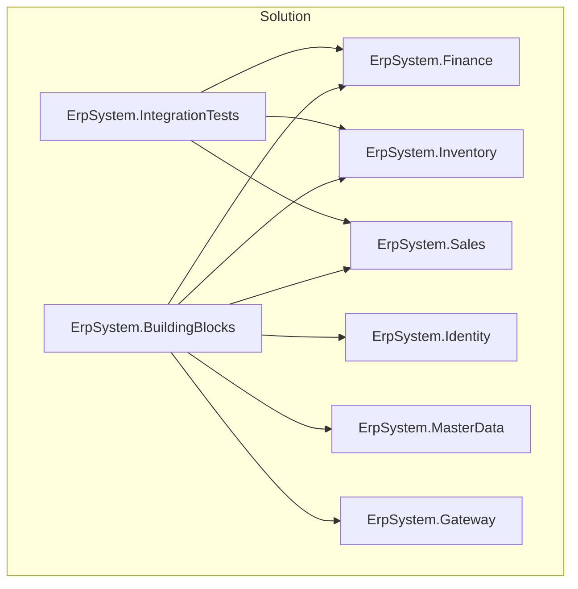
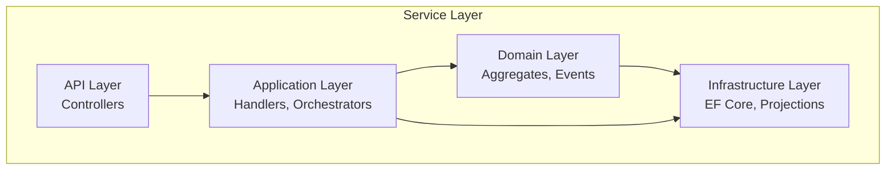
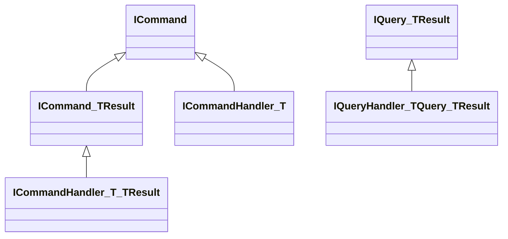
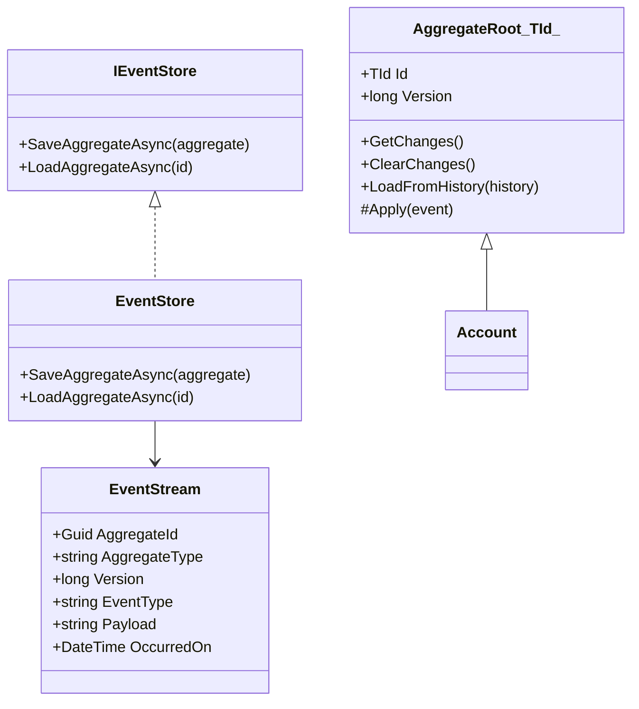
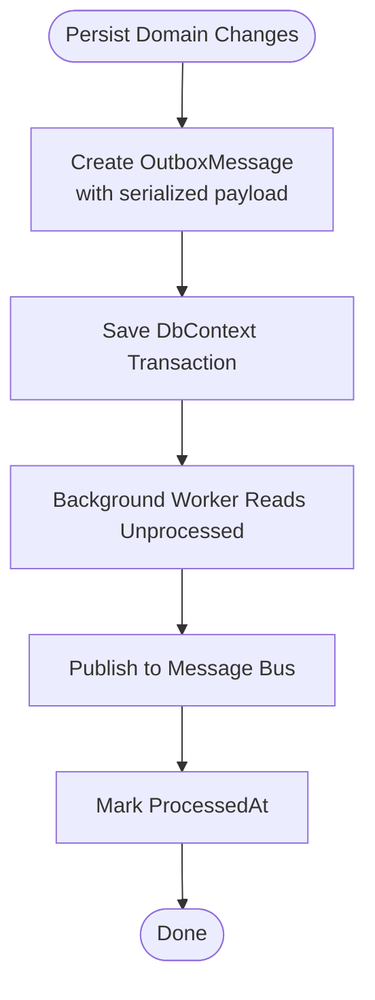
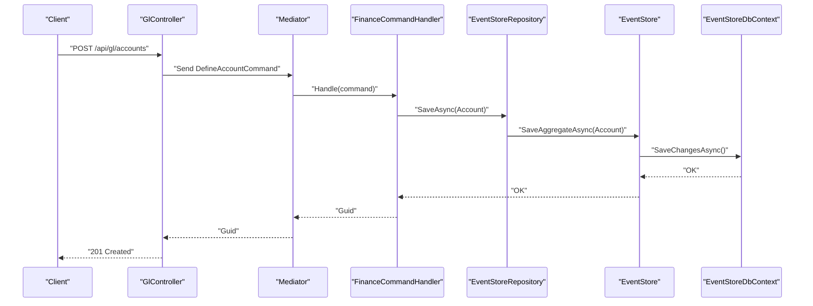
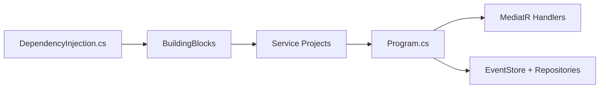

# Development Guidelines

<cite>
**Referenced Files in This Document**
- [README.md](file://README.md)
- [DEVELOPMENT_PLAN.md](file://DEVELOPMENT_PLAN.md)
- [src/ErpSystem.sln](file://src/ErpSystem.sln)
- [src/BuildingBlocks/ErpSystem.BuildingBlocks/DependencyInjection.cs](file://src/BuildingBlocks/ErpSystem.BuildingBlocks/DependencyInjection.cs)
- [src/BuildingBlocks/ErpSystem.BuildingBlocks/CQRS/Abstractions.cs](file://src/BuildingBlocks/ErpSystem.BuildingBlocks/CQRS/Abstractions.cs)
- [src/BuildingBlocks/ErpSystem.BuildingBlocks/Domain/DDDBase.cs](file://src/BuildingBlocks/ErpSystem.BuildingBlocks/Domain/DDDBase.cs)
- [src/BuildingBlocks/ErpSystem.BuildingBlocks/Outbox/OutboxMessage.cs](file://src/BuildingBlocks/ErpSystem.BuildingBlocks/Outbox/OutboxMessage.cs)
- [src/BuildingBlocks/ErpSystem.BuildingBlocks/Domain/Specifications/ISpecification.cs](file://src/BuildingBlocks/ErpSystem.BuildingBlocks/Domain/Specifications/ISpecification.cs)
- [src/BuildingBlocks/ErpSystem.BuildingBlocks/Behaviors/ValidationBehavior.cs](file://src/BuildingBlocks/ErpSystem.BuildingBlocks/Behaviors/ValidationBehavior.cs)
- [src/BuildingBlocks/ErpSystem.BuildingBlocks/Resilience/ResiliencePolicies.cs](file://src/BuildingBlocks/ErpSystem.BuildingBlocks/Resilience/ResiliencePolicies.cs)
- [src/Services/Finance/ErpSystem.Finance/Program.cs](file://src/Services/Finance/ErpSystem.Finance/Program.cs)
- [src/Services/Finance/ErpSystem.Finance/Application/FinanceCommands.cs](file://src/Services/Finance/ErpSystem.Finance/Application/FinanceCommands.cs)
- [src/Services/Finance/ErpSystem.Finance/Domain/AccountAggregate.cs](file://src/Services/Finance/ErpSystem.Finance/Domain/AccountAggregate.cs)
- [src/Services/Finance/ErpSystem.Finance/Infrastructure/Persistence.cs](file://src/Services/Finance/ErpSystem.Finance/Infrastructure/Persistence.cs)
- [src/Services/Finance/ErpSystem.Finance/API/GLController.cs](file://src/Services/Finance/ErpSystem.Finance/API/GLController.cs)
</cite>

## Table of Contents
1. [Introduction](#introduction)
2. [Project Structure](#project-structure)
3. [Core Components](#core-components)
4. [Architecture Overview](#architecture-overview)
5. [Detailed Component Analysis](#detailed-component-analysis)
6. [Dependency Analysis](#dependency-analysis)
7. [Performance Considerations](#performance-considerations)
8. [Troubleshooting Guide](#troubleshooting-guide)
9. [Contribution Workflow](#contribution-workflow)
10. [Testing Best Practices](#testing-best-practices)
11. [Documentation Requirements](#documentation-requirements)
12. [Development Environment Setup](#development-environment-setup)
13. [Common Development Tasks](#common-development-tasks)
14. [Conclusion](#conclusion)

## Introduction
This document defines comprehensive development guidelines for contributing to the ERP microservices project. It consolidates coding standards, naming conventions, architectural patterns, domain modeling, service development, event design, contribution workflow, testing, documentation, environment setup, debugging, and performance optimization grounded in the repository’s existing implementation.

## Project Structure
The project follows a clean, layered microservices architecture with a shared building blocks library and per-service bounded contexts. The solution file enumerates all services and supporting projects, while the README outlines the overall architecture and deployment stack.

**Diagram sources**
- [src/ErpSystem.sln](file://src/ErpSystem.sln#L1-L400)

**Section sources**
- [src/ErpSystem.sln](file://src/ErpSystem.sln#L1-L400)
- [README.md](file://README.md#L130-L184)

## Core Components
- Shared Building Blocks: Cross-cutting concerns including CQRS abstractions, DDD base classes, outbox pattern, resilience policies, and pipeline behaviors.
- Service Boundaries: Each microservice encapsulates domain logic, application orchestration, domain aggregates/events, and infrastructure persistence/read models.
- Event-Driven Integration: Event sourcing with an event store and outbox pattern ensures reliable asynchronous messaging and projections.

Key building block references:
- CQRS abstractions for commands, queries, and handlers.
- DDD base classes for aggregates and event streams.
- Outbox message model and repository interface for reliable delivery.
- Validation behavior pipeline and resilience policies.

**Section sources**
- [src/BuildingBlocks/ErpSystem.BuildingBlocks/CQRS/Abstractions.cs](file://src/BuildingBlocks/ErpSystem.BuildingBlocks/CQRS/Abstractions.cs#L1-L39)
- [src/BuildingBlocks/ErpSystem.BuildingBlocks/Domain/DDDBase.cs](file://src/BuildingBlocks/ErpSystem.BuildingBlocks/Domain/DDDBase.cs#L1-L137)
- [src/BuildingBlocks/ErpSystem.BuildingBlocks/Outbox/OutboxMessage.cs](file://src/BuildingBlocks/ErpSystem.BuildingBlocks/Outbox/OutboxMessage.cs#L1-L82)
- [src/BuildingBlocks/ErpSystem.BuildingBlocks/Behaviors/ValidationBehavior.cs](file://src/BuildingBlocks/ErpSystem.BuildingBlocks/Behaviors/ValidationBehavior.cs#L1-L34)
- [src/BuildingBlocks/ErpSystem.BuildingBlocks/Resilience/ResiliencePolicies.cs](file://src/BuildingBlocks/ErpSystem.BuildingBlocks/Resilience/ResiliencePolicies.cs#L1-L111)

## Architecture Overview
The system employs:
- Clean Architecture per service with API, Application, Domain, and Infrastructure layers.
- CQRS with MediatR for commands and queries.
- Domain-Driven Design with event-sourced aggregates and read models.
- Outbox pattern for reliable inter-service messaging.
- Dapr-backed event bus for decoupled communication.

**Diagram sources**
- [src/Services/Finance/ErpSystem.Finance/Program.cs](file://src/Services/Finance/ErpSystem.Finance/Program.cs#L1-L86)
- [src/Services/Finance/ErpSystem.Finance/Application/FinanceCommands.cs](file://src/Services/Finance/ErpSystem.Finance/Application/FinanceCommands.cs#L1-L142)
- [src/Services/Finance/ErpSystem.Finance/Domain/AccountAggregate.cs](file://src/Services/Finance/ErpSystem.Finance/Domain/AccountAggregate.cs#L1-L87)
- [src/Services/Finance/ErpSystem.Finance/Infrastructure/Persistence.cs](file://src/Services/Finance/ErpSystem.Finance/Infrastructure/Persistence.cs#L1-L132)

## Detailed Component Analysis

### CQRS and Pipeline Behaviors
- Use the shared CQRS abstractions for all commands and queries.
- Validation behavior is registered globally; ensure validators are provided per request type.
- Logging and performance behaviors are included to standardize cross-cutting concerns.

**Diagram sources**
- [src/BuildingBlocks/ErpSystem.BuildingBlocks/CQRS/Abstractions.cs](file://src/BuildingBlocks/ErpSystem.BuildingBlocks/CQRS/Abstractions.cs#L1-L39)

**Section sources**
- [src/BuildingBlocks/ErpSystem.BuildingBlocks/CQRS/Abstractions.cs](file://src/BuildingBlocks/ErpSystem.BuildingBlocks/CQRS/Abstractions.cs#L1-L39)
- [src/BuildingBlocks/ErpSystem.BuildingBlocks/Behaviors/ValidationBehavior.cs](file://src/BuildingBlocks/ErpSystem.BuildingBlocks/Behaviors/ValidationBehavior.cs#L1-L34)
- [src/BuildingBlocks/ErpSystem.BuildingBlocks/DependencyInjection.cs](file://src/BuildingBlocks/ErpSystem.BuildingBlocks/DependencyInjection.cs#L1-L31)

### Domain Modeling and Event Sourcing
- Aggregates inherit from the shared base and apply domain events to maintain state.
- Event streams persist domain events with metadata; load aggregates from historical events.
- Use strongly typed domain events and enums to represent business concepts.

**Diagram sources**
- [src/BuildingBlocks/ErpSystem.BuildingBlocks/Domain/DDDBase.cs](file://src/BuildingBlocks/ErpSystem.BuildingBlocks/Domain/DDDBase.cs#L1-L137)
- [src/Services/Finance/ErpSystem.Finance/Domain/AccountAggregate.cs](file://src/Services/Finance/ErpSystem.Finance/Domain/AccountAggregate.cs#L1-L87)

**Section sources**
- [src/BuildingBlocks/ErpSystem.BuildingBlocks/Domain/DDDBase.cs](file://src/BuildingBlocks/ErpSystem.BuildingBlocks/Domain/DDDBase.cs#L1-L137)
- [src/Services/Finance/ErpSystem.Finance/Domain/AccountAggregate.cs](file://src/Services/Finance/ErpSystem.Finance/Domain/AccountAggregate.cs#L1-L87)

### Outbox Pattern for Reliable Messaging
- Persist outbound messages alongside domain changes in the same transaction.
- Use repository methods to enqueue unprocessed messages and mark processed ones.
- Deserialize payloads safely using stored type metadata.

**Diagram sources**
- [src/BuildingBlocks/ErpSystem.BuildingBlocks/Outbox/OutboxMessage.cs](file://src/BuildingBlocks/ErpSystem.BuildingBlocks/Outbox/OutboxMessage.cs#L1-L82)

**Section sources**
- [src/BuildingBlocks/ErpSystem.BuildingBlocks/Outbox/OutboxMessage.cs](file://src/BuildingBlocks/ErpSystem.BuildingBlocks/Outbox/OutboxMessage.cs#L1-L82)

### Finance Service Example: End-to-End Flow
- API controller receives requests and delegates to MediatR handlers.
- Application handlers orchestrate domain operations via repositories backed by event sourcing.
- Domain aggregates emit events; infrastructure persists event streams and publishes notifications.

**Diagram sources**
- [src/Services/Finance/ErpSystem.Finance/API/GLController.cs](file://src/Services/Finance/ErpSystem.Finance/API/GLController.cs#L1-L76)
- [src/Services/Finance/ErpSystem.Finance/Application/FinanceCommands.cs](file://src/Services/Finance/ErpSystem.Finance/Application/FinanceCommands.cs#L1-L142)
- [src/Services/Finance/ErpSystem.Finance/Program.cs](file://src/Services/Finance/ErpSystem.Finance/Program.cs#L1-L86)
- [src/BuildingBlocks/ErpSystem.BuildingBlocks/Domain/DDDBase.cs](file://src/BuildingBlocks/ErpSystem.BuildingBlocks/Domain/DDDBase.cs#L1-L137)

**Section sources**
- [src/Services/Finance/ErpSystem.Finance/API/GLController.cs](file://src/Services/Finance/ErpSystem.Finance/API/GLController.cs#L1-L76)
- [src/Services/Finance/ErpSystem.Finance/Application/FinanceCommands.cs](file://src/Services/Finance/ErpSystem.Finance/Application/FinanceCommands.cs#L1-L142)
- [src/Services/Finance/ErpSystem.Finance/Program.cs](file://src/Services/Finance/ErpSystem.Finance/Program.cs#L1-L86)

## Dependency Analysis
- Shared Building Blocks provide DI registration, CQRS abstractions, DDD base classes, outbox, and resilience.
- Services depend on Building Blocks and register their own DbContexts and handlers.
- The Finance service demonstrates registering event store, repositories, and MediatR handlers.

**Diagram sources**
- [src/BuildingBlocks/ErpSystem.BuildingBlocks/DependencyInjection.cs](file://src/BuildingBlocks/ErpSystem.BuildingBlocks/DependencyInjection.cs#L1-L31)
- [src/Services/Finance/ErpSystem.Finance/Program.cs](file://src/Services/Finance/ErpSystem.Finance/Program.cs#L1-L86)

**Section sources**
- [src/BuildingBlocks/ErpSystem.BuildingBlocks/DependencyInjection.cs](file://src/BuildingBlocks/ErpSystem.BuildingBlocks/DependencyInjection.cs#L1-L31)
- [src/Services/Finance/ErpSystem.Finance/Program.cs](file://src/Services/Finance/ErpSystem.Finance/Program.cs#L1-L86)

## Performance Considerations
- Use resilience policies for transient faults and timeouts; combine retry, circuit breaker, and timeout strategies.
- Prefer projection-based read models for efficient queries; keep write models event-centric.
- Minimize round-trips by batching outbox processing and leveraging background workers.

**Section sources**
- [src/BuildingBlocks/ErpSystem.BuildingBlocks/Resilience/ResiliencePolicies.cs](file://src/BuildingBlocks/ErpSystem.BuildingBlocks/Resilience/ResiliencePolicies.cs#L1-L111)
- [src/BuildingBlocks/ErpSystem.BuildingBlocks/Outbox/OutboxMessage.cs](file://src/BuildingBlocks/ErpSystem.BuildingBlocks/Outbox/OutboxMessage.cs#L1-L82)
- [src/Services/Finance/ErpSystem.Finance/Infrastructure/Persistence.cs](file://src/Services/Finance/ErpSystem.Finance/Infrastructure/Persistence.cs#L1-L132)

## Troubleshooting Guide
- Validation failures: Ensure validators are registered and request shapes match expected DTOs.
- Event loading issues: Confirm event type resolution and JSON payload deserialization.
- Outbox processing errors: Inspect error fields and retry counts; verify background worker connectivity.
- Circuit breaker tripping: Review failure ratios and throughput thresholds; adjust policies as needed.

**Section sources**
- [src/BuildingBlocks/ErpSystem.BuildingBlocks/Behaviors/ValidationBehavior.cs](file://src/BuildingBlocks/ErpSystem.BuildingBlocks/Behaviors/ValidationBehavior.cs#L1-L34)
- [src/BuildingBlocks/ErpSystem.BuildingBlocks/Domain/DDDBase.cs](file://src/BuildingBlocks/ErpSystem.BuildingBlocks/Domain/DDDBase.cs#L1-L137)
- [src/BuildingBlocks/ErpSystem.BuildingBlocks/Outbox/OutboxMessage.cs](file://src/BuildingBlocks/ErpSystem.BuildingBlocks/Outbox/OutboxMessage.cs#L1-L82)
- [src/BuildingBlocks/ErpSystem.BuildingBlocks/Resilience/ResiliencePolicies.cs](file://src/BuildingBlocks/ErpSystem.BuildingBlocks/Resilience/ResiliencePolicies.cs#L1-L111)

## Contribution Workflow
- Fork, clone, branch, code, test, and open a pull request following the repository’s established process.
- Branch naming and commit conventions should reflect feature scope and impact.

**Section sources**
- [README.md](file://README.md#L363-L372)

## Testing Best Practices
- Run all tests via the solution; filter by service-specific test categories.
- Integration tests exercise cross-service flows; ensure database initialization and cleanup are handled.

**Section sources**
- [README.md](file://README.md#L326-L339)
- [src/Services/Finance/ErpSystem.Finance/Program.cs](file://src/Services/Finance/ErpSystem.Finance/Program.cs#L63-L71)

## Documentation Requirements
- Document new services with API endpoints, domain models, and integration points.
- Update deployment and architecture documentation as applicable.

**Section sources**
- [README.md](file://README.md#L255-L286)
- [DEVELOPMENT_PLAN.md](file://DEVELOPMENT_PLAN.md#L1-L110)

## Development Environment Setup
- Prerequisites include .NET 10 SDK, Docker, and PostgreSQL.
- Build and run locally or use Docker Compose; services expose Swagger in development.

**Section sources**
- [README.md](file://README.md#L219-L251)

## Common Development Tasks
- Add a new command/query: define records in Application layer, register handlers, and add API endpoints.
- Extend a domain aggregate: define events, update Apply switch, and ensure projections.
- Introduce a new read model: add entity to read DB context and configure indexes.

**Section sources**
- [src/Services/Finance/ErpSystem.Finance/Application/FinanceCommands.cs](file://src/Services/Finance/ErpSystem.Finance/Application/FinanceCommands.cs#L1-L142)
- [src/Services/Finance/ErpSystem.Finance/Domain/AccountAggregate.cs](file://src/Services/Finance/ErpSystem.Finance/Domain/AccountAggregate.cs#L1-L87)
- [src/Services/Finance/ErpSystem.Finance/Infrastructure/Persistence.cs](file://src/Services/Finance/ErpSystem.Finance/Infrastructure/Persistence.cs#L1-L132)
- [src/Services/Finance/ErpSystem.Finance/API/GLController.cs](file://src/Services/Finance/ErpSystem.Finance/API/GLController.cs#L1-L76)

## Conclusion
These guidelines consolidate the project’s architectural patterns, domain modeling, service boundaries, and operational practices. Adhering to these standards ensures consistency, reliability, and maintainability across the ERP microservices ecosystem.