# API Integration

<cite>
**Referenced Files in This Document**
- [api.ts](file://src/Web/ErpSystem.Web/src/services/api.ts)
- [settingsApi.ts](file://src/Web/ErpSystem.Web/src/api/settingsApi.ts)
- [vite.config.ts](file://src/Web/ErpSystem.Web/vite.config.ts)
- [useAnalyticsHub.ts](file://src/Web/ErpSystem.Web/src/hooks/useAnalyticsHub.ts)
- [Program.cs](file://src/Gateways/ErpSystem.Gateway/Program.cs)
- [appsettings.json](file://src/Gateways/ErpSystem.Gateway/appsettings.json)
- [gateway.yaml](file://deploy/k8s/services/gateway.yaml)
- [ingress.yaml](file://deploy/k8s/ingress.yaml)
- [SignatureVerificationMiddleware.cs](file://src/BuildingBlocks/ErpSystem.BuildingBlocks/Auth/SignatureVerificationMiddleware.cs)
- [AuthExtensions.cs](file://src/BuildingBlocks/ErpSystem.BuildingBlocks/Auth/AuthExtensions.cs)
- [JwtTokenGenerator.cs](file://src/Services/Identity/ErpSystem.Identity/Infrastructure/JwtTokenGenerator.cs)
- [CacheExtensions.cs](file://src/BuildingBlocks/ErpSystem.BuildingBlocks/Caching/CacheExtensions.cs)
- [ResiliencePolicies.cs](file://src/BuildingBlocks/ErpSystem.BuildingBlocks/Resilience/ResiliencePolicies.cs)
- [DaprQueryServices.cs](file://src/Services/Mrp/ErpSystem.Mrp/Infrastructure/DaprQueryServices.cs)
- [ForecastingAppService.cs](file://src/Services/Analytics/ErpSystem.Analytics/Application/ForecastingAppService.cs)
- [DependencyInjection.cs](file://src/BuildingBlocks/ErpSystem.BuildingBlocks/DependencyInjection.cs)
</cite>

## Table of Contents
1. [Introduction](#introduction)
2. [Project Structure](#project-structure)
3. [Core Components](#core-components)
4. [Architecture Overview](#architecture-overview)
5. [Detailed Component Analysis](#detailed-component-analysis)
6. [Dependency Analysis](#dependency-analysis)
7. [Performance Considerations](#performance-considerations)
8. [Troubleshooting Guide](#troubleshooting-guide)
9. [Conclusion](#conclusion)
10. [Appendices](#appendices)

## Introduction
This document explains the API integration patterns and service layer implementation across the system. It focuses on the Axios-based HTTP client configuration in the web frontend, request/response interceptors, error handling strategies, the Settings API service, authentication token management, and endpoint organization. It also documents service abstractions, data transformation patterns, caching strategies, integration with the API gateway, request formatting, and response processing for different business domains.

## Project Structure
The API integration spans three primary areas:
- Frontend HTTP client and service abstractions
- API Gateway routing and resilience
- Backend service integration patterns and cross-service communication

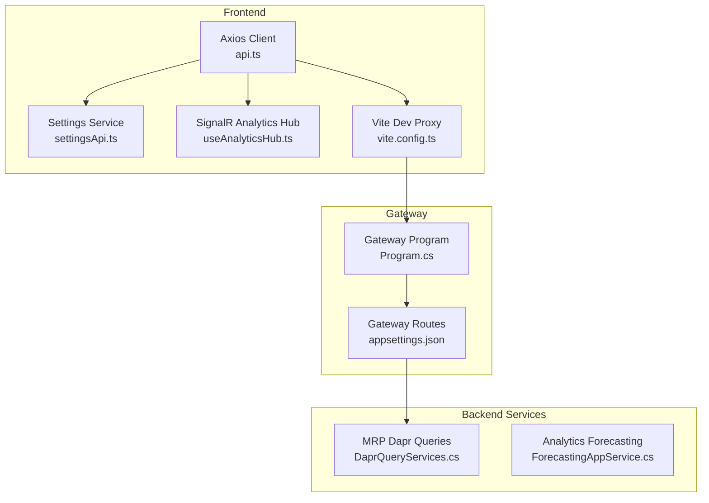

**Diagram sources**
- [api.ts](file://src/Web/ErpSystem.Web/src/services/api.ts#L1-L29)
- [settingsApi.ts](file://src/Web/ErpSystem.Web/src/api/settingsApi.ts#L1-L42)
- [vite.config.ts](file://src/Web/ErpSystem.Web/vite.config.ts#L1-L22)
- [useAnalyticsHub.ts](file://src/Web/ErpSystem.Web/src/hooks/useAnalyticsHub.ts#L1-L51)
- [Program.cs](file://src/Gateways/ErpSystem.Gateway/Program.cs#L1-L107)
- [appsettings.json](file://src/Gateways/ErpSystem.Gateway/appsettings.json#L51-L159)
- [DaprQueryServices.cs](file://src/Services/Mrp/ErpSystem.Mrp/Infrastructure/DaprQueryServices.cs#L40-L84)
- [ForecastingAppService.cs](file://src/Services/Analytics/ErpSystem.Analytics/Application/ForecastingAppService.cs#L1-L42)

**Section sources**
- [api.ts](file://src/Web/ErpSystem.Web/src/services/api.ts#L1-L29)
- [settingsApi.ts](file://src/Web/ErpSystem.Web/src/api/settingsApi.ts#L1-L42)
- [vite.config.ts](file://src/Web/ErpSystem.Web/vite.config.ts#L1-L22)
- [useAnalyticsHub.ts](file://src/Web/ErpSystem.Web/src/hooks/useAnalyticsHub.ts#L1-L51)
- [Program.cs](file://src/Gateways/ErpSystem.Gateway/Program.cs#L1-L107)
- [appsettings.json](file://src/Gateways/ErpSystem.Gateway/appsettings.json#L51-L159)
- [DaprQueryServices.cs](file://src/Services/Mrp/ErpSystem.Mrp/Infrastructure/DaprQueryServices.cs#L40-L84)
- [ForecastingAppService.cs](file://src/Services/Analytics/ErpSystem.Analytics/Application/ForecastingAppService.cs#L1-L42)

## Core Components
- Axios HTTP client with base URL and response interceptor for centralized error logging.
- Settings API service module exposing typed CRUD operations for user preferences.
- Vite dev proxy mapping /api and /hubs to the Gateway.
- Gateway program with resilience policies (retry, circuit breaker, timeout) and rate limiting.
- Gateway route configuration mapping logical clusters to backend services.
- Authentication middleware and JWT generator for identity integration.
- Distributed caching extensions for typed get/set and cache key building.
- Resilience policies for typed HTTP retries and generic resilience pipelines.
- Dapr-based service invocation for cross-service queries.
- Analytics forecasting application service orchestrating data extraction and prediction.

**Section sources**
- [api.ts](file://src/Web/ErpSystem.Web/src/services/api.ts#L1-L29)
- [settingsApi.ts](file://src/Web/ErpSystem.Web/src/api/settingsApi.ts#L1-L42)
- [vite.config.ts](file://src/Web/ErpSystem.Web/vite.config.ts#L1-L22)
- [Program.cs](file://src/Gateways/ErpSystem.Gateway/Program.cs#L30-L64)
- [appsettings.json](file://src/Gateways/ErpSystem.Gateway/appsettings.json#L51-L159)
- [SignatureVerificationMiddleware.cs](file://src/BuildingBlocks/ErpSystem.BuildingBlocks/Auth/SignatureVerificationMiddleware.cs#L14-L76)
- [JwtTokenGenerator.cs](file://src/Services/Identity/ErpSystem.Identity/Infrastructure/JwtTokenGenerator.cs#L8-L37)
- [CacheExtensions.cs](file://src/BuildingBlocks/ErpSystem.BuildingBlocks/Caching/CacheExtensions.cs#L9-L72)
- [ResiliencePolicies.cs](file://src/BuildingBlocks/ErpSystem.BuildingBlocks/Resilience/ResiliencePolicies.cs#L13-L111)
- [DaprQueryServices.cs](file://src/Services/Mrp/ErpSystem.Mrp/Infrastructure/DaprQueryServices.cs#L40-L84)
- [ForecastingAppService.cs](file://src/Services/Analytics/ErpSystem.Analytics/Application/ForecastingAppService.cs#L10-L41)

## Architecture Overview
The frontend communicates with backend services via the API Gateway. The Gateway applies resilience and routing policies, while the frontend uses Axios for HTTP calls and SignalR for real-time analytics updates. Cross-service calls leverage Dapr service invocation.

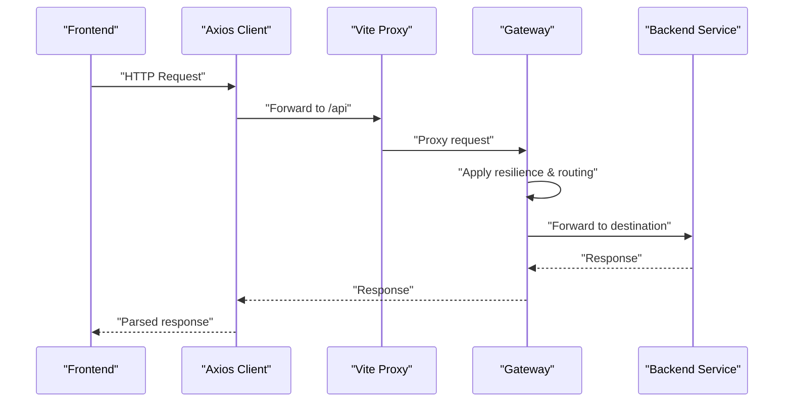

**Diagram sources**
- [api.ts](file://src/Web/ErpSystem.Web/src/services/api.ts#L4-L11)
- [vite.config.ts](file://src/Web/ErpSystem.Web/vite.config.ts#L7-L20)
- [Program.cs](file://src/Gateways/ErpSystem.Gateway/Program.cs#L30-L58)
- [appsettings.json](file://src/Gateways/ErpSystem.Gateway/appsettings.json#L51-L159)

## Detailed Component Analysis

### Axios HTTP Client and Interceptors
- Base URL resolution supports environment override and defaults to a development proxy path.
- Centralized response interceptor logs errors and rejects the promise chain.
- Helper types support paginated results.

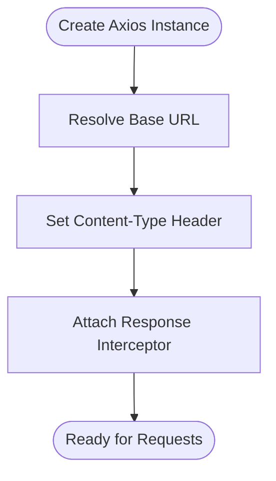

**Diagram sources**
- [api.ts](file://src/Web/ErpSystem.Web/src/services/api.ts#L4-L20)

**Section sources**
- [api.ts](file://src/Web/ErpSystem.Web/src/services/api.ts#L1-L29)

### Settings API Service
- Provides typed operations for user preferences: get, update, and reset.
- Uses a fixed base path for Settings domain endpoints.
- Returns strongly-typed preference models.

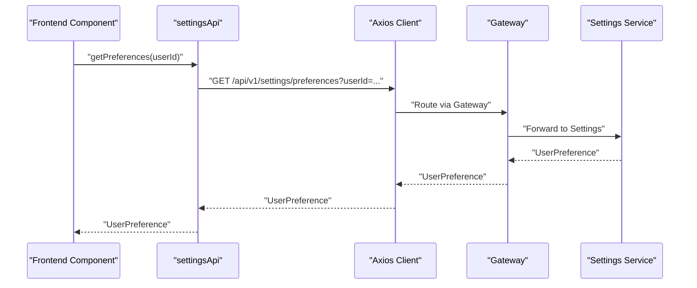

**Diagram sources**
- [settingsApi.ts](file://src/Web/ErpSystem.Web/src/api/settingsApi.ts#L26-L41)
- [api.ts](file://src/Web/ErpSystem.Web/src/services/api.ts#L4-L11)
- [appsettings.json](file://src/Gateways/ErpSystem.Gateway/appsettings.json#L83-L88)

**Section sources**
- [settingsApi.ts](file://src/Web/ErpSystem.Web/src/api/settingsApi.ts#L1-L42)

### Authentication Token Management
- JWT token generation utility produces signed tokens with subject, name, and expiry.
- Signature verification middleware enforces request signing with headers and validates timestamp and signature.
- Auth extension methods wire middleware into the pipeline.

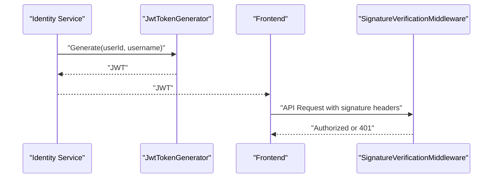

**Diagram sources**
- [JwtTokenGenerator.cs](file://src/Services/Identity/ErpSystem.Identity/Infrastructure/JwtTokenGenerator.cs#L15-L36)
- [SignatureVerificationMiddleware.cs](file://src/BuildingBlocks/ErpSystem.BuildingBlocks/Auth/SignatureVerificationMiddleware.cs#L14-L76)
- [AuthExtensions.cs](file://src/BuildingBlocks/ErpSystem.BuildingBlocks/Auth/AuthExtensions.cs#L8-L17)

**Section sources**
- [JwtTokenGenerator.cs](file://src/Services/Identity/ErpSystem.Identity/Infrastructure/JwtTokenGenerator.cs#L1-L37)
- [SignatureVerificationMiddleware.cs](file://src/BuildingBlocks/ErpSystem.BuildingBlocks/Auth/SignatureVerificationMiddleware.cs#L1-L94)
- [AuthExtensions.cs](file://src/BuildingBlocks/ErpSystem.BuildingBlocks/Auth/AuthExtensions.cs#L1-L18)

### API Endpoint Organization and Gateway Routing
- Gateway routes map logical paths to backend clusters (e.g., /api/v1/settings).
- Kubernetes manifests expose the Gateway service and ingress rules.
- Ingress rewrites and proxies traffic to the Gateway service.

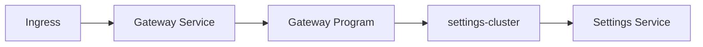

**Diagram sources**
- [appsettings.json](file://src/Gateways/ErpSystem.Gateway/appsettings.json#L83-L88)
- [gateway.yaml](file://deploy/k8s/services/gateway.yaml#L48-L59)
- [ingress.yaml](file://deploy/k8s/ingress.yaml#L12-L22)

**Section sources**
- [appsettings.json](file://src/Gateways/ErpSystem.Gateway/appsettings.json#L51-L159)
- [gateway.yaml](file://deploy/k8s/services/gateway.yaml#L1-L59)
- [ingress.yaml](file://deploy/k8s/ingress.yaml#L1-L36)

### Cross-Service Integration Patterns
- Dapr-based service invocation for querying procurement and production services from MRP.
- Analytics forecasting app service orchestrates data extraction and prediction.

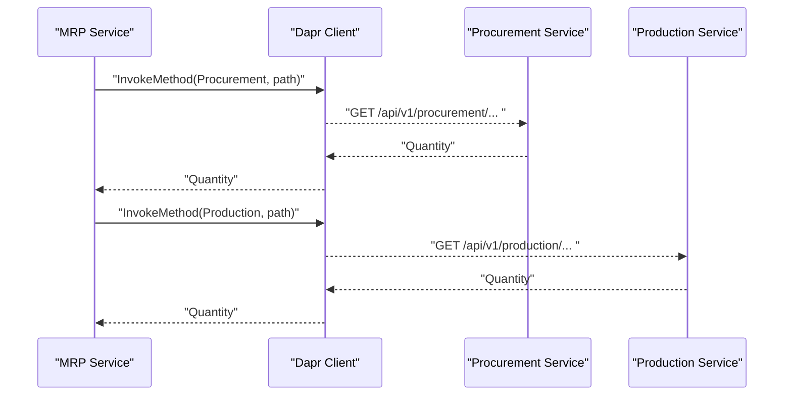

**Diagram sources**
- [DaprQueryServices.cs](file://src/Services/Mrp/ErpSystem.Mrp/Infrastructure/DaprQueryServices.cs#L40-L84)

**Section sources**
- [DaprQueryServices.cs](file://src/Services/Mrp/ErpSystem.Mrp/Infrastructure/DaprQueryServices.cs#L40-L84)
- [ForecastingAppService.cs](file://src/Services/Analytics/ErpSystem.Analytics/Application/ForecastingAppService.cs#L10-L41)

### Data Transformation and Caching Strategies
- Distributed cache extensions provide typed get/set with optional expiration and a helper for get-or-set with factory.
- Cache key builder constructs consistent keys from category and parts.

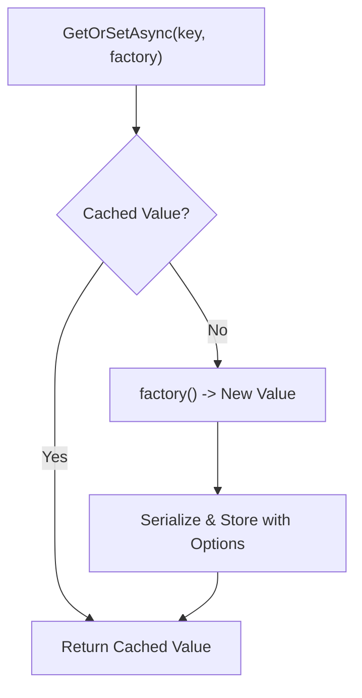

**Diagram sources**
- [CacheExtensions.cs](file://src/BuildingBlocks/ErpSystem.BuildingBlocks/Caching/CacheExtensions.cs#L38-L54)

**Section sources**
- [CacheExtensions.cs](file://src/BuildingBlocks/ErpSystem.BuildingBlocks/Caching/CacheExtensions.cs#L1-L72)

### Resilience and Error Handling
- Gateway defines a standardized resilience pipeline with retry, circuit breaker, and timeout.
- Typed HTTP retry pipeline handles transient errors and specific HTTP statuses.
- Generic resilience policies provide configurable retry and circuit breaker strategies.

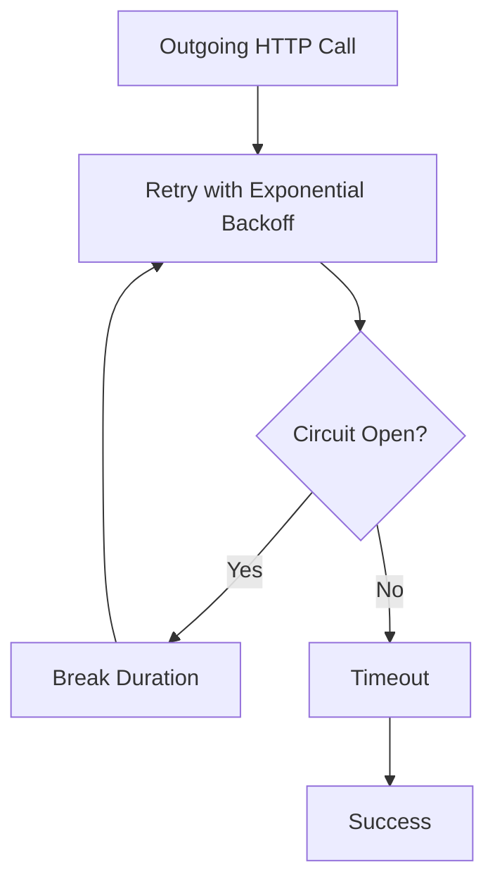

**Diagram sources**
- [Program.cs](file://src/Gateways/ErpSystem.Gateway/Program.cs#L30-L58)
- [ResiliencePolicies.cs](file://src/BuildingBlocks/ErpSystem.BuildingBlocks/Resilience/ResiliencePolicies.cs#L95-L109)

**Section sources**
- [Program.cs](file://src/Gateways/ErpSystem.Gateway/Program.cs#L30-L64)
- [ResiliencePolicies.cs](file://src/BuildingBlocks/ErpSystem.BuildingBlocks/Resilience/ResiliencePolicies.cs#L13-L111)

### Real-Time Integration with SignalR
- Frontend connects to SignalR hubs for real-time analytics updates.
- Automatic reconnect and message handlers update component state.

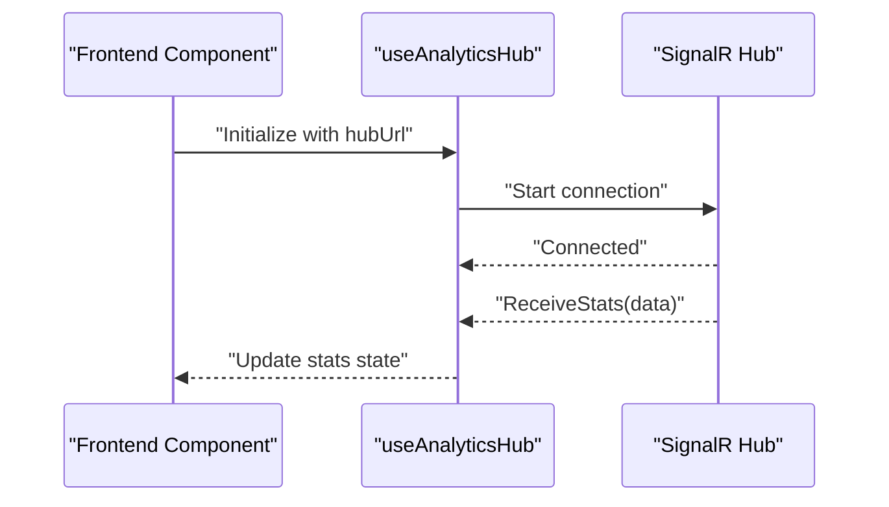

**Diagram sources**
- [useAnalyticsHub.ts](file://src/Web/ErpSystem.Web/src/hooks/useAnalyticsHub.ts#L12-L49)

**Section sources**
- [useAnalyticsHub.ts](file://src/Web/ErpSystem.Web/src/hooks/useAnalyticsHub.ts#L1-L51)

## Dependency Analysis
- Frontend depends on Axios for HTTP and Vite proxy for local development.
- Gateway depends on routing configuration and resilience policies.
- Backend services integrate via Dapr for inter-service calls.
- Building blocks provide shared auth, caching, and resilience capabilities.

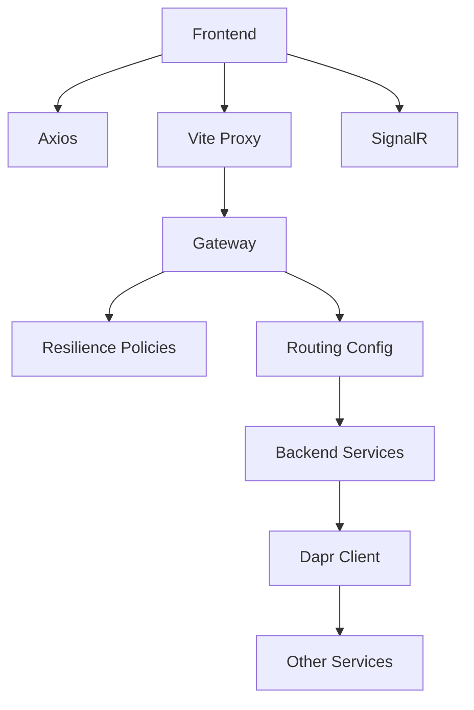

**Diagram sources**
- [api.ts](file://src/Web/ErpSystem.Web/src/services/api.ts#L4-L11)
- [vite.config.ts](file://src/Web/ErpSystem.Web/vite.config.ts#L7-L20)
- [Program.cs](file://src/Gateways/ErpSystem.Gateway/Program.cs#L30-L58)
- [appsettings.json](file://src/Gateways/ErpSystem.Gateway/appsettings.json#L51-L159)
- [DaprQueryServices.cs](file://src/Services/Mrp/ErpSystem.Mrp/Infrastructure/DaprQueryServices.cs#L40-L84)

**Section sources**
- [api.ts](file://src/Web/ErpSystem.Web/src/services/api.ts#L1-L29)
- [vite.config.ts](file://src/Web/ErpSystem.Web/vite.config.ts#L1-L22)
- [Program.cs](file://src/Gateways/ErpSystem.Gateway/Program.cs#L30-L64)
- [appsettings.json](file://src/Gateways/ErpSystem.Gateway/appsettings.json#L51-L159)
- [DaprQueryServices.cs](file://src/Services/Mrp/ErpSystem.Mrp/Infrastructure/DaprQueryServices.cs#L40-L84)

## Performance Considerations
- Use distributed caching to reduce repeated fetches and offload backend load.
- Apply pagination and filtering on the server-side to limit payload sizes.
- Leverage SignalR for efficient real-time updates instead of polling.
- Configure appropriate timeouts and circuit breaker thresholds in the Gateway to avoid resource exhaustion.
- Minimize unnecessary retries by aligning retry strategies with service SLAs.

## Troubleshooting Guide
- Axios error interceptor logs response data or message; inspect browser console for API errors.
- Verify Vite proxy targets and paths for /api and /hubs during development.
- Confirm Gateway route mappings for the Settings cluster and backend service reachability.
- For authentication issues, ensure signature headers are present and valid in requests.
- If cross-service calls fail, check Dapr service invocation destinations and network connectivity.

**Section sources**
- [api.ts](file://src/Web/ErpSystem.Web/src/services/api.ts#L13-L20)
- [vite.config.ts](file://src/Web/ErpSystem.Web/vite.config.ts#L7-L20)
- [appsettings.json](file://src/Gateways/ErpSystem.Gateway/appsettings.json#L83-L88)
- [SignatureVerificationMiddleware.cs](file://src/BuildingBlocks/ErpSystem.BuildingBlocks/Auth/SignatureVerificationMiddleware.cs#L14-L76)
- [DaprQueryServices.cs](file://src/Services/Mrp/ErpSystem.Mrp/Infrastructure/DaprQueryServices.cs#L40-L84)

## Conclusion
The system integrates a robust API layer with a resilient Gateway, a typed frontend HTTP client, and strong cross-service communication patterns. Authentication and caching utilities enhance security and performance. The documented patterns provide a foundation for scalable API integrations across business domains.

## Appendices
- Environment variable usage for base URL allows flexible deployment configurations.
- Dependency injection wiring for building blocks ensures consistent cross-cutting concerns across services.

**Section sources**
- [api.ts](file://src/Web/ErpSystem.Web/src/services/api.ts#L4-L11)
- [DependencyInjection.cs](file://src/BuildingBlocks/ErpSystem.BuildingBlocks/DependencyInjection.cs#L10-L29)