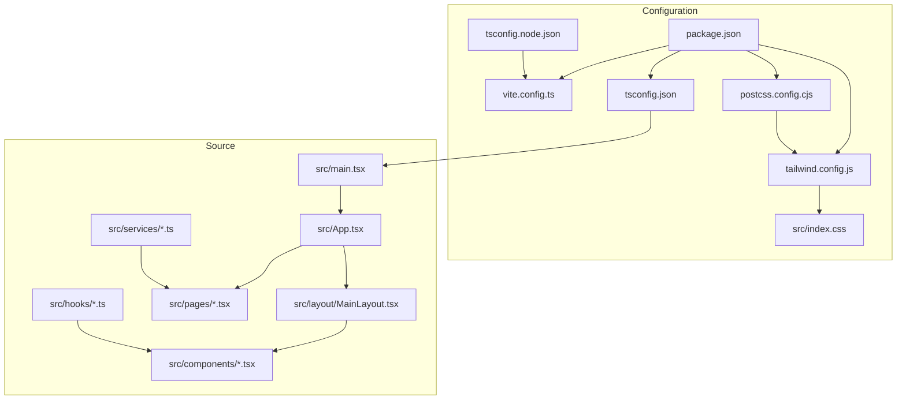
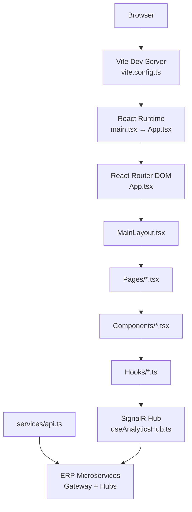
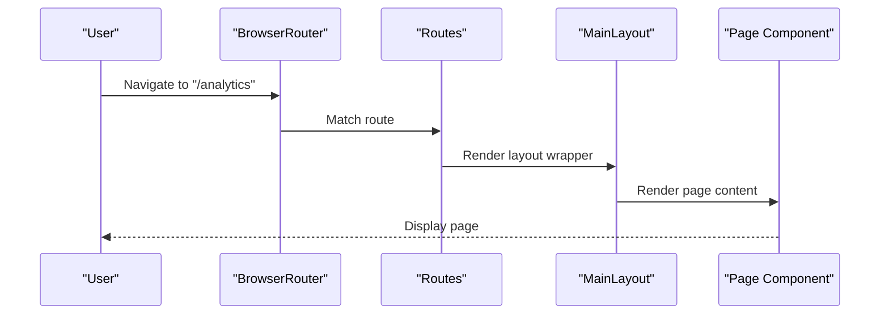
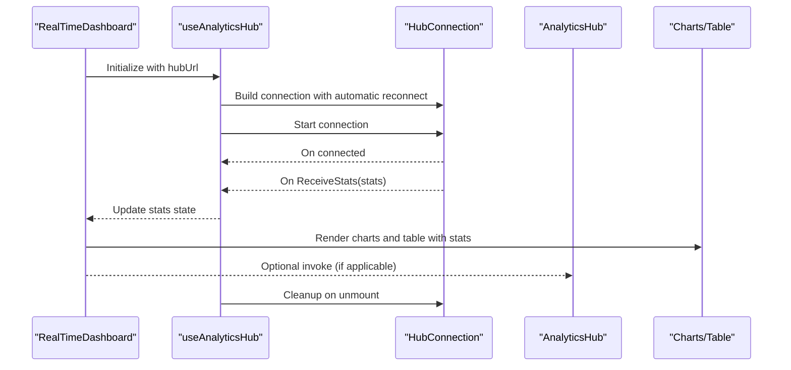
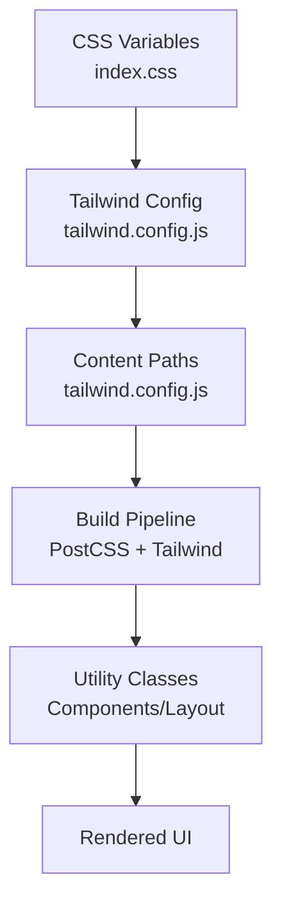
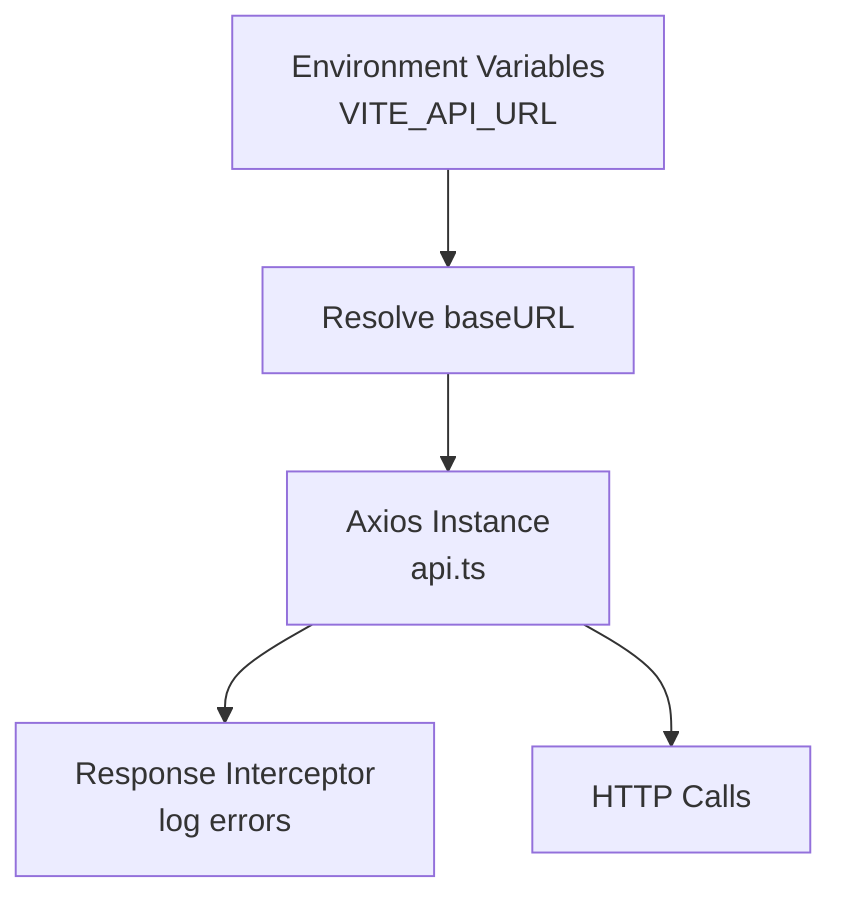
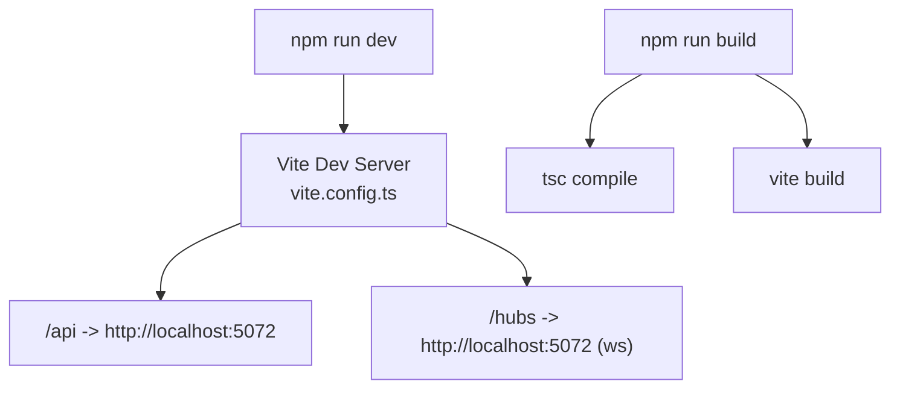
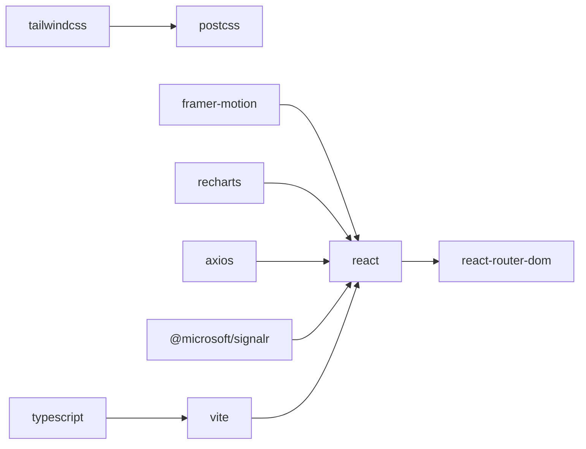

# Application Architecture

<cite>
**Referenced Files in This Document**
- [package.json](file://src/Web/ErpSystem.Web/package.json)
- [vite.config.ts](file://src/Web/ErpSystem.Web/vite.config.ts)
- [tsconfig.json](file://src/Web/ErpSystem.Web/tsconfig.json)
- [tsconfig.node.json](file://src/Web/ErpSystem.Web/tsconfig.node.json)
- [postcss.config.cjs](file://src/Web/ErpSystem.Web/postcss.config.cjs)
- [tailwind.config.js](file://src/Web/ErpSystem.Web/tailwind.config.js)
- [index.css](file://src/Web/ErpSystem.Web/src/index.css)
- [main.tsx](file://src/Web/ErpSystem.Web/src/main.tsx)
- [App.tsx](file://src/Web/ErpSystem.Web/src/App.tsx)
- [MainLayout.tsx](file://src/Web/ErpSystem.Web/src/layout/MainLayout.tsx)
- [Analytics.tsx](file://src/Web/ErpSystem.Web/src/pages/Analytics.tsx)
- [RealTimeDashboard.tsx](file://src/Web/ErpSystem.Web/src/components/RealTimeDashboard.tsx)
- [useAnalyticsHub.ts](file://src/Web/ErpSystem.Web/src/hooks/useAnalyticsHub.ts)
- [api.ts](file://src/Web/ErpSystem.Web/src/services/api.ts)
</cite>

## Table of Contents
1. [Introduction](#introduction)
2. [Project Structure](#project-structure)
3. [Core Components](#core-components)
4. [Architecture Overview](#architecture-overview)
5. [Detailed Component Analysis](#detailed-component-analysis)
6. [Dependency Analysis](#dependency-analysis)
7. [Performance Considerations](#performance-considerations)
8. [Troubleshooting Guide](#troubleshooting-guide)
9. [Conclusion](#conclusion)

## Introduction
This document describes the React application architecture for the ERP microservice frontend. It explains the Vite-based build system, TypeScript configuration, modern React patterns, routing, component hierarchy, styling with Tailwind CSS, animation with Framer Motion, real-time communication via SignalR, development server setup, build process, and production optimization strategies. The goal is to help both technical and non-technical readers understand how the frontend is structured and how it integrates with backend services and real-time analytics.

## Project Structure
The React application resides under src/Web/ErpSystem.Web and follows a conventional split between configuration, source code, and assets. Key areas:
- Configuration: Vite, TypeScript, PostCSS, and Tailwind CSS configuration files
- Source: Entry point, routing, layouts, pages, components, hooks, and services
- Styles: Global CSS and Tailwind configuration extending design tokens

**Diagram sources**
- [package.json](file://src/Web/ErpSystem.Web/package.json#L1-L35)
- [vite.config.ts](file://src/Web/ErpSystem.Web/vite.config.ts#L1-L23)
- [tsconfig.json](file://src/Web/ErpSystem.Web/tsconfig.json#L1-L35)
- [tsconfig.node.json](file://src/Web/ErpSystem.Web/tsconfig.node.json#L1-L12)
- [postcss.config.cjs](file://src/Web/ErpSystem.Web/postcss.config.cjs#L1-L7)
- [tailwind.config.js](file://src/Web/ErpSystem.Web/tailwind.config.js#L1-L53)
- [index.css](file://src/Web/ErpSystem.Web/src/index.css#L1-L145)
- [main.tsx](file://src/Web/ErpSystem.Web/src/main.tsx#L1-L11)
- [App.tsx](file://src/Web/ErpSystem.Web/src/App.tsx#L1-L50)
- [MainLayout.tsx](file://src/Web/ErpSystem.Web/src/layout/MainLayout.tsx#L1-L83)
- [Analytics.tsx](file://src/Web/ErpSystem.Web/src/pages/Analytics.tsx#L1-L197)
- [RealTimeDashboard.tsx](file://src/Web/ErpSystem.Web/src/components/RealTimeDashboard.tsx#L1-L120)
- [useAnalyticsHub.ts](file://src/Web/ErpSystem.Web/src/hooks/useAnalyticsHub.ts#L1-L51)
- [api.ts](file://src/Web/ErpSystem.Web/src/services/api.ts#L1-L29)

**Section sources**
- [package.json](file://src/Web/ErpSystem.Web/package.json#L1-L35)
- [vite.config.ts](file://src/Web/ErpSystem.Web/vite.config.ts#L1-L23)
- [tsconfig.json](file://src/Web/ErpSystem.Web/tsconfig.json#L1-L35)
- [tsconfig.node.json](file://src/Web/ErpSystem.Web/tsconfig.node.json#L1-L12)
- [postcss.config.cjs](file://src/Web/ErpSystem.Web/postcss.config.cjs#L1-L7)
- [tailwind.config.js](file://src/Web/ErpSystem.Web/tailwind.config.js#L1-L53)
- [index.css](file://src/Web/ErpSystem.Web/src/index.css#L1-L145)
- [main.tsx](file://src/Web/ErpSystem.Web/src/main.tsx#L1-L11)
- [App.tsx](file://src/Web/ErpSystem.Web/src/App.tsx#L1-L50)
- [MainLayout.tsx](file://src/Web/ErpSystem.Web/src/layout/MainLayout.tsx#L1-L83)
- [Analytics.tsx](file://src/Web/ErpSystem.Web/src/pages/Analytics.tsx#L1-L197)
- [RealTimeDashboard.tsx](file://src/Web/ErpSystem.Web/src/components/RealTimeDashboard.tsx#L1-L120)
- [useAnalyticsHub.ts](file://src/Web/ErpSystem.Web/src/hooks/useAnalyticsHub.ts#L1-L51)
- [api.ts](file://src/Web/ErpSystem.Web/src/services/api.ts#L1-L29)

## Core Components
- Application entry point initializes React DOM and renders the root App component.
- Routing is configured with React Router DOM inside App, delegating page rendering to MainLayout.
- MainLayout provides a responsive sidebar navigation and header, hosting page content.
- Analytics page composes real-time dashboard visuals and static intelligence cards.
- RealTimeDashboard consumes SignalR stats via a custom hook and renders charts and a live table.
- useAnalyticsHub encapsulates SignalR connection lifecycle and event handling.
- api service centralizes HTTP requests with Axios and environment-aware base URL.

**Section sources**
- [main.tsx](file://src/Web/ErpSystem.Web/src/main.tsx#L1-L11)
- [App.tsx](file://src/Web/ErpSystem.Web/src/App.tsx#L1-L50)
- [MainLayout.tsx](file://src/Web/ErpSystem.Web/src/layout/MainLayout.tsx#L1-L83)
- [Analytics.tsx](file://src/Web/ErpSystem.Web/src/pages/Analytics.tsx#L1-L197)
- [RealTimeDashboard.tsx](file://src/Web/ErpSystem.Web/src/components/RealTimeDashboard.tsx#L1-L120)
- [useAnalyticsHub.ts](file://src/Web/ErpSystem.Web/src/hooks/useAnalyticsHub.ts#L1-L51)
- [api.ts](file://src/Web/ErpSystem.Web/src/services/api.ts#L1-L29)

## Architecture Overview
The frontend architecture combines modern tooling and libraries:
- Build and dev server powered by Vite with plugin support for React and TypeScript
- Type safety and module resolution via TypeScript configuration
- Styling pipeline via Tailwind CSS and PostCSS
- Routing with React Router DOM
- Real-time updates via SignalR
- Animation with Framer Motion
- HTTP client abstraction with Axios

**Diagram sources**
- [vite.config.ts](file://src/Web/ErpSystem.Web/vite.config.ts#L1-L23)
- [main.tsx](file://src/Web/ErpSystem.Web/src/main.tsx#L1-L11)
- [App.tsx](file://src/Web/ErpSystem.Web/src/App.tsx#L1-L50)
- [MainLayout.tsx](file://src/Web/ErpSystem.Web/src/layout/MainLayout.tsx#L1-L83)
- [Analytics.tsx](file://src/Web/ErpSystem.Web/src/pages/Analytics.tsx#L1-L197)
- [RealTimeDashboard.tsx](file://src/Web/ErpSystem.Web/src/components/RealTimeDashboard.tsx#L1-L120)
- [useAnalyticsHub.ts](file://src/Web/ErpSystem.Web/src/hooks/useAnalyticsHub.ts#L1-L51)
- [api.ts](file://src/Web/ErpSystem.Web/src/services/api.ts#L1-L29)

## Detailed Component Analysis

### Routing and Navigation
- App sets up BrowserRouter and defines routes for all major sections, delegating content rendering to MainLayout.
- MainLayout provides a sidebar with dynamic active state detection and a responsive header.

**Diagram sources**
- [App.tsx](file://src/Web/ErpSystem.Web/src/App.tsx#L21-L47)
- [MainLayout.tsx](file://src/Web/ErpSystem.Web/src/layout/MainLayout.tsx#L24-L82)

**Section sources**
- [App.tsx](file://src/Web/ErpSystem.Web/src/App.tsx#L1-L50)
- [MainLayout.tsx](file://src/Web/ErpSystem.Web/src/layout/MainLayout.tsx#L1-L83)

### Real-Time Analytics Dashboard
- Analytics page hosts tabs for real-time and historical views.
- RealTimeDashboard renders charts and a live table using Recharts and consumes stats via useAnalyticsHub.
- useAnalyticsHub manages SignalR connection, automatic reconnection, and event subscription.

**Diagram sources**
- [RealTimeDashboard.tsx](file://src/Web/ErpSystem.Web/src/components/RealTimeDashboard.tsx#L6-L21)
- [useAnalyticsHub.ts](file://src/Web/ErpSystem.Web/src/hooks/useAnalyticsHub.ts#L12-L49)
- [Analytics.tsx](file://src/Web/ErpSystem.Web/src/pages/Analytics.tsx#L31-L34)

**Section sources**
- [Analytics.tsx](file://src/Web/ErpSystem.Web/src/pages/Analytics.tsx#L1-L197)
- [RealTimeDashboard.tsx](file://src/Web/ErpSystem.Web/src/components/RealTimeDashboard.tsx#L1-L120)
- [useAnalyticsHub.ts](file://src/Web/ErpSystem.Web/src/hooks/useAnalyticsHub.ts#L1-L51)

### Styling with Tailwind CSS and Design Tokens
- Tailwind is configured to scan HTML and TypeScript/JSX files and extends design tokens via CSS variables.
- Global styles define fonts, utilities, and dark mode variants, while Tailwind utilities apply responsive layouts and component styles.

**Diagram sources**
- [index.css](file://src/Web/ErpSystem.Web/src/index.css#L7-L40)
- [tailwind.config.js](file://src/Web/ErpSystem.Web/tailwind.config.js#L3-L6)
- [postcss.config.cjs](file://src/Web/ErpSystem.Web/postcss.config.cjs#L1-L7)

**Section sources**
- [index.css](file://src/Web/ErpSystem.Web/src/index.css#L1-L145)
- [tailwind.config.js](file://src/Web/ErpSystem.Web/tailwind.config.js#L1-L53)
- [postcss.config.cjs](file://src/Web/ErpSystem.Web/postcss.config.cjs#L1-L7)

### HTTP Client and Environment Configuration
- api service creates an Axios instance with a base URL derived from environment variables or a default proxy path.
- A response interceptor centralizes error logging and rejection propagation.

**Diagram sources**
- [api.ts](file://src/Web/ErpSystem.Web/src/services/api.ts#L4-L20)

**Section sources**
- [api.ts](file://src/Web/ErpSystem.Web/src/services/api.ts#L1-L29)

### Build System and Development Server
- Vite dev server proxies API requests to the backend and WebSocket hubs for real-time features.
- Scripts in package.json define dev, build, and preview commands leveraging Vite and TypeScript.

**Diagram sources**
- [package.json](file://src/Web/ErpSystem.Web/package.json#L6-L10)
- [vite.config.ts](file://src/Web/ErpSystem.Web/vite.config.ts#L7-L21)

**Section sources**
- [package.json](file://src/Web/ErpSystem.Web/package.json#L1-L35)
- [vite.config.ts](file://src/Web/ErpSystem.Web/vite.config.ts#L1-L23)

## Dependency Analysis
The frontend depends on React, React Router DOM, Tailwind CSS, Framer Motion, Recharts, Axios, and SignalR. TypeScript and Vite provide type safety and fast builds. The dependency graph below reflects the primary runtime relationships.

**Diagram sources**
- [package.json](file://src/Web/ErpSystem.Web/package.json#L11-L33)

**Section sources**
- [package.json](file://src/Web/ErpSystem.Web/package.json#L1-L35)

## Performance Considerations
- Use React.lazy and Suspense for code-splitting large pages to reduce initial bundle size.
- Prefer lightweight icons and limit third-party dependencies to essential ones.
- Enable tree-shaking by importing only required components from libraries.
- Optimize images and avoid unnecessary re-renders with memoization and stable callbacks.
- Configure Vite’s build.rollupOptions.external for large external libraries if needed.
- Use Tailwind utilities efficiently to avoid generating unused CSS.

## Troubleshooting Guide
- SignalR connection failures: Verify the hub URL and CORS configuration on the backend; check browser network logs for WebSocket upgrade failures.
- API errors: Inspect the Axios response interceptor logs and confirm the VITE_API_URL environment variable or fallback proxy path.
- Styling issues: Ensure Tailwind scans the correct paths and that CSS variables match Tailwind theme extensions.
- Build errors: Confirm TypeScript strictness and module resolution settings; ensure tsconfig.node.json includes vite.config.ts.

**Section sources**
- [useAnalyticsHub.ts](file://src/Web/ErpSystem.Web/src/hooks/useAnalyticsHub.ts#L17-L47)
- [api.ts](file://src/Web/ErpSystem.Web/src/services/api.ts#L14-L20)
- [tailwind.config.js](file://src/Web/ErpSystem.Web/tailwind.config.js#L3-L6)
- [tsconfig.json](file://src/Web/ErpSystem.Web/tsconfig.json#L14-L25)

## Conclusion
The React application leverages Vite for a fast development experience, TypeScript for robustness, Tailwind CSS for scalable styling, and modern libraries for interactivity and real-time capabilities. The routing and layout structure cleanly separates concerns, while SignalR enables live analytics dashboards. Following the outlined configuration and best practices ensures maintainability and performance across development and production environments.