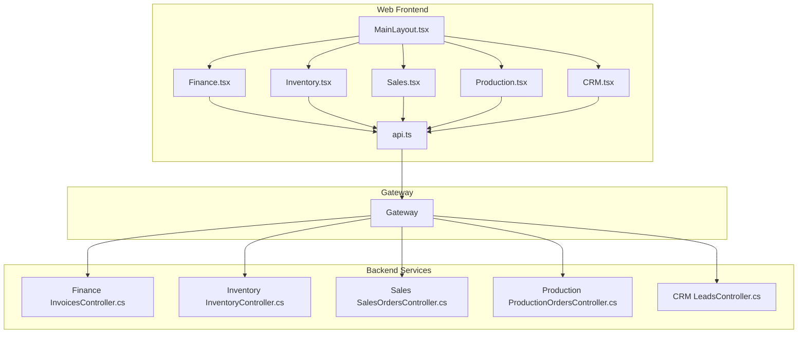
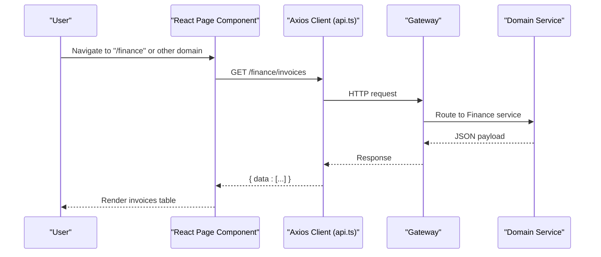
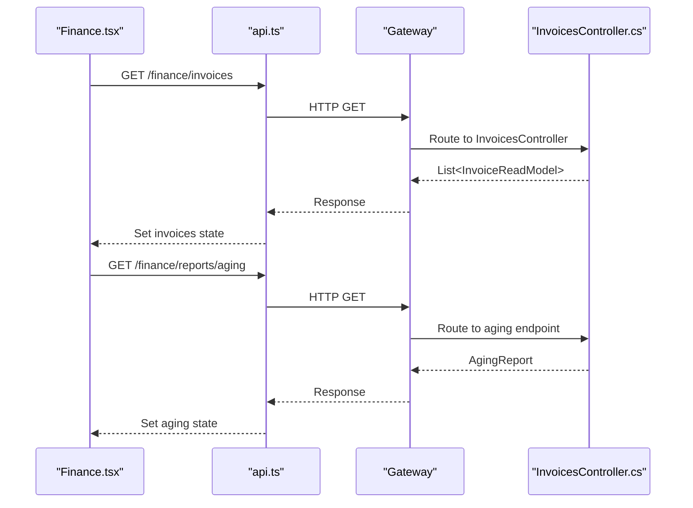
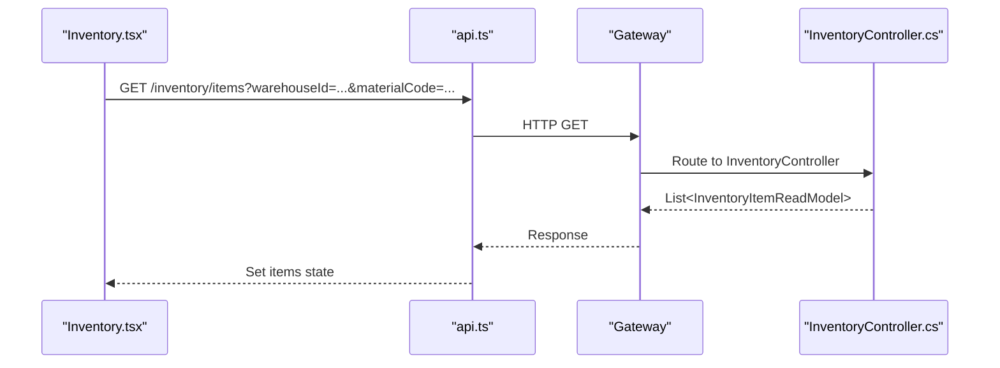
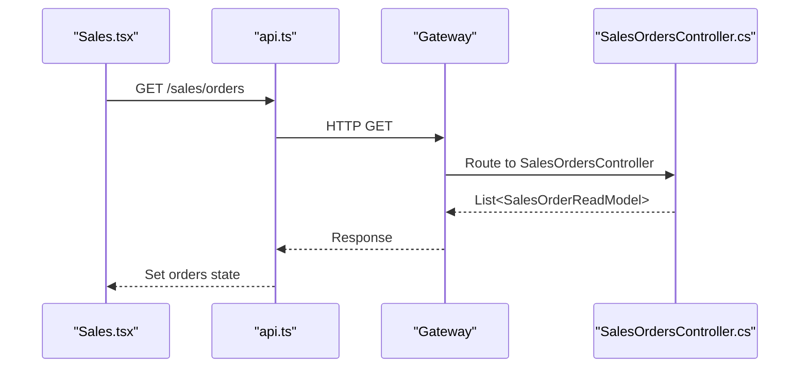
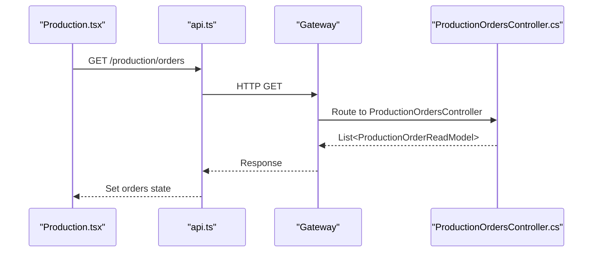
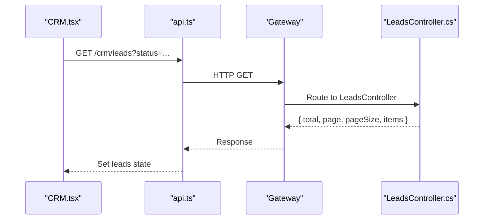
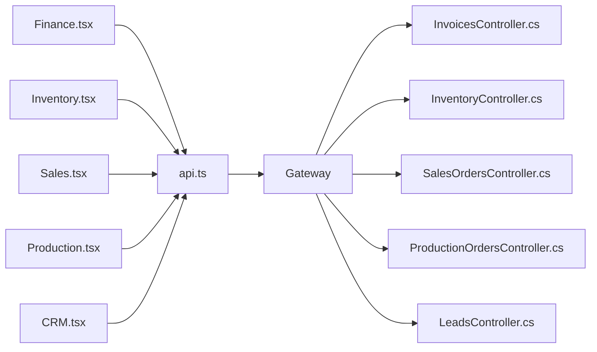

# Business Domain Pages

<cite>
**Referenced Files in This Document**
- [Finance.tsx](file://src/Web/ErpSystem.Web/src/pages/Finance.tsx)
- [Inventory.tsx](file://src/Web/ErpSystem.Web/src/pages/Inventory.tsx)
- [Sales.tsx](file://src/Web/ErpSystem.Web/src/pages/Sales.tsx)
- [Production.tsx](file://src/Web/ErpSystem.Web/src/pages/Production.tsx)
- [CRM.tsx](file://src/Web/ErpSystem.Web/src/pages/CRM.tsx)
- [api.ts](file://src/Web/ErpSystem.Web/src/services/api.ts)
- [MainLayout.tsx](file://src/Web/ErpSystem.Web/src/layout/MainLayout.tsx)
- [InvoicesController.cs](file://src/Services/Finance/ErpSystem.Finance/API/InvoicesController.cs)
- [InventoryController.cs](file://src/Services/Inventory/ErpSystem.Inventory/API/InventoryController.cs)
- [SalesOrdersController.cs](file://src/Services/Sales/ErpSystem.Sales/API/SalesOrdersController.cs)
- [ProductionOrdersController.cs](file://src/Services/Production/ErpSystem.Production/API/ProductionOrdersController.cs)
- [LeadsController.cs](file://src/Services/CRM/ErpSystem.CRM/API/LeadsController.cs)
- [FinanceQueries.cs](file://src/Services/Finance/ErpSystem.Finance/Application/FinanceQueries.cs)
- [InventoryQueries.cs](file://src/Services/Inventory/ErpSystem.Inventory/Application/InventoryQueries.cs)
- [SalesQueries.cs](file://src/Services/Sales/ErpSystem.Sales/Application/SalesQueries.cs)
</cite>

## Table of Contents
1. [Introduction](#introduction)
2. [Project Structure](#project-structure)
3. [Core Components](#core-components)
4. [Architecture Overview](#architecture-overview)
5. [Detailed Component Analysis](#detailed-component-analysis)
6. [Dependency Analysis](#dependency-analysis)
7. [Performance Considerations](#performance-considerations)
8. [Troubleshooting Guide](#troubleshooting-guide)
9. [Conclusion](#conclusion)

## Introduction
This document explains the business domain-specific pages for Finance, Inventory, Sales, Production, and CRM. It covers page structure, form components, data tables, CRUD operations, backend integration, API consumption patterns, data validation, domain-specific UI patterns, reporting components, workflow visualization, responsive design, and enterprise user interaction patterns. The frontend pages consume REST APIs exposed by dedicated microservices via a gateway, using a shared Axios client with centralized error handling.

## Project Structure
The web application is a React/Tailwind SPA that renders domain pages and integrates with backend services through a gateway. Each domain exposes a page component that:
- Declares TypeScript interfaces for domain entities
- Uses a shared API client to fetch paginated or filtered data
- Renders responsive tables and cards
- Implements domain-specific UI patterns (e.g., status badges, pipeline views)
- Falls back to mock data when backend is unavailable

**Diagram sources**
- [MainLayout.tsx](file://src/Web/ErpSystem.Web/src/layout/MainLayout.tsx#L24-L82)
- [Finance.tsx](file://src/Web/ErpSystem.Web/src/pages/Finance.tsx#L21-L152)
- [Inventory.tsx](file://src/Web/ErpSystem.Web/src/pages/Inventory.tsx#L19-L147)
- [Sales.tsx](file://src/Web/ErpSystem.Web/src/pages/Sales.tsx#L14-L85)
- [Production.tsx](file://src/Web/ErpSystem.Web/src/pages/Production.tsx#L16-L90)
- [CRM.tsx](file://src/Web/ErpSystem.Web/src/pages/CRM.tsx#L562-L606)
- [api.ts](file://src/Web/ErpSystem.Web/src/services/api.ts#L1-L29)
- [InvoicesController.cs](file://src/Services/Finance/ErpSystem.Finance/API/InvoicesController.cs#L10-L73)
- [InventoryController.cs](file://src/Services/Inventory/ErpSystem.Inventory/API/InventoryController.cs#L8-L43)
- [SalesOrdersController.cs](file://src/Services/Sales/ErpSystem.Sales/API/SalesOrdersController.cs#L8-L44)
- [ProductionOrdersController.cs](file://src/Services/Production/ErpSystem.Production/API/ProductionOrdersController.cs#L8-L45)
- [LeadsController.cs](file://src/Services/CRM/ErpSystem.CRM/API/LeadsController.cs#L10-L72)

**Section sources**
- [MainLayout.tsx](file://src/Web/ErpSystem.Web/src/layout/MainLayout.tsx#L24-L82)
- [api.ts](file://src/Web/ErpSystem.Web/src/services/api.ts#L1-L29)

## Core Components
- Shared API client: Centralized Axios instance with base URL and response interceptor for error logging.
- Domain pages: Each page defines typed interfaces for domain entities, fetches data via the API client, and renders responsive tables/cards.
- Navigation: Sidebar routes map to domain pages and highlight active selections.

Key responsibilities:
- Finance: Invoices list, aging report widgets, payment actions.
- Inventory: Item search/filter, availability indicators, receive/transfer actions.
- Sales: Sales orders list, status badges, action buttons.
- Production: Manufacturing orders list, status badges, manage actions.
- CRM: Leads/opportunities/campaigns tabs with filters, pipeline/list views, metrics.

**Section sources**
- [api.ts](file://src/Web/ErpSystem.Web/src/services/api.ts#L1-L29)
- [Finance.tsx](file://src/Web/ErpSystem.Web/src/pages/Finance.tsx#L5-L152)
- [Inventory.tsx](file://src/Web/ErpSystem.Web/src/pages/Inventory.tsx#L5-L147)
- [Sales.tsx](file://src/Web/ErpSystem.Web/src/pages/Sales.tsx#L5-L85)
- [Production.tsx](file://src/Web/ErpSystem.Web/src/pages/Production.tsx#L5-L90)
- [CRM.tsx](file://src/Web/ErpSystem.Web/src/pages/CRM.tsx#L11-L606)
- [MainLayout.tsx](file://src/Web/ErpSystem.Web/src/layout/MainLayout.tsx#L24-L82)

## Architecture Overview
The frontend consumes domain APIs through a gateway. Each domain page composes UI components and data tables, while the backend exposes REST endpoints for CRUD and queries. The gateway routes requests to appropriate services.

**Diagram sources**
- [Finance.tsx](file://src/Web/ErpSystem.Web/src/pages/Finance.tsx#L30-L58)
- [api.ts](file://src/Web/ErpSystem.Web/src/services/api.ts#L6-L20)
- [InvoicesController.cs](file://src/Services/Finance/ErpSystem.Finance/API/InvoicesController.cs#L20-L24)

## Detailed Component Analysis

### Finance Module
- Page structure: Header with title and action button, aging report widget grid, recent invoices table with filters and actions.
- Data tables: Invoices list with status badges, date columns, monetary amounts, and action buttons (e.g., Pay).
- CRUD operations: The page fetches invoices and aging data; payment recording is available via backend endpoints.
- Backend integration: InvoicesController exposes endpoints for listing, issuing, canceling, writing off, and recording payments.
- Data validation: Frontend validates invoice IDs when posting payments; backend enforces parameter consistency.
- Reporting components: Aging report widget aggregates buckets (Current, 1–30 Days, 31–60 Days, 61–90 Days, 90+ Days).
- Workflow visualization: Not present in the Finance page; aging analysis is computed server-side and returned as a report.

**Diagram sources**
- [Finance.tsx](file://src/Web/ErpSystem.Web/src/pages/Finance.tsx#L30-L58)
- [InvoicesController.cs](file://src/Services/Finance/ErpSystem.Finance/API/InvoicesController.cs#L20-L65)
- [FinanceQueries.cs](file://src/Services/Finance/ErpSystem.Finance/Application/FinanceQueries.cs#L54-L71)

**Section sources**
- [Finance.tsx](file://src/Web/ErpSystem.Web/src/pages/Finance.tsx#L21-L152)
- [InvoicesController.cs](file://src/Services/Finance/ErpSystem.Finance/API/InvoicesController.cs#L10-L73)
- [FinanceQueries.cs](file://src/Services/Finance/ErpSystem.Finance/Application/FinanceQueries.cs#L1-L110)

### Inventory Module
- Page structure: Header with actions (Transfer, Receive Stock), filters (search by material code, warehouse), and an inventory items table.
- Data tables: Items with material info, location (warehouse/bin), quantities (on-hand, available), and total value; action button for details.
- CRUD operations: Backend supports receiving, transferring, issuing, reserving, releasing reservations, adjusting stock, and viewing transactions.
- Backend integration: InventoryController exposes endpoints for searching items, getting available quantities, and stock movements.
- Data validation: Frontend passes filters as query parameters; backend applies pagination and filtering.
- Reporting components: Not present in the Inventory page; transactions are available via dedicated endpoint.
- Workflow visualization: Not present in the Inventory page.

**Diagram sources**
- [Inventory.tsx](file://src/Web/ErpSystem.Web/src/pages/Inventory.tsx#L28-L43)
- [InventoryController.cs](file://src/Services/Inventory/ErpSystem.Inventory/API/InventoryController.cs#L11-L14)
- [InventoryQueries.cs](file://src/Services/Inventory/ErpSystem.Inventory/Application/InventoryQueries.cs#L25-L37)

**Section sources**
- [Inventory.tsx](file://src/Web/ErpSystem.Web/src/pages/Inventory.tsx#L19-L147)
- [InventoryController.cs](file://src/Services/Inventory/ErpSystem.Inventory/API/InventoryController.cs#L8-L43)
- [InventoryQueries.cs](file://src/Services/Inventory/ErpSystem.Inventory/Application/InventoryQueries.cs#L1-L50)

### Sales Module
- Page structure: Header with Create Order action and a sales orders table.
- Data tables: Orders with customer, dates, totals, and status badges; action button for view.
- CRUD operations: Backend supports creating orders, confirming, canceling, and retrieving billable lines.
- Backend integration: SalesOrdersController exposes endpoints for creation, retrieval, search, confirm, cancel, and billable lines.
- Data validation: Frontend passes filters as query parameters; backend enforces parameter presence where required.
- Reporting components: Not present in the Sales page.
- Workflow visualization: Not present in the Sales page.

**Diagram sources**
- [Sales.tsx](file://src/Web/ErpSystem.Web/src/pages/Sales.tsx#L22-L36)
- [SalesOrdersController.cs](file://src/Services/Sales/ErpSystem.Sales/API/SalesOrdersController.cs#L17-L20)
- [SalesQueries.cs](file://src/Services/Sales/ErpSystem.Sales/Application/SalesQueries.cs#L42-L52)

**Section sources**
- [Sales.tsx](file://src/Web/ErpSystem.Web/src/pages/Sales.tsx#L14-L85)
- [SalesOrdersController.cs](file://src/Services/Sales/ErpSystem.Sales/API/SalesOrdersController.cs#L8-L44)
- [SalesQueries.cs](file://src/Services/Sales/ErpSystem.Sales/Application/SalesQueries.cs#L1-L78)

### Production Module
- Page structure: Header with Create Order action and a production orders table.
- Data tables: Orders with product info, quantities, due dates, and status badges; action button for manage.
- CRUD operations: Backend supports creating orders, releasing, consuming materials, reporting progress, and querying WIP.
- Backend integration: ProductionOrdersController exposes endpoints for creation, release, consume, report, and WIP.
- Data validation: Frontend ensures order ID consistency when posting consume/report commands.
- Reporting components: Not present in the Production page.
- Workflow visualization: Not present in the Production page.

**Diagram sources**
- [Production.tsx](file://src/Web/ErpSystem.Web/src/pages/Production.tsx#L24-L38)
- [ProductionOrdersController.cs](file://src/Services/Production/ErpSystem.Production/API/ProductionOrdersController.cs#L17-L20)

**Section sources**
- [Production.tsx](file://src/Web/ErpSystem.Web/src/pages/Production.tsx#L16-L90)
- [ProductionOrdersController.cs](file://src/Services/Production/ErpSystem.Production/API/ProductionOrdersController.cs#L8-L45)

### CRM Module
- Page structure: Tabbed interface (Leads, Opportunities, Campaigns) with filters, stats cards, and actionable lists.
- Data tables: Leads table with status badges and score visualization; Opportunities table with pipeline/list views; Campaign cards with budget progress and ROI.
- CRUD operations: Backend supports creating/updating leads, qualifying, converting to opportunities, assigning, logging communications, and querying statistics.
- Backend integration: LeadsController exposes endpoints for listing, retrieving, statistics, and lead lifecycle commands.
- Data validation: Frontend parses embedded contact JSON; backend validates command payloads.
- Reporting components: Stats cards (totals, averages), pipeline stages, budget vs. spent, ROI.
- Workflow visualization: Opportunities pipeline view organizes deals by stage with counts and values.

**Diagram sources**
- [CRM.tsx](file://src/Web/ErpSystem.Web/src/pages/CRM.tsx#L151-L169)
- [LeadsController.cs](file://src/Services/CRM/ErpSystem.CRM/API/LeadsController.cs#L18-L43)

**Section sources**
- [CRM.tsx](file://src/Web/ErpSystem.Web/src/pages/CRM.tsx#L11-L606)
- [LeadsController.cs](file://src/Services/CRM/ErpSystem.CRM/API/LeadsController.cs#L10-L200)

## Dependency Analysis
- Frontend-to-backend coupling: Pages depend on the shared API client and route to domain endpoints. There is low coupling between pages and services due to explicit endpoints.
- Backend services: Each domain controller encapsulates CRUD and query operations, returning typed read models.
- Data flows: Pages fetch data on mount or on filter change, update state, and render UI. Errors are handled centrally by the API interceptor.

**Diagram sources**
- [Finance.tsx](file://src/Web/ErpSystem.Web/src/pages/Finance.tsx#L21-L58)
- [Inventory.tsx](file://src/Web/ErpSystem.Web/src/pages/Inventory.tsx#L28-L43)
- [Sales.tsx](file://src/Web/ErpSystem.Web/src/pages/Sales.tsx#L22-L36)
- [Production.tsx](file://src/Web/ErpSystem.Web/src/pages/Production.tsx#L24-L38)
- [CRM.tsx](file://src/Web/ErpSystem.Web/src/pages/CRM.tsx#L151-L169)
- [api.ts](file://src/Web/ErpSystem.Web/src/services/api.ts#L1-L29)
- [InvoicesController.cs](file://src/Services/Finance/ErpSystem.Finance/API/InvoicesController.cs#L10-L73)
- [InventoryController.cs](file://src/Services/Inventory/ErpSystem.Inventory/API/InventoryController.cs#L8-L43)
- [SalesOrdersController.cs](file://src/Services/Sales/ErpSystem.Sales/API/SalesOrdersController.cs#L8-L44)
- [ProductionOrdersController.cs](file://src/Services/Production/ErpSystem.Production/API/ProductionOrdersController.cs#L8-L45)
- [LeadsController.cs](file://src/Services/CRM/ErpSystem.CRM/API/LeadsController.cs#L10-L72)

**Section sources**
- [api.ts](file://src/Web/ErpSystem.Web/src/services/api.ts#L1-L29)
- [MainLayout.tsx](file://src/Web/ErpSystem.Web/src/layout/MainLayout.tsx#L24-L82)

## Performance Considerations
- Pagination: Backend endpoints accept page and pageSize parameters to limit payload sizes.
- Filtering: Frontend passes filters as query parameters to reduce server load.
- Parallel fetching: Finance page fetches invoices and aging data concurrently.
- Client caching: No explicit cache is configured; consider adding request deduplication or in-memory caches for repeated queries.
- Rendering: Large tables are paginated; consider virtualization for very large datasets.

[No sources needed since this section provides general guidance]

## Troubleshooting Guide
- Network errors: The API client logs error responses and rejects promises; check browser network tab and console.
- Backend unavailability: Pages fall back to mock data; verify gateway routing and service health.
- Parameter mismatches: Some endpoints validate IDs in path and body; ensure frontend passes consistent identifiers.
- Data parsing: CRM contacts are stored as JSON strings; ensure proper parsing before rendering.

**Section sources**
- [api.ts](file://src/Web/ErpSystem.Web/src/services/api.ts#L13-L20)
- [Finance.tsx](file://src/Web/ErpSystem.Web/src/pages/Finance.tsx#L39-L57)
- [Inventory.tsx](file://src/Web/ErpSystem.Web/src/pages/Inventory.tsx#L33-L42)
- [Sales.tsx](file://src/Web/ErpSystem.Web/src/pages/Sales.tsx#L27-L35)
- [Production.tsx](file://src/Web/ErpSystem.Web/src/pages/Production.tsx#L29-L37)
- [CRM.tsx](file://src/Web/ErpSystem.Web/src/pages/CRM.tsx#L157-L168)

## Conclusion
The domain pages provide a consistent, responsive, and enterprise-ready interface for Finance, Inventory, Sales, Production, and CRM. They integrate with backend services through a gateway, leverage typed interfaces, and implement domain-specific UI patterns. The architecture supports scalability via pagination, filtering, and parallel data fetching, while maintaining clear separation of concerns between frontend pages and backend controllers.