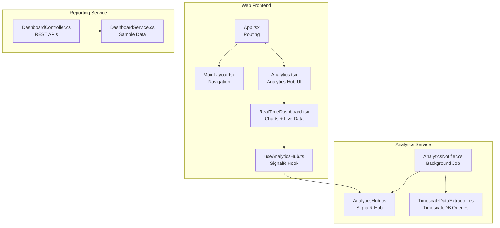
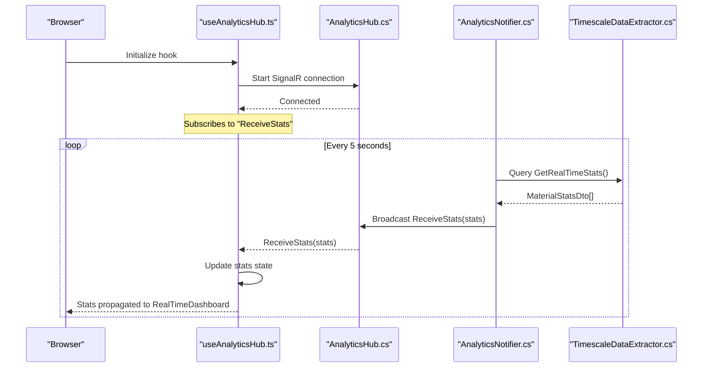
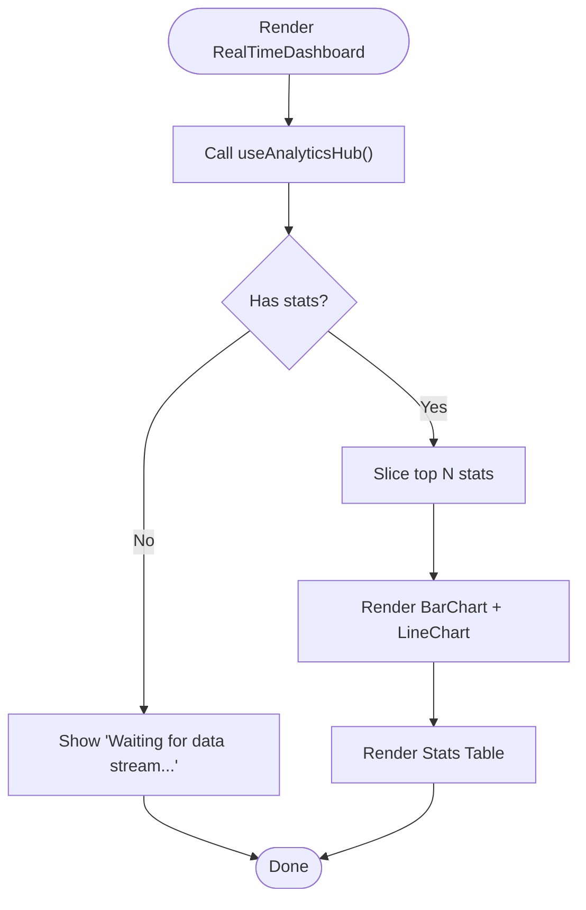
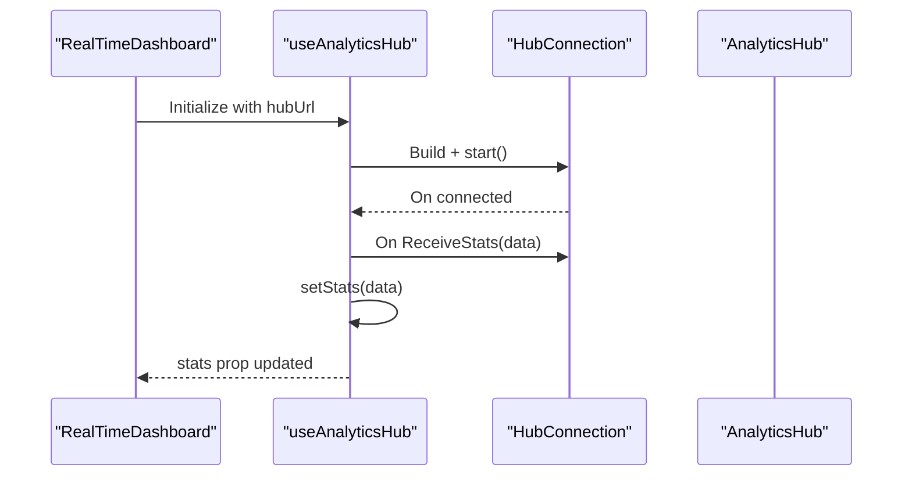
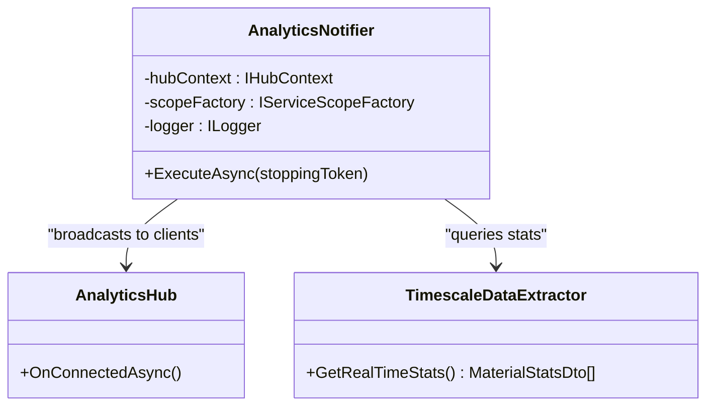

# Dashboard Components

<cite>
**Referenced Files in This Document**
- [RealTimeDashboard.tsx](file://src/Web/ErpSystem.Web/src/components/RealTimeDashboard.tsx)
- [useAnalyticsHub.ts](file://src/Web/ErpSystem.Web/src/hooks/useAnalyticsHub.ts)
- [Analytics.tsx](file://src/Web/ErpSystem.Web/src/pages/Analytics.tsx)
- [App.tsx](file://src/Web/ErpSystem.Web/src/App.tsx)
- [MainLayout.tsx](file://src/Web/ErpSystem.Web/src/layout/MainLayout.tsx)
- [AnalyticsHub.cs](file://src/Services/Analytics/ErpSystem.Analytics/API/Hubs/AnalyticsHub.cs)
- [AnalyticsNotifier.cs](file://src/Services/Analytics/ErpSystem.Analytics/Infrastructure/BackgroundJobs/AnalyticsNotifier.cs)
- [TimescaleDataExtractor.cs](file://src/Services/Analytics/ErpSystem.Analytics/Infrastructure/TimescaleDataExtractor.cs)
- [DashboardController.cs](file://src/Services/Reporting/ErpSystem.Reporting/Controllers/DashboardController.cs)
- [DashboardService.cs](file://src/Services/Reporting/ErpSystem.Reporting/Application/DashboardService.cs)
</cite>

## Table of Contents
1. [Introduction](#introduction)
2. [Project Structure](#project-structure)
3. [Core Components](#core-components)
4. [Architecture Overview](#architecture-overview)
5. [Detailed Component Analysis](#detailed-component-analysis)
6. [Dependency Analysis](#dependency-analysis)
7. [Performance Considerations](#performance-considerations)
8. [Troubleshooting Guide](#troubleshooting-guide)
9. [Conclusion](#conclusion)

## Introduction
This document explains the dashboard components and real-time analytics system implemented in the ERP microservice platform. It focuses on:
- RealTimeDashboard component for live visualization of inventory statistics
- SignalR integration for real-time data streaming
- Recharts-based chart visualizations
- useAnalyticsHub custom hook for WebSocket connections and state management
- Integration with the analytics service and event-driven data updates from TimescaleDB

## Project Structure
The dashboard and analytics features span both the frontend web application and the analytics/reporting services:
- Frontend (React + TypeScript): Real-time dashboard UI, SignalR client hook, routing, and layout
- Backend (C# .NET): SignalR hub, background job broadcasting, TimescaleDB extraction, and reporting APIs



**Diagram sources**
- [App.tsx](file://src/Web/ErpSystem.Web/src/App.tsx#L21-L47)
- [MainLayout.tsx](file://src/Web/ErpSystem.Web/src/layout/MainLayout.tsx#L24-L82)
- [Analytics.tsx](file://src/Web/ErpSystem.Web/src/pages/Analytics.tsx#L5-L167)
- [RealTimeDashboard.tsx](file://src/Web/ErpSystem.Web/src/components/RealTimeDashboard.tsx#L6-L119)
- [useAnalyticsHub.ts](file://src/Web/ErpSystem.Web/src/hooks/useAnalyticsHub.ts#L12-L49)
- [AnalyticsHub.cs](file://src/Services/Analytics/ErpSystem.Analytics/API/Hubs/AnalyticsHub.cs#L5-L12)
- [AnalyticsNotifier.cs](file://src/Services/Analytics/ErpSystem.Analytics/Infrastructure/BackgroundJobs/AnalyticsNotifier.cs#L12-L36)
- [TimescaleDataExtractor.cs](file://src/Services/Analytics/ErpSystem.Analytics/Infrastructure/TimescaleDataExtractor.cs#L88-L131)
- [DashboardController.cs](file://src/Services/Reporting/ErpSystem.Reporting/Controllers/DashboardController.cs#L8-L59)
- [DashboardService.cs](file://src/Services/Reporting/ErpSystem.Reporting/Application/DashboardService.cs#L20-L92)

**Section sources**
- [App.tsx](file://src/Web/ErpSystem.Web/src/App.tsx#L21-L47)
- [MainLayout.tsx](file://src/Web/ErpSystem.Web/src/layout/MainLayout.tsx#L24-L82)
- [Analytics.tsx](file://src/Web/ErpSystem.Web/src/pages/Analytics.tsx#L5-L167)

## Core Components
- RealTimeDashboard: Renders live inventory statistics using Recharts and displays a tabular feed of recent events.
- useAnalyticsHub: Establishes a SignalR connection, manages state, and handles incoming stats snapshots.
- Analytics page: Hosts the RealTimeDashboard and other intelligence cards.
- AnalyticsHub: Minimal SignalR hub for clients to connect.
- AnalyticsNotifier: Periodically queries TimescaleDB and broadcasts stats to connected clients.
- TimescaleDataExtractor: SQL queries to compute rolling statistics and volatility indices.
- DashboardController and DashboardService: REST endpoints and services for traditional KPI dashboards.

**Section sources**
- [RealTimeDashboard.tsx](file://src/Web/ErpSystem.Web/src/components/RealTimeDashboard.tsx#L6-L119)
- [useAnalyticsHub.ts](file://src/Web/ErpSystem.Web/src/hooks/useAnalyticsHub.ts#L12-L49)
- [Analytics.tsx](file://src/Web/ErpSystem.Web/src/pages/Analytics.tsx#L5-L167)
- [AnalyticsHub.cs](file://src/Services/Analytics/ErpSystem.Analytics/API/Hubs/AnalyticsHub.cs#L5-L12)
- [AnalyticsNotifier.cs](file://src/Services/Analytics/ErpSystem.Analytics/Infrastructure/BackgroundJobs/AnalyticsNotifier.cs#L12-L36)
- [TimescaleDataExtractor.cs](file://src/Services/Analytics/ErpSystem.Analytics/Infrastructure/TimescaleDataExtractor.cs#L88-L131)
- [DashboardController.cs](file://src/Services/Reporting/ErpSystem.Reporting/Controllers/DashboardController.cs#L8-L59)
- [DashboardService.cs](file://src/Services/Reporting/ErpSystem.Reporting/Application/DashboardService.cs#L20-L92)

## Architecture Overview
The real-time analytics pipeline streams inventory statistics from TimescaleDB to clients via SignalR. The frontend receives periodic snapshots and renders charts and tables.



**Diagram sources**
- [useAnalyticsHub.ts](file://src/Web/ErpSystem.Web/src/hooks/useAnalyticsHub.ts#L17-L47)
- [AnalyticsHub.cs](file://src/Services/Analytics/ErpSystem.Analytics/API/Hubs/AnalyticsHub.cs#L7-L11)
- [AnalyticsNotifier.cs](file://src/Services/Analytics/ErpSystem.Analytics/Infrastructure/BackgroundJobs/AnalyticsNotifier.cs#L12-L36)
- [TimescaleDataExtractor.cs](file://src/Services/Analytics/ErpSystem.Analytics/Infrastructure/TimescaleDataExtractor.cs#L88-L131)

## Detailed Component Analysis

### RealTimeDashboard Component
Responsibilities:
- Consume stats from useAnalyticsHub
- Render two chart panels: bar chart for average movement and line chart for volatility
- Display a live table of recent stats
- Provide a responsive layout with Recharts containers

Implementation highlights:
- Uses Recharts components (BarChart, Bar, LineChart, Line) for visualization
- Applies ResponsiveContainer for adaptive sizing
- Formats timestamps and numeric values for readability
- Uses conditional rendering when no data is available



**Diagram sources**
- [RealTimeDashboard.tsx](file://src/Web/ErpSystem.Web/src/components/RealTimeDashboard.tsx#L12-L20)
- [RealTimeDashboard.tsx](file://src/Web/ErpSystem.Web/src/components/RealTimeDashboard.tsx#L35-L71)
- [RealTimeDashboard.tsx](file://src/Web/ErpSystem.Web/src/components/RealTimeDashboard.tsx#L73-L114)

**Section sources**
- [RealTimeDashboard.tsx](file://src/Web/ErpSystem.Web/src/components/RealTimeDashboard.tsx#L6-L119)

### useAnalyticsHub Custom Hook
Responsibilities:
- Manage SignalR connection lifecycle
- Subscribe to "ReceiveStats" messages
- Maintain stats state and a ref for latest data
- Support automatic reconnection

Key behaviors:
- Builds a HubConnection with automatic reconnect
- Starts the connection and registers a handler for ReceiveStats
- Replaces stats array on each update (snapshot semantics)
- Cleans up connection on unmount



**Diagram sources**
- [useAnalyticsHub.ts](file://src/Web/ErpSystem.Web/src/hooks/useAnalyticsHub.ts#L17-L47)
- [AnalyticsHub.cs](file://src/Services/Analytics/ErpSystem.Analytics/API/Hubs/AnalyticsHub.cs#L7-L11)

**Section sources**
- [useAnalyticsHub.ts](file://src/Web/ErpSystem.Web/src/hooks/useAnalyticsHub.ts#L12-L49)

### SignalR Hub and Background Notifier
- AnalyticsHub: Minimal hub extending the base SignalR hub
- AnalyticsNotifier: Background service that periodically queries TimescaleDB and broadcasts stats to all clients



**Diagram sources**
- [AnalyticsHub.cs](file://src/Services/Analytics/ErpSystem.Analytics/API/Hubs/AnalyticsHub.cs#L5-L12)
- [AnalyticsNotifier.cs](file://src/Services/Analytics/ErpSystem.Analytics/Infrastructure/BackgroundJobs/AnalyticsNotifier.cs#L6-L36)
- [TimescaleDataExtractor.cs](file://src/Services/Analytics/ErpSystem.Analytics/Infrastructure/TimescaleDataExtractor.cs#L88-L131)

**Section sources**
- [AnalyticsHub.cs](file://src/Services/Analytics/ErpSystem.Analytics/API/Hubs/AnalyticsHub.cs#L5-L12)
- [AnalyticsNotifier.cs](file://src/Services/Analytics/ErpSystem.Analytics/Infrastructure/BackgroundJobs/AnalyticsNotifier.cs#L12-L36)
- [TimescaleDataExtractor.cs](file://src/Services/Analytics/ErpSystem.Analytics/Infrastructure/TimescaleDataExtractor.cs#L88-L131)

### TimescaleDB Extraction and Statistics
TimescaleDataExtractor computes rolling statistics and volatility for materials over the last 24 hours using TimescaleDB continuous aggregates and toolkit functions. The notifier consumes these results and pushes them to clients.

Key points:
- Queries hourly aggregates for median, average, and standard deviation of inventory changes
- Returns MaterialStatsDto records consumed by the frontend
- Includes robustness against missing toolkit functions

**Section sources**
- [TimescaleDataExtractor.cs](file://src/Services/Analytics/ErpSystem.Analytics/Infrastructure/TimescaleDataExtractor.cs#L88-L131)

### Traditional Dashboard APIs (Reporting Service)
While the real-time dashboard uses SignalR, the reporting service exposes REST endpoints for KPI summaries, sales trends, inventory status, top products, and recent activities. These are useful for non-real-time dashboards and integrations.

Endpoints:
- GET /api/dashboard/summary
- GET /api/dashboard/sales-trend
- GET /api/dashboard/inventory-status
- GET /api/dashboard/top-products
- GET /api/dashboard/recent-activities

**Section sources**
- [DashboardController.cs](file://src/Services/Reporting/ErpSystem.Reporting/Controllers/DashboardController.cs#L8-L59)
- [DashboardService.cs](file://src/Services/Reporting/ErpSystem.Reporting/Application/DashboardService.cs#L20-L92)

### Analytics Page and Navigation
The Analytics page hosts the RealTimeDashboard and other intelligence cards. It also provides navigation tabs to switch between views.

- Routing: Analytics route configured in App.tsx
- Layout: MainLayout provides sidebar navigation
- UI: Tabbed interface switches between Real-time and other views

**Section sources**
- [Analytics.tsx](file://src/Web/ErpSystem.Web/src/pages/Analytics.tsx#L5-L167)
- [App.tsx](file://src/Web/ErpSystem.Web/src/App.tsx#L21-L47)
- [MainLayout.tsx](file://src/Web/ErpSystem.Web/src/layout/MainLayout.tsx#L24-L82)

## Dependency Analysis
The real-time analytics system exhibits clear separation of concerns:
- Frontend depends on the SignalR hub and the useAnalyticsHub hook
- Backend depends on TimescaleDB for analytics and broadcasts via SignalR
- Reporting service provides complementary REST endpoints for non-real-time dashboards

```mermaid
graph LR
UI["RealTimeDashboard.tsx"] --> Hook["useAnalyticsHub.ts"]
Hook --> Hub["AnalyticsHub.cs"]
Hub <- --> Notifier["AnalyticsNotifier.cs"]
Notifier --> DB["TimescaleDataExtractor.cs"]
UI -.-> REST["DashboardController.cs / DashboardService.cs"]
```

**Diagram sources**
- [RealTimeDashboard.tsx](file://src/Web/ErpSystem.Web/src/components/RealTimeDashboard.tsx#L6-L119)
- [useAnalyticsHub.ts](file://src/Web/ErpSystem.Web/src/hooks/useAnalyticsHub.ts#L12-L49)
- [AnalyticsHub.cs](file://src/Services/Analytics/ErpSystem.Analytics/API/Hubs/AnalyticsHub.cs#L5-L12)
- [AnalyticsNotifier.cs](file://src/Services/Analytics/ErpSystem.Analytics/Infrastructure/BackgroundJobs/AnalyticsNotifier.cs#L12-L36)
- [TimescaleDataExtractor.cs](file://src/Services/Analytics/ErpSystem.Analytics/Infrastructure/TimescaleDataExtractor.cs#L88-L131)
- [DashboardController.cs](file://src/Services/Reporting/ErpSystem.Reporting/Controllers/DashboardController.cs#L8-L59)
- [DashboardService.cs](file://src/Services/Reporting/ErpSystem.Reporting/Application/DashboardService.cs#L20-L92)

**Section sources**
- [useAnalyticsHub.ts](file://src/Web/ErpSystem.Web/src/hooks/useAnalyticsHub.ts#L12-L49)
- [AnalyticsNotifier.cs](file://src/Services/Analytics/ErpSystem.Analytics/Infrastructure/BackgroundJobs/AnalyticsNotifier.cs#L12-L36)
- [TimescaleDataExtractor.cs](file://src/Services/Analytics/ErpSystem.Analytics/Infrastructure/TimescaleDataExtractor.cs#L88-L131)
- [DashboardController.cs](file://src/Services/Reporting/ErpSystem.Reporting/Controllers/DashboardController.cs#L8-L59)

## Performance Considerations
- SignalR broadcast interval: The notifier runs on a 5-second tick. Adjust based on data volume and client responsiveness needs.
- Stats payload size: The backend sends a snapshot of up to 50 rows. Consider pagination or downsampling for very large datasets.
- Frontend rendering: Recharts containers are responsive but can be heavy with large datasets. Consider virtualization or sampling for extensive timelines.
- Database queries: TimescaleDB queries leverage continuous aggregates and toolkit functions. Ensure proper indexing and maintenance of hypertables and continuous aggregates.

## Troubleshooting Guide
Common issues and resolutions:
- Connection failures: Verify SignalR hub URL and CORS configuration. Check browser console for errors during connection attempts.
- No data received: Confirm that AnalyticsNotifier is running and that TimescaleDataExtractor returns results. Inspect logs for exceptions.
- Chart anomalies: Validate data shapes and ensure MaterialStatsDto fields are populated. Check for nulls or unexpected zero values.
- Backend connectivity: Ensure TimescaleDB connection string is configured and accessible from the analytics service.

**Section sources**
- [useAnalyticsHub.ts](file://src/Web/ErpSystem.Web/src/hooks/useAnalyticsHub.ts#L17-L47)
- [AnalyticsNotifier.cs](file://src/Services/Analytics/ErpSystem.Analytics/Infrastructure/BackgroundJobs/AnalyticsNotifier.cs#L12-L36)
- [TimescaleDataExtractor.cs](file://src/Services/Analytics/ErpSystem.Analytics/Infrastructure/TimescaleDataExtractor.cs#L123-L128)

## Conclusion
The dashboard and real-time analytics system combine a reactive frontend with a robust backend pipeline. The RealTimeDashboard leverages SignalR for live updates and Recharts for insightful visualizations. The useAnalyticsHub hook encapsulates connection and state management, while the AnalyticsNotifier ensures timely delivery of statistics from TimescaleDB. Together, these components enable a responsive, data-driven operational dashboard.