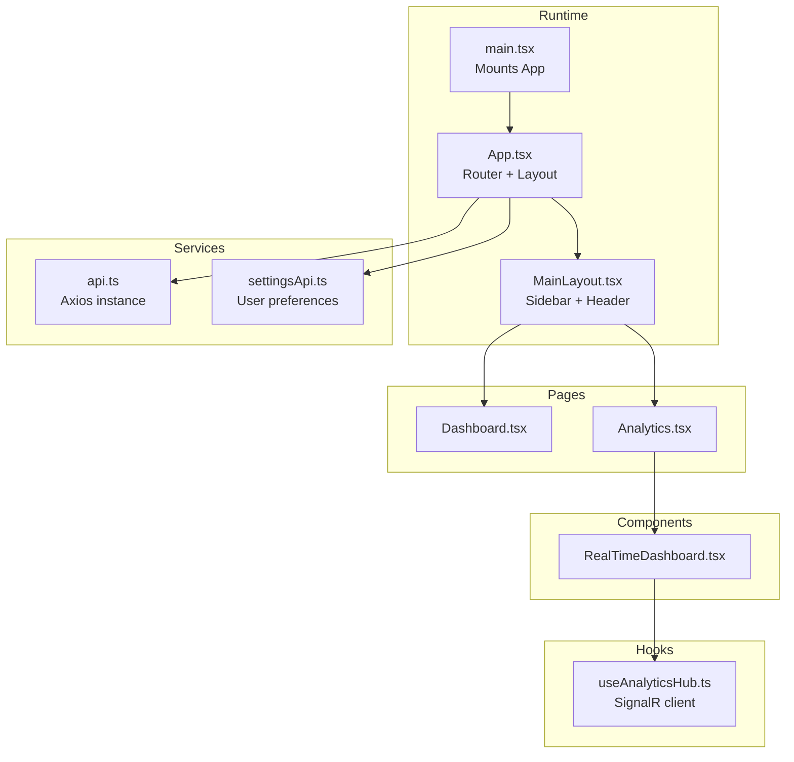
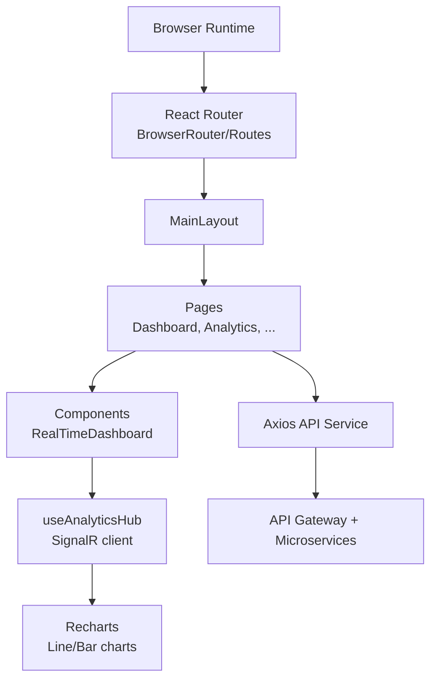
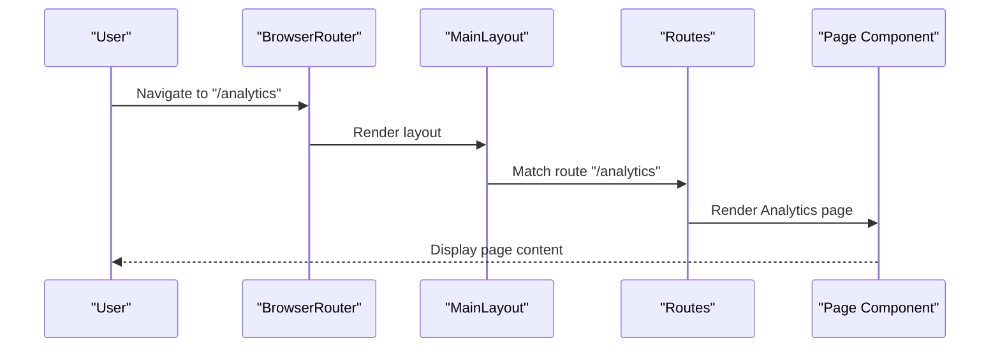
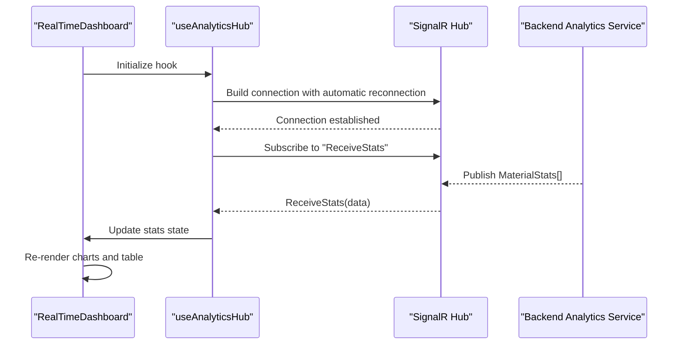
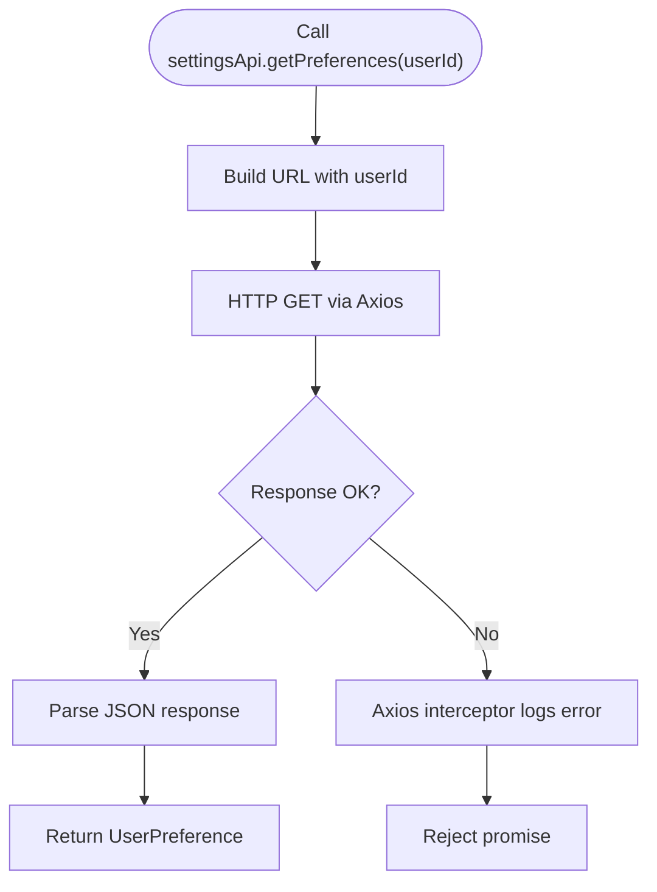
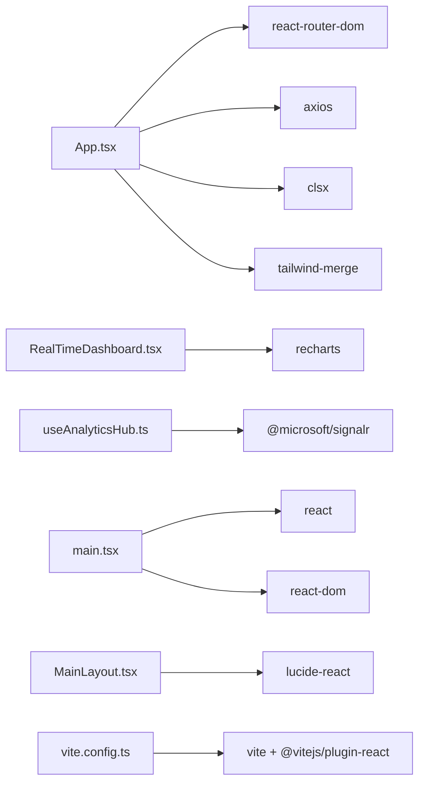

# Frontend Web Application

<cite>
**Referenced Files in This Document**
- [package.json](file://src/Web/ErpSystem.Web/package.json)
- [vite.config.ts](file://src/Web/ErpSystem.Web/vite.config.ts)
- [main.tsx](file://src/Web/ErpSystem.Web/src/main.tsx)
- [App.tsx](file://src/Web/ErpSystem.Web/src/App.tsx)
- [MainLayout.tsx](file://src/Web/ErpSystem.Web/src/layout/MainLayout.tsx)
- [RealTimeDashboard.tsx](file://src/Web/ErpSystem.Web/src/components/RealTimeDashboard.tsx)
- [useAnalyticsHub.ts](file://src/Web/ErpSystem.Web/src/hooks/useAnalyticsHub.ts)
- [api.ts](file://src/Web/ErpSystem.Web/src/services/api.ts)
- [Dashboard.tsx](file://src/Web/ErpSystem.Web/src/pages/Dashboard.tsx)
- [Analytics.tsx](file://src/Web/ErpSystem.Web/src/pages/Analytics.tsx)
- [settingsApi.ts](file://src/Web/ErpSystem.Web/src/api/settingsApi.ts)
- [tailwind.config.js](file://src/Web/ErpSystem.Web/tailwind.config.js)
- [tsconfig.json](file://src/Web/ErpSystem.Web/tsconfig.json)
</cite>

## Table of Contents
1. [Introduction](#introduction)
2. [Project Structure](#project-structure)
3. [Core Components](#core-components)
4. [Architecture Overview](#architecture-overview)
5. [Detailed Component Analysis](#detailed-component-analysis)
6. [Dependency Analysis](#dependency-analysis)
7. [Performance Considerations](#performance-considerations)
8. [Troubleshooting Guide](#troubleshooting-guide)
9. [Development Setup](#development-setup)
10. [Build and Deployment](#build-and-deployment)
11. [Conclusion](#conclusion)

## Introduction
This document describes the React-based frontend web application built with Vite, TypeScript, and modern React patterns. It covers the application architecture, routing system, layout and navigation, state management approaches, real-time dashboard powered by SignalR, integration with backend services via an API gateway, responsive design using Tailwind CSS, and practical guidance for development, building, and deployment.

## Project Structure
The frontend is organized around a clear separation of concerns:
- Entry point initializes the React application and mounts it to the DOM.
- Routing is configured with React Router and wrapped by a shared layout.
- Pages represent domain-focused views.
- Components encapsulate reusable UI elements and real-time widgets.
- Hooks manage cross-cutting concerns like SignalR connectivity.
- Services abstract API communication and configuration.
- Styling leverages Tailwind CSS with a centralized configuration.

**Diagram sources**
- [main.tsx](file://src/Web/ErpSystem.Web/src/main.tsx#L1-L11)
- [App.tsx](file://src/Web/ErpSystem.Web/src/App.tsx#L1-L50)
- [MainLayout.tsx](file://src/Web/ErpSystem.Web/src/layout/MainLayout.tsx#L1-L83)
- [Dashboard.tsx](file://src/Web/ErpSystem.Web/src/pages/Dashboard.tsx#L1-L113)
- [Analytics.tsx](file://src/Web/ErpSystem.Web/src/pages/Analytics.tsx#L1-L197)
- [RealTimeDashboard.tsx](file://src/Web/ErpSystem.Web/src/components/RealTimeDashboard.tsx#L1-L120)
- [useAnalyticsHub.ts](file://src/Web/ErpSystem.Web/src/hooks/useAnalyticsHub.ts#L1-L51)
- [api.ts](file://src/Web/ErpSystem.Web/src/services/api.ts#L1-L29)
- [settingsApi.ts](file://src/Web/ErpSystem.Web/src/api/settingsApi.ts#L1-L42)

**Section sources**
- [main.tsx](file://src/Web/ErpSystem.Web/src/main.tsx#L1-L11)
- [App.tsx](file://src/Web/ErpSystem.Web/src/App.tsx#L1-L50)
- [MainLayout.tsx](file://src/Web/ErpSystem.Web/src/layout/MainLayout.tsx#L1-L83)
- [Dashboard.tsx](file://src/Web/ErpSystem.Web/src/pages/Dashboard.tsx#L1-L113)
- [Analytics.tsx](file://src/Web/ErpSystem.Web/src/pages/Analytics.tsx#L1-L197)
- [RealTimeDashboard.tsx](file://src/Web/ErpSystem.Web/src/components/RealTimeDashboard.tsx#L1-L120)
- [useAnalyticsHub.ts](file://src/Web/ErpSystem.Web/src/hooks/useAnalyticsHub.ts#L1-L51)
- [api.ts](file://src/Web/ErpSystem.Web/src/services/api.ts#L1-L29)
- [settingsApi.ts](file://src/Web/ErpSystem.Web/src/api/settingsApi.ts#L1-L42)
- [tailwind.config.js](file://src/Web/ErpSystem.Web/tailwind.config.js#L1-L53)
- [tsconfig.json](file://src/Web/ErpSystem.Web/tsconfig.json#L1-L35)

## Core Components
- Application shell and routing: The application bootstraps React, sets up React Router, and renders a main layout that wraps all routes.
- Layout system: A fixed sidebar with navigation items and a sticky header provide consistent navigation across pages.
- Real-time analytics dashboard: A dedicated component visualizes streaming statistics from a SignalR hub using charts and a live table.
- SignalR hook: A custom hook manages the SignalR connection lifecycle, automatic reconnection, and state updates.
- API service: An Axios instance configured with a base URL and response interception for unified error handling.
- Settings API: Typed helpers for user preference retrieval, update, and reset operations.
- Responsive design: Tailwind CSS classes and a centralized configuration enable adaptive layouts.

**Section sources**
- [App.tsx](file://src/Web/ErpSystem.Web/src/App.tsx#L1-L50)
- [MainLayout.tsx](file://src/Web/ErpSystem.Web/src/layout/MainLayout.tsx#L1-L83)
- [RealTimeDashboard.tsx](file://src/Web/ErpSystem.Web/src/components/RealTimeDashboard.tsx#L1-L120)
- [useAnalyticsHub.ts](file://src/Web/ErpSystem.Web/src/hooks/useAnalyticsHub.ts#L1-L51)
- [api.ts](file://src/Web/ErpSystem.Web/src/services/api.ts#L1-L29)
- [settingsApi.ts](file://src/Web/ErpSystem.Web/src/api/settingsApi.ts#L1-L42)
- [tailwind.config.js](file://src/Web/ErpSystem.Web/tailwind.config.js#L1-L53)

## Architecture Overview
The frontend follows a layered architecture:
- Presentation layer: React components and pages.
- Navigation and layout: Centralized layout with route-driven rendering.
- Data access: Axios-based service layer with interceptors.
- Real-time layer: SignalR hub integration for live analytics.
- Styling: Tailwind CSS for responsive UI primitives.

**Diagram sources**
- [App.tsx](file://src/Web/ErpSystem.Web/src/App.tsx#L1-L50)
- [MainLayout.tsx](file://src/Web/ErpSystem.Web/src/layout/MainLayout.tsx#L1-L83)
- [Analytics.tsx](file://src/Web/ErpSystem.Web/src/pages/Analytics.tsx#L1-L197)
- [RealTimeDashboard.tsx](file://src/Web/ErpSystem.Web/src/components/RealTimeDashboard.tsx#L1-L120)
- [useAnalyticsHub.ts](file://src/Web/ErpSystem.Web/src/hooks/useAnalyticsHub.ts#L1-L51)
- [api.ts](file://src/Web/ErpSystem.Web/src/services/api.ts#L1-L29)

## Detailed Component Analysis

### Routing and Layout
- The application uses React Router to define routes and wrap them in a shared layout.
- The main layout provides a persistent sidebar with navigation items and a sticky header.
- Active navigation highlighting is handled by comparing the current location with route prefixes.

**Diagram sources**
- [App.tsx](file://src/Web/ErpSystem.Web/src/App.tsx#L1-L50)
- [MainLayout.tsx](file://src/Web/ErpSystem.Web/src/layout/MainLayout.tsx#L1-L83)

**Section sources**
- [App.tsx](file://src/Web/ErpSystem.Web/src/App.tsx#L1-L50)
- [MainLayout.tsx](file://src/Web/ErpSystem.Web/src/layout/MainLayout.tsx#L1-L83)

### Real-Time Dashboard and SignalR Integration
- The dashboard component renders two charts and a live data table.
- The custom hook establishes a SignalR connection to the "/hubs/analytics" endpoint with automatic reconnection.
- Incoming messages update the component state, which drives chart and table rendering.

**Diagram sources**
- [RealTimeDashboard.tsx](file://src/Web/ErpSystem.Web/src/components/RealTimeDashboard.tsx#L1-L120)
- [useAnalyticsHub.ts](file://src/Web/ErpSystem.Web/src/hooks/useAnalyticsHub.ts#L1-L51)

**Section sources**
- [RealTimeDashboard.tsx](file://src/Web/ErpSystem.Web/src/components/RealTimeDashboard.tsx#L1-L120)
- [useAnalyticsHub.ts](file://src/Web/ErpSystem.Web/src/hooks/useAnalyticsHub.ts#L1-L51)

### API Layer and Settings
- The Axios service defines a base URL and attaches a response interceptor for logging and propagating errors.
- The settings API module provides typed functions to fetch, update, and reset user preferences.

**Diagram sources**
- [api.ts](file://src/Web/ErpSystem.Web/src/services/api.ts#L1-L29)
- [settingsApi.ts](file://src/Web/ErpSystem.Web/src/api/settingsApi.ts#L1-L42)

**Section sources**
- [api.ts](file://src/Web/ErpSystem.Web/src/services/api.ts#L1-L29)
- [settingsApi.ts](file://src/Web/ErpSystem.Web/src/api/settingsApi.ts#L1-L42)

### Dashboard Page
- The dashboard page presents summary cards and recent activity panels.
- It demonstrates reusable UI components and links to related sections.

**Section sources**
- [Dashboard.tsx](file://src/Web/ErpSystem.Web/src/pages/Dashboard.tsx#L1-L113)

### Analytics Page
- The analytics page hosts tabs for real-time and historical views.
- It includes intelligence cards, charts, and anomaly detection feed placeholders.

**Section sources**
- [Analytics.tsx](file://src/Web/ErpSystem.Web/src/pages/Analytics.tsx#L1-L197)

## Dependency Analysis
External libraries and their roles:
- React and React Router: UI framework and routing.
- Axios: HTTP client with interceptors.
- @microsoft/signalr: Real-time bidirectional communication.
- Recharts: Data visualization components.
- Tailwind CSS: Utility-first styling.
- Framer Motion: Optional animation library.
- TypeScript: Type safety and developer experience.

**Diagram sources**
- [package.json](file://src/Web/ErpSystem.Web/package.json#L1-L35)
- [App.tsx](file://src/Web/ErpSystem.Web/src/App.tsx#L1-L50)
- [main.tsx](file://src/Web/ErpSystem.Web/src/main.tsx#L1-L11)
- [RealTimeDashboard.tsx](file://src/Web/ErpSystem.Web/src/components/RealTimeDashboard.tsx#L1-L120)
- [useAnalyticsHub.ts](file://src/Web/ErpSystem.Web/src/hooks/useAnalyticsHub.ts#L1-L51)
- [MainLayout.tsx](file://src/Web/ErpSystem.Web/src/layout/MainLayout.tsx#L1-L83)
- [vite.config.ts](file://src/Web/ErpSystem.Web/vite.config.ts#L1-L23)

**Section sources**
- [package.json](file://src/Web/ErpSystem.Web/package.json#L1-L35)
- [vite.config.ts](file://src/Web/ErpSystem.Web/vite.config.ts#L1-L23)

## Performance Considerations
- SignalR connection lifecycle: Automatic reconnection reduces downtime; ensure to stop connections on unmount to prevent leaks.
- Chart rendering: Memoization and controlled data updates minimize unnecessary re-renders.
- Network requests: Centralized interceptors help surface errors early; consider adding request cancellation and retry policies for resilience.
- Bundle size: Tree-shaking and modular imports keep the bundle lean; avoid importing large libraries unnecessarily.
- Rendering: Prefer virtualized lists for large datasets and lazy-load heavy components.

[No sources needed since this section provides general guidance]

## Troubleshooting Guide
Common issues and resolutions:
- Proxy misconfiguration: Verify Vite proxy settings for both REST API and SignalR hubs.
- CORS errors: Ensure the gateway and backend services allow cross-origin requests from the frontend origin.
- SignalR connection failures: Check network connectivity, firewall rules, and hub endpoint availability.
- Axios errors: Inspect response interceptors for detailed error logs and adjust base URLs accordingly.
- Tailwind styles not applied: Confirm content paths in the Tailwind configuration and rebuild after changes.

**Section sources**
- [vite.config.ts](file://src/Web/ErpSystem.Web/vite.config.ts#L1-L23)
- [api.ts](file://src/Web/ErpSystem.Web/src/services/api.ts#L1-L29)
- [useAnalyticsHub.ts](file://src/Web/ErpSystem.Web/src/hooks/useAnalyticsHub.ts#L1-L51)
- [tailwind.config.js](file://src/Web/ErpSystem.Web/tailwind.config.js#L1-L53)

## Development Setup
- Install dependencies: Run the package manager install command.
- Start the development server: Use the Vite dev script to launch the app with hot module replacement.
- Environment variables: Configure the API base URL via Vite environment variables if needed.
- Proxy configuration: Vite proxies "/api" and "/hubs" to the backend gateway/service host.

**Section sources**
- [package.json](file://src/Web/ErpSystem.Web/package.json#L1-L35)
- [vite.config.ts](file://src/Web/ErpSystem.Web/vite.config.ts#L1-L23)

## Build and Deployment
- Build process: TypeScript compilation followed by Vite production build generates optimized static assets.
- Preview: Use the Vite preview command to serve the production build locally.
- Static hosting: Deploy the generated static assets to a CDN or web server.
- Containerization: The repository includes a Dockerfile suitable for containerized deployment.

**Section sources**
- [package.json](file://src/Web/ErpSystem.Web/package.json#L1-L35)
- [tsconfig.json](file://src/Web/ErpSystem.Web/tsconfig.json#L1-L35)

## Conclusion
This frontend application leverages modern tooling and patterns to deliver a responsive, real-time ERP experience. The SignalR-powered analytics dashboard, robust routing and layout, typed API integrations, and Tailwind-based styling form a cohesive foundation for enterprise-grade functionality. Following the development, build, and deployment guidance ensures smooth iteration and reliable operation across environments.