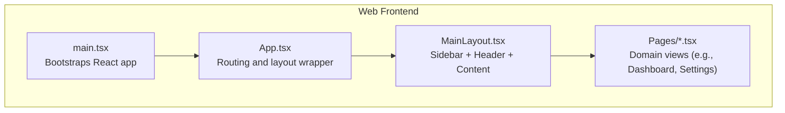
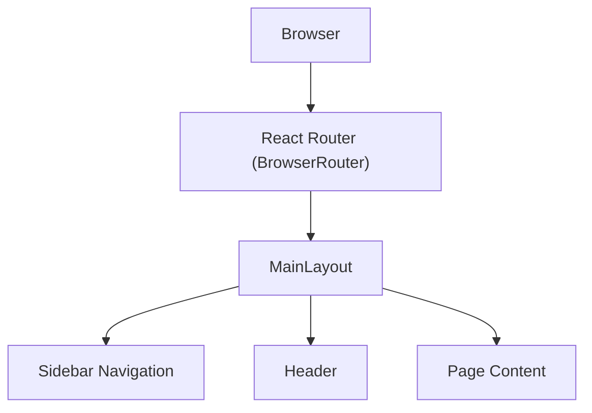
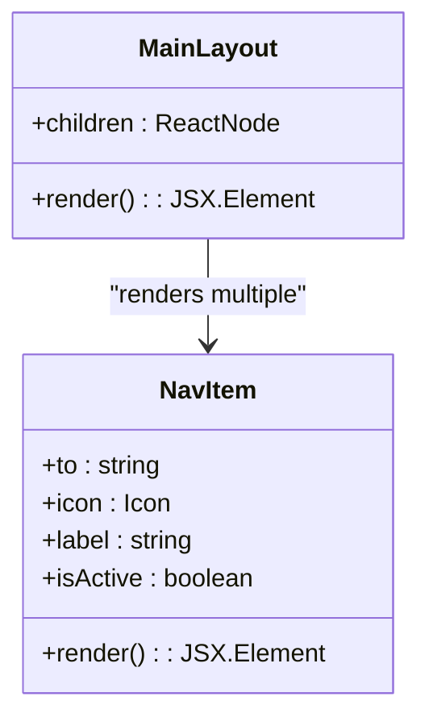
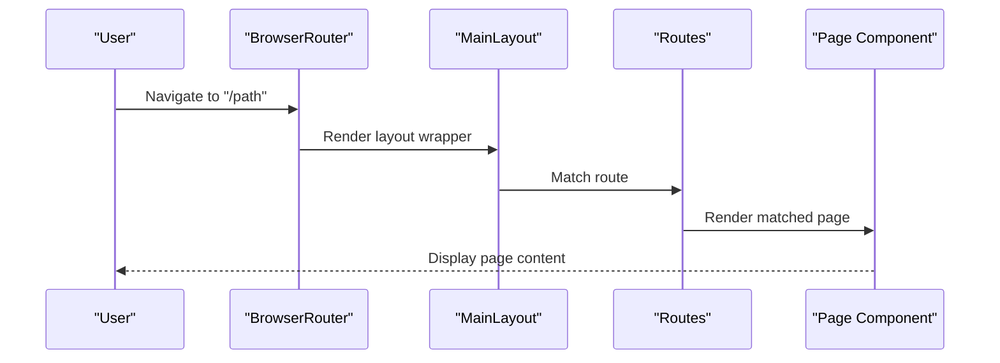
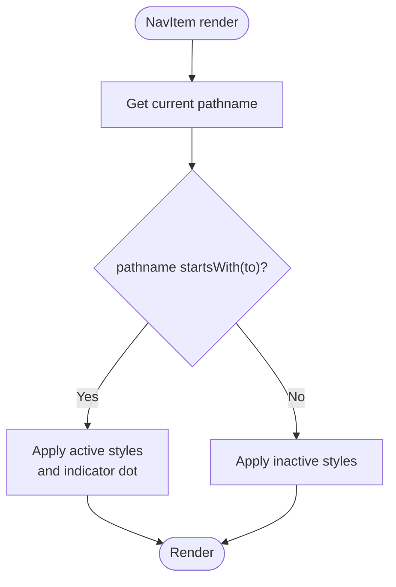
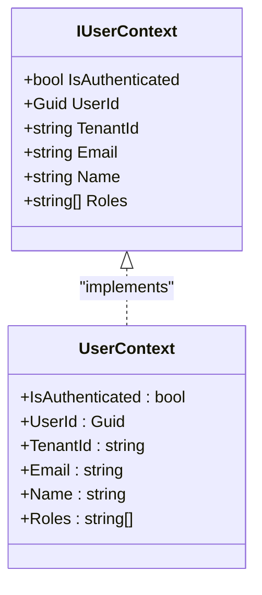
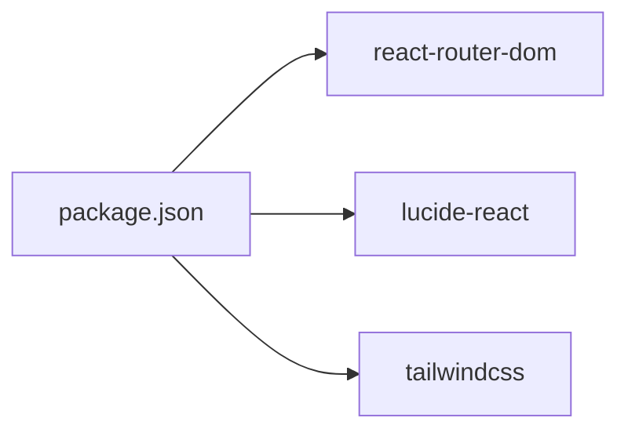

# Navigation and Layout

<cite>
**Referenced Files in This Document**
- [MainLayout.tsx](file://src/Web/ErpSystem.Web/src/layout/MainLayout.tsx)
- [App.tsx](file://src/Web/ErpSystem.Web/src/App.tsx)
- [main.tsx](file://src/Web/ErpSystem.Web/src/main.tsx)
- [Dashboard.tsx](file://src/Web/ErpSystem.Web/src/pages/Dashboard.tsx)
- [Settings.tsx](file://src/Web/ErpSystem.Web/src/pages/Settings.tsx)
- [settingsApi.ts](file://src/Web/ErpSystem.Web/src/api/settingsApi.ts)
- [package.json](file://src/Web/ErpSystem.Web/package.json)
- [IUserContext.cs](file://src/BuildingBlocks/ErpSystem.BuildingBlocks/Auth/IUserContext.cs)
- [UserContext.cs](file://src/BuildingBlocks/ErpSystem.BuildingBlocks/Auth/UserContext.cs)
- [DataPermissionQueries.cs](file://src/Services/Identity/ErpSystem.Identity/Application/DataPermissionQueries.cs)
</cite>

## Table of Contents
1. [Introduction](#introduction)
2. [Project Structure](#project-structure)
3. [Core Components](#core-components)
4. [Architecture Overview](#architecture-overview)
5. [Detailed Component Analysis](#detailed-component-analysis)
6. [Dependency Analysis](#dependency-analysis)
7. [Performance Considerations](#performance-considerations)
8. [Troubleshooting Guide](#troubleshooting-guide)
9. [Conclusion](#conclusion)

## Introduction
This document explains the navigation system and layout components of the web frontend for the ERP microservice. It focuses on the MainLayout component structure, sidebar navigation, active state handling, responsive patterns, routing configuration, and how the system integrates with authentication and role-based navigation filtering. It also provides examples of navigation components, layout customization, and mobile-responsive design patterns.

## Project Structure
The navigation and layout are implemented in the web frontend under src/Web/ErpSystem.Web. The main application wires up routing and wraps pages in the shared layout. The layout defines the sidebar, header, and content area, while individual pages implement domain-specific UI.

**Diagram sources**
- [main.tsx](file://src/Web/ErpSystem.Web/src/main.tsx#L1-L11)
- [App.tsx](file://src/Web/ErpSystem.Web/src/App.tsx#L1-L50)
- [MainLayout.tsx](file://src/Web/ErpSystem.Web/src/layout/MainLayout.tsx#L1-L83)

**Section sources**
- [main.tsx](file://src/Web/ErpSystem.Web/src/main.tsx#L1-L11)
- [App.tsx](file://src/Web/ErpSystem.Web/src/App.tsx#L1-L50)

## Core Components
- MainLayout: Provides the fixed sidebar, header, and content container. Includes a reusable NavItem component that computes active state based on the current route.
- App: Declares routes for all pages and renders them inside MainLayout.
- Pages: Individual domain pages (e.g., Dashboard, Settings) that render within the layout.

Key behaviors:
- Active state detection uses pathname prefix matching to highlight the current menu item.
- Sidebar width and header layout are defined with Tailwind classes.
- Mobile responsiveness includes a menu icon in the header and hidden sidebar behavior on small screens.

**Section sources**
- [MainLayout.tsx](file://src/Web/ErpSystem.Web/src/layout/MainLayout.tsx#L1-L83)
- [App.tsx](file://src/Web/ErpSystem.Web/src/App.tsx#L1-L50)

## Architecture Overview
The navigation architecture centers around a single-page application with client-side routing. MainLayout encapsulates the shell, while App defines routes and passes each page as children. The NavItem component encapsulates active-state logic and styling.

**Diagram sources**
- [App.tsx](file://src/Web/ErpSystem.Web/src/App.tsx#L21-L47)
- [MainLayout.tsx](file://src/Web/ErpSystem.Web/src/layout/MainLayout.tsx#L24-L82)

## Detailed Component Analysis

### MainLayout Component
MainLayout is a fixed sidebar layout with:
- Top bar branding and user avatar
- Vertical navigation list with icons and labels
- Active state highlighting for the current route
- Responsive header with a mobile menu icon

Implementation highlights:
- NavItem computes active state using pathname prefix comparison.
- Active items receive a blue accent indicator and subtle background.
- Sidebar is fixed with a defined width and scrollable navigation area.
- Header includes a mobile-friendly menu icon and user placeholder.

**Diagram sources**
- [MainLayout.tsx](file://src/Web/ErpSystem.Web/src/layout/MainLayout.tsx#L5-L22)
- [MainLayout.tsx](file://src/Web/ErpSystem.Web/src/layout/MainLayout.tsx#L24-L56)

**Section sources**
- [MainLayout.tsx](file://src/Web/ErpSystem.Web/src/layout/MainLayout.tsx#L1-L83)

### Routing Configuration
App.tsx defines all routes and mounts them inside MainLayout. Routes include dashboards, modules (Inventory, Finance, etc.), CRM nested routes, and Settings. A fallback route handles unknown paths.

**Diagram sources**
- [App.tsx](file://src/Web/ErpSystem.Web/src/App.tsx#L21-L47)

**Section sources**
- [App.tsx](file://src/Web/ErpSystem.Web/src/App.tsx#L1-L50)

### Active State Handling
Active state is computed per NavItem by checking whether the current pathname starts with the item's route. This supports nested routes and prefix-based matching.

**Diagram sources**
- [MainLayout.tsx](file://src/Web/ErpSystem.Web/src/layout/MainLayout.tsx#L5-L22)

**Section sources**
- [MainLayout.tsx](file://src/Web/ErpSystem.Web/src/layout/MainLayout.tsx#L5-L22)

### Responsive Navigation Patterns
Responsive behavior is handled at the layout level:
- Header includes a menu icon intended for mobile toggling.
- Sidebar width is fixed and content area offsets accordingly.
- Additional media queries or toggle logic can be added to collapse/expand the sidebar on small screens.

Practical pattern:
- Use a state variable to track mobile sidebar visibility.
- Conditionally apply Tailwind classes to hide/show the sidebar on small screens.
- Ensure content area padding/margins adjust to avoid overlap.

**Section sources**
- [MainLayout.tsx](file://src/Web/ErpSystem.Web/src/layout/MainLayout.tsx#L61-L71)

### Menu Item Management
Menu items are declared statically in MainLayout. Each NavItem specifies:
- Route path (to)
- Icon component
- Label text

Extending the menu:
- Add new NavItem entries with appropriate icons and labels.
- Ensure the corresponding route exists in App.tsx.
- Keep icon imports aligned with Lucide React usage.

**Section sources**
- [MainLayout.tsx](file://src/Web/ErpSystem.Web/src/layout/MainLayout.tsx#L36-L55)
- [App.tsx](file://src/Web/ErpSystem.Web/src/App.tsx#L25-L42)

### Breadcrumb Implementation
The current implementation does not include a dedicated breadcrumb component. To add breadcrumbs:
- Derive breadcrumb segments from the current route path.
- Render a small trail above the page content with links to parent routes.
- Optionally integrate with a navigation state store for dynamic breadcrumbs.

[No sources needed since this section proposes a conceptual enhancement]

### Authentication State and Role-Based Navigation Filtering
Authentication and roles are modeled in the building blocks and identity service:
- IUserContext exposes IsAuthenticated, UserId, TenantId, Email, Name, and Roles.
- UserContext extracts claims from the HTTP context to populate IUserContext.
- Identity service provides commands and queries for user and role management, including data permission resolution.

Integration patterns:
- Wrap MainLayout with an authentication provider that exposes user context.
- Conditionally render NavItem entries based on user roles or permissions.
- Use data permission queries to filter menu items by allowed scopes.

**Diagram sources**
- [IUserContext.cs](file://src/BuildingBlocks/ErpSystem.BuildingBlocks/Auth/IUserContext.cs#L1-L11)
- [UserContext.cs](file://src/BuildingBlocks/ErpSystem.BuildingBlocks/Auth/UserContext.cs#L1-L39)

**Section sources**
- [IUserContext.cs](file://src/BuildingBlocks/ErpSystem.BuildingBlocks/Auth/IUserContext.cs#L1-L11)
- [UserContext.cs](file://src/BuildingBlocks/ErpSystem.BuildingBlocks/Auth/UserContext.cs#L1-L39)
- [DataPermissionQueries.cs](file://src/Services/Identity/ErpSystem.Identity/Application/DataPermissionQueries.cs#L1-L64)

### Examples of Navigation Components and Layout Customization
- Example: Dashboard page demonstrates internal navigation via Link to other modules.
- Example: Settings page showcases tabbed UI within the layout.

Customization tips:
- Adjust sidebar width by modifying the fixed width class on the aside element.
- Change active/inactive colors by editing NavItem's conditional classes.
- Add separators or grouped sections in the sidebar by introducing logical groups and dividers.

**Section sources**
- [Dashboard.tsx](file://src/Web/ErpSystem.Web/src/pages/Dashboard.tsx#L69-L92)
- [Settings.tsx](file://src/Web/ErpSystem.Web/src/pages/Settings.tsx#L62-L115)

## Dependency Analysis
External libraries and their roles:
- react-router-dom: Client-side routing and navigation.
- lucide-react: Icons for menu items and UI elements.
- tailwindcss: Utility-first CSS framework for responsive layouts and theming.

**Diagram sources**
- [package.json](file://src/Web/ErpSystem.Web/package.json#L11-L22)

**Section sources**
- [package.json](file://src/Web/ErpSystem.Web/package.json#L1-L35)

## Performance Considerations
- Active state computation is O(1) per NavItem; keep the number of menu items reasonable for large organizations.
- Consider virtualizing long menus if needed.
- Lazy-load page components to reduce initial bundle size.
- Use CSS containment and contain: layout for layout-heavy pages to minimize reflows.

[No sources needed since this section provides general guidance]

## Troubleshooting Guide
Common issues and resolutions:
- Active state not highlighting: Verify that the NavItem to prop matches the current route prefix and that useLocation is correctly imported.
- Broken icons: Ensure lucide-react is installed and icons are imported properly.
- Layout shifts on mobile: Confirm responsive classes are applied and that the content offset accounts for the sidebar width.
- Settings API errors: Check that the backend endpoint exists and that the base URL is correct in settingsApi.

**Section sources**
- [MainLayout.tsx](file://src/Web/ErpSystem.Web/src/layout/MainLayout.tsx#L5-L22)
- [settingsApi.ts](file://src/Web/ErpSystem.Web/src/api/settingsApi.ts#L1-L42)

## Conclusion
The navigation and layout system is a clean, modular implementation centered on MainLayout and NavItem. It provides a responsive sidebar, active state awareness, and a clear extension point for adding more menu items and integrating with authentication and role-based filtering. Extending the system involves adding routes, updating the sidebar menu, and leveraging the building blocks for user context and permissions.