# Styling and Theming

<cite>
**Referenced Files in This Document**
- [tailwind.config.cjs](file://src/Web/ErpSystem.Web/tailwind.config.cjs)
- [tailwind.config.js](file://src/Web/ErpSystem.Web/tailwind.config.js)
- [postcss.config.cjs](file://src/Web/ErpSystem.Web/postcss.config.cjs)
- [index.css](file://src/Web/ErpSystem.Web/src/index.css)
- [package.json](file://src/Web/ErpSystem.Web/package.json)
- [main.tsx](file://src/Web/ErpSystem.Web/src/main.tsx)
- [App.tsx](file://src/Web/ErpSystem.Web/src/App.tsx)
- [MainLayout.tsx](file://src/Web/ErpSystem.Web/src/layout/MainLayout.tsx)
- [Dashboard.tsx](file://src/Web/ErpSystem.Web/src/pages/Dashboard.tsx)
- [RealTimeDashboard.tsx](file://src/Web/ErpSystem.Web/src/components/RealTimeDashboard.tsx)
- [vite.config.ts](file://src/Web/ErpSystem.Web/vite.config.ts)
</cite>

## Table of Contents
1. [Introduction](#introduction)
2. [Project Structure](#project-structure)
3. [Core Components](#core-components)
4. [Architecture Overview](#architecture-overview)
5. [Detailed Component Analysis](#detailed-component-analysis)
6. [Dependency Analysis](#dependency-analysis)
7. [Performance Considerations](#performance-considerations)
8. [Troubleshooting Guide](#troubleshooting-guide)
9. [Conclusion](#conclusion)

## Introduction
This document explains the styling system and theming implementation for the web frontend of the ERP microservice. It covers Tailwind CSS configuration, PostCSS pipeline, custom CSS utilities, design tokens, dark mode, responsive patterns, and component-level styling strategies. It also outlines how the system integrates with the React application and Vite build toolchain.

## Project Structure
The styling system is organized around a modern React + Vite stack with Tailwind CSS and PostCSS. Key files include:
- Tailwind configuration files for both CommonJS and ES module exports
- PostCSS configuration enabling Tailwind and Autoprefixer
- Global CSS with design tokens and custom utilities
- React components that apply Tailwind utilities and custom classes
- Build configuration for development and production

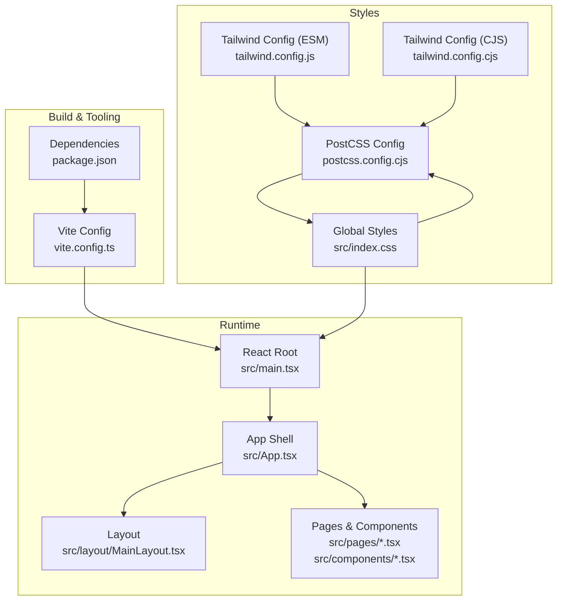

**Diagram sources**
- [vite.config.ts](file://src/Web/ErpSystem.Web/vite.config.ts#L1-L23)
- [package.json](file://src/Web/ErpSystem.Web/package.json#L1-L35)
- [postcss.config.cjs](file://src/Web/ErpSystem.Web/postcss.config.cjs#L1-L7)
- [tailwind.config.js](file://src/Web/ErpSystem.Web/tailwind.config.js#L1-L53)
- [tailwind.config.cjs](file://src/Web/ErpSystem.Web/tailwind.config.cjs#L1-L53)
- [index.css](file://src/Web/ErpSystem.Web/src/index.css#L1-L145)
- [main.tsx](file://src/Web/ErpSystem.Web/src/main.tsx#L1-L11)
- [App.tsx](file://src/Web/ErpSystem.Web/src/App.tsx#L1-L50)
- [MainLayout.tsx](file://src/Web/ErpSystem.Web/src/layout/MainLayout.tsx#L1-L83)
- [Dashboard.tsx](file://src/Web/ErpSystem.Web/src/pages/Dashboard.tsx#L1-L113)
- [RealTimeDashboard.tsx](file://src/Web/ErpSystem.Web/src/components/RealTimeDashboard.tsx#L1-L120)

**Section sources**
- [vite.config.ts](file://src/Web/ErpSystem.Web/vite.config.ts#L1-L23)
- [package.json](file://src/Web/ErpSystem.Web/package.json#L1-L35)
- [postcss.config.cjs](file://src/Web/ErpSystem.Web/postcss.config.cjs#L1-L7)
- [tailwind.config.js](file://src/Web/ErpSystem.Web/tailwind.config.js#L1-L53)
- [tailwind.config.cjs](file://src/Web/ErpSystem.Web/tailwind.config.cjs#L1-L53)
- [index.css](file://src/Web/ErpSystem.Web/src/index.css#L1-L145)
- [main.tsx](file://src/Web/ErpSystem.Web/src/main.tsx#L1-L11)
- [App.tsx](file://src/Web/ErpSystem.Web/src/App.tsx#L1-L50)
- [MainLayout.tsx](file://src/Web/ErpSystem.Web/src/layout/MainLayout.tsx#L1-L83)
- [Dashboard.tsx](file://src/Web/ErpSystem.Web/src/pages/Dashboard.tsx#L1-L113)
- [RealTimeDashboard.tsx](file://src/Web/ErpSystem.Web/src/components/RealTimeDashboard.tsx#L1-L120)

## Core Components
- Tailwind configuration: Defines design tokens and extends the theme with CSS variables for colors, borders, and radii. Two variants exist to support different module systems.
- PostCSS pipeline: Enables Tailwind and Autoprefixer for CSS processing.
- Global CSS: Establishes design tokens via CSS variables, defines dark mode overrides, and provides reusable utilities (buttons, cards, inputs, tables).
- React components: Apply Tailwind utilities and custom classes to implement layouts, cards, navigation, and charts.

Key implementation references:
- Tailwind theme extension and color tokens
- Dark mode CSS variable overrides
- Custom utility classes (.btn, .card, .input, .table-container)
- Responsive grid usage in pages and components

**Section sources**
- [tailwind.config.js](file://src/Web/ErpSystem.Web/tailwind.config.js#L7-L49)
- [tailwind.config.cjs](file://src/Web/ErpSystem.Web/tailwind.config.cjs#L7-L49)
- [index.css](file://src/Web/ErpSystem.Web/src/index.css#L7-L40)
- [index.css](file://src/Web/ErpSystem.Web/src/index.css#L62-L145)
- [Dashboard.tsx](file://src/Web/ErpSystem.Web/src/pages/Dashboard.tsx#L34-L63)
- [RealTimeDashboard.tsx](file://src/Web/ErpSystem.Web/src/components/RealTimeDashboard.tsx#L35-L71)

## Architecture Overview
The styling pipeline transforms source styles into optimized CSS during development and build. Tailwind generates utility classes from the configured theme, while PostCSS processes them with Autoprefixer. The React application imports global styles and applies Tailwind utilities in components.

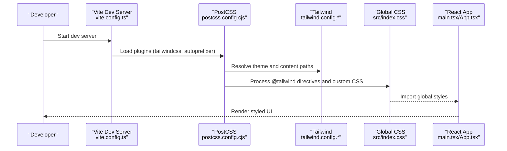

**Diagram sources**
- [vite.config.ts](file://src/Web/ErpSystem.Web/vite.config.ts#L1-L23)
- [postcss.config.cjs](file://src/Web/ErpSystem.Web/postcss.config.cjs#L1-L7)
- [tailwind.config.js](file://src/Web/ErpSystem.Web/tailwind.config.js#L1-L53)
- [tailwind.config.cjs](file://src/Web/ErpSystem.Web/tailwind.config.cjs#L1-L53)
- [index.css](file://src/Web/ErpSystem.Web/src/index.css#L1-L5)
- [main.tsx](file://src/Web/ErpSystem.Web/src/main.tsx#L1-L11)
- [App.tsx](file://src/Web/ErpSystem.Web/src/App.tsx#L1-L50)

## Detailed Component Analysis

### Tailwind Theme and Design Tokens
- Color system: Uses CSS variables for semantic roles (background, foreground, primary, secondary, muted, border, card, destructive, etc.). Tailwind reads these variables to generate utility classes.
- Border radius: Centralized via a CSS variable with derived sizes for lg/md/sm.
- Content scanning: Tailwind scans HTML and TypeScript/TSX files under src to include only used utilities.

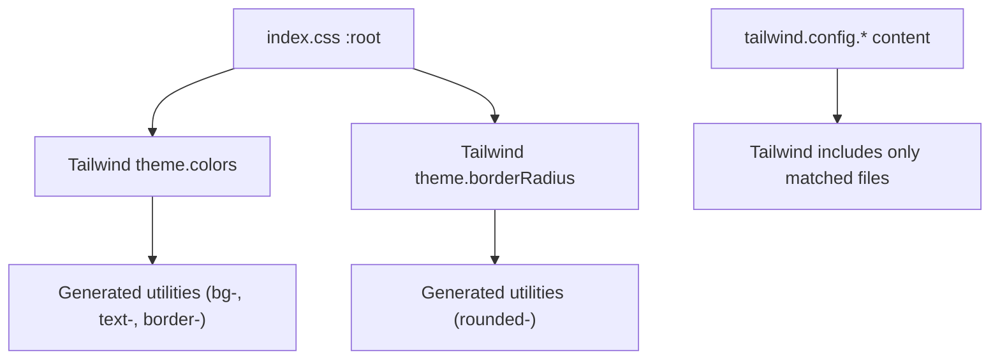

**Diagram sources**
- [index.css](file://src/Web/ErpSystem.Web/src/index.css#L7-L24)
- [tailwind.config.js](file://src/Web/ErpSystem.Web/tailwind.config.js#L3-L6)
- [tailwind.config.cjs](file://src/Web/ErpSystem.Web/tailwind.config.cjs#L3-L6)

**Section sources**
- [index.css](file://src/Web/ErpSystem.Web/src/index.css#L7-L24)
- [tailwind.config.js](file://src/Web/ErpSystem.Web/tailwind.config.js#L7-L49)
- [tailwind.config.cjs](file://src/Web/ErpSystem.Web/tailwind.config.cjs#L7-L49)

### Dark Mode Implementation
- Dark mode is toggled by applying a class to the root element. The stylesheet switches CSS variables to dark equivalents, ensuring all utilities and custom classes adapt automatically.
- Typical pattern: set a class on the body or root element to switch between light and dark variable sets.

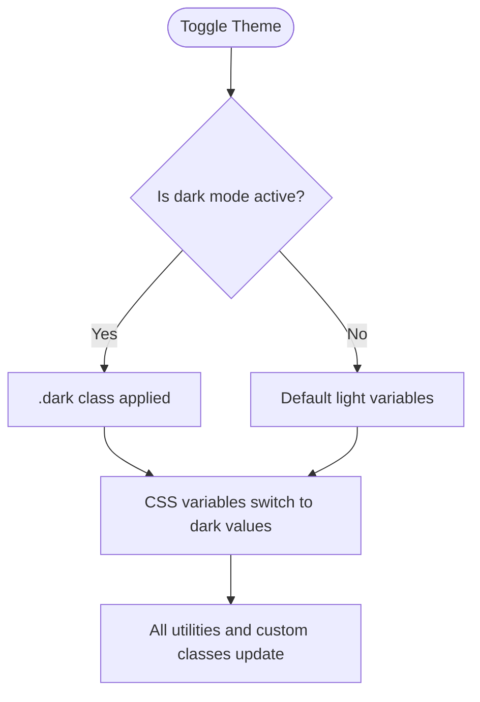

**Diagram sources**
- [index.css](file://src/Web/ErpSystem.Web/src/index.css#L26-L40)

**Section sources**
- [index.css](file://src/Web/ErpSystem.Web/src/index.css#L26-L40)

### Custom Utility Classes
- Buttons: Base button styles with hover effects, and semantic variants (primary, ghost).
- Cards: Consistent background, border, radius, and shadow using CSS variables.
- Inputs: Unified focus state with outline highlighting and consistent sizing.
- Tables: Container with horizontal scrolling, striped rows on hover, and header styling.

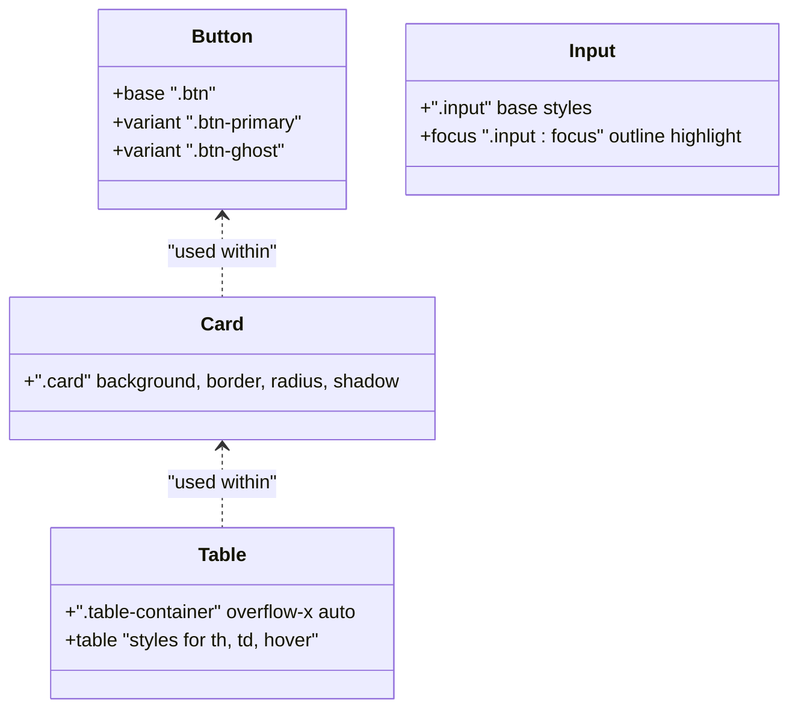

**Diagram sources**
- [index.css](file://src/Web/ErpSystem.Web/src/index.css#L62-L91)
- [index.css](file://src/Web/ErpSystem.Web/src/index.css#L93-L100)
- [index.css](file://src/Web/ErpSystem.Web/src/index.css#L102-L117)
- [index.css](file://src/Web/ErpSystem.Web/src/index.css#L119-L145)

**Section sources**
- [index.css](file://src/Web/ErpSystem.Web/src/index.css#L62-L91)
- [index.css](file://src/Web/ErpSystem.Web/src/index.css#L93-L100)
- [index.css](file://src/Web/ErpSystem.Web/src/index.css#L102-L117)
- [index.css](file://src/Web/ErpSystem.Web/src/index.css#L119-L145)

### Typography Scale and Spacing System
- Typography: Inter font imported globally; body uses CSS variables for color and background.
- Spacing: Derived from consistent units and padding/margin patterns across components and pages.

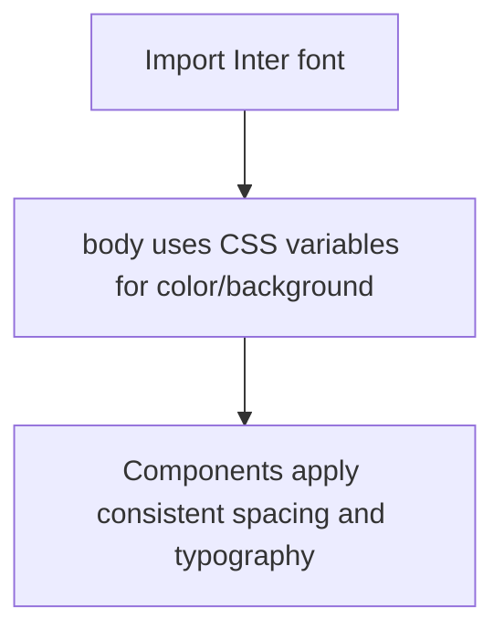

**Diagram sources**
- [index.css](file://src/Web/ErpSystem.Web/src/index.css#L1)
- [index.css](file://src/Web/ErpSystem.Web/src/index.css#L48-L53)

**Section sources**
- [index.css](file://src/Web/ErpSystem.Web/src/index.css#L1)
- [index.css](file://src/Web/ErpSystem.Web/src/index.css#L48-L53)

### Responsive Design Patterns
- Grid layouts: Responsive grids using Tailwind’s grid column utilities scale across breakpoints.
- Containers: Max-width containers and horizontal padding for content areas.
- Navigation: Mobile-first sidebar with hidden menu on small screens.

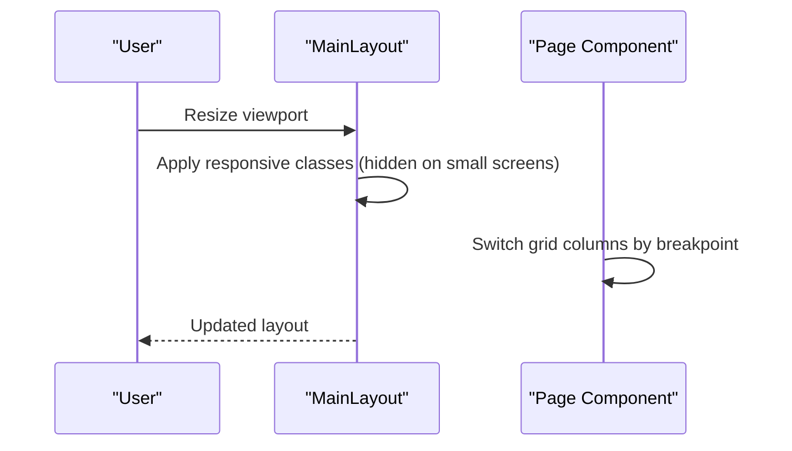

**Diagram sources**
- [MainLayout.tsx](file://src/Web/ErpSystem.Web/src/layout/MainLayout.tsx#L61-L71)
- [Dashboard.tsx](file://src/Web/ErpSystem.Web/src/pages/Dashboard.tsx#L34-L63)
- [RealTimeDashboard.tsx](file://src/Web/ErpSystem.Web/src/components/RealTimeDashboard.tsx#L35-L71)

**Section sources**
- [MainLayout.tsx](file://src/Web/ErpSystem.Web/src/layout/MainLayout.tsx#L61-L71)
- [Dashboard.tsx](file://src/Web/ErpSystem.Web/src/pages/Dashboard.tsx#L34-L63)
- [RealTimeDashboard.tsx](file://src/Web/ErpSystem.Web/src/components/RealTimeDashboard.tsx#L35-L71)

### Component-Level Styling Strategies
- Semantic roles: Prefer semantic Tailwind utilities (bg-primary, text-foreground) aligned with CSS variables.
- Composition: Combine base utilities with modifiers for states (hover, focus).
- Custom classes: Use custom classes for repeated patterns (e.g., .btn, .card).
- Charts and tables: Use container utilities for responsiveness and table utilities for readability.

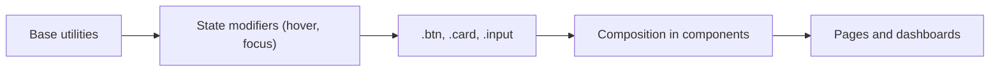

**Diagram sources**
- [Dashboard.tsx](file://src/Web/ErpSystem.Web/src/pages/Dashboard.tsx#L5-L24)
- [RealTimeDashboard.tsx](file://src/Web/ErpSystem.Web/src/components/RealTimeDashboard.tsx#L35-L71)
- [index.css](file://src/Web/ErpSystem.Web/src/index.css#L62-L145)

**Section sources**
- [Dashboard.tsx](file://src/Web/ErpSystem.Web/src/pages/Dashboard.tsx#L5-L24)
- [RealTimeDashboard.tsx](file://src/Web/ErpSystem.Web/src/components/RealTimeDashboard.tsx#L35-L71)
- [index.css](file://src/Web/ErpSystem.Web/src/index.css#L62-L145)

### PostCSS and Tailwind Integration
- Plugins: Tailwind and Autoprefixer are enabled in PostCSS.
- Build: Vite loads the PostCSS configuration; Tailwind scans configured content paths.

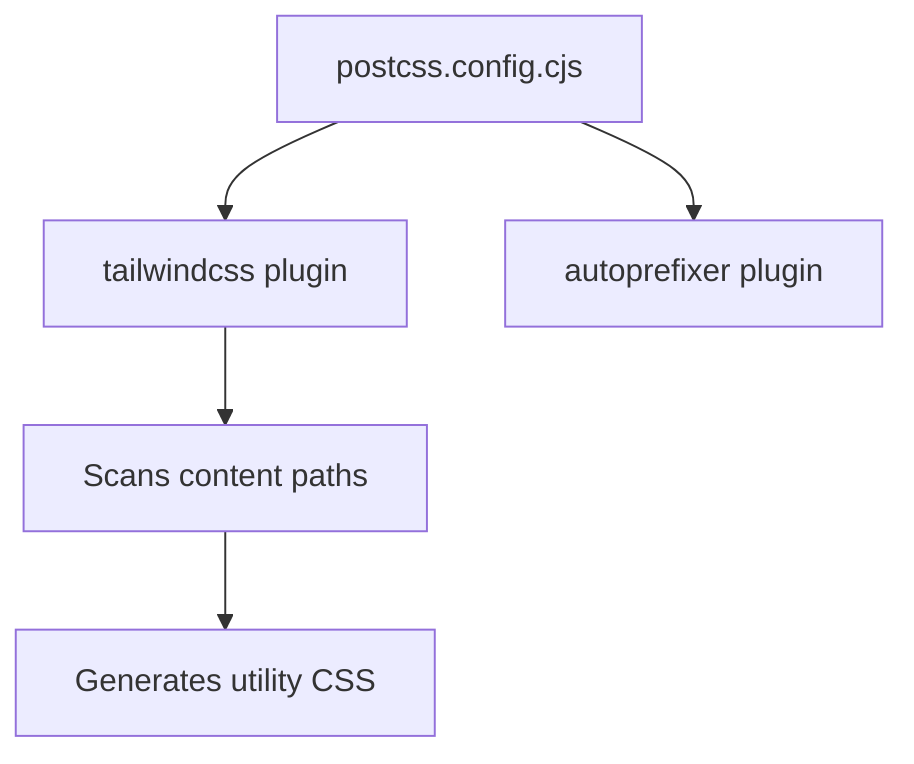

**Diagram sources**
- [postcss.config.cjs](file://src/Web/ErpSystem.Web/postcss.config.cjs#L1-L7)
- [tailwind.config.js](file://src/Web/ErpSystem.Web/tailwind.config.js#L3-L6)

**Section sources**
- [postcss.config.cjs](file://src/Web/ErpSystem.Web/postcss.config.cjs#L1-L7)
- [tailwind.config.js](file://src/Web/ErpSystem.Web/tailwind.config.js#L3-L6)

### Theme Customization Examples
- Add new semantic role: Define a CSS variable in :root, extend Tailwind theme colors, and use generated utilities in components.
- Adjust radius scale: Modify the CSS variable and derived sizes; Tailwind utilities will reflect the change.
- Extend color palette: Add entries to Tailwind theme colors and reference them in components.

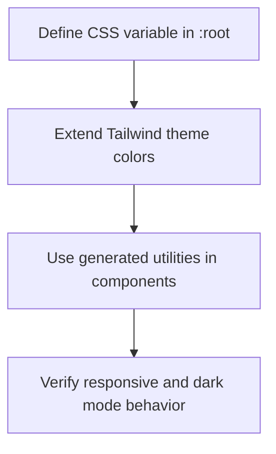

**Diagram sources**
- [index.css](file://src/Web/ErpSystem.Web/src/index.css#L7-L24)
- [tailwind.config.js](file://src/Web/ErpSystem.Web/tailwind.config.js#L8-L43)
- [Dashboard.tsx](file://src/Web/ErpSystem.Web/src/pages/Dashboard.tsx#L6-L24)

**Section sources**
- [index.css](file://src/Web/ErpSystem.Web/src/index.css#L7-L24)
- [tailwind.config.js](file://src/Web/ErpSystem.Web/tailwind.config.js#L8-L43)
- [Dashboard.tsx](file://src/Web/ErpSystem.Web/src/pages/Dashboard.tsx#L6-L24)

## Dependency Analysis
External libraries supporting styling:
- Tailwind CSS and PostCSS for utility-first CSS generation and autoprefixing
- clsx and tailwind-merge for conditional class composition and merging
- lucide-react for icons used within styled components
- recharts for data visualization within dashboard components

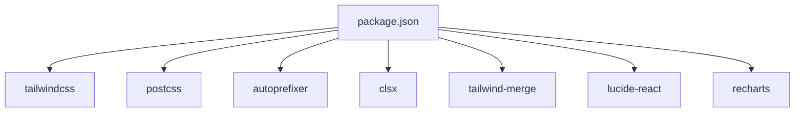

**Diagram sources**
- [package.json](file://src/Web/ErpSystem.Web/package.json#L11-L33)

**Section sources**
- [package.json](file://src/Web/ErpSystem.Web/package.json#L11-L33)

## Performance Considerations
- Purge unused CSS: Tailwind’s content scanning ensures only used utilities are included in builds.
- Minimize custom CSS: Prefer Tailwind utilities to reduce custom CSS size.
- Optimize images/icons: Use lucide-react icons to avoid extra asset loading.
- Bundle splitting: Vite handles code-splitting; keep styles scoped to components to avoid unnecessary reflows.

[No sources needed since this section provides general guidance]

## Troubleshooting Guide
- Utilities not applying:
  - Verify Tailwind content paths include the relevant files.
  - Confirm PostCSS plugins are loaded.
- Dark mode not switching:
  - Ensure the dark class is toggled on the root element.
  - Check that CSS variables are defined for dark mode.
- Build errors:
  - Validate Tailwind and PostCSS versions match configuration.
  - Confirm Vite is configured to process CSS.

**Section sources**
- [tailwind.config.js](file://src/Web/ErpSystem.Web/tailwind.config.js#L3-L6)
- [postcss.config.cjs](file://src/Web/ErpSystem.Web/postcss.config.cjs#L1-L7)
- [index.css](file://src/Web/ErpSystem.Web/src/index.css#L26-L40)

## Conclusion
The styling system leverages Tailwind CSS with a centralized design token strategy, PostCSS for processing, and custom utilities for consistent component patterns. Dark mode is implemented via CSS variables and a dedicated class toggle. Components use responsive grids and semantic utilities to achieve a cohesive, maintainable design system.