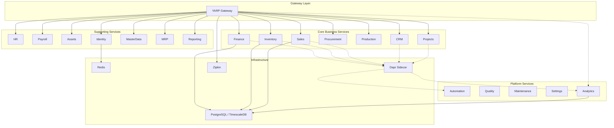

# Getting Started

<cite>
**Referenced Files in This Document**
- [README.md](file://README.md)
- [DEVELOPMENT_PLAN.md](file://DEVELOPMENT_PLAN.md)
- [docker-compose.yml](file://docker-compose.yml)
- [Dockerfile](file://Dockerfile)
- [src/ErpSystem.sln](file://src/ErpSystem.sln)
- [src/Gateways/ErpSystem.Gateway/appsettings.json](file://src/Gateways/ErpSystem.Gateway/appsettings.json)
- [src/Gateways/ErpSystem.Gateway/Dockerfile](file://src/Gateways/ErpSystem.Gateway/Dockerfile)
- [src/Gateways/ErpSystem.Gateway/ErpSystem.Gateway.http](file://src/Gateways/ErpSystem.Gateway/ErpSystem.Gateway.http)
- [src/Services/Finance/ErpSystem.Finance/appsettings.json](file://src/Services/Finance/ErpSystem.Finance/appsettings.json)
- [src/Services/Finance/ErpSystem.Finance/ErpSystem.Finance.csproj](file://src/Services/Finance/ErpSystem.Finance/ErpSystem.Finance.csproj)
- [src/Services/Finance/ErpSystem.Finance/ErpSystem.Finance.http](file://src/Services/Finance/ErpSystem.Finance/ErpSystem.Finance.http)
- [src/Services/Identity/ErpSystem.Identity/Dockerfile](file://src/Services/Identity/ErpSystem.Identity/Dockerfile)
- [infrastructure/init.sql](file://infrastructure/init.sql)
- [components/pubsub.yaml](file://components/pubsub.yaml)
</cite>

## Table of Contents
1. [Introduction](#introduction)
2. [Prerequisites](#prerequisites)
3. [Local Development Setup](#local-development-setup)
4. [Environment Configuration](#environment-configuration)
5. [Database Setup](#database-setup)
6. [Run Services](#run-services)
7. [Docker Containerization](#docker-containerization)
8. [Verification Checklist](#verification-checklist)
9. [Troubleshooting Guide](#troubleshooting-guide)
10. [Architecture Overview](#architecture-overview)
11. [Conclusion](#conclusion)

## Introduction
This guide helps you set up and run the ERP microservices system locally for the first time. You will learn how to prepare your environment, build the solution, run individual services directly with .NET, or containerize them with Docker. It also covers environment configuration, database initialization, and verification steps to ensure everything works as expected.

## Prerequisites
Before starting, ensure you have installed and verified the following tools and versions:

- .NET SDK 10.0 or later
- Docker Desktop
- PostgreSQL 16 or later (used with TimescaleDB extension in containers)

These requirements are essential for building, running, and testing the microservices locally.

**Section sources**
- [README.md](file://README.md#L219-L226)

## Local Development Setup
Follow these steps to prepare your local environment:

1. Clone the repository
   - Use your preferred Git client to clone the repository to your machine.
2. Build the solution
   - Open a terminal in the repository root and run the build command against the solution file.
3. Run tests (optional but recommended)
   - Execute the test suite to validate your environment and dependencies.

After completing these steps, you can proceed to run individual services either directly with .NET or via Docker.

**Section sources**
- [README.md](file://README.md#L227-L241)
- [src/ErpSystem.sln](file://src/ErpSystem.sln#L1-L400)

## Environment Configuration
Each service reads configuration from its own appsettings files. The most common configuration keys you will encounter are:

- Logging: Controls log verbosity.
- AllowedHosts: Defines allowed hosts for the service.
- ConnectionStrings: Contains connection strings for databases used by the service.

For example, the Finance service defines a connection string named after its database. The Gateway service defines routing rules for all microservices and maps logical paths to local ports.

Key configuration locations:
- Finance service connection string: [src/Services/Finance/ErpSystem.Finance/appsettings.json](file://src/Services/Finance/ErpSystem.Finance/appsettings.json#L1-L12)
- Gateway reverse proxy routes and clusters: [src/Gateways/ErpSystem.Gateway/appsettings.json](file://src/Gateways/ErpSystem.Gateway/appsettings.json#L1-L229)

Notes:
- The Gateway configuration includes SignalR/WebSocket routes for real-time dashboards.
- The Gateway forwards traffic to local ports that match the Docker Compose service ports.

**Section sources**
- [src/Services/Finance/ErpSystem.Finance/appsettings.json](file://src/Services/Finance/ErpSystem.Finance/appsettings.json#L1-L12)
- [src/Gateways/ErpSystem.Gateway/appsettings.json](file://src/Gateways/ErpSystem.Gateway/appsettings.json#L1-L229)

## Database Setup
The system uses PostgreSQL 16+ with TimescaleDB support. There are two ways to initialize databases:

Option A: Initialize inside the container
- The Docker Compose setup mounts SQL scripts into the container’s initialization folder. These scripts create databases for multiple services.

Option B: Initialize manually on your host PostgreSQL
- Use the provided script to create databases for all services.

Important files:
- Docker Compose mounts initialization scripts for PostgreSQL: [docker-compose.yml](file://docker-compose.yml#L72-L82)
- Initialization script for databases: [infrastructure/init.sql](file://infrastructure/init.sql#L1-L9)

Additional Dapr components:
- Redis is used for pub/sub messaging. The pub/sub component definition references Redis at redis:6379.
- Component file: [components/pubsub.yaml](file://components/pubsub.yaml#L1-L13)

**Section sources**
- [docker-compose.yml](file://docker-compose.yml#L72-L82)
- [infrastructure/init.sql](file://infrastructure/init.sql#L1-L9)
- [components/pubsub.yaml](file://components/pubsub.yaml#L1-L13)

## Run Services
You can run services directly with .NET or via Docker. This section explains both approaches.

### Option 1: Run a Service Directly with .NET
Steps:
1. Navigate to the service directory.
2. Run the service using dotnet run.
3. Use the service’s HTTP client file to test endpoints.

Example for the Finance service:
- Service directory: [src/Services/Finance/ErpSystem.Finance](file://src/Services/Finance/ErpSystem.Finance)
- HTTP test file: [src/Services/Finance/ErpSystem.Finance/ErpSystem.Finance.http](file://src/Services/Finance/ErpSystem.Finance/ErpSystem.Finance.http#L1-L7)
- Connection string reference: [src/Services/Finance/ErpSystem.Finance/appsettings.json](file://src/Services/Finance/ErpSystem.Finance/appsettings.json#L1-L12)

Notes:
- Ensure the database is initialized before starting the service.
- Confirm the Gateway is running so you can reach the service via the Gateway route.

**Section sources**
- [README.md](file://README.md#L227-L241)
- [src/Services/Finance/ErpSystem.Finance/ErpSystem.Finance.http](file://src/Services/Finance/ErpSystem.Finance/ErpSystem.Finance.http#L1-L7)
- [src/Services/Finance/ErpSystem.Finance/appsettings.json](file://src/Services/Finance/ErpSystem.Finance/appsettings.json#L1-L12)

### Option 2: Run Services with Docker
There are two primary ways to run services with Docker:

Approach A: Build a single service image with the multi-stage Dockerfile
- The repository provides a multi-stage Dockerfile that builds a specific service into a runtime image.
- Example build command for the Finance service is documented in the repository.

Approach B: Use Docker Compose
- The repository includes a docker-compose.yml that orchestrates services, PostgreSQL/TimescaleDB, Redis, Dapr placement, and Zipkin.
- The compose file defines environment variables for connection strings and exposes ports for services and Dapr sidecars.

Key files:
- Multi-stage Dockerfile: [Dockerfile](file://Dockerfile#L1-L37)
- Docker Compose orchestration: [docker-compose.yml](file://docker-compose.yml#L1-L99)
- Gateway Dockerfile: [src/Gateways/ErpSystem.Gateway/Dockerfile](file://src/Gateways/ErpSystem.Gateway/Dockerfile#L1-L22)
- Identity service Dockerfile: [src/Services/Identity/ErpSystem.Identity/Dockerfile](file://src/Services/Identity/ErpSystem.Identity/Dockerfile#L1-L24)

Ports and services exposed by Docker Compose:
- Identity API: port 5001
- Gateway: port 5072
- PostgreSQL/TimescaleDB: port 5432
- Redis: port 6379
- Dapr placement: port 50006
- Zipkin: port 9411

**Section sources**
- [Dockerfile](file://Dockerfile#L1-L37)
- [docker-compose.yml](file://docker-compose.yml#L1-L99)
- [src/Gateways/ErpSystem.Gateway/Dockerfile](file://src/Gateways/ErpSystem.Gateway/Dockerfile#L1-L22)
- [src/Services/Identity/ErpSystem.Identity/Dockerfile](file://src/Services/Identity/ErpSystem.Identity/Dockerfile#L1-L24)

## Docker Containerization
The repository provides a multi-stage Dockerfile designed to build and publish a selected service into a minimal runtime image. You can:

- Build a specific service image by setting the SERVICE_NAME build argument.
- Alternatively, use Docker Compose to orchestrate all services and infrastructure components.

Best practices:
- Set the SERVICE_NAME build argument to the service folder name (e.g., Finance).
- Ensure the base images target .NET 10 runtime and SDK as defined in the Dockerfiles.

**Section sources**
- [Dockerfile](file://Dockerfile#L1-L37)
- [docker-compose.yml](file://docker-compose.yml#L1-L99)

## Verification Checklist
After setting up and starting services, verify your installation with the following steps:

- Build the solution and run tests to confirm dependencies are satisfied.
- Start the Gateway and confirm it responds on its configured port.
- Start a business service (e.g., Finance) and confirm it responds on its configured port.
- If using Docker Compose, confirm all containers are healthy and reachable on their mapped ports.
- Use the service’s HTTP client file to send a sample request and inspect the response.
- Confirm that the Gateway routes to the service are configured correctly and that the service database exists.

Suggested checks:
- Build and test the solution: [README.md](file://README.md#L227-L241)
- Gateway HTTP client: [src/Gateways/ErpSystem.Gateway/ErpSystem.Gateway.http](file://src/Gateways/ErpSystem.Gateway/ErpSystem.Gateway.http#L1-L229)
- Finance HTTP client: [src/Services/Finance/ErpSystem.Finance/ErpSystem.Finance.http](file://src/Services/Finance/ErpSystem.Finance/ErpSystem.Finance.http#L1-L7)

**Section sources**
- [README.md](file://README.md#L227-L241)
- [src/Gateways/ErpSystem.Gateway/ErpSystem.Gateway.http](file://src/Gateways/ErpSystem.Gateway/ErpSystem.Gateway.http#L1-L229)
- [src/Services/Finance/ErpSystem.Finance/ErpSystem.Finance.http](file://src/Services/Finance/ErpSystem.Finance/ErpSystem.Finance.http#L1-L7)

## Troubleshooting Guide
Common issues and resolutions:

- Cannot connect to PostgreSQL
  - Ensure PostgreSQL 16+ is installed and running on your host or inside Docker Compose.
  - Confirm the initialization script ran and created the required databases.
  - Reference: [infrastructure/init.sql](file://infrastructure/init.sql#L1-L9)

- Dapr sidecar errors
  - Verify Dapr placement service is running and reachable.
  - Confirm the Dapr sidecar logs show successful component loading.
  - Reference: [docker-compose.yml](file://docker-compose.yml#L57-L63)

- Redis pub/sub not working
  - Ensure Redis is running and accessible at redis:6379.
  - Confirm the pub/sub component references the correct host and port.
  - Reference: [components/pubsub.yaml](file://components/pubsub.yaml#L1-L13)

- Gateway routing issues
  - Confirm the Gateway routes and cluster destinations match the service ports.
  - Reference: [src/Gateways/ErpSystem.Gateway/appsettings.json](file://src/Gateways/ErpSystem.Gateway/appsettings.json#L1-L229)

- Service fails to start due to missing database
  - Initialize databases using the provided script or Docker Compose initialization.
  - Reference: [docker-compose.yml](file://docker-compose.yml#L72-L82), [infrastructure/init.sql](file://infrastructure/init.sql#L1-L9)

- Port conflicts
  - Change service ports in docker-compose.yml or adjust local port mappings.
  - Reference: [docker-compose.yml](file://docker-compose.yml#L9-L82)

**Section sources**
- [infrastructure/init.sql](file://infrastructure/init.sql#L1-L9)
- [docker-compose.yml](file://docker-compose.yml#L57-L82)
- [components/pubsub.yaml](file://components/pubsub.yaml#L1-L13)
- [src/Gateways/ErpSystem.Gateway/appsettings.json](file://src/Gateways/ErpSystem.Gateway/appsettings.json#L1-L229)

## Architecture Overview
The system follows a microservices architecture with a YARP Gateway, Dapr sidecars, PostgreSQL/TimescaleDB, Redis, and Zipkin for observability. The Gateway routes requests to backend services, which communicate asynchronously via Dapr pub/sub.

**Diagram sources**
- [README.md](file://README.md#L130-L183)
- [docker-compose.yml](file://docker-compose.yml#L1-L99)

## Conclusion
You now have the essentials to set up the ERP microservices system locally. Start by validating prerequisites, initializing the database, and running either individual services with .NET or using Docker Compose. Use the verification checklist to confirm your setup, and refer to the troubleshooting guide for common issues. Once the basics are confirmed, explore the Gateway routes and service-specific HTTP clients to interact with the system.