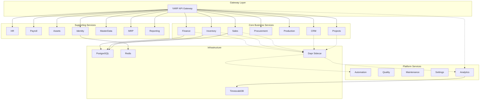
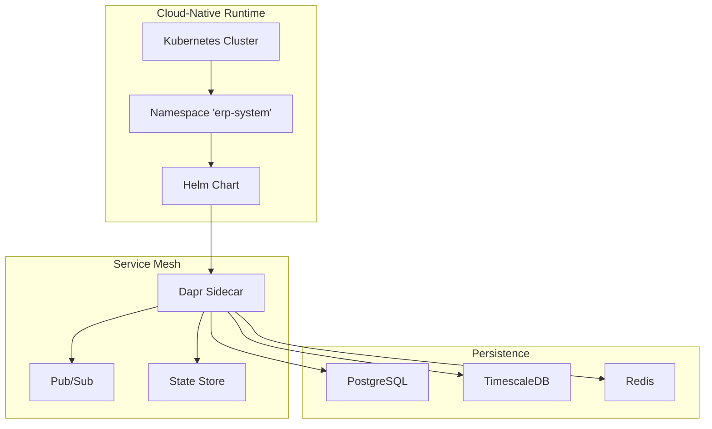
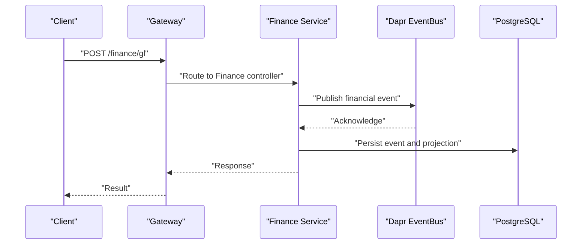
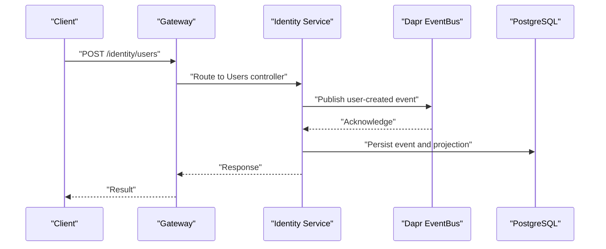
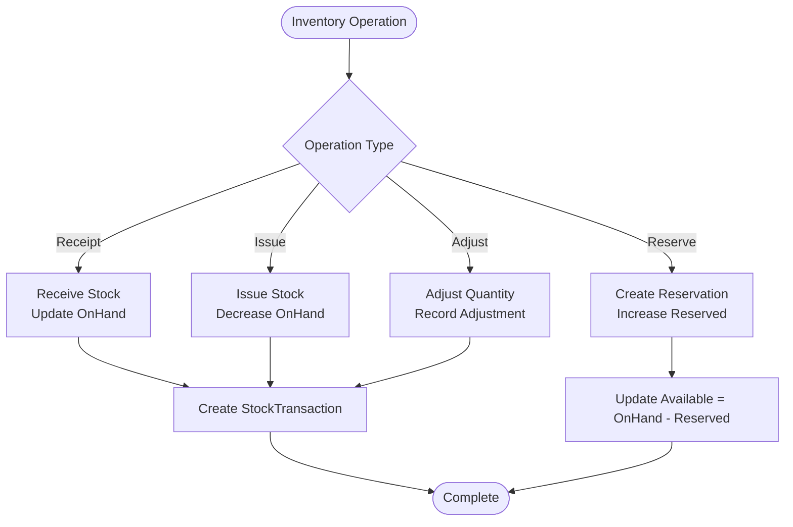
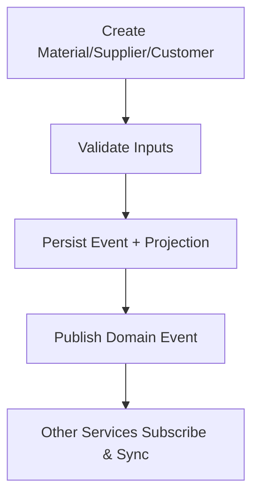
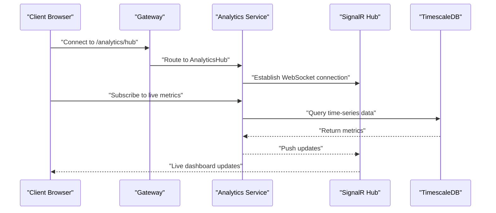
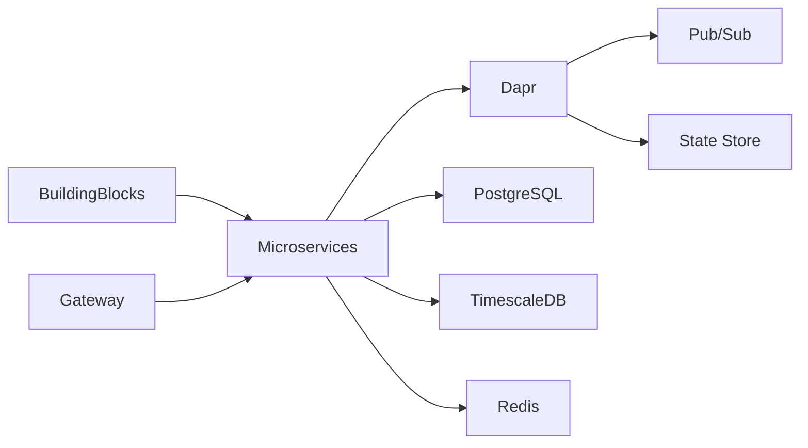

# Project Overview

<cite>
**Referenced Files in This Document**
- [README.md](file://README.md)
- [DEVELOPMENT_PLAN.md](file://DEVELOPMENT_PLAN.md)
- [src/ErpSystem.sln](file://src/ErpSystem.sln)
- [src/BuildingBlocks/ErpSystem.BuildingBlocks/DependencyInjection.cs](file://src/BuildingBlocks/ErpSystem.BuildingBlocks/DependencyInjection.cs)
- [src/Gateways/ErpSystem.Gateway/Program.cs](file://src/Gateways/ErpSystem.Gateway/Program.cs)
- [src/Services/Finance/ErpSystem.Finance/Program.cs](file://src/Services/Finance/ErpSystem.Finance/Program.cs)
- [src/Services/Identity/ErpSystem.Identity/Program.cs](file://src/Services/Identity/ErpSystem.Identity/Program.cs)
- [docs/deployment.md](file://docs/deployment.md)
- [deploy/k8s/namespace.yaml](file://deploy/k8s/namespace.yaml)
- [docs/PRD-01-MasterData-Service.md](file://docs/PRD-01-MasterData-Service.md)
- [docs/PRD-05-Inventory-Service.md](file://docs/PRD-05-Inventory-Service.md)
</cite>

## Table of Contents
1. [Introduction](#introduction)
2. [Project Structure](#project-structure)
3. [Core Components](#core-components)
4. [Architecture Overview](#architecture-overview)
5. [Detailed Component Analysis](#detailed-component-analysis)
6. [Dependency Analysis](#dependency-analysis)
7. [Performance Considerations](#performance-considerations)
8. [Troubleshooting Guide](#troubleshooting-guide)
9. [Conclusion](#conclusion)
10. [Appendices](#appendices)

## Introduction
This document presents a comprehensive overview of the ERP microservices project, a production-ready, cloud-native enterprise system built with .NET 10, Domain-Driven Design (DDD), and enterprise-grade patterns. It outlines the system’s purpose, architecture, key capabilities across finance, supply chain, sales, manufacturing, human resources, and business intelligence, and the technology stack including Dapr, PostgreSQL, TimescaleDB, and Kubernetes. It also highlights the project’s value proposition versus legacy monolithic ERPs, emphasizing 15+ independently deployable microservices, a modern tech stack, and real-world complexity.

## Project Structure
The solution is organized around a shared building blocks library and multiple bounded microservices grouped by domain capability. The gateway acts as the single entry point, routing traffic to domain services. Supporting services provide cross-domain capabilities such as identity, master data, reporting, analytics, automation, quality, maintenance, projects, payroll, assets, and settings. Infrastructure includes PostgreSQL for relational persistence, Redis for caching/state/pub-sub, and Dapr for distributed application runtime capabilities.

**Diagram sources**
- [README.md](file://README.md#L130-L183)
- [src/Gateways/ErpSystem.Gateway/Program.cs](file://src/Gateways/ErpSystem.Gateway/Program.cs#L22-L24)
- [src/Services/Finance/ErpSystem.Finance/Program.cs](file://src/Services/Finance/ErpSystem.Finance/Program.cs#L20-L24)
- [src/Services/Identity/ErpSystem.Identity/Program.cs](file://src/Services/Identity/ErpSystem.Identity/Program.cs#L20-L24)

**Section sources**
- [README.md](file://README.md#L24-L32)
- [README.md](file://README.md#L289-L322)
- [src/ErpSystem.sln](file://src/ErpSystem.sln#L1-L400)

## Core Components
- Shared Building Blocks: A reusable kernel providing cross-cutting concerns such as validation, logging, performance, auditing, multi-tenancy, caching, resilience, outbox, and domain/event bus abstractions. Dependency injection registers validators and pipeline behaviors consistently across services.
- Gateway: A YARP-based reverse proxy with resilience policies (retry, circuit breaker, timeout), rate limiting, CORS, and health checks, enabling centralized traffic management and protection.
- Domain Services: 15+ microservices organized by business capability, each encapsulating domain logic, CQRS handlers, event sourcing, and projections. Examples include Finance, Inventory, Sales, Procurement, Production, HR, Payroll, Assets, Identity, MasterData, MRP, Reporting, CRM, Projects, Quality, Maintenance, Automation, and Analytics.

Key characteristics:
- Event-driven architecture with Dapr for service invocation and pub/sub.
- Domain-Driven Design with aggregates, domain events, and CQRS.
- Outbox pattern for reliable event publishing.
- Multi-tenancy support and tenant isolation.
- Health checks and observability readiness.

**Section sources**
- [README.md](file://README.md#L185-L196)
- [README.md](file://README.md#L197-L213)
- [src/BuildingBlocks/ErpSystem.BuildingBlocks/DependencyInjection.cs](file://src/BuildingBlocks/ErpSystem.BuildingBlocks/DependencyInjection.cs#L12-L28)
- [src/Gateways/ErpSystem.Gateway/Program.cs](file://src/Gateways/ErpSystem.Gateway/Program.cs#L30-L64)

## Architecture Overview
The system follows a cloud-native microservices architecture with:
- Clean Architecture inside each service: API, Application, Domain, and Infrastructure layers.
- Dapr sidecars for service invocation, pub/sub, state management, and secret stores.
- PostgreSQL for relational persistence and TimescaleDB for time-series analytics.
- Kubernetes deployment via Helm charts and raw manifests, with a dedicated namespace and ingress.

**Diagram sources**
- [docs/deployment.md](file://docs/deployment.md#L26-L44)
- [deploy/k8s/namespace.yaml](file://deploy/k8s/namespace.yaml#L1-L8)
- [README.md](file://README.md#L166-L171)

**Section sources**
- [DEVELOPMENT_PLAN.md](file://DEVELOPMENT_PLAN.md#L34-L42)
- [docs/deployment.md](file://docs/deployment.md#L1-L115)
- [README.md](file://README.md#L255-L283)

## Detailed Component Analysis

### Finance Service
The Finance service implements general ledger, accounts payable/receivable, journal entries, and financial reporting. It integrates with Dapr event bus, uses event sourcing for auditability, and exposes APIs for GL and invoice management.

**Diagram sources**
- [src/Services/Finance/ErpSystem.Finance/Program.cs](file://src/Services/Finance/ErpSystem.Finance/Program.cs#L26-L49)
- [README.md](file://README.md#L138-L146)

**Section sources**
- [src/Services/Finance/ErpSystem.Finance/Program.cs](file://src/Services/Finance/ErpSystem.Finance/Program.cs#L1-L86)

### Identity Service
The Identity service manages users, roles, departments, and permissions with JWT and integration events. It leverages Dapr event bus and maintains separate event and read databases.

**Diagram sources**
- [src/Services/Identity/ErpSystem.Identity/Program.cs](file://src/Services/Identity/ErpSystem.Identity/Program.cs#L26-L37)
- [README.md](file://README.md#L152-L153)

**Section sources**
- [src/Services/Identity/ErpSystem.Identity/Program.cs](file://src/Services/Identity/ErpSystem.Identity/Program.cs#L1-L71)

### Inventory Service
The Inventory service tracks OnHand, Reserved, and Available quantities, supports reservations, receipts, issues, and adjustments, and integrates with Procurement, Sales, and Production via events.

**Diagram sources**
- [docs/PRD-05-Inventory-Service.md](file://docs/PRD-05-Inventory-Service.md#L164-L296)

**Section sources**
- [docs/PRD-05-Inventory-Service.md](file://docs/PRD-05-Inventory-Service.md#L1-L528)

### MasterData Service
The MasterData service centralizes core entities such as materials, suppliers, customers, warehouses, and units of measure. It emits domain events consumed by other services.

**Diagram sources**
- [docs/PRD-01-MasterData-Service.md](file://docs/PRD-01-MasterData-Service.md#L400-L447)

**Section sources**
- [docs/PRD-01-MasterData-Service.md](file://docs/PRD-01-MasterData-Service.md#L1-L827)

### Analytics and Real-time Dashboards
The Analytics service provides real-time dashboards and time-series analytics powered by SignalR/WebSockets and TimescaleDB for high-performance time-series data.

**Diagram sources**
- [README.md](file://README.md#L112-L123)

**Section sources**
- [README.md](file://README.md#L112-L123)

## Dependency Analysis
The project exhibits strong modularity and low coupling:
- Services depend on shared building blocks for common concerns.
- Cross-service communication is event-driven via Dapr pub/sub.
- Persistence is service-specific with PostgreSQL and TimescaleDB.
- Gateway coordinates routing and applies resilience policies.

**Diagram sources**
- [src/BuildingBlocks/ErpSystem.BuildingBlocks/DependencyInjection.cs](file://src/BuildingBlocks/ErpSystem.BuildingBlocks/DependencyInjection.cs#L12-L28)
- [src/Gateways/ErpSystem.Gateway/Program.cs](file://src/Gateways/ErpSystem.Gateway/Program.cs#L30-L64)
- [README.md](file://README.md#L166-L171)

**Section sources**
- [src/BuildingBlocks/ErpSystem.BuildingBlocks/DependencyInjection.cs](file://src/BuildingBlocks/ErpSystem.BuildingBlocks/DependencyInjection.cs#L1-L31)
- [src/Gateways/ErpSystem.Gateway/Program.cs](file://src/Gateways/ErpSystem.Gateway/Program.cs#L1-L107)

## Performance Considerations
- Resilience: The gateway applies retry, circuit breaker, and timeout policies to mitigate transient failures and protect backend services.
- Caching and Multi-tenancy: Distributed caching and tenant isolation reduce contention and improve scalability.
- Observability: Built-in health checks and monitoring enable proactive performance tuning.
- Time-series Analytics: TimescaleDB optimizes analytical queries and streaming workloads.

[No sources needed since this section provides general guidance]

## Troubleshooting Guide
- Health Checks: All services expose health endpoints for liveness and readiness probes.
- Logging and Auditing: Centralized logging and automatic audit logs facilitate incident investigation.
- Resilience Policies: Review gateway resilience configuration to diagnose timeouts and circuit breaker triggers.
- Event Delivery: Use Dapr pub/sub and outbox patterns to troubleshoot event ordering and delivery.

**Section sources**
- [docs/deployment.md](file://docs/deployment.md#L103-L114)
- [README.md](file://README.md#L185-L196)
- [src/Gateways/ErpSystem.Gateway/Program.cs](file://src/Gateways/ErpSystem.Gateway/Program.cs#L60-L67)

## Conclusion
This ERP microservices project delivers a modern, scalable, and maintainable enterprise platform. By leveraging .NET 10, DDD, CQRS, event sourcing, and Dapr, it achieves independent deployment, robust cross-cutting concerns, and real-world business complexity. Compared to legacy monolithic ERPs, it offers superior scalability, resilience, and operational flexibility, supported by comprehensive testing, Kubernetes deployment, and a clear roadmap.

[No sources needed since this section summarizes without analyzing specific files]

## Appendices

### Technology Stack Highlights
- Backend: .NET 10, Dapr, PostgreSQL, TimescaleDB, Redis
- Frontend: React SPA (in Web project)
- Deployment: Kubernetes with Helm and raw manifests
- Patterns: Event Sourcing, CQRS, Saga, Outbox, Specification, Result

**Section sources**
- [README.md](file://README.md#L1-L18)
- [README.md](file://README.md#L269-L283)
- [DEVELOPMENT_PLAN.md](file://DEVELOPMENT_PLAN.md#L7-L25)

### Executive Summary
- Purpose: A production-ready, cloud-native ERP system designed for modern enterprises requiring scalability, resilience, and real-time insights.
- Architecture: 15+ microservices with Dapr, PostgreSQL, TimescaleDB, and Kubernetes; gateway-based routing with resilience and observability.
- Capabilities: Finance/GL, procurement, inventory, sales, production, HR/payroll, CRM, projects, quality, maintenance, assets, reporting, and AI-driven analytics.
- Value Proposition: Independent microservices, modern stack, enterprise-grade patterns, and proven deployment practices versus legacy monoliths.

**Section sources**
- [README.md](file://README.md#L18-L32)
- [README.md](file://README.md#L37-L126)
- [README.md](file://README.md#L130-L183)