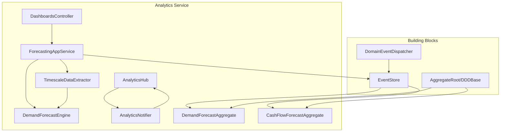
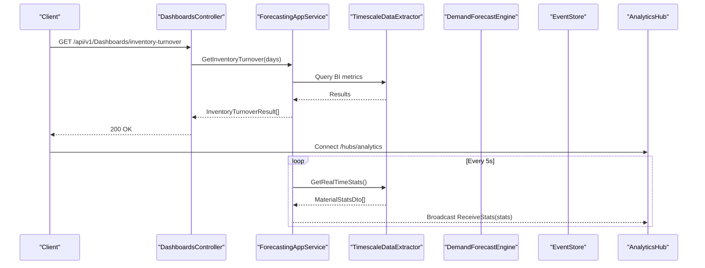
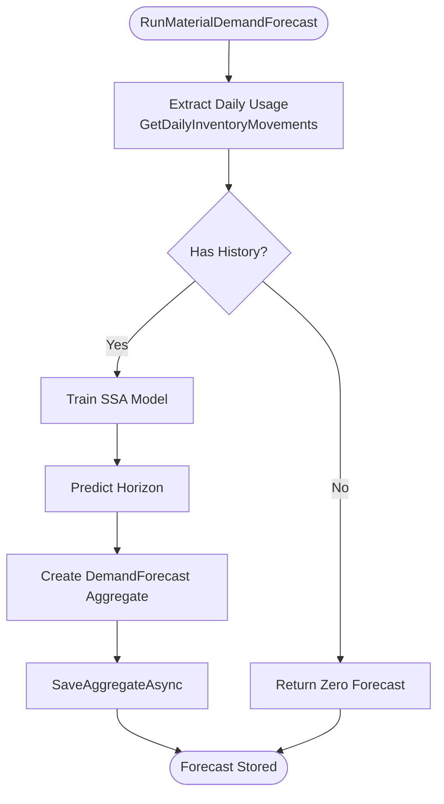
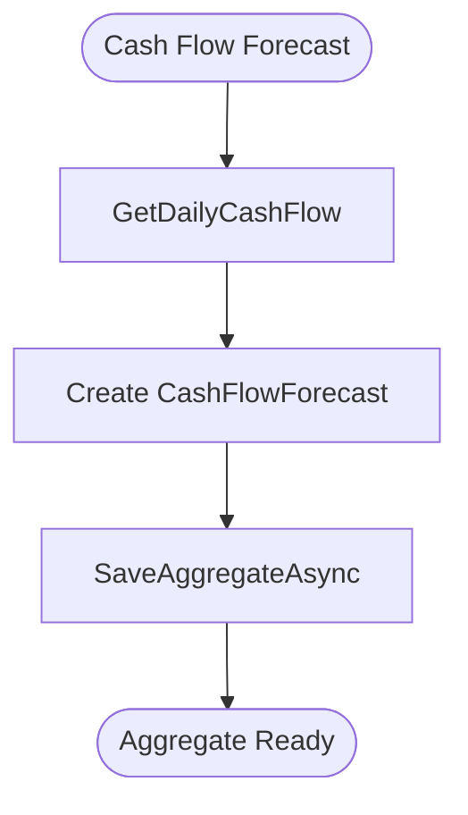
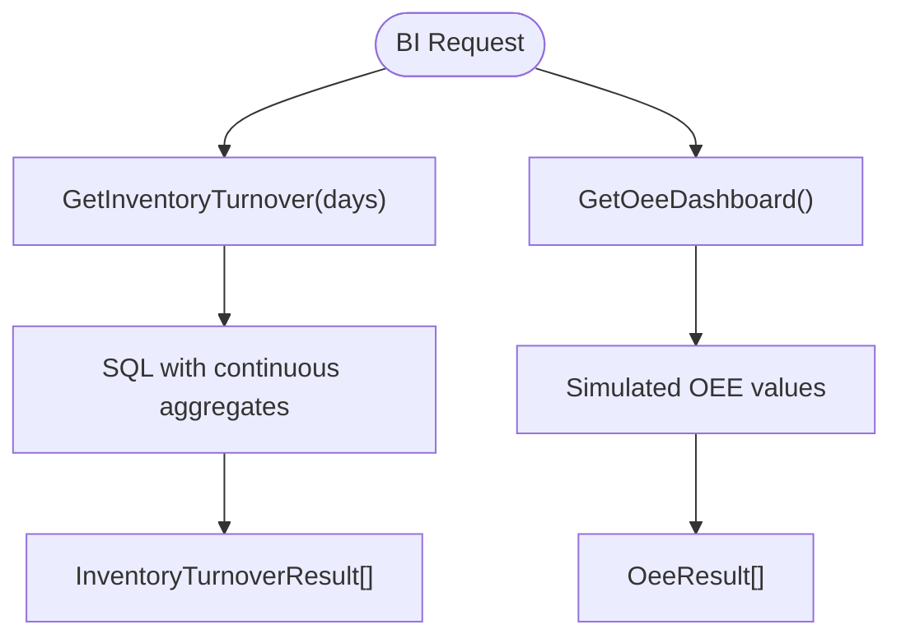
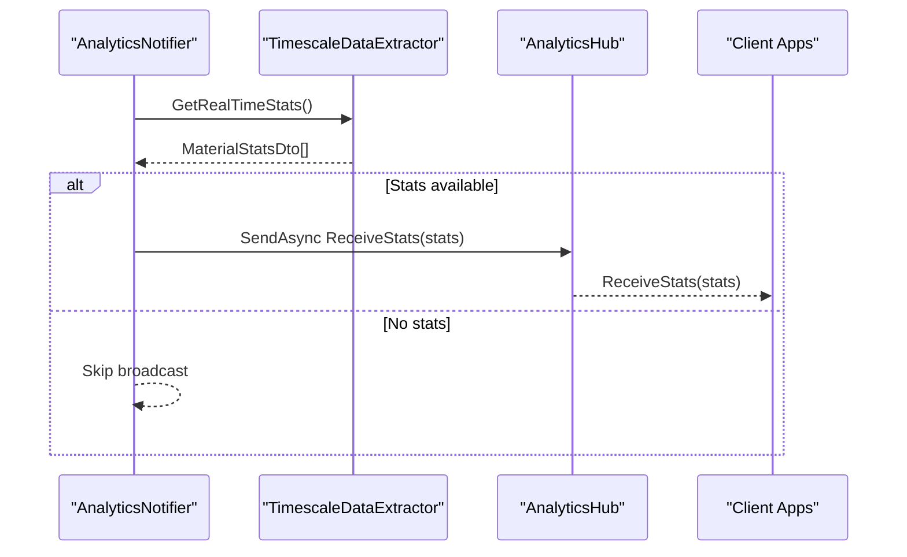
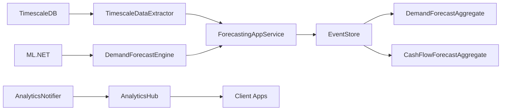

# Advanced Analytics Service

<cite>
**Referenced Files in This Document**
- [Program.cs](file://src/Services/Analytics/ErpSystem.Analytics/Program.cs)
- [appsettings.json](file://src/Services/Analytics/ErpSystem.Analytics/appsettings.json)
- [DashboardsController.cs](file://src/Services/Analytics/ErpSystem.Analytics/API/DashboardsController.cs)
- [AnalyticsHub.cs](file://src/Services/Analytics/ErpSystem.Analytics/API/Hubs/AnalyticsHub.cs)
- [ForecastingAppService.cs](file://src/Services/Analytics/ErpSystem.Analytics/Application/ForecastingAppService.cs)
- [DemandForecastAggregate.cs](file://src/Services/Analytics/ErpSystem.Analytics/Domain/DemandForecastAggregate.cs)
- [CashFlowForecastAggregate.cs](file://src/Services/Analytics/ErpSystem.Analytics/Domain/CashFlowForecastAggregate.cs)
- [DemandForecastEngine.cs](file://src/Services/Analytics/ErpSystem.Analytics/Infrastructure/DemandForecastEngine.cs)
- [TimescaleDataExtractor.cs](file://src/Services/Analytics/ErpSystem.Analytics/Infrastructure/TimescaleDataExtractor.cs)
- [BiAnalyticsService.cs](file://src/Services/Analytics/ErpSystem.Analytics/Infrastructure/BiAnalyticsService.cs)
- [AnalyticsNotifier.cs](file://src/Services/Analytics/ErpSystem.Analytics/Infrastructure/BackgroundJobs/AnalyticsNotifier.cs)
- [DDDBase.cs](file://src/BuildingBlocks/ErpSystem.BuildingBlocks/Domain/DDDBase.cs)
- [DomainEventDispatcher.cs](file://src/BuildingBlocks/ErpSystem.BuildingBlocks/Domain/DomainEventDispatcher.cs)
</cite>

## Table of Contents
1. [Introduction](#introduction)
2. [Project Structure](#project-structure)
3. [Core Components](#core-components)
4. [Architecture Overview](#architecture-overview)
5. [Detailed Component Analysis](#detailed-component-analysis)
6. [Dependency Analysis](#dependency-analysis)
7. [Performance Considerations](#performance-considerations)
8. [Troubleshooting Guide](#troubleshooting-guide)
9. [Conclusion](#conclusion)
10. [Appendices](#appendices)

## Introduction
This document describes the Advanced Analytics service responsible for machine learning-driven demand forecasting, cash flow forecasting, business intelligence dashboards, and real-time analytics delivery via SignalR. It explains how the service integrates with operational systems to extract time-series data from TimescaleDB, trains forecasting models using ML.NET, persists forecasts as event-sourced aggregates, and streams live updates to clients. It also documents API endpoints for dashboards and analytics insights, and outlines model training, validation, and deployment considerations.

## Project Structure
The Analytics service is organized by layers:
- API: HTTP endpoints and SignalR hub for dashboards and live updates
- Application: Orchestration of forecasting workflows
- Domain: Event-sourced aggregates for forecasts and events
- Infrastructure: Data extraction from TimescaleDB, forecasting engines, and background jobs
- Building Blocks: Shared domain infrastructure for event sourcing and event dispatch

**Diagram sources**
- [Program.cs](file://src/Services/Analytics/ErpSystem.Analytics/Program.cs#L11-L65)
- [DashboardsController.cs](file://src/Services/Analytics/ErpSystem.Analytics/API/DashboardsController.cs#L1-L26)
- [AnalyticsHub.cs](file://src/Services/Analytics/ErpSystem.Analytics/API/Hubs/AnalyticsHub.cs#L1-L13)
- [ForecastingAppService.cs](file://src/Services/Analytics/ErpSystem.Analytics/Application/ForecastingAppService.cs#L1-L42)
- [TimescaleDataExtractor.cs](file://src/Services/Analytics/ErpSystem.Analytics/Infrastructure/TimescaleDataExtractor.cs#L1-L142)
- [DemandForecastEngine.cs](file://src/Services/Analytics/ErpSystem.Analytics/Infrastructure/DemandForecastEngine.cs#L1-L62)
- [AnalyticsNotifier.cs](file://src/Services/Analytics/ErpSystem.Analytics/Infrastructure/BackgroundJobs/AnalyticsNotifier.cs#L1-L38)
- [DDDBase.cs](file://src/BuildingBlocks/ErpSystem.BuildingBlocks/Domain/DDDBase.cs#L14-L120)
- [DomainEventDispatcher.cs](file://src/BuildingBlocks/ErpSystem.BuildingBlocks/Domain/DomainEventDispatcher.cs#L17-L62)

**Section sources**
- [Program.cs](file://src/Services/Analytics/ErpSystem.Analytics/Program.cs#L1-L83)
- [appsettings.json](file://src/Services/Analytics/ErpSystem.Analytics/appsettings.json#L1-L12)

## Core Components
- SignalR Hub for real-time analytics broadcasting
- Dashboards controller exposing BI endpoints
- Forecasting application service orchestrating data extraction, ML prediction, and event storage
- Event-sourced aggregates for demand and cash flow forecasts
- ML.NET-based forecasting engine using Singular Spectrum Analysis
- TimescaleDB extractor for time-series and real-time statistics
- Background job for periodic analytics updates

Key responsibilities:
- Demand forecasting: daily inventory usage extraction → SSA forecasting → event-sourced forecast creation
- Cash flow forecasting: daily cash flow extraction → forecast aggregate creation
- BI dashboards: inventory turnover and OEE calculations
- Real-time streaming: periodic stats pull → SignalR broadcast

**Section sources**
- [AnalyticsHub.cs](file://src/Services/Analytics/ErpSystem.Analytics/API/Hubs/AnalyticsHub.cs#L1-L13)
- [DashboardsController.cs](file://src/Services/Analytics/ErpSystem.Analytics/API/DashboardsController.cs#L1-L26)
- [ForecastingAppService.cs](file://src/Services/Analytics/ErpSystem.Analytics/Application/ForecastingAppService.cs#L1-L42)
- [DemandForecastAggregate.cs](file://src/Services/Analytics/ErpSystem.Analytics/Domain/DemandForecastAggregate.cs#L1-L69)
- [CashFlowForecastAggregate.cs](file://src/Services/Analytics/ErpSystem.Analytics/Domain/CashFlowForecastAggregate.cs#L1-L60)
- [DemandForecastEngine.cs](file://src/Services/Analytics/ErpSystem.Analytics/Infrastructure/DemandForecastEngine.cs#L1-L62)
- [TimescaleDataExtractor.cs](file://src/Services/Analytics/ErpSystem.Analytics/Infrastructure/TimescaleDataExtractor.cs#L1-L142)
- [AnalyticsNotifier.cs](file://src/Services/Analytics/ErpSystem.Analytics/Infrastructure/BackgroundJobs/AnalyticsNotifier.cs#L1-L38)

## Architecture Overview
The service follows a clean architecture layered pattern with event sourcing and CQRS-inspired orchestration. Data flows from operational systems into TimescaleDB, then extracted by the Analytics service for ML modeling and BI computations. Forecasts are persisted as event-sourced aggregates and exposed via REST and SignalR.

**Diagram sources**
- [DashboardsController.cs](file://src/Services/Analytics/ErpSystem.Analytics/API/DashboardsController.cs#L10-L24)
- [ForecastingAppService.cs](file://src/Services/Analytics/ErpSystem.Analytics/Application/ForecastingAppService.cs#L18-L40)
- [TimescaleDataExtractor.cs](file://src/Services/Analytics/ErpSystem.Analytics/Infrastructure/TimescaleDataExtractor.cs#L88-L131)
- [AnalyticsNotifier.cs](file://src/Services/Analytics/ErpSystem.Analytics/Infrastructure/BackgroundJobs/AnalyticsNotifier.cs#L12-L36)
- [AnalyticsHub.cs](file://src/Services/Analytics/ErpSystem.Analytics/API/Hubs/AnalyticsHub.cs#L5-L12)

## Detailed Component Analysis

### Demand Forecasting Pipeline
End-to-end workflow:
1. Extract last N days of daily inventory usage from TimescaleDB
2. Train ML.NET SSA forecasting model on the time series
3. Predict M-day horizon and compute confidence
4. Create demand forecast aggregate and persist via event store
5. Publish domain events for downstream consumption

**Diagram sources**
- [ForecastingAppService.cs](file://src/Services/Analytics/ErpSystem.Analytics/Application/ForecastingAppService.cs#L18-L40)
- [TimescaleDataExtractor.cs](file://src/Services/Analytics/ErpSystem.Analytics/Infrastructure/TimescaleDataExtractor.cs#L15-L48)
- [DemandForecastEngine.cs](file://src/Services/Analytics/ErpSystem.Analytics/Infrastructure/DemandForecastEngine.cs#L13-L45)
- [DDDBase.cs](file://src/BuildingBlocks/ErpSystem.BuildingBlocks/Domain/DDDBase.cs#L59-L120)

**Section sources**
- [ForecastingAppService.cs](file://src/Services/Analytics/ErpSystem.Analytics/Application/ForecastingAppService.cs#L1-L42)
- [DemandForecastEngine.cs](file://src/Services/Analytics/ErpSystem.Analytics/Infrastructure/DemandForecastEngine.cs#L1-L62)
- [TimescaleDataExtractor.cs](file://src/Services/Analytics/ErpSystem.Analytics/Infrastructure/TimescaleDataExtractor.cs#L1-L142)
- [DemandForecastAggregate.cs](file://src/Services/Analytics/ErpSystem.Analytics/Domain/DemandForecastAggregate.cs#L1-L69)
- [DDDBase.cs](file://src/BuildingBlocks/ErpSystem.BuildingBlocks/Domain/DDDBase.cs#L14-L120)

### Cash Flow Forecasting
- Extracts daily cash flow from TimescaleDB
- Creates a cash flow forecast aggregate with inflow/outflow predictions
- Exposes net position calculation

**Diagram sources**
- [TimescaleDataExtractor.cs](file://src/Services/Analytics/ErpSystem.Analytics/Infrastructure/TimescaleDataExtractor.cs#L53-L83)
- [CashFlowForecastAggregate.cs](file://src/Services/Analytics/ErpSystem.Analytics/Domain/CashFlowForecastAggregate.cs#L16-L46)

**Section sources**
- [TimescaleDataExtractor.cs](file://src/Services/Analytics/ErpSystem.Analytics/Infrastructure/TimescaleDataExtractor.cs#L53-L83)
- [CashFlowForecastAggregate.cs](file://src/Services/Analytics/ErpSystem.Analytics/Domain/CashFlowForecastAggregate.cs#L1-L60)

### Business Intelligence Dashboards
- Inventory turnover: COGS divided by average inventory value over a configurable period
- OEE dashboard: simulated availability, performance, quality, and total OEE

**Diagram sources**
- [BiAnalyticsService.cs](file://src/Services/Analytics/ErpSystem.Analytics/Infrastructure/BiAnalyticsService.cs#L16-L87)
- [DashboardsController.cs](file://src/Services/Analytics/ErpSystem.Analytics/API/DashboardsController.cs#L10-L24)

**Section sources**
- [BiAnalyticsService.cs](file://src/Services/Analytics/ErpSystem.Analytics/Infrastructure/BiAnalyticsService.cs#L1-L93)
- [DashboardsController.cs](file://src/Services/Analytics/ErpSystem.Analytics/API/DashboardsController.cs#L1-L26)

### Real-Time Dashboard Architecture with SignalR
- Background job periodically fetches real-time stats from TimescaleDB
- Broadcasts updates to connected clients via SignalR hub
- Clients receive live updates for executive dashboards

**Diagram sources**
- [AnalyticsNotifier.cs](file://src/Services/Analytics/ErpSystem.Analytics/Infrastructure/BackgroundJobs/AnalyticsNotifier.cs#L12-L36)
- [TimescaleDataExtractor.cs](file://src/Services/Analytics/ErpSystem.Analytics/Infrastructure/TimescaleDataExtractor.cs#L88-L131)
- [AnalyticsHub.cs](file://src/Services/Analytics/ErpSystem.Analytics/API/Hubs/AnalyticsHub.cs#L5-L12)

**Section sources**
- [AnalyticsNotifier.cs](file://src/Services/Analytics/ErpSystem.Analytics/Infrastructure/BackgroundJobs/AnalyticsNotifier.cs#L1-L38)
- [AnalyticsHub.cs](file://src/Services/Analytics/ErpSystem.Analytics/API/Hubs/AnalyticsHub.cs#L1-L13)
- [TimescaleDataExtractor.cs](file://src/Services/Analytics/ErpSystem.Analytics/Infrastructure/TimescaleDataExtractor.cs#L88-L131)

### Predictive Maintenance Analytics and Equipment Lifecycle Forecasting
- Current implementation simulates OEE dashboard results for demonstration
- Future extension points:
  - Integrate equipment event logs and failure patterns
  - Build ML models for failure probability and remaining useful life
  - Stream equipment KPIs via SignalR alongside inventory stats

[No sources needed since this section provides conceptual guidance]

### API Endpoints
- GET /api/v1/Dashboards/inventory-turnover?days={n}
  - Returns inventory turnover metrics per material
- GET /api/v1/Dashboards/oee
  - Returns simulated OEE results for equipment
- SignalR Hub: /hubs/analytics
  - Clients receive periodic stats updates via ReceiveStats

Note: Tenant context is currently hardcoded; production deployments should derive tenant from request context.

**Section sources**
- [DashboardsController.cs](file://src/Services/Analytics/ErpSystem.Analytics/API/DashboardsController.cs#L10-L24)
- [Program.cs](file://src/Services/Analytics/ErpSystem.Analytics/Program.cs#L56-L56)

## Dependency Analysis
The Analytics service integrates with TimescaleDB for time-series data, ML.NET for forecasting, and SignalR for real-time updates. Event sourcing ensures immutable audit trails and eventual consistency across services.

**Diagram sources**
- [TimescaleDataExtractor.cs](file://src/Services/Analytics/ErpSystem.Analytics/Infrastructure/TimescaleDataExtractor.cs#L1-L142)
- [DemandForecastEngine.cs](file://src/Services/Analytics/ErpSystem.Analytics/Infrastructure/DemandForecastEngine.cs#L1-L62)
- [ForecastingAppService.cs](file://src/Services/Analytics/ErpSystem.Analytics/Application/ForecastingAppService.cs#L1-L42)
- [DDDBase.cs](file://src/BuildingBlocks/ErpSystem.BuildingBlocks/Domain/DDDBase.cs#L59-L120)
- [AnalyticsNotifier.cs](file://src/Services/Analytics/ErpSystem.Analytics/Infrastructure/BackgroundJobs/AnalyticsNotifier.cs#L1-L38)
- [AnalyticsHub.cs](file://src/Services/Analytics/ErpSystem.Analytics/API/Hubs/AnalyticsHub.cs#L1-L13)

**Section sources**
- [Program.cs](file://src/Services/Analytics/ErpSystem.Analytics/Program.cs#L11-L43)
- [DDDBase.cs](file://src/BuildingBlocks/ErpSystem.BuildingBlocks/Domain/DDDBase.cs#L53-L120)
- [DomainEventDispatcher.cs](file://src/BuildingBlocks/ErpSystem.BuildingBlocks/Domain/DomainEventDispatcher.cs#L17-L62)

## Performance Considerations
- TimescaleDB:
  - Use continuous aggregates and time_bucket for efficient daily rollups
  - Index hypertables on time and material_id for fast filtering
- ML.NET:
  - Tune windowSize and horizon based on data frequency and seasonality
  - Cache trained models if inference frequency is high and data distribution is stable
- SignalR:
  - Batch stats updates and throttle broadcasts to reduce bandwidth
  - Use client-side caching to minimize redundant renders
- Event Sourcing:
  - Keep event payloads compact; avoid storing large arrays in event payloads
  - Use projections for read-side optimizations

[No sources needed since this section provides general guidance]

## Troubleshooting Guide
- Missing AnalyticsConnection:
  - Ensure AnalyticsConnection is configured; otherwise extraction methods will throw
- TimescaleDB Toolkit errors:
  - Some advanced stats rely on TimescaleDB Toolkit; handle exceptions gracefully and fall back to basic queries
- Forecast accuracy:
  - Verify sufficient historical data; empty history returns zero forecasts
- SignalR connectivity:
  - Confirm hub endpoint registration and client connection handshake

**Section sources**
- [TimescaleDataExtractor.cs](file://src/Services/Analytics/ErpSystem.Analytics/Infrastructure/TimescaleDataExtractor.cs#L10-L10)
- [TimescaleDataExtractor.cs](file://src/Services/Analytics/ErpSystem.Analytics/Infrastructure/TimescaleDataExtractor.cs#L123-L128)
- [DemandForecastEngine.cs](file://src/Services/Analytics/ErpSystem.Analytics/Infrastructure/DemandForecastEngine.cs#L15-L15)
- [Program.cs](file://src/Services/Analytics/ErpSystem.Analytics/Program.cs#L56-L56)

## Conclusion
The Advanced Analytics service provides a robust foundation for demand forecasting, cash flow planning, and real-time dashboards. By leveraging TimescaleDB for time-series analytics, ML.NET for forecasting, and SignalR for live updates, it enables data-driven decision-making across the enterprise. Extending the service with predictive maintenance and advanced BI integrations will further strengthen its role in comprehensive business intelligence.

## Appendices

### Model Training, Validation, and Deployment
- Training:
  - Use historical daily usage windows; validate with time-based splits
  - Track metrics like MAE/MSE and confidence intervals
- Validation:
  - Backtest on withheld periods; monitor drift detection
- Deployment:
  - Package ML.NET models with the service or externalize model management
  - Use feature flags to toggle between models during A/B testing

[No sources needed since this section provides general guidance]