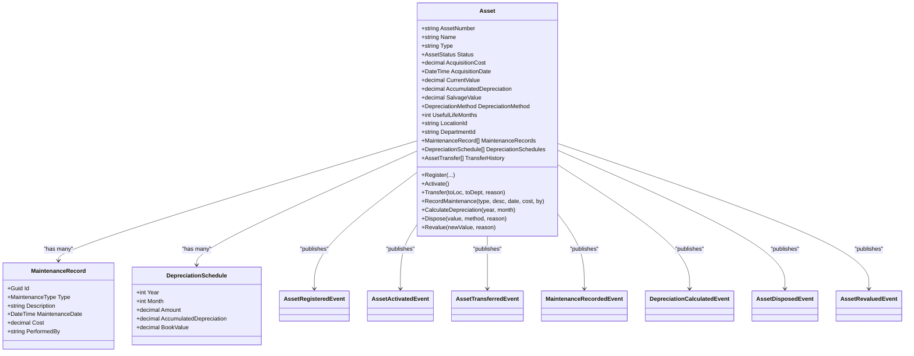

# Asset Management Service

<cite>
**Referenced Files in This Document**
- [Program.cs](file://src/Services/Assets/ErpSystem.Assets/Program.cs)
- [AssetsControllers.cs](file://src/Services/Assets/ErpSystem.Assets/API/AssetsControllers.cs)
- [AssetAggregate.cs](file://src/Services/Assets/ErpSystem.Assets/Domains/AssetAggregate.cs)
- [Persistence.cs](file://src/Services/Assets/ErpSystem.Assets/Infrastructure/Persistence.cs)
- [Projections.cs](file://src/Services/Assets/ErpSystem.Assets/Infrastructure/Projections.cs)
- [appsettings.json](file://src/Services/Assets/ErpSystem.Assets/appsettings.json)
- [DomainEventDispatcher.cs](file://src/BuildingBlocks/ErpSystem.BuildingBlocks/Domain/DomainEventDispatcher.cs)
- [DaprEventBus.cs](file://src/BuildingBlocks/ErpSystem.BuildingBlocks/EventBus/DaprEventBus.cs)
- [MaintenancePlanAggregate.cs](file://src/Services/Maintenance/ErpSystem.Maintenance/Domain/MaintenancePlanAggregate.cs)
- [IntegrationEventHandlers.cs](file://src/Services/Inventory/ErpSystem.Inventory/Application/IntegrationEventHandlers.cs)
- [InventoryEvents.cs](file://src/Services/Inventory/ErpSystem.Inventory/Domain/InventoryEvents.cs)
- [GLProjections.cs](file://src/Services/Finance/ErpSystem.Finance/Infrastructure/GLProjections.cs)
- [AccountAggregate.cs](file://src/Services/Finance/ErpSystem.Finance/Domain/AccountAggregate.cs)
- [values.yaml](file://deploy/helm/erp-system/values.yaml)
- [finance.yaml](file://deploy/k8s/services/finance.yaml)
- [inventory.yaml](file://deploy/k8s/services/inventory.yaml)
</cite>

## Table of Contents
1. [Introduction](#introduction)
2. [Project Structure](#project-structure)
3. [Core Components](#core-components)
4. [Architecture Overview](#architecture-overview)
5. [Detailed Component Analysis](#detailed-component-analysis)
6. [Dependency Analysis](#dependency-analysis)
7. [Performance Considerations](#performance-considerations)
8. [Troubleshooting Guide](#troubleshooting-guide)
9. [Conclusion](#conclusion)
10. [Appendices](#appendices)

## Introduction
This document provides comprehensive documentation for the Asset Management service, covering the complete asset lifecycle: registration, activation, tracking, depreciation, maintenance, and disposal. It explains the APIs, domain model, projections, and integration patterns with Finance, Maintenance, and Inventory services. It also outlines analytics and reporting capabilities for asset valuation, utilization, and compliance.

## Project Structure
The Asset Management service is implemented as a microservice using .NET with CQRS and event sourcing. It exposes REST APIs for asset operations, persists events in PostgreSQL, and projects read models for efficient querying. It integrates with Dapr for event bus and uses building blocks for domain events, outbox, and resilience.

**Diagram sources**
- [Program.cs](file://src/Services/Assets/ErpSystem.Assets/Program.cs#L1-L45)
- [AssetsControllers.cs](file://src/Services/Assets/ErpSystem.Assets/API/AssetsControllers.cs#L1-L250)
- [AssetAggregate.cs](file://src/Services/Assets/ErpSystem.Assets/Domains/AssetAggregate.cs#L1-L357)
- [Persistence.cs](file://src/Services/Assets/ErpSystem.Assets/Infrastructure/Persistence.cs#L1-L125)
- [Projections.cs](file://src/Services/Assets/ErpSystem.Assets/Infrastructure/Projections.cs#L1-L141)
- [DomainEventDispatcher.cs](file://src/BuildingBlocks/ErpSystem.BuildingBlocks/Domain/DomainEventDispatcher.cs#L1-L72)
- [DaprEventBus.cs](file://src/BuildingBlocks/ErpSystem.BuildingBlocks/EventBus/DaprEventBus.cs#L1-L31)

**Section sources**
- [Program.cs](file://src/Services/Assets/ErpSystem.Assets/Program.cs#L1-L45)
- [appsettings.json](file://src/Services/Assets/ErpSystem.Assets/appsettings.json#L1-L12)

## Core Components
- REST API surface for asset lifecycle operations and analytics
- Asset aggregate with strongly typed enums and domain events
- Event-sourced write model with projections to relational read models
- Integration with Dapr pub/sub for cross-service communication
- Finance integration via GL projections and accounting events
- Maintenance integration via maintenance plans and inventory reservations

**Section sources**
- [AssetsControllers.cs](file://src/Services/Assets/ErpSystem.Assets/API/AssetsControllers.cs#L1-L250)
- [AssetAggregate.cs](file://src/Services/Assets/ErpSystem.Assets/Domains/AssetAggregate.cs#L1-L357)
- [Persistence.cs](file://src/Services/Assets/ErpSystem.Assets/Infrastructure/Persistence.cs#L1-L125)
- [Projections.cs](file://src/Services/Assets/ErpSystem.Assets/Infrastructure/Projections.cs#L1-L141)
- [DaprEventBus.cs](file://src/BuildingBlocks/ErpSystem.BuildingBlocks/EventBus/DaprEventBus.cs#L1-L31)

## Architecture Overview
The service follows CQRS with event sourcing:
- Controllers accept commands and apply domain events to the aggregate
- Domain events are persisted and dispatched via an interceptor
- Projection handlers update read-side tables for queries and dashboards
- Dapr pub/sub publishes domain events to subscribers (e.g., Finance, Maintenance, Inventory)

**Diagram sources**
- [AssetsControllers.cs](file://src/Services/Assets/ErpSystem.Assets/API/AssetsControllers.cs#L35-L56)
- [AssetAggregate.cs](file://src/Services/Assets/ErpSystem.Assets/Domains/AssetAggregate.cs#L221-L240)
- [Persistence.cs](file://src/Services/Assets/ErpSystem.Assets/Infrastructure/Persistence.cs#L8-L20)
- [Projections.cs](file://src/Services/Assets/ErpSystem.Assets/Infrastructure/Projections.cs#L15-L42)

## Detailed Component Analysis

### Asset Lifecycle API Surface
- Asset Registration: POST /api/v1/assets with acquisition details, category, and depreciation parameters
- Activation: POST /api/v1/assets/{id}/activate
- Location/Department Transfer: POST /api/v1/assets/{id}/transfer
- Maintenance Recording: POST /api/v1/assets/{id}/maintenance
- Depreciation Calculation: POST /api/v1/assets/{id}/depreciate
- Disposal: POST /api/v1/assets/{id}/dispose
- Statistics: GET /api/v1/assets/statistics
- Maintenance Records: GET /api/v1/assets/maintenance
- Maintenance Schedule: GET /api/v1/assets/maintenance/schedule
- Depreciation Records: GET /api/v1/assets/depreciation
- Yearly Summary: GET /api/v1/assets/depreciation/summary/{year}
- Batch Depreciation: POST /api/v1/assets/depreciation/run-batch

**Diagram sources**
- [AssetsControllers.cs](file://src/Services/Assets/ErpSystem.Assets/API/AssetsControllers.cs#L13-L223)

**Section sources**
- [AssetsControllers.cs](file://src/Services/Assets/ErpSystem.Assets/API/AssetsControllers.cs#L1-L250)

### Asset Aggregate and Domain Model
The Asset aggregate encapsulates:
- Identity, categorization, and status
- Financials: acquisition cost, date, salvage value, book value, accumulated depreciation
- Depreciation schedule and method
- Location, department, and assigned user
- Maintenance and transfer histories
- Domain events for lifecycle changes

**Diagram sources**
- [AssetAggregate.cs](file://src/Services/Assets/ErpSystem.Assets/Domains/AssetAggregate.cs#L179-L357)

**Section sources**
- [AssetAggregate.cs](file://src/Services/Assets/ErpSystem.Assets/Domains/AssetAggregate.cs#L1-L357)

### Event Sourcing and Projections
- Event Store persists events per aggregate version
- Read DB stores denormalized read models for fast queries
- Projection handlers react to domain events and update read models atomically

**Diagram sources**
- [Persistence.cs](file://src/Services/Assets/ErpSystem.Assets/Infrastructure/Persistence.cs#L8-L57)
- [Projections.cs](file://src/Services/Assets/ErpSystem.Assets/Infrastructure/Projections.cs#L15-L139)

**Section sources**
- [Persistence.cs](file://src/Services/Assets/ErpSystem.Assets/Infrastructure/Persistence.cs#L1-L125)
- [Projections.cs](file://src/Services/Assets/ErpSystem.Assets/Infrastructure/Projections.cs#L1-L141)

### Finance Integration
- Asset lifecycle events are published via Dapr pub/sub
- Finance service subscribes to these events and updates GL accounts and financial periods
- Integration ensures asset valuation aligns with accounting standards

**Diagram sources**
- [DaprEventBus.cs](file://src/BuildingBlocks/ErpSystem.BuildingBlocks/EventBus/DaprEventBus.cs#L11-L21)
- [GLProjections.cs](file://src/Services/Finance/ErpSystem.Finance/Infrastructure/GLProjections.cs#L18-L34)

**Section sources**
- [DaprEventBus.cs](file://src/BuildingBlocks/ErpSystem.BuildingBlocks/EventBus/DaprEventBus.cs#L1-L31)
- [GLProjections.cs](file://src/Services/Finance/ErpSystem.Finance/Infrastructure/GLProjections.cs#L1-L42)
- [AccountAggregate.cs](file://src/Services/Finance/ErpSystem.Finance/Domain/AccountAggregate.cs#L1-L49)

### Maintenance Integration
- Maintenance plans define recurring schedules for equipment
- Asset maintenance records track costs and performed-by details
- Integration with Inventory for spare parts reservations and adjustments

**Diagram sources**
- [MaintenancePlanAggregate.cs](file://src/Services/Maintenance/ErpSystem.Maintenance/Domain/MaintenancePlanAggregate.cs#L8-L72)
- [IntegrationEventHandlers.cs](file://src/Services/Inventory/ErpSystem.Inventory/Application/IntegrationEventHandlers.cs#L14-L32)
- [InventoryEvents.cs](file://src/Services/Inventory/ErpSystem.Inventory/Domain/InventoryEvents.cs#L3-L12)

**Section sources**
- [MaintenancePlanAggregate.cs](file://src/Services/Maintenance/ErpSystem.Maintenance/Domain/MaintenancePlanAggregate.cs#L1-L72)
- [IntegrationEventHandlers.cs](file://src/Services/Inventory/ErpSystem.Inventory/Application/IntegrationEventHandlers.cs#L1-L39)
- [InventoryEvents.cs](file://src/Services/Inventory/ErpSystem.Inventory/Domain/InventoryEvents.cs#L1-L12)

### Asset Analytics and Reporting
- Asset statistics endpoint aggregates counts and values by type/status
- Depreciation summary endpoint provides monthly roll-ups
- Reporting and Analytics services consume read models for dashboards and forecasts

**Diagram sources**
- [AssetsControllers.cs](file://src/Services/Assets/ErpSystem.Assets/API/AssetsControllers.cs#L120-L136)
- [AssetsControllers.cs](file://src/Services/Assets/ErpSystem.Assets/API/AssetsControllers.cs#L195-L211)

**Section sources**
- [AssetsControllers.cs](file://src/Services/Assets/ErpSystem.Assets/API/AssetsControllers.cs#L120-L223)

## Dependency Analysis
- Internal dependencies: Assets service depends on building blocks for domain events and Dapr pub/sub
- External dependencies: Finance, Maintenance, and Inventory services via Dapr pub/sub
- Infrastructure: PostgreSQL for event and read stores; Helm/Kubernetes for deployment

**Diagram sources**
- [Program.cs](file://src/Services/Assets/ErpSystem.Assets/Program.cs#L1-L45)
- [values.yaml](file://deploy/helm/erp-system/values.yaml#L1-L127)
- [finance.yaml](file://deploy/k8s/services/finance.yaml#L1-L66)
- [inventory.yaml](file://deploy/k8s/services/inventory.yaml#L1-L66)

**Section sources**
- [Program.cs](file://src/Services/Assets/ErpSystem.Assets/Program.cs#L1-L45)
- [values.yaml](file://deploy/helm/erp-system/values.yaml#L1-L127)
- [finance.yaml](file://deploy/k8s/services/finance.yaml#L1-L66)
- [inventory.yaml](file://deploy/k8s/services/inventory.yaml#L1-L66)

## Performance Considerations
- Use indexed columns on read models for filtering and sorting (type, status, location, dates)
- Batch operations for depreciation can be scheduled and executed asynchronously
- Projection handlers should minimize round-trips and batch writes
- Caching read model results for frequently accessed endpoints (statistics, summaries)

## Troubleshooting Guide
- Domain event dispatch: Ensure the EF interceptor is registered so events are published after save
- Event delivery: Verify Dapr pub/sub configuration and topic names match event types
- Read model lag: Monitor projection handler throughput and adjust concurrency or partitioning
- Finance alignment: Confirm Finance service subscriptions and event handlers are active

**Section sources**
- [DomainEventDispatcher.cs](file://src/BuildingBlocks/ErpSystem.BuildingBlocks/Domain/DomainEventDispatcher.cs#L17-L62)
- [DaprEventBus.cs](file://src/BuildingBlocks/ErpSystem.BuildingBlocks/EventBus/DaprEventBus.cs#L11-L21)

## Conclusion
The Asset Management service provides a robust, event-driven foundation for end-to-end asset lifecycle management. Its APIs support registration, tracking, depreciation, maintenance, and disposal, while integrations with Finance, Maintenance, and Inventory ensure accurate accounting, preventive care, and spare parts management. The read-model projections enable efficient analytics and reporting for compliance and decision-making.

## Appendices

### API Endpoints Summary
- Assets
  - GET /api/v1/assets
  - GET /api/v1/assets/{id}
  - POST /api/v1/assets
  - POST /api/v1/assets/{id}/activate
  - POST /api/v1/assets/{id}/transfer
  - POST /api/v1/assets/{id}/maintenance
  - POST /api/v1/assets/{id}/depreciate
  - POST /api/v1/assets/{id}/dispose
  - GET /api/v1/assets/statistics
- Maintenance
  - GET /api/v1/assets/maintenance
  - GET /api/v1/assets/maintenance/schedule
- Depreciation
  - GET /api/v1/assets/depreciation
  - GET /api/v1/assets/depreciation/summary/{year}
  - POST /api/v1/assets/depreciation/run-batch

**Section sources**
- [AssetsControllers.cs](file://src/Services/Assets/ErpSystem.Assets/API/AssetsControllers.cs#L13-L223)