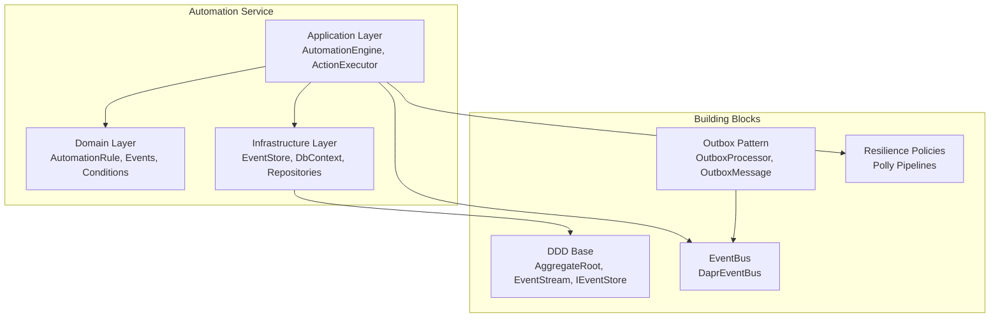
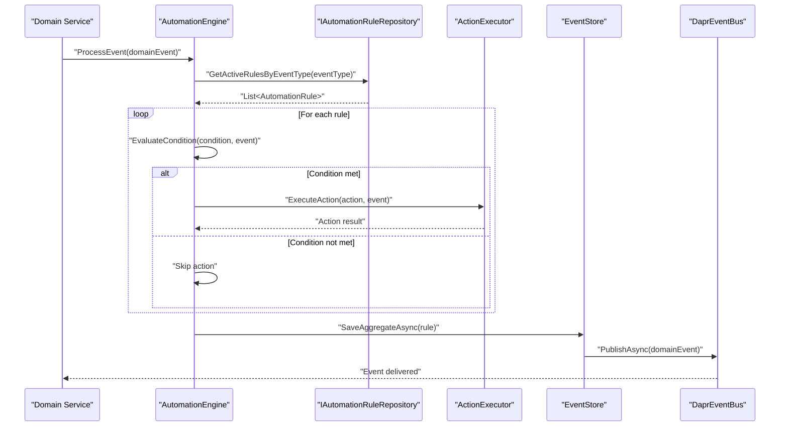
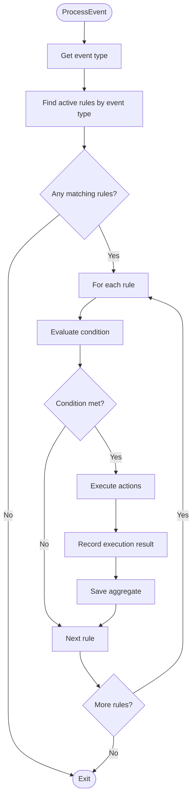
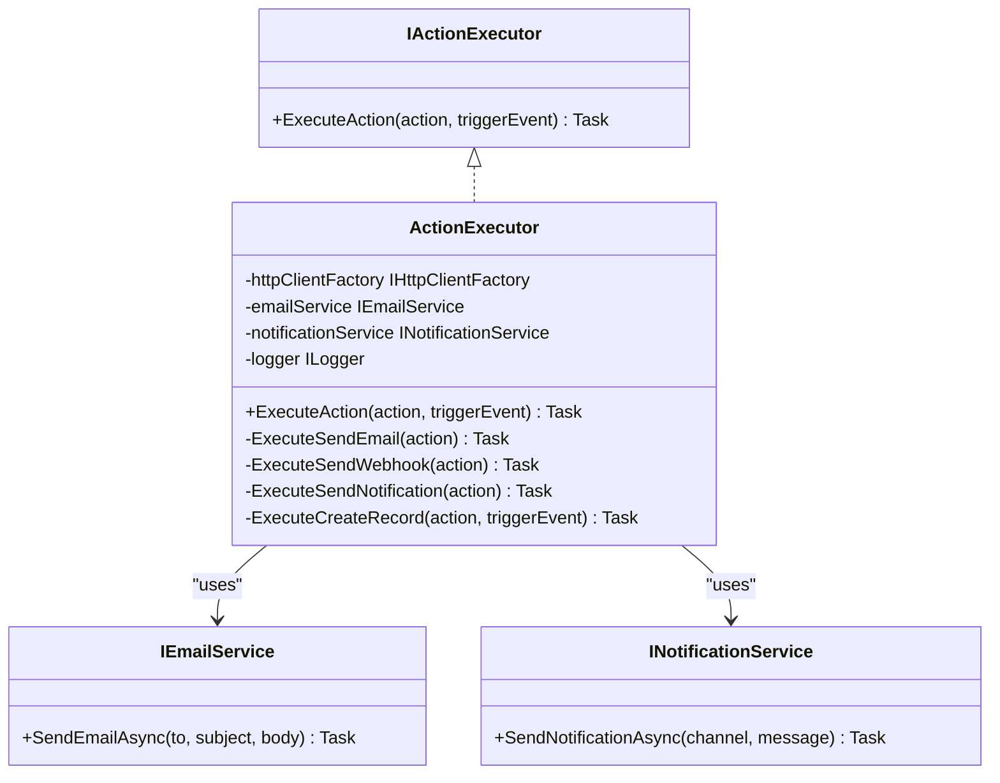
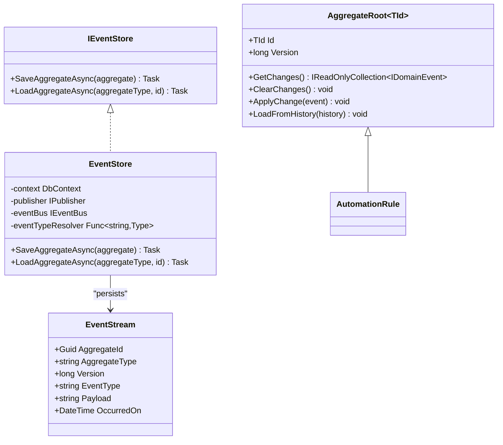
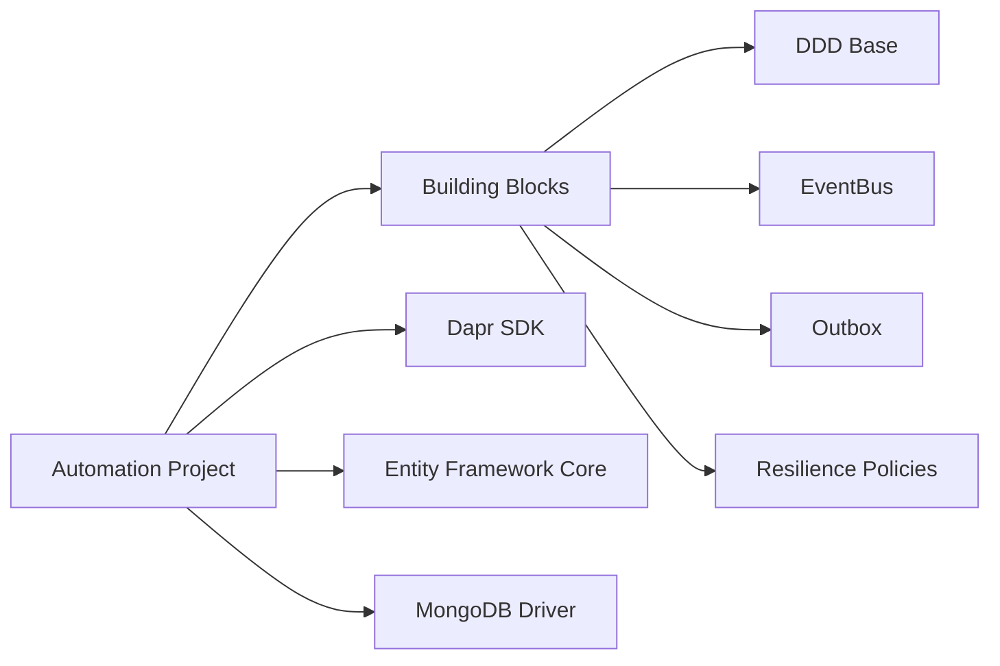

# Business Automation Service

<cite>
**Referenced Files in This Document**
- [Program.cs](file://src/Services/Automation/ErpSystem.Automation/Program.cs)
- [appsettings.json](file://src/Services/Automation/ErpSystem.Automation/appsettings.json)
- [ErpSystem.Automation.csproj](file://src/Services/Automation/ErpSystem.Automation/ErpSystem.Automation.csproj)
- [AutomationEngine.cs](file://src/Services/Automation/ErpSystem.Automation/Application/AutomationEngine.cs)
- [AutomationRuleAggregate.cs](file://src/Services/Automation/ErpSystem.Automation/Domain/AutomationRuleAggregate.cs)
- [DDDBase.cs](file://src/BuildingBlocks/ErpSystem.BuildingBlocks/Domain/DDDBase.cs)
- [DaprEventBus.cs](file://src/BuildingBlocks/ErpSystem.BuildingBlocks/EventBus/DaprEventBus.cs)
- [OutboxProcessor.cs](file://src/BuildingBlocks/ErpSystem.BuildingBlocks/Outbox/OutboxProcessor.cs)
- [OutboxMessage.cs](file://src/BuildingBlocks/ErpSystem.BuildingBlocks/Outbox/OutboxMessage.cs)
- [ResiliencePolicies.cs](file://src/BuildingBlocks/ErpSystem.BuildingBlocks/Resilience/ResiliencePolicies.cs)
- [Program.cs](file://src/Services/Automation/AutomationTest/Program.cs)
- [appsettings.json](file://src/Gateways/ErpSystem.Gateway/appsettings.json)
</cite>

## Table of Contents
1. [Introduction](#introduction)
2. [Project Structure](#project-structure)
3. [Core Components](#core-components)
4. [Architecture Overview](#architecture-overview)
5. [Detailed Component Analysis](#detailed-component-analysis)
6. [Dependency Analysis](#dependency-analysis)
7. [Performance Considerations](#performance-considerations)
8. [Troubleshooting Guide](#troubleshooting-guide)
9. [Conclusion](#conclusion)
10. [Appendices](#appendices)

## Introduction
The Business Automation service orchestrates workflow automation and business rule processing across the ERP ecosystem. It listens to domain events, evaluates configurable automation rules with conditions, and executes actions such as sending emails, webhooks, notifications, and creating/updating records. The service leverages event sourcing, Dapr-based event bus integration, and resilient HTTP clients to enable reliable inter-service communication and data synchronization.

## Project Structure
The Automation service is organized into three primary layers:
- Application: Contains the automation engine and action executor that evaluate rules and perform actions.
- Domain: Defines the automation rule aggregate, triggers, actions, and domain events for change management.
- Infrastructure: Provides the event store, database context, and repository abstractions for persistence and event streaming.



**Diagram sources**
- [Program.cs](file://src/Services/Automation/ErpSystem.Automation/Program.cs#L11-L69)
- [AutomationEngine.cs](file://src/Services/Automation/ErpSystem.Automation/Application/AutomationEngine.cs#L10-L120)
- [AutomationRuleAggregate.cs](file://src/Services/Automation/ErpSystem.Automation/Domain/AutomationRuleAggregate.cs#L8-L111)
- [DDDBase.cs](file://src/BuildingBlocks/ErpSystem.BuildingBlocks/Domain/DDDBase.cs#L14-L120)
- [DaprEventBus.cs](file://src/BuildingBlocks/ErpSystem.BuildingBlocks/EventBus/DaprEventBus.cs#L11-L21)
- [OutboxProcessor.cs](file://src/BuildingBlocks/ErpSystem.BuildingBlocks/Outbox/OutboxProcessor.cs#L8-L71)
- [OutboxMessage.cs](file://src/BuildingBlocks/ErpSystem.BuildingBlocks/Outbox/OutboxMessage.cs#L10-L55)

**Section sources**
- [Program.cs](file://src/Services/Automation/ErpSystem.Automation/Program.cs#L1-L120)
- [ErpSystem.Automation.csproj](file://src/Services/Automation/ErpSystem.Automation/ErpSystem.Automation.csproj#L1-L22)

## Core Components
- Automation Engine: Listens to domain events, finds matching active rules, evaluates conditions, and executes actions. Records execution outcomes and persists state via the event store.
- Action Executor: Implements action execution for supported types (email, webhook, notification, create/update record) with logging and error handling.
- Automation Rule Aggregate: Encapsulates rule metadata, actions, activation state, and execution metrics. Emits domain events for lifecycle changes.
- Event Store: Persists event streams, publishes domain events to both internal publishers and the Dapr event bus, and supports aggregate loading from history.
- Event Bus: Dapr-backed publish mechanism for decoupled inter-service messaging.
- Outbox Processor: Asynchronous dispatcher for outbox messages to ensure reliable delivery.
- Resilience Policies: Configurable retry, circuit breaker, and timeout policies for HTTP operations.

**Section sources**
- [AutomationEngine.cs](file://src/Services/Automation/ErpSystem.Automation/Application/AutomationEngine.cs#L10-L120)
- [AutomationRuleAggregate.cs](file://src/Services/Automation/ErpSystem.Automation/Domain/AutomationRuleAggregate.cs#L8-L111)
- [DDDBase.cs](file://src/BuildingBlocks/ErpSystem.BuildingBlocks/Domain/DDDBase.cs#L53-L120)
- [DaprEventBus.cs](file://src/BuildingBlocks/ErpSystem.BuildingBlocks/EventBus/DaprEventBus.cs#L11-L21)
- [OutboxProcessor.cs](file://src/BuildingBlocks/ErpSystem.BuildingBlocks/Outbox/OutboxProcessor.cs#L8-L71)
- [ResiliencePolicies.cs](file://src/BuildingBlocks/ErpSystem.BuildingBlocks/Resilience/ResiliencePolicies.cs#L13-L110)

## Architecture Overview
The Automation service follows an event-driven architecture:
- Domain events trigger the automation engine.
- The engine loads active rules, evaluates conditions, and executes actions.
- The event store persists changes and publishes events to the Dapr event bus.
- Outbox ensures eventual delivery of events to external subscribers.
- Resilience policies protect outbound HTTP calls.



**Diagram sources**
- [AutomationEngine.cs](file://src/Services/Automation/ErpSystem.Automation/Application/AutomationEngine.cs#L19-L92)
- [DDDBase.cs](file://src/BuildingBlocks/ErpSystem.BuildingBlocks/Domain/DDDBase.cs#L62-L99)
- [DaprEventBus.cs](file://src/BuildingBlocks/ErpSystem.BuildingBlocks/EventBus/DaprEventBus.cs#L15-L20)

## Detailed Component Analysis

### Automation Engine
Responsibilities:
- Process incoming domain events.
- Discover active rules matching the event type.
- Evaluate rule conditions against event data.
- Execute actions sequentially and record execution results.
- Persist rule state and publish domain events.

Key behaviors:
- Condition evaluation supports equality, containment, greater-than, and less-than comparisons for numeric fields.
- Execution failures are logged, rule execution is recorded as unsuccessful, and the aggregate is saved.



**Diagram sources**
- [AutomationEngine.cs](file://src/Services/Automation/ErpSystem.Automation/Application/AutomationEngine.cs#L19-L92)

**Section sources**
- [AutomationEngine.cs](file://src/Services/Automation/ErpSystem.Automation/Application/AutomationEngine.cs#L10-L120)

### Action Executor
Supported action types:
- SendEmail: Sends an email via a placeholder email service.
- SendWebhook: Posts JSON payload to a URL using an HTTP client.
- SendNotification: Dispatches a notification via a notification service.
- CreateRecord/UpdateRecord: Placeholder for command dispatch to other services.
- ExecuteCommand: Placeholder for invoking commands in downstream services.

Implementation highlights:
- Uses IHttpClientFactory for efficient HTTP client management.
- Applies resilience policies for outbound HTTP calls.
- Logs successful and failed executions.



**Diagram sources**
- [AutomationEngine.cs](file://src/Services/Automation/ErpSystem.Automation/Application/AutomationEngine.cs#L125-L203)

**Section sources**
- [AutomationEngine.cs](file://src/Services/Automation/ErpSystem.Automation/Application/AutomationEngine.cs#L125-L203)

### Automation Rule Aggregate
Defines the automation rule entity with:
- Metadata: Name, Description, TriggerEventType, TenantId.
- Activation: IsActive flag with dedicated events for activation/deactivation.
- Actions: Ordered list of actions with unique IDs.
- Condition: Optional trigger condition with field path, operator, and value.
- Execution Metrics: ExecutionCount and LastExecutedAt.
- Domain Events: Creation, action add/remove, activation/deactivation, execution.

```mermaid
classDiagram
class AutomationRule {
+string Name
+string TriggerEventType
+AutomationAction[] Actions
+bool IsActive
+string TenantId
+string Description
+AutomationTriggerCondition? Condition
+int ExecutionCount
+DateTime? LastExecutedAt
+Create(...) AutomationRule
+AddAction(action) void
+RemoveAction(actionId) void
+Activate() void
+Deactivate() void
+RecordExecution(success, errorMessage) void
}
class AutomationTriggerCondition {
+string FieldPath
+string Operator
+string Value
}
class AutomationAction {
+string Id
+AutomationActionType Type
+Dictionary~string,string~ Parameters
}
enum AutomationActionType {
+SendEmail
+SendWebhook
+CreateRecord
+UpdateRecord
+SendNotification
+ExecuteCommand
}
AutomationRule --> AutomationTriggerCondition : "has optional"
AutomationRule --> AutomationAction : "contains"
```

**Diagram sources**
- [AutomationRuleAggregate.cs](file://src/Services/Automation/ErpSystem.Automation/Domain/AutomationRuleAggregate.cs#L8-L137)

**Section sources**
- [AutomationRuleAggregate.cs](file://src/Services/Automation/ErpSystem.Automation/Domain/AutomationRuleAggregate.cs#L8-L196)

### Event Store and Domain Events
The event store:
- Persists event streams with aggregate type, version, event type, and payload.
- Publishes domain events to both internal publishers and the Dapr event bus.
- Loads aggregates from historical event streams.



**Diagram sources**
- [DDDBase.cs](file://src/BuildingBlocks/ErpSystem.BuildingBlocks/Domain/DDDBase.cs#L53-L120)
- [AutomationRuleAggregate.cs](file://src/Services/Automation/ErpSystem.Automation/Domain/AutomationRuleAggregate.cs#L80-L110)

**Section sources**
- [DDDBase.cs](file://src/BuildingBlocks/ErpSystem.BuildingBlocks/Domain/DDDBase.cs#L53-L120)

### Event Bus Integration
- Dapr-backed event publishing with a standardized topic derived from the event type name.
- Supports pluggable event bus implementations (dummy bus for testing).

**Section sources**
- [DaprEventBus.cs](file://src/BuildingBlocks/ErpSystem.BuildingBlocks/EventBus/DaprEventBus.cs#L11-L21)

### Outbox Pattern
- Ensures reliable delivery by persisting messages alongside domain changes.
- Background processor dispatches messages to the event bus with retry and failure tracking.

**Section sources**
- [OutboxProcessor.cs](file://src/BuildingBlocks/ErpSystem.BuildingBlocks/Outbox/OutboxProcessor.cs#L8-L71)
- [OutboxMessage.cs](file://src/BuildingBlocks/ErpSystem.BuildingBlocks/Outbox/OutboxMessage.cs#L10-L55)

### Resilience Policies
- Provides retry, circuit breaker, timeout, and combined resilience pipelines.
- Useful for HTTP-based actions such as webhooks and inter-service calls.

**Section sources**
- [ResiliencePolicies.cs](file://src/BuildingBlocks/ErpSystem.BuildingBlocks/Resilience/ResiliencePolicies.cs#L13-L110)

## Dependency Analysis
The Automation service depends on:
- Building Blocks for DDD base classes, event store, event bus, outbox, and resilience.
- Dapr SDK for event bus integration.
- Entity Framework Core for PostgreSQL-backed event storage.
- MongoDB driver for potential document storage needs.



**Diagram sources**
- [ErpSystem.Automation.csproj](file://src/Services/Automation/ErpSystem.Automation/ErpSystem.Automation.csproj#L9-L19)

**Section sources**
- [ErpSystem.Automation.csproj](file://src/Services/Automation/ErpSystem.Automation/ErpSystem.Automation.csproj#L1-L22)

## Performance Considerations
- Event-driven design minimizes synchronous coupling and enables asynchronous processing.
- Use of event sourcing and outbox ensures eventual consistency and reliable delivery.
- Resilience policies reduce failure impact and improve throughput under transient faults.
- Consider indexing and partitioning strategies for event streams and rule read models to optimize lookup performance.
- Monitor execution counts and last execution timestamps to detect rule drift and performance regressions.

[No sources needed since this section provides general guidance]

## Troubleshooting Guide
Common issues and resolutions:
- Database connectivity: Verify connection strings and ensure the database is created and accessible.
- Event bus publishing: Confirm Dapr pub/sub configuration and topic names align with event types.
- HTTP action failures: Review webhook URLs, payload formatting, and network connectivity; apply resilience policies.
- Rule execution errors: Inspect logs for rule evaluation and action execution failures; check condition field paths and operators.

Operational checks:
- Ensure EnsureCreatedAsync runs during startup to initialize the database.
- Validate that the outbox processor is running and processing messages.
- Confirm that the Automation service routes are exposed via the gateway.

**Section sources**
- [Program.cs](file://src/Services/Automation/ErpSystem.Automation/Program.cs#L62-L69)
- [appsettings.json](file://src/Services/Automation/ErpSystem.Automation/appsettings.json#L9-L17)
- [OutboxProcessor.cs](file://src/BuildingBlocks/ErpSystem.BuildingBlocks/Outbox/OutboxProcessor.cs#L12-L27)
- [Program.cs](file://src/Services/Automation/AutomationTest/Program.cs#L23-L44)
- [appsettings.json](file://src/Gateways/ErpSystem.Gateway/appsettings.json#L65-L70)

## Conclusion
The Business Automation service provides a robust foundation for event-driven automation across the ERP platform. By combining event sourcing, a configurable rule engine, resilient action execution, and Dapr-based event bus integration, it enables scalable workflow automation, approvals, and inter-service synchronization. Extending support for parallel execution, advanced rule conditions, and richer action types will further enhance its capabilities for complex business processes.

[No sources needed since this section summarizes without analyzing specific files]

## Appendices

### API Endpoints and Management Surface
The Automation service exposes a minimal surface area in the current implementation. The primary integration point is the automation engine listening to domain events. For rule management and monitoring, consider adding controller endpoints for:
- CRUD operations on automation rules
- Activation/deactivation controls
- Execution history and metrics retrieval
- Bulk rule operations and validation

These additions would complement the existing event-driven architecture with explicit management APIs.

[No sources needed since this section provides general guidance]