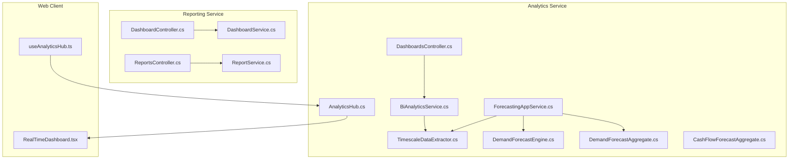
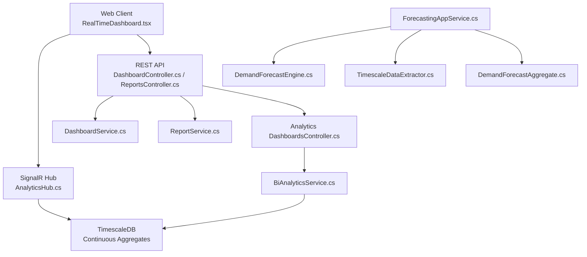
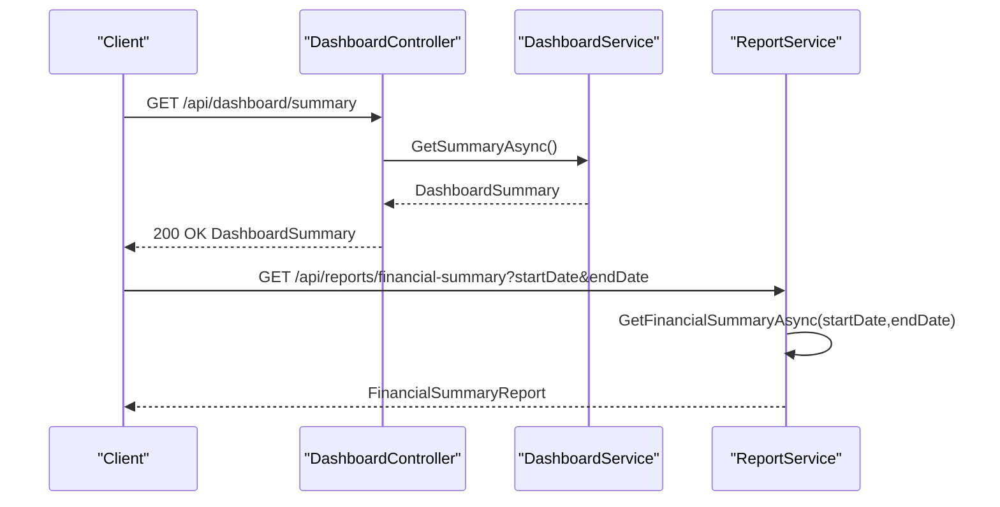
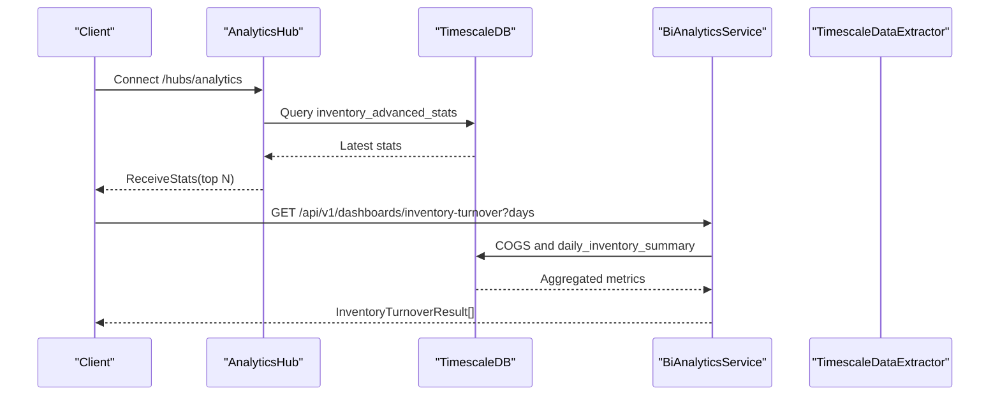
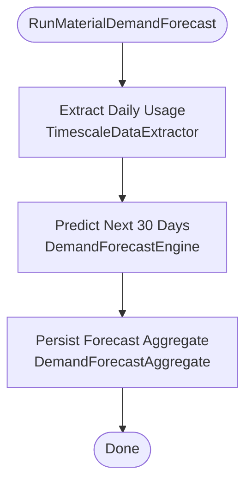
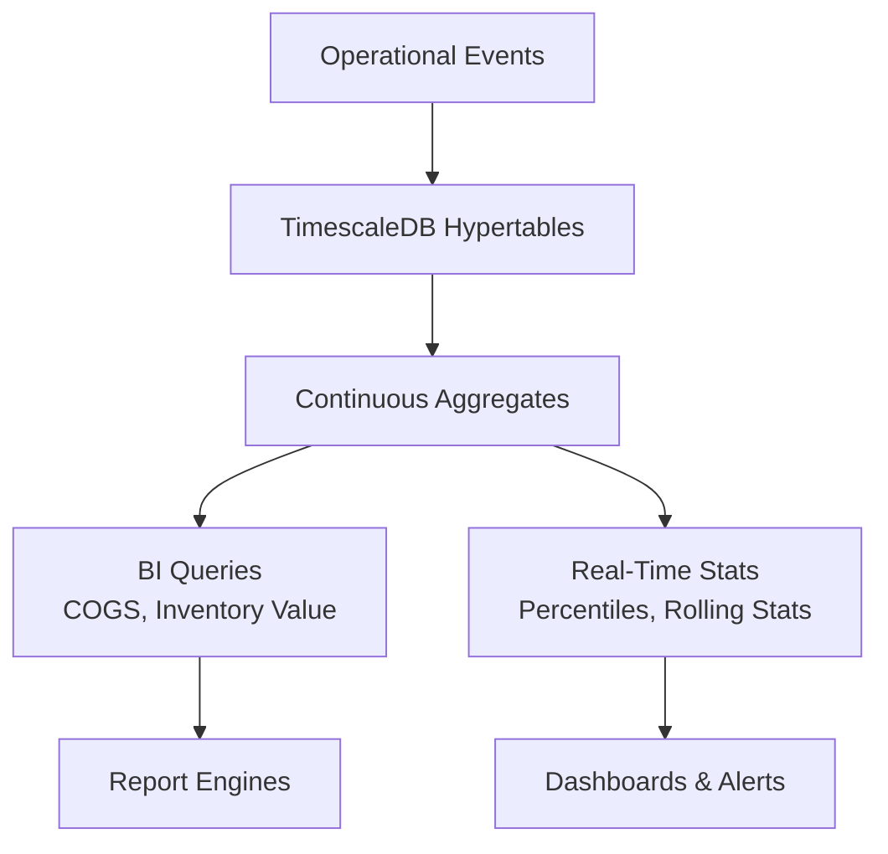
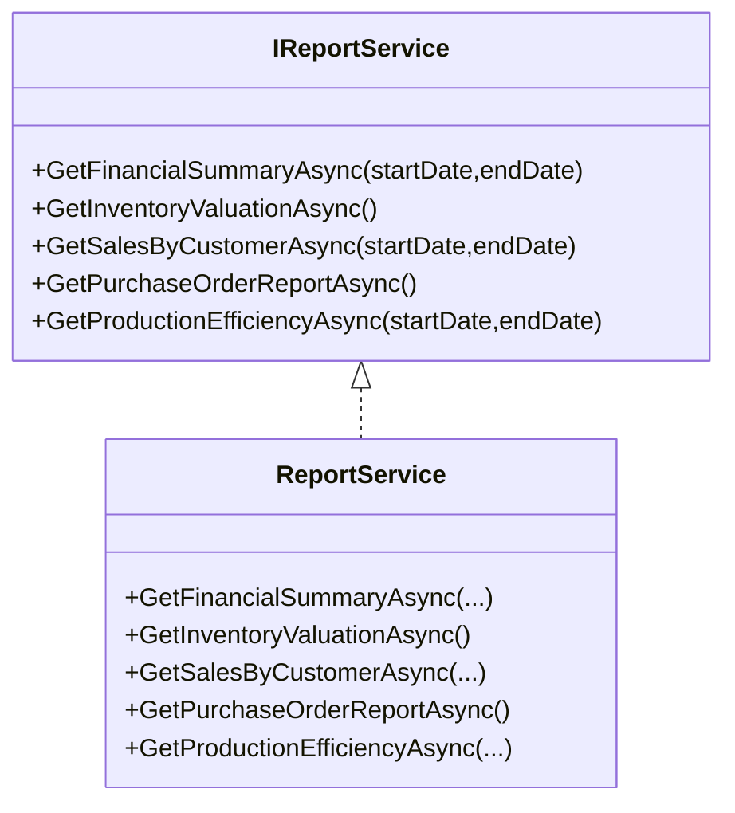
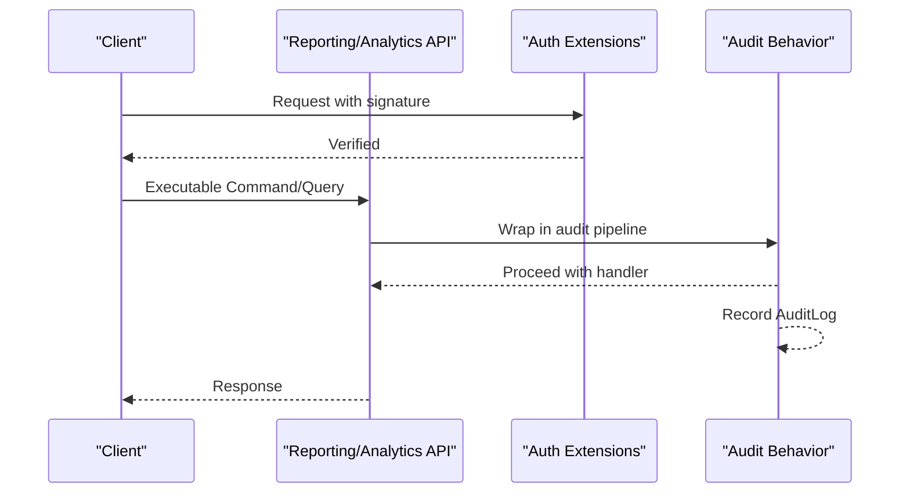
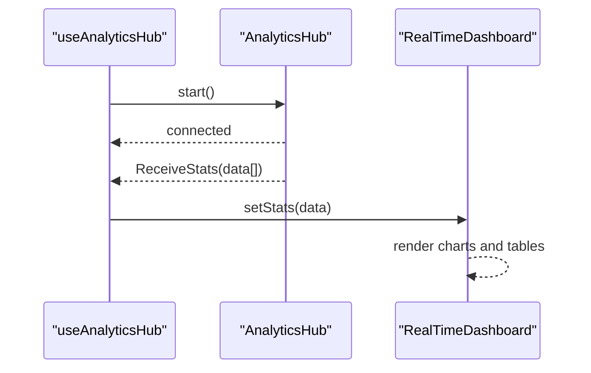
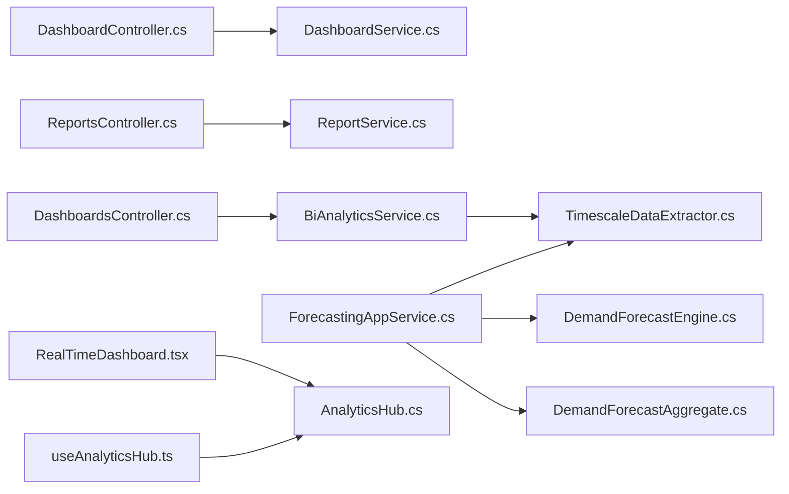

# Business Intelligence and Reporting Service

<cite>
**Referenced Files in This Document**
- [DashboardController.cs](file://src/Services/Reporting/ErpSystem.Reporting/Controllers/DashboardController.cs)
- [ReportsController.cs](file://src/Services/Reporting/ErpSystem.Reporting/Controllers/ReportsController.cs)
- [DashboardService.cs](file://src/Services/Reporting/ErpSystem.Reporting/Application/DashboardService.cs)
- [ReportService.cs](file://src/Services/Reporting/ErpSystem.Reporting/Application/ReportService.cs)
- [DashboardsController.cs](file://src/Services/Analytics/ErpSystem.Analytics/API/DashboardsController.cs)
- [AnalyticsHub.cs](file://src/Services/Analytics/ErpSystem.Analytics/API/Hubs/AnalyticsHub.cs)
- [BiAnalyticsService.cs](file://src/Services/Analytics/ErpSystem.Analytics/Infrastructure/BiAnalyticsService.cs)
- [TimescaleDataExtractor.cs](file://src/Services/Analytics/ErpSystem.Analytics/Infrastructure/TimescaleDataExtractor.cs)
- [DemandForecastEngine.cs](file://src/Services/Analytics/ErpSystem.Analytics/Infrastructure/DemandForecastEngine.cs)
- [ForecastingAppService.cs](file://src/Services/Analytics/ErpSystem.Analytics/Application/ForecastingAppService.cs)
- [DemandForecastAggregate.cs](file://src/Services/Analytics/ErpSystem.Analytics/Domain/DemandForecastAggregate.cs)
- [CashFlowForecastAggregate.cs](file://src/Services/Analytics/ErpSystem.Analytics/Domain/CashFlowForecastAggregate.cs)
- [RealTimeDashboard.tsx](file://src/Web/ErpSystem.Web/src/components/RealTimeDashboard.tsx)
- [useAnalyticsHub.ts](file://src/Web/ErpSystem.Web/src/hooks/useAnalyticsHub.ts)
- [AuditLog.cs](file://src/BuildingBlocks/ErpSystem.BuildingBlocks/Auditing/AuditLog.cs)
- [AuthExtensions.cs](file://src/BuildingBlocks/ErpSystem.BuildingBlocks/Auth/AuthExtensions.cs)
</cite>

## Table of Contents
1. [Introduction](#introduction)
2. [Project Structure](#project-structure)
3. [Core Components](#core-components)
4. [Architecture Overview](#architecture-overview)
5. [Detailed Component Analysis](#detailed-component-analysis)
6. [Dependency Analysis](#dependency-analysis)
7. [Performance Considerations](#performance-considerations)
8. [Troubleshooting Guide](#troubleshooting-guide)
9. [Conclusion](#conclusion)
10. [Appendices](#appendices)

## Introduction
This document describes the Business Intelligence and Reporting service that powers dashboards, KPI tracking, interactive visualizations, and report generation across the ERP ecosystem. It covers:
- Dashboard architecture with customizable widgets and live updates
- KPI tracking and trend visualization
- Report generation for financial summaries, inventory valuations, sales by customer, purchase orders, and production efficiency
- Ad-hoc reporting with parameterized queries and drill-down capabilities
- Scheduled reporting and background analytics
- Data aggregation patterns leveraging TimescaleDB and continuous aggregates
- API endpoints for report execution, dashboard configuration, and data export
- Integration with operational services for comprehensive business insights
- Security, access controls, and audit trails
- Mobile-friendly dashboard design and real-time data refresh

## Project Structure
The BI and Reporting capability spans three primary areas:
- Reporting microservice: exposes REST APIs for dashboards and reports
- Analytics microservice: performs advanced analytics, forecasting, and real-time streaming
- Web client: renders dashboards and real-time charts with SignalR

**Diagram sources**
- [DashboardController.cs](file://src/Services/Reporting/ErpSystem.Reporting/Controllers/DashboardController.cs#L1-L79)
- [ReportsController.cs](file://src/Services/Reporting/ErpSystem.Reporting/Controllers/ReportsController.cs#L1-L136)
- [DashboardService.cs](file://src/Services/Reporting/ErpSystem.Reporting/Application/DashboardService.cs#L1-L93)
- [ReportService.cs](file://src/Services/Reporting/ErpSystem.Reporting/Application/ReportService.cs#L1-L105)
- [DashboardsController.cs](file://src/Services/Analytics/ErpSystem.Analytics/API/DashboardsController.cs#L1-L26)
- [AnalyticsHub.cs](file://src/Services/Analytics/ErpSystem.Analytics/API/Hubs/AnalyticsHub.cs#L1-L13)
- [BiAnalyticsService.cs](file://src/Services/Analytics/ErpSystem.Analytics/Infrastructure/BiAnalyticsService.cs#L1-L93)
- [TimescaleDataExtractor.cs](file://src/Services/Analytics/ErpSystem.Analytics/Infrastructure/TimescaleDataExtractor.cs#L1-L142)
- [DemandForecastEngine.cs](file://src/Services/Analytics/ErpSystem.Analytics/Infrastructure/DemandForecastEngine.cs#L1-L62)
- [ForecastingAppService.cs](file://src/Services/Analytics/ErpSystem.Analytics/Application/ForecastingAppService.cs#L1-L42)
- [DemandForecastAggregate.cs](file://src/Services/Analytics/ErpSystem.Analytics/Domain/DemandForecastAggregate.cs#L1-L69)
- [CashFlowForecastAggregate.cs](file://src/Services/Analytics/ErpSystem.Analytics/Domain/CashFlowForecastAggregate.cs#L1-L60)
- [RealTimeDashboard.tsx](file://src/Web/ErpSystem.Web/src/components/RealTimeDashboard.tsx#L1-L120)
- [useAnalyticsHub.ts](file://src/Web/ErpSystem.Web/src/hooks/useAnalyticsHub.ts#L1-L51)

**Section sources**
- [DashboardController.cs](file://src/Services/Reporting/ErpSystem.Reporting/Controllers/DashboardController.cs#L1-L79)
- [ReportsController.cs](file://src/Services/Reporting/ErpSystem.Reporting/Controllers/ReportsController.cs#L1-L136)
- [DashboardsController.cs](file://src/Services/Analytics/ErpSystem.Analytics/API/DashboardsController.cs#L1-L26)
- [AnalyticsHub.cs](file://src/Services/Analytics/ErpSystem.Analytics/API/Hubs/AnalyticsHub.cs#L1-L13)
- [RealTimeDashboard.tsx](file://src/Web/ErpSystem.Web/src/components/RealTimeDashboard.tsx#L1-L120)
- [useAnalyticsHub.ts](file://src/Web/ErpSystem.Web/src/hooks/useAnalyticsHub.ts#L1-L51)

## Core Components
- DashboardController: Provides endpoints for KPI summary, sales trends, inventory status, top products, and recent activities.
- ReportsController: Provides endpoints for financial summary, inventory valuation, sales by customer, purchase order status, and production efficiency reports.
- DashboardService and ReportService: Implementers of the dashboard/report interfaces; currently return sample data but designed to integrate with operational services and analytics.
- DashboardsController (Analytics): Exposes endpoints for inventory turnover and OEE dashboards backed by TimescaleDB analytics.
- BiAnalyticsService: Performs SQL-driven analytics against continuous aggregates and time-series hypertables.
- TimescaleDataExtractor: Extracts time-series data for forecasting and real-time stats.
- DemandForecastEngine: Uses ML.NET for SSA-based forecasting.
- ForecastingAppService: Orchestrates forecasting runs and persists aggregates.
- AnalyticsHub and RealTimeDashboard: Real-time streaming and visualization via SignalR and React charts.

**Section sources**
- [DashboardController.cs](file://src/Services/Reporting/ErpSystem.Reporting/Controllers/DashboardController.cs#L1-L79)
- [ReportsController.cs](file://src/Services/Reporting/ErpSystem.Reporting/Controllers/ReportsController.cs#L1-L136)
- [DashboardService.cs](file://src/Services/Reporting/ErpSystem.Reporting/Application/DashboardService.cs#L1-L93)
- [ReportService.cs](file://src/Services/Reporting/ErpSystem.Reporting/Application/ReportService.cs#L1-L105)
- [DashboardsController.cs](file://src/Services/Analytics/ErpSystem.Analytics/API/DashboardsController.cs#L1-L26)
- [BiAnalyticsService.cs](file://src/Services/Analytics/ErpSystem.Analytics/Infrastructure/BiAnalyticsService.cs#L1-L93)
- [TimescaleDataExtractor.cs](file://src/Services/Analytics/ErpSystem.Analytics/Infrastructure/TimescaleDataExtractor.cs#L1-L142)
- [DemandForecastEngine.cs](file://src/Services/Analytics/ErpSystem.Analytics/Infrastructure/DemandForecastEngine.cs#L1-L62)
- [ForecastingAppService.cs](file://src/Services/Analytics/ErpSystem.Analytics/Application/ForecastingAppService.cs#L1-L42)
- [AnalyticsHub.cs](file://src/Services/Analytics/ErpSystem.Analytics/API/Hubs/AnalyticsHub.cs#L1-L13)
- [RealTimeDashboard.tsx](file://src/Web/ErpSystem.Web/src/components/RealTimeDashboard.tsx#L1-L120)

## Architecture Overview
The system integrates REST APIs, domain analytics, and real-time streaming:
- REST endpoints in Reporting and Analytics microservices expose dashboards and reports.
- TimescaleDB stores time-series and continuous aggregates for efficient analytics.
- SignalR streams real-time stats to the web client.
- Forecasting orchestrator coordinates extraction, prediction, and persistence.

**Diagram sources**
- [DashboardController.cs](file://src/Services/Reporting/ErpSystem.Reporting/Controllers/DashboardController.cs#L1-L79)
- [ReportsController.cs](file://src/Services/Reporting/ErpSystem.Reporting/Controllers/ReportsController.cs#L1-L136)
- [DashboardService.cs](file://src/Services/Reporting/ErpSystem.Reporting/Application/DashboardService.cs#L1-L93)
- [ReportService.cs](file://src/Services/Reporting/ErpSystem.Reporting/Application/ReportService.cs#L1-L105)
- [DashboardsController.cs](file://src/Services/Analytics/ErpSystem.Analytics/API/DashboardsController.cs#L1-L26)
- [AnalyticsHub.cs](file://src/Services/Analytics/ErpSystem.Analytics/API/Hubs/AnalyticsHub.cs#L1-L13)
- [BiAnalyticsService.cs](file://src/Services/Analytics/ErpSystem.Analytics/Infrastructure/BiAnalyticsService.cs#L1-L93)
- [TimescaleDataExtractor.cs](file://src/Services/Analytics/ErpSystem.Analytics/Infrastructure/TimescaleDataExtractor.cs#L1-L142)
- [DemandForecastEngine.cs](file://src/Services/Analytics/ErpSystem.Analytics/Infrastructure/DemandForecastEngine.cs#L1-L62)
- [ForecastingAppService.cs](file://src/Services/Analytics/ErpSystem.Analytics/Application/ForecastingAppService.cs#L1-L42)
- [DemandForecastAggregate.cs](file://src/Services/Analytics/ErpSystem.Analytics/Domain/DemandForecastAggregate.cs#L1-L69)

## Detailed Component Analysis

### Dashboard and Report Controllers
- DashboardController endpoints:
  - GET api/dashboard/summary
  - GET api/dashboard/sales-trend
  - GET api/dashboard/inventory-status
  - GET api/dashboard/top-products
  - GET api/dashboard/recent-activities
- ReportsController endpoints:
  - GET api/reports/financial-summary
  - GET api/reports/inventory-valuation
  - GET api/reports/sales-by-customer
  - GET api/reports/purchase-orders
  - GET api/reports/production-efficiency

**Diagram sources**
- [DashboardController.cs](file://src/Services/Reporting/ErpSystem.Reporting/Controllers/DashboardController.cs#L1-L79)
- [DashboardService.cs](file://src/Services/Reporting/ErpSystem.Reporting/Application/DashboardService.cs#L1-L93)
- [ReportsController.cs](file://src/Services/Reporting/ErpSystem.Reporting/Controllers/ReportsController.cs#L1-L136)
- [ReportService.cs](file://src/Services/Reporting/ErpSystem.Reporting/Application/ReportService.cs#L1-L105)

**Section sources**
- [DashboardController.cs](file://src/Services/Reporting/ErpSystem.Reporting/Controllers/DashboardController.cs#L1-L79)
- [ReportsController.cs](file://src/Services/Reporting/ErpSystem.Reporting/Controllers/ReportsController.cs#L1-L136)

### Analytics Dashboards and Real-Time Streaming
- DashboardsController endpoints:
  - GET api/v1/dashboards/inventory-turnover
  - GET api/v1/dashboards/oee
- AnalyticsHub provides real-time streaming to clients.
- RealTimeDashboard visualizes inventory velocity and volatility.

**Diagram sources**
- [DashboardsController.cs](file://src/Services/Analytics/ErpSystem.Analytics/API/DashboardsController.cs#L1-L26)
- [AnalyticsHub.cs](file://src/Services/Analytics/ErpSystem.Analytics/API/Hubs/AnalyticsHub.cs#L1-L13)
- [BiAnalyticsService.cs](file://src/Services/Analytics/ErpSystem.Analytics/Infrastructure/BiAnalyticsService.cs#L1-L93)
- [TimescaleDataExtractor.cs](file://src/Services/Analytics/ErpSystem.Analytics/Infrastructure/TimescaleDataExtractor.cs#L1-L142)
- [RealTimeDashboard.tsx](file://src/Web/ErpSystem.Web/src/components/RealTimeDashboard.tsx#L1-L120)
- [useAnalyticsHub.ts](file://src/Web/ErpSystem.Web/src/hooks/useAnalyticsHub.ts#L1-L51)

**Section sources**
- [DashboardsController.cs](file://src/Services/Analytics/ErpSystem.Analytics/API/DashboardsController.cs#L1-L26)
- [AnalyticsHub.cs](file://src/Services/Analytics/ErpSystem.Analytics/API/Hubs/AnalyticsHub.cs#L1-L13)
- [RealTimeDashboard.tsx](file://src/Web/ErpSystem.Web/src/components/RealTimeDashboard.tsx#L1-L120)
- [useAnalyticsHub.ts](file://src/Web/ErpSystem.Web/src/hooks/useAnalyticsHub.ts#L1-L51)

### Forecasting Pipeline
- ForecastingAppService orchestrates:
  - Extracting time-series data from TimescaleDB
  - Running SSA-based forecasting with DemandForecastEngine
  - Persisting forecast aggregates via IEventStore

**Diagram sources**
- [ForecastingAppService.cs](file://src/Services/Analytics/ErpSystem.Analytics/Application/ForecastingAppService.cs#L1-L42)
- [TimescaleDataExtractor.cs](file://src/Services/Analytics/ErpSystem.Analytics/Infrastructure/TimescaleDataExtractor.cs#L1-L142)
- [DemandForecastEngine.cs](file://src/Services/Analytics/ErpSystem.Analytics/Infrastructure/DemandForecastEngine.cs#L1-L62)
- [DemandForecastAggregate.cs](file://src/Services/Analytics/ErpSystem.Analytics/Domain/DemandForecastAggregate.cs#L1-L69)

**Section sources**
- [ForecastingAppService.cs](file://src/Services/Analytics/ErpSystem.Analytics/Application/ForecastingAppService.cs#L1-L42)
- [TimescaleDataExtractor.cs](file://src/Services/Analytics/ErpSystem.Analytics/Infrastructure/TimescaleDataExtractor.cs#L1-L142)
- [DemandForecastEngine.cs](file://src/Services/Analytics/ErpSystem.Analytics/Infrastructure/DemandForecastEngine.cs#L1-L62)
- [DemandForecastAggregate.cs](file://src/Services/Analytics/ErpSystem.Analytics/Domain/DemandForecastAggregate.cs#L1-L69)

### Data Aggregation Patterns and Performance
- Continuous aggregates in TimescaleDB support fast rollups for COGS and inventory value.
- Time-series bucketing enables efficient trend computations.
- Real-time stats leverage approximate percentile and rolling stats for low-latency dashboards.

**Diagram sources**
- [BiAnalyticsService.cs](file://src/Services/Analytics/ErpSystem.Analytics/Infrastructure/BiAnalyticsService.cs#L1-L93)
- [TimescaleDataExtractor.cs](file://src/Services/Analytics/ErpSystem.Analytics/Infrastructure/TimescaleDataExtractor.cs#L1-L142)

**Section sources**
- [BiAnalyticsService.cs](file://src/Services/Analytics/ErpSystem.Analytics/Infrastructure/BiAnalyticsService.cs#L1-L93)
- [TimescaleDataExtractor.cs](file://src/Services/Analytics/ErpSystem.Analytics/Infrastructure/TimescaleDataExtractor.cs#L1-L142)

### API Endpoints Summary
- Dashboard endpoints
  - GET api/dashboard/summary
  - GET api/dashboard/sales-trend?days=30
  - GET api/dashboard/inventory-status
  - GET api/dashboard/top-products?count=10
  - GET api/dashboard/recent-activities?count=20
- Report endpoints
  - GET api/reports/financial-summary?startDate&endDate
  - GET api/reports/inventory-valuation
  - GET api/reports/sales-by-customer?startDate&endDate
  - GET api/reports/purchase-orders
  - GET api/reports/production-efficiency?startDate&endDate
- Analytics endpoints
  - GET api/v1/dashboards/inventory-turnover?days=30
  - GET api/v1/dashboards/oee

Note: Parameterized queries are supported via query string parameters. Ad-hoc drill-down is enabled by passing date ranges and category filters where applicable.

**Section sources**
- [DashboardController.cs](file://src/Services/Reporting/ErpSystem.Reporting/Controllers/DashboardController.cs#L1-L79)
- [ReportsController.cs](file://src/Services/Reporting/ErpSystem.Reporting/Controllers/ReportsController.cs#L1-L136)
- [DashboardsController.cs](file://src/Services/Analytics/ErpSystem.Analytics/API/DashboardsController.cs#L1-L26)

### Report Generation Engine
- Current implementation returns sample data for demonstration.
- Future integration will connect to operational services and TimescaleDB for:
  - Financial summaries with revenue breakdowns
  - Inventory valuations with category and unit costs
  - Sales by customer with order counts and percentages
  - Purchase order status and production efficiency metrics

**Diagram sources**
- [ReportService.cs](file://src/Services/Reporting/ErpSystem.Reporting/Application/ReportService.cs#L1-L105)

**Section sources**
- [ReportService.cs](file://src/Services/Reporting/ErpSystem.Reporting/Application/ReportService.cs#L1-L105)

### Security, Access Controls, and Audit Trails
- Authentication middleware registration for signature verification is provided via building blocks.
- Audit behavior automatically captures auditable commands with user context, tenant, and request metadata.

**Diagram sources**
- [AuthExtensions.cs](file://src/BuildingBlocks/ErpSystem.BuildingBlocks/Auth/AuthExtensions.cs#L1-L19)
- [AuditLog.cs](file://src/BuildingBlocks/ErpSystem.BuildingBlocks/Auditing/AuditLog.cs#L1-L135)

**Section sources**
- [AuthExtensions.cs](file://src/BuildingBlocks/ErpSystem.BuildingBlocks/Auth/AuthExtensions.cs#L1-L19)
- [AuditLog.cs](file://src/BuildingBlocks/ErpSystem.BuildingBlocks/Auditing/AuditLog.cs#L1-L135)

### Mobile-Friendly Dashboard Design and Real-Time Refresh
- RealTimeDashboard renders responsive charts and tables using Recharts and Tailwind.
- useAnalyticsHub manages SignalR connection lifecycle and auto-reconnect.
- The dashboard displays live inventory velocity and volatility with a “LIVE” indicator.

**Diagram sources**
- [useAnalyticsHub.ts](file://src/Web/ErpSystem.Web/src/hooks/useAnalyticsHub.ts#L1-L51)
- [AnalyticsHub.cs](file://src/Services/Analytics/ErpSystem.Analytics/API/Hubs/AnalyticsHub.cs#L1-L13)
- [RealTimeDashboard.tsx](file://src/Web/ErpSystem.Web/src/components/RealTimeDashboard.tsx#L1-L120)

**Section sources**
- [RealTimeDashboard.tsx](file://src/Web/ErpSystem.Web/src/components/RealTimeDashboard.tsx#L1-L120)
- [useAnalyticsHub.ts](file://src/Web/ErpSystem.Web/src/hooks/useAnalyticsHub.ts#L1-L51)

## Dependency Analysis
- Reporting service depends on:
  - DashboardService and ReportService abstractions
  - Controllers expose REST endpoints
- Analytics service depends on:
  - BiAnalyticsService for SQL analytics
  - TimescaleDataExtractor for time-series extraction
  - DemandForecastEngine for forecasting
  - ForecastingAppService for orchestration
- Web client depends on:
  - SignalR hub for real-time updates
  - Recharts for visualization

**Diagram sources**
- [DashboardController.cs](file://src/Services/Reporting/ErpSystem.Reporting/Controllers/DashboardController.cs#L1-L79)
- [ReportsController.cs](file://src/Services/Reporting/ErpSystem.Reporting/Controllers/ReportsController.cs#L1-L136)
- [DashboardsController.cs](file://src/Services/Analytics/ErpSystem.Analytics/API/DashboardsController.cs#L1-L26)
- [AnalyticsHub.cs](file://src/Services/Analytics/ErpSystem.Analytics/API/Hubs/AnalyticsHub.cs#L1-L13)
- [BiAnalyticsService.cs](file://src/Services/Analytics/ErpSystem.Analytics/Infrastructure/BiAnalyticsService.cs#L1-L93)
- [TimescaleDataExtractor.cs](file://src/Services/Analytics/ErpSystem.Analytics/Infrastructure/TimescaleDataExtractor.cs#L1-L142)
- [DemandForecastEngine.cs](file://src/Services/Analytics/ErpSystem.Analytics/Infrastructure/DemandForecastEngine.cs#L1-L62)
- [ForecastingAppService.cs](file://src/Services/Analytics/ErpSystem.Analytics/Application/ForecastingAppService.cs#L1-L42)
- [DemandForecastAggregate.cs](file://src/Services/Analytics/ErpSystem.Analytics/Domain/DemandForecastAggregate.cs#L1-L69)
- [RealTimeDashboard.tsx](file://src/Web/ErpSystem.Web/src/components/RealTimeDashboard.tsx#L1-L120)
- [useAnalyticsHub.ts](file://src/Web/ErpSystem.Web/src/hooks/useAnalyticsHub.ts#L1-L51)

**Section sources**
- [DashboardController.cs](file://src/Services/Reporting/ErpSystem.Reporting/Controllers/DashboardController.cs#L1-L79)
- [ReportsController.cs](file://src/Services/Reporting/ErpSystem.Reporting/Controllers/ReportsController.cs#L1-L136)
- [DashboardsController.cs](file://src/Services/Analytics/ErpSystem.Analytics/API/DashboardsController.cs#L1-L26)
- [AnalyticsHub.cs](file://src/Services/Analytics/ErpSystem.Analytics/API/Hubs/AnalyticsHub.cs#L1-L13)
- [BiAnalyticsService.cs](file://src/Services/Analytics/ErpSystem.Analytics/Infrastructure/BiAnalyticsService.cs#L1-L93)
- [TimescaleDataExtractor.cs](file://src/Services/Analytics/ErpSystem.Analytics/Infrastructure/TimescaleDataExtractor.cs#L1-L142)
- [DemandForecastEngine.cs](file://src/Services/Analytics/ErpSystem.Analytics/Infrastructure/DemandForecastEngine.cs#L1-L62)
- [ForecastingAppService.cs](file://src/Services/Analytics/ErpSystem.Analytics/Application/ForecastingAppService.cs#L1-L42)
- [DemandForecastAggregate.cs](file://src/Services/Analytics/ErpSystem.Analytics/Domain/DemandForecastAggregate.cs#L1-L69)
- [RealTimeDashboard.tsx](file://src/Web/ErpSystem.Web/src/components/RealTimeDashboard.tsx#L1-L120)
- [useAnalyticsHub.ts](file://src/Web/ErpSystem.Web/src/hooks/useAnalyticsHub.ts#L1-L51)

## Performance Considerations
- Use TimescaleDB continuous aggregates for pre-computed rollups to accelerate report queries.
- Bucket time-series data (daily/weekly) to reduce scan windows for trend calculations.
- Leverage approximate percentile and rolling stats for real-time dashboards to minimize compute overhead.
- Apply parameterized queries with date ranges to limit dataset sizes.
- Cache frequently accessed dashboard slices and invalidate on data changes.
- Use SignalR with automatic reconnect to maintain low-latency updates without polling.

[No sources needed since this section provides general guidance]

## Troubleshooting Guide
- Real-time dashboard shows no data:
  - Verify SignalR hub connectivity and logs.
  - Confirm TimescaleDB toolkit functions are enabled and accessible.
- Reports return empty or stale data:
  - Check continuous aggregates refresh schedule.
  - Validate date range parameters passed to report endpoints.
- Forecasting errors:
  - Ensure sufficient historical data exists for the selected material.
  - Confirm ML.NET model training data shape and window sizing.

**Section sources**
- [useAnalyticsHub.ts](file://src/Web/ErpSystem.Web/src/hooks/useAnalyticsHub.ts#L1-L51)
- [TimescaleDataExtractor.cs](file://src/Services/Analytics/ErpSystem.Analytics/Infrastructure/TimescaleDataExtractor.cs#L1-L142)
- [BiAnalyticsService.cs](file://src/Services/Analytics/ErpSystem.Analytics/Infrastructure/BiAnalyticsService.cs#L1-L93)
- [DemandForecastEngine.cs](file://src/Services/Analytics/ErpSystem.Analytics/Infrastructure/DemandForecastEngine.cs#L1-L62)

## Conclusion
The Business Intelligence and Reporting service combines REST APIs, advanced analytics, and real-time streaming to deliver actionable insights. With TimescaleDB-powered aggregations, ML.NET forecasting, and responsive dashboards, it supports both strategic KPI monitoring and tactical decision-making. Security and auditability are built-in through authentication middleware and audit behaviors. Extending the service involves integrating operational services, optimizing SQL queries, and enhancing real-time pipelines.

[No sources needed since this section summarizes without analyzing specific files]

## Appendices

### API Definitions
- Dashboard endpoints
  - GET api/dashboard/summary → Returns DashboardSummary
  - GET api/dashboard/sales-trend?days=int → Returns IEnumerable[TrendDataPoint]
  - GET api/dashboard/inventory-status → Returns IEnumerable[InventoryStatusItem]
  - GET api/dashboard/top-products?count=int → Returns IEnumerable[TopProductItem]
  - GET api/dashboard/recent-activities?count=int → Returns IEnumerable[ActivityItem]
- Report endpoints
  - GET api/reports/financial-summary?startDate&endDate → Returns FinancialSummaryReport
  - GET api/reports/inventory-valuation → Returns InventoryValuationReport
  - GET api/reports/sales-by-customer?startDate&endDate → Returns SalesByCustomerReport
  - GET api/reports/purchase-orders → Returns PurchaseOrderReport
  - GET api/reports/production-efficiency?startDate&endDate → Returns ProductionEfficiencyReport
- Analytics endpoints
  - GET api/v1/dashboards/inventory-turnover?days=int → Returns IEnumerable[InventoryTurnoverResult]
  - GET api/v1/dashboards/oee → Returns IEnumerable[OeeResult]

**Section sources**
- [DashboardController.cs](file://src/Services/Reporting/ErpSystem.Reporting/Controllers/DashboardController.cs#L1-L79)
- [ReportsController.cs](file://src/Services/Reporting/ErpSystem.Reporting/Controllers/ReportsController.cs#L1-L136)
- [DashboardsController.cs](file://src/Services/Analytics/ErpSystem.Analytics/API/DashboardsController.cs#L1-L26)