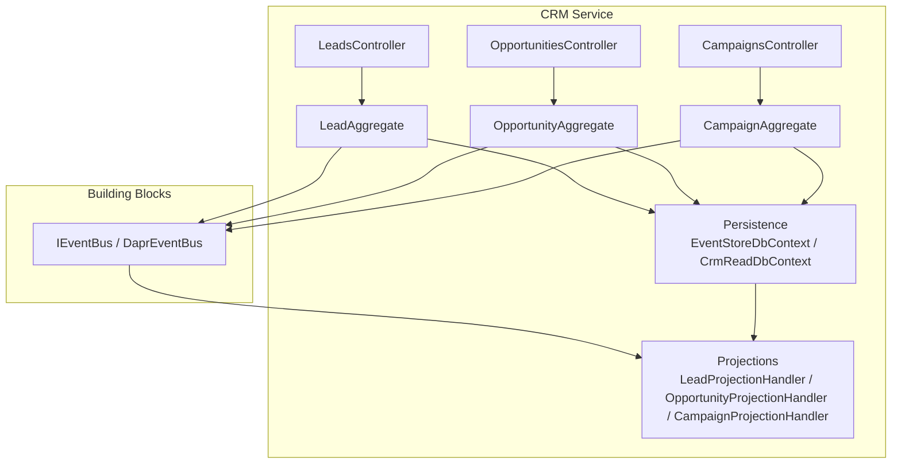
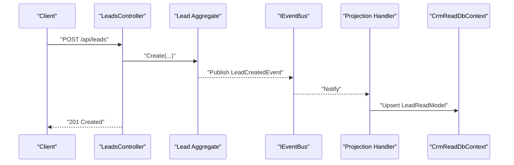
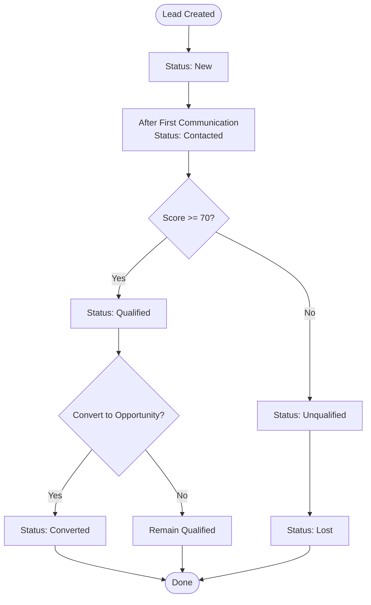
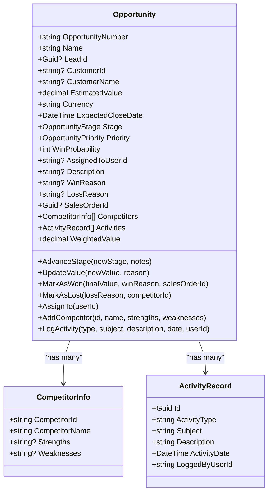
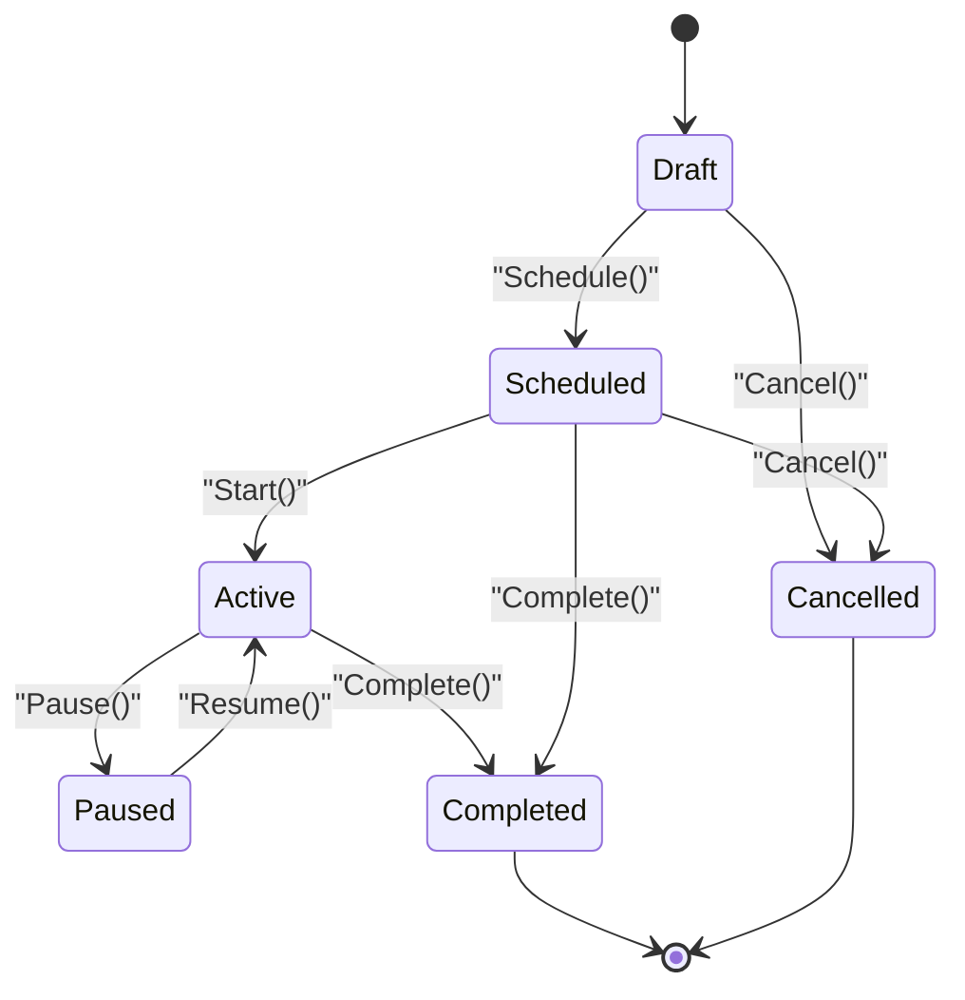
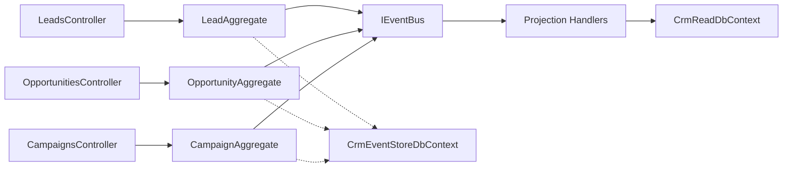

# CRM Service

<cite>
**Referenced Files in This Document**
- [Program.cs](file://src/Services/CRM/ErpSystem.CRM/Program.cs)
- [appsettings.json](file://src/Services/CRM/ErpSystem.CRM/appsettings.json)
- [LeadsController.cs](file://src/Services/CRM/ErpSystem.CRM/API/LeadsController.cs)
- [OpportunitiesController.cs](file://src/Services/CRM/ErpSystem.CRM/API/OpportunitiesController.cs)
- [CampaignsController.cs](file://src/Services/CRM/ErpSystem.CRM/API/CampaignsController.cs)
- [LeadAggregate.cs](file://src/Services/CRM/ErpSystem.CRM/Domain/LeadAggregate.cs)
- [OpportunityAggregate.cs](file://src/Services/CRM/ErpSystem.CRM/Domain/OpportunityAggregate.cs)
- [CampaignAggregate.cs](file://src/Services/CRM/ErpSystem.CRM/Domain/CampaignAggregate.cs)
- [Persistence.cs](file://src/Services/CRM/ErpSystem.CRM/Infrastructure/Persistence.cs)
- [Projections.cs](file://src/Services/CRM/ErpSystem.CRM/Infrastructure/Projections.cs)
- [DaprEventBus.cs](file://src/BuildingBlocks/ErpSystem.BuildingBlocks/EventBus/DaprEventBus.cs)
- [EventBusExtensions.cs](file://src/BuildingBlocks/ErpSystem.BuildingBlocks/EventBus/EventBusExtensions.cs)
</cite>

## Table of Contents
1. [Introduction](#introduction)
2. [Project Structure](#project-structure)
3. [Core Components](#core-components)
4. [Architecture Overview](#architecture-overview)
5. [Detailed Component Analysis](#detailed-component-analysis)
6. [Dependency Analysis](#dependency-analysis)
7. [Performance Considerations](#performance-considerations)
8. [Troubleshooting Guide](#troubleshooting-guide)
9. [Conclusion](#conclusion)
10. [Appendices](#appendices)

## Introduction
This document describes the CRM service responsible for managing customer relationship processes. It covers lead management (capture, qualification, conversion), opportunity management (sales pipeline tracking, forecasting, deal management), marketing campaign management (planning, execution, ROI analysis), customer interaction tracking, and sales force automation (activity management, assignment, performance tracking). It also documents the API endpoints, integration patterns with Sales, Marketing, and Service, and analytics capabilities such as sales effectiveness metrics.

## Project Structure
The CRM service follows a clean architecture with separate concerns for API controllers, domain aggregates, infrastructure persistence and projections, and building blocks for cross-cutting concerns like event bus and validation.

**Diagram sources**
- [Program.cs](file://src/Services/CRM/ErpSystem.CRM/Program.cs#L18-L41)
- [LeadsController.cs](file://src/Services/CRM/ErpSystem.CRM/API/LeadsController.cs#L11-L200)
- [OpportunitiesController.cs](file://src/Services/CRM/ErpSystem.CRM/API/OpportunitiesController.cs#L11-L251)
- [CampaignsController.cs](file://src/Services/CRM/ErpSystem.CRM/API/CampaignsController.cs#L11-L297)
- [LeadAggregate.cs](file://src/Services/CRM/ErpSystem.CRM/Domain/LeadAggregate.cs#L170-L304)
- [OpportunityAggregate.cs](file://src/Services/CRM/ErpSystem.CRM/Domain/OpportunityAggregate.cs#L162-L345)
- [CampaignAggregate.cs](file://src/Services/CRM/ErpSystem.CRM/Domain/CampaignAggregate.cs#L139-L339)
- [Persistence.cs](file://src/Services/CRM/ErpSystem.CRM/Infrastructure/Persistence.cs#L8-L66)
- [Projections.cs](file://src/Services/CRM/ErpSystem.CRM/Infrastructure/Projections.cs#L9-L341)
- [DaprEventBus.cs](file://src/BuildingBlocks/ErpSystem.BuildingBlocks/EventBus/DaprEventBus.cs#L6-L31)

**Section sources**
- [Program.cs](file://src/Services/CRM/ErpSystem.CRM/Program.cs#L1-L74)
- [appsettings.json](file://src/Services/CRM/ErpSystem.CRM/appsettings.json#L1-L11)

## Core Components
- Event Store and Read Model Databases: Separate PostgreSQL-backed DbContexts for event sourcing and read projections.
- Domain Aggregates: Lead, Opportunity, and Campaign with rich state machines and derived metrics.
- Projection Handlers: React to domain events to maintain read-side views.
- API Controllers: Expose CRUD and workflow operations for leads, opportunities, and campaigns.

Key implementation references:
- Event store registration and mediator setup: [Program.cs](file://src/Services/CRM/ErpSystem.CRM/Program.cs#L18-L41)
- Read model schemas: [Persistence.cs](file://src/Services/CRM/ErpSystem.CRM/Infrastructure/Persistence.cs#L26-L66)
- Projection handlers: [Projections.cs](file://src/Services/CRM/ErpSystem.CRM/Infrastructure/Projections.cs#L9-L341)

**Section sources**
- [Program.cs](file://src/Services/CRM/ErpSystem.CRM/Program.cs#L18-L41)
- [Persistence.cs](file://src/Services/CRM/ErpSystem.CRM/Infrastructure/Persistence.cs#L26-L66)
- [Projections.cs](file://src/Services/CRM/ErpSystem.CRM/Infrastructure/Projections.cs#L9-L341)

## Architecture Overview
The CRM service uses event sourcing and CQRS:
- Controllers accept commands and trigger domain methods.
- Domain aggregates emit domain events.
- Event bus publishes events (currently a dummy implementation).
- Projection handlers update read models for efficient querying.

**Diagram sources**
- [LeadsController.cs](file://src/Services/CRM/ErpSystem.CRM/API/LeadsController.cs#L80-L116)
- [LeadAggregate.cs](file://src/Services/CRM/ErpSystem.CRM/Domain/LeadAggregate.cs#L184-L198)
- [DaprEventBus.cs](file://src/BuildingBlocks/ErpSystem.BuildingBlocks/EventBus/DaprEventBus.cs#L15-L20)
- [Projections.cs](file://src/Services/CRM/ErpSystem.CRM/Infrastructure/Projections.cs#L17-L36)
- [Persistence.cs](file://src/Services/CRM/ErpSystem.CRM/Infrastructure/Persistence.cs#L26-L66)

## Detailed Component Analysis

### Lead Management
Lead lifecycle includes capture, qualification, assignment, communication logging, and conversion to opportunities.

- Capture: Create lead with contact/company info, source, and optional assignment.
- Qualification: Assign numeric score; threshold determines qualification.
- Assignment: Assign to a sales rep.
- Communication: Log phone, email, meeting, visit, web conference, or other interactions.
- Conversion: Convert qualified leads to opportunities with estimated value.

**Diagram sources**
- [LeadAggregate.cs](file://src/Services/CRM/ErpSystem.CRM/Domain/LeadAggregate.cs#L200-L255)
- [Projections.cs](file://src/Services/CRM/ErpSystem.CRM/Infrastructure/Projections.cs#L38-L95)

API endpoints:
- GET /api/leads
- GET /api/leads/{id}
- GET /api/leads/statistics
- POST /api/leads
- PUT /api/leads/{id}/status
- POST /api/leads/{id}/qualify
- POST /api/leads/{id}/convert
- PUT /api/leads/{id}/assign
- POST /api/leads/{id}/communications

Request DTOs:
- CreateLeadRequest
- UpdateLeadStatusRequest
- QualifyLeadRequest
- ConvertLeadRequest
- AssignLeadRequest
- LogCommunicationRequest

**Section sources**
- [LeadsController.cs](file://src/Services/CRM/ErpSystem.CRM/API/LeadsController.cs#L18-L197)
- [LeadAggregate.cs](file://src/Services/CRM/ErpSystem.CRM/Domain/LeadAggregate.cs#L10-L18)
- [LeadAggregate.cs](file://src/Services/CRM/ErpSystem.CRM/Domain/LeadAggregate.cs#L167-L304)
- [Projections.cs](file://src/Services/CRM/ErpSystem.CRM/Infrastructure/Projections.cs#L9-L96)

### Opportunity Management
Opportunity tracks the sales pipeline with stages, weighted value, priorities, and activities.

- Pipeline stages: Prospecting, Qualification, NeedsAnalysis, ValueProposition, Negotiation, ClosedWon, ClosedLost.
- Weighted value equals estimated value multiplied by win probability percent.
- Activities: Track meetings, calls, emails, etc.
- Competitors: Track competitive landscape.
- Closing: Mark as won or lost with reasons and optional sales order linkage.

**Diagram sources**
- [OpportunityAggregate.cs](file://src/Services/CRM/ErpSystem.CRM/Domain/OpportunityAggregate.cs#L162-L345)

API endpoints:
- GET /api/opportunities
- GET /api/opportunities/{id}
- GET /api/opportunities/pipeline
- GET /api/opportunities/analysis
- POST /api/opportunities
- PUT /api/opportunities/{id}/stage
- PUT /api/opportunities/{id}/value
- POST /api/opportunities/{id}/won
- POST /api/opportunities/{id}/lost
- PUT /api/opportunities/{id}/assign
- POST /api/opportunities/{id}/competitors
- POST /api/opportunities/{id}/activities

Request DTOs:
- CreateOpportunityRequest
- AdvanceStageRequest
- UpdateValueRequest
- MarkWonRequest
- MarkLostRequest
- AssignOpportunityRequest
- AddCompetitorRequest
- LogActivityRequest

**Section sources**
- [OpportunitiesController.cs](file://src/Services/CRM/ErpSystem.CRM/API/OpportunitiesController.cs#L18-L248)
- [OpportunityAggregate.cs](file://src/Services/CRM/ErpSystem.CRM/Domain/OpportunityAggregate.cs#L10-L31)
- [OpportunityAggregate.cs](file://src/Services/CRM/ErpSystem.CRM/Domain/OpportunityAggregate.cs#L159-L345)
- [Projections.cs](file://src/Services/CRM/ErpSystem.CRM/Infrastructure/Projections.cs#L102-L226)

### Marketing Campaign Management
Campaigns support planning, scheduling, execution, and ROI analysis.

- Lifecycle: Draft → Scheduled → Active → Paused → Completed or Cancelled.
- Metrics: Total leads, converted leads, total revenue, cost per lead, conversion rate, ROI, budget utilization.
- Operations: Start, pause, resume, complete, cancel, schedule, update budget, associate leads, record expenses, update metrics.

**Diagram sources**
- [CampaignAggregate.cs](file://src/Services/CRM/ErpSystem.CRM/Domain/CampaignAggregate.cs#L10-L18)
- [CampaignAggregate.cs](file://src/Services/CRM/ErpSystem.CRM/Domain/CampaignAggregate.cs#L209-L247)

API endpoints:
- GET /api/campaigns
- GET /api/campaigns/{id}
- GET /api/campaigns/{id}/roi
- GET /api/campaigns/roi-summary
- POST /api/campaigns
- POST /api/campaigns/{id}/start
- POST /api/campaigns/{id}/pause
- POST /api/campaigns/{id}/resume
- POST /api/campaigns/{id}/complete
- POST /api/campaigns/{id}/cancel
- POST /api/campaigns/{id}/schedule
- PUT /api/campaigns/{id}/budget
- POST /api/campaigns/{id}/leads
- POST /api/campaigns/{id}/expenses
- PUT /api/campaigns/{id}/metrics

Request DTOs:
- CreateCampaignRequest
- UpdateBudgetRequest
- AssociateLeadRequest
- RecordExpenseRequest
- UpdateMetricsRequest

**Section sources**
- [CampaignsController.cs](file://src/Services/CRM/ErpSystem.CRM/API/CampaignsController.cs#L18-L294)
- [CampaignAggregate.cs](file://src/Services/CRM/ErpSystem.CRM/Domain/CampaignAggregate.cs#L10-L35)
- [CampaignAggregate.cs](file://src/Services/CRM/ErpSystem.CRM/Domain/CampaignAggregate.cs#L139-L339)
- [Projections.cs](file://src/Services/CRM/ErpSystem.CRM/Infrastructure/Projections.cs#L232-L341)

### Customer Interaction Tracking
- Lead communication logs track type, subject, content, date, and who logged it.
- Opportunity activities track similar engagement details.

These are modeled as embedded arrays in read models and appended via projection handlers.

**Section sources**
- [LeadAggregate.cs](file://src/Services/CRM/ErpSystem.CRM/Domain/LeadAggregate.cs#L144-L162)
- [OpportunityAggregate.cs](file://src/Services/CRM/ErpSystem.CRM/Domain/OpportunityAggregate.cs#L146-L154)
- [Projections.cs](file://src/Services/CRM/ErpSystem.CRM/Infrastructure/Projections.cs#L81-L95)
- [Projections.cs](file://src/Services/CRM/ErpSystem.CRM/Infrastructure/Projections.cs#L214-L225)

### Sales Force Automation
- Activity logging for opportunities.
- Assignment of leads and opportunities to users.
- Performance indicators exposed via read models (counts, averages, pipeline summaries).

**Section sources**
- [LeadsController.cs](file://src/Services/CRM/ErpSystem.CRM/API/LeadsController.cs#L166-L176)
- [OpportunitiesController.cs](file://src/Services/CRM/ErpSystem.CRM/API/OpportunitiesController.cs#L202-L212)
- [Projections.cs](file://src/Services/CRM/ErpSystem.CRM/Infrastructure/Projections.cs#L192-L200)

### API Endpoints Summary
- Leads
  - GET /api/leads
  - GET /api/leads/{id}
  - GET /api/leads/statistics
  - POST /api/leads
  - PUT /api/leads/{id}/status
  - POST /api/leads/{id}/qualify
  - POST /api/leads/{id}/convert
  - PUT /api/leads/{id}/assign
  - POST /api/leads/{id}/communications
- Opportunities
  - GET /api/opportunities
  - GET /api/opportunities/{id}
  - GET /api/opportunities/pipeline
  - GET /api/opportunities/analysis
  - POST /api/opportunities
  - PUT /api/opportunities/{id}/stage
  - PUT /api/opportunities/{id}/value
  - POST /api/opportunities/{id}/won
  - POST /api/opportunities/{id}/lost
  - PUT /api/opportunities/{id}/assign
  - POST /api/opportunities/{id}/competitors
  - POST /api/opportunities/{id}/activities
- Campaigns
  - GET /api/campaigns
  - GET /api/campaigns/{id}
  - GET /api/campaigns/{id}/roi
  - GET /api/campaigns/roi-summary
  - POST /api/campaigns
  - POST /api/campaigns/{id}/start
  - POST /api/campaigns/{id}/pause
  - POST /api/campaigns/{id}/resume
  - POST /api/campaigns/{id}/complete
  - POST /api/campaigns/{id}/cancel
  - POST /api/campaigns/{id}/schedule
  - PUT /api/campaigns/{id}/budget
  - POST /api/campaigns/{id}/leads
  - POST /api/campaigns/{id}/expenses
  - PUT /api/campaigns/{id}/metrics

**Section sources**
- [LeadsController.cs](file://src/Services/CRM/ErpSystem.CRM/API/LeadsController.cs#L18-L197)
- [OpportunitiesController.cs](file://src/Services/CRM/ErpSystem.CRM/API/OpportunitiesController.cs#L18-L248)
- [CampaignsController.cs](file://src/Services/CRM/ErpSystem.CRM/API/CampaignsController.cs#L18-L294)

## Dependency Analysis
- Controllers depend on repositories and read-side DbContext for queries.
- Domain aggregates depend on building blocks for event publishing.
- Projection handlers depend on read-side DbContext and serialize/deserialize JSONB fields.
- Event bus is registered as a dummy implementation by default; Dapr integration is available via extension.

**Diagram sources**
- [Program.cs](file://src/Services/CRM/ErpSystem.CRM/Program.cs#L18-L41)
- [DaprEventBus.cs](file://src/BuildingBlocks/ErpSystem.BuildingBlocks/EventBus/DaprEventBus.cs#L6-L31)
- [Projections.cs](file://src/Services/CRM/ErpSystem.CRM/Infrastructure/Projections.cs#L9-L341)
- [Persistence.cs](file://src/Services/CRM/ErpSystem.CRM/Infrastructure/Persistence.cs#L8-L66)

**Section sources**
- [Program.cs](file://src/Services/CRM/ErpSystem.CRM/Program.cs#L18-L41)
- [EventBusExtensions.cs](file://src/BuildingBlocks/ErpSystem.BuildingBlocks/EventBus/EventBusExtensions.cs#L7-L13)
- [DaprEventBus.cs](file://src/BuildingBlocks/ErpSystem.BuildingBlocks/EventBus/DaprEventBus.cs#L6-L31)

## Performance Considerations
- Read model indexing: Status, stage, assigned-to, and unique number indexes improve query performance.
- JSONB storage for complex fields reduces normalization overhead but requires careful deserialization.
- Pagination on list endpoints prevents large payloads.
- Derived metrics (weighted value, ROI, conversion rate) are recalculated in projections to keep read models current.

Recommendations:
- Monitor read model update latency; consider batching projections for high throughput.
- Use filtered indexes for frequent query filters (e.g., status, stage, assigned user).
- Cache frequently accessed dashboards (statistics, pipeline summary) at the application level.

**Section sources**
- [Persistence.cs](file://src/Services/CRM/ErpSystem.CRM/Infrastructure/Persistence.cs#L34-L65)
- [Projections.cs](file://src/Services/CRM/ErpSystem.CRM/Infrastructure/Projections.cs#L146-L148)
- [Projections.cs](file://src/Services/CRM/ErpSystem.CRM/Infrastructure/Projections.cs#L307-L334)

## Troubleshooting Guide
Common issues and resolutions:
- Invalid state transitions
  - Leads: Cannot change status of converted or lost leads; cannot qualify converted/lost leads; cannot convert lost/unqualified leads.
  - Opportunities: Cannot change stage of closed deals; use won/lost methods; cannot update value of closed deals; cannot mark as won/lost twice.
  - Campaigns: Cannot start non-draft/scheduled campaigns; cannot pause non-active; cannot resume non-paused; cannot complete non-active/paused; cannot cancel completed/cancelled; cannot update budget of completed/cancelled; cannot record expenses for completed/cancelled.
- Validation errors
  - Scores must be 0–100 for leads.
  - Values and budgets must be non-negative.
  - End date must be after start date for campaigns.
  - Loss reason is required for marking opportunities lost.
- Event bus behavior
  - Currently uses a dummy implementation; events are logged rather than published to a broker.

**Section sources**
- [LeadAggregate.cs](file://src/Services/CRM/ErpSystem.CRM/Domain/LeadAggregate.cs#L200-L255)
- [OpportunityAggregate.cs](file://src/Services/CRM/ErpSystem.CRM/Domain/OpportunityAggregate.cs#L210-L273)
- [CampaignAggregate.cs](file://src/Services/CRM/ErpSystem.CRM/Domain/CampaignAggregate.cs#L209-L291)
- [DaprEventBus.cs](file://src/BuildingBlocks/ErpSystem.BuildingBlocks/EventBus/DaprEventBus.cs#L23-L30)

## Conclusion
The CRM service provides a robust, event-sourced foundation for managing leads, opportunities, and marketing campaigns. Its CQRS/read-model design enables scalable querying and real-time dashboards. While the event bus is currently a dummy implementation, the architecture supports future integration with Dapr pub/sub for cross-service collaboration with Sales, Marketing, and Service.

## Appendices

### Integration Patterns
- With Sales: Opportunity creation and closure can publish domain events consumed by Sales for order generation and financial tracking.
- With Marketing: Campaign updates and lead associations can trigger downstream marketing automation.
- With Service: Opportunity won/lost events can inform customer support readiness and contract management.

Note: Current event bus is a dummy; enable Dapr bus via extensions to activate inter-service messaging.

**Section sources**
- [EventBusExtensions.cs](file://src/BuildingBlocks/ErpSystem.BuildingBlocks/EventBus/EventBusExtensions.cs#L7-L13)
- [DaprEventBus.cs](file://src/BuildingBlocks/ErpSystem.BuildingBlocks/EventBus/DaprEventBus.cs#L15-L20)

### Analytics and Metrics
- Lead statistics: Counts by status and average score.
- Pipeline funnel: Stage-wise counts, total value, and weighted value.
- Win/loss analysis: Won/lost counts and values over a date range.
- Campaign ROI: Budget utilization, cost per lead, conversion rate, total revenue, and ROI.

**Section sources**
- [LeadsController.cs](file://src/Services/CRM/ErpSystem.CRM/API/LeadsController.cs#L59-L70)
- [OpportunitiesController.cs](file://src/Services/CRM/ErpSystem.CRM/API/OpportunitiesController.cs#L62-L105)
- [CampaignsController.cs](file://src/Services/CRM/ErpSystem.CRM/API/CampaignsController.cs#L56-L108)