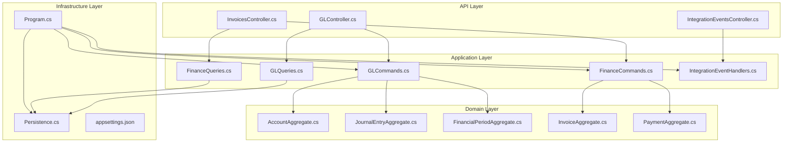
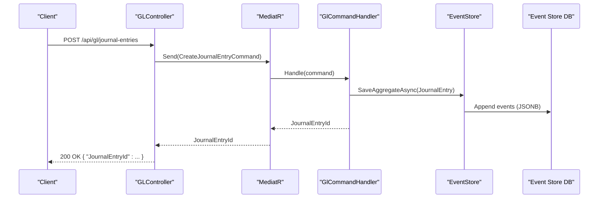
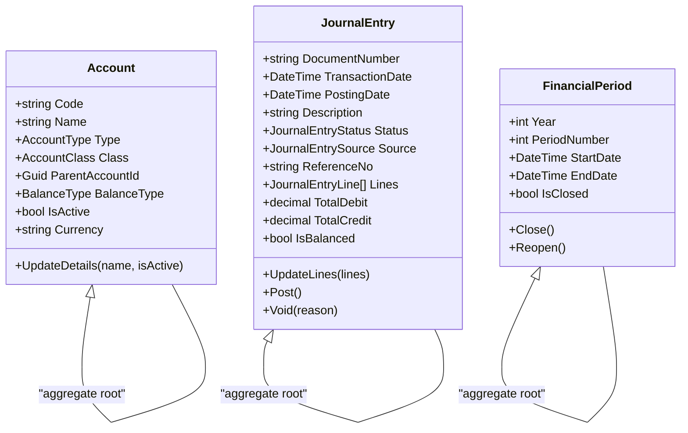
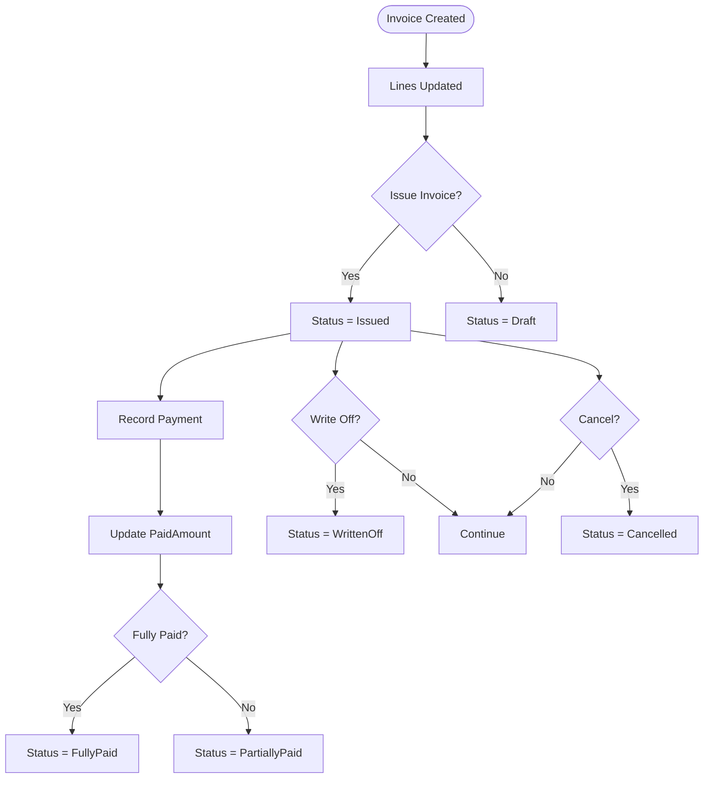
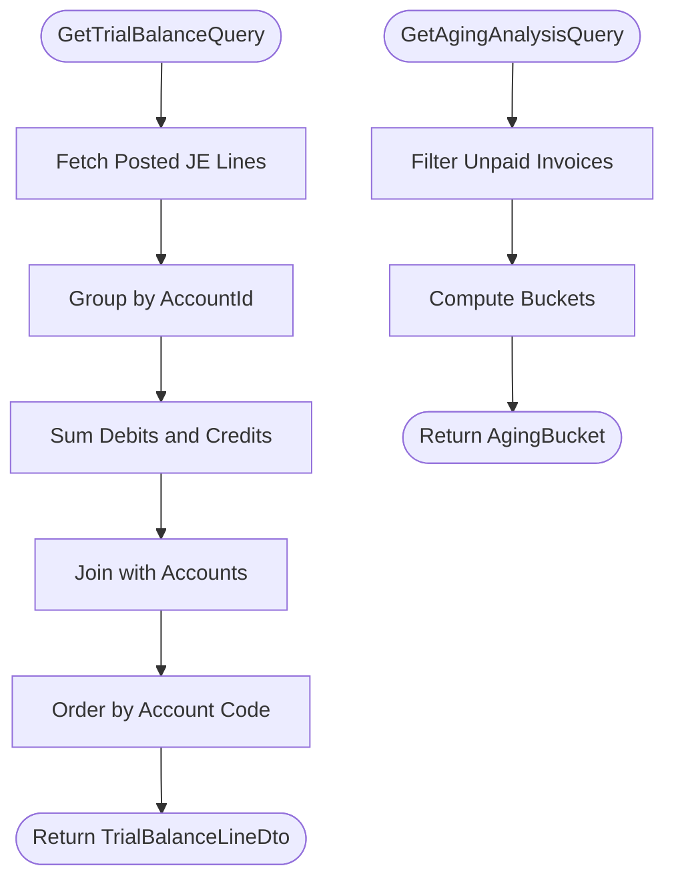
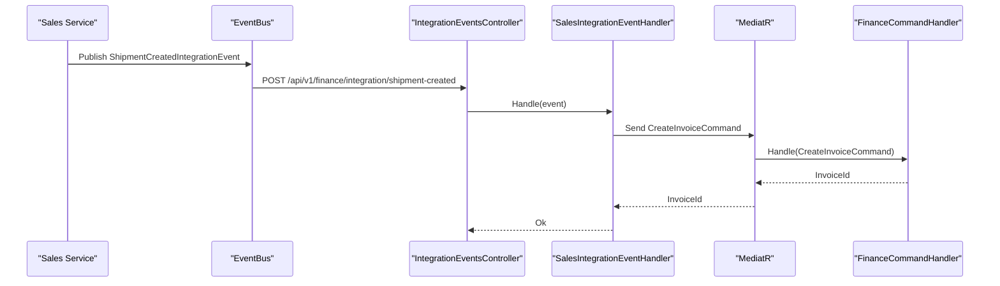
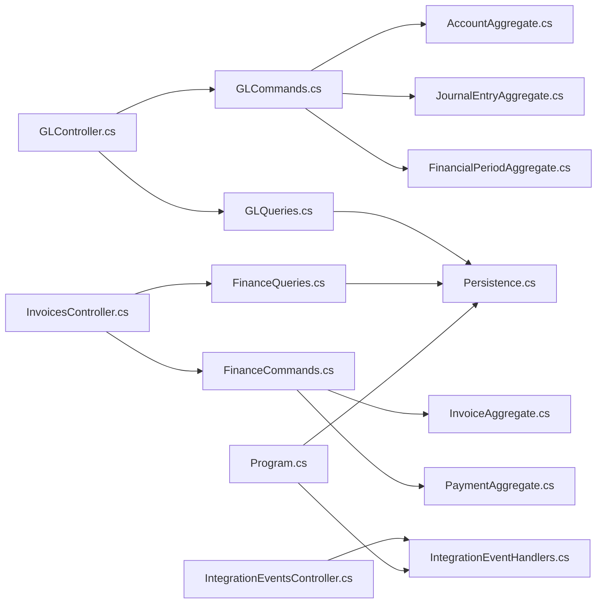

# Finance Service

<cite>
**Referenced Files in This Document**
- [Program.cs](file://src/Services/Finance/ErpSystem.Finance/Program.cs)
- [appsettings.json](file://src/Services/Finance/ErpSystem.Finance/appsettings.json)
- [GLController.cs](file://src/Services/Finance/ErpSystem.Finance/API/GLController.cs)
- [InvoicesController.cs](file://src/Services/Finance/ErpSystem.Finance/API/InvoicesController.cs)
- [IntegrationEventsController.cs](file://src/Services/Finance/ErpSystem.Finance/API/IntegrationEventsController.cs)
- [GLCommands.cs](file://src/Services/Finance/ErpSystem.Finance/Application/GLCommands.cs)
- [GLQueries.cs](file://src/Services/Finance/ErpSystem.Finance/Application/GLQueries.cs)
- [FinanceCommands.cs](file://src/Services/Finance/ErpSystem.Finance/Application/FinanceCommands.cs)
- [FinanceQueries.cs](file://src/Services/Finance/ErpSystem.Finance/Application/FinanceQueries.cs)
- [IntegrationEventHandlers.cs](file://src/Services/Finance/ErpSystem.Finance/Application/IntegrationEventHandlers.cs)
- [AccountAggregate.cs](file://src/Services/Finance/ErpSystem.Finance/Domain/AccountAggregate.cs)
- [JournalEntryAggregate.cs](file://src/Services/Finance/ErpSystem.Finance/Domain/JournalEntryAggregate.cs)
- [FinancialPeriodAggregate.cs](file://src/Services/Finance/ErpSystem.Finance/Domain/FinancialPeriodAggregate.cs)
- [InvoiceAggregate.cs](file://src/Services/Finance/ErpSystem.Finance/Domain/InvoiceAggregate.cs)
- [PaymentAggregate.cs](file://src/Services/Finance/ErpSystem.Finance/Domain/PaymentAggregate.cs)
- [Persistence.cs](file://src/Services/Finance/ErpSystem.Finance/Infrastructure/Persistence.cs)
</cite>

## Table of Contents
1. [Introduction](#introduction)
2. [Project Structure](#project-structure)
3. [Core Components](#core-components)
4. [Architecture Overview](#architecture-overview)
5. [Detailed Component Analysis](#detailed-component-analysis)
6. [Dependency Analysis](#dependency-analysis)
7. [Performance Considerations](#performance-considerations)
8. [Troubleshooting Guide](#troubleshooting-guide)
9. [Conclusion](#conclusion)
10. [Appendices](#appendices)

## Introduction
The Finance service provides comprehensive financial management capabilities centered around:
- General Ledger (GL): Chart of accounts, posting periods, journal entries, and trial balance reporting
- Accounts Receivable and Payable: Invoice lifecycle, payment recording, and aging analytics
- Financial reporting: Trial balance and aging reports
- Integration: Real-time financial insights via integration events from Sales

The service follows CQRS and Event Sourcing patterns with PostgreSQL-backed event storage and projection read models.

## Project Structure
The Finance service is organized into layered components:
- API: HTTP endpoints for GL and invoice operations
- Application: CQRS commands and queries with handlers
- Domain: Aggregates and value objects modeling financial entities
- Infrastructure: Event store and read model persistence

**Diagram sources**
- [Program.cs](file://src/Services/Finance/ErpSystem.Finance/Program.cs#L1-L86)
- [appsettings.json](file://src/Services/Finance/ErpSystem.Finance/appsettings.json#L1-L12)
- [GLController.cs](file://src/Services/Finance/ErpSystem.Finance/API/GLController.cs#L1-L76)
- [InvoicesController.cs](file://src/Services/Finance/ErpSystem.Finance/API/InvoicesController.cs#L1-L74)
- [IntegrationEventsController.cs](file://src/Services/Finance/ErpSystem.Finance/API/IntegrationEventsController.cs#L1-L18)
- [GLCommands.cs](file://src/Services/Finance/ErpSystem.Finance/Application/GLCommands.cs#L1-L98)
- [GLQueries.cs](file://src/Services/Finance/ErpSystem.Finance/Application/GLQueries.cs#L1-L80)
- [FinanceCommands.cs](file://src/Services/Finance/ErpSystem.Finance/Application/FinanceCommands.cs#L1-L142)
- [FinanceQueries.cs](file://src/Services/Finance/ErpSystem.Finance/Application/FinanceQueries.cs#L1-L110)
- [IntegrationEventHandlers.cs](file://src/Services/Finance/ErpSystem.Finance/Application/IntegrationEventHandlers.cs#L1-L33)
- [AccountAggregate.cs](file://src/Services/Finance/ErpSystem.Finance/Domain/AccountAggregate.cs#L1-L87)
- [JournalEntryAggregate.cs](file://src/Services/Finance/ErpSystem.Finance/Domain/JournalEntryAggregate.cs#L1-L136)
- [FinancialPeriodAggregate.cs](file://src/Services/Finance/ErpSystem.Finance/Domain/FinancialPeriodAggregate.cs#L1-L73)
- [InvoiceAggregate.cs](file://src/Services/Finance/ErpSystem.Finance/Domain/InvoiceAggregate.cs#L1-L176)
- [PaymentAggregate.cs](file://src/Services/Finance/ErpSystem.Finance/Domain/PaymentAggregate.cs#L1-L122)
- [Persistence.cs](file://src/Services/Finance/ErpSystem.Finance/Infrastructure/Persistence.cs#L1-L132)

**Section sources**
- [Program.cs](file://src/Services/Finance/ErpSystem.Finance/Program.cs#L1-L86)
- [appsettings.json](file://src/Services/Finance/ErpSystem.Finance/appsettings.json#L1-L12)

## Core Components
- General Ledger
  - Chart of accounts with hierarchical structure and balance types
  - Posting periods with open/close lifecycle
  - Journal entries with debits/credits, balancing validation, and posting controls
- Accounts Receivable and Payable
  - Invoice lifecycle: create, issue, record payments, write-off, cancel
  - Payment allocation and status tracking
- Financial Reporting
  - Trial balance computation
  - Aging analysis and overdue invoice reporting
- Integration
  - Real-time invoice creation from Sales shipment events

**Section sources**
- [AccountAggregate.cs](file://src/Services/Finance/ErpSystem.Finance/Domain/AccountAggregate.cs#L1-L87)
- [JournalEntryAggregate.cs](file://src/Services/Finance/ErpSystem.Finance/Domain/JournalEntryAggregate.cs#L1-L136)
- [FinancialPeriodAggregate.cs](file://src/Services/Finance/ErpSystem.Finance/Domain/FinancialPeriodAggregate.cs#L1-L73)
- [InvoiceAggregate.cs](file://src/Services/Finance/ErpSystem.Finance/Domain/InvoiceAggregate.cs#L1-L176)
- [PaymentAggregate.cs](file://src/Services/Finance/ErpSystem.Finance/Domain/PaymentAggregate.cs#L1-L122)
- [GLQueries.cs](file://src/Services/Finance/ErpSystem.Finance/Application/GLQueries.cs#L1-L80)
- [FinanceQueries.cs](file://src/Services/Finance/ErpSystem.Finance/Application/FinanceQueries.cs#L1-L110)
- [IntegrationEventHandlers.cs](file://src/Services/Finance/ErpSystem.Finance/Application/IntegrationEventHandlers.cs#L1-L33)

## Architecture Overview
The Finance service uses:
- CQRS with MediatR for commands and queries
- Event Sourcing with PostgreSQL JSONB event streams
- Projection-based read models for reporting
- Dapr EventBus for integration events
- Swagger for API documentation

**Diagram sources**
- [GLController.cs](file://src/Services/Finance/ErpSystem.Finance/API/GLController.cs#L26-L31)
- [GLCommands.cs](file://src/Services/Finance/ErpSystem.Finance/Application/GLCommands.cs#L54-L67)
- [Program.cs](file://src/Services/Finance/ErpSystem.Finance/Program.cs#L40-L46)

**Section sources**
- [Program.cs](file://src/Services/Finance/ErpSystem.Finance/Program.cs#L1-L86)
- [Persistence.cs](file://src/Services/Finance/ErpSystem.Finance/Infrastructure/Persistence.cs#L1-L132)

## Detailed Component Analysis

### General Ledger
- Chart of Accounts
  - Hierarchical structure with parent-child relationships
  - Balance type determines normal side (debit/credit)
  - Active/inactive control
- Posting Periods
  - Yearly periods numbered 1-12
  - Open/close lifecycle prevents posting to closed periods
- Journal Entries
  - Draft → Posted → Voided workflow
  - Debit/credit balancing enforced
  - Source attribution for automation triggers

**Diagram sources**
- [AccountAggregate.cs](file://src/Services/Finance/ErpSystem.Finance/Domain/AccountAggregate.cs#L41-L87)
- [JournalEntryAggregate.cs](file://src/Services/Finance/ErpSystem.Finance/Domain/JournalEntryAggregate.cs#L55-L136)
- [FinancialPeriodAggregate.cs](file://src/Services/Finance/ErpSystem.Finance/Domain/FinancialPeriodAggregate.cs#L25-L73)

**Section sources**
- [AccountAggregate.cs](file://src/Services/Finance/ErpSystem.Finance/Domain/AccountAggregate.cs#L1-L87)
- [JournalEntryAggregate.cs](file://src/Services/Finance/ErpSystem.Finance/Domain/JournalEntryAggregate.cs#L1-L136)
- [FinancialPeriodAggregate.cs](file://src/Services/Finance/ErpSystem.Finance/Domain/FinancialPeriodAggregate.cs#L1-L73)

### Accounts Receivable and Payable
- Invoice Lifecycle
  - Create with lines and amounts
  - Issue to move from draft to issued
  - Record payments against invoice
  - Write-off or cancel under constraints
- Payment Management
  - Direction indicates incoming/outgoing
  - Unallocated amount tracking
  - Allocation to specific invoices

**Diagram sources**
- [InvoiceAggregate.cs](file://src/Services/Finance/ErpSystem.Finance/Domain/InvoiceAggregate.cs#L67-L176)
- [PaymentAggregate.cs](file://src/Services/Finance/ErpSystem.Finance/Domain/PaymentAggregate.cs#L38-L122)

**Section sources**
- [InvoiceAggregate.cs](file://src/Services/Finance/ErpSystem.Finance/Domain/InvoiceAggregate.cs#L1-L176)
- [PaymentAggregate.cs](file://src/Services/Finance/ErpSystem.Finance/Domain/PaymentAggregate.cs#L1-L122)
- [FinanceCommands.cs](file://src/Services/Finance/ErpSystem.Finance/Application/FinanceCommands.cs#L1-L142)

### Financial Reporting
- Trial Balance
  - Computes debit/credit totals per account up to a date
  - Joins posted journal entry lines with headers
- Aging Analysis
  - Current, 1–30 days, 31–60 days, 61–90 days, 90+ days buckets
  - Filters by party and as-of date

**Diagram sources**
- [GLQueries.cs](file://src/Services/Finance/ErpSystem.Finance/Application/GLQueries.cs#L38-L78)
- [FinanceQueries.cs](file://src/Services/Finance/ErpSystem.Finance/Application/FinanceQueries.cs#L73-L96)

**Section sources**
- [GLQueries.cs](file://src/Services/Finance/ErpSystem.Finance/Application/GLQueries.cs#L1-L80)
- [FinanceQueries.cs](file://src/Services/Finance/ErpSystem.Finance/Application/FinanceQueries.cs#L1-L110)

### Integration with Sales
- Real-time invoice creation
  - On ShipmentCreatedIntegrationEvent, service auto-creates AR invoice
  - Generates invoice lines from shipment items

**Diagram sources**
- [IntegrationEventsController.cs](file://src/Services/Finance/ErpSystem.Finance/API/IntegrationEventsController.cs#L10-L16)
- [IntegrationEventHandlers.cs](file://src/Services/Finance/ErpSystem.Finance/Application/IntegrationEventHandlers.cs#L6-L32)
- [FinanceCommands.cs](file://src/Services/Finance/ErpSystem.Finance/Application/FinanceCommands.cs#L53-L62)

**Section sources**
- [IntegrationEventsController.cs](file://src/Services/Finance/ErpSystem.Finance/API/IntegrationEventsController.cs#L1-L18)
- [IntegrationEventHandlers.cs](file://src/Services/Finance/ErpSystem.Finance/Application/IntegrationEventHandlers.cs#L1-L33)

## Dependency Analysis
- Internal dependencies
  - Controllers depend on MediatR handlers
  - Handlers depend on domain aggregates and repositories
  - Read models depend on EF Core projections
- External dependencies
  - PostgreSQL for event store and read models
  - Dapr EventBus for integration events
  - Swagger for API documentation

**Diagram sources**
- [Program.cs](file://src/Services/Finance/ErpSystem.Finance/Program.cs#L1-L86)
- [GLController.cs](file://src/Services/Finance/ErpSystem.Finance/API/GLController.cs#L1-L76)
- [InvoicesController.cs](file://src/Services/Finance/ErpSystem.Finance/API/InvoicesController.cs#L1-L74)
- [IntegrationEventsController.cs](file://src/Services/Finance/ErpSystem.Finance/API/IntegrationEventsController.cs#L1-L18)
- [GLCommands.cs](file://src/Services/Finance/ErpSystem.Finance/Application/GLCommands.cs#L1-L98)
- [FinanceCommands.cs](file://src/Services/Finance/ErpSystem.Finance/Application/FinanceCommands.cs#L1-L142)
- [GLQueries.cs](file://src/Services/Finance/ErpSystem.Finance/Application/GLQueries.cs#L1-L80)
- [FinanceQueries.cs](file://src/Services/Finance/ErpSystem.Finance/Application/FinanceQueries.cs#L1-L110)
- [IntegrationEventHandlers.cs](file://src/Services/Finance/ErpSystem.Finance/Application/IntegrationEventHandlers.cs#L1-L33)
- [Persistence.cs](file://src/Services/Finance/ErpSystem.Finance/Infrastructure/Persistence.cs#L1-L132)

**Section sources**
- [Program.cs](file://src/Services/Finance/ErpSystem.Finance/Program.cs#L1-L86)
- [Persistence.cs](file://src/Services/Finance/ErpSystem.Finance/Infrastructure/Persistence.cs#L1-L132)

## Performance Considerations
- Event store
  - JSONB payloads enable flexible schema evolution
  - Consider partitioning or sharding for high-volume scenarios
- Read models
  - Indexes on JournalEntryId and AccountId improve reporting performance
  - Prefer projection updates over on-the-fly calculations for large datasets
- Queries
  - Use pagination for invoice/payment lists
  - Filter by as-of dates and party IDs to reduce result sets

[No sources needed since this section provides general guidance]

## Troubleshooting Guide
- Journal Entry Posting Failures
  - Ensure entry is in Draft status and balanced (debits equal credits)
  - Verify posting date falls within an open period
- Invoice Payment Issues
  - Payments cannot be recorded for cancelled or written-off invoices
  - Overpayment attempts are rejected; ensure allocation does not exceed outstanding amount
- Aging Report Discrepancies
  - Confirm invoice statuses considered (issued/partially paid)
  - Validate as-of date and party filters

**Section sources**
- [JournalEntryAggregate.cs](file://src/Services/Finance/ErpSystem.Finance/Domain/JournalEntryAggregate.cs#L87-L107)
- [InvoiceAggregate.cs](file://src/Services/Finance/ErpSystem.Finance/Domain/InvoiceAggregate.cs#L110-L140)
- [FinanceQueries.cs](file://src/Services/Finance/ErpSystem.Finance/Application/FinanceQueries.cs#L73-L108)

## Conclusion
The Finance service delivers robust financial management with event-sourced GL, end-to-end AR/AP processing, and real-time integrations. Its modular design supports scalability and maintainability while providing essential reporting capabilities for trial balance and aging analysis.

[No sources needed since this section summarizes without analyzing specific files]

## Appendices

### API Endpoints

- General Ledger
  - POST /api/gl/accounts
  - GET /api/gl/accounts
  - POST /api/gl/journal-entries
  - POST /api/gl/journal-entries/{id}/post
  - GET /api/gl/journal-entries/{id}
  - GET /api/gl/reports/trial-balance
  - POST /api/gl/periods
  - POST /api/gl/periods/{id}/close

- Invoices
  - POST /api/v1/finance/invoices
  - GET /api/v1/finance/invoices
  - GET /api/v1/finance/invoices/{id}
  - POST /api/v1/finance/invoices/{id}/issue
  - POST /api/v1/finance/invoices/{id}/cancel
  - POST /api/v1/finance/invoices/{id}/write-off
  - POST /api/v1/finance/invoices/{id}/payments
  - GET /api/v1/finance/invoices/{id}/payments
  - GET /api/v1/finance/invoices/aging-analysis
  - GET /api/v1/finance/invoices/overdue

- Integration
  - POST /api/v1/finance/integration/shipment-created

**Section sources**
- [GLController.cs](file://src/Services/Finance/ErpSystem.Finance/API/GLController.cs#L1-L76)
- [InvoicesController.cs](file://src/Services/Finance/ErpSystem.Finance/API/InvoicesController.cs#L1-L74)
- [IntegrationEventsController.cs](file://src/Services/Finance/ErpSystem.Finance/API/IntegrationEventsController.cs#L1-L18)