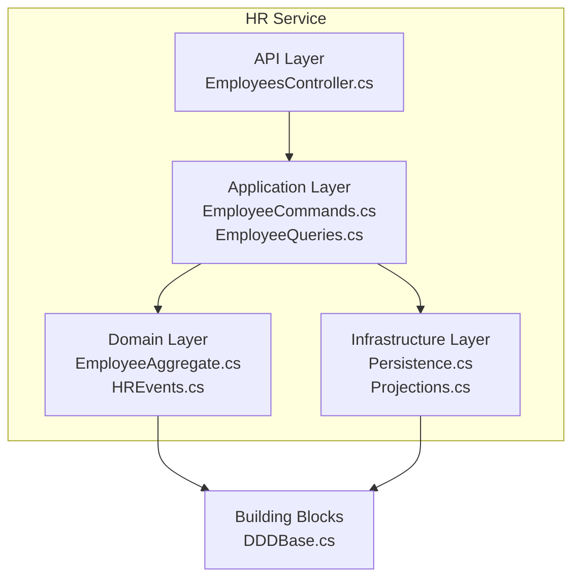
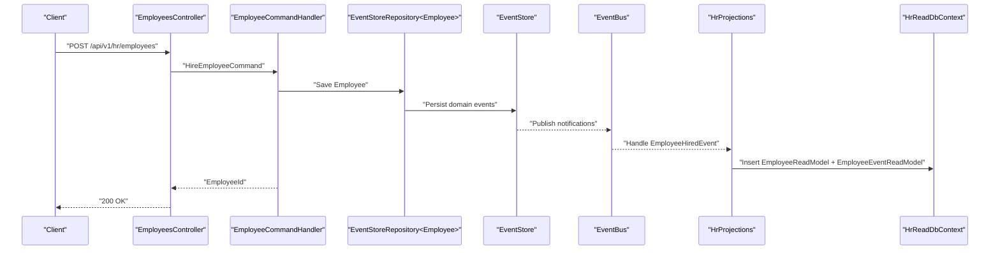
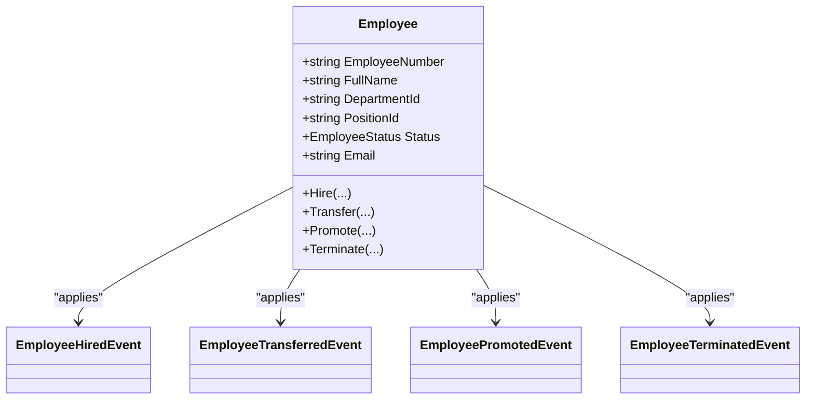
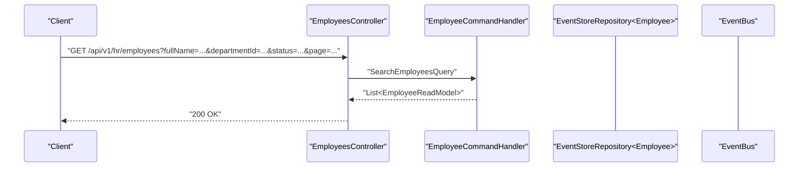
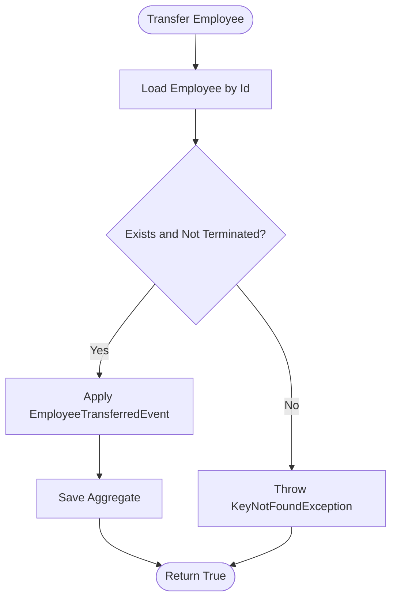
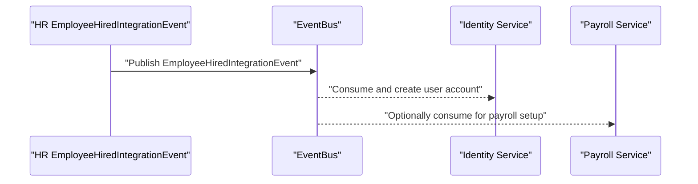
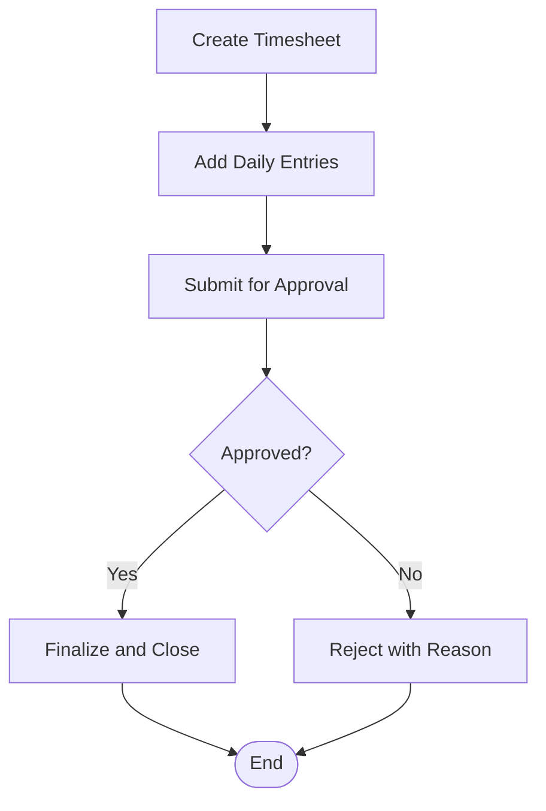
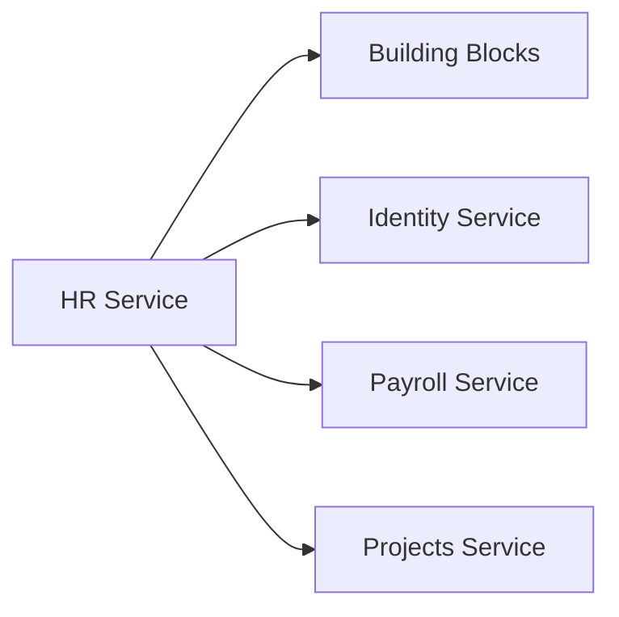

# Human Resources Service

<cite>
**Referenced Files in This Document**
- [ErpSystem.HR.csproj](file://src\Services\HR\ErpSystem.HR\ErpSystem.HR.csproj)
- [Program.cs](file://src\Services\HR\ErpSystem.HR\Program.cs)
- [EmployeesController.cs](file://src\Services\HR\ErpSystem.HR\API\EmployeesController.cs)
- [EmployeeCommands.cs](file://src\Services\HR\ErpSystem.HR\Application\EmployeeCommands.cs)
- [EmployeeQueries.cs](file://src\Services\HR\ErpSystem.HR\Application\EmployeeQueries.cs)
- [EmployeeAggregate.cs](file://src\Services\HR\ErpSystem.HR\Domain\EmployeeAggregate.cs)
- [HREvents.cs](file://src\Services\HR\ErpSystem.HR\Domain\HREvents.cs)
- [Persistence.cs](file://src\Services\HR\ErpSystem.HR\Infrastructure\Persistence.cs)
- [Projections.cs](file://src\Services\HR\ErpSystem.HR\Infrastructure\Projections.cs)
- [DDDBase.cs](file://src\BuildingBlocks\ErpSystem.BuildingBlocks\Domain\DDDBase.cs)
- [HRIntegrationEvents.cs](file://src\Services\Identity\ErpSystem.Identity\Application\IntegrationEvents\HRIntegrationEvents.cs)
- [PayrollAggregate.cs](file://src\Services\Payroll\ErpSystem.Payroll\Domain\PayrollAggregate.cs)
- [TimesheetAggregate.cs](file://src\Services\Projects\ErpSystem.Projects\Domain\TimesheetAggregate.cs)
</cite>

## Table of Contents
1. [Introduction](#introduction)
2. [Project Structure](#project-structure)
3. [Core Components](#core-components)
4. [Architecture Overview](#architecture-overview)
5. [Detailed Component Analysis](#detailed-component-analysis)
6. [Dependency Analysis](#dependency-analysis)
7. [Performance Considerations](#performance-considerations)
8. [Troubleshooting Guide](#troubleshooting-guide)
9. [Conclusion](#conclusion)
10. [Appendices](#appendices)

## Introduction
This document describes the Human Resources (HR) service responsible for managing employee lifecycle and organizational data. It covers employee master data (personal info, job assignments, organizational hierarchy), payroll processing integration (time tracking, benefits administration, tax calculations), organizational structure management (departments, positions, reporting relationships), recruitment/onboarding workflows, performance management integration, attendance tracking, leave management, and time-off accruals. It also documents API endpoints for employee management, organizational queries, and HR operations, along with integration patterns to Payroll, Finance, and Identity services. Finally, it outlines HR analytics, workforce planning, and compliance reporting capabilities.

## Project Structure
The HR service follows a clean architecture with bounded contexts:
- API layer exposes HTTP endpoints for employee operations.
- Application layer encapsulates commands and queries using CQRS and MediatR.
- Domain layer defines aggregates, value objects, and domain events.
- Infrastructure layer handles persistence (event sourcing and projections) and event bus integration.

**Diagram sources**
- [EmployeesController.cs](file://src\Services\HR\ErpSystem.HR\API\EmployeesController.cs#L1-L48)
- [EmployeeCommands.cs](file://src\Services\HR\ErpSystem.HR\Application\EmployeeCommands.cs#L1-L112)
- [EmployeeQueries.cs](file://src\Services\HR\ErpSystem.HR\Application\EmployeeQueries.cs#L1-L44)
- [EmployeeAggregate.cs](file://src\Services\HR\ErpSystem.HR\Domain\EmployeeAggregate.cs#L1-L151)
- [HREvents.cs](file://src\Services\HR\ErpSystem.HR\Domain\HREvents.cs#L1-L22)
- [Persistence.cs](file://src\Services\HR\ErpSystem.HR\Infrastructure\Persistence.cs#L1-L64)
- [Projections.cs](file://src\Services\HR\ErpSystem.HR\Infrastructure\Projections.cs#L1-L125)
- [DDDBase.cs](file://src\BuildingBlocks\ErpSystem.BuildingBlocks\Domain\DDDBase.cs#L1-L137)

**Section sources**
- [ErpSystem.HR.csproj](file://src\Services\HR\ErpSystem.HR\ErpSystem.HR.csproj#L1-L25)
- [Program.cs](file://src\Services\HR\ErpSystem.HR\Program.cs#L1-L72)

## Core Components
- Employee aggregate and domain events define the employee lifecycle (hire, transfer, promote, terminate).
- Command handlers orchestrate operations and publish integration events.
- Query handlers provide read-side projections for employees and events.
- Event-sourced persistence stores domain events; projections maintain denormalized read models.
- Integration events coordinate with Identity for user account creation and termination.

Key responsibilities:
- Employee lifecycle management: hiring, transfers, promotions, terminations.
- Organizational hierarchy: department, position, manager relationships.
- Read models for search, filtering, and audit trails.
- Integration with Identity for account provisioning/disabling.

**Section sources**
- [EmployeeAggregate.cs](file://src\Services\HR\ErpSystem.HR\Domain\EmployeeAggregate.cs#L75-L151)
- [EmployeeCommands.cs](file://src\Services\HR\ErpSystem.HR\Application\EmployeeCommands.cs#L46-L112)
- [EmployeeQueries.cs](file://src\Services\HR\ErpSystem.HR\Application\EmployeeQueries.cs#L13-L44)
- [Persistence.cs](file://src\Services\HR\ErpSystem.HR\Infrastructure\Persistence.cs#L6-L64)
- [Projections.cs](file://src\Services\HR\ErpSystem.HR\Infrastructure\Projections.cs#L6-L125)
- [HREvents.cs](file://src\Services\HR\ErpSystem.HR\Domain\HREvents.cs#L5-L22)

## Architecture Overview
The HR service uses event-driven CQRS with event sourcing:
- Write path: Commands mutate the Employee aggregate, persist events, and publish notifications.
- Read path: Projections update read models for efficient querying.
- Integrations: Publish integration events consumed by Identity and potentially Payroll/Finance.

**Diagram sources**
- [EmployeesController.cs](file://src\Services\HR\ErpSystem.HR\API\EmployeesController.cs#L11-L12)
- [EmployeeCommands.cs](file://src\Services\HR\ErpSystem.HR\Application\EmployeeCommands.cs#L52-L75)
- [Persistence.cs](file://src\Services\HR\ErpSystem.HR\Infrastructure\Persistence.cs#L6-L18)
- [Projections.cs](file://src\Services\HR\ErpSystem.HR\Infrastructure\Projections.cs#L12-L47)
- [DDDBase.cs](file://src\BuildingBlocks\ErpSystem.BuildingBlocks\Domain\DDDBase.cs#L59-L120)

## Detailed Component Analysis

### Employee Lifecycle Management
The Employee aggregate encapsulates personal and job assignment data and enforces lifecycle transitions via domain events.

**Diagram sources**
- [EmployeeAggregate.cs](file://src\Services\HR\ErpSystem.HR\Domain\EmployeeAggregate.cs#L75-L151)

Operational flows:
- Hiring generates an EmployeeHiredEvent and publishes an integration event for Identity.
- Transfers/promotions update department/position; terminations set status and publish an integration event for Identity.
- Queries support retrieving by ID, paginated search by filters, and event timelines.

**Section sources**
- [EmployeeAggregate.cs](file://src\Services\HR\ErpSystem.HR\Domain\EmployeeAggregate.cs#L85-L124)
- [EmployeeCommands.cs](file://src\Services\HR\ErpSystem.HR\Application\EmployeeCommands.cs#L52-L110)
- [EmployeeQueries.cs](file://src\Services\HR\ErpSystem.HR\Application\EmployeeQueries.cs#L18-L42)
- [HREvents.cs](file://src\Services\HR\ErpSystem.HR\Domain\HREvents.cs#L7-L21)

### API Endpoints for Employee Management
- POST /api/v1/hr/employees: Hire an employee.
- GET /api/v1/hr/employees/{id}: Retrieve employee by ID.
- GET /api/v1/hr/employees: Search employees with filters and pagination.
- POST /api/v1/hr/employees/{id}/transfer: Transfer employee to another department/position.
- POST /api/v1/hr/employees/{id}/promote: Promote employee to a new position.
- POST /api/v1/hr/employees/{id}/terminate: Terminate employee.
- GET /api/v1/hr/employees/{id}/events: Retrieve employee event timeline.

**Diagram sources**
- [EmployeesController.cs](file://src\Services\HR\ErpSystem.HR\API\EmployeesController.cs#L17-L20)
- [EmployeeQueries.cs](file://src\Services\HR\ErpSystem.HR\Application\EmployeeQueries.cs#L23-L34)

**Section sources**
- [EmployeesController.cs](file://src\Services\HR\ErpSystem.HR\API\EmployeesController.cs#L11-L47)

### Organizational Structure Management
- Departments and positions are modeled implicitly via employee records (DepartmentId, PositionId).
- Manager relationships are captured via ManagerEmployeeId in the employee read model.
- Transfers and promotions update these relationships atomically through domain events.

**Diagram sources**
- [EmployeeCommands.cs](file://src\Services\HR\ErpSystem.HR\Application\EmployeeCommands.cs#L77-L84)
- [EmployeeAggregate.cs](file://src\Services\HR\ErpSystem.HR\Domain\EmployeeAggregate.cs#L108-L112)

**Section sources**
- [Persistence.cs](file://src\Services\HR\ErpSystem.HR\Infrastructure\Persistence.cs#L32-L50)
- [Projections.cs](file://src\Services\HR\ErpSystem.HR\Infrastructure\Projections.cs#L49-L72)

### Payroll Integration and Compensation Processing
- The HR service publishes integration events on hire and termination to trigger downstream actions in Identity and potentially Payroll.
- Payroll service manages salary structures, pay runs, payslips, and statuses, enabling compensation processing aligned with HR events.

**Diagram sources**
- [HREvents.cs](file://src\Services\HR\ErpSystem.HR\Domain\HREvents.cs#L7-L14)
- [HRIntegrationEvents.cs](file://src\Services\Identity\ErpSystem.Identity\Application\IntegrationEvents\HRIntegrationEvents.cs#L7-L14)
- [PayrollAggregate.cs](file://src\Services\Payroll\ErpSystem.Payroll\Domain\PayrollAggregate.cs#L115-L128)

**Section sources**
- [EmployeeCommands.cs](file://src\Services\HR\ErpSystem.HR\Application\EmployeeCommands.cs#L64-L72)
- [PayrollAggregate.cs](file://src\Services\Payroll\ErpSystem.Payroll\Domain\PayrollAggregate.cs#L31-L47)

### Attendance Tracking, Leave Management, and Time-Off Accruals
- Timesheet aggregation supports weekly timesheet creation, entry addition, submission, approval/rejection, and maintains status tracking.
- These capabilities enable attendance tracking and integrate with payroll for hour-based compensation.

**Diagram sources**
- [TimesheetAggregate.cs](file://src\Services\Projects\ErpSystem.Projects\Domain\TimesheetAggregate.cs#L124-L178)

**Section sources**
- [TimesheetAggregate.cs](file://src\Services\Projects\ErpSystem.Projects\Domain\TimesheetAggregate.cs#L7-L218)

### Recruitment, Onboarding, and Performance Management Integration
- Recruitment and onboarding workflows are supported by the hire operation and integration events to Identity for user account creation.
- Performance management can leverage employee read models and event timelines for reporting and analytics.

**Section sources**
- [EmployeeCommands.cs](file://src\Services\HR\ErpSystem.HR\Application\EmployeeCommands.cs#L52-L75)
- [Projections.cs](file://src\Services\HR\ErpSystem.HR\Infrastructure\Projections.cs#L12-L47)

### HR Analytics, Workforce Planning, and Compliance Reporting
- Read models provide filtered, paginated views and event histories suitable for dashboards and reports.
- Compliance reporting can leverage event timelines and status changes.

**Section sources**
- [EmployeeQueries.cs](file://src\Services\HR\ErpSystem.HR\Application\EmployeeQueries.cs#L18-L42)
- [Projections.cs](file://src\Services\HR\ErpSystem.HR\Infrastructure\Projections.cs#L35-L46)

## Dependency Analysis
The HR service integrates with building blocks for domain modeling, event sourcing, and messaging, and interacts with external services via integration events.

**Diagram sources**
- [DDDBase.cs](file://src\BuildingBlocks\ErpSystem.BuildingBlocks\Domain\DDDBase.cs#L53-L137)
- [Program.cs](file://src\Services\HR\ErpSystem.HR\Program.cs#L24-L46)
- [HREvents.cs](file://src\Services\HR\ErpSystem.HR\Domain\HREvents.cs#L5-L22)

**Section sources**
- [Program.cs](file://src\Services\HR\ErpSystem.HR\Program.cs#L15-L46)

## Performance Considerations
- Event sourcing ensures immutable audit trails but requires careful projection maintenance; keep projections focused and indexed on query keys.
- Use pagination and filtering in queries to avoid large result sets.
- Asynchronous publishing of integration events decouples services and improves throughput.
- Consider caching frequently accessed employee metadata for read-heavy workloads.

## Troubleshooting Guide
Common issues and resolutions:
- Employee not found during transfer/promote/terminate: Ensure the employee exists and is not terminated before attempting transitions.
- Duplicate or invalid employee number generation: Validate uniqueness and format in command handler.
- Projection lag: Monitor read database synchronization and event handler health.
- Integration event delivery failures: Verify EventBus configuration and consumer readiness.

**Section sources**
- [EmployeeCommands.cs](file://src\Services\HR\ErpSystem.HR\Application\EmployeeCommands.cs#L77-L110)
- [Projections.cs](file://src\Services\HR\ErpSystem.HR\Infrastructure\Projections.cs#L49-L114)

## Conclusion
The HR service provides a robust, event-driven foundation for employee lifecycle management, integrating tightly with Identity for user accounts and laying the groundwork for Payroll and Finance integrations. Its CQRS/read-model approach enables scalable querying, while domain events support compliance and analytics. Extending the service to include benefits administration, tax calculations, and leave accruals would align naturally with existing patterns.

## Appendices

### API Endpoint Reference
- POST /api/v1/hr/employees: Hire an employee.
- GET /api/v1/hr/employees/{id}: Get employee by ID.
- GET /api/v1/hr/employees: Search employees with filters and pagination.
- POST /api/v1/hr/employees/{id}/transfer: Transfer employee.
- POST /api/v1/hr/employees/{id}/promote: Promote employee.
- POST /api/v1/hr/employees/{id}/terminate: Terminate employee.
- GET /api/v1/hr/employees/{id}/events: Get employee event timeline.

**Section sources**
- [EmployeesController.cs](file://src\Services\HR\ErpSystem.HR\API\EmployeesController.cs#L11-L47)