# Identity and Access Control Service

<cite>
**Referenced Files in This Document**
- [ErpSystem.Identity.csproj](file://src/Services/Identity/ErpSystem.Identity/ErpSystem.Identity.csproj)
- [Program.cs](file://src/Services/Identity/ErpSystem.Identity/Program.cs)
- [appsettings.json](file://src/Services/Identity/ErpSystem.Identity/appsettings.json)
- [AuthController.cs](file://src/Services/Identity/ErpSystem.Identity/API/AuthController.cs)
- [UsersController.cs](file://src/Services/Identity/ErpSystem.Identity/API/UsersController.cs)
- [RolesController.cs](file://src/Services/Identity/ErpSystem.Identity/API/RolesController.cs)
- [DepartmentsController.cs](file://src/Services/Identity/ErpSystem.Identity/API/DepartmentsController.cs)
- [JwtTokenGenerator.cs](file://src/Services/Identity/ErpSystem.Identity/Infrastructure/JwtTokenGenerator.cs)
- [EventPublisher.cs](file://src/Services/Identity/ErpSystem.Identity/Infrastructure/EventPublisher.cs)
- [EventStore.cs](file://src/Services/Identity/ErpSystem.Identity/Infrastructure/EventStore.cs)
- [Projections.cs](file://src/Services/Identity/ErpSystem.Identity/Infrastructure/Projections.cs)
- [UserAggregate.cs](file://src/Services/Identity/ErpSystem.Identity/Domain/UserAggregate.cs)
- [RoleAggregate.cs](file://src/Services/Identity/ErpSystem.Identity/Domain/RoleAggregate.cs)
- [DepartmentAggregate.cs](file://src/Services/Identity/ErpSystem.Identity/Domain/DepartmentAggregate.cs)
- [PositionAggregate.cs](file://src/Services/Identity/ErpSystem.Identity/Domain/PositionAggregate.cs)
- [MultiTenancy.cs](file://src/BuildingBlocks/ErpSystem.BuildingBlocks/MultiTenancy/MultiTenancy.cs)
- [UserContext.cs](file://src/BuildingBlocks/ErpSystem.BuildingBlocks/Auth/UserContext.cs)
- [IUserContext.cs](file://src/BuildingBlocks/ErpSystem.BuildingBlocks/Auth/IUserContext.cs)
- [SignatureVerificationMiddleware.cs](file://src/BuildingBlocks/ErpSystem.BuildingBlocks/Auth/SignatureVerificationMiddleware.cs)
- [DaprEventBus.cs](file://src/BuildingBlocks/ErpSystem.BuildingBlocks/EventBus/DaprEventBus.cs)
- [OutboxProcessor.cs](file://src/BuildingBlocks/ErpSystem.BuildingBlocks/Outbox/OutboxProcessor.cs)
- [AuditLog.cs](file://src/BuildingBlocks/ErpSystem.BuildingBlocks/Auditing/AuditLog.cs)
- [HRIntegrationEvents.cs](file://src/Services/Identity/ErpSystem.Identity/Application/IntegrationEvents/HRIntegrationEvents.cs)
- [IntegrationEventHandlers.cs](file://src/Services/Identity/ErpSystem.Identity/Application/IntegrationEventHandlers.cs)
- [FullIdentityCommands.cs](file://src/Services/Identity/ErpSystem.Identity/Application/FullIdentityCommands.cs)
- [UserEnhancementCommands.cs](file://src/Services/Identity/ErpSystem.Identity/Application/UserEnhancementCommands.cs)
- [DataPermissionQueries.cs](file://src/Services/Identity/ErpSystem.Identity/Application/DataPermissionQueries.cs)
</cite>

## Table of Contents
1. [Introduction](#introduction)
2. [Project Structure](#project-structure)
3. [Core Components](#core-components)
4. [Architecture Overview](#architecture-overview)
5. [Detailed Component Analysis](#detailed-component-analysis)
6. [Dependency Analysis](#dependency-analysis)
7. [Performance Considerations](#performance-considerations)
8. [Troubleshooting Guide](#troubleshooting-guide)
9. [Conclusion](#conclusion)

## Introduction
The Identity and Access Control Service provides comprehensive identity management, authentication, and authorization capabilities for the ERP microservices ecosystem. It manages user lifecycle operations, role-based access control (RBAC), multi-tenant isolation, JWT token management, and organizational structure including departments and positions. The service follows event-driven architecture principles, integrates with Dapr for event bus functionality, and maintains audit trails for compliance and monitoring.

## Project Structure
The Identity service is organized into distinct layers following clean architecture principles:

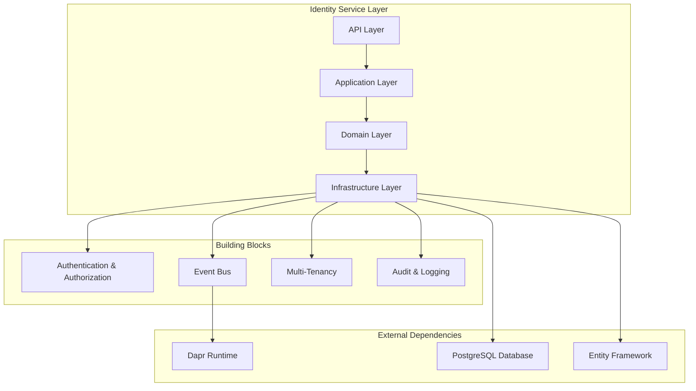

**Diagram sources**
- [Program.cs](file://src/Services/Identity/ErpSystem.Identity/Program.cs#L1-L71)
- [ErpSystem.Identity.csproj](file://src/Services/Identity/ErpSystem.Identity/ErpSystem.Identity.csproj#L1-L27)

**Section sources**
- [Program.cs](file://src/Services/Identity/ErpSystem.Identity/Program.cs#L1-L71)
- [ErpSystem.Identity.csproj](file://src/Services/Identity/ErpSystem.Identity/ErpSystem.Identity.csproj#L1-L27)

## Core Components

### Authentication and Authorization Framework
The service implements a robust authentication and authorization system with JWT token support and middleware-based security enforcement.

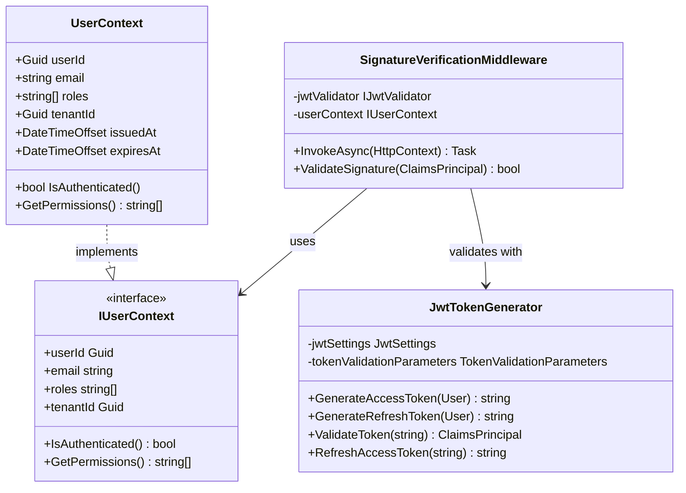

**Diagram sources**
- [UserContext.cs](file://src/BuildingBlocks/ErpSystem.BuildingBlocks/Auth/UserContext.cs)
- [IUserContext.cs](file://src/BuildingBlocks/ErpSystem.BuildingBlocks/Auth/IUserContext.cs)
- [SignatureVerificationMiddleware.cs](file://src/BuildingBlocks/ErpSystem.BuildingBlocks/Auth/SignatureVerificationMiddleware.cs)
- [JwtTokenGenerator.cs](file://src/Services/Identity/ErpSystem.Identity/Infrastructure/JwtTokenGenerator.cs)

### Multi-Tenant Isolation System
The service enforces strict multi-tenant isolation ensuring data segregation across different organizations while supporting tenant switching capabilities.

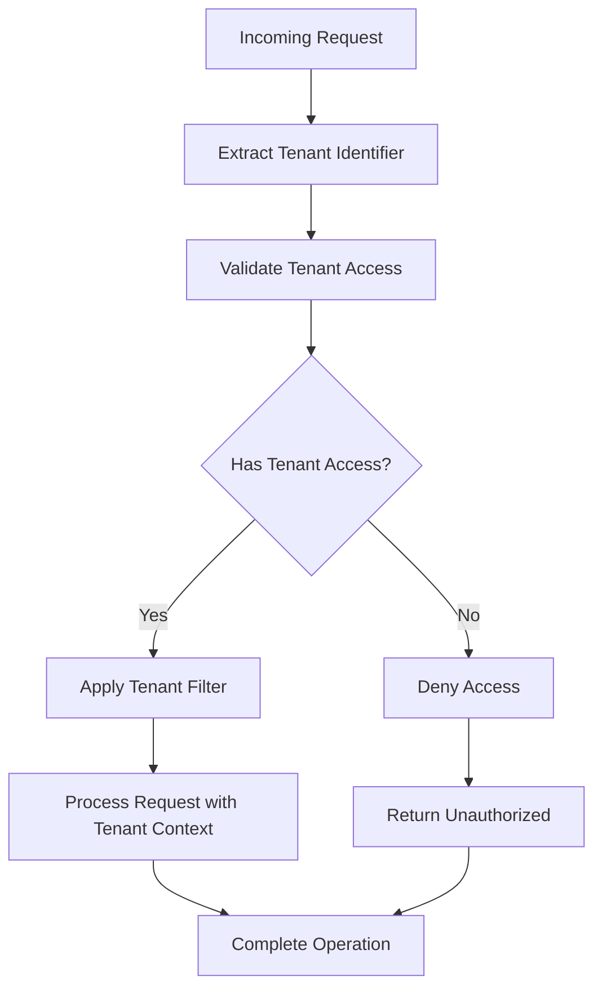

**Diagram sources**
- [MultiTenancy.cs](file://src/BuildingBlocks/ErpSystem.BuildingBlocks/MultiTenancy/MultiTenancy.cs)
- [UserContext.cs](file://src/BuildingBlocks/ErpSystem.BuildingBlocks/Auth/UserContext.cs)

### RBAC Implementation
The role-based access control system provides hierarchical permissions with support for fine-grained authorization checks.

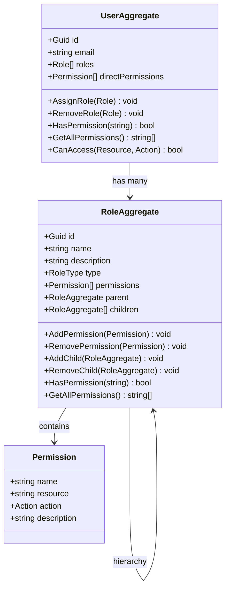

**Diagram sources**
- [RoleAggregate.cs](file://src/Services/Identity/ErpSystem.Identity/Domain/RoleAggregate.cs)
- [UserAggregate.cs](file://src/Services/Identity/ErpSystem.Identity/Domain/UserAggregate.cs)

**Section sources**
- [UserContext.cs](file://src/BuildingBlocks/ErpSystem.BuildingBlocks/Auth/UserContext.cs)
- [IUserContext.cs](file://src/BuildingBlocks/ErpSystem.BuildingBlocks/Auth/IUserContext.cs)
- [SignatureVerificationMiddleware.cs](file://src/BuildingBlocks/ErpSystem.BuildingBlocks/Auth/SignatureVerificationMiddleware.cs)
- [JwtTokenGenerator.cs](file://src/Services/Identity/ErpSystem.Identity/Infrastructure/JwtTokenGenerator.cs)
- [RoleAggregate.cs](file://src/Services/Identity/ErpSystem.Identity/Domain/RoleAggregate.cs)
- [UserAggregate.cs](file://src/Services/Identity/ErpSystem.Identity/Domain/UserAggregate.cs)

## Architecture Overview

The Identity service follows a hexagonal architecture pattern with clear separation of concerns:

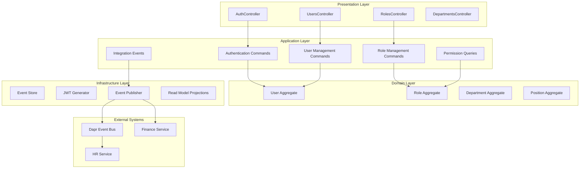

**Diagram sources**
- [Program.cs](file://src/Services/Identity/ErpSystem.Identity/Program.cs#L26-L37)
- [AuthController.cs](file://src/Services/Identity/ErpSystem.Identity/API/AuthController.cs)
- [UsersController.cs](file://src/Services/Identity/ErpSystem.Identity/API/UsersController.cs)
- [RolesController.cs](file://src/Services/Identity/ErpSystem.Identity/API/RolesController.cs)
- [DepartmentsController.cs](file://src/Services/Identity/ErpSystem.Identity/API/DepartmentsController.cs)

**Section sources**
- [Program.cs](file://src/Services/Identity/ErpSystem.Identity/Program.cs#L1-L71)

## Detailed Component Analysis

### Authentication Flow
The authentication system implements a comprehensive JWT-based authentication mechanism with refresh token support and signature verification.

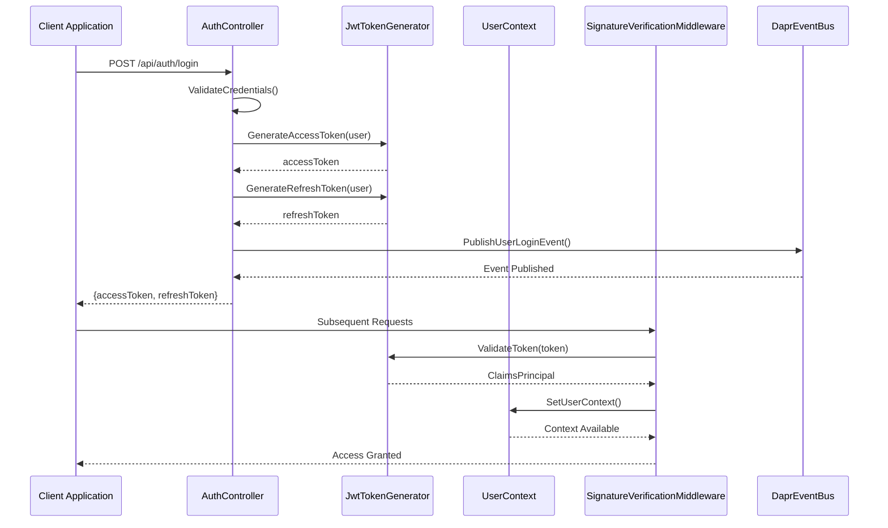

**Diagram sources**
- [AuthController.cs](file://src/Services/Identity/ErpSystem.Identity/API/AuthController.cs)
- [JwtTokenGenerator.cs](file://src/Services/Identity/ErpSystem.Identity/Infrastructure/JwtTokenGenerator.cs)
- [SignatureVerificationMiddleware.cs](file://src/BuildingBlocks/ErpSystem.BuildingBlocks/Auth/SignatureVerificationMiddleware.cs)
- [DaprEventBus.cs](file://src/BuildingBlocks/ErpSystem.BuildingBlocks/EventBus/DaprEventBus.cs)

### User Management Operations
The user management system provides comprehensive CRUD operations with validation, auditing, and event-driven updates.

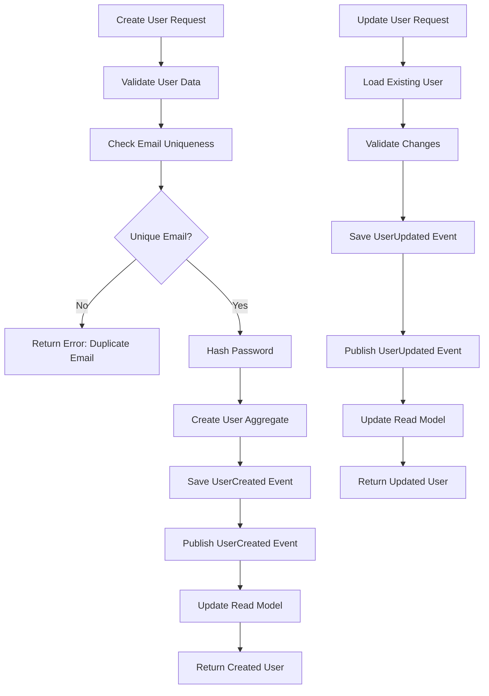

**Diagram sources**
- [UsersController.cs](file://src/Services/Identity/ErpSystem.Identity/API/UsersController.cs)
- [UserAggregate.cs](file://src/Services/Identity/ErpSystem.Identity/Domain/UserAggregate.cs)
- [EventStore.cs](file://src/Services/Identity/ErpSystem.Identity/Infrastructure/EventStore.cs)
- [Projections.cs](file://src/Services/Identity/ErpSystem.Identity/Infrastructure/Projections.cs)

### Role-Based Access Control Implementation
The RBAC system supports hierarchical roles with transitive permission inheritance and dynamic permission evaluation.

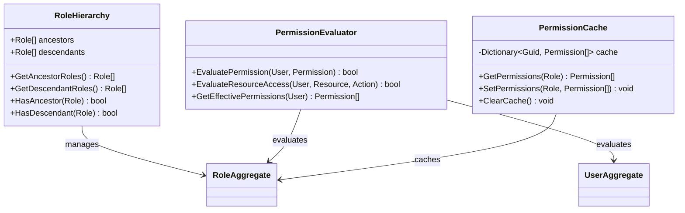

**Diagram sources**
- [RoleAggregate.cs](file://src/Services/Identity/ErpSystem.Identity/Domain/RoleAggregate.cs)
- [UserAggregate.cs](file://src/Services/Identity/ErpSystem.Identity/Domain/UserAggregate.cs)
- [DataPermissionQueries.cs](file://src/Services/Identity/ErpSystem.Identity/Application/DataPermissionQueries.cs)

### Multi-Tenant Isolation Mechanisms
The service implements strict tenant isolation through database filtering, context-aware operations, and tenant switching capabilities.

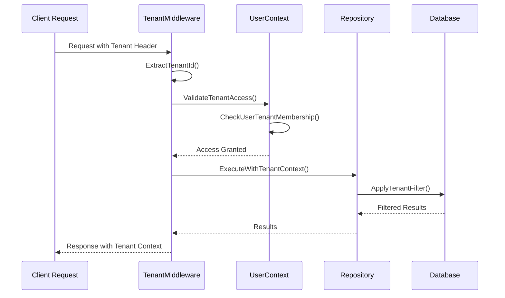

**Diagram sources**
- [MultiTenancy.cs](file://src/BuildingBlocks/ErpSystem.BuildingBlocks/MultiTenancy/MultiTenancy.cs)
- [UserContext.cs](file://src/BuildingBlocks/ErpSystem.BuildingBlocks/Auth/UserContext.cs)

### Department and Organizational Structure Management
The service manages hierarchical organizational structures with departments, positions, and reporting relationships.

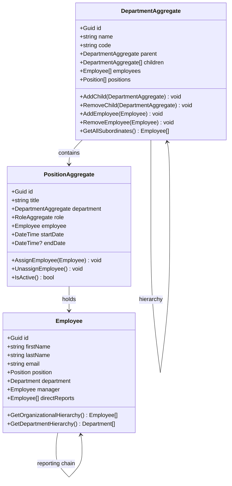

**Diagram sources**
- [DepartmentAggregate.cs](file://src/Services/Identity/ErpSystem.Identity/Domain/DepartmentAggregate.cs)
- [PositionAggregate.cs](file://src/Services/Identity/ErpSystem.Identity/Domain/PositionAggregate.cs)
- [UserAggregate.cs](file://src/Services/Identity/ErpSystem.Identity/Domain/UserAggregate.cs)

**Section sources**
- [AuthController.cs](file://src/Services/Identity/ErpSystem.Identity/API/AuthController.cs)
- [UsersController.cs](file://src/Services/Identity/ErpSystem.Identity/API/UsersController.cs)
- [RolesController.cs](file://src/Services/Identity/ErpSystem.Identity/API/RolesController.cs)
- [DepartmentsController.cs](file://src/Services/Identity/ErpSystem.Identity/API/DepartmentsController.cs)
- [JwtTokenGenerator.cs](file://src/Services/Identity/ErpSystem.Identity/Infrastructure/JwtTokenGenerator.cs)
- [EventPublisher.cs](file://src/Services/Identity/ErpSystem.Identity/Infrastructure/EventPublisher.cs)
- [EventStore.cs](file://src/Services/Identity/ErpSystem.Identity/Infrastructure/EventStore.cs)
- [Projections.cs](file://src/Services/Identity/ErpSystem.Identity/Infrastructure/Projections.cs)
- [UserAggregate.cs](file://src/Services/Identity/ErpSystem.Identity/Domain/UserAggregate.cs)
- [RoleAggregate.cs](file://src/Services/Identity/ErpSystem.Identity/Domain/RoleAggregate.cs)
- [DepartmentAggregate.cs](file://src/Services/Identity/ErpSystem.Identity/Domain/DepartmentAggregate.cs)
- [PositionAggregate.cs](file://src/Services/Identity/ErpSystem.Identity/Domain/PositionAggregate.cs)

## Dependency Analysis

The Identity service has well-defined dependencies that support its modular architecture:

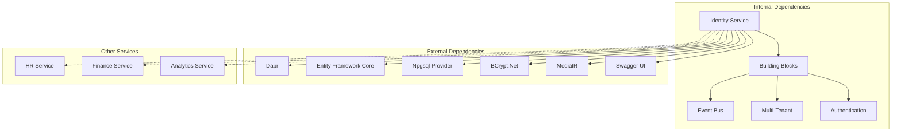

**Diagram sources**
- [ErpSystem.Identity.csproj](file://src/Services/Identity/ErpSystem.Identity/ErpSystem.Identity.csproj#L9-L24)

**Section sources**
- [ErpSystem.Identity.csproj](file://src/Services/Identity/ErpSystem.Identity/ErpSystem.Identity.csproj#L1-L27)

## Performance Considerations
The Identity service implements several performance optimization strategies:

- **Event Sourcing**: Uses event store for immutable audit trails and scalable read model updates
- **Caching**: Implements permission caching for frequently accessed role hierarchies
- **Asynchronous Processing**: Leverages MediatR for command/query handling with async/await patterns
- **Database Optimization**: Uses projection patterns for optimized read operations
- **JWT Token Caching**: Minimizes token validation overhead through efficient claims processing

## Troubleshooting Guide

### Common Authentication Issues
- **Token Validation Failures**: Verify JWT settings and signing keys configuration
- **Tenant Access Denied**: Check tenant membership and context propagation
- **Permission Denied Errors**: Review role hierarchies and permission assignments

### Event Bus Troubleshooting
- **Event Delivery Failures**: Monitor Dapr subscription endpoints and retry policies
- **Event Ordering Issues**: Implement idempotent event handlers
- **Projection Synchronization**: Verify event store and read model consistency

### Database Connectivity
- **Connection Pool Exhaustion**: Review connection string configuration and pooling settings
- **Migration Issues**: Ensure proper migration execution order
- **Schema Consistency**: Verify event store and read model schema alignment

**Section sources**
- [AuditLog.cs](file://src/BuildingBlocks/ErpSystem.BuildingBlocks/Auditing/AuditLog.cs)
- [OutboxProcessor.cs](file://src/BuildingBlocks/ErpSystem.BuildingBlocks/Outbox/OutboxProcessor.cs)

## Conclusion
The Identity and Access Control Service provides a comprehensive foundation for identity management in the ERP ecosystem. Its event-driven architecture, robust RBAC implementation, multi-tenant isolation, and JWT-based authentication create a scalable and secure platform for enterprise applications. The service's modular design enables easy integration with other microservices while maintaining strong security boundaries and audit capabilities.