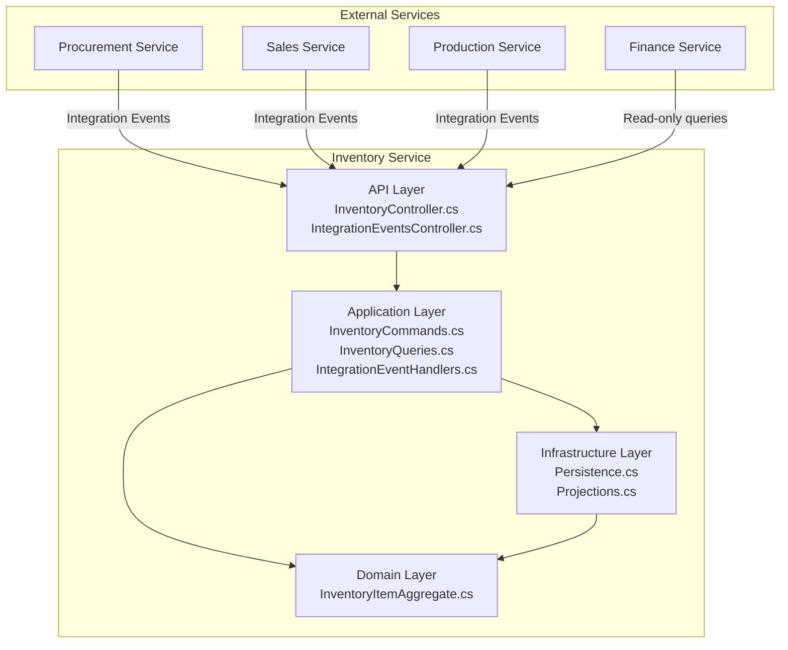
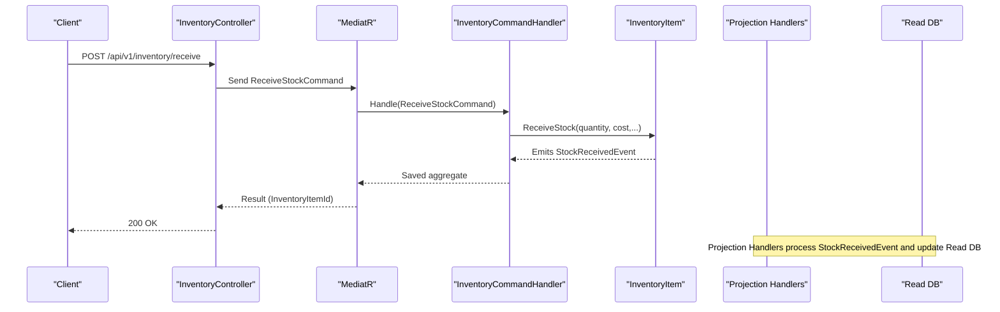
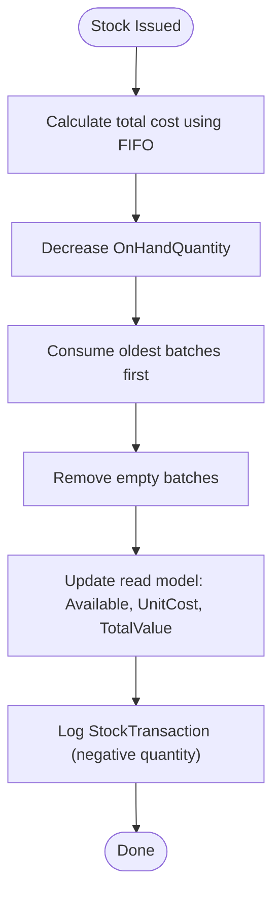
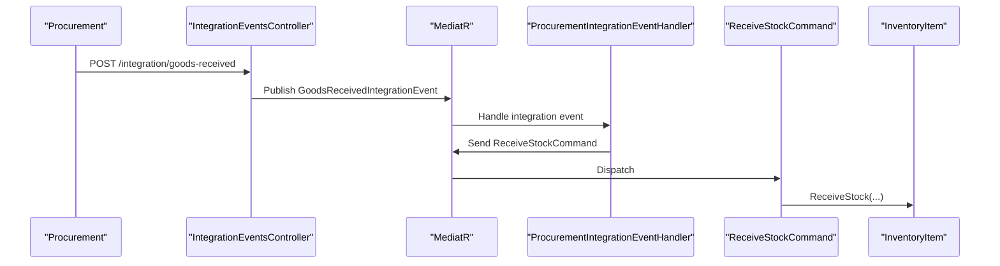

# Inventory Service

<cite>
**Referenced Files in This Document**
- [Program.cs](file://src/Services/Inventory/ErpSystem.Inventory/Program.cs)
- [InventoryController.cs](file://src/Services/Inventory/ErpSystem.Inventory/API/InventoryController.cs)
- [IntegrationEventsController.cs](file://src/Services/Inventory/ErpSystem.Inventory/API/IntegrationEventsController.cs)
- [InventoryCommands.cs](file://src/Services/Inventory/ErpSystem.Inventory/Application/InventoryCommands.cs)
- [InventoryQueries.cs](file://src/Services/Inventory/ErpSystem.Inventory/Application/InventoryQueries.cs)
- [IntegrationEventHandlers.cs](file://src/Services/Inventory/ErpSystem.Inventory/Application/IntegrationEventHandlers.cs)
- [InventoryItemAggregate.cs](file://src/Services/Inventory/ErpSystem.Inventory/Domain/InventoryItemAggregate.cs)
- [Persistence.cs](file://src/Services/Inventory/ErpSystem.Inventory/Infrastructure/Persistence.cs)
- [Projections.cs](file://src/Services/Inventory/ErpSystem.Inventory/Infrastructure/Projections.cs)
- [InventoryForecastService.cs](file://src/Services/Inventory/ErpSystem.Inventory/Domain/Services/InventoryForecastService.cs)
- [PRD-05-Inventory-Service.md](file://docs/PRD-05-Inventory-Service.md)
- [inventory.yaml](file://deploy/k8s/services/inventory.yaml)
- [WarehouseAggregate.cs](file://src/Services/MasterData/ErpSystem.MasterData/Domain/WarehouseAggregate.cs)
- [LocationAggregate.cs](file://src/Services/MasterData/ErpSystem.MasterData/Domain/LocationAggregate.cs)
</cite>

## Table of Contents
1. [Introduction](#introduction)
2. [Project Structure](#project-structure)
3. [Core Components](#core-components)
4. [Architecture Overview](#architecture-overview)
5. [Detailed Component Analysis](#detailed-component-analysis)
6. [Dependency Analysis](#dependency-analysis)
7. [Performance Considerations](#performance-considerations)
8. [Troubleshooting Guide](#troubleshooting-guide)
9. [Conclusion](#conclusion)
10. [Appendices](#appendices)

## Introduction
The Inventory service manages complete stock operations across multiple warehouses and materials, including receipts, issues, transfers, reservations, and adjustments. It records all movements as events, projects a read model optimized for queries, and exposes APIs for transactional operations and integration events. The service supports FIFO valuation at the batch level and integrates with Procurement (goods receipt), Sales (order fulfillment and reservations), and Production (material issuance and finished goods receipt). It also includes a domain service for inventory forecasting and is deployed as a Dapr-enabled microservice.

## Project Structure
The Inventory service follows a clean architecture with separate concerns:
- API layer: HTTP endpoints for inventory operations and integration event ingestion
- Application layer: CQRS commands/queries and handlers
- Domain layer: Aggregate root, value objects, and domain events
- Infrastructure layer: Event store persistence, read model projections, and database contexts



**Diagram sources**
- [InventoryController.cs](file://src/Services/Inventory/ErpSystem.Inventory/API/InventoryController.cs#L1-L44)
- [IntegrationEventsController.cs](file://src/Services/Inventory/ErpSystem.Inventory/API/IntegrationEventsController.cs#L1-L50)
- [InventoryCommands.cs](file://src/Services/Inventory/ErpSystem.Inventory/Application/InventoryCommands.cs#L1-L142)
- [InventoryQueries.cs](file://src/Services/Inventory/ErpSystem.Inventory/Application/InventoryQueries.cs#L1-L50)
- [IntegrationEventHandlers.cs](file://src/Services/Inventory/ErpSystem.Inventory/Application/IntegrationEventHandlers.cs#L1-L112)
- [InventoryItemAggregate.cs](file://src/Services/Inventory/ErpSystem.Inventory/Domain/InventoryItemAggregate.cs#L1-L255)
- [Persistence.cs](file://src/Services/Inventory/ErpSystem.Inventory/Infrastructure/Persistence.cs#L1-L79)
- [Projections.cs](file://src/Services/Inventory/ErpSystem.Inventory/Infrastructure/Projections.cs#L1-L211)

**Section sources**
- [Program.cs](file://src/Services/Inventory/ErpSystem.Inventory/Program.cs#L1-L74)
- [InventoryController.cs](file://src/Services/Inventory/ErpSystem.Inventory/API/InventoryController.cs#L1-L44)
- [IntegrationEventsController.cs](file://src/Services/Inventory/ErpSystem.Inventory/API/IntegrationEventsController.cs#L1-L50)
- [InventoryCommands.cs](file://src/Services/Inventory/ErpSystem.Inventory/Application/InventoryCommands.cs#L1-L142)
- [InventoryQueries.cs](file://src/Services/Inventory/ErpSystem.Inventory/Application/InventoryQueries.cs#L1-L50)
- [IntegrationEventHandlers.cs](file://src/Services/Inventory/ErpSystem.Inventory/Application/IntegrationEventHandlers.cs#L1-L112)
- [InventoryItemAggregate.cs](file://src/Services/Inventory/ErpSystem.Inventory/Domain/InventoryItemAggregate.cs#L1-L255)
- [Persistence.cs](file://src/Services/Inventory/ErpSystem.Inventory/Infrastructure/Persistence.cs#L1-L79)
- [Projections.cs](file://src/Services/Inventory/ErpSystem.Inventory/Infrastructure/Projections.cs#L1-L211)

## Core Components
- Event-sourced aggregate: InventoryItem encapsulates OnHand, Reserved, Available quantities and maintains FIFO batches for valuation
- Projection engine: Converts domain events into a normalized read model for fast queries
- Command handlers: Implement transactional operations (receive, issue, transfer, reserve, release, adjust)
- Query handlers: Provide inventory balances, search, and transaction history
- Integration endpoints: Accept integration events from Procurement, Sales, and Production
- Forecasting service: Provides stock depletion predictions (conceptual integration)

Key capabilities:
- Receipts, issues, transfers, adjustments, and reservations
- FIFO valuation with batch tracking
- Read model indexing for warehouse/bin/material lookups
- Integration event handlers for cross-service workflows
- Forecasting domain service for depletion prediction

**Section sources**
- [InventoryItemAggregate.cs](file://src/Services/Inventory/ErpSystem.Inventory/Domain/InventoryItemAggregate.cs#L90-L255)
- [Projections.cs](file://src/Services/Inventory/ErpSystem.Inventory/Infrastructure/Projections.cs#L7-L211)
- [InventoryCommands.cs](file://src/Services/Inventory/ErpSystem.Inventory/Application/InventoryCommands.cs#L60-L142)
- [InventoryQueries.cs](file://src/Services/Inventory/ErpSystem.Inventory/Application/InventoryQueries.cs#L13-L50)
- [IntegrationEventHandlers.cs](file://src/Services/Inventory/ErpSystem.Inventory/Application/IntegrationEventHandlers.cs#L14-L112)
- [InventoryForecastService.cs](file://src/Services/Inventory/ErpSystem.Inventory/Domain/Services/InventoryForecastService.cs#L7-L52)

## Architecture Overview
The service uses event sourcing and CQRS:
- Commands are handled by command handlers that load the aggregate, apply domain rules, and emit events
- Projections update the read model upon receiving domain events
- Queries read from the read database optimized for filtering and pagination
- Integration endpoints publish integration events consumed by other services



**Diagram sources**
- [InventoryController.cs](file://src/Services/Inventory/ErpSystem.Inventory/API/InventoryController.cs#L21-L22)
- [InventoryCommands.cs](file://src/Services/Inventory/ErpSystem.Inventory/Application/InventoryCommands.cs#L68-L89)
- [InventoryItemAggregate.cs](file://src/Services/Inventory/ErpSystem.Inventory/Domain/InventoryItemAggregate.cs#L116-L120)
- [Projections.cs](file://src/Services/Inventory/ErpSystem.Inventory/Infrastructure/Projections.cs#L39-L81)

**Section sources**
- [Program.cs](file://src/Services/Inventory/ErpSystem.Inventory/Program.cs#L10-L74)
- [InventoryController.cs](file://src/Services/Inventory/ErpSystem.Inventory/API/InventoryController.cs#L1-L44)
- [InventoryCommands.cs](file://src/Services/Inventory/ErpSystem.Inventory/Application/InventoryCommands.cs#L60-L142)
- [Projections.cs](file://src/Services/Inventory/ErpSystem.Inventory/Infrastructure/Projections.cs#L7-L211)

## Detailed Component Analysis

### API Endpoints
- GET /api/v1/inventory/items: Search inventory items by warehouse, bin, and material code with pagination
- GET /api/v1/inventory/available: Get available quantity for a specific warehouse/bin/material
- POST /api/v1/inventory/receive: Record stock receipt
- POST /api/v1/inventory/transfer: Transfer stock between bins/warehouses
- POST /api/v1/inventory/issue: Issue stock from inventory
- POST /api/v1/inventory/reservations: Create a reservation
- POST /api/v1/inventory/reservations/release: Release a reservation
- POST /api/v1/inventory/adjust: Adjust stock to a new quantity
- GET /api/v1/inventory/items/{id}/transactions: Retrieve stock transactions for an inventory item

Integration endpoints:
- POST /api/v1/inventory/integration/goods-received
- POST /api/v1/inventory/integration/order-confirmed
- POST /api/v1/inventory/integration/shipment-created
- POST /api/v1/inventory/integration/production-material-issued
- POST /api/v1/inventory/integration/production-completed

**Section sources**
- [InventoryController.cs](file://src/Services/Inventory/ErpSystem.Inventory/API/InventoryController.cs#L11-L43)
- [IntegrationEventsController.cs](file://src/Services/Inventory/ErpSystem.Inventory/API/IntegrationEventsController.cs#L10-L48)

### Commands and Handlers
- ReceiveStockCommand: Creates or loads an InventoryItem and records receipt
- TransferStockCommand: Moves stock between locations within the same aggregate
- IssueStockCommand: Issues stock, calculates cost using FIFO, and optionally releases a reservation
- ReserveStockCommand: Reserves stock for a source (e.g., sales order)
- ReleaseReservationCommand: Releases a reservation
- AdjustStockCommand: Adjusts stock to a new quantity

Validation and error handling:
- Positive quantity checks
- Available quantity sufficiency checks
- Reservation existence and expiry handling

**Section sources**
- [InventoryCommands.cs](file://src/Services/Inventory/ErpSystem.Inventory/Application/InventoryCommands.cs#L9-L142)
- [InventoryItemAggregate.cs](file://src/Services/Inventory/ErpSystem.Inventory/Domain/InventoryItemAggregate.cs#L116-L190)

### Queries and Read Model
- GetInventoryItemQuery: Retrieves a single inventory item by warehouse/bin/material
- SearchInventoryItemsQuery: Filters and paginates inventory items
- GetStockTransactionsQuery: Lists recent transactions for an inventory item

Read model fields include OnHand, Reserved, Available, UnitCost, TotalValue, and LastMovementAt. Unique index on (WarehouseId, BinId, MaterialId) ensures fast lookups.

**Section sources**
- [InventoryQueries.cs](file://src/Services/Inventory/ErpSystem.Inventory/Application/InventoryQueries.cs#L7-L50)
- [Persistence.cs](file://src/Services/Inventory/ErpSystem.Inventory/Infrastructure/Persistence.cs#L39-L79)

### Domain Events and Projections
Domain events emitted by InventoryItem:
- InventoryItemCreatedEvent
- StockReceivedEvent
- StockTransferredEvent
- StockIssuedEvent
- StockReservedEvent
- ReservationReleasedEvent
- StockAdjustedEvent

Projection handlers update the read model and create transaction records for auditability.



**Diagram sources**
- [InventoryItemAggregate.cs](file://src/Services/Inventory/ErpSystem.Inventory/Domain/InventoryItemAggregate.cs#L130-L171)
- [Projections.cs](file://src/Services/Inventory/ErpSystem.Inventory/Infrastructure/Projections.cs#L83-L118)

**Section sources**
- [InventoryItemAggregate.cs](file://src/Services/Inventory/ErpSystem.Inventory/Domain/InventoryItemAggregate.cs#L6-L88)
- [Projections.cs](file://src/Services/Inventory/ErpSystem.Inventory/Infrastructure/Projections.cs#L16-L210)

### Integration Patterns
- Procurement: GoodsReceivedIntegrationEvent triggers ReceiveStockCommand
- Sales: OrderConfirmedIntegrationEvent reserves stock; ShipmentCreatedIntegrationEvent issues stock
- Production: ProductionMaterialIssuedIntegrationEvent issues raw materials; ProductionCompletedIntegrationEvent receives finished goods



**Diagram sources**
- [IntegrationEventsController.cs](file://src/Services/Inventory/ErpSystem.Inventory/API/IntegrationEventsController.cs#L10-L16)
- [IntegrationEventHandlers.cs](file://src/Services/Inventory/ErpSystem.Inventory/Application/IntegrationEventHandlers.cs#L14-L32)
- [InventoryCommands.cs](file://src/Services/Inventory/ErpSystem.Inventory/Application/InventoryCommands.cs#L68-L89)

**Section sources**
- [IntegrationEventHandlers.cs](file://src/Services/Inventory/ErpSystem.Inventory/Application/IntegrationEventHandlers.cs#L14-L112)

### Inventory Valuation Methods
- FIFO: Batches tracked with ReceivedDate; issuing consumes oldest batches first; cost amount computed during issue
- UnitCost and TotalValue: Updated in projections; weighted average recalculated based on remaining quantities after issues
- Adjustments: AdjustStock updates OnHand and recalculates values accordingly

Note: The current implementation tracks batches for FIFO valuation and computes cost amounts during issue. Weighted average is reflected in UnitCost updates in projections.

**Section sources**
- [InventoryItemAggregate.cs](file://src/Services/Inventory/ErpSystem.Inventory/Domain/InventoryItemAggregate.cs#L100-L190)
- [Projections.cs](file://src/Services/Inventory/ErpSystem.Inventory/Infrastructure/Projections.cs#L83-L118)

### Physical Inventory, Cycle Counting, and Reconciliation
- Manual adjustment endpoint allows correcting quantities to align with physical counts
- Stock transactions provide audit trail for reconciliation
- Integration events from physical processes can trigger adjustments when discrepancies are identified

**Section sources**
- [InventoryController.cs](file://src/Services/Inventory/ErpSystem.Inventory/API/InventoryController.cs#L36-L37)
- [Projections.cs](file://src/Services/Inventory/ErpSystem.Inventory/Infrastructure/Projections.cs#L159-L183)

### Forecasting and Safety Stock
- Forecasting domain service provides depletion predictions (conceptual integration)
- Safety stock is part of the conceptual model described in the PRD

**Section sources**
- [InventoryForecastService.cs](file://src/Services/Inventory/ErpSystem.Inventory/Domain/Services/InventoryForecastService.cs#L7-L52)
- [PRD-05-Inventory-Service.md](file://docs/PRD-05-Inventory-Service.md#L91)

### Barcode and RFID Integration
- The PRD describes barcode/RFID integration for automated tracking in future iterations
- Current implementation focuses on warehouse/bin/material dimensionality and integration events

**Section sources**
- [PRD-05-Inventory-Service.md](file://docs/PRD-05-Inventory-Service.md#L60)

### Analytics, Shrinkage Tracking, Obsolete Inventory Management
- Analytics: Forecasting service and transaction logs support analytics
- Shrinkage: Adjustments and transaction history enable shrinkage tracking
- Obsolete: Adjustments and aging indicators can flag obsolete inventory

**Section sources**
- [InventoryForecastService.cs](file://src/Services/Inventory/ErpSystem.Inventory/Domain/Services/InventoryForecastService.cs#L17-L42)
- [Projections.cs](file://src/Services/Inventory/ErpSystem.Inventory/Infrastructure/Projections.cs#L159-L183)

## Dependency Analysis
- Event Store: Uses JSONB event streams keyed by AggregateId and Version
- Read DB: Optimized read model with unique index on (WarehouseId, BinId, MaterialId)
- External dependencies: MediatR for CQRS, Dapr EventBus for integration events
- Cross-service dependencies: Integration events from Procurement, Sales, and Production

```mermaid
graph LR
ES["EventStore DB"] <- --> |JSONB events| ESIdx["EventStream PK"]
ReadDB["Read DB"] <- --> |Unique Index| ReadIdx["(WarehouseId,BinId,MaterialId)"]
Med["MediatR"] --> Cmds["Command Handlers"]
Med --> Qrys["Query Handlers"]
Projections["Projection Handlers"] --> ReadDB
Cmds --> Agg["InventoryItem Aggregate"]
Agg --> Projections
```

**Diagram sources**
- [Persistence.cs](file://src/Services/Inventory/ErpSystem.Inventory/Infrastructure/Persistence.cs#L6-L37)
- [Projections.cs](file://src/Services/Inventory/ErpSystem.Inventory/Infrastructure/Projections.cs#L16-L37)

**Section sources**
- [Persistence.cs](file://src/Services/Inventory/ErpSystem.Inventory/Infrastructure/Persistence.cs#L1-L79)
- [Projections.cs](file://src/Services/Inventory/ErpSystem.Inventory/Infrastructure/Projections.cs#L1-L211)

## Performance Considerations
- Event store and read model are separate for scalability
- Unique index on (WarehouseId, BinId, MaterialId) accelerates lookups
- Pagination in queries prevents large result sets
- Lightweight read model avoids joins for frequent queries

[No sources needed since this section provides general guidance]

## Troubleshooting Guide
Common issues and resolutions:
- Insufficient available stock: Ensure reservations are released or increase receipts before issuing
- Reservation conflicts: Verify reservation IDs and expiry dates
- Missing inventory item: Confirm warehouse/bin/material combination exists before issuing
- Adjustment anomalies: Review transaction logs and reconcile differences

Operational checks:
- Verify read model consistency by querying recent transactions
- Monitor integration event delivery and handler logs
- Confirm unique index constraints prevent duplicate inventory items

**Section sources**
- [InventoryItemAggregate.cs](file://src/Services/Inventory/ErpSystem.Inventory/Domain/InventoryItemAggregate.cs#L122-L135)
- [Projections.cs](file://src/Services/Inventory/ErpSystem.Inventory/Infrastructure/Projections.cs#L16-L37)

## Conclusion
The Inventory service provides a robust, event-sourced foundation for managing stock across multiple warehouses with FIFO valuation, comprehensive transaction logging, and seamless integration with Procurement, Sales, and Production. Its modular design supports future enhancements such as batch/serial tracking, cycle counting, and advanced analytics while maintaining strong auditability and operational visibility.

[No sources needed since this section summarizes without analyzing specific files]

## Appendices

### Deployment and Runtime
- Dapr enabled with app-id "inventory-service"
- Health probes configured for Kubernetes
- Environment variables from ConfigMap and Secrets

**Section sources**
- [inventory.yaml](file://deploy/k8s/services/inventory.yaml#L20-L52)

### Master Data Context
- Warehouse and Location aggregates define storage dimensions used by inventory operations

**Section sources**
- [WarehouseAggregate.cs](file://src/Services/MasterData/ErpSystem.MasterData/Domain/WarehouseAggregate.cs#L18-L44)
- [LocationAggregate.cs](file://src/Services/MasterData/ErpSystem.MasterData/Domain/LocationAggregate.cs#L21-L49)