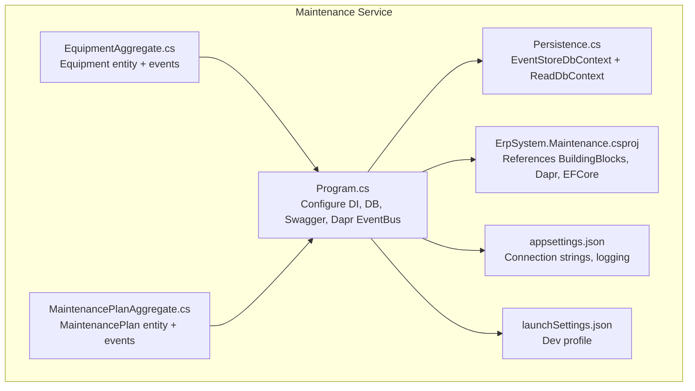
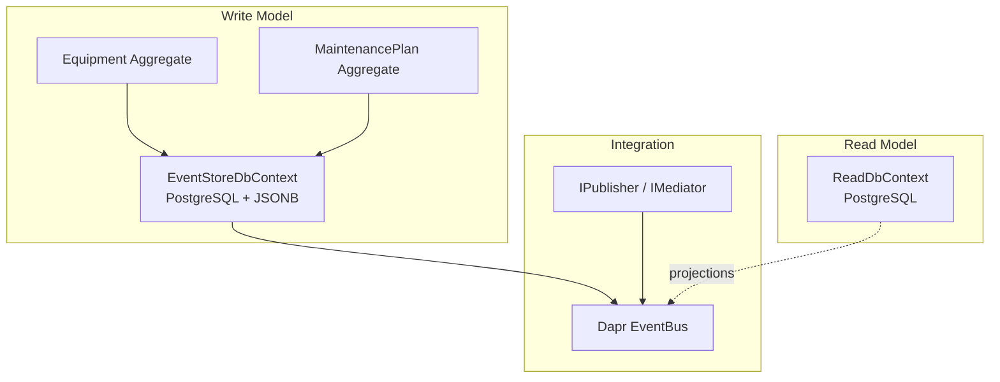
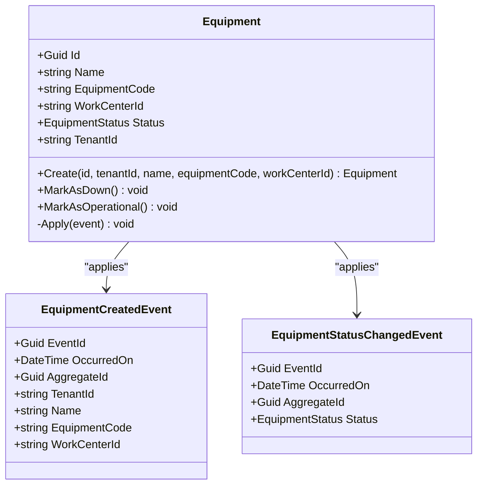
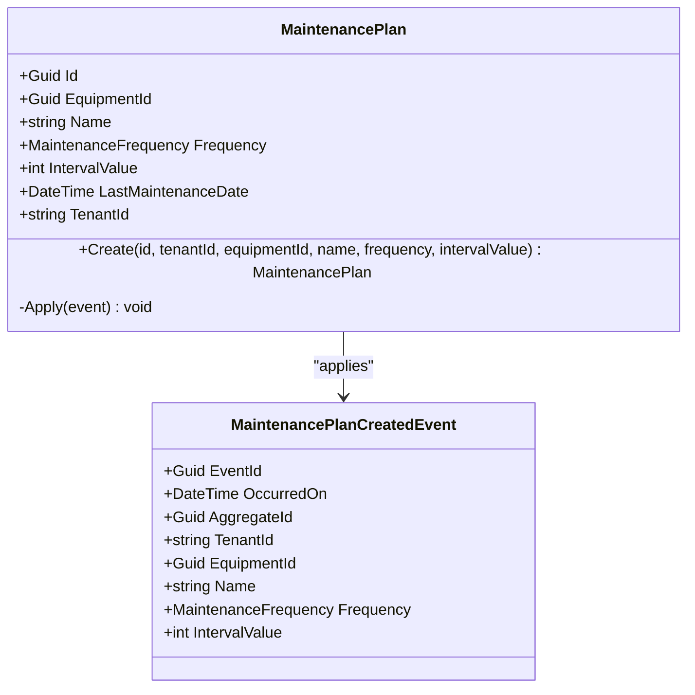
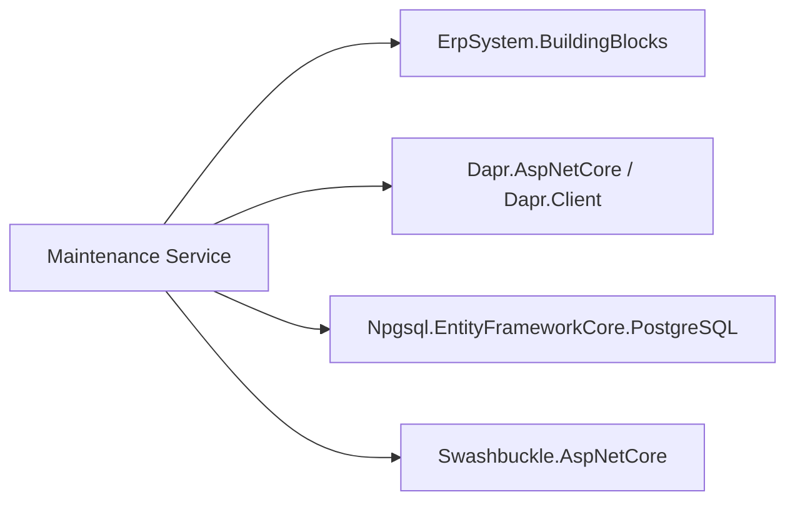

# Maintenance Service

<cite>
**Referenced Files in This Document**
- [Program.cs](file://src/Services/Maintenance/ErpSystem.Maintenance/Program.cs)
- [EquipmentAggregate.cs](file://src/Services/Maintenance/ErpSystem.Maintenance/Domain/EquipmentAggregate.cs)
- [MaintenancePlanAggregate.cs](file://src/Services/Maintenance/ErpSystem.Maintenance/Domain/MaintenancePlanAggregate.cs)
- [Persistence.cs](file://src/Services/Maintenance/ErpSystem.Maintenance/Infrastructure/Persistence.cs)
- [ErpSystem.Maintenance.csproj](file://src/Services/Maintenance/ErpSystem.Maintenance/ErpSystem.Maintenance.csproj)
- [appsettings.json](file://src/Services/Maintenance/ErpSystem.Maintenance/appsettings.json)
- [launchSettings.json](file://src/Services/Maintenance/ErpSystem.Maintenance/Properties/launchSettings.json)
</cite>

## Table of Contents
1. [Introduction](#introduction)
2. [Project Structure](#project-structure)
3. [Core Components](#core-components)
4. [Architecture Overview](#architecture-overview)
5. [Detailed Component Analysis](#detailed-component-analysis)
6. [Dependency Analysis](#dependency-analysis)
7. [Performance Considerations](#performance-considerations)
8. [Troubleshooting Guide](#troubleshooting-guide)
9. [Conclusion](#conclusion)
10. [Appendices](#appendices)

## Introduction
This document describes the Maintenance service responsible for equipment maintenance and work order processes. It covers preventive maintenance planning, work order execution, equipment history tracking, maintenance request processing, emergency repairs, cost tracking, and budget management. It also documents integration patterns with Assets for equipment information, Inventory for parts management, and Projects for maintenance project tracking. Finally, it outlines maintenance analytics, reliability metrics, and predictive maintenance scheduling.

## Project Structure
The Maintenance service is a .NET microservice with:
- Domain layer containing aggregates and domain events for equipment and maintenance plans
- Infrastructure layer implementing event sourcing persistence and read-side projections
- Application layer (not present in current snapshot) would host commands, queries, handlers, and APIs
- API controllers (not present in current snapshot) would expose endpoints for planning, execution, and tracking
- Integration with Dapr for event bus and potential state store
- PostgreSQL-backed event store and read database

**Diagram sources**
- [Program.cs](file://src/Services/Maintenance/ErpSystem.Maintenance/Program.cs#L1-L62)
- [EquipmentAggregate.cs](file://src/Services/Maintenance/ErpSystem.Maintenance/Domain/EquipmentAggregate.cs#L1-L92)
- [MaintenancePlanAggregate.cs](file://src/Services/Maintenance/ErpSystem.Maintenance/Domain/MaintenancePlanAggregate.cs#L1-L73)
- [Persistence.cs](file://src/Services/Maintenance/ErpSystem.Maintenance/Infrastructure/Persistence.cs#L1-L27)
- [ErpSystem.Maintenance.csproj](file://src/Services/Maintenance/ErpSystem.Maintenance/ErpSystem.Maintenance.csproj#L1-L22)
- [appsettings.json](file://src/Services/Maintenance/ErpSystem.Maintenance/appsettings.json#L1-L12)
- [launchSettings.json](file://src/Services/Maintenance/ErpSystem.Maintenance/Properties/launchSettings.json#L1-L12)

**Section sources**
- [Program.cs](file://src/Services/Maintenance/ErpSystem.Maintenance/Program.cs#L1-L62)
- [EquipmentAggregate.cs](file://src/Services/Maintenance/ErpSystem.Maintenance/Domain/EquipmentAggregate.cs#L1-L92)
- [MaintenancePlanAggregate.cs](file://src/Services/Maintenance/ErpSystem.Maintenance/Domain/MaintenancePlanAggregate.cs#L1-L73)
- [Persistence.cs](file://src/Services/Maintenance/ErpSystem.Maintenance/Infrastructure/Persistence.cs#L1-L27)
- [ErpSystem.Maintenance.csproj](file://src/Services/Maintenance/ErpSystem.Maintenance/ErpSystem.Maintenance.csproj#L1-L22)
- [appsettings.json](file://src/Services/Maintenance/ErpSystem.Maintenance/appsettings.json#L1-L12)
- [launchSettings.json](file://src/Services/Maintenance/ErpSystem.Maintenance/Properties/launchSettings.json#L1-L12)

## Core Components
- Equipment aggregate: models machinery with status lifecycle (operational, down, in maintenance) and emits creation and status change events.
- MaintenancePlan aggregate: defines recurring maintenance schedules with frequency and intervals, and emits plan creation events.
- Event store persistence: PostgreSQL-backed event sourcing with JSONB payload storage and composite keys for event streams.
- Read database: separate read model context for projections and reporting.
- Dapr integration: event bus registration for cross-service communication.
- MediatR integration: command/query pipeline via handlers (registered assembly scanning).
- API surface: controllers registration and Swagger enabled in development.

**Section sources**
- [EquipmentAggregate.cs](file://src/Services/Maintenance/ErpSystem.Maintenance/Domain/EquipmentAggregate.cs#L8-L63)
- [MaintenancePlanAggregate.cs](file://src/Services/Maintenance/ErpSystem.Maintenance/Domain/MaintenancePlanAggregate.cs#L8-L51)
- [Persistence.cs](file://src/Services/Maintenance/ErpSystem.Maintenance/Infrastructure/Persistence.cs#L6-L26)
- [Program.cs](file://src/Services/Maintenance/ErpSystem.Maintenance/Program.cs#L10-L37)

## Architecture Overview
The service follows an event-sourced domain model with separate write/read contexts. The event store captures all state changes as domain events. Read models are projected from these events for querying and dashboards. Dapr provides event bus capabilities for integration with other services.

**Diagram sources**
- [Persistence.cs](file://src/Services/Maintenance/ErpSystem.Maintenance/Infrastructure/Persistence.cs#L6-L26)
- [Program.cs](file://src/Services/Maintenance/ErpSystem.Maintenance/Program.cs#L16-L30)

**Section sources**
- [Program.cs](file://src/Services/Maintenance/ErpSystem.Maintenance/Program.cs#L16-L30)
- [Persistence.cs](file://src/Services/Maintenance/ErpSystem.Maintenance/Infrastructure/Persistence.cs#L6-L26)

## Detailed Component Analysis

### Equipment Aggregate
The Equipment aggregate encapsulates equipment identity, metadata, and status transitions. It applies events to evolve state and guards against redundant status changes.

**Diagram sources**
- [EquipmentAggregate.cs](file://src/Services/Maintenance/ErpSystem.Maintenance/Domain/EquipmentAggregate.cs#L8-L63)
- [EquipmentAggregate.cs](file://src/Services/Maintenance/ErpSystem.Maintenance/Domain/EquipmentAggregate.cs#L72-L91)

**Section sources**
- [EquipmentAggregate.cs](file://src/Services/Maintenance/ErpSystem.Maintenance/Domain/EquipmentAggregate.cs#L8-L63)

### Maintenance Plan Aggregate
The MaintenancePlan aggregate defines recurring maintenance schedules for equipment, including frequency and interval values. It tracks last maintenance date and tenant scoping.

**Diagram sources**
- [MaintenancePlanAggregate.cs](file://src/Services/Maintenance/ErpSystem.Maintenance/Domain/MaintenancePlanAggregate.cs#L8-L51)
- [MaintenancePlanAggregate.cs](file://src/Services/Maintenance/ErpSystem.Maintenance/Domain/MaintenancePlanAggregate.cs#L61-L72)

**Section sources**
- [MaintenancePlanAggregate.cs](file://src/Services/Maintenance/ErpSystem.Maintenance/Domain/MaintenancePlanAggregate.cs#L8-L51)

### Preventive Maintenance Planning
- Scheduling: MaintenancePlan stores frequency and interval values per equipment. The plan’s last maintenance date can be used to compute next due date.
- Checklists and resources: Not modeled in current snapshot; would be implemented via application layer commands and read projections.
- Resource allocation: Would integrate with Inventory for parts and Projects for labor/project assignments.

[No sources needed since this section synthesizes planning concepts from aggregates]

### Work Order Management
- Priority and routing: Not modeled in current snapshot; would be introduced via application commands and handlers.
- Technician assignment and completion tracking: Would be implemented in the application layer with commands for assignment, progress updates, and closure.

[No sources needed since this section describes planned application-layer features]

### Equipment History Tracking
- Maintenance records: Events emitted by Equipment and MaintenancePlan capture lifecycle and schedule changes.
- Parts replacement: Would be modeled via Inventory integration and application commands.
- Performance metrics: Would be derived from read projections and analytics integrations.

[No sources needed since this section describes future read-model and analytics features]

### Maintenance Request Processing and Emergency Repairs
- Request intake: Would be handled by application commands to create requests and initiate workflows.
- Emergency workflows: Would include fast-tracked routing and escalation rules.

[No sources needed since this section describes planned application-layer features]

### Maintenance Cost Tracking and Budget Management
- Cost recording: Would be implemented via application commands and read projections.
- Budget management: Would integrate with Finance service for budgets and cost centers.

[No sources needed since this section describes planned application-layer features]

### API Endpoints (Planned)
The service registers controllers and Swagger in development. Typical endpoints would include:
- Maintenance planning: Create/update/delete maintenance plans; list plans by equipment
- Work order execution: Create requests; assign technicians; update progress; close work orders
- Equipment tracking: List equipment; update status; view history
- Analytics: KPIs, reliability metrics, predictive maintenance signals

[No sources needed since this section describes planned API surface]

## Dependency Analysis
External and internal dependencies:
- BuildingBlocks: Domain abstractions, event bus, mediator, and infrastructure helpers
- Dapr: Event bus integration
- Entity Framework Core: PostgreSQL provider for event store and read models
- Swagger: API documentation in development

**Diagram sources**
- [ErpSystem.Maintenance.csproj](file://src/Services/Maintenance/ErpSystem.Maintenance/ErpSystem.Maintenance.csproj#L9-L19)

**Section sources**
- [ErpSystem.Maintenance.csproj](file://src/Services/Maintenance/ErpSystem.Maintenance/ErpSystem.Maintenance.csproj#L1-L22)

## Performance Considerations
- Event store sizing: Use JSONB payloads efficiently; consider event compression and partitioning strategies.
- Read model refresh: Implement incremental projections to avoid full rebuilds.
- Query optimization: Index event stream by aggregate and tenant; add range indexes for time-series analytics.
- Caching: Cache frequently accessed equipment and plan metadata using BuildingBlocks caching extensions.
- Scalability: Horizontal scaling via Dapr pub/sub and idempotent event processing.

[No sources needed since this section provides general guidance]

## Troubleshooting Guide
- Database connectivity: Verify connection string in configuration and network access to PostgreSQL.
- Migration and initialization: Ensure EnsureCreatedAsync runs in non-testing environments.
- Event deserialization: Confirm event type resolution matches aggregate namespaces.
- Dapr integration: Validate sidecar availability and component configurations.

**Section sources**
- [appsettings.json](file://src/Services/Maintenance/ErpSystem.Maintenance/appsettings.json#L8-L10)
- [Program.cs](file://src/Services/Maintenance/ErpSystem.Maintenance/Program.cs#L42-L49)
- [Program.cs](file://src/Services/Maintenance/ErpSystem.Maintenance/Program.cs#L25-L30)

## Conclusion
The Maintenance service establishes a robust event-sourced foundation for equipment lifecycle and maintenance planning. While the application and API layers are not yet present in this snapshot, the domain and infrastructure components provide a strong base for building preventive maintenance workflows, work order execution, equipment history tracking, and integration with Assets, Inventory, and Projects. Future enhancements will focus on application commands, analytics, and real-time dashboards.

## Appendices

### Integration Patterns
- Assets: Consume equipment metadata and status changes; publish equipment events to the event bus.
- Inventory: Integrate parts consumption and reorder triggers via application commands and events.
- Projects: Link maintenance tasks to project work breakdown structures and track labor hours.

[No sources needed since this section describes conceptual integration patterns]

### Maintenance Analytics and Predictive Scheduling
- Reliability metrics: Track MTBF, MTTR, and failure rates from event streams.
- Predictive scheduling: Use historical event data and sensor telemetry to forecast maintenance needs.

[No sources needed since this section describes conceptual analytics features]