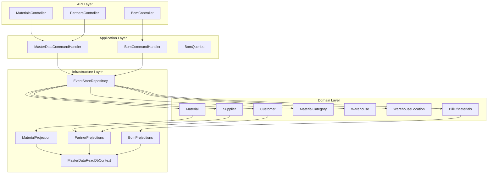
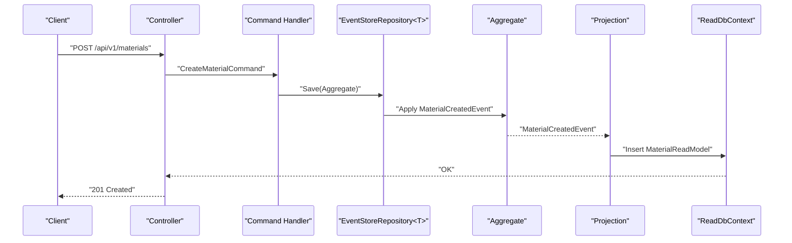
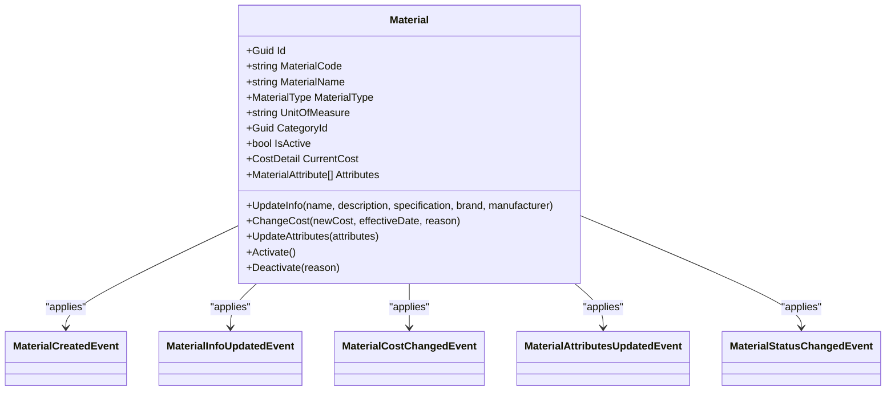
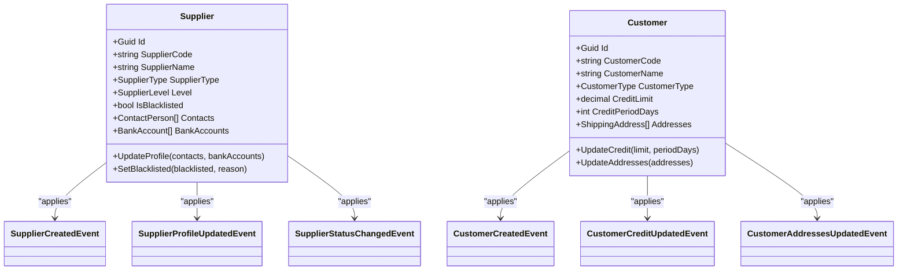
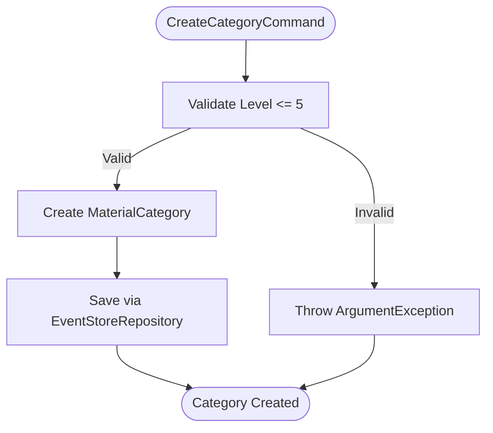
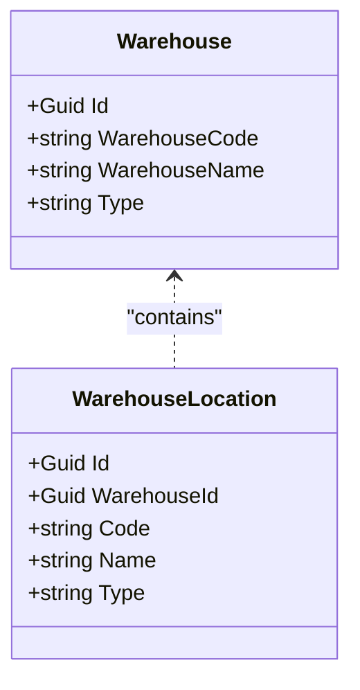
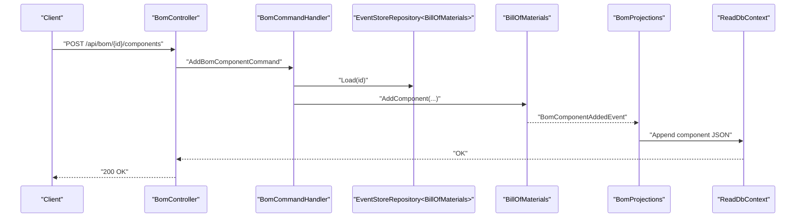
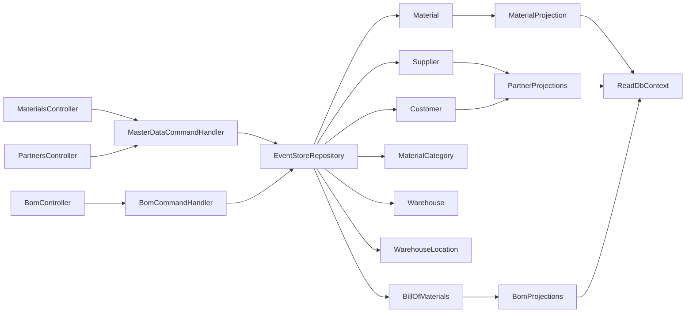

# Master Data Management Service

<cite>
**Referenced Files in This Document**
- [Program.cs](file://src/Services/MasterData/ErpSystem.MasterData/Program.cs)
- [MasterControllers.cs](file://src/Services/MasterData/ErpSystem.MasterData/Controllers/MasterControllers.cs)
- [BOMController.cs](file://src/Services/MasterData/ErpSystem.MasterData/Controllers/BOMController.cs)
- [MasterCommands.cs](file://src/Services/MasterData/ErpSystem.MasterData/Application/MasterCommands.cs)
- [BOMCommands.cs](file://src/Services/MasterData/ErpSystem.MasterData/Application/BOMCommands.cs)
- [MaterialAggregate.cs](file://src/Services/MasterData/ErpSystem.MasterData/Domain/MaterialAggregate.cs)
- [SupplierAggregate.cs](file://src/Services/MasterData/ErpSystem.MasterData/Domain/SupplierAggregate.cs)
- [CustomerAggregate.cs](file://src/Services/MasterData/ErpSystem.MasterData/Domain/CustomerAggregate.cs)
- [CategoryAggregate.cs](file://src/Services/MasterData/ErpSystem.MasterData/Domain/CategoryAggregate.cs)
- [WarehouseAggregate.cs](file://src/Services/MasterData/ErpSystem.MasterData/Domain/WarehouseAggregate.cs)
- [BillOfMaterialsAggregate.cs](file://src/Services/MasterData/ErpSystem.MasterData/Domain/BillOfMaterialsAggregate.cs)
- [LocationAggregate.cs](file://src/Services/MasterData/ErpSystem.MasterData/Domain/LocationAggregate.cs)
- [MaterialProjections.cs](file://src/Services/MasterData/ErpSystem.MasterData/Infrastructure/MaterialProjections.cs)
- [PartnerProjections.cs](file://src/Services/MasterData/ErpSystem.MasterData/Infrastructure/PartnerProjections.cs)
- [BOMProjections.cs](file://src/Services/MasterData/ErpSystem.MasterData/Infrastructure/BOMProjections.cs)
</cite>

## Table of Contents
1. [Introduction](#introduction)
2. [Project Structure](#project-structure)
3. [Core Components](#core-components)
4. [Architecture Overview](#architecture-overview)
5. [Detailed Component Analysis](#detailed-component-analysis)
6. [Dependency Analysis](#dependency-analysis)
7. [Performance Considerations](#performance-considerations)
8. [Troubleshooting Guide](#troubleshooting-guide)
9. [Conclusion](#conclusion)
10. [Appendices](#appendices)

## Introduction
This document describes the Master Data Management service, focusing on core business entities and operational capabilities across materials, suppliers, customers, categories, warehouses, locations, and bills of materials (BOM). It explains CRUD APIs, event-driven projections for read models, validation rules, and governance-related mechanisms such as audit and change tracking. The service follows CQRS and event-sourcing patterns with domain events driving projections for read-side access.

## Project Structure
The Master Data service is organized by layers:
- Application: CQRS commands and handlers, queries
- Domain: Aggregates, value objects, and domain events
- Infrastructure: Event store repositories, projections, and read database
- API: Controllers exposing REST endpoints

**Diagram sources**
- [Program.cs](file://src/Services/MasterData/ErpSystem.MasterData/Program.cs#L1-L68)
- [MasterControllers.cs](file://src/Services/MasterData/ErpSystem.MasterData/Controllers/MasterControllers.cs#L1-L79)
- [BOMController.cs](file://src/Services/MasterData/ErpSystem.MasterData/Controllers/BOMController.cs#L1-L54)
- [MasterCommands.cs](file://src/Services/MasterData/ErpSystem.MasterData/Application/MasterCommands.cs#L1-L110)
- [BOMCommands.cs](file://src/Services/MasterData/ErpSystem.MasterData/Application/BOMCommands.cs#L1-L49)
- [MaterialProjections.cs](file://src/Services/MasterData/ErpSystem.MasterData/Infrastructure/MaterialProjections.cs#L1-L75)
- [PartnerProjections.cs](file://src/Services/MasterData/ErpSystem.MasterData/Infrastructure/PartnerProjections.cs#L1-L80)
- [BOMProjections.cs](file://src/Services/MasterData/ErpSystem.MasterData/Infrastructure/BOMProjections.cs#L1-L50)

**Section sources**
- [Program.cs](file://src/Services/MasterData/ErpSystem.MasterData/Program.cs#L1-L68)

## Core Components
- Materials: Product definitions with type, unit of measure, category, cost, attributes, and lifecycle status.
- Suppliers and Customers: Partner profiles with contact, banking, addresses, and credit terms.
- Categories: Hierarchical classification up to five levels.
- Warehouses and Locations: Storage facilities and physical sublocations (area, shelf, bin).
- BOM: Production structures linking parent material to components with quantities and status.

**Section sources**
- [MaterialAggregate.cs](file://src/Services/MasterData/ErpSystem.MasterData/Domain/MaterialAggregate.cs#L1-L178)
- [SupplierAggregate.cs](file://src/Services/MasterData/ErpSystem.MasterData/Domain/SupplierAggregate.cs#L1-L125)
- [CustomerAggregate.cs](file://src/Services/MasterData/ErpSystem.MasterData/Domain/CustomerAggregate.cs#L1-L96)
- [CategoryAggregate.cs](file://src/Services/MasterData/ErpSystem.MasterData/Domain/CategoryAggregate.cs#L1-L67)
- [WarehouseAggregate.cs](file://src/Services/MasterData/ErpSystem.MasterData/Domain/WarehouseAggregate.cs#L1-L44)
- [LocationAggregate.cs](file://src/Services/MasterData/ErpSystem.MasterData/Domain/LocationAggregate.cs#L1-L49)
- [BillOfMaterialsAggregate.cs](file://src/Services/MasterData/ErpSystem.MasterData/Domain/BillOfMaterialsAggregate.cs#L1-L125)

## Architecture Overview
The service uses:
- CQRS with MediatR for commands and handlers
- Event sourcing via an event store repository
- Domain events trigger projections to a read database
- Controllers expose REST endpoints for CRUD operations

**Diagram sources**
- [MasterControllers.cs](file://src/Services/MasterData/ErpSystem.MasterData/Controllers/MasterControllers.cs#L1-L79)
- [MasterCommands.cs](file://src/Services/MasterData/ErpSystem.MasterData/Application/MasterCommands.cs#L1-L110)
- [MaterialAggregate.cs](file://src/Services/MasterData/ErpSystem.MasterData/Domain/MaterialAggregate.cs#L1-L178)
- [MaterialProjections.cs](file://src/Services/MasterData/ErpSystem.MasterData/Infrastructure/MaterialProjections.cs#L1-L75)

## Detailed Component Analysis

### Materials Management
- Entities: Material aggregate with info, cost, attributes, and status.
- Commands: Create material, update info, update attributes.
- Projections: Maintain MaterialReadModel for efficient reads.

**Diagram sources**
- [MaterialAggregate.cs](file://src/Services/MasterData/ErpSystem.MasterData/Domain/MaterialAggregate.cs#L1-L178)

**Section sources**
- [MaterialAggregate.cs](file://src/Services/MasterData/ErpSystem.MasterData/Domain/MaterialAggregate.cs#L1-L178)
- [MasterControllers.cs](file://src/Services/MasterData/ErpSystem.MasterData/Controllers/MasterControllers.cs#L1-L79)
- [MasterCommands.cs](file://src/Services/MasterData/ErpSystem.MasterData/Application/MasterCommands.cs#L1-L110)
- [MaterialProjections.cs](file://src/Services/MasterData/ErpSystem.MasterData/Infrastructure/MaterialProjections.cs#L1-L75)

### Suppliers and Customers
- Suppliers: Profile with contacts, bank accounts, blacklist status, and tier level.
- Customers: Addresses, credit limit, and credit period.
- Commands: Create supplier/customer, update profile/addresses.
- Projections: SupplierReadModel and CustomerReadModel.

**Diagram sources**
- [SupplierAggregate.cs](file://src/Services/MasterData/ErpSystem.MasterData/Domain/SupplierAggregate.cs#L1-L125)
- [CustomerAggregate.cs](file://src/Services/MasterData/ErpSystem.MasterData/Domain/CustomerAggregate.cs#L1-L96)

**Section sources**
- [SupplierAggregate.cs](file://src/Services/MasterData/ErpSystem.MasterData/Domain/SupplierAggregate.cs#L1-L125)
- [CustomerAggregate.cs](file://src/Services/MasterData/ErpSystem.MasterData/Domain/CustomerAggregate.cs#L1-L96)
- [MasterControllers.cs](file://src/Services/MasterData/ErpSystem.MasterData/Controllers/MasterControllers.cs#L47-L79)
- [MasterCommands.cs](file://src/Services/MasterData/ErpSystem.MasterData/Application/MasterCommands.cs#L26-L34)
- [PartnerProjections.cs](file://src/Services/MasterData/ErpSystem.MasterData/Infrastructure/PartnerProjections.cs#L1-L80)

### Categories (Classification Hierarchies)
- MaterialCategory supports hierarchical categories up to five levels.
- Commands: Create category; handler generates code and persists.

**Diagram sources**
- [CategoryAggregate.cs](file://src/Services/MasterData/ErpSystem.MasterData/Domain/CategoryAggregate.cs#L1-L67)
- [MasterCommands.cs](file://src/Services/MasterData/ErpSystem.MasterData/Application/MasterCommands.cs#L92-L99)

**Section sources**
- [CategoryAggregate.cs](file://src/Services/MasterData/ErpSystem.MasterData/Domain/CategoryAggregate.cs#L1-L67)
- [MasterCommands.cs](file://src/Services/MasterData/ErpSystem.MasterData/Application/MasterCommands.cs#L36-L41)
- [MasterCommands.cs](file://src/Services/MasterData/ErpSystem.MasterData/Application/MasterCommands.cs#L92-L99)

### Warehouses and Locations
- Warehouse: Storage facility with code, name, and type.
- WarehouseLocation: Sublocation with type (area/shelf/bin) linked to a warehouse.
- Commands: Create location; handler generates code and persists.

**Diagram sources**
- [WarehouseAggregate.cs](file://src/Services/MasterData/ErpSystem.MasterData/Domain/WarehouseAggregate.cs#L1-L44)
- [LocationAggregate.cs](file://src/Services/MasterData/ErpSystem.MasterData/Domain/LocationAggregate.cs#L1-L49)

**Section sources**
- [WarehouseAggregate.cs](file://src/Services/MasterData/ErpSystem.MasterData/Domain/WarehouseAggregate.cs#L1-L44)
- [LocationAggregate.cs](file://src/Services/MasterData/ErpSystem.MasterData/Domain/LocationAggregate.cs#L1-L49)
- [MasterCommands.cs](file://src/Services/MasterData/ErpSystem.MasterData/Application/MasterCommands.cs#L40)
- [MasterCommands.cs](file://src/Services/MasterData/ErpSystem.MasterData/Application/MasterCommands.cs#L101-L108)

### BOM Management
- BillOfMaterials: Parent material, version, effective date, status, and components.
- Commands: Add component, activate BOM; handlers enforce business rules.
- Queries: Retrieve all BOMs, by ID, or by parent material.

**Diagram sources**
- [BOMController.cs](file://src/Services/MasterData/ErpSystem.MasterData/Controllers/BOMController.cs#L1-L54)
- [BOMCommands.cs](file://src/Services/MasterData/ErpSystem.MasterData/Application/BOMCommands.cs#L1-L49)
- [BillOfMaterialsAggregate.cs](file://src/Services/MasterData/ErpSystem.MasterData/Domain/BillOfMaterialsAggregate.cs#L1-L125)
- [BOMProjections.cs](file://src/Services/MasterData/ErpSystem.MasterData/Infrastructure/BOMProjections.cs#L1-L50)

**Section sources**
- [BillOfMaterialsAggregate.cs](file://src/Services/MasterData/ErpSystem.MasterData/Domain/BillOfMaterialsAggregate.cs#L1-L125)
- [BOMController.cs](file://src/Services/MasterData/ErpSystem.MasterData/Controllers/BOMController.cs#L1-L54)
- [BOMCommands.cs](file://src/Services/MasterData/ErpSystem.MasterData/Application/BOMCommands.cs#L1-L49)
- [BOMProjections.cs](file://src/Services/MasterData/ErpSystem.MasterData/Infrastructure/BOMProjections.cs#L1-L50)

### API Endpoints
- Materials
  - POST /api/v1/materials
  - GET /api/v1/materials
  - GET /api/v1/materials/{id}
  - PUT /api/v1/materials/{id}/info
  - PUT /api/v1/materials/{id}/attributes
- Partners
  - POST /api/v1/partners/suppliers
  - PUT /api/v1/partners/suppliers/{id}/profile
  - POST /api/v1/partners/customers
  - GET /api/v1/partners/suppliers
  - GET /api/v1/partners/customers
- BOM
  - GET /api/bom
  - GET /api/bom/{id}
  - GET /api/bom/material/{materialId}
  - POST /api/bom
  - POST /api/bom/{id}/components
  - POST /api/bom/{id}/activate

**Section sources**
- [MasterControllers.cs](file://src/Services/MasterData/ErpSystem.MasterData/Controllers/MasterControllers.cs#L1-L79)
- [BOMController.cs](file://src/Services/MasterData/ErpSystem.MasterData/Controllers/BOMController.cs#L1-L54)

## Dependency Analysis
- Controllers depend on MediatR to dispatch commands and queries.
- Command handlers depend on typed repositories to load/save aggregates.
- Aggregates publish domain events applied to the event store.
- Projections subscribe to domain events and update read models.
- Read models are queried by controllers for GET endpoints.

**Diagram sources**
- [MasterControllers.cs](file://src/Services/MasterData/ErpSystem.MasterData/Controllers/MasterControllers.cs#L1-L79)
- [BOMController.cs](file://src/Services/MasterData/ErpSystem.MasterData/Controllers/BOMController.cs#L1-L54)
- [MasterCommands.cs](file://src/Services/MasterData/ErpSystem.MasterData/Application/MasterCommands.cs#L1-L110)
- [BOMCommands.cs](file://src/Services/MasterData/ErpSystem.MasterData/Application/BOMCommands.cs#L1-L49)
- [MaterialProjections.cs](file://src/Services/MasterData/ErpSystem.MasterData/Infrastructure/MaterialProjections.cs#L1-L75)
- [PartnerProjections.cs](file://src/Services/MasterData/ErpSystem.MasterData/Infrastructure/PartnerProjections.cs#L1-L80)
- [BOMProjections.cs](file://src/Services/MasterData/ErpSystem.MasterData/Infrastructure/BOMProjections.cs#L1-L50)

**Section sources**
- [Program.cs](file://src/Services/MasterData/ErpSystem.MasterData/Program.cs#L1-L68)

## Performance Considerations
- Event sourcing with separate read models enables scalable reads via projections.
- JSON serialization of collections in projections is straightforward but consider streaming or binary formats for large component lists.
- Ensure indexing on read model keys (e.g., MaterialId, SupplierId) for fast lookups.
- Batch writes in projections reduce transaction overhead.

## Troubleshooting Guide
- Material activation errors: Verify completeness before activation; inactive materials should not be activated unnecessarily.
- BOM component addition: Ensure BOM is in draft status and parent-child loop prevention is respected.
- BOM activation: Requires at least one component; otherwise throws an invalid operation exception.
- Category depth: Enforced up to five levels; exceeding this throws an argument exception.
- Supplier/customer profile updates: Ensure payload matches resource identifiers to avoid bad requests.

**Section sources**
- [MaterialAggregate.cs](file://src/Services/MasterData/ErpSystem.MasterData/Domain/MaterialAggregate.cs#L131-L142)
- [BillOfMaterialsAggregate.cs](file://src/Services/MasterData/ErpSystem.MasterData/Domain/BillOfMaterialsAggregate.cs#L78-L96)
- [CategoryAggregate.cs](file://src/Services/MasterData/ErpSystem.MasterData/Domain/CategoryAggregate.cs#L34-L47)
- [MasterControllers.cs](file://src/Services/MasterData/ErpSystem.MasterData/Controllers/MasterControllers.cs#L30-L44)
- [BOMController.cs](file://src/Services/MasterData/ErpSystem.MasterData/Controllers/BOMController.cs#L39-L52)

## Conclusion
The Master Data Management service provides a robust foundation for maintaining enterprise-wide master data. It leverages domain events and projections to keep read models current, supports rich material definitions and supplier/customer profiles, enforces hierarchical categories and warehouse locations, and manages BOMs with strong validation. The modular design and clear separation of concerns enable maintainability and extensibility across business domains.

## Appendices

### Data Governance, Change Tracking, and Audit
- Event sourcing captures all state changes as immutable events, enabling full audit trails and replay.
- Projections transform domain events into denormalized read models for efficient querying.
- Domain events include timestamps and unique identifiers, supporting compliance and traceability.
- Handlers apply business rules before persisting changes, ensuring data integrity.

**Section sources**
- [MaterialAggregate.cs](file://src/Services/MasterData/ErpSystem.MasterData/Domain/MaterialAggregate.cs#L144-L176)
- [SupplierAggregate.cs](file://src/Services/MasterData/ErpSystem.MasterData/Domain/SupplierAggregate.cs#L98-L123)
- [CustomerAggregate.cs](file://src/Services/MasterData/ErpSystem.MasterData/Domain/CustomerAggregate.cs#L75-L94)
- [CategoryAggregate.cs](file://src/Services/MasterData/ErpSystem.MasterData/Domain/CategoryAggregate.cs#L49-L65)
- [WarehouseAggregate.cs](file://src/Services/MasterData/ErpSystem.MasterData/Domain/WarehouseAggregate.cs#L31-L42)
- [LocationAggregate.cs](file://src/Services/MasterData/ErpSystem.MasterData/Domain/LocationAggregate.cs#L35-L47)
- [BillOfMaterialsAggregate.cs](file://src/Services/MasterData/ErpSystem.MasterData/Domain/BillOfMaterialsAggregate.cs#L104-L123)