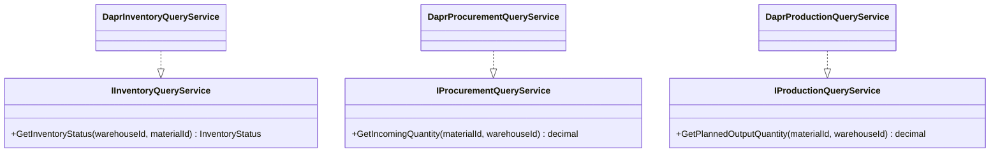

# Material Requirements Planning Service

<cite>
**Referenced Files in This Document**
- [Program.cs](file://src/Services/Mrp/ErpSystem.Mrp/Program.cs)
- [appsettings.json](file://src/Services/Mrp/ErpSystem.Mrp/appsettings.json)
- [MrpCalculationEngine.cs](file://src/Services/Mrp/ErpSystem.Mrp/Application/MrpCalculationEngine.cs)
- [ReorderingRuleAggregate.cs](file://src/Services/Mrp/ErpSystem.Mrp/Domain/ReorderingRuleAggregate.cs)
- [ProcurementSuggestionAggregate.cs](file://src/Services/Mrp/ErpSystem.Mrp/Domain/ProcurementSuggestionAggregate.cs)
- [DaprQueryServices.cs](file://src/Services/Mrp/ErpSystem.Mrp/Infrastructure/DaprQueryServices.cs)
- [MrpCalculationTests.cs](file://src/Tests/ErpSystem.IntegrationTests/Mrp/MrpCalculationTests.cs)
- [PRD-05-Inventory-Service.md](file://docs/PRD-05-Inventory-Service.md)
- [PRD-07-Production-Service.md](file://docs/PRD-07-Production-Service.md)
- [Abstractions.cs](file://src/BuildingBlocks/ErpSystem.BuildingBlocks/CQRS/Abstractions.cs)
</cite>

## Table of Contents
1. [Introduction](#introduction)
2. [Project Structure](#project-structure)
3. [Core Components](#core-components)
4. [Architecture Overview](#architecture-overview)
5. [Detailed Component Analysis](#detailed-component-analysis)
6. [Dependency Analysis](#dependency-analysis)
7. [Performance Considerations](#performance-considerations)
8. [Troubleshooting Guide](#troubleshooting-guide)
9. [Conclusion](#conclusion)
10. [Appendices](#appendices)

## Introduction
This document describes the Material Requirements Planning (MRP) service that implements an advanced supply chain planning engine. It calculates procurement needs by evaluating demand forecasts, existing inventory, and supply constraints, and generates procurement suggestions. It manages reordering rules (minimum/maximum levels, reorder quantities, lead times), integrates with Inventory for stock levels, with Production for planned outputs, and with Procurement for incoming goods. It also outlines capacity requirements planning concepts and procurement suggestion workflows, and documents integration patterns with Sales, Inventory, and Procurement. The document concludes with API endpoint proposals, performance optimization strategies, batch processing considerations, and real-time planning adjustments.

## Project Structure
The MRP service is implemented as a .NET microservice with:
- Application layer containing the MRP calculation engine
- Domain layer modeling reordering rules and procurement suggestions
- Infrastructure layer providing Dapr-backed query services and event sourcing persistence
- Tests validating domain logic and calculation scenarios
- Configuration for database connections and Dapr pub/sub/state stores

**Diagram sources**
- [Program.cs](file://src/Services/Mrp/ErpSystem.Mrp/Program.cs#L1-L84)
- [appsettings.json](file://src/Services/Mrp/ErpSystem.Mrp/appsettings.json#L1-L17)
- [MrpCalculationEngine.cs](file://src/Services/Mrp/ErpSystem.Mrp/Application/MrpCalculationEngine.cs#L1-L160)
- [ReorderingRuleAggregate.cs](file://src/Services/Mrp/ErpSystem.Mrp/Domain/ReorderingRuleAggregate.cs#L1-L190)
- [ProcurementSuggestionAggregate.cs](file://src/Services/Mrp/ErpSystem.Mrp/Domain/ProcurementSuggestionAggregate.cs#L1-L170)
- [DaprQueryServices.cs](file://src/Services/Mrp/ErpSystem.Mrp/Infrastructure/DaprQueryServices.cs#L1-L67)

**Section sources**
- [Program.cs](file://src/Services/Mrp/ErpSystem.Mrp/Program.cs#L1-L84)
- [appsettings.json](file://src/Services/Mrp/ErpSystem.Mrp/appsettings.json#L1-L17)

## Core Components
- MRP Calculation Engine: Orchestrates inventory, procurement, and production queries to compute whether reordering is needed, how much to order, and when to place the order.
- Reordering Rule Aggregate: Encapsulates replenishment policy (min/max levels, reorder quantity, lead time, strategy) and lifecycle events.
- Procurement Suggestion Aggregate: Captures suggested quantity, delivery date, status, and calculation details; supports approval and conversion to purchase orders.
- Dapr Query Services: Invokes Inventory, Procurement, and Production services via Dapr service invocation to fetch live stock, incoming receipts, and planned outputs.
- Event Store: Persists domain events for auditability and eventual projections.

Key responsibilities:
- Compute forecasted available = on-hand + reserved + incoming procurement + incoming production
- Compare forecasted available against minimum threshold to decide reordering
- Derive suggested quantity and delivery date based on rule parameters
- Persist suggestion as domain events for traceability and downstream processing

**Section sources**
- [MrpCalculationEngine.cs](file://src/Services/Mrp/ErpSystem.Mrp/Application/MrpCalculationEngine.cs#L1-L160)
- [ReorderingRuleAggregate.cs](file://src/Services/Mrp/ErpSystem.Mrp/Domain/ReorderingRuleAggregate.cs#L1-L190)
- [ProcurementSuggestionAggregate.cs](file://src/Services/Mrp/ErpSystem.Mrp/Domain/ProcurementSuggestionAggregate.cs#L1-L170)
- [DaprQueryServices.cs](file://src/Services/Mrp/ErpSystem.Mrp/Infrastructure/DaprQueryServices.cs#L1-L67)

## Architecture Overview
The MRP service follows a modular architecture:
- HTTP entrypoint via ASP.NET Core controllers (Swagger enabled)
- MediatR for command/query dispatch
- Dapr EventBus for event publishing
- Event Sourcing via an Event Store (PostgreSQL jsonb)
- Dapr Service Invocation to external services for live data

**Diagram sources**
- [Program.cs](file://src/Services/Mrp/ErpSystem.Mrp/Program.cs#L11-L46)
- [MrpCalculationEngine.cs](file://src/Services/Mrp/ErpSystem.Mrp/Application/MrpCalculationEngine.cs#L19-L95)
- [DaprQueryServices.cs](file://src/Services/Mrp/ErpSystem.Mrp/Infrastructure/DaprQueryServices.cs#L13-L65)

## Detailed Component Analysis

### MRP Calculation Engine
Responsibilities:
- For a given reordering rule, fetch inventory, incoming procurement, and planned production
- Compute forecasted available and compare to minimum quantity
- Determine suggested quantity (either rule’s reorder quantity or max minus forecasted)
- Set suggested delivery date as current UTC plus lead time days
- Record calculation details and persist suggestion as domain events

Processing logic:

**Diagram sources**
- [MrpCalculationEngine.cs](file://src/Services/Mrp/ErpSystem.Mrp/Application/MrpCalculationEngine.cs#L19-L95)

**Section sources**
- [MrpCalculationEngine.cs](file://src/Services/Mrp/ErpSystem.Mrp/Application/MrpCalculationEngine.cs#L19-L133)

### Reordering Rule Aggregate
Defines replenishment policy:
- Min/Max quantities and default reorder quantity (max - min)
- Lead time in days
- Strategy: Make-to-Stock, Make-to-Order, Hybrid
- Lifecycle: Create, update quantities/lead time, activate/deactivate
- Events: Created, QuantitiesUpdated, LeadTimeUpdated, Activated, Deactivated

**Diagram sources**
- [ReorderingRuleAggregate.cs](file://src/Services/Mrp/ErpSystem.Mrp/Domain/ReorderingRuleAggregate.cs#L9-L123)

**Section sources**
- [ReorderingRuleAggregate.cs](file://src/Services/Mrp/ErpSystem.Mrp/Domain/ReorderingRuleAggregate.cs#L21-L89)

### Procurement Suggestion Aggregate
Captures the recommendation:
- Tenant/Material/Warehouse, suggested quantity and date, status
- Link to originating reordering rule
- Calculation details (on-hand, reserved, available, incoming, forecasted, reason)
- Workflow: Pending → Approved → Converted (to Purchase Order)

**Diagram sources**
- [ProcurementSuggestionAggregate.cs](file://src/Services/Mrp/ErpSystem.Mrp/Domain/ProcurementSuggestionAggregate.cs#L8-L101)

**Section sources**
- [ProcurementSuggestionAggregate.cs](file://src/Services/Mrp/ErpSystem.Mrp/Domain/ProcurementSuggestionAggregate.cs#L20-L73)

### Dapr Query Services
- Inventory: Calls Inventory service to get OnHand, Reserved, Available
- Procurement: Calls Procurement service to get incoming quantities
- Production: Calls Production service to get planned output quantities

**Diagram sources**
- [DaprQueryServices.cs](file://src/Services/Mrp/ErpSystem.Mrp/Infrastructure/DaprQueryServices.cs#L9-L66)

**Section sources**
- [DaprQueryServices.cs](file://src/Services/Mrp/ErpSystem.Mrp/Infrastructure/DaprQueryServices.cs#L13-L65)

### Integration Patterns
- Inventory Service: Provides on-hand, reserved, available quantities and supports reservations and adjustments.
- Production Service: Supplies planned output quantities to reduce projected shortages.
- Procurement Service: Supplies confirmed but not yet received quantities to avoid double-counting commitments.

These integrations are invoked via Dapr service invocation from the MRP service.

**Section sources**
- [PRD-05-Inventory-Service.md](file://docs/PRD-05-Inventory-Service.md#L375-L442)
- [PRD-07-Production-Service.md](file://docs/PRD-07-Production-Service.md#L338-L371)
- [DaprQueryServices.cs](file://src/Services/Mrp/ErpSystem.Mrp/Infrastructure/DaprQueryServices.cs#L13-L65)

### Capacity Requirements Planning (Conceptual)
While the MRP service focuses on material availability and procurement suggestions, capacity planning can be integrated conceptually:
- Use Production service planned outputs to estimate material draw-down timelines
- Combine with Inventory availability to identify potential capacity bottlenecks
- Align procurement lead times with production capacity constraints
- Surface capacity shortfalls as additional planning signals alongside material suggestions

[No sources needed since this section doesn't analyze specific files]

## Dependency Analysis
- DI registrations wire up the calculation engine, event store, Dapr client, and query services
- The engine depends on three query interfaces resolved by Dapr-backed implementations
- Event Store persists domain events for audit and projections
- External dependencies: PostgreSQL for event store, MongoDB connection string present in configuration (usage context unclear in current code)

**Diagram sources**
- [Program.cs](file://src/Services/Mrp/ErpSystem.Mrp/Program.cs#L16-L45)
- [MrpCalculationEngine.cs](file://src/Services/Mrp/ErpSystem.Mrp/Application/MrpCalculationEngine.cs#L9-L14)

**Section sources**
- [Program.cs](file://src/Services/Mrp/ErpSystem.Mrp/Program.cs#L16-L45)
- [appsettings.json](file://src/Services/Mrp/ErpSystem.Mrp/appsettings.json#L9-L16)

## Performance Considerations
- Batch processing: The engine supports running MRP across all active rules; consider pagination and parallelization per rule while respecting external service rate limits
- External service latency: Dapr invocation adds network latency; cache or precompute frequently accessed inventory/production data where appropriate
- Event Store writes: Each suggestion persists domain events; batch writes or background processing can reduce contention
- Filtering active rules: The engine currently has a placeholder for loading active rules; implement efficient read-model queries to minimize overhead
- Concurrency: Use idempotency and outbox patterns to handle concurrent MRP runs safely

[No sources needed since this section provides general guidance]

## Troubleshooting Guide
Common issues and resolutions:
- Business rule violations in reordering rules (negative min, invalid min/max ordering) are enforced by the aggregate; validate inputs upstream
- Suggestion workflow errors (converting non-approved suggestions) are prevented by status checks; ensure approval before conversion
- Calculation discrepancies: Verify inventory, procurement, and production inputs; confirm lead time and reorder quantity values
- External service failures: Dapr invocation failures should be retried with resilience policies; monitor logs for transient errors

Validation references:
- Reordering rule business rules and defaults
- Suggestion lifecycle and workflow enforcement
- Calculation scenarios for low stock and incoming orders

**Section sources**
- [ReorderingRuleAggregate.cs](file://src/Services/Mrp/ErpSystem.Mrp/Domain/ReorderingRuleAggregate.cs#L31-L58)
- [ProcurementSuggestionAggregate.cs](file://src/Services/Mrp/ErpSystem.Mrp/Domain/ProcurementSuggestionAggregate.cs#L44-L73)
- [MrpCalculationTests.cs](file://src/Tests/ErpSystem.IntegrationTests/Mrp/MrpCalculationTests.cs#L12-L64)
- [MrpCalculationTests.cs](file://src/Tests/ErpSystem.IntegrationTests/Mrp/MrpCalculationTests.cs#L145-L193)

## Conclusion
The MRP service provides a robust foundation for automated procurement planning by combining live inventory, procurement, and production data with configurable reordering rules. It persists decisions as auditable domain events and integrates with Inventory, Procurement, and Production services via Dapr. While the current implementation focuses on material-level suggestions, the architecture supports extension to capacity planning and real-time adjustments as business needs evolve.

[No sources needed since this section summarizes without analyzing specific files]

## Appendices

### API Endpoints (Proposed)
Note: The MRP service currently registers controllers and Swagger but does not expose explicit MRP endpoints. The following endpoints are proposed for completeness and align with the documented integration patterns.

- POST /api/v1/mrp/calculate-for-rule
  - Description: Run MRP for a specific reordering rule
  - Body: { tenantId, warehouseId, materialId, ruleId }
  - Response: Procurement suggestion

- POST /api/v1/mrp/run-batch
  - Description: Run MRP across all active rules for a tenant
  - Body: { tenantId }
  - Response: List of procurement suggestions

- GET /api/v1/mrp/suggestions/{id}
  - Description: Retrieve a procurement suggestion with calculation details

- POST /api/v1/mrp/suggestions/{id}/approve
  - Description: Approve a pending suggestion

- POST /api/v1/mrp/suggestions/{id}/convert
  - Description: Convert an approved suggestion to a purchase order (requires PO id)

- GET /api/v1/mrp/rules/{id}
  - Description: Retrieve reordering rule details

- PUT /api/v1/mrp/rules/{id}/quantities
  - Description: Update min/max/reorder quantity

- PUT /api/v1/mrp/rules/{id}/leadtime
  - Description: Update lead time days

- POST /api/v1/mrp/rules/{id}/toggle-active
  - Description: Activate or deactivate a rule

[No sources needed since this section proposes conceptual endpoints]

### Data Models

**Diagram sources**
- [ReorderingRuleAggregate.cs](file://src/Services/Mrp/ErpSystem.Mrp/Domain/ReorderingRuleAggregate.cs#L9-L19)
- [ProcurementSuggestionAggregate.cs](file://src/Services/Mrp/ErpSystem.Mrp/Domain/ProcurementSuggestionAggregate.cs#L8-L18)
- [ProcurementSuggestionAggregate.cs](file://src/Services/Mrp/ErpSystem.Mrp/Domain/ProcurementSuggestionAggregate.cs#L115-L124)

### Test Coverage Highlights
- Reordering rule creation validates business constraints and defaults
- Procurement suggestion workflow enforces status transitions and conversions
- Calculation scenarios validate forecasting logic under various stock and incoming conditions

**Section sources**
- [MrpCalculationTests.cs](file://src/Tests/ErpSystem.IntegrationTests/Mrp/MrpCalculationTests.cs#L12-L64)
- [MrpCalculationTests.cs](file://src/Tests/ErpSystem.IntegrationTests/Mrp/MrpCalculationTests.cs#L67-L142)
- [MrpCalculationTests.cs](file://src/Tests/ErpSystem.IntegrationTests/Mrp/MrpCalculationTests.cs#L145-L193)