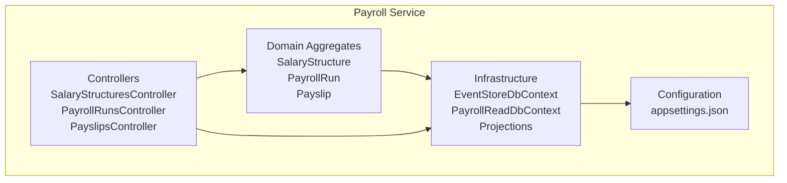
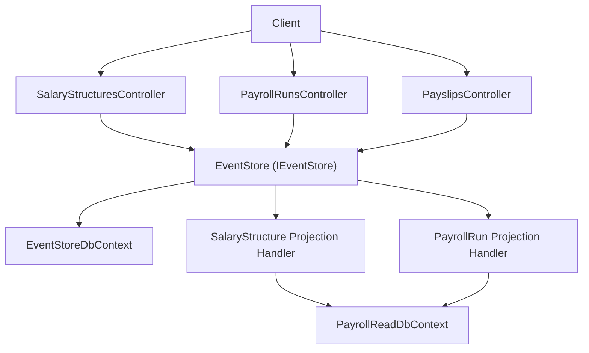
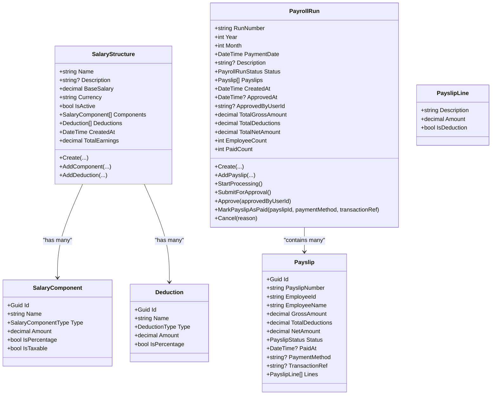
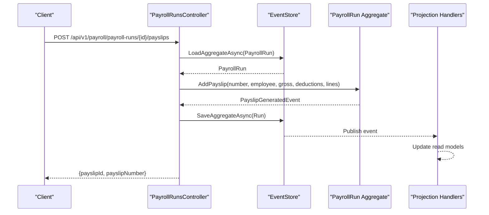
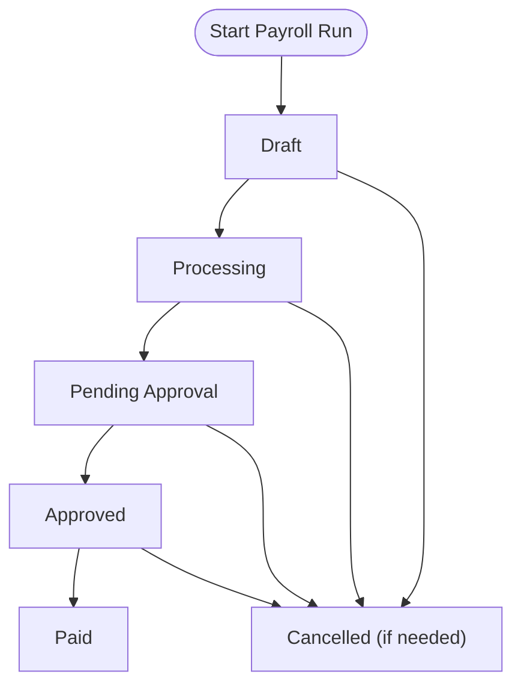
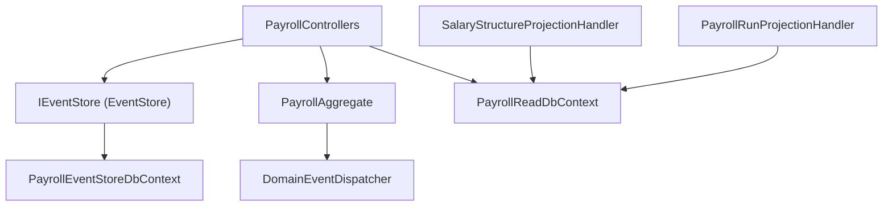
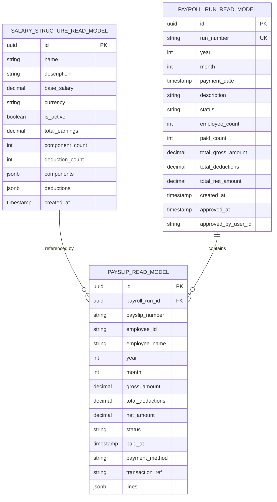

# Payroll Service

<cite>
**Referenced Files in This Document**
- [Program.cs](file://src/Services/Payroll/ErpSystem.Payroll/Program.cs)
- [PayrollControllers.cs](file://src/Services/Payroll/ErpSystem.Payroll/API/PayrollControllers.cs)
- [PayrollAggregate.cs](file://src/Services/Payroll/ErpSystem.Payroll/Domain/PayrollAggregate.cs)
- [Persistence.cs](file://src/Services/Payroll/ErpSystem.Payroll/Infrastructure/Persistence.cs)
- [Projections.cs](file://src/Services/Payroll/ErpSystem.Payroll/Infrastructure/Projections.cs)
- [appsettings.json](file://src/Services/Payroll/ErpSystem.Payroll/appsettings.json)
- [EventStore.cs](file://src/BuildingBlocks/ErpSystem.BuildingBlocks/Domain/DDDBase.cs)
- [DomainEventDispatcher.cs](file://src/BuildingBlocks/ErpSystem.BuildingBlocks/Domain/DomainEventDispatcher.cs)
</cite>

## Table of Contents
1. [Introduction](#introduction)
2. [Project Structure](#project-structure)
3. [Core Components](#core-components)
4. [Architecture Overview](#architecture-overview)
5. [Detailed Component Analysis](#detailed-component-analysis)
6. [Dependency Analysis](#dependency-analysis)
7. [Performance Considerations](#performance-considerations)
8. [Troubleshooting Guide](#troubleshooting-guide)
9. [Conclusion](#conclusion)
10. [Appendices](#appendices)

## Introduction
This document describes the Payroll service responsible for comprehensive payroll processing and compliance within the ERP system. It covers the payroll calculation engine (salary computations, components, deductions), tax and withholding management, benefit administration, pay slip generation, direct deposit processing, tax document preparation, compliance reporting, API endpoints, integrations with HR, Finance, and Tax services, and batch processing capabilities including year-end reporting.

## Project Structure
The Payroll service follows a clean architecture with separate concerns for API controllers, domain aggregates, infrastructure persistence and projections, and building blocks for event sourcing and domain events.

**Diagram sources**
- [Program.cs](file://src/Services/Payroll/ErpSystem.Payroll/Program.cs#L1-L45)
- [PayrollControllers.cs](file://src/Services/Payroll/ErpSystem.Payroll/API/PayrollControllers.cs#L1-L278)
- [PayrollAggregate.cs](file://src/Services/Payroll/ErpSystem.Payroll/Domain/PayrollAggregate.cs#L1-L429)
- [Persistence.cs](file://src/Services/Payroll/ErpSystem.Payroll/Infrastructure/Persistence.cs#L1-L121)
- [Projections.cs](file://src/Services/Payroll/ErpSystem.Payroll/Infrastructure/Projections.cs#L1-L171)
- [appsettings.json](file://src/Services/Payroll/ErpSystem.Payroll/appsettings.json#L1-L12)

**Section sources**
- [Program.cs](file://src/Services/Payroll/ErpSystem.Payroll/Program.cs#L1-L45)
- [appsettings.json](file://src/Services/Payroll/ErpSystem.Payroll/appsettings.json#L1-L12)

## Core Components
- Event-sourced domain model with aggregates for salary structures, payroll runs, and payslips.
- Controllers exposing REST endpoints for salary structures, payroll runs, and payslips.
- Event store and read model projections for durable event sourcing and efficient querying.
- Configuration for database connections and Swagger API documentation.

Key responsibilities:
- Manage salary structures with components and deductions.
- Create and process payroll runs with status transitions.
- Generate payslips and track payment status.
- Provide read-side queries for analytics and reporting.

**Section sources**
- [PayrollAggregate.cs](file://src/Services/Payroll/ErpSystem.Payroll/Domain/PayrollAggregate.cs#L183-L429)
- [PayrollControllers.cs](file://src/Services/Payroll/ErpSystem.Payroll/API/PayrollControllers.cs#L1-L278)
- [Persistence.cs](file://src/Services/Payroll/ErpSystem.Payroll/Infrastructure/Persistence.cs#L1-L121)
- [Projections.cs](file://src/Services/Payroll/ErpSystem.Payroll/Infrastructure/Projections.cs#L1-L171)

## Architecture Overview
The Payroll service uses event sourcing to capture state changes as a sequence of domain events. Controllers orchestrate commands against aggregates, which emit events captured by the event store. Projections update read models for efficient querying.

**Diagram sources**
- [Program.cs](file://src/Services/Payroll/ErpSystem.Payroll/Program.cs#L10-L26)
- [EventStore.cs](file://src/BuildingBlocks/ErpSystem.BuildingBlocks/Domain/DDDBase.cs#L53-L87)
- [Persistence.cs](file://src/Services/Payroll/ErpSystem.Payroll/Infrastructure/Persistence.cs#L8-L60)
- [Projections.cs](file://src/Services/Payroll/ErpSystem.Payroll/Infrastructure/Projections.cs#L9-L171)
- [PayrollControllers.cs](file://src/Services/Payroll/ErpSystem.Payroll/API/PayrollControllers.cs#L1-L278)

## Detailed Component Analysis

### Payroll Calculation Engine
The calculation engine centers around aggregates and value objects:
- SalaryStructure computes total earnings from base salary and components, supporting fixed and percentage-based additions.
- PayrollRun aggregates payslips and tracks totals and counts.
- Payslip holds per-employee earnings, deductions, and payment metadata.

**Diagram sources**
- [PayrollAggregate.cs](file://src/Services/Payroll/ErpSystem.Payroll/Domain/PayrollAggregate.cs#L183-L429)

**Section sources**
- [PayrollAggregate.cs](file://src/Services/Payroll/ErpSystem.Payroll/Domain/PayrollAggregate.cs#L183-L429)

### Tax Calculation and Withholding Management
- Components and deductions support tax-related entries via enums for income tax and social insurance types.
- Net amount computation occurs during payslip creation by subtracting total deductions from gross amount.
- Future enhancements can integrate external tax services for dynamic tax rates and brackets.

Implementation notes:
- Income tax and social security are modeled as deduction types.
- Percentage-based components/deductions enable scalable tax modeling.

**Section sources**
- [PayrollAggregate.cs](file://src/Services/Payroll/ErpSystem.Payroll/Domain/PayrollAggregate.cs#L7-L47)
- [PayrollAggregate.cs](file://src/Services/Payroll/ErpSystem.Payroll/Domain/PayrollAggregate.cs#L298-L301)

### Benefit Administration
- Benefits such as health insurance, retirement contributions, and paid time off can be represented as salary components or deductions.
- Components support percentage-based allocations for benefits like pension contributions.
- Deductions accommodate mandatory benefit deductions.

Operational guidance:
- Define benefit components in salary structures.
- Track benefit-related lines in payslip lines for transparency.

**Section sources**
- [PayrollAggregate.cs](file://src/Services/Payroll/ErpSystem.Payroll/Domain/PayrollAggregate.cs#L158-L179)
- [PayrollAggregate.cs](file://src/Services/Payroll/ErpSystem.Payroll/Domain/PayrollAggregate.cs#L196-L201)

### Pay Slip Generation and Direct Deposit
- Pay slips are generated within a payroll run with computed gross, total deductions, and net amounts.
- Payment tracking includes method and optional transaction reference for direct deposit reconciliation.

**Diagram sources**
- [PayrollControllers.cs](file://src/Services/Payroll/ErpSystem.Payroll/API/PayrollControllers.cs#L126-L145)
- [PayrollAggregate.cs](file://src/Services/Payroll/ErpSystem.Payroll/Domain/PayrollAggregate.cs#L287-L302)
- [Projections.cs](file://src/Services/Payroll/ErpSystem.Payroll/Infrastructure/Projections.cs#L103-L133)

**Section sources**
- [PayrollControllers.cs](file://src/Services/Payroll/ErpSystem.Payroll/API/PayrollControllers.cs#L126-L145)
- [PayrollAggregate.cs](file://src/Services/Payroll/ErpSystem.Payroll/Domain/PayrollAggregate.cs#L287-L302)
- [Projections.cs](file://src/Services/Payroll/ErpSystem.Payroll/Infrastructure/Projections.cs#L103-L133)

### Compliance Management and Reporting
- Payroll runs maintain status transitions and approvals for audit trails.
- Read models expose statistics and filters for compliance reporting.
- Year-end reporting can leverage monthly aggregations and employee-level payslip history.

**Diagram sources**
- [PayrollAggregate.cs](file://src/Services/Payroll/ErpSystem.Payroll/Domain/PayrollAggregate.cs#L30-L47)
- [PayrollAggregate.cs](file://src/Services/Payroll/ErpSystem.Payroll/Domain/PayrollAggregate.cs#L304-L349)

**Section sources**
- [PayrollAggregate.cs](file://src/Services/Payroll/ErpSystem.Payroll/Domain/PayrollAggregate.cs#L30-L47)
- [PayrollControllers.cs](file://src/Services/Payroll/ErpSystem.Payroll/API/PayrollControllers.cs#L191-L209)

### API Endpoints
The Payroll service exposes the following REST endpoints:

- Salary Structures
  - GET /api/v1/payroll/salary-structures
  - GET /api/v1/payroll/salary-structures/{id}
  - POST /api/v1/payroll/salary-structures
  - POST /api/v1/payroll/salary-structures/{id}/components
  - POST /api/v1/payroll/salary-structures/{id}/deductions

- Payroll Runs
  - GET /api/v1/payroll/payroll-runs
  - GET /api/v1/payroll/payroll-runs/{id}
  - POST /api/v1/payroll/payroll-runs
  - POST /api/v1/payroll/payroll-runs/{id}/payslips
  - POST /api/v1/payroll/payroll-runs/{id}/start-processing
  - POST /api/v1/payroll/payroll-runs/{id}/submit
  - POST /api/v1/payroll/payroll-runs/{id}/approve
  - POST /api/v1/payroll/payroll-runs/{id}/cancel
  - GET /api/v1/payroll/payroll-runs/statistics

- Payslips
  - GET /api/v1/payroll/payslips
  - GET /api/v1/payroll/payslips/{id}
  - GET /api/v1/payroll/payslips/employee/{employeeId}

Request DTOs:
- CreateSalaryStructureRequest
- AddComponentRequest
- AddDeductionRequest
- CreatePayrollRunRequest
- AddPayslipRequest
- ApprovePayrollRequest
- CancelPayrollRequest

**Section sources**
- [PayrollControllers.cs](file://src/Services/Payroll/ErpSystem.Payroll/API/PayrollControllers.cs#L1-L278)

### Integration Patterns
- HR Integration: Employee data and employment details can feed salary structures and payroll run composition. Use HR service APIs to enrich employee profiles and job roles.
- Finance Integration: Approved payroll runs trigger disbursements; integrate with Finance service for payment execution and bank feeds.
- Tax Services: Integrate with external tax services for dynamic tax calculations, withholding tables, and regulatory updates.

[No sources needed since this section provides general integration guidance]

### Scheduling, Batch Processing, and Year-End Reporting
- Scheduling: Use external schedulers to trigger payroll run creation and processing at month-end.
- Batch Processing: Payroll runs aggregate multiple payslips; projections update read models atomically per run.
- Year-End Reporting: Leverage statistics endpoint and payslip queries to generate YTD reports and tax documents.

**Section sources**
- [PayrollControllers.cs](file://src/Services/Payroll/ErpSystem.Payroll/API/PayrollControllers.cs#L87-L99)
- [PayrollControllers.cs](file://src/Services/Payroll/ErpSystem.Payroll/API/PayrollControllers.cs#L191-L209)

## Dependency Analysis
The Payroll service depends on building blocks for event sourcing and domain event dispatching. Controllers depend on the event store and read databases. Projections depend on domain events to update read models.

**Diagram sources**
- [Program.cs](file://src/Services/Payroll/ErpSystem.Payroll/Program.cs#L10-L26)
- [EventStore.cs](file://src/BuildingBlocks/ErpSystem.BuildingBlocks/Domain/DDDBase.cs#L53-L87)
- [DomainEventDispatcher.cs](file://src/BuildingBlocks/ErpSystem.BuildingBlocks/Domain/DomainEventDispatcher.cs#L37-L87)
- [Persistence.cs](file://src/Services/Payroll/ErpSystem.Payroll/Infrastructure/Persistence.cs#L8-L60)
- [Projections.cs](file://src/Services/Payroll/ErpSystem.Payroll/Infrastructure/Projections.cs#L9-L171)

**Section sources**
- [Program.cs](file://src/Services/Payroll/ErpSystem.Payroll/Program.cs#L10-L26)
- [EventStore.cs](file://src/BuildingBlocks/ErpSystem.BuildingBlocks/Domain/DDDBase.cs#L53-L87)
- [DomainEventDispatcher.cs](file://src/BuildingBlocks/ErpSystem.BuildingBlocks/Domain/DomainEventDispatcher.cs#L37-L87)
- [Persistence.cs](file://src/Services/Payroll/ErpSystem.Payroll/Infrastructure/Persistence.cs#L1-L121)
- [Projections.cs](file://src/Services/Payroll/ErpSystem.Payroll/Infrastructure/Projections.cs#L1-L171)

## Performance Considerations
- Event store writes are append-only; ensure indexing on event stream keys and payload serialization efficiency.
- Read model projections serialize JSONB fields; consider projection batching for high-volume runs.
- Use pagination and filtering in controllers to limit response sizes for large datasets.
- Offload heavy analytics to background jobs or dedicated reporting service.

[No sources needed since this section provides general guidance]

## Troubleshooting Guide
Common issues and resolutions:
- Invalid status transitions: Ensure runs progress through Draft → Processing → PendingApproval → Approved → Paid.
- Empty payroll submission: Submissions require at least one payslip.
- Duplicate run numbers: Generated run numbers are unique per run; verify generation logic.
- Database connectivity: Verify connection string configuration and PostgreSQL availability.

Operational checks:
- Confirm event store and read database migrations are applied.
- Validate domain event publishing and projection handler execution.

**Section sources**
- [PayrollAggregate.cs](file://src/Services/Payroll/ErpSystem.Payroll/Domain/PayrollAggregate.cs#L304-L349)
- [Projections.cs](file://src/Services/Payroll/ErpSystem.Payroll/Infrastructure/Projections.cs#L93-L101)
- [appsettings.json](file://src/Services/Payroll/ErpSystem.Payroll/appsettings.json#L9-L12)

## Conclusion
The Payroll service provides a robust, event-sourced foundation for salary structures, payroll runs, and payslips. It supports extensibility for tax calculations, benefits administration, and compliance reporting. Integrations with HR, Finance, and Tax services enable end-to-end payroll processing, while projections and statistics facilitate operational insights and year-end reporting.

## Appendices

### Data Models and Read Models

**Diagram sources**
- [Persistence.cs](file://src/Services/Payroll/ErpSystem.Payroll/Infrastructure/Persistence.cs#L66-L118)