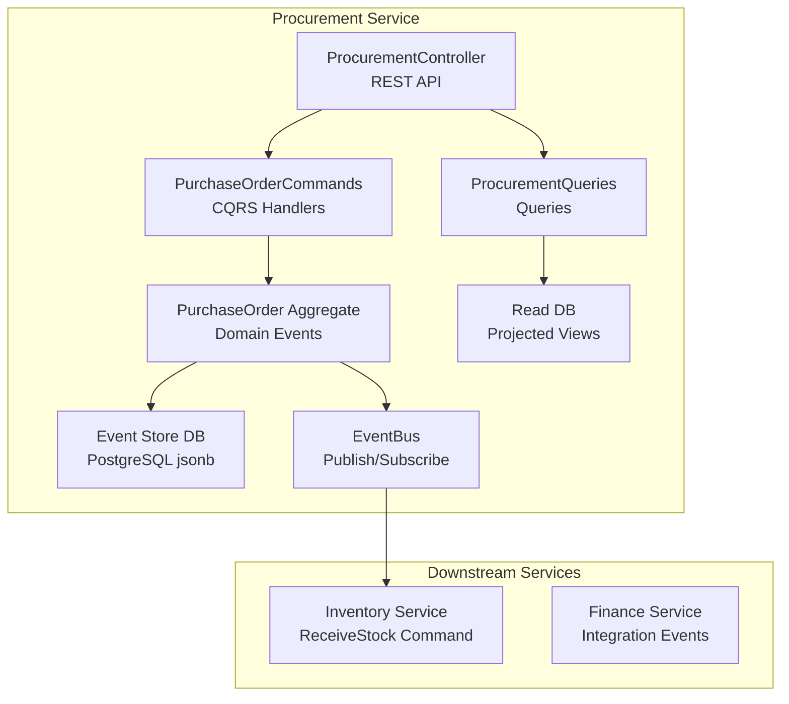
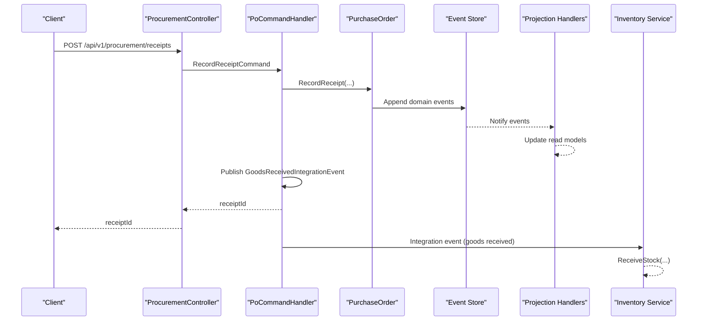
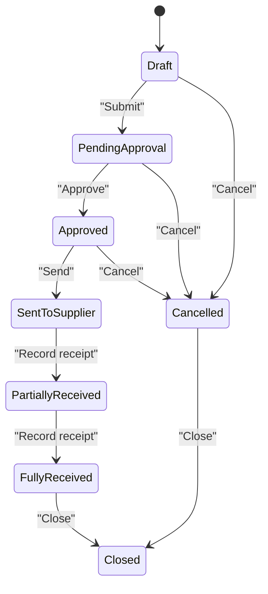
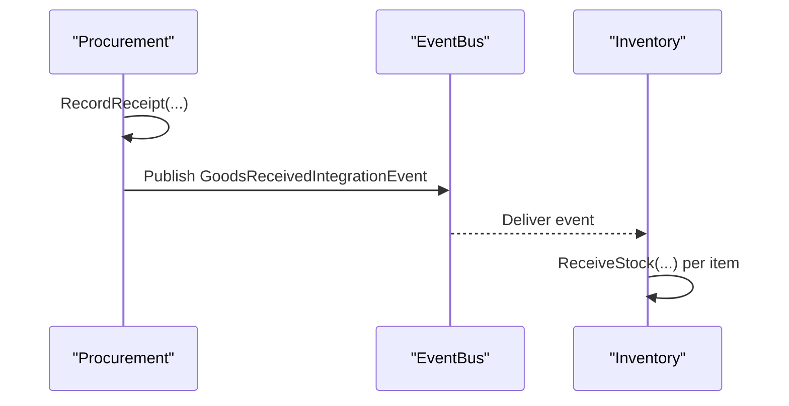
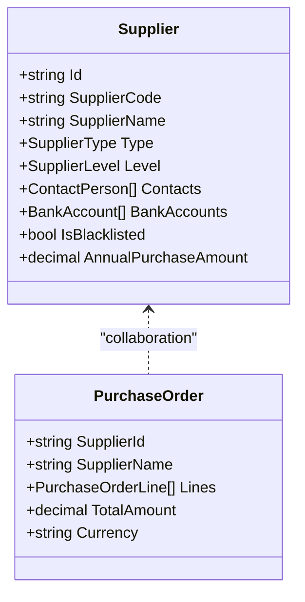
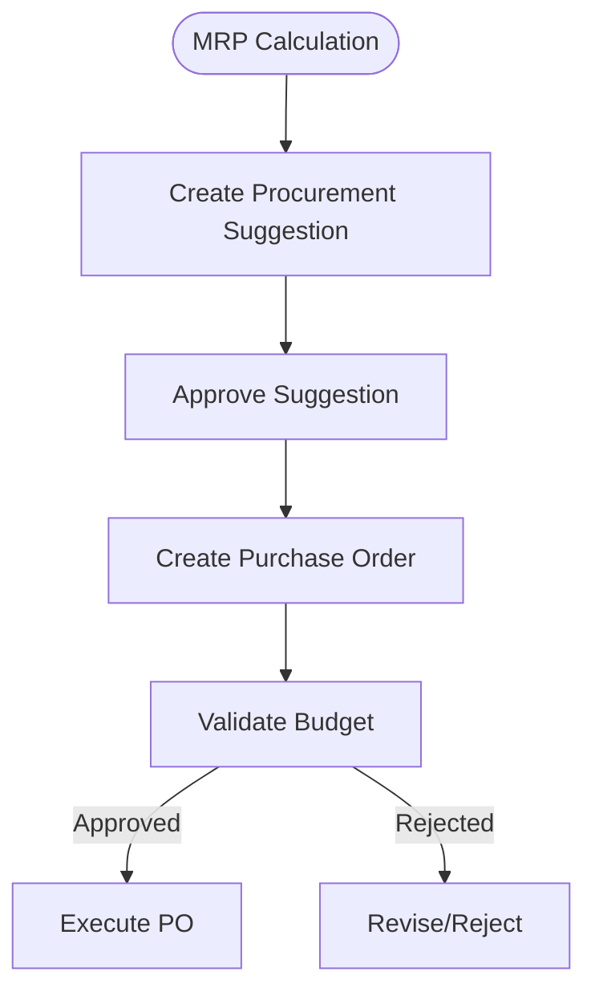
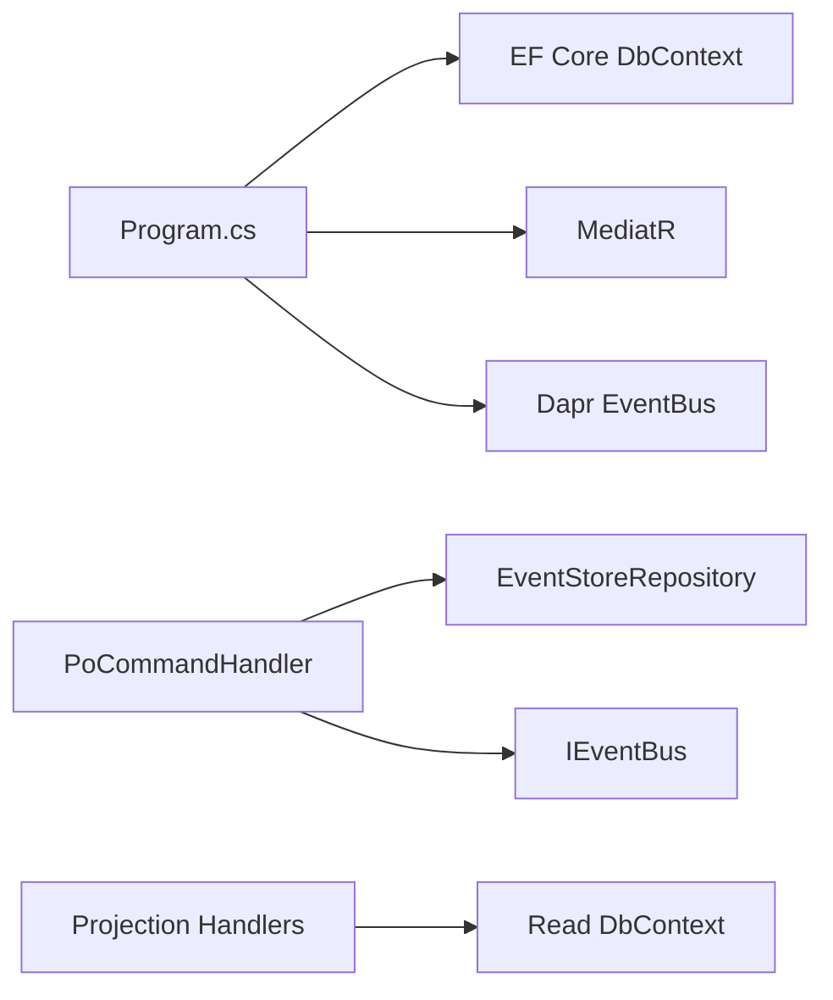

# Procurement Service

<cite>
**Referenced Files in This Document**
- [Program.cs](file://src/Services/Procurement/ErpSystem.Procurement/Program.cs)
- [ProcurementController.cs](file://src/Services/Procurement/ErpSystem.Procurement/API/ProcurementController.cs)
- [PurchaseOrderCommands.cs](file://src/Services/Procurement/ErpSystem.Procurement/Application/PurchaseOrderCommands.cs)
- [ProcurementQueries.cs](file://src/Services/Procurement/ErpSystem.Procurement/Application/ProcurementQueries.cs)
- [PurchaseOrderAggregate.cs](file://src/Services/Procurement/ErpSystem.Procurement/Domain/PurchaseOrderAggregate.cs)
- [ProcurementEvents.cs](file://src/Services/Procurement/ErpSystem.Procurement/Domain/ProcurementEvents.cs)
- [Persistence.cs](file://src/Services/Procurement/ErpSystem.Procurement/Infrastructure/Persistence.cs)
- [Projections.cs](file://src/Services/Procurement/ErpSystem.Procurement/Infrastructure/Projections.cs)
- [IntegrationEventHandlers.cs](file://src/Services/Inventory/ErpSystem.Inventory/Application/IntegrationEventHandlers.cs)
- [ProcurementToInventoryTests.cs](file://src/Tests/ErpSystem.IntegrationTests/ProcurementToInventoryTests.cs)
- [ReportsController.cs](file://src/Services/Reporting/ErpSystem.Reporting/Controllers/ReportsController.cs)
- [SupplierAggregate.cs](file://src/Services/MasterData/ErpSystem.MasterData/Domain/SupplierAggregate.cs)
- [PRD-05-Inventory-Service.md](file://docs/PRD-05-Inventory-Service.md)
- [PRD-01-MasterData-Service.md](file://docs/PRD-01-MasterData-Service.md)
</cite>

## Table of Contents
1. [Introduction](#introduction)
2. [Project Structure](#project-structure)
3. [Core Components](#core-components)
4. [Architecture Overview](#architecture-overview)
5. [Detailed Component Analysis](#detailed-component-analysis)
6. [Dependency Analysis](#dependency-analysis)
7. [Performance Considerations](#performance-considerations)
8. [Troubleshooting Guide](#troubleshooting-guide)
9. [Conclusion](#conclusion)
10. [Appendices](#appendices)

## Introduction
This document describes the Procurement service that manages the end-to-end procurement lifecycle. It covers purchase order creation, approval workflows, vendor collaboration, goods receipt, quality inspection integration, supplier performance tracking, procurement planning, requisition processing, budget validation, supplier relationship management, and supplier rating systems. It also documents API endpoints for purchase order management, goods receipt, and supplier communications, along with integration patterns with Finance for payment processing and Inventory for stock receipt. Finally, it addresses procurement analytics, spend analysis, and compliance monitoring.

## Project Structure
The Procurement service is implemented as a microservice using CQRS and event sourcing. It exposes REST APIs for purchase orders and receipts, persists events to a PostgreSQL-backed event store, projects read models for queries, and publishes integration events consumed by downstream services.

**Diagram sources**
- [Program.cs](file://src/Services/Procurement/ErpSystem.Procurement/Program.cs#L15-L46)
- [ProcurementController.cs](file://src/Services/Procurement/ErpSystem.Procurement/API/ProcurementController.cs#L1-L62)
- [PurchaseOrderCommands.cs](file://src/Services/Procurement/ErpSystem.Procurement/Application/PurchaseOrderCommands.cs#L27-L117)
- [ProcurementQueries.cs](file://src/Services/Procurement/ErpSystem.Procurement/Application/ProcurementQueries.cs#L13-L44)
- [PurchaseOrderAggregate.cs](file://src/Services/Procurement/ErpSystem.Procurement/Domain/PurchaseOrderAggregate.cs#L85-L199)
- [Persistence.cs](file://src/Services/Procurement/ErpSystem.Procurement/Infrastructure/Persistence.cs#L6-L66)
- [Projections.cs](file://src/Services/Procurement/ErpSystem.Procurement/Infrastructure/Projections.cs#L7-L118)
- [ProcurementEvents.cs](file://src/Services/Procurement/ErpSystem.Procurement/Domain/ProcurementEvents.cs#L5-L21)

**Section sources**
- [Program.cs](file://src/Services/Procurement/ErpSystem.Procurement/Program.cs#L1-L72)
- [ProcurementController.cs](file://src/Services/Procurement/ErpSystem.Procurement/API/ProcurementController.cs#L1-L62)
- [Persistence.cs](file://src/Services/Procurement/ErpSystem.Procurement/Infrastructure/Persistence.cs#L1-L66)

## Core Components
- REST API surface for purchase orders and receipts
- CQRS handlers for commands and queries
- Domain aggregate modeling purchase orders with explicit workflow states
- Event sourcing with projections to read models
- Integration event publishing for downstream consumption

Key capabilities:
- Create purchase orders with supplier and line items
- Submit, approve, send, close, and cancel purchase orders
- Record goods receipt with validation against PO lines
- Publish integration events for inventory stock updates
- Query purchase orders and supplier price history

**Section sources**
- [ProcurementController.cs](file://src/Services/Procurement/ErpSystem.Procurement/API/ProcurementController.cs#L7-L62)
- [PurchaseOrderCommands.cs](file://src/Services/Procurement/ErpSystem.Procurement/Application/PurchaseOrderCommands.cs#L8-L117)
- [ProcurementQueries.cs](file://src/Services/Procurement/ErpSystem.Procurement/Application/ProcurementQueries.cs#L7-L44)
- [PurchaseOrderAggregate.cs](file://src/Services/Procurement/ErpSystem.Procurement/Domain/PurchaseOrderAggregate.cs#L5-L199)
- [ProcurementEvents.cs](file://src/Services/Procurement/ErpSystem.Procurement/Domain/ProcurementEvents.cs#L5-L21)

## Architecture Overview
The service follows CQRS with event sourcing. Commands mutate the domain aggregate, which emits domain events applied to update read models. Integration events are published for cross-service collaboration.

**Diagram sources**
- [ProcurementController.cs](file://src/Services/Procurement/ErpSystem.Procurement/API/ProcurementController.cs#L55-L62)
- [PurchaseOrderCommands.cs](file://src/Services/Procurement/ErpSystem.Procurement/Application/PurchaseOrderCommands.cs#L72-L97)
- [PurchaseOrderAggregate.cs](file://src/Services/Procurement/ErpSystem.Procurement/Domain/PurchaseOrderAggregate.cs#L127-L140)
- [Projections.cs](file://src/Services/Procurement/ErpSystem.Procurement/Infrastructure/Projections.cs#L69-L104)
- [ProcurementEvents.cs](file://src/Services/Procurement/ErpSystem.Procurement/Domain/ProcurementEvents.cs#L7-L20)
- [IntegrationEventHandlers.cs](file://src/Services/Inventory/ErpSystem.Inventory/Application/IntegrationEventHandlers.cs#L14-L32)

## Detailed Component Analysis

### Purchase Order Lifecycle and Workflow
The domain enforces a strict workflow via state transitions and validations.

**Diagram sources**
- [PurchaseOrderAggregate.cs](file://src/Services/Procurement/ErpSystem.Procurement/Domain/PurchaseOrderAggregate.cs#L5-L15)
- [PurchaseOrderAggregate.cs](file://src/Services/Procurement/ErpSystem.Procurement/Domain/PurchaseOrderAggregate.cs#L109-L156)

Validation highlights:
- Submit only from Draft
- Approve only from PendingApproval
- Send only from Approved
- Receipt allowed from SentToSupplier or PartiallyReceived
- Cancel allowed only before goods receipt and in early states

**Section sources**
- [PurchaseOrderAggregate.cs](file://src/Services/Procurement/ErpSystem.Procurement/Domain/PurchaseOrderAggregate.cs#L109-L156)

### API Endpoints for Purchase Orders and Receipts
- Purchase Orders
  - POST /api/v1/procurement/purchase-orders
  - GET /api/v1/procurement/purchase-orders
  - GET /api/v1/procurement/purchase-orders/{id}
  - POST /api/v1/procurement/purchase-orders/{id}/submit
  - POST /api/v1/procurement/purchase-orders/{id}/approve
  - POST /api/v1/procurement/purchase-orders/{id}/send
  - POST /api/v1/procurement/purchase-orders/{id}/close
  - POST /api/v1/procurement/purchase-orders/{id}/cancel
  - GET /api/v1/procurement/purchase-orders/prices
- Goods Receipts
  - POST /api/v1/procurement/receipts

Notes:
- Approval, sending, and closing accept comments/reasons in request bodies.
- Search supports filtering by supplier and status, with pagination.

**Section sources**
- [ProcurementController.cs](file://src/Services/Procurement/ErpSystem.Procurement/API/ProcurementController.cs#L7-L62)

### Goods Receipt and Inventory Integration
- Receipt validation ensures line numbers exist in the PO.
- On successful receipt, the service publishes a GoodsReceivedIntegrationEvent containing items with material, warehouse, location, and quantity.
- Inventory service receives the event and executes ReceiveStock for each item.

**Diagram sources**
- [PurchaseOrderCommands.cs](file://src/Services/Procurement/ErpSystem.Procurement/Application/PurchaseOrderCommands.cs#L72-L97)
- [ProcurementEvents.cs](file://src/Services/Procurement/ErpSystem.Procurement/Domain/ProcurementEvents.cs#L7-L20)
- [IntegrationEventHandlers.cs](file://src/Services/Inventory/ErpSystem.Inventory/Application/IntegrationEventHandlers.cs#L14-L32)

**Section sources**
- [PurchaseOrderCommands.cs](file://src/Services/Procurement/ErpSystem.Procurement/Application/PurchaseOrderCommands.cs#L72-L97)
- [ProcurementEvents.cs](file://src/Services/Procurement/ErpSystem.Procurement/Domain/ProcurementEvents.cs#L5-L21)
- [IntegrationEventHandlers.cs](file://src/Services/Inventory/ErpSystem.Inventory/Application/IntegrationEventHandlers.cs#L14-L32)
- [PRD-05-Inventory-Service.md](file://docs/PRD-05-Inventory-Service.md#L453-L458)

### Supplier Collaboration and Vendor Rating
- Supplier profile and contact information are maintained in MasterData.
- Supplier performance metrics and rating are supported, enabling supplier classification and blacklist management.
- Procurement can leverage supplier price history for decision-making.

**Diagram sources**
- [SupplierAggregate.cs](file://src/Services/MasterData/ErpSystem.MasterData/Domain/SupplierAggregate.cs#L88-L123)
- [PurchaseOrderAggregate.cs](file://src/Services/Procurement/ErpSystem.Procurement/Domain/PurchaseOrderAggregate.cs#L85-L93)

**Section sources**
- [SupplierAggregate.cs](file://src/Services/MasterData/ErpSystem.MasterData/Domain/SupplierAggregate.cs#L1-L123)
- [PRD-01-MasterData-Service.md](file://docs/PRD-01-MasterData-Service.md#L234-L279)

### Procurement Planning, Requisition Processing, and Budget Validation
- MRP generates procurement suggestions with quantities and dates based on forecasts and rules.
- Suggestion approval transitions to PO creation, linking planning to execution.
- Budget validation can be integrated at the approval stage by checking budgets against PO totals.

**Diagram sources**
- [MrpCalculationEngine.cs](file://src/Services/Mrp/ErpSystem.Mrp/Application/MrpCalculationEngine.cs#L60-L93)

**Section sources**
- [MrpCalculationEngine.cs](file://src/Services/Mrp/ErpSystem.Mrp/Application/MrpCalculationEngine.cs#L60-L93)

### Supplier Performance Tracking and Compliance Monitoring
- Supplier performance ratings and KPIs are defined in MasterData.
- Compliance monitoring can leverage supplier status (e.g., blacklist) and PO approvals.
- Spend analysis and reporting can be derived from PO read models and integration events.

**Section sources**
- [PRD-01-MasterData-Service.md](file://docs/PRD-01-MasterData-Service.md#L252-L279)
- [ReportsController.cs](file://src/Services/Reporting/ErpSystem.Reporting/Controllers/ReportsController.cs#L48-L71)

## Dependency Analysis
The Procurement service depends on:
- Building blocks for domain events, event bus, CQRS, and outbox
- Entity Framework Core for event store and read model persistence
- MediatR for CQRS command/query handling
- Dapr EventBus for publish/subscribe integration

**Diagram sources**
- [Program.cs](file://src/Services/Procurement/ErpSystem.Procurement/Program.cs#L15-L46)
- [PurchaseOrderCommands.cs](file://src/Services/Procurement/ErpSystem.Procurement/Application/PurchaseOrderCommands.cs#L27-L34)
- [Projections.cs](file://src/Services/Procurement/ErpSystem.Procurement/Infrastructure/Projections.cs#L7-L14)

**Section sources**
- [Program.cs](file://src/Services/Procurement/ErpSystem.Procurement/Program.cs#L15-L46)
- [Persistence.cs](file://src/Services/Procurement/ErpSystem.Procurement/Infrastructure/Persistence.cs#L6-L31)

## Performance Considerations
- Event store uses PostgreSQL with jsonb payloads; ensure indexing on aggregate/version keys.
- Projection handlers serialize/deserialize JSONB for lines; consider optimizing serialization or denormalizing frequently accessed fields.
- Queries use asynchronous EF Core patterns; keep database connections pooled and avoid N+1 queries.
- Integration events should be idempotent; downstream services should deduplicate by source identifiers.

## Troubleshooting Guide
Common issues and resolutions:
- PO not found when handling commands: ensure the PO exists before applying state transitions.
- Invalid receipt line number: verify that receipt line numbers match PO lines.
- Receipt not allowed: confirm PO status allows receipt (SentToSupplier or PartiallyReceived).
- Cancellation errors: PO must not have received goods and must be in eligible states.
- Integration event delivery: verify EventBus is configured and Inventory service subscribes to the integration event.

**Section sources**
- [PurchaseOrderCommands.cs](file://src/Services/Procurement/ErpSystem.Procurement/Application/PurchaseOrderCommands.cs#L45-L115)
- [PurchaseOrderAggregate.cs](file://src/Services/Procurement/ErpSystem.Procurement/Domain/PurchaseOrderAggregate.cs#L127-L156)
- [ProcurementToInventoryTests.cs](file://src/Tests/ErpSystem.IntegrationTests/ProcurementToInventoryTests.cs#L13-L37)

## Conclusion
The Procurement service provides a robust, event-sourced foundation for end-to-end procurement management. Its CQRS design enables scalable command handling, clear workflow enforcement, and seamless integration with Inventory for stock receipt. With supplier master data and performance tracking integrated via MasterData, and reporting capabilities available through the Reporting service, the system supports comprehensive procurement analytics, spend analysis, and compliance monitoring.

## Appendices

### API Reference Summary
- Purchase Orders
  - POST /api/v1/procurement/purchase-orders
  - GET /api/v1/procurement/purchase-orders
  - GET /api/v1/procurement/purchase-orders/{id}
  - POST /api/v1/procurement/purchase-orders/{id}/submit
  - POST /api/v1/procurement/purchase-orders/{id}/approve
  - POST /api/v1/procurement/purchase-orders/{id}/send
  - POST /api/v1/procurement/purchase-orders/{id}/close
  - POST /api/v1/procurement/purchase-orders/{id}/cancel
  - GET /api/v1/procurement/purchase-orders/prices
- Goods Receipts
  - POST /api/v1/procurement/receipts

**Section sources**
- [ProcurementController.cs](file://src/Services/Procurement/ErpSystem.Procurement/API/ProcurementController.cs#L7-L62)

### Integration Endpoints
- Inventory Goods Receipt Integration
  - Integration event: GoodsReceivedIntegrationEvent
  - Handler: ReceiveStockCommand invocation per item

**Section sources**
- [ProcurementEvents.cs](file://src/Services/Procurement/ErpSystem.Procurement/Domain/ProcurementEvents.cs#L7-L20)
- [IntegrationEventHandlers.cs](file://src/Services/Inventory/ErpSystem.Inventory/Application/IntegrationEventHandlers.cs#L14-L32)
- [PRD-05-Inventory-Service.md](file://docs/PRD-05-Inventory-Service.md#L453-L458)

### Reporting and Analytics
- Purchase Order Report endpoint: GET /api/reports/purchase-orders
- Financial, inventory valuation, sales by customer, and production efficiency reports available via Reporting service

**Section sources**
- [ReportsController.cs](file://src/Services/Reporting/ErpSystem.Reporting/Controllers/ReportsController.cs#L48-L71)