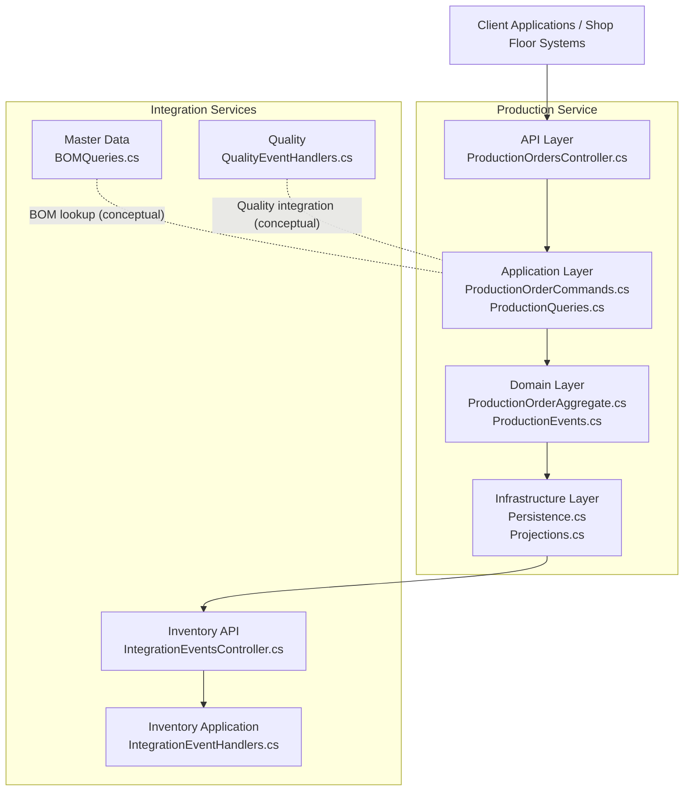
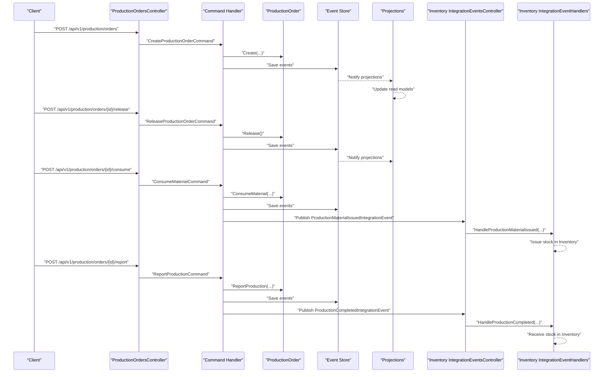
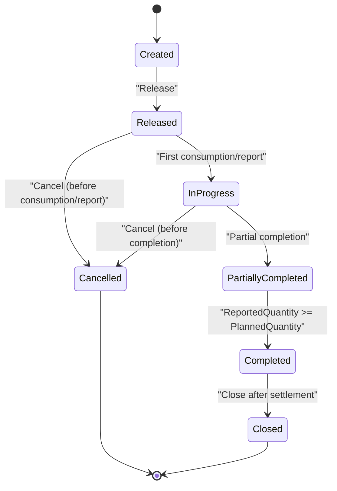
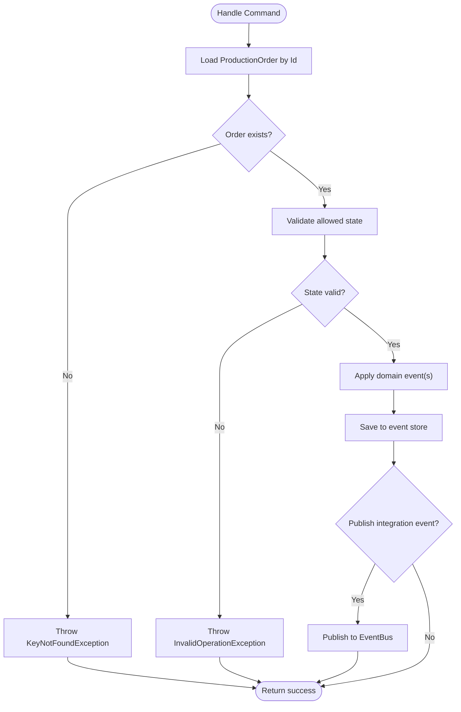
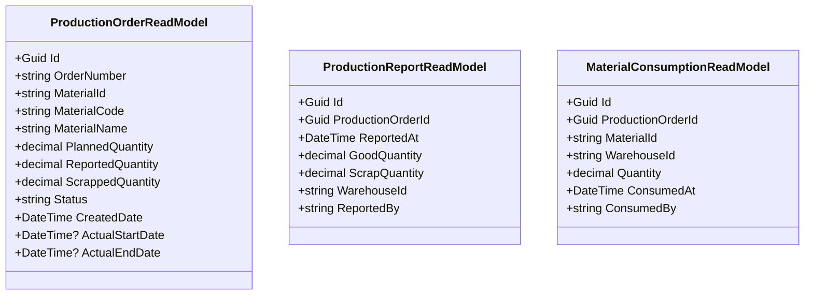
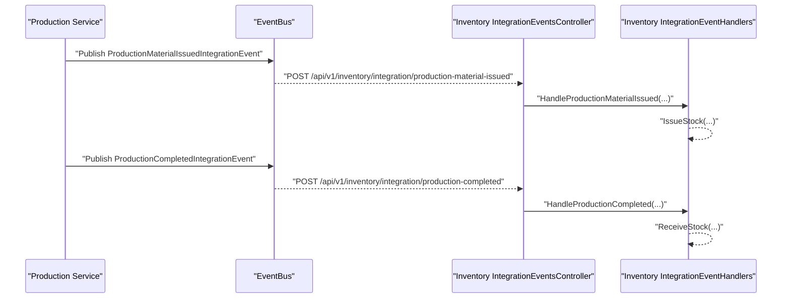
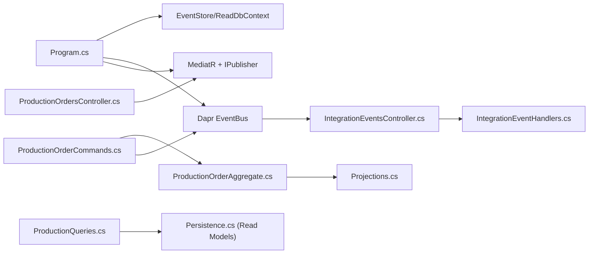

# Production Service

<cite>
**Referenced Files in This Document**
- [Program.cs](file://src/Services/Production/ErpSystem.Production/Program.cs)
- [ProductionOrdersController.cs](file://src/Services/Production/ErpSystem.Production/API/ProductionOrdersController.cs)
- [ProductionOrderCommands.cs](file://src/Services/Production/ErpSystem.Production/Application/ProductionOrderCommands.cs)
- [ProductionQueries.cs](file://src/Services/Production/ErpSystem.Production/Application/ProductionQueries.cs)
- [ProductionOrderAggregate.cs](file://src/Services/Production/ErpSystem.Production/Domain/ProductionOrderAggregate.cs)
- [ProductionEvents.cs](file://src/Services/Production/ErpSystem.Production/Domain/ProductionEvents.cs)
- [Persistence.cs](file://src/Services/Production/ErpSystem.Production/Infrastructure/Persistence.cs)
- [Projections.cs](file://src/Services/Production/ErpSystem.Production/Infrastructure/Projections.cs)
- [IntegrationEventsController.cs](file://src/Services/Inventory/ErpSystem.Inventory/API/IntegrationEventsController.cs)
- [IntegrationEventHandlers.cs](file://src/Services/Inventory/ErpSystem.Inventory/Application/IntegrationEventHandlers.cs)
- [BOMQueries.cs](file://src/Services/MasterData/ErpSystem.MasterData/Application/BOMQueries.cs)
- [QualityEventHandlers.cs](file://src/Services/Quality/ErpSystem.Quality/Application/QualityEventHandlers.cs)
- [PRD-07-Production-Service.md](file://docs/PRD-07-Production-Service.md)
</cite>

## Table of Contents
1. [Introduction](#introduction)
2. [Project Structure](#project-structure)
3. [Core Components](#core-components)
4. [Architecture Overview](#architecture-overview)
5. [Detailed Component Analysis](#detailed-component-analysis)
6. [Dependency Analysis](#dependency-analysis)
7. [Performance Considerations](#performance-considerations)
8. [Troubleshooting Guide](#troubleshooting-guide)
9. [Conclusion](#conclusion)
10. [Appendices](#appendices)

## Introduction
This document describes the Production service that manages manufacturing operations end-to-end. It covers production order lifecycle, routing readiness, work order management, work-in-progress tracking, material requirements via BOM, raw material issuance, production efficiency and yield tracking, quality integration, scheduling and shop floor control, resource allocation, and API endpoints. It also documents integration patterns with Master Data for BOM information, Inventory for material reservations and receipts, and Quality for production inspections. Finally, it outlines analytics, downtime tracking, and continuous improvement capabilities.

## Project Structure
The Production service is implemented as a microservice with:
- API layer exposing HTTP endpoints for production order management
- Application layer implementing commands and queries via CQRS and MediatR
- Domain layer modeling production orders and state transitions
- Infrastructure layer providing event sourcing persistence and read-side projections
- Integration points with Inventory and Quality services

**Diagram sources**
- [ProductionOrdersController.cs](file://src/Services/Production/ErpSystem.Production/API/ProductionOrdersController.cs#L1-L46)
- [ProductionOrderCommands.cs](file://src/Services/Production/ErpSystem.Production/Application/ProductionOrderCommands.cs#L1-L99)
- [ProductionQueries.cs](file://src/Services/Production/ErpSystem.Production/Application/ProductionQueries.cs#L1-L44)
- [ProductionOrderAggregate.cs](file://src/Services/Production/ErpSystem.Production/Domain/ProductionOrderAggregate.cs#L1-L142)
- [ProductionEvents.cs](file://src/Services/Production/ErpSystem.Production/Domain/ProductionEvents.cs#L1-L24)
- [Persistence.cs](file://src/Services/Production/ErpSystem.Production/Infrastructure/Persistence.cs#L1-L71)
- [Projections.cs](file://src/Services/Production/ErpSystem.Production/Infrastructure/Projections.cs#L1-L107)
- [IntegrationEventsController.cs](file://src/Services/Inventory/ErpSystem.Inventory/API/IntegrationEventsController.cs#L1-L50)
- [IntegrationEventHandlers.cs](file://src/Services/Inventory/ErpSystem.Inventory/Application/IntegrationEventHandlers.cs#L1-L112)

**Section sources**
- [Program.cs](file://src/Services/Production/ErpSystem.Production/Program.cs#L1-L72)
- [ProductionOrdersController.cs](file://src/Services/Production/ErpSystem.Production/API/ProductionOrdersController.cs#L1-L46)

## Core Components
- ProductionOrder aggregate: encapsulates production order lifecycle, state transitions, and domain events
- Command handlers: create, release, consume materials, and report production outcomes
- Query handlers: fetch orders by ID, search orders, and WIP lists
- Event store and projections: persist domain events and maintain read models for reporting and WIP views
- Integration events: notify Inventory on material issuance and completion

Key responsibilities:
- Enforce state transitions and business rules
- Publish integration events to trigger downstream actions
- Maintain accurate WIP and completion metrics
- Support search and filtering for shop floor visibility

**Section sources**
- [ProductionOrderAggregate.cs](file://src/Services/Production/ErpSystem.Production/Domain/ProductionOrderAggregate.cs#L1-L142)
- [ProductionOrderCommands.cs](file://src/Services/Production/ErpSystem.Production/Application/ProductionOrderCommands.cs#L1-L99)
- [ProductionQueries.cs](file://src/Services/Production/ErpSystem.Production/Application/ProductionQueries.cs#L1-L44)
- [Persistence.cs](file://src/Services/Production/ErpSystem.Production/Infrastructure/Persistence.cs#L1-L71)
- [Projections.cs](file://src/Services/Production/ErpSystem.Production/Infrastructure/Projections.cs#L1-L107)

## Architecture Overview
The Production service follows CQRS with event sourcing:
- Commands mutate the domain aggregate and publish domain events
- Projections update read-side models for efficient querying
- Integration events decouple Inventory and Quality services

**Diagram sources**
- [ProductionOrdersController.cs](file://src/Services/Production/ErpSystem.Production/API/ProductionOrdersController.cs#L1-L46)
- [ProductionOrderCommands.cs](file://src/Services/Production/ErpSystem.Production/Application/ProductionOrderCommands.cs#L1-L99)
- [ProductionOrderAggregate.cs](file://src/Services/Production/ErpSystem.Production/Domain/ProductionOrderAggregate.cs#L1-L142)
- [Persistence.cs](file://src/Services/Production/ErpSystem.Production/Infrastructure/Persistence.cs#L1-L71)
- [Projections.cs](file://src/Services/Production/ErpSystem.Production/Infrastructure/Projections.cs#L1-L107)
- [IntegrationEventsController.cs](file://src/Services/Inventory/ErpSystem.Inventory/API/IntegrationEventsController.cs#L1-L50)
- [IntegrationEventHandlers.cs](file://src/Services/Inventory/ErpSystem.Inventory/Application/IntegrationEventHandlers.cs#L1-L112)

## Detailed Component Analysis

### Production Order Lifecycle and State Machine
Production orders follow a strict state machine with explicit transitions and validations.

**Diagram sources**
- [ProductionOrderAggregate.cs](file://src/Services/Production/ErpSystem.Production/Domain/ProductionOrderAggregate.cs#L5-L14)
- [ProductionOrderAggregate.cs](file://src/Services/Production/ErpSystem.Production/Domain/ProductionOrderAggregate.cs#L85-L111)

Operational notes:
- Release validates the order is in Created state
- ConsumeMaterial and ReportProduction enforce allowed states
- Completion is automatic when reported quantity meets or exceeds planned quantity

**Section sources**
- [ProductionOrderAggregate.cs](file://src/Services/Production/ErpSystem.Production/Domain/ProductionOrderAggregate.cs#L57-L141)

### API Endpoints for Production Management
The service exposes REST endpoints for production order management, material consumption, production reporting, and WIP queries.

- Create production order
  - Method: POST
  - Path: /api/v1/production/orders
  - Request: CreateProductionOrderCommand
  - Response: Order identifier

- Get production order by ID
  - Method: GET
  - Path: /api/v1/production/orders/{id}

- Search production orders
  - Method: GET
  - Path: /api/v1/production/orders
  - Query parameters: materialId, status, page

- Release production order
  - Method: POST
  - Path: /api/v1/production/orders/{id}/release

- Consume materials
  - Method: POST
  - Path: /api/v1/production/orders/{id}/consume
  - Request: ConsumeMaterialCommand

- Report production
  - Method: POST
  - Path: /api/v1/production/orders/{id}/report
  - Request: ReportProductionCommand

- Get WIP
  - Method: GET
  - Path: /api/v1/production/orders/wip
  - Query parameters: materialId

Notes:
- The controller enforces that orderId matches between path and payload for consume/report
- Responses return OK with the operation result

**Section sources**
- [ProductionOrdersController.cs](file://src/Services/Production/ErpSystem.Production/API/ProductionOrdersController.cs#L11-L45)

### Command Handlers: Creation, Release, Consumption, Reporting
Command handlers orchestrate domain mutations and publish integration events.

- CreateProductionOrderCommand
  - Generates a unique order number
  - Creates a new ProductionOrder aggregate
  - Saves the initial event stream

- ReleaseProductionOrderCommand
  - Loads the order and transitions to Released
  - Persists the release event

- ConsumeMaterialCommand
  - Validates order state allows consumption
  - Records material consumption
  - Publishes ProductionMaterialIssuedIntegrationEvent to Inventory

- ReportProductionCommand
  - Validates order state allows reporting
  - Updates reported and scrapped quantities
  - Automatically completes the order if thresholds are met
  - Publishes ProductionCompletedIntegrationEvent to Inventory

**Diagram sources**
- [ProductionOrderCommands.cs](file://src/Services/Production/ErpSystem.Production/Application/ProductionOrderCommands.cs#L33-L99)
- [ProductionOrderAggregate.cs](file://src/Services/Production/ErpSystem.Production/Domain/ProductionOrderAggregate.cs#L85-L111)

**Section sources**
- [ProductionOrderCommands.cs](file://src/Services/Production/ErpSystem.Production/Application/ProductionOrderCommands.cs#L33-L99)

### Queries: Read Models, Search, and WIP Tracking
Query handlers provide optimized reads for UI and shop floor systems.

- GetProductionOrderByIdQuery
  - Returns a single order read model

- SearchProductionOrdersQuery
  - Filters by materialId and status
  - Supports pagination

- GetProductionWipQuery
  - Returns orders in Released, InProgress, or PartiallyCompleted states
  - Optionally filters by materialId

**Diagram sources**
- [Persistence.cs](file://src/Services/Production/ErpSystem.Production/Infrastructure/Persistence.cs#L34-L71)

**Section sources**
- [ProductionQueries.cs](file://src/Services/Production/ErpSystem.Production/Application/ProductionQueries.cs#L7-L44)
- [Persistence.cs](file://src/Services/Production/ErpSystem.Production/Infrastructure/Persistence.cs#L20-L71)

### Integration with Inventory
The Production service publishes integration events consumed by Inventory to perform stock movements.

- ProductionMaterialIssuedIntegrationEvent
  - Triggered on material consumption
  - Inventory handler issues stock against the warehouse

- ProductionCompletedIntegrationEvent
  - Triggered on production completion
  - Inventory handler receives finished goods into the warehouse

**Diagram sources**
- [ProductionEvents.cs](file://src/Services/Production/ErpSystem.Production/Domain/ProductionEvents.cs#L5-L24)
- [IntegrationEventsController.cs](file://src/Services/Inventory/ErpSystem.Inventory/API/IntegrationEventsController.cs#L34-L48)
- [IntegrationEventHandlers.cs](file://src/Services/Inventory/ErpSystem.Inventory/Application/IntegrationEventHandlers.cs#L76-L112)

**Section sources**
- [ProductionOrderCommands.cs](file://src/Services/Production/ErpSystem.Production/Application/ProductionOrderCommands.cs#L65-L96)
- [IntegrationEventsController.cs](file://src/Services/Inventory/ErpSystem.Inventory/API/IntegrationEventsController.cs#L34-L48)
- [IntegrationEventHandlers.cs](file://src/Services/Inventory/ErpSystem.Inventory/Application/IntegrationEventHandlers.cs#L76-L112)

### Integration with Master Data (BOM)
The Production service relies on Master Data for product and material definitions. While the current implementation focuses on direct material consumption and completion, BOM information can guide:
- Standard material requirements per unit
- Variance analysis during consumption vs. BOM
- Capacity planning and routing readiness in future iterations

Note: BOM queries are available in Master Data for retrieval and correlation.

**Section sources**
- [BOMQueries.cs](file://src/Services/MasterData/ErpSystem.MasterData/Application/BOMQueries.cs#L10-L40)

### Integration with Quality
Quality service listens for production-related events to initiate quality checks. Although not part of the current Production service implementation, this integration supports:
- Mandatory PQC (Process Quality Control) upon production start
- Quality alerts and corrective actions aligned with production outcomes

**Section sources**
- [QualityEventHandlers.cs](file://src/Services/Quality/ErpSystem.Quality/Application/QualityEventHandlers.cs#L47-L73)

## Dependency Analysis
The Production service depends on:
- Building Blocks for domain events, event bus, and CQRS abstractions
- Entity Framework for event sourcing and read models
- MediatR for command/query dispatch
- Inventory service for stock movements via integration events
- Quality service for quality control triggers

**Diagram sources**
- [Program.cs](file://src/Services/Production/ErpSystem.Production/Program.cs#L1-L72)
- [ProductionOrdersController.cs](file://src/Services/Production/ErpSystem.Production/API/ProductionOrdersController.cs#L1-L46)
- [ProductionOrderCommands.cs](file://src/Services/Production/ErpSystem.Production/Application/ProductionOrderCommands.cs#L1-L99)
- [ProductionQueries.cs](file://src/Services/Production/ErpSystem.Production/Application/ProductionQueries.cs#L1-L44)
- [Persistence.cs](file://src/Services/Production/ErpSystem.Production/Infrastructure/Persistence.cs#L1-L71)
- [Projections.cs](file://src/Services/Production/ErpSystem.Production/Infrastructure/Projections.cs#L1-L107)
- [IntegrationEventsController.cs](file://src/Services/Inventory/ErpSystem.Inventory/API/IntegrationEventsController.cs#L1-L50)
- [IntegrationEventHandlers.cs](file://src/Services/Inventory/ErpSystem.Inventory/Application/IntegrationEventHandlers.cs#L1-L112)

**Section sources**
- [Program.cs](file://src/Services/Production/ErpSystem.Production/Program.cs#L1-L72)

## Performance Considerations
- Event sourcing with JSONB payloads ensures scalable append-only storage
- Read models are updated via projections for fast query performance
- Pagination in search queries prevents large result sets
- Asynchronous integration event publishing avoids blocking command handlers

Recommendations:
- Index read model fields frequently queried (materialId, status, dates)
- Monitor projection lag and adjust batch sizes for large event volumes
- Use connection pooling and async database operations consistently

[No sources needed since this section provides general guidance]

## Troubleshooting Guide
Common issues and resolutions:
- Order not found when releasing/consuming/reporting
  - Ensure the order exists and the ID matches the request
- Invalid state transitions
  - Verify the order is in the expected state before invoking operations
- Integration event delivery failures
  - Confirm EventBus is configured and Inventory endpoint is reachable
- WIP queries returning unexpected results
  - Check statuses considered as WIP and filters applied

**Section sources**
- [ProductionOrderCommands.cs](file://src/Services/Production/ErpSystem.Production/Application/ProductionOrderCommands.cs#L48-L96)
- [ProductionQueries.cs](file://src/Services/Production/ErpSystem.Production/Application/ProductionQueries.cs#L35-L42)

## Conclusion
The Production service provides a robust foundation for manufacturing operations with clear state management, event-driven integrations, and efficient read models. It supports production order lifecycle, material consumption, production reporting, and WIP visibility while integrating seamlessly with Inventory and Quality services. Future enhancements can include BOM-driven requirements, routing and capacity planning, and advanced analytics for efficiency and continuous improvement.

[No sources needed since this section summarizes without analyzing specific files]

## Appendices

### API Reference Summary
- Create production order: POST /api/v1/production/orders
- Get order by ID: GET /api/v1/production/orders/{id}
- Search orders: GET /api/v1/production/orders?materialId={id}&status={s}&page={n}
- Release order: POST /api/v1/production/orders/{id}/release
- Consume materials: POST /api/v1/production/orders/{id}/consume
- Report production: POST /api/v1/production/orders/{id}/report
- Get WIP: GET /api/v1/production/orders/wip?materialId={id}

**Section sources**
- [ProductionOrdersController.cs](file://src/Services/Production/ErpSystem.Production/API/ProductionOrdersController.cs#L11-L45)

### Business Capabilities Matrix
- Production order creation and modification
- Routing readiness and work order management
- Work-in-progress tracking and reporting
- Material requirements from BOM and raw material issuance
- Production efficiency metrics and yield tracking
- Quality integration for process controls
- Production scheduling and shop floor control
- Resource allocation and capacity planning (planned)
- Analytics, downtime tracking, and continuous improvement (planned)

**Section sources**
- [PRD-07-Production-Service.md](file://docs/PRD-07-Production-Service.md#L1-L455)