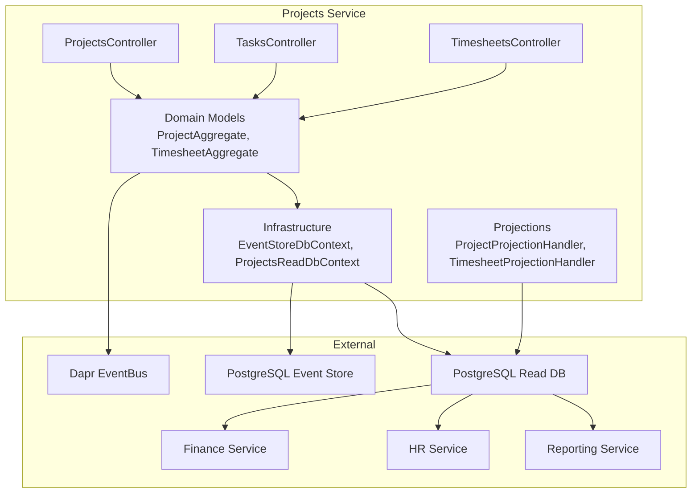
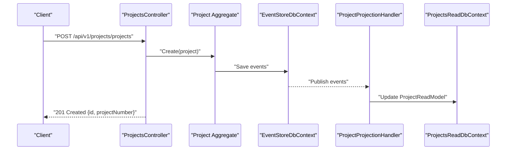
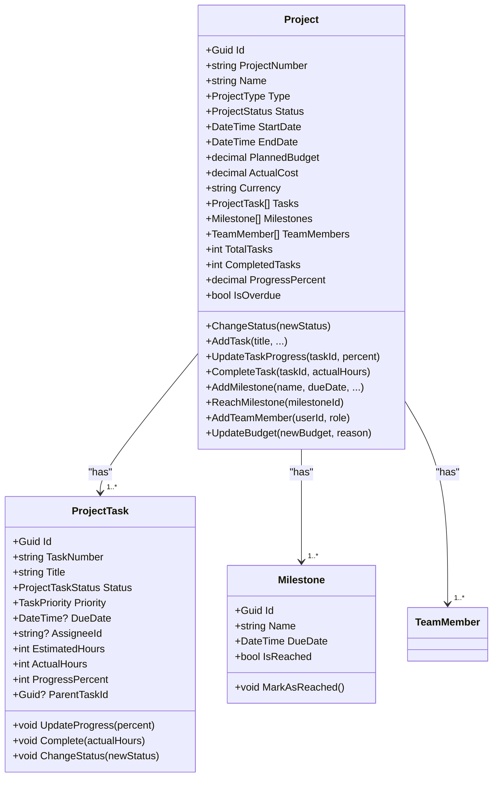
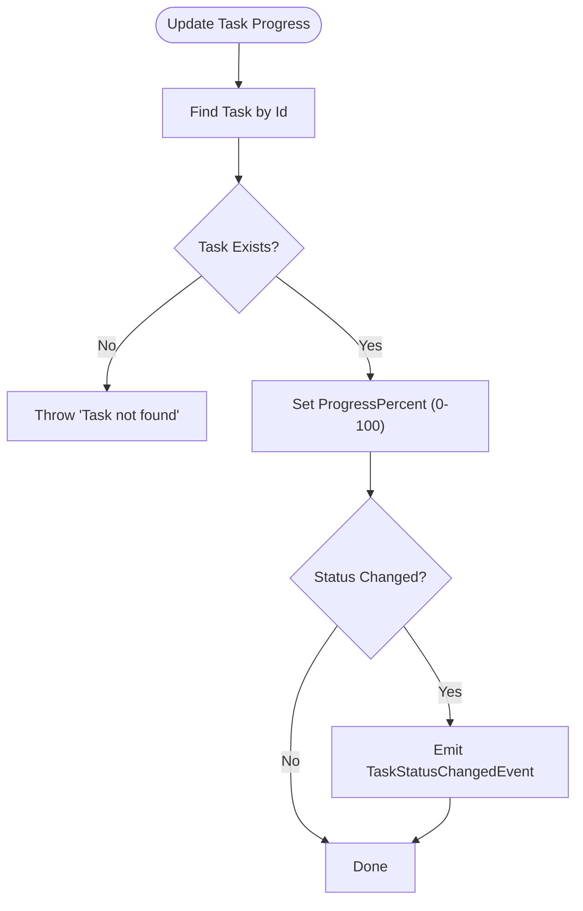
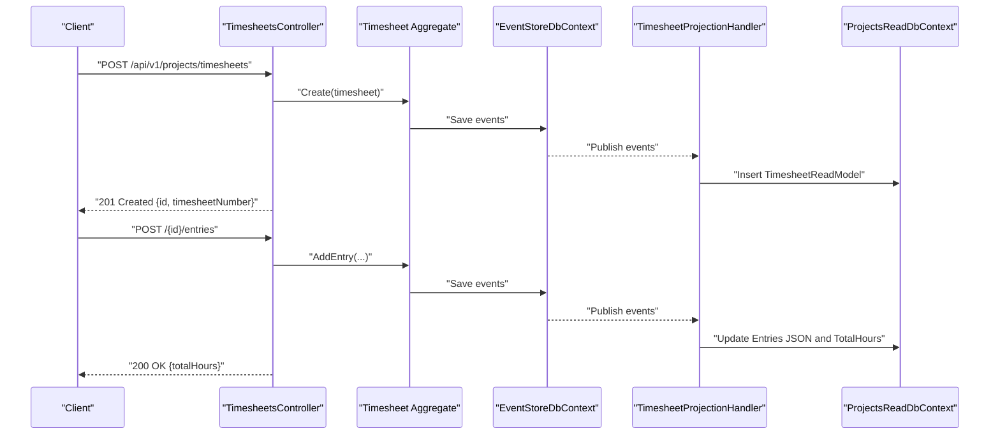
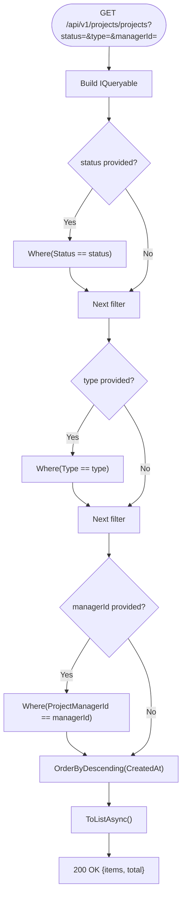
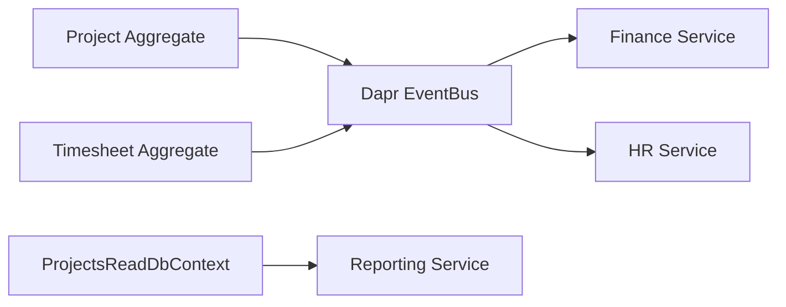
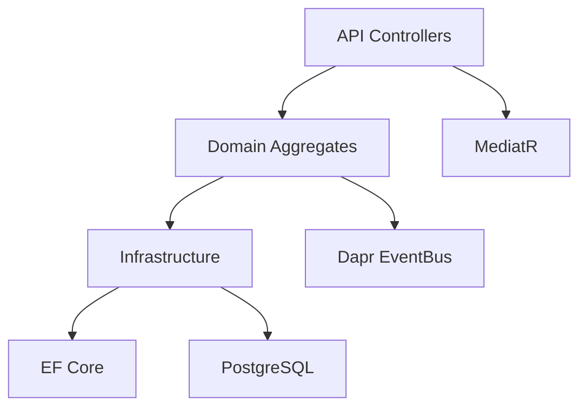

# Projects Service

<cite>
**Referenced Files in This Document**
- [Program.cs](file://src/Services/Projects/ErpSystem.Projects/Program.cs)
- [ProjectsController.cs](file://src/Services/Projects/ErpSystem.Projects/API/ProjectsController.cs)
- [TasksController.cs](file://src/Services/Projects/ErpSystem.Projects/API/TasksController.cs)
- [TimesheetsController.cs](file://src/Services/Projects/ErpSystem.Projects/API/TimesheetsController.cs)
- [ProjectAggregate.cs](file://src/Services/Projects/ErpSystem.Projects/Domain/ProjectAggregate.cs)
- [TimesheetAggregate.cs](file://src/Services/Projects/ErpSystem.Projects/Domain/TimesheetAggregate.cs)
- [Persistence.cs](file://src/Services/Projects/ErpSystem.Projects/Infrastructure/Persistence.cs)
- [Projections.cs](file://src/Services/Projects/ErpSystem.Projects/Infrastructure/Projections.cs)
- [ErpSystem.Projects.csproj](file://src/Services/Projects/ErpSystem.Projects/ErpSystem.Projects.csproj)
</cite>

## Table of Contents
1. [Introduction](#introduction)
2. [Project Structure](#project-structure)
3. [Core Components](#core-components)
4. [Architecture Overview](#architecture-overview)
5. [Detailed Component Analysis](#detailed-component-analysis)
6. [Dependency Analysis](#dependency-analysis)
7. [Performance Considerations](#performance-considerations)
8. [Troubleshooting Guide](#troubleshooting-guide)
9. [Conclusion](#conclusion)
10. [Appendices](#appendices)

## Introduction
The Projects service is a microservice responsible for managing the entire project lifecycle, including project definition, scope management, budget allocation, task management with work breakdown structures, milestone tracking, team member assignments, timesheet collection, time tracking, and labor cost allocation. It also supports project portfolio statistics and integrates with downstream services for reporting, finance, and human resources.

The service follows an event-sourced domain model with separate write (event store) and read (projection-driven) databases. It exposes REST APIs for project management, task assignment, and timesheet recording, and leverages Dapr for event bus integration.

## Project Structure
The Projects service is organized into clear layers:
- API: HTTP endpoints for CRUD and workflow operations
- Domain: Aggregates, value objects, enums, and domain events
- Infrastructure: Event store persistence, read model projections, and database contexts
- Application: MediatR handlers and cross-cutting concerns (not shown here but configured in Program.cs)

**Diagram sources**
- [Program.cs](file://src/Services/Projects/ErpSystem.Projects/Program.cs#L1-L49)
- [ProjectsController.cs](file://src/Services/Projects/ErpSystem.Projects/API/ProjectsController.cs#L1-L163)
- [TasksController.cs](file://src/Services/Projects/ErpSystem.Projects/API/TasksController.cs#L1-L102)
- [TimesheetsController.cs](file://src/Services/Projects/ErpSystem.Projects/API/TimesheetsController.cs#L1-L141)
- [ProjectAggregate.cs](file://src/Services/Projects/ErpSystem.Projects/Domain/ProjectAggregate.cs#L1-L451)
- [TimesheetAggregate.cs](file://src/Services/Projects/ErpSystem.Projects/Domain/TimesheetAggregate.cs#L1-L218)
- [Persistence.cs](file://src/Services/Projects/ErpSystem.Projects/Infrastructure/Persistence.cs#L1-L127)
- [Projections.cs](file://src/Services/Projects/ErpSystem.Projects/Infrastructure/Projections.cs#L1-L220)

**Section sources**
- [Program.cs](file://src/Services/Projects/ErpSystem.Projects/Program.cs#L1-L49)
- [ErpSystem.Projects.csproj](file://src/Services/Projects/ErpSystem.Projects/ErpSystem.Projects.csproj#L1-L25)

## Core Components
- Event Store and Read DB: Separate PostgreSQL-backed stores for events and projections
- Domain Aggregates:
  - Project: encapsulates project metadata, budget, status, tasks, milestones, and team members
  - Timesheet: captures weekly labor entries, submission/approval workflow, and totals
- Projection Handlers: transform domain events into read models for efficient querying
- API Controllers:
  - ProjectsController: project lifecycle, status changes, task/milestone/team member operations, statistics
  - TasksController: task queries, progress updates, completion, kanban board, personal task list
  - TimesheetsController: timesheet CRUD, entry management, submission/approval/rejection, summaries

**Section sources**
- [ProjectAggregate.cs](file://src/Services/Projects/ErpSystem.Projects/Domain/ProjectAggregate.cs#L280-L451)
- [TimesheetAggregate.cs](file://src/Services/Projects/ErpSystem.Projects/Domain/TimesheetAggregate.cs#L105-L218)
- [Persistence.cs](file://src/Services/Projects/ErpSystem.Projects/Infrastructure/Persistence.cs#L6-L127)
- [Projections.cs](file://src/Services/Projects/ErpSystem.Projects/Infrastructure/Projections.cs#L1-L220)
- [ProjectsController.cs](file://src/Services/Projects/ErpSystem.Projects/API/ProjectsController.cs#L1-L163)
- [TasksController.cs](file://src/Services/Projects/ErpSystem.Projects/API/TasksController.cs#L1-L102)
- [TimesheetsController.cs](file://src/Services/Projects/ErpSystem.Projects/API/TimesheetsController.cs#L1-L141)

## Architecture Overview
The service employs event sourcing and CQRS:
- Write side: aggregates emit domain events; an event store persists them
- Read side: projection handlers update denormalized read models
- API layer: controllers orchestrate commands via event store and queries via read DB

**Diagram sources**
- [ProjectsController.cs](file://src/Services/Projects/ErpSystem.Projects/API/ProjectsController.cs#L39-L60)
- [ProjectAggregate.cs](file://src/Services/Projects/ErpSystem.Projects/Domain/ProjectAggregate.cs#L306-L327)
- [Persistence.cs](file://src/Services/Projects/ErpSystem.Projects/Infrastructure/Persistence.cs#L8-L20)
- [Projections.cs](file://src/Services/Projects/ErpSystem.Projects/Infrastructure/Projections.cs#L19-L41)

## Detailed Component Analysis

### Project Lifecycle Management
- Project creation with number generation, budget initialization, and manager/customer linkage
- Status transitions (Planning → InProgress → OnHold → Completed/Cancelled)
- Budget updates with audit trail via domain events
- Team member addition with uniqueness checks
- Milestone definition and reach tracking

**Diagram sources**
- [ProjectAggregate.cs](file://src/Services/Projects/ErpSystem.Projects/Domain/ProjectAggregate.cs#L280-L451)

**Section sources**
- [ProjectsController.cs](file://src/Services/Projects/ErpSystem.Projects/API/ProjectsController.cs#L39-L113)
- [ProjectAggregate.cs](file://src/Services/Projects/ErpSystem.Projects/Domain/ProjectAggregate.cs#L306-L403)

### Task Management and Work Breakdown
- Task creation with numbering, priority, due dates, assignees, and optional parent task
- Progress tracking with automatic status transitions (Open → InProgress → InReview → Completed)
- Completion with actual hours capture
- Kanban board view grouped by status
- Personal task list filtered by assignee and status

**Diagram sources**
- [ProjectAggregate.cs](file://src/Services/Projects/ErpSystem.Projects/Domain/ProjectAggregate.cs#L350-L360)

**Section sources**
- [TasksController.cs](file://src/Services/Projects/ErpSystem.Projects/API/TasksController.cs#L39-L65)
- [ProjectAggregate.cs](file://src/Services/Projects/ErpSystem.Projects/Domain/ProjectAggregate.cs#L175-L246)

### Timesheet Collection and Labor Tracking
- Weekly timesheet creation with auto-derived end date
- Entry management with per-day hours, task association, and description
- Submission workflow requiring at least one entry
- Approval/rejection with required rejection reason
- Read-side aggregation for pending approvals and project-level summaries

**Diagram sources**
- [TimesheetsController.cs](file://src/Services/Projects/ErpSystem.Projects/API/TimesheetsController.cs#L39-L65)
- [TimesheetAggregate.cs](file://src/Services/Projects/ErpSystem.Projects/Domain/TimesheetAggregate.cs#L124-L148)
- [Projections.cs](file://src/Services/Projects/ErpSystem.Projects/Infrastructure/Projections.cs#L154-L182)

**Section sources**
- [TimesheetsController.cs](file://src/Services/Projects/ErpSystem.Projects/API/TimesheetsController.cs#L39-L127)
- [TimesheetAggregate.cs](file://src/Services/Projects/ErpSystem.Projects/Domain/TimesheetAggregate.cs#L107-L178)

### Project Portfolio Management and Statistics
- Filtering projects by status, type, and manager
- Portfolio statistics including counts by status, total planned budget, and average progress
- Read-model driven for fast analytics and dashboards

**Diagram sources**
- [ProjectsController.cs](file://src/Services/Projects/ErpSystem.Projects/API/ProjectsController.cs#L13-L30)

**Section sources**
- [ProjectsController.cs](file://src/Services/Projects/ErpSystem.Projects/API/ProjectsController.cs#L115-L129)

### Integration Patterns
- Dapr EventBus: Domain events are published to downstream systems for cross-service reactions
- Finance Service: Read models feed financial reporting and invoicing workflows
- HR Service: Team member additions integrate with employee records and capacity planning
- Reporting Service: Project and timesheet read models power dashboards and analytics

**Diagram sources**
- [Program.cs](file://src/Services/Projects/ErpSystem.Projects/Program.cs#L15-L16)
- [Projections.cs](file://src/Services/Projects/ErpSystem.Projects/Infrastructure/Projections.cs#L1-L220)

## Dependency Analysis
- Internal dependencies:
  - Controllers depend on IEventStore for command execution and read DB for filtering
  - Domain aggregates depend on IDomainEvent and apply change logic
  - Projections depend on read DB contexts and MediatR notifications
- External dependencies:
  - Entity Framework Core with PostgreSQL for event and read stores
  - Dapr for event bus integration
  - Swashbuckle for API documentation

**Diagram sources**
- [Program.cs](file://src/Services/Projects/ErpSystem.Projects/Program.cs#L1-L49)
- [ProjectsController.cs](file://src/Services/Projects/ErpSystem.Projects/API/ProjectsController.cs#L1-L12)
- [Persistence.cs](file://src/Services/Projects/ErpSystem.Projects/Infrastructure/Persistence.cs#L1-L127)

**Section sources**
- [ErpSystem.Projects.csproj](file://src/Services/Projects/ErpSystem.Projects/ErpSystem.Projects.csproj#L1-L25)
- [Program.cs](file://src/Services/Projects/ErpSystem.Projects/Program.cs#L1-L49)

## Performance Considerations
- Indexes on read models (projects, tasks, timesheets) support filtering and sorting
- JSONB fields for arrays (milestones, team members, entries) enable flexible projections but require careful querying
- Event sourcing reduces write contention on aggregates; projections decouple reads
- Consider partitioning or materialized views for heavy analytics workloads

[No sources needed since this section provides general guidance]

## Troubleshooting Guide
Common issues and resolutions:
- Task not found during progress/update/completion: ensure taskId belongs to the queried project
- Invalid operation on timesheet state: drafts or rejections can be edited; submitted/approved cannot accept new entries
- Empty submission: submissions require at least one entry
- Negative budget: budget updates reject negative values
- Duplicate team member: adding an existing user raises an exception

**Section sources**
- [ProjectAggregate.cs](file://src/Services/Projects/ErpSystem.Projects/Domain/ProjectAggregate.cs#L352-L366)
- [TimesheetAggregate.cs](file://src/Services/Projects/ErpSystem.Projects/Domain/TimesheetAggregate.cs#L140-L156)

## Conclusion
The Projects service provides a robust, event-sourced foundation for project lifecycle management with clear separation between write and read concerns. Its APIs support comprehensive project setup, task and milestone tracking, team collaboration, and labor cost capture. Integration with Finance, HR, and Reporting enables end-to-end project portfolio visibility and analytics.

[No sources needed since this section summarizes without analyzing specific files]

## Appendices

### API Endpoints Reference

- Projects
  - GET /api/v1/projects/projects?status={}&type={}&managerId={}
  - GET /api/v1/projects/projects/{id}
  - POST /api/v1/projects/projects
  - PUT /api/v1/projects/projects/{id}/status
  - POST /api/v1/projects/projects/{id}/tasks
  - POST /api/v1/projects/projects/{id}/milestones
  - POST /api/v1/projects/projects/{id}/team-members
  - GET /api/v1/projects/projects/statistics

- Tasks
  - GET /api/v1/projects/tasks?projectId={}&status={}&assigneeId={}
  - GET /api/v1/projects/tasks/{id}
  - PUT /api/v1/projects/tasks/{id}/progress
  - POST /api/v1/projects/tasks/{id}/complete
  - GET /api/v1/projects/tasks/kanban/{projectId}
  - GET /api/v1/projects/tasks/my-tasks?userId={}

- Timesheets
  - GET /api/v1/projects/timesheets?projectId={}&userId={}&status={}
  - GET /api/v1/projects/timesheets/{id}
  - POST /api/v1/projects/timesheets
  - POST /api/v1/projects/timesheets/{id}/entries
  - POST /api/v1/projects/timesheets/{id}/submit
  - POST /api/v1/projects/timesheets/{id}/approve
  - POST /api/v1/projects/timesheets/{id}/reject
  - GET /api/v1/projects/timesheets/pending-approval
  - GET /api/v1/projects/timesheets/summary?projectId={}

**Section sources**
- [ProjectsController.cs](file://src/Services/Projects/ErpSystem.Projects/API/ProjectsController.cs#L13-L129)
- [TasksController.cs](file://src/Services/Projects/ErpSystem.Projects/API/TasksController.cs#L13-L92)
- [TimesheetsController.cs](file://src/Services/Projects/ErpSystem.Projects/API/TimesheetsController.cs#L13-L127)