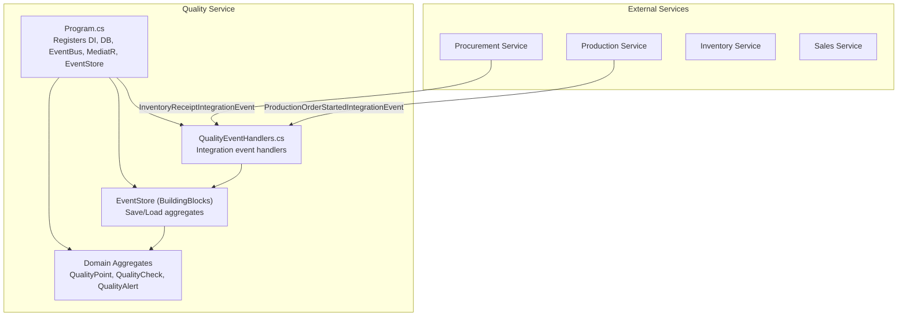
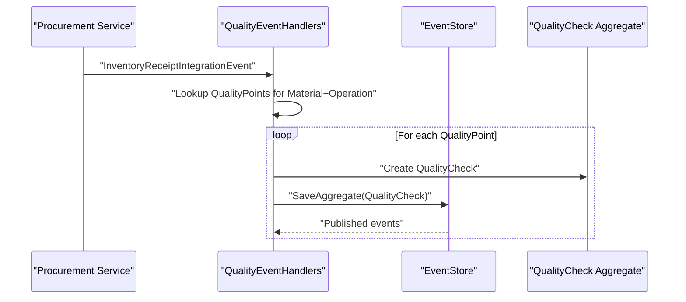
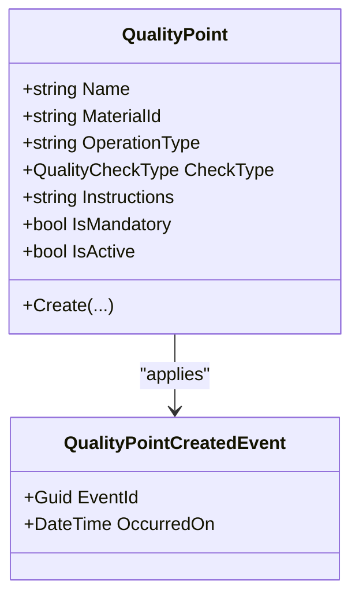
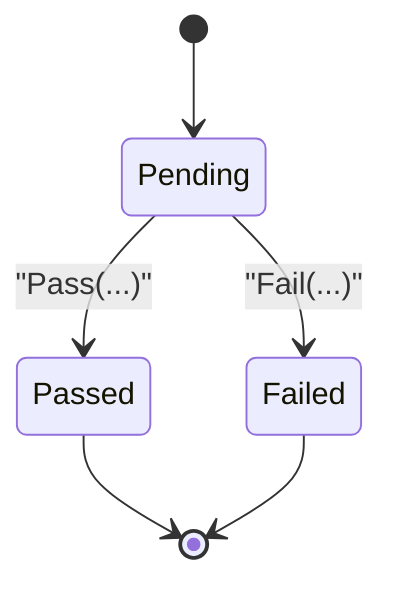
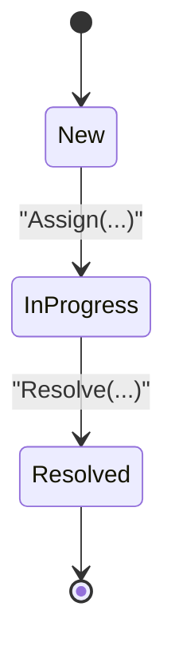
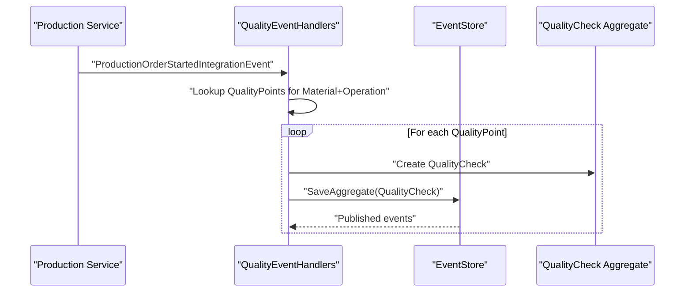
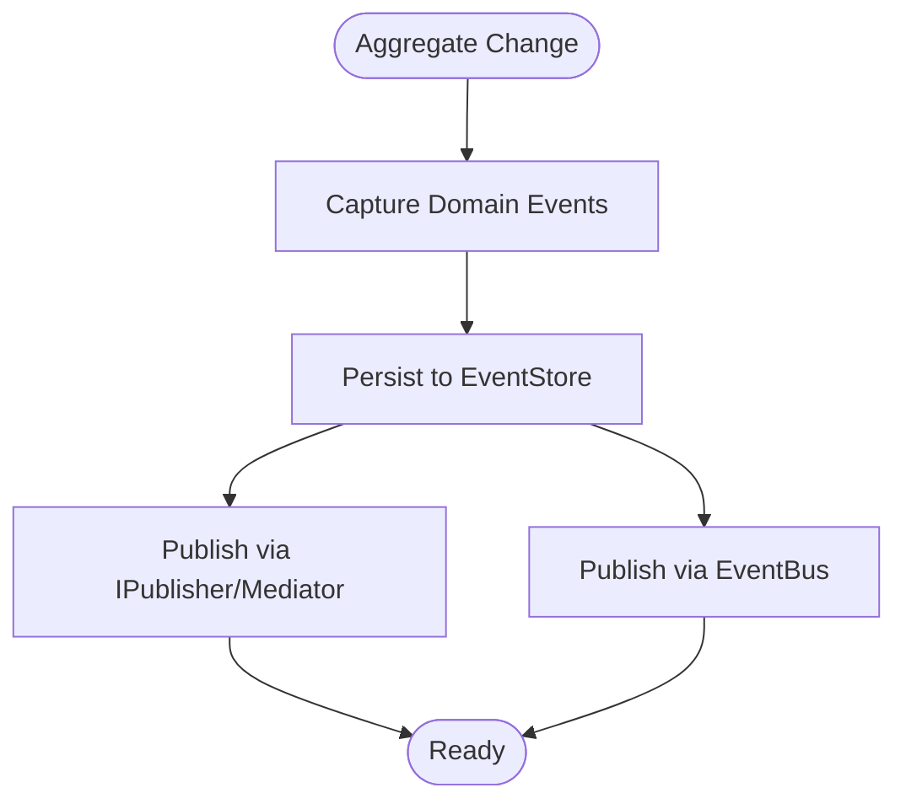
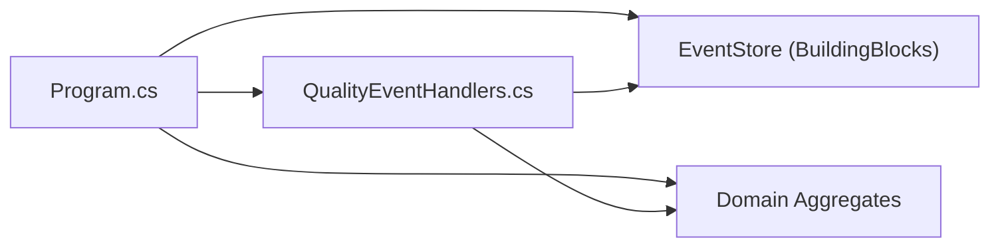

# Quality Management Service

<cite>
**Referenced Files in This Document**
- [Program.cs](file://src/Services/Quality/ErpSystem.Quality/Program.cs)
- [QualityEventHandlers.cs](file://src/Services/Quality/ErpSystem.Quality/Application/QualityEventHandlers.cs)
- [QualityAlertAggregate.cs](file://src/Services/Quality/ErpSystem.Quality/Domain/QualityAlertAggregate.cs)
- [QualityCheckAggregate.cs](file://src/Services/Quality/ErpSystem.Quality/Domain/QualityCheckAggregate.cs)
- [QualityPointAggregate.cs](file://src/Services/Quality/ErpSystem.Quality/Domain/QualityPointAggregate.cs)
- [DDDBase.cs](file://src/BuildingBlocks/ErpSystem.BuildingBlocks/Domain/DDDBase.cs)
- [OutboxInterceptor.cs](file://src/BuildingBlocks/ErpSystem.BuildingBlocks/Outbox/OutboxInterceptor.cs)
- [QualityWorkflowTests.cs](file://src/Tests/ErpSystem.IntegrationTests/Quality/QualityWorkflowTests.cs)
- [PRD-07-Production-Service.md](file://docs/PRD-07-Production-Service.md)
</cite>

## Table of Contents
1. [Introduction](#introduction)
2. [Project Structure](#project-structure)
3. [Core Components](#core-components)
4. [Architecture Overview](#architecture-overview)
5. [Detailed Component Analysis](#detailed-component-analysis)
6. [Dependency Analysis](#dependency-analysis)
7. [Performance Considerations](#performance-considerations)
8. [Troubleshooting Guide](#troubleshooting-guide)
9. [Conclusion](#conclusion)
10. [Appendices](#appendices)

## Introduction
This document describes the Quality Management service, focusing on quality assurance and control processes. It covers inspection planning, sampling strategies, acceptance criteria, alert systems for non-conformance, quality point management for critical control points, quality documentation, supplier quality management, and integration patterns with Procurement, Production, and Sales. It also outlines API endpoints for quality operations, inspection recording, and non-conformance handling, along with analytics and continuous improvement practices.

## Project Structure
The Quality service follows a clean architecture with domain-driven design, event sourcing, and integration via Dapr. The service registers an event bus, MediatR for commands/queries, and an event store for persisting domain events. It exposes minimal controller surface and orchestrates quality workflows through integration event handlers.

**Diagram sources**
- [Program.cs](file://src/Services/Quality/ErpSystem.Quality/Program.cs#L9-L41)
- [QualityEventHandlers.cs](file://src/Services/Quality/ErpSystem.Quality/Application/QualityEventHandlers.cs#L10-L74)
- [DDDBase.cs](file://src/BuildingBlocks/ErpSystem.BuildingBlocks/Domain/DDDBase.cs#L59-L120)

**Section sources**
- [Program.cs](file://src/Services/Quality/ErpSystem.Quality/Program.cs#L1-L61)

## Core Components
- QualityPoint: Defines a quality requirement for a material and operation type (e.g., RECEIPT, PRODUCTION_START). It includes check type, instructions, and mandatory flag.
- QualityCheck: Represents an instance of a quality check linked to a QualityPoint. Supports pass/fail transitions with associated metadata.
- QualityAlert: Tracks non-conformance issues with priority, status, assignment, and resolution lifecycle.
- EventStore: Event sourcing persistence and publishing for aggregates.
- Integration Event Handlers: Automatically trigger quality checks upon external events (inventory receipt, production start).

Key capabilities:
- Automatic IQC creation on inventory receipt.
- Automatic PQC creation on production order start.
- Quality point lookup per material and operation.
- Event-driven state transitions for checks and alerts.

**Section sources**
- [QualityPointAggregate.cs](file://src/Services/Quality/ErpSystem.Quality/Domain/QualityPointAggregate.cs#L8-L58)
- [QualityCheckAggregate.cs](file://src/Services/Quality/ErpSystem.Quality/Domain/QualityCheckAggregate.cs#L8-L75)
- [QualityAlertAggregate.cs](file://src/Services/Quality/ErpSystem.Quality/Domain/QualityAlertAggregate.cs#L8-L70)
- [DDDBase.cs](file://src/BuildingBlocks/ErpSystem.BuildingBlocks/Domain/DDDBase.cs#L59-L120)
- [QualityEventHandlers.cs](file://src/Services/Quality/ErpSystem.Quality/Application/QualityEventHandlers.cs#L10-L74)

## Architecture Overview
The Quality service uses event sourcing and CQRS with MediatR. Integration events from Procurement and Production drive quality workflows. The event store persists events and publishes notifications to the event bus and mediator.

**Diagram sources**
- [QualityEventHandlers.cs](file://src/Services/Quality/ErpSystem.Quality/Application/QualityEventHandlers.cs#L18-L45)
- [DDDBase.cs](file://src/BuildingBlocks/ErpSystem.BuildingBlocks/Domain/DDDBase.cs#L62-L99)

**Section sources**
- [QualityEventHandlers.cs](file://src/Services/Quality/ErpSystem.Quality/Application/QualityEventHandlers.cs#L10-L74)
- [DDDBase.cs](file://src/BuildingBlocks/ErpSystem.BuildingBlocks/Domain/DDDBase.cs#L59-L120)

## Detailed Component Analysis

### QualityPoint Management
QualityPoint defines the requirement for a specific material and operation. It supports:
- Operation types: RECEIPT, PRODUCTION_START, PACKING, etc.
- Check types: Pass/Fail, Measurement, Visual.
- Mandatory vs. optional checks.
- Instructions for inspectors.

**Diagram sources**
- [QualityPointAggregate.cs](file://src/Services/Quality/ErpSystem.Quality/Domain/QualityPointAggregate.cs#L8-L58)

**Section sources**
- [QualityPointAggregate.cs](file://src/Services/Quality/ErpSystem.Quality/Domain/QualityPointAggregate.cs#L8-L58)

### QualityCheck Workflow
QualityCheck instances are created automatically from QualityPoints and support pass/fail transitions with metadata.

**Diagram sources**
- [QualityCheckAggregate.cs](file://src/Services/Quality/ErpSystem.Quality/Domain/QualityCheckAggregate.cs#L54-L75)

**Section sources**
- [QualityCheckAggregate.cs](file://src/Services/Quality/ErpSystem.Quality/Domain/QualityCheckAggregate.cs#L8-L75)

### QualityAlert Lifecycle
QualityAlert tracks non-conformance issues with priority and status, supporting assignment and resolution.

**Diagram sources**
- [QualityAlertAggregate.cs](file://src/Services/Quality/ErpSystem.Quality/Domain/QualityAlertAggregate.cs#L48-L69)

**Section sources**
- [QualityAlertAggregate.cs](file://src/Services/Quality/ErpSystem.Quality/Domain/QualityAlertAggregate.cs#L8-L70)

### Integration Event Handlers
Automatic quality checks are triggered by integration events:
- Inventory receipt → IQC checks
- Production order started → PQC checks

**Diagram sources**
- [QualityEventHandlers.cs](file://src/Services/Quality/ErpSystem.Quality/Application/QualityEventHandlers.cs#L50-L73)
- [DDDBase.cs](file://src/BuildingBlocks/ErpSystem.BuildingBlocks/Domain/DDDBase.cs#L62-L99)

**Section sources**
- [QualityEventHandlers.cs](file://src/Services/Quality/ErpSystem.Quality/Application/QualityEventHandlers.cs#L10-L74)

### Event Sourcing and Outbox
The service uses an event store to persist domain events and publish notifications. Outbox interception captures domain events to ensure reliable delivery.

**Diagram sources**
- [DDDBase.cs](file://src/BuildingBlocks/ErpSystem.BuildingBlocks/Domain/DDDBase.cs#L62-L99)
- [OutboxInterceptor.cs](file://src/BuildingBlocks/ErpSystem.BuildingBlocks/Outbox/OutboxInterceptor.cs#L34-L46)

**Section sources**
- [DDDBase.cs](file://src/BuildingBlocks/ErpSystem.BuildingBlocks/Domain/DDDBase.cs#L59-L120)
- [OutboxInterceptor.cs](file://src/BuildingBlocks/ErpSystem.BuildingBlocks/Outbox/OutboxInterceptor.cs#L31-L49)

## Dependency Analysis
- Program.cs registers the event bus, MediatR, and the event store. It also registers repositories and handlers.
- QualityEventHandlers depends on IEventStore, IQualityPointRepository, and logs progress.
- Domain aggregates depend on the building blocks for event sourcing and IDomainEvent handling.

**Diagram sources**
- [Program.cs](file://src/Services/Quality/ErpSystem.Quality/Program.cs#L21-L40)
- [QualityEventHandlers.cs](file://src/Services/Quality/ErpSystem.Quality/Application/QualityEventHandlers.cs#L10-L13)

**Section sources**
- [Program.cs](file://src/Services/Quality/ErpSystem.Quality/Program.cs#L21-L40)
- [QualityEventHandlers.cs](file://src/Services/Quality/ErpSystem.Quality/Application/QualityEventHandlers.cs#L10-L13)

## Performance Considerations
- Event sourcing writes multiple events per aggregate change; batch processing and indexing on EventStream aggregateId/version improve load performance.
- Use projection read models (e.g., QualityCheckReadModel) for efficient queries.
- Limit concurrent quality check creation during high-volume receipts by leveraging asynchronous processing and backpressure.
- Cache QualityPoint lookups per material and operation type to reduce database round-trips.

## Troubleshooting Guide
Common issues and resolutions:
- Quality check not created after receipt: Verify integration event delivery and handler registration.
- Invalid state transitions: Ensure checks are Pending before calling Pass/Fail.
- Missing QualityPoint: Confirm material and operation type alignment and that QualityPoint is active and mandatory.
- Event delivery failures: Review outbox and event bus configurations.

**Section sources**
- [QualityCheckAggregate.cs](file://src/Services/Quality/ErpSystem.Quality/Domain/QualityCheckAggregate.cs#L38-L52)
- [QualityEventHandlers.cs](file://src/Services/Quality/ErpSystem.Quality/Application/QualityEventHandlers.cs#L18-L45)
- [OutboxInterceptor.cs](file://src/BuildingBlocks/ErpSystem.BuildingBlocks/Outbox/OutboxInterceptor.cs#L31-L49)

## Conclusion
The Quality Management service provides a robust, event-driven framework for managing quality checks across supplier receipt and production processes. Its event-sourced design ensures auditability and resilience, while integration handlers automate quality workflows. Extending the service with explicit APIs, documentation generation, analytics, and continuous improvement dashboards will further strengthen quality assurance capabilities.

## Appendices

### API Endpoints for Quality Operations
Note: The current service exposes minimal controller surface. The following endpoints are suggested for future implementation to support manual inspection recording and non-conformance handling.

- POST /api/v1/quality/checks
  - Purpose: Record a new quality check instance.
  - Body: { tenantId, qualityPointId, sourceId, sourceType, materialId }
  - Returns: Created QualityCheck identifier and initial status.

- POST /api/v1/quality/checks/{id}/pass
  - Purpose: Mark a pending check as passed.
  - Body: { note, performedBy }
  - Returns: Updated QualityCheck status.

- POST /api/v1/quality/checks/{id}/fail
  - Purpose: Mark a pending check as failed.
  - Body: { reason, performedBy }
  - Returns: Updated QualityCheck status.

- POST /api/v1/quality/alerts
  - Purpose: Create a quality alert for non-conformance.
  - Body: { tenantId, description, materialId, sourceId, priority }
  - Returns: Created QualityAlert identifier.

- PUT /api/v1/quality/alerts/{id}/assign
  - Purpose: Assign alert to a team or person.
  - Body: { assignedTo }
  - Returns: Updated QualityAlert status.

- PUT /api/v1/quality/alerts/{id}/resolve
  - Purpose: Resolve alert with resolution details.
  - Body: { resolution }
  - Returns: Updated QualityAlert status.

- GET /api/v1/quality/reports/trends
  - Purpose: Retrieve quality trends and metrics.
  - Query: { materialId, fromDate, toDate, groupBy }
  - Returns: Trend data for charts and dashboards.

- GET /api/v1/quality/reports/compliance
  - Purpose: Compliance summary by material and period.
  - Query: { materialId, period }
  - Returns: Compliance statistics.

[No sources needed since this section proposes API designs conceptually]

### Integration Patterns
- Procurement integration: On inventory receipt, automatically create IQC checks aligned with material-specific QualityPoints.
- Production integration: On production order start, create PQC checks for the material and operation.
- Sales integration: Quality alerts can influence shipment release decisions; integrate with Sales to block shipments with unresolved high-priority alerts.

**Section sources**
- [QualityEventHandlers.cs](file://src/Services/Quality/ErpSystem.Quality/Application/QualityEventHandlers.cs#L18-L73)
- [PRD-07-Production-Service.md](file://docs/PRD-07-Production-Service.md#L338-L394)

### Quality Documentation and Certificates
- Maintain certificates of analysis (CoA) and quality reports as external artifacts linked to materialId and batch/sourceId.
- Use QualityCheck and QualityAlert identifiers to reference evidence in CoAs and reports.
- Store document metadata (name, URL, upload date) in a document management system and link via materialId/sourceId.

[No sources needed since this section provides general guidance]

### Quality Analytics and Continuous Improvement
- Track defect rates, rework percentages, and supplier performance metrics.
- Use trend analysis to identify recurring non-conformances and drive corrective actions.
- Establish KPIs for first-pass yield, alert resolution time, and supplier acceptance rate.

[No sources needed since this section provides general guidance]