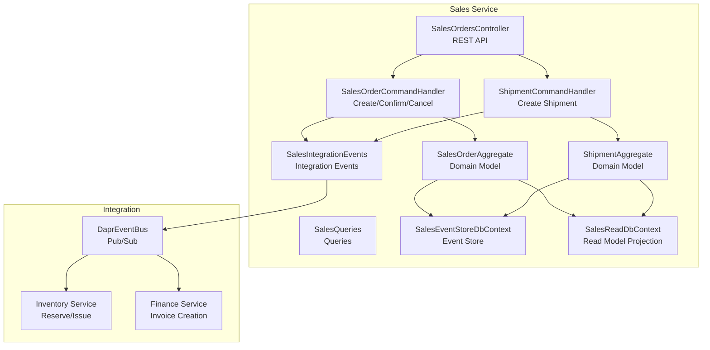
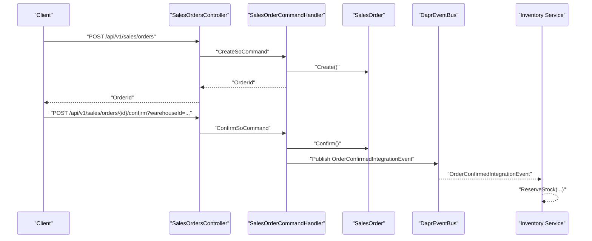
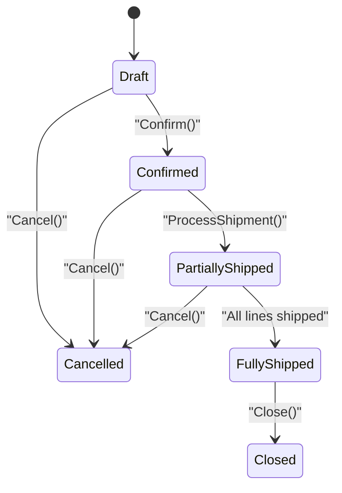
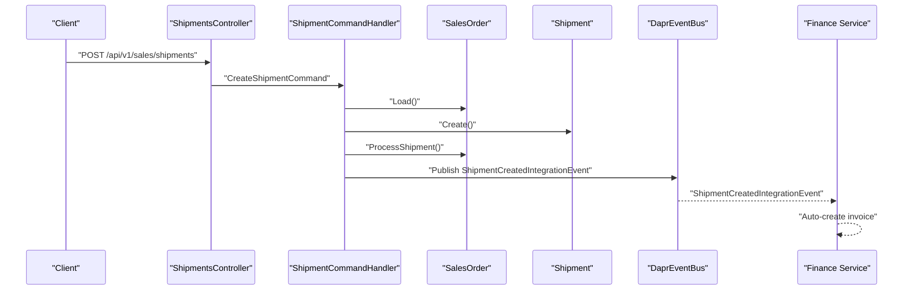
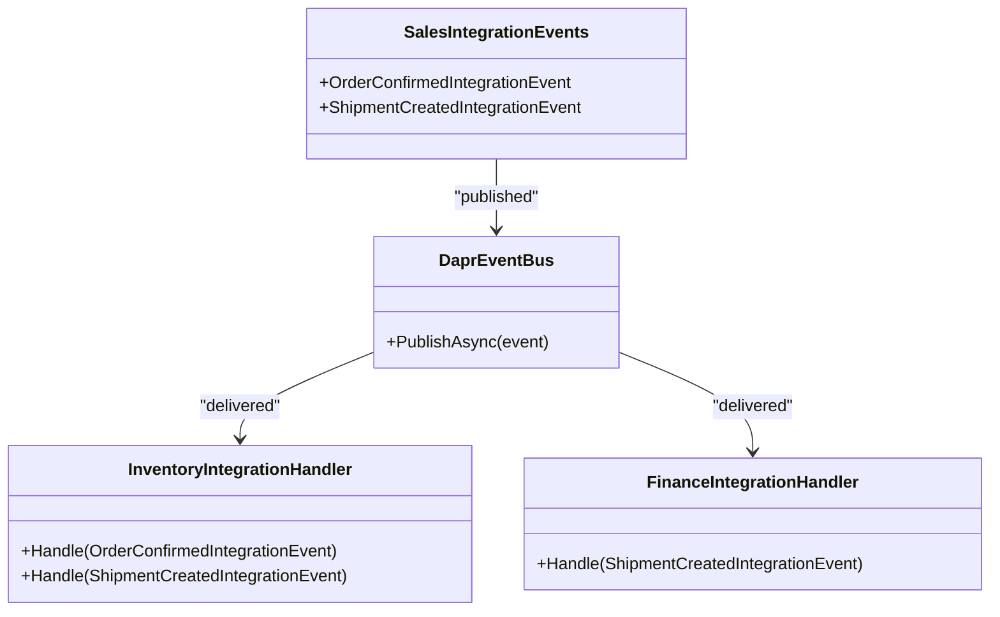
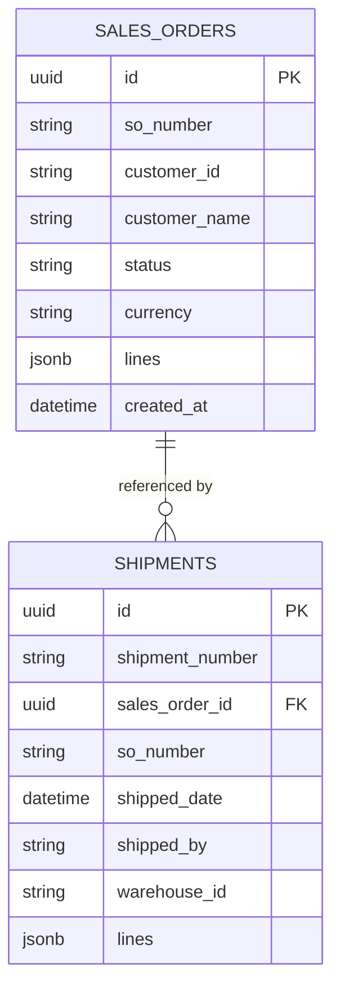
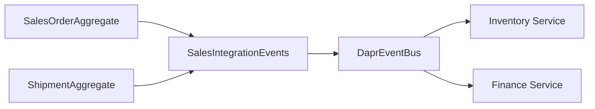
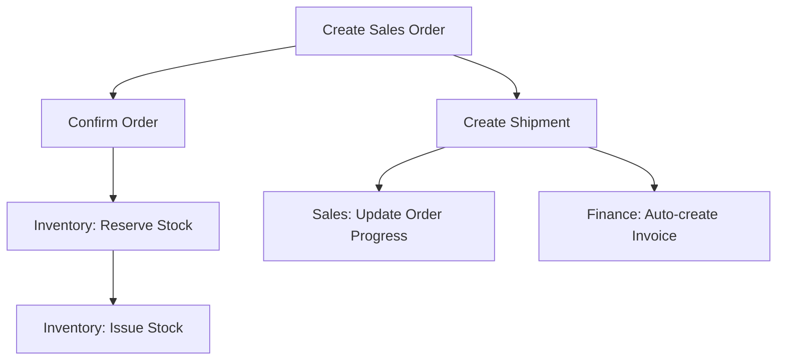

# Sales Service

<cite>
**Referenced Files in This Document**
- [Program.cs](file://src/Services/Sales/ErpSystem.Sales/Program.cs)
- [SalesOrdersController.cs](file://src/Services/Sales/ErpSystem.Sales/API/SalesOrdersController.cs)
- [ShipmentCommands.cs](file://src/Services/Sales/ErpSystem.Sales/Application/ShipmentCommands.cs)
- [SalesOrderCommands.cs](file://src/Services/Sales/ErpSystem.Sales/Application/SalesOrderCommands.cs)
- [SalesQueries.cs](file://src/Services/Sales/ErpSystem.Sales/Application/SalesQueries.cs)
- [SalesOrderAggregate.cs](file://src/Services/Sales/ErpSystem.Sales/Domain/SalesOrderAggregate.cs)
- [ShipmentAggregate.cs](file://src/Services/Sales/ErpSystem.Sales/Domain/ShipmentAggregate.cs)
- [SalesEvents.cs](file://src/Services/Sales/ErpSystem.Sales/Domain/SalesEvents.cs)
- [Persistence.cs](file://src/Services/Sales/ErpSystem.Sales/Infrastructure/Persistence.cs)
- [DaprEventBus.cs](file://src/BuildingBlocks/ErpSystem.BuildingBlocks/EventBus/DaprEventBus.cs)
- [IntegrationEventHandlers.cs](file://src/Services/Inventory/ErpSystem.Inventory/Application/IntegrationEventHandlers.cs)
- [IntegrationEventsController.cs](file://src/Services/Finance/ErpSystem.Finance/API/IntegrationEventsController.cs)
- [IntegrationEventHandlers.cs](file://src/Services/Finance/ErpSystem.Finance/Application/IntegrationEventHandlers.cs)
- [PRD-05-Inventory-Service.md](file://docs/PRD-05-Inventory-Service.md)
- [PRD-01-MasterData-Service.md](file://docs/PRD-01-MasterData-Service.md)
- [SalesToInventoryTests.cs](file://src/Tests/ErpSystem.IntegrationTests/SalesToInventoryTests.cs)
</cite>

## Table of Contents
1. [Introduction](#introduction)
2. [Project Structure](#project-structure)
3. [Core Components](#core-components)
4. [Architecture Overview](#architecture-overview)
5. [Detailed Component Analysis](#detailed-component-analysis)
6. [Dependency Analysis](#dependency-analysis)
7. [Performance Considerations](#performance-considerations)
8. [Troubleshooting Guide](#troubleshooting-guide)
9. [Conclusion](#conclusion)
10. [Appendices](#appendices)

## Introduction
This document describes the Sales service that manages the complete sales order lifecycle, from quote-to-cash, including order processing, pricing and discount calculations, shipment coordination, invoice generation triggers, and integration with Inventory, Finance, and MasterData. It also outlines APIs for sales order management, shipment processing, and customer interactions, and explains integration patterns with downstream systems.

## Project Structure
The Sales service is implemented as a .NET microservice using CQRS and event sourcing. It exposes REST endpoints via ASP.NET Core controllers, coordinates domain actions through MediatR handlers, persists events to a Postgres-backed event store, and publishes integration events over Dapr Pub/Sub to integrate with Inventory and Finance.

**Diagram sources**
- [SalesOrdersController.cs](file://src/Services/Sales/ErpSystem.Sales/API/SalesOrdersController.cs#L1-L45)
- [SalesOrderCommands.cs](file://src/Services/Sales/ErpSystem.Sales/Application/SalesOrderCommands.cs#L1-L67)
- [ShipmentCommands.cs](file://src/Services/Sales/ErpSystem.Sales/Application/ShipmentCommands.cs#L1-L61)
- [SalesOrderAggregate.cs](file://src/Services/Sales/ErpSystem.Sales/Domain/SalesOrderAggregate.cs#L1-L148)
- [ShipmentAggregate.cs](file://src/Services/Sales/ErpSystem.Sales/Domain/ShipmentAggregate.cs#L1-L61)
- [SalesEvents.cs](file://src/Services/Sales/ErpSystem.Sales/Domain/SalesEvents.cs#L1-L32)
- [Persistence.cs](file://src/Services/Sales/ErpSystem.Sales/Infrastructure/Persistence.cs#L1-L56)
- [DaprEventBus.cs](file://src/BuildingBlocks/ErpSystem.BuildingBlocks/EventBus/DaprEventBus.cs#L1-L31)

**Section sources**
- [Program.cs](file://src/Services/Sales/ErpSystem.Sales/Program.cs#L1-L72)
- [SalesOrdersController.cs](file://src/Services/Sales/ErpSystem.Sales/API/SalesOrdersController.cs#L1-L45)
- [Persistence.cs](file://src/Services/Sales/ErpSystem.Sales/Infrastructure/Persistence.cs#L1-L56)

## Core Components
- REST API surface for sales orders and shipments
- CQRS commands and queries for order lifecycle management
- Domain aggregates for sales orders and shipments with event-sourced state
- Integration events for Inventory reservation and stock issue
- Read model projections for querying and reporting
- Dapr Pub/Sub for cross-service communication

Key capabilities:
- Create sales orders with customer, currency, and line items
- Confirm orders to trigger stock reservation
- Cancel orders with reason
- Create shipments and update order progress
- Query orders and billable lines
- Publish integration events for Inventory and Finance

**Section sources**
- [SalesOrdersController.cs](file://src/Services/Sales/ErpSystem.Sales/API/SalesOrdersController.cs#L1-L45)
- [SalesOrderCommands.cs](file://src/Services/Sales/ErpSystem.Sales/Application/SalesOrderCommands.cs#L1-L67)
- [ShipmentCommands.cs](file://src/Services/Sales/ErpSystem.Sales/Application/ShipmentCommands.cs#L1-L61)
- [SalesQueries.cs](file://src/Services/Sales/ErpSystem.Sales/Application/SalesQueries.cs#L1-L78)
- [SalesOrderAggregate.cs](file://src/Services/Sales/ErpSystem.Sales/Domain/SalesOrderAggregate.cs#L1-L148)
- [ShipmentAggregate.cs](file://src/Services/Sales/ErpSystem.Sales/Domain/ShipmentAggregate.cs#L1-L61)
- [SalesEvents.cs](file://src/Services/Sales/ErpSystem.Sales/Domain/SalesEvents.cs#L1-L32)
- [Persistence.cs](file://src/Services/Sales/ErpSystem.Sales/Infrastructure/Persistence.cs#L1-L56)

## Architecture Overview
The Sales service follows an event-driven architecture:
- Controllers accept requests and delegate to MediatR handlers
- Handlers orchestrate domain operations and publish integration events
- Domain aggregates encapsulate business logic and apply events
- Event store persists domain events; read models support queries
- Dapr Pub/Sub delivers integration events to Inventory and Finance

**Diagram sources**
- [SalesOrdersController.cs](file://src/Services/Sales/ErpSystem.Sales/API/SalesOrdersController.cs#L1-L45)
- [SalesOrderCommands.cs](file://src/Services/Sales/ErpSystem.Sales/Application/SalesOrderCommands.cs#L1-L67)
- [SalesOrderAggregate.cs](file://src/Services/Sales/ErpSystem.Sales/Domain/SalesOrderAggregate.cs#L1-L148)
- [SalesEvents.cs](file://src/Services/Sales/ErpSystem.Sales/Domain/SalesEvents.cs#L1-L32)
- [DaprEventBus.cs](file://src/BuildingBlocks/ErpSystem.BuildingBlocks/EventBus/DaprEventBus.cs#L1-L31)
- [IntegrationEventHandlers.cs](file://src/Services/Inventory/ErpSystem.Inventory/Application/IntegrationEventHandlers.cs#L34-L74)

## Detailed Component Analysis

### Sales Orders: Lifecycle and Pricing
- Lifecycle states: Draft, PendingApproval, Confirmed, PartiallyShipped, FullyShipped, Closed, Cancelled
- Pricing and discounts per line: unit price and discount rate applied to compute line amount
- Totals computed from line amounts
- Confirmation validates state and publishes integration event for Inventory reservation
- Cancellation validates state and updates status

**Diagram sources**
- [SalesOrderAggregate.cs](file://src/Services/Sales/ErpSystem.Sales/Domain/SalesOrderAggregate.cs#L5-L14)
- [SalesOrderAggregate.cs](file://src/Services/Sales/ErpSystem.Sales/Domain/SalesOrderAggregate.cs#L91-L111)

**Section sources**
- [SalesOrderAggregate.cs](file://src/Services/Sales/ErpSystem.Sales/Domain/SalesOrderAggregate.cs#L1-L148)
- [SalesOrderCommands.cs](file://src/Services/Sales/ErpSystem.Sales/Application/SalesOrderCommands.cs#L1-L67)

### Shipments: Delivery Scheduling and Tracking
- Shipment creation links to a sales order, captures shipped date, by, and warehouse
- Updates sales order progress per shipped lines
- Publishes integration event for Inventory issue and optional Finance invoice creation

**Diagram sources**
- [SalesOrdersController.cs](file://src/Services/Sales/ErpSystem.Sales/API/SalesOrdersController.cs#L38-L45)
- [ShipmentCommands.cs](file://src/Services/Sales/ErpSystem.Sales/Application/ShipmentCommands.cs#L1-L61)
- [SalesOrderAggregate.cs](file://src/Services/Sales/ErpSystem.Sales/Domain/SalesOrderAggregate.cs#L105-L111)
- [SalesEvents.cs](file://src/Services/Sales/ErpSystem.Sales/Domain/SalesEvents.cs#L19-L31)
- [IntegrationEventsController.cs](file://src/Services/Finance/ErpSystem.Finance/API/IntegrationEventsController.cs#L1-L22)
- [IntegrationEventHandlers.cs](file://src/Services/Finance/ErpSystem.Finance/Application/IntegrationEventHandlers.cs#L1-L37)

**Section sources**
- [ShipmentAggregate.cs](file://src/Services/Sales/ErpSystem.Sales/Domain/ShipmentAggregate.cs#L1-L61)
- [ShipmentCommands.cs](file://src/Services/Sales/ErpSystem.Sales/Application/ShipmentCommands.cs#L1-L61)

### Integration Events and Cross-Service Coordination
- Order confirmed: Inventory reserves stock by material and quantity
- Shipment created: Inventory issues stock and releases reservations; Finance auto-creates invoices

**Diagram sources**
- [SalesEvents.cs](file://src/Services/Sales/ErpSystem.Sales/Domain/SalesEvents.cs#L1-L32)
- [DaprEventBus.cs](file://src/BuildingBlocks/ErpSystem.BuildingBlocks/EventBus/DaprEventBus.cs#L1-L31)
- [IntegrationEventHandlers.cs](file://src/Services/Inventory/ErpSystem.Inventory/Application/IntegrationEventHandlers.cs#L34-L74)
- [IntegrationEventsController.cs](file://src/Services/Finance/ErpSystem.Finance/API/IntegrationEventsController.cs#L1-L22)
- [IntegrationEventHandlers.cs](file://src/Services/Finance/ErpSystem.Finance/Application/IntegrationEventHandlers.cs#L1-L37)

**Section sources**
- [SalesEvents.cs](file://src/Services/Sales/ErpSystem.Sales/Domain/SalesEvents.cs#L1-L32)
- [IntegrationEventHandlers.cs](file://src/Services/Inventory/ErpSystem.Inventory/Application/IntegrationEventHandlers.cs#L34-L74)
- [IntegrationEventsController.cs](file://src/Services/Finance/ErpSystem.Finance/API/IntegrationEventsController.cs#L1-L22)
- [IntegrationEventHandlers.cs](file://src/Services/Finance/ErpSystem.Finance/Application/IntegrationEventHandlers.cs#L1-L37)

### API Endpoints
- Sales Orders
  - POST /api/v1/sales/orders
  - GET /api/v1/sales/orders/{id}
  - GET /api/v1/sales/orders
  - POST /api/v1/sales/orders/{id}/confirm?warehouseId={id}
  - POST /api/v1/sales/orders/{id}/cancel
  - GET /api/v1/sales/orders/{id}/billable-lines
- Shipments
  - POST /api/v1/sales/shipments

Response formats:
- Sales order read model includes Id, number, customer, status, currency, total, and serialized lines
- Billable lines result includes per-line shipped/billable quantities and pricing details

**Section sources**
- [SalesOrdersController.cs](file://src/Services/Sales/ErpSystem.Sales/API/SalesOrdersController.cs#L1-L45)
- [SalesQueries.cs](file://src/Services/Sales/ErpSystem.Sales/Application/SalesQueries.cs#L1-L78)
- [Persistence.cs](file://src/Services/Sales/ErpSystem.Sales/Infrastructure/Persistence.cs#L32-L56)

### Data Models and Read Projections
- Event store schema supports event streams per aggregate with JSONB payload
- Read models for sales orders and shipments include serialized line collections for efficient querying

**Diagram sources**
- [Persistence.cs](file://src/Services/Sales/ErpSystem.Sales/Infrastructure/Persistence.cs#L32-L56)

**Section sources**
- [Persistence.cs](file://src/Services/Sales/ErpSystem.Sales/Infrastructure/Persistence.cs#L1-L56)

## Dependency Analysis
- Internal dependencies
  - Controllers depend on MediatR handlers
  - Handlers depend on domain aggregates and event bus
  - Domain aggregates depend on building blocks for events and base classes
- External integrations
  - Inventory service receives reservation and issue events
  - Finance service receives shipment events to create invoices
  - Dapr Pub/Sub mediates inter-service messaging

**Diagram sources**
- [SalesOrderAggregate.cs](file://src/Services/Sales/ErpSystem.Sales/Domain/SalesOrderAggregate.cs#L1-L148)
- [ShipmentAggregate.cs](file://src/Services/Sales/ErpSystem.Sales/Domain/ShipmentAggregate.cs#L1-L61)
- [SalesEvents.cs](file://src/Services/Sales/ErpSystem.Sales/Domain/SalesEvents.cs#L1-L32)
- [DaprEventBus.cs](file://src/BuildingBlocks/ErpSystem.BuildingBlocks/EventBus/DaprEventBus.cs#L1-L31)

**Section sources**
- [SalesOrderAggregate.cs](file://src/Services/Sales/ErpSystem.Sales/Domain/SalesOrderAggregate.cs#L1-L148)
- [ShipmentAggregate.cs](file://src/Services/Sales/ErpSystem.Sales/Domain/ShipmentAggregate.cs#L1-L61)
- [SalesEvents.cs](file://src/Services/Sales/ErpSystem.Sales/Domain/SalesEvents.cs#L1-L32)
- [DaprEventBus.cs](file://src/BuildingBlocks/ErpSystem.BuildingBlocks/EventBus/DaprEventBus.cs#L1-L31)

## Performance Considerations
- Event sourcing with JSONB payloads enables scalable audit trails and projections
- Read models support efficient querying with filtering and pagination
- Integration events decouple services and reduce synchronous coupling
- Recommendation: Use connection pooling, index projections, and consider projection caching for high-volume reads

[No sources needed since this section provides general guidance]

## Troubleshooting Guide
Common issues and resolutions:
- Order not found during confirm/cancel: Ensure the order exists and the ID is correct
- Invalid state transitions: Confirm only Draft/Pending orders; cancel only non-shipped/closed orders
- Missing integration events: Verify Dapr Pub/Sub is configured and topic names match
- Inventory reservation failures: Check material availability and warehouse/bin mapping
- Invoice creation delays: Confirm Finance service is subscribed to shipment events

**Section sources**
- [SalesOrderCommands.cs](file://src/Services/Sales/ErpSystem.Sales/Application/SalesOrderCommands.cs#L34-L65)
- [ShipmentCommands.cs](file://src/Services/Sales/ErpSystem.Sales/Application/ShipmentCommands.cs#L22-L59)
- [DaprEventBus.cs](file://src/BuildingBlocks/ErpSystem.BuildingBlocks/EventBus/DaprEventBus.cs#L15-L20)

## Conclusion
The Sales service provides a robust, event-driven foundation for managing the sales order lifecycle. It integrates seamlessly with Inventory for stock reservation and issue, and with Finance for invoice automation. The modular design, CQRS separation, and event sourcing enable scalability, observability, and maintainability across the quote-to-cash process.

[No sources needed since this section summarizes without analyzing specific files]

## Appendices

### Integration Patterns and References
- Inventory integration: reservation on order confirmation and issue on shipment creation
- Finance integration: invoice auto-creation triggered by shipment events
- MasterData integration: customer and material master data for pricing and credit

**Section sources**
- [PRD-05-Inventory-Service.md](file://docs/PRD-05-Inventory-Service.md#L416-L480)
- [IntegrationEventHandlers.cs](file://src/Services/Inventory/ErpSystem.Inventory/Application/IntegrationEventHandlers.cs#L34-L74)
- [IntegrationEventsController.cs](file://src/Services/Finance/ErpSystem.Finance/API/IntegrationEventsController.cs#L1-L22)
- [IntegrationEventHandlers.cs](file://src/Services/Finance/ErpSystem.Finance/Application/IntegrationEventHandlers.cs#L1-L37)
- [PRD-01-MasterData-Service.md](file://docs/PRD-01-MasterData-Service.md#L435-L529)

### Example: End-to-End Flow (Order to Invoice)

**Diagram sources**
- [SalesOrderCommands.cs](file://src/Services/Sales/ErpSystem.Sales/Application/SalesOrderCommands.cs#L34-L55)
- [ShipmentCommands.cs](file://src/Services/Sales/ErpSystem.Sales/Application/ShipmentCommands.cs#L22-L59)
- [IntegrationEventHandlers.cs](file://src/Services/Inventory/ErpSystem.Inventory/Application/IntegrationEventHandlers.cs#L38-L73)
- [IntegrationEventHandlers.cs](file://src/Services/Finance/ErpSystem.Finance/Application/IntegrationEventHandlers.cs#L8-L31)

### Testing Evidence
- Integration tests validate that order confirmation triggers inventory reservation and that shipment processing updates order status and triggers invoice creation.

**Section sources**
- [SalesToInventoryTests.cs](file://src/Tests/ErpSystem.IntegrationTests/SalesToInventoryTests.cs#L1-L37)