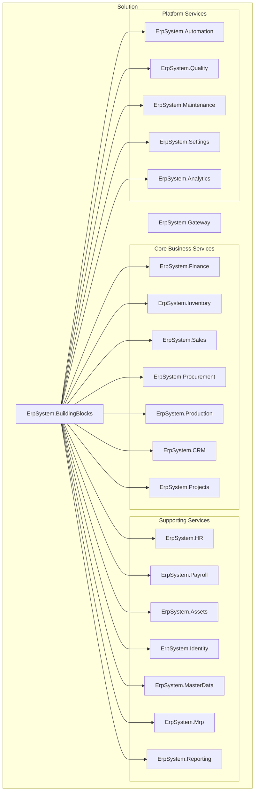
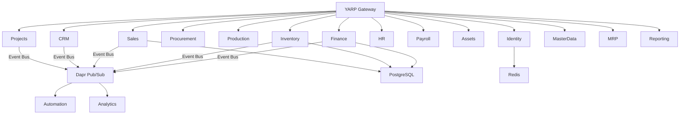
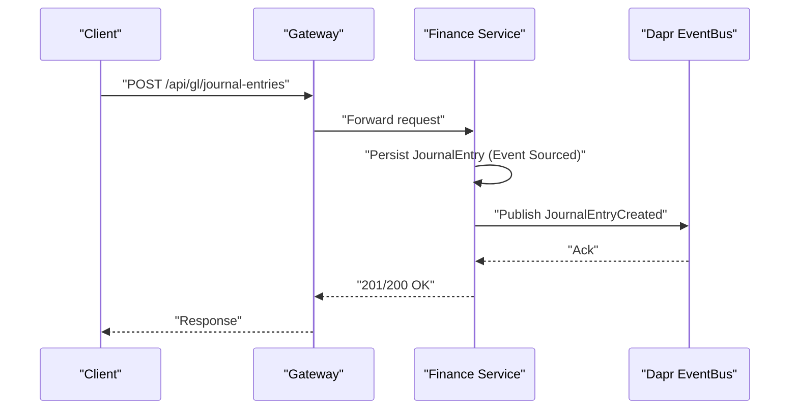
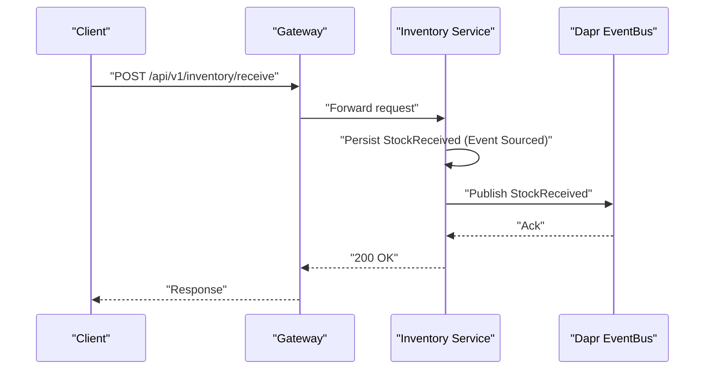
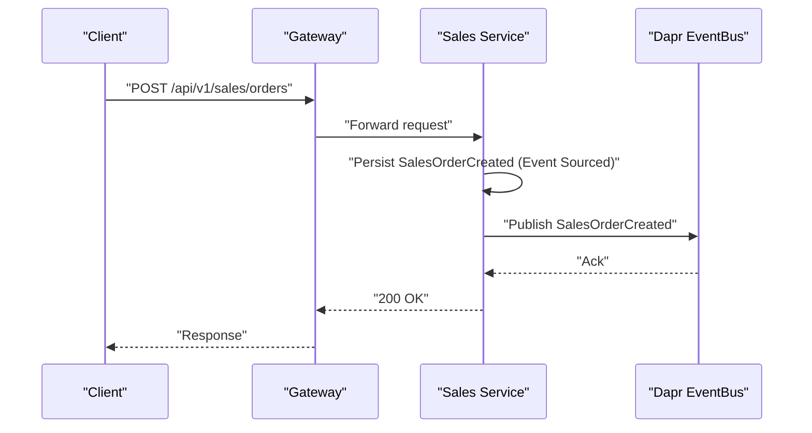
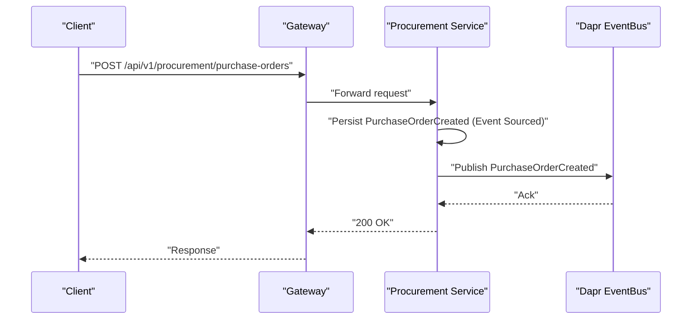
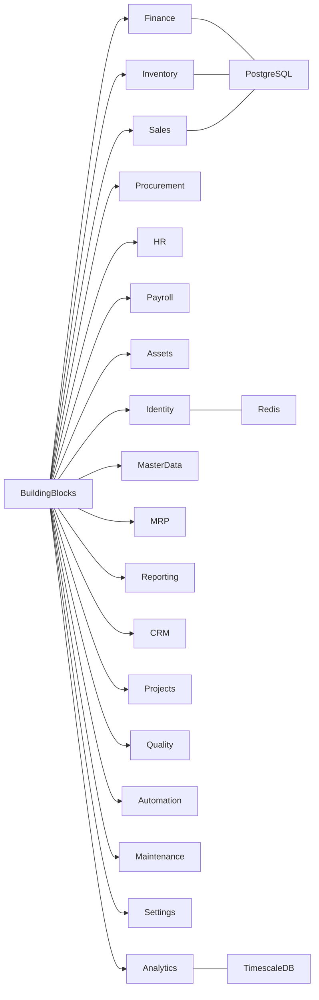

# Service Modules

<cite>
**Referenced Files in This Document**
- [README.md](file://README.md)
- [ErpSystem.sln](file://src/ErpSystem.sln)
- [pubsub.yaml](file://components/pubsub.yaml)
- [gateway.yaml](file://deploy/k8s/services/gateway.yaml)
- [DependencyInjection.cs](file://src/BuildingBlocks/ErpSystem.BuildingBlocks/DependencyInjection.cs)
- [Program.cs (Finance)](file://src/Services/Finance/ErpSystem.Finance/Program.cs)
- [GLController.cs](file://src/Services/Finance/ErpSystem.Finance/API/GLController.cs)
- [Program.cs (Inventory)](file://src/Services/Inventory/ErpSystem.Inventory/Program.cs)
- [InventoryController.cs](file://src/Services/Inventory/ErpSystem.Inventory/API/InventoryController.cs)
- [Program.cs (Sales)](file://src/Services/Sales/ErpSystem.Sales/Program.cs)
- [SalesOrdersController.cs](file://src/Services/Sales/ErpSystem.Sales/API/SalesOrdersController.cs)
- [Program.cs (Procurement)](file://src/Services/Procurement/ErpSystem.Procurement/Program.cs)
- [ProcurementController.cs](file://src/Services/Procurement/ErpSystem.Procurement/API/ProcurementController.cs)
</cite>

## Table of Contents
1. [Introduction](#introduction)
2. [Project Structure](#project-structure)
3. [Core Components](#core-components)
4. [Architecture Overview](#architecture-overview)
5. [Detailed Component Analysis](#detailed-component-analysis)
6. [Dependency Analysis](#dependency-analysis)
7. [Performance Considerations](#performance-considerations)
8. [Troubleshooting Guide](#troubleshooting-guide)
9. [Conclusion](#conclusion)
10. [Appendices](#appendices)

## Introduction
This document provides comprehensive documentation for the ERP service modules across all business domains. It explains the business scope, core functionality, data models, API surface, and integration patterns for each microservice. It also details service boundaries, event-driven interactions, shared building blocks, configuration, deployment, and operational considerations. The goal is to enable both technical and non-technical stakeholders to understand how services collaborate to deliver a cloud-native, event-sourced ERP platform.

## Project Structure
The solution is organized as a multi-project .NET 10 solution with a shared “BuildingBlocks” library and modular services grouped by business domain. The gateway exposes routes to core business services and supporting services, while Dapr pub/sub enables event-driven communication.

**Diagram sources**
- [ErpSystem.sln](file://src/ErpSystem.sln#L1-L400)

**Section sources**
- [README.md](file://README.md#L130-L322)
- [ErpSystem.sln](file://src/ErpSystem.sln#L1-L400)

## Core Components
- Shared Building Blocks: Provide cross-cutting concerns including CQRS abstractions, validation, logging, performance, audit, resilience, caching, multi-tenancy, outbox, and middleware. These are registered via a central dependency injection extension.
- Event Bus and Event Store: Each core service initializes an event bus and event store for event sourcing, enabling reliable, auditable domain events and projections.
- Dapr Integration: Services integrate with Dapr pub/sub for decoupled inter-service messaging and with the gateway for routing.

Key shared building block registration:

- MediatR pipeline behaviors (logging, validation, performance, idempotency)
- User context and HTTP accessor
- Result pattern and common utilities

**Section sources**
- [DependencyInjection.cs](file://src/BuildingBlocks/ErpSystem.BuildingBlocks/DependencyInjection.cs#L10-L30)
- [Program.cs (Finance)](file://src/Services/Finance/ErpSystem.Finance/Program.cs#L20-L50)
- [Program.cs (Inventory)](file://src/Services/Inventory/ErpSystem.Inventory/Program.cs#L16-L44)
- [Program.cs (Sales)](file://src/Services/Sales/ErpSystem.Sales/Program.cs#L15-L42)
- [Program.cs (Procurement)](file://src/Services/Procurement/ErpSystem.Procurement/Program.cs#L15-L42)

## Architecture Overview
The system follows a microservices architecture with:
- A YARP gateway routing external traffic to services
- Event-driven interactions via Dapr pub/sub
- PostgreSQL-backed event stores and read models per service
- Optional real-time dashboards via SignalR (referenced in the architecture diagram)

**Diagram sources**
- [README.md](file://README.md#L132-L183)
- [pubsub.yaml](file://components/pubsub.yaml#L1-L13)
- [gateway.yaml](file://deploy/k8s/services/gateway.yaml#L1-L60)

**Section sources**
- [README.md](file://README.md#L130-L183)
- [pubsub.yaml](file://components/pubsub.yaml#L1-L13)
- [gateway.yaml](file://deploy/k8s/services/gateway.yaml#L1-L60)

## Detailed Component Analysis

### Finance Service
- Business domain: General ledger, chart of accounts, journal entries, financial periods, trial balance, accounts payable/receivable, auto-generated journal entries, asset management and depreciation.
- Core functionality:
  - Account definition and retrieval
  - Journal entry creation and posting
  - Trial balance reporting
  - Financial period lifecycle (define/close)
- Data models: Accounts, journal entries, financial periods, invoices, payments, material cost valuation aggregates.
- API endpoints:
  - POST/GET accounts
  - POST/POST journal entries (create/post)
  - GET journal entry by id
  - GET trial balance
  - POST/POST financial periods (define/close)
- Integration patterns:
  - Event sourcing with event store and projections
  - Dapr event bus for cross-service notifications
  - PostgreSQL-backed event store and read model
- Configuration and deployment:
  - Uses connection strings for event store/read models
  - Swagger enabled in development
  - Dapr event bus configured
- Operational considerations:
  - Ensure database initialization on startup
  - Monitor journal entry posting and period closing operations

**Diagram sources**
- [GLController.cs](file://src/Services/Finance/ErpSystem.Finance/API/GLController.cs#L26-L45)
- [Program.cs (Finance)](file://src/Services/Finance/ErpSystem.Finance/Program.cs#L26-L50)

**Section sources**
- [README.md](file://README.md#L43-L49)
- [GLController.cs](file://src/Services/Finance/ErpSystem.Finance/API/GLController.cs#L1-L76)
- [Program.cs (Finance)](file://src/Services/Finance/ErpSystem.Finance/Program.cs#L1-L86)

### Inventory Service
- Business domain: Multi-warehouse stock management, reservations, receipts, transfers, issues, adjustments, and transaction history.
- Core functionality:
  - Item search and availability checks
  - Stock receipt, transfer, issue, reservation, release, and adjustment
  - Transaction history retrieval
- Data models: Inventory items, reservations, transactions, forecast service.
- API endpoints:
  - GET items (filters: warehouse/bin/material)
  - GET available item
  - POST receive, transfer, issue, reserve, release, adjust
  - GET item transactions
- Integration patterns:
  - Event sourcing with event store and projections
  - Dapr event bus for inventory-related events
  - PostgreSQL-backed event store and read model
- Configuration and deployment:
  - Uses inventory connection string
  - Swagger enabled in development
  - Forecast service injected
- Operational considerations:
  - Validate warehouse/bin/material identifiers
  - Ensure reservation/release symmetry

**Diagram sources**
- [InventoryController.cs](file://src/Services/Inventory/ErpSystem.Inventory/API/InventoryController.cs#L21-L28)
- [Program.cs (Inventory)](file://src/Services/Inventory/ErpSystem.Inventory/Program.cs#L22-L44)

**Section sources**
- [README.md](file://README.md#L54-L59)
- [InventoryController.cs](file://src/Services/Inventory/ErpSystem.Inventory/API/InventoryController.cs#L1-L44)
- [Program.cs (Inventory)](file://src/Services/Inventory/ErpSystem.Inventory/Program.cs#L1-L74)

### Sales Service
- Business domain: Order-to-cash workflow, customer orders, confirm/cancel, billable lines, shipment creation.
- Core functionality:
  - Sales order creation and retrieval
  - Search orders by filters
  - Confirm order (with warehouse)
  - Cancel order with reason
  - Retrieve billable lines
  - Create shipments
- Data models: Sales orders, shipments, sales events.
- API endpoints:
  - POST/GET sales orders
  - POST {id}/confirm with warehouse
  - POST {id}/cancel with reason
  - GET {id}/billable-lines
  - POST shipments
- Integration patterns:
  - Event sourcing with event store and projections
  - Dapr event bus for sales events
  - PostgreSQL-backed event store and read model
- Configuration and deployment:
  - Uses sales connection string
  - Swagger enabled in development
- Operational considerations:
  - Validate warehouse during confirmation
  - Ensure cancellation reasons are captured

**Diagram sources**
- [SalesOrdersController.cs](file://src/Services/Sales/ErpSystem.Sales/API/SalesOrdersController.cs#L11-L25)
- [Program.cs (Sales)](file://src/Services/Sales/ErpSystem.Sales/Program.cs#L24-L42)

**Section sources**
- [README.md](file://README.md#L66-L72)
- [SalesOrdersController.cs](file://src/Services/Sales/ErpSystem.Sales/API/SalesOrdersController.cs#L1-L45)
- [Program.cs (Sales)](file://src/Services/Sales/ErpSystem.Sales/Program.cs#L1-L72)

### Procurement Service
- Business domain: Purchase orders lifecycle, approvals, sending, closing, cancellation, and price history.
- Core functionality:
  - Create purchase orders
  - Search by filters
  - Retrieve by id
  - Submit/approve/send/close/cancel
  - Retrieve supplier price history
- Data models: Purchase orders, procurement events.
- API endpoints:
  - POST/GET purchase orders
  - POST {id}/submit/approve/send/close/cancel
  - GET prices (material/supplier)
  - POST receipts
- Integration patterns:
  - Event sourcing with event store and projections
  - Dapr event bus for procurement events
  - PostgreSQL-backed event store and read model
- Configuration and deployment:
  - Uses procurement connection string
  - Swagger enabled in development
- Operational considerations:
  - Validate approval/comment fields
  - Track sent-by/method for audit

**Diagram sources**
- [ProcurementController.cs](file://src/Services/Procurement/ErpSystem.Procurement/API/ProcurementController.cs#L11-L23)
- [Program.cs (Procurement)](file://src/Services/Procurement/ErpSystem.Procurement/Program.cs#L24-L42)

**Section sources**
- [README.md](file://README.md#L57-L58)
- [ProcurementController.cs](file://src/Services/Procurement/ErpSystem.Procurement/API/ProcurementController.cs#L1-L62)
- [Program.cs (Procurement)](file://src/Services/Procurement/ErpSystem.Procurement/Program.cs#L1-L72)

### HR Service
- Business domain: Employee lifecycle, organization structure, payroll processing and payslips, identity and access control (RBAC), role-based permissions.
- Core functionality:
  - Employee CRUD and queries
  - Department/position management
  - User management and roles
  - Audit and integration events
- Data models: Employees, departments, positions, users, roles.
- API endpoints:
  - Employees controller endpoints (CRUD and queries)
  - Users, roles, departments, audit endpoints
- Integration patterns:
  - Identity integration events
  - Dapr event bus for HR-related events
- Configuration and deployment:
  - Uses shared building blocks and Dapr
- Operational considerations:
  - Ensure tenant-aware queries and permissions

**Section sources**
- [README.md](file://README.md#L90-L96)
- [Program.cs (Finance)](file://src/Services/Finance/ErpSystem.Finance/Program.cs#L26-L27)

### Payroll Service
- Business domain: Payroll processing and payslips.
- Core functionality:
  - Payroll generation and management
  - Payslip computation and distribution
- Data models: Payroll aggregates.
- API endpoints:
  - Payroll controllers (CRUD and queries)
- Integration patterns:
  - Dapr event bus for payroll events
- Configuration and deployment:
  - Uses shared building blocks and Dapr

**Section sources**
- [README.md](file://README.md#L93-L94)

### Assets Service
- Business domain: Asset lifecycle management.
- Core functionality:
  - Asset tracking and management
  - Depreciation calculations
- Data models: Assets.
- API endpoints:
  - Assets controllers (CRUD and queries)
- Integration patterns:
  - Dapr event bus for asset events
- Configuration and deployment:
  - Uses shared building blocks and Dapr

**Section sources**
- [README.md](file://README.md#L49-L49)

### Identity Service
- Business domain: Authentication and RBAC, audit, departments, roles, users, integration events.
- Core functionality:
  - JWT token generation
  - User management and permissions
  - Audit logs and integrations
- Data models: Users, roles, departments, positions.
- API endpoints:
  - Auth, users, roles, departments, audit, integration events
- Integration patterns:
  - Dapr event bus for identity events
- Configuration and deployment:
  - Redis-backed caching/session storage
- Operational considerations:
  - Secure token generation and refresh
  - Tenant-aware user queries

**Section sources**
- [README.md](file://README.md#L94-L95)
- [Program.cs (Finance)](file://src/Services/Finance/ErpSystem.Finance/Program.cs#L26-L27)

### MasterData Service
- Business domain: Materials, customers, suppliers, categories, warehouses, BOMs.
- Core functionality:
  - Material master data
  - Customer/supplier management
  - Bill of materials
- Data models: Materials, customers, suppliers, categories, warehouses, BOMs.
- API endpoints:
  - Materials, partners, categories, BOMs
- Integration patterns:
  - Dapr event bus for master data events
- Configuration and deployment:
  - Uses shared building blocks and Dapr

**Section sources**
- [README.md](file://README.md#L10-L11)

### MRP Service
- Business domain: Material requirements planning, procurement suggestions, reordering rules.
- Core functionality:
  - MRP calculation engine
  - Procurement suggestions
  - Reordering rules
- Data models: Procurement suggestions, reordering rules.
- Integration patterns:
  - Dapr query services and event bus
- Configuration and deployment:
  - Uses shared building blocks and Dapr

**Section sources**
- [README.md](file://README.md#L59-L59)

### Reporting Service
- Business domain: Executive dashboards and reports.
- Core functionality:
  - Dashboard and report generation
- Data models: Dashboard/report DTOs.
- API endpoints:
  - Dashboard and reports controllers
- Integration patterns:
  - Dapr event bus for reporting events
- Configuration and deployment:
  - Uses shared building blocks and Dapr

**Section sources**
- [README.md](file://README.md#L100-L106)

### CRM Service
- Business domain: Customer relationship management, campaigns, leads, opportunities.
- Core functionality:
  - Campaigns, leads, opportunities management
- Data models: Campaigns, leads, opportunities.
- API endpoints:
  - Campaigns, leads, opportunities controllers
- Integration patterns:
  - Dapr event bus for CRM events
- Configuration and deployment:
  - Uses shared building blocks and Dapr

**Section sources**
- [README.md](file://README.md#L66-L72)

### Projects Service
- Business domain: Project management, tasks, timesheets.
- Core functionality:
  - Projects, tasks, timesheets
- Data models: Projects, tasks, timesheets.
- API endpoints:
  - Projects, tasks, timesheets controllers
- Integration patterns:
  - Dapr event bus for project events
- Configuration and deployment:
  - Uses shared building blocks and Dapr

**Section sources**
- [README.md](file://README.md#L81-L83)

### Quality Service
- Business domain: Quality alerts, quality checks, quality points.
- Core functionality:
  - Quality workflows and alerts
- Data models: Quality alerts, checks, points.
- Integration patterns:
  - Dapr event bus for quality events
- Configuration and deployment:
  - Uses shared building blocks and Dapr

**Section sources**
- [README.md](file://README.md#L81-L83)

### Analytics Service
- Business domain: Real-time dashboards, demand forecasting, time-series analytics.
- Core functionality:
  - Live dashboards via SignalR/WebSockets
  - AI-driven demand forecasting (ML.NET)
  - Time-series analytics with TimescaleDB
- Data models: Cash flow forecasts, demand forecasts.
- Integration patterns:
  - Dapr event bus for analytics events
- Configuration and deployment:
  - Uses shared building blocks and Dapr
  - TimescaleDB for time-series data

**Section sources**
- [README.md](file://README.md#L112-L123)

### Automation Service
- Business domain: Workflow engine.
- Core functionality:
  - Automation rules and engine
- Data models: Automation rules.
- Integration patterns:
  - Dapr event bus for automation events
- Configuration and deployment:
  - Uses shared building blocks and Dapr

**Section sources**
- [README.md](file://README.md#L112-L112)

### Maintenance Service
- Business domain: Asset maintenance.
- Core functionality:
  - Equipment and maintenance plans
- Data models: Equipment, maintenance plans.
- Integration patterns:
  - Dapr event bus for maintenance events
- Configuration and deployment:
  - Uses shared building blocks and Dapr

**Section sources**
- [README.md](file://README.md#L83-L83)

### Settings Service
- Business domain: System configuration and user preferences.
- Core functionality:
  - User preferences management
- Data models: User preferences.
- API endpoints:
  - User preferences controller
- Integration patterns:
  - Dapr event bus for settings events
- Configuration and deployment:
  - Uses shared building blocks and Dapr

**Section sources**
- [README.md](file://README.md#L100-L106)

## Dependency Analysis
- Internal dependencies:
  - All services depend on the shared BuildingBlocks for CQRS, validation, auditing, resilience, and multi-tenancy.
  - Services register MediatR handlers and pipeline behaviors centrally.
- External dependencies:
  - PostgreSQL for event stores and read models
  - Redis for caching/session storage (Identity)
  - Dapr pub/sub for event-driven communication
  - TimescaleDB for analytics time-series
- Coupling and cohesion:
  - Services are loosely coupled via Dapr events and CQRS commands/queries.
  - Cohesion is strong within each service’s domain bounded context.

**Diagram sources**
- [DependencyInjection.cs](file://src/BuildingBlocks/ErpSystem.BuildingBlocks/DependencyInjection.cs#L10-L30)
- [pubsub.yaml](file://components/pubsub.yaml#L1-L13)
- [README.md](file://README.md#L167-L169)

**Section sources**
- [DependencyInjection.cs](file://src/BuildingBlocks/ErpSystem.BuildingBlocks/DependencyInjection.cs#L10-L30)
- [pubsub.yaml](file://components/pubsub.yaml#L1-L13)
- [README.md](file://README.md#L167-L169)

## Performance Considerations
- Event Sourcing: Favor append-only writes and projection updates to maintain scalability.
- CQRS: Separate read/write models to optimize for query performance.
- Resilience: Use Polly policies for retries, circuit breakers, and timeouts.
- Caching: Leverage distributed cache for frequently accessed master data and user preferences.
- Database: Use connection pooling and migrations for PostgreSQL; leverage TimescaleDB for time-series analytics.
- Observability: Enable structured logging, metrics, and tracing across services.

[No sources needed since this section provides general guidance]

## Troubleshooting Guide
- Event Bus connectivity:
  - Verify Dapr pub/sub component configuration and Redis host/password.
- Database initialization:
  - Ensure event store and read models are created on startup for non-testing environments.
- Gateway health:
  - Confirm gateway probes and service exposure via LoadBalancer.
- Cross-service errors:
  - Use correlation IDs and centralized logging to trace requests across services.
- Validation failures:
  - Review MediatR validation pipeline and error responses.

**Section sources**
- [pubsub.yaml](file://components/pubsub.yaml#L1-L13)
- [Program.cs (Finance)](file://src/Services/Finance/ErpSystem.Finance/Program.cs#L63-L71)
- [Program.cs (Inventory)](file://src/Services/Inventory/ErpSystem.Inventory/Program.cs#L52-L60)
- [Program.cs (Sales)](file://src/Services/Sales/ErpSystem.Sales/Program.cs#L50-L58)
- [Program.cs (Procurement)](file://src/Services/Procurement/ErpSystem.Procurement/Program.cs#L50-L58)
- [gateway.yaml](file://deploy/k8s/services/gateway.yaml#L35-L46)

## Conclusion
The ERP system is architected around event-sourced, DDD-aligned microservices with shared building blocks, enabling scalable, observable, and maintainable business capabilities across Finance, Inventory, Sales, Procurement, HR, Payroll, Assets, Identity, MasterData, MRP, Reporting, CRM, Projects, Quality, Analytics, Automation, Maintenance, and Settings. The gateway and Dapr pub/sub form the backbone of routing and event-driven integration, while PostgreSQL and TimescaleDB support persistence and analytics.

[No sources needed since this section summarizes without analyzing specific files]

## Appendices
- Deployment:
  - Kubernetes manifests and Helm charts are provided for deploying the system.
  - Configure secrets and ingress hostnames according to environment needs.
- Development:
  - Use dotnet CLI to build and test the solution.
  - Run individual services locally or via Docker Compose.

**Section sources**
- [README.md](file://README.md#L255-L286)
- [README.md](file://README.md#L217-L251)