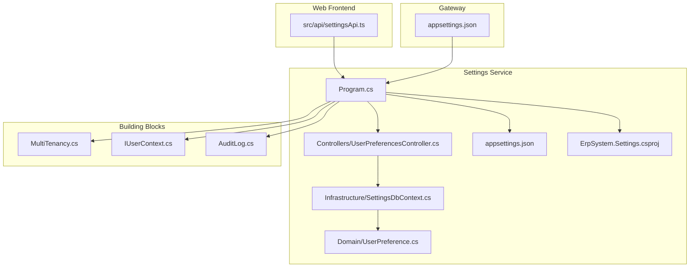
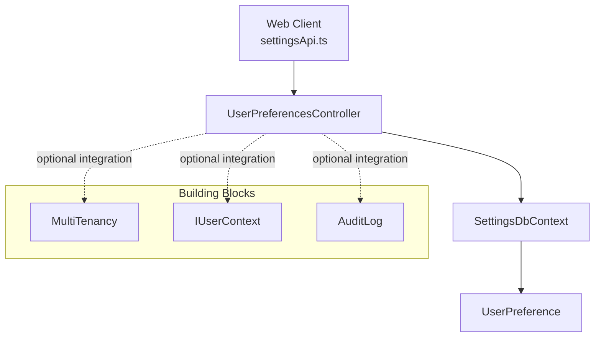
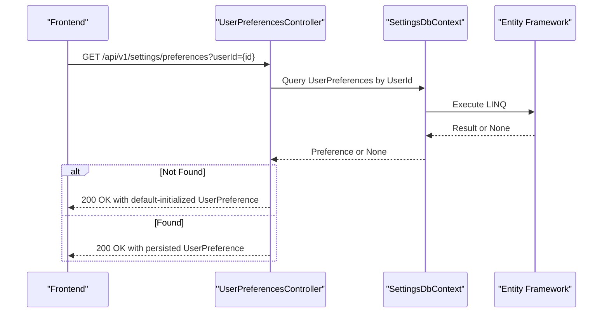
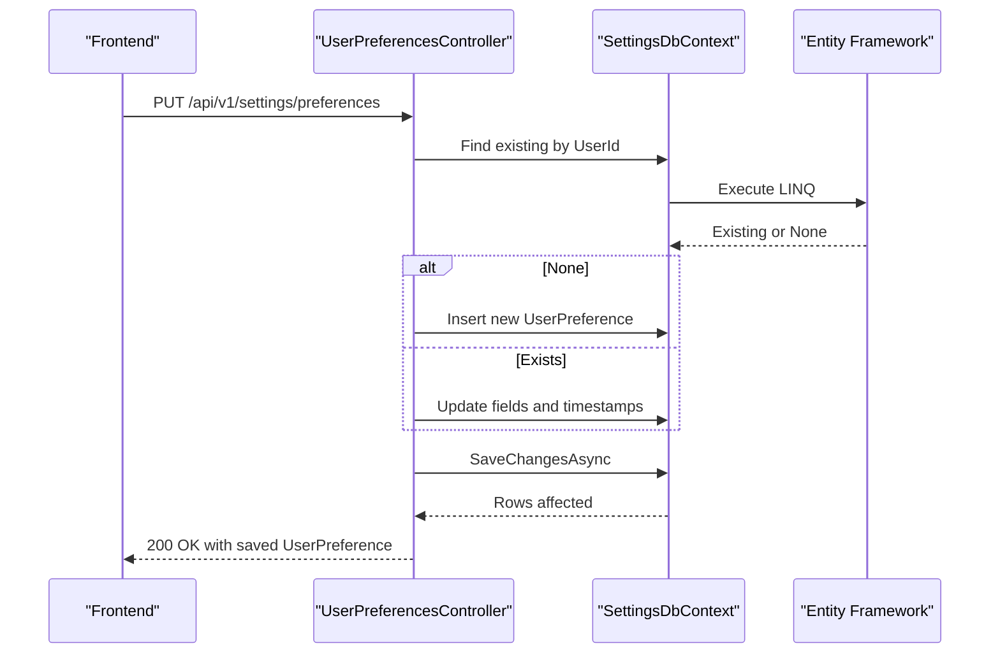
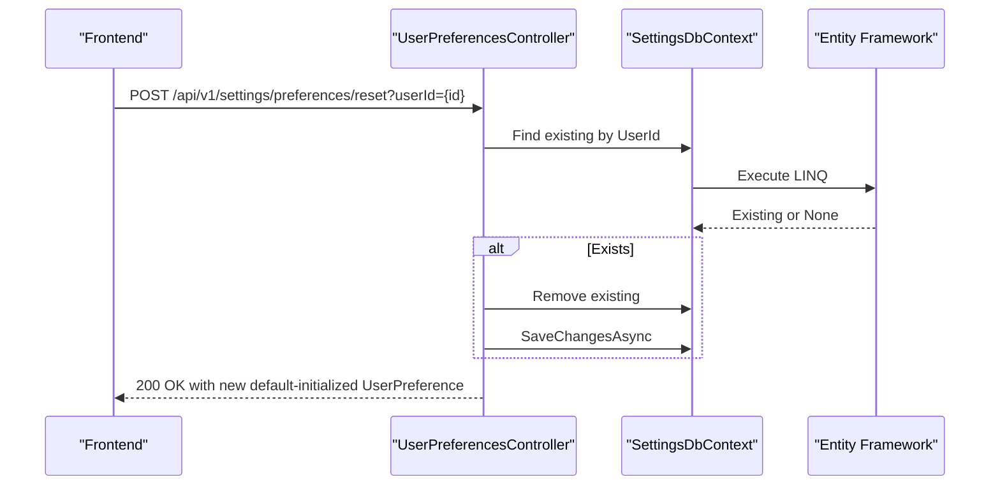
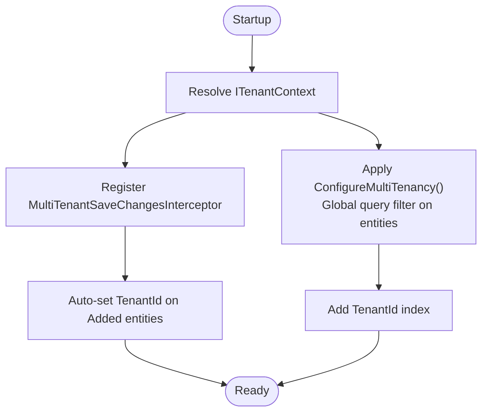
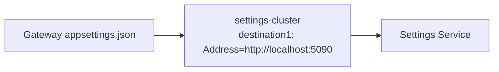
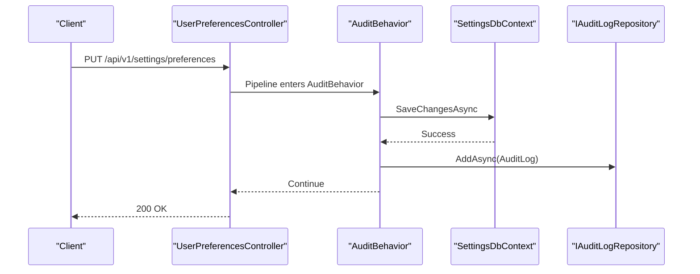
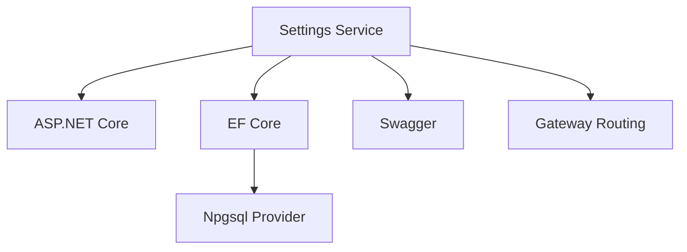

# Settings and Configuration Service

<cite>
**Referenced Files in This Document**
- [Program.cs](file://src/Services/Settings/ErpSystem.Settings/Program.cs)
- [appsettings.json](file://src/Services/Settings/ErpSystem.Settings/appsettings.json)
- [UserPreferencesController.cs](file://src/Services/Settings/ErpSystem.Settings/Controllers/UserPreferencesController.cs)
- [UserPreference.cs](file://src/Services/Settings/ErpSystem.Settings/Domain/UserPreference.cs)
- [SettingsDbContext.cs](file://src/Services/Settings/ErpSystem.Settings/Infrastructure/SettingsDbContext.cs)
- [ErpSystem.Settings.csproj](file://src/Services/Settings/ErpSystem.Settings/ErpSystem.Settings.csproj)
- [settingsApi.ts](file://src/Web/ErpSystem.Web/src/api/settingsApi.ts)
- [MultiTenancy.cs](file://src/BuildingBlocks/ErpSystem.BuildingBlocks/MultiTenancy/MultiTenancy.cs)
- [IUserContext.cs](file://src/BuildingBlocks/ErpSystem.BuildingBlocks/Auth/IUserContext.cs)
- [AuditLog.cs](file://src/BuildingBlocks/ErpSystem.BuildingBlocks/Auditing/AuditLog.cs)
- [appsettings.json](file://src/Gateways/ErpSystem.Gateway/appsettings.json)
</cite>

## Table of Contents
1. [Introduction](#introduction)
2. [Project Structure](#project-structure)
3. [Core Components](#core-components)
4. [Architecture Overview](#architecture-overview)
5. [Detailed Component Analysis](#detailed-component-analysis)
6. [Dependency Analysis](#dependency-analysis)
7. [Performance Considerations](#performance-considerations)
8. [Troubleshooting Guide](#troubleshooting-guide)
9. [Conclusion](#conclusion)

## Introduction
This document describes the Settings and Configuration service responsible for managing system-wide preferences and business rules. It covers:
- User preference management: personal settings, dashboard configurations, and notification preferences
- System configuration: business rules, validation parameters, and operational defaults
- Multi-tenant configuration management with tenant-specific overrides and global settings
- Business rule engine for dynamic system behavior modification
- Integration settings for external system connections and API configurations
- API endpoints for preference management, configuration queries, and rule updates
- Integration patterns with Identity for user context, all services for configuration access, and Audit for configuration change tracking
- Security, validation rules, and rollback capabilities for system-wide changes

## Project Structure
The Settings service is a minimal ASP.NET Core web service with a single controller, a domain model, and an EF Core DbContext. It exposes a REST API for user preferences and integrates with building blocks for multi-tenancy, auditing, and user context.

**Diagram sources**
- [Program.cs](file://src/Services/Settings/ErpSystem.Settings/Program.cs#L1-L50)
- [UserPreferencesController.cs](file://src/Services/Settings/ErpSystem.Settings/Controllers/UserPreferencesController.cs#L1-L101)
- [UserPreference.cs](file://src/Services/Settings/ErpSystem.Settings/Domain/UserPreference.cs#L1-L33)
- [SettingsDbContext.cs](file://src/Services/Settings/ErpSystem.Settings/Infrastructure/SettingsDbContext.cs#L1-L33)
- [appsettings.json](file://src/Services/Settings/ErpSystem.Settings/appsettings.json#L1-L12)
- [ErpSystem.Settings.csproj](file://src/Services/Settings/ErpSystem.Settings/ErpSystem.Settings.csproj#L1-L16)
- [settingsApi.ts](file://src/Web/ErpSystem.Web/src/api/settingsApi.ts#L1-L41)
- [MultiTenancy.cs](file://src/BuildingBlocks/ErpSystem.BuildingBlocks/MultiTenancy/MultiTenancy.cs#L1-L100)
- [IUserContext.cs](file://src/BuildingBlocks/ErpSystem.BuildingBlocks/Auth/IUserContext.cs#L1-L12)
- [AuditLog.cs](file://src/BuildingBlocks/ErpSystem.BuildingBlocks/Auditing/AuditLog.cs#L1-L135)
- [appsettings.json](file://src/Gateways/ErpSystem.Gateway/appsettings.json#L192-L198)

**Section sources**
- [Program.cs](file://src/Services/Settings/ErpSystem.Settings/Program.cs#L1-L50)
- [appsettings.json](file://src/Services/Settings/ErpSystem.Settings/appsettings.json#L1-L12)
- [ErpSystem.Settings.csproj](file://src/Services/Settings/ErpSystem.Settings/ErpSystem.Settings.csproj#L1-L16)

## Core Components
- UserPreferencesController: Exposes GET/PUT/POST endpoints for user preferences with default fallback and reset capability.
- UserPreference: Domain model representing user display preferences, profile fields, and notification settings.
- SettingsDbContext: EF Core context mapping UserPreference entity with indexes and constraints.
- Program: Bootstraps the service, registers controllers, Swagger, CORS, DbContext, and runs migrations.
- Frontend API client: TypeScript module for fetching/updating/resetting preferences.

Key behaviors:
- GET api/v1/settings/preferences?userId={id}: Returns persisted preference or a default-initialized preference if none exists.
- PUT api/v1/settings/preferences: Upserts preferences for the given user.
- POST api/v1/settings/preferences/reset?userId={id}: Removes persisted preference and returns a fresh default preference.

**Section sources**
- [UserPreferencesController.cs](file://src/Services/Settings/ErpSystem.Settings/Controllers/UserPreferencesController.cs#L1-L101)
- [UserPreference.cs](file://src/Services/Settings/ErpSystem.Settings/Domain/UserPreference.cs#L1-L33)
- [SettingsDbContext.cs](file://src/Services/Settings/ErpSystem.Settings/Infrastructure/SettingsDbContext.cs#L1-L33)
- [Program.cs](file://src/Services/Settings/ErpSystem.Settings/Program.cs#L1-L50)
- [settingsApi.ts](file://src/Web/ErpSystem.Web/src/api/settingsApi.ts#L1-L41)

## Architecture Overview
The Settings service follows a clean architecture pattern:
- Presentation: Minimal controller exposing REST endpoints
- Domain: Immutable data model for preferences
- Infrastructure: EF Core persistence with a dedicated DbContext
- Integrations: Multi-tenancy, user context, and audit via building blocks

**Diagram sources**
- [UserPreferencesController.cs](file://src/Services/Settings/ErpSystem.Settings/Controllers/UserPreferencesController.cs#L1-L101)
- [SettingsDbContext.cs](file://src/Services/Settings/ErpSystem.Settings/Infrastructure/SettingsDbContext.cs#L1-L33)
- [UserPreference.cs](file://src/Services/Settings/ErpSystem.Settings/Domain/UserPreference.cs#L1-L33)
- [MultiTenancy.cs](file://src/BuildingBlocks/ErpSystem.BuildingBlocks/MultiTenancy/MultiTenancy.cs#L1-L100)
- [IUserContext.cs](file://src/BuildingBlocks/ErpSystem.BuildingBlocks/Auth/IUserContext.cs#L1-L12)
- [AuditLog.cs](file://src/BuildingBlocks/ErpSystem.BuildingBlocks/Auditing/AuditLog.cs#L1-L135)
- [settingsApi.ts](file://src/Web/ErpSystem.Web/src/api/settingsApi.ts#L1-L41)

## Detailed Component Analysis

### User Preferences Management
The controller implements three primary operations:
- Retrieve preferences with a default fallback when missing
- Update preferences with partial field updates
- Reset preferences to defaults

**Diagram sources**
- [UserPreferencesController.cs](file://src/Services/Settings/ErpSystem.Settings/Controllers/UserPreferencesController.cs#L21-L39)
- [SettingsDbContext.cs](file://src/Services/Settings/ErpSystem.Settings/Infrastructure/SettingsDbContext.cs#L12-L31)

**Diagram sources**
- [UserPreferencesController.cs](file://src/Services/Settings/ErpSystem.Settings/Controllers/UserPreferencesController.cs#L41-L77)
- [SettingsDbContext.cs](file://src/Services/Settings/ErpSystem.Settings/Infrastructure/SettingsDbContext.cs#L12-L31)

**Diagram sources**
- [UserPreferencesController.cs](file://src/Services/Settings/ErpSystem.Settings/Controllers/UserPreferencesController.cs#L79-L99)
- [SettingsDbContext.cs](file://src/Services/Settings/ErpSystem.Settings/Infrastructure/SettingsDbContext.cs#L12-L31)

**Section sources**
- [UserPreferencesController.cs](file://src/Services/Settings/ErpSystem.Settings/Controllers/UserPreferencesController.cs#L1-L101)
- [UserPreference.cs](file://src/Services/Settings/ErpSystem.Settings/Domain/UserPreference.cs#L1-L33)
- [SettingsDbContext.cs](file://src/Services/Settings/ErpSystem.Settings/Infrastructure/SettingsDbContext.cs#L1-L33)
- [settingsApi.ts](file://src/Web/ErpSystem.Web/src/api/settingsApi.ts#L26-L41)

### Multi-Tenant Configuration Management
The service currently stores preferences with a TenantId field but does not apply multi-tenant filters or interceptors. To enable tenant isolation:
- Apply global query filters per tenant
- Use a save-change interceptor to auto-set TenantId on inserts
- Enforce tenant-aware reads/writes

**Diagram sources**
- [MultiTenancy.cs](file://src/BuildingBlocks/ErpSystem.BuildingBlocks/MultiTenancy/MultiTenancy.cs#L29-L62)
- [MultiTenancy.cs](file://src/BuildingBlocks/ErpSystem.BuildingBlocks/MultiTenancy/MultiTenancy.cs#L68-L99)
- [SettingsDbContext.cs](file://src/Services/Settings/ErpSystem.Settings/Infrastructure/SettingsDbContext.cs#L14-L31)

**Section sources**
- [MultiTenancy.cs](file://src/BuildingBlocks/ErpSystem.BuildingBlocks/MultiTenancy/MultiTenancy.cs#L1-L100)
- [SettingsDbContext.cs](file://src/Services/Settings/ErpSystem.Settings/Infrastructure/SettingsDbContext.cs#L1-L33)

### Business Rule Engine for Dynamic Behavior
The current Settings service does not expose a business rule engine. To support dynamic system behavior:
- Define rule entities and repositories
- Implement evaluation logic for runtime decisions
- Persist rule metadata and conditions
- Provide admin APIs to manage rules and triggers

[No sources needed since this section proposes future enhancements]

### Integration Settings for External Systems
The Gateway configuration includes a destination for the Settings service, enabling routing to the service endpoint.

**Diagram sources**
- [appsettings.json](file://src/Gateways/ErpSystem.Gateway/appsettings.json#L192-L198)

**Section sources**
- [appsettings.json](file://src/Gateways/ErpSystem.Gateway/appsettings.json#L192-L198)

### API Endpoints Summary
- GET /api/v1/settings/preferences?userId={id}
  - Purpose: Retrieve user preferences with default fallback
  - Response: UserPreference
- PUT /api/v1/settings/preferences
  - Purpose: Upsert user preferences
  - Request: UserPreference
  - Response: UserPreference
- POST /api/v1/settings/preferences/reset?userId={id}
  - Purpose: Reset user preferences to defaults
  - Response: UserPreference

**Section sources**
- [UserPreferencesController.cs](file://src/Services/Settings/ErpSystem.Settings/Controllers/UserPreferencesController.cs#L21-L99)
- [settingsApi.ts](file://src/Web/ErpSystem.Web/src/api/settingsApi.ts#L26-L41)

### Integration Patterns
- Identity integration: Use IUserContext to obtain authenticated user and tenant identifiers for tenant-aware operations.
- Audit integration: Wrap write operations with an audit behavior to capture changes for compliance and debugging.

**Diagram sources**
- [AuditLog.cs](file://src/BuildingBlocks/ErpSystem.BuildingBlocks/Auditing/AuditLog.cs#L65-L101)
- [UserPreferencesController.cs](file://src/Services/Settings/ErpSystem.Settings/Controllers/UserPreferencesController.cs#L41-L77)

**Section sources**
- [IUserContext.cs](file://src/BuildingBlocks/ErpSystem.BuildingBlocks/Auth/IUserContext.cs#L1-L12)
- [AuditLog.cs](file://src/BuildingBlocks/ErpSystem.BuildingBlocks/Auditing/AuditLog.cs#L1-L135)
- [UserPreferencesController.cs](file://src/Services/Settings/ErpSystem.Settings/Controllers/UserPreferencesController.cs#L1-L101)

## Dependency Analysis
External dependencies and integrations:
- ASP.NET Core for HTTP pipeline and controllers
- Entity Framework Core with PostgreSQL provider
- Swagger/OpenAPI for API documentation
- Gateway routing configuration for service discovery

**Diagram sources**
- [ErpSystem.Settings.csproj](file://src/Services/Settings/ErpSystem.Settings/ErpSystem.Settings.csproj#L9-L13)
- [Program.cs](file://src/Services/Settings/ErpSystem.Settings/Program.cs#L7-L13)
- [appsettings.json](file://src/Gateways/ErpSystem.Gateway/appsettings.json#L192-L198)

**Section sources**
- [ErpSystem.Settings.csproj](file://src/Services/Settings/ErpSystem.Settings/ErpSystem.Settings.csproj#L1-L16)
- [Program.cs](file://src/Services/Settings/ErpSystem.Settings/Program.cs#L1-L50)

## Performance Considerations
- Indexes: Ensure UserId uniqueness and TenantId indexing for efficient lookups.
- Caching: Consider caching default preferences and recent updates to reduce database load.
- Concurrency: Use optimistic concurrency with row versioning if multiple clients update preferences concurrently.
- Pagination: Not applicable for preferences; keep responses small.

[No sources needed since this section provides general guidance]

## Troubleshooting Guide
Common issues and resolutions:
- Connection failures to the database: Verify connection string and network connectivity.
- CORS errors: Confirm CORS policy allows frontend origin.
- Tenant isolation not applied: Ensure multi-tenancy extensions and interceptors are registered.
- Audit logs not recorded: Confirm audit behavior registration and repository implementation.

**Section sources**
- [appsettings.json](file://src/Services/Settings/ErpSystem.Settings/appsettings.json#L9-L11)
- [Program.cs](file://src/Services/Settings/ErpSystem.Settings/Program.cs#L15-L24)
- [MultiTenancy.cs](file://src/BuildingBlocks/ErpSystem.BuildingBlocks/MultiTenancy/MultiTenancy.cs#L29-L62)
- [AuditLog.cs](file://src/BuildingBlocks/ErpSystem.BuildingBlocks/Auditing/AuditLog.cs#L65-L101)

## Conclusion
The Settings and Configuration service provides a focused foundation for user preference management with room to expand into broader configuration governance, multi-tenancy enforcement, and audit-enabled change tracking. By integrating the building blocks for multi-tenancy, auditing, and user context, and by adding a business rule engine and robust validation, the service can evolve into a central configuration hub for the ERP platform.