# Testing Strategy

<cite>
**Referenced Files in This Document**
- [ErpSystem.IntegrationTests.csproj](file://src/Tests/ErpSystem.IntegrationTests/ErpSystem.IntegrationTests.csproj)
- [IntegrationTestBase.cs](file://src/tests/ErpSystem.IntegrationTests/IntegrationTestBase.cs)
- [GLTests.cs](file://src/tests/ErpSystem.IntegrationTests/GLTests.cs)
- [HRToIdentityTests.cs](file://src/tests/ErpSystem.IntegrationTests/HRToIdentityTests.cs)
- [ProcurementToInventoryTests.cs](file://src/tests/ErpSystem.IntegrationTests/ProcurementToInventoryTests.cs)
- [ProductionToInventoryTests.cs](file://src/tests/ErpSystem.IntegrationTests/ProductionToInventoryTests.cs)
- [SalesToInventoryTests.cs](file://src/tests/ErpSystem.IntegrationTests/SalesToInventoryTests.cs)
- [PredictiveAnalyticsTests.cs](file://src/tests/ErpSystem.IntegrationTests/Analytics/PredictiveAnalyticsTests.cs)
- [MaterialCostValuationTests.cs](file://src/tests/ErpSystem.IntegrationTests/Finance/MaterialCostValuationTests.cs)
- [MrpCalculationTests.cs](file://src/tests/ErpSystem.IntegrationTests/Mrp/MrpCalculationTests.cs)
- [QualityWorkflowTests.cs](file://src/tests/ErpSystem.IntegrationTests/Quality/QualityWorkflowTests.cs)
- [DaprEventBus.cs](file://src/BuildingBlocks/ErpSystem.BuildingBlocks/EventBus/DaprEventBus.cs)
- [OutboxProcessor.cs](file://src/BuildingBlocks/ErpSystem.BuildingBlocks/Outbox/OutboxProcessor.cs)
- [DomainEventDispatcher.cs](file://src/BuildingBlocks/ErpSystem.BuildingBlocks/Domain/DomainEventDispatcher.cs)
</cite>

## Table of Contents
1. [Introduction](#introduction)
2. [Project Structure](#project-structure)
3. [Core Components](#core-components)
4. [Architecture Overview](#architecture-overview)
5. [Detailed Component Analysis](#detailed-component-analysis)
6. [Dependency Analysis](#dependency-analysis)
7. [Performance Considerations](#performance-considerations)
8. [Troubleshooting Guide](#troubleshooting-guide)
9. [Conclusion](#conclusion)
10. [Appendices](#appendices)

## Introduction
This document defines a comprehensive testing strategy for the ERP microservices system. It focuses on integration testing across multiple services, event-driven workflows, and cross-service interactions. The current suite includes 21 passing tests organized by functional domains and services, validating major business workflows such as financial journal entries, procurement-to-inventory goods receipt, production material issue/completion, sales order confirmation and reservation, HR lifecycle to identity account creation/lock, predictive analytics forecasting, material cost valuation, MRP calculations, and quality control workflows. The strategy covers test organization, base test classes, mocking strategies, event bus simulation, continuous integration guidance, performance and load testing considerations, and debugging techniques.

## Project Structure
The integration tests are organized under a dedicated test project that references all business services. Each test class targets a specific workflow or domain, leveraging a shared base class to bootstrap service-specific web hosts and replace persistence and event bus dependencies for deterministic, isolated testing.

Key characteristics:
- Centralized test project referencing all service projects
- Per-service bootstrapping using WebApplicationFactory
- In-memory databases replacing persistent stores
- Event bus replacement with a test-friendly HTTP-based event bus
- Domain event dispatching and outbox processing supported by building blocks

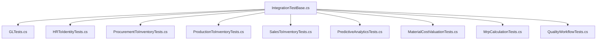

**Diagram sources**
- [IntegrationTestBase.cs](file://src/tests/ErpSystem.IntegrationTests/IntegrationTestBase.cs#L1-L187)
- [GLTests.cs](file://src/tests/ErpSystem.IntegrationTests/GLTests.cs#L1-L89)
- [HRToIdentityTests.cs](file://src/tests/ErpSystem.IntegrationTests/HRToIdentityTests.cs#L1-L97)
- [ProcurementToInventoryTests.cs](file://src/tests/ErpSystem.IntegrationTests/ProcurementToInventoryTests.cs#L1-L80)
- [ProductionToInventoryTests.cs](file://src/tests/ErpSystem.IntegrationTests/ProductionToInventoryTests.cs#L1-L126)
- [SalesToInventoryTests.cs](file://src/tests/ErpSystem.IntegrationTests/SalesToInventoryTests.cs#L1-L87)
- [PredictiveAnalyticsTests.cs](file://src/tests/ErpSystem.IntegrationTests/Analytics/PredictiveAnalyticsTests.cs#L1-L47)
- [MaterialCostValuationTests.cs](file://src/tests/ErpSystem.IntegrationTests/Finance/MaterialCostValuationTests.cs#L1-L126)
- [MrpCalculationTests.cs](file://src/tests/ErpSystem.IntegrationTests/Mrp/MrpCalculationTests.cs#L1-L195)
- [QualityWorkflowTests.cs](file://src/tests/ErpSystem.IntegrationTests/Quality/QualityWorkflowTests.cs#L1-L75)

**Section sources**
- [ErpSystem.IntegrationTests.csproj](file://src/Tests/ErpSystem.IntegrationTests/ErpSystem.IntegrationTests.csproj#L1-L44)
- [IntegrationTestBase.cs](file://src/tests/ErpSystem.IntegrationTests/IntegrationTestBase.cs#L1-L187)

## Core Components
- IntegrationTestBase: Provides per-service WebApplicationFactory bootstrapping, in-memory database registration, Dapr client mocking, and event bus substitution with a test HTTP-based event bus.
- TestEventBus: A lightweight event bus implementation that posts events to a configured HTTP endpoint, enabling cross-service integration verification without external pub/sub.
- DomainEventDispatcher and OutboxProcessor: Building block components that ensure domain events are dispatched after persistence and processed asynchronously via outbox messages.

Key testing patterns:
- Service isolation: Each test spins up only the involved services and replaces persistence to avoid external dependencies.
- Event-driven verification: Events are captured by posting to local HTTP endpoints and validated through queries against the receiving service’s read model.
- Deterministic delays: Controlled waits are used to allow asynchronous projections and outbox processing to complete before assertions.

**Section sources**
- [IntegrationTestBase.cs](file://src/tests/ErpSystem.IntegrationTests/IntegrationTestBase.cs#L19-L187)
- [DaprEventBus.cs](file://src/BuildingBlocks/ErpSystem.BuildingBlocks/EventBus/DaprEventBus.cs#L6-L31)
- [DomainEventDispatcher.cs](file://src/BuildingBlocks/ErpSystem.BuildingBlocks/Domain/DomainEventDispatcher.cs#L12-L72)
- [OutboxProcessor.cs](file://src/BuildingBlocks/ErpSystem.BuildingBlocks/Outbox/OutboxProcessor.cs#L8-L72)

## Architecture Overview
The integration tests simulate a realistic environment by:
- Bootstrapping multiple services behind a single test host
- Replacing persistence with in-memory databases
- Substituting the event bus with a test HTTP bus that routes events to the receiving service
- Using MediatR handlers to orchestrate commands and queries across services

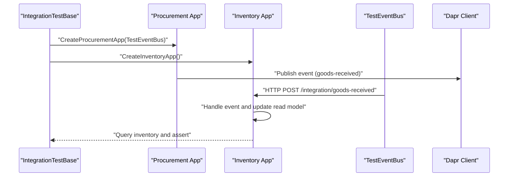

**Diagram sources**
- [IntegrationTestBase.cs](file://src/tests/ErpSystem.IntegrationTests/IntegrationTestBase.cs#L109-L153)
- [ProcurementToInventoryTests.cs](file://src/tests/ErpSystem.IntegrationTests/ProcurementToInventoryTests.cs#L25-L59)
- [DaprEventBus.cs](file://src/BuildingBlocks/ErpSystem.BuildingBlocks/EventBus/DaprEventBus.cs#L11-L21)

## Detailed Component Analysis

### Financial Journal Entry and Trial Balance
Validates end-to-end accounting workflow: account definition, financial period setup, draft journal entry creation, posting, and trial balance verification.

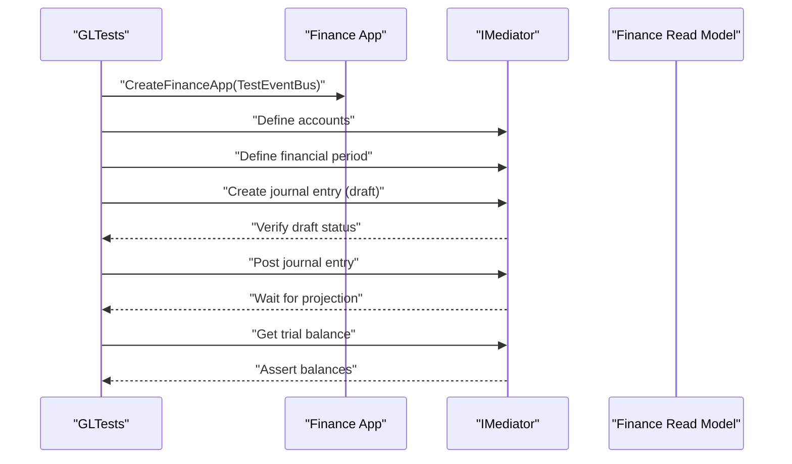

**Diagram sources**
- [GLTests.cs](file://src/tests/ErpSystem.IntegrationTests/GLTests.cs#L11-L87)
- [IntegrationTestBase.cs](file://src/tests/ErpSystem.IntegrationTests/IntegrationTestBase.cs#L155-L176)

**Section sources**
- [GLTests.cs](file://src/tests/ErpSystem.IntegrationTests/GLTests.cs#L1-L89)

### HR Lifecycle to Identity Account Management
End-to-end workflow from employee hiring to termination, verifying identity account creation and locking via integration events.

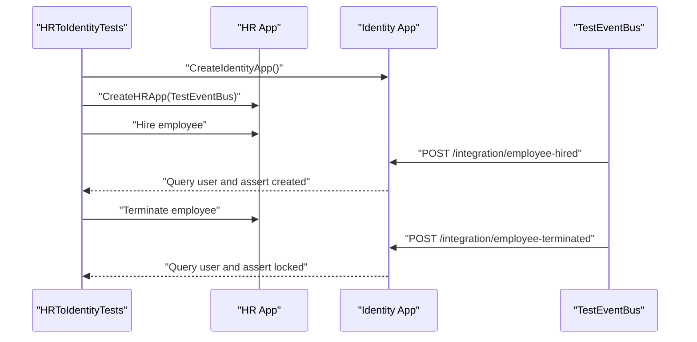

**Diagram sources**
- [HRToIdentityTests.cs](file://src/tests/ErpSystem.IntegrationTests/HRToIdentityTests.cs#L14-L95)
- [IntegrationTestBase.cs](file://src/tests/ErpSystem.IntegrationTests/IntegrationTestBase.cs#L21-L61)

**Section sources**
- [HRToIdentityTests.cs](file://src/tests/ErpSystem.IntegrationTests/HRToIdentityTests.cs#L1-L97)

### Procurement to Inventory Goods Receipt
Validates procurement purchase order progression and resulting inventory stock increase via the goods-received integration event.

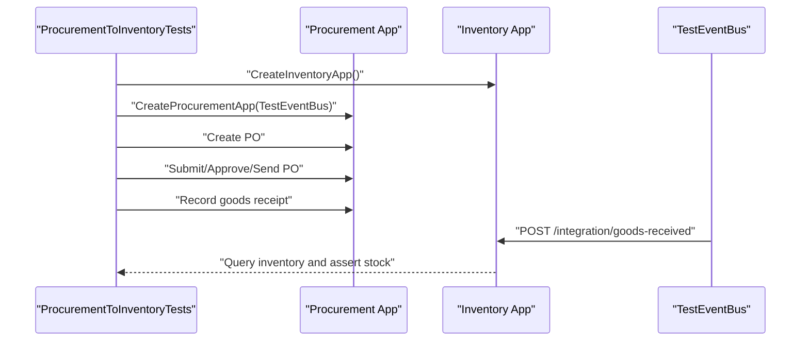

**Diagram sources**
- [ProcurementToInventoryTests.cs](file://src/tests/ErpSystem.IntegrationTests/ProcurementToInventoryTests.cs#L14-L79)
- [IntegrationTestBase.cs](file://src/tests/ErpSystem.IntegrationTests/IntegrationTestBase.cs#L109-L153)

**Section sources**
- [ProcurementToInventoryTests.cs](file://src/tests/ErpSystem.IntegrationTests/ProcurementToInventoryTests.cs#L1-L80)

### Production to Inventory Material Issue and Completion
Validates material consumption and finished goods receipt workflows, ensuring inventory updates on production events.

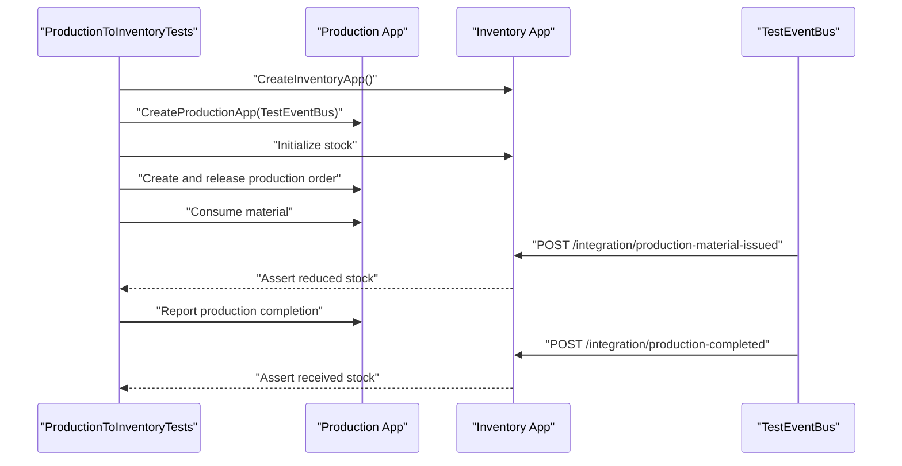

**Diagram sources**
- [ProductionToInventoryTests.cs](file://src/tests/ErpSystem.IntegrationTests/ProductionToInventoryTests.cs#L13-L125)
- [IntegrationTestBase.cs](file://src/tests/ErpSystem.IntegrationTests/IntegrationTestBase.cs#L63-L84)

**Section sources**
- [ProductionToInventoryTests.cs](file://src/tests/ErpSystem.IntegrationTests/ProductionToInventoryTests.cs#L1-L126)

### Sales to Inventory Order Confirmation Reservation
Validates sales order confirmation and stock reservation behavior in the inventory service.

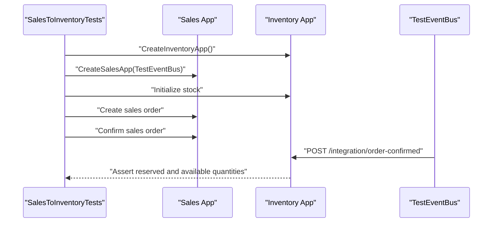

**Diagram sources**
- [SalesToInventoryTests.cs](file://src/tests/ErpSystem.IntegrationTests/SalesToInventoryTests.cs#L15-L86)
- [IntegrationTestBase.cs](file://src/tests/ErpSystem.IntegrationTests/IntegrationTestBase.cs#L86-L107)

**Section sources**
- [SalesToInventoryTests.cs](file://src/tests/ErpSystem.IntegrationTests/SalesToInventoryTests.cs#L1-L87)

### Predictive Analytics Engine
Validates demand forecasting engine behavior with historical trends and empty datasets.

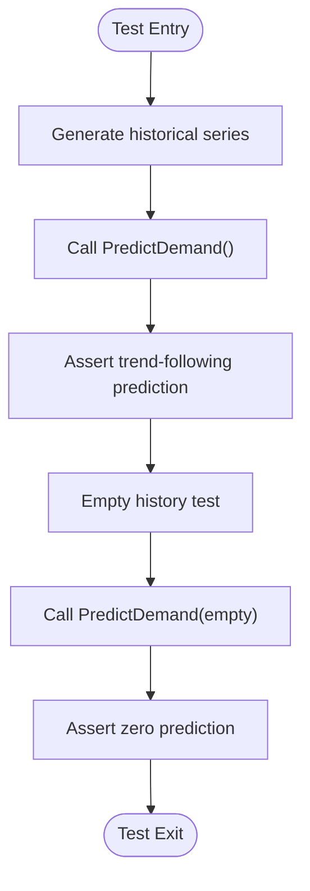

**Diagram sources**
- [PredictiveAnalyticsTests.cs](file://src/tests/ErpSystem.IntegrationTests/Analytics/PredictiveAnalyticsTests.cs#L11-L46)

**Section sources**
- [PredictiveAnalyticsTests.cs](file://src/tests/ErpSystem.IntegrationTests/Analytics/PredictiveAnalyticsTests.cs#L1-L47)

### Material Cost Valuation
Validates moving average cost calculations for receipts and issues, including insufficient quantity scenarios.

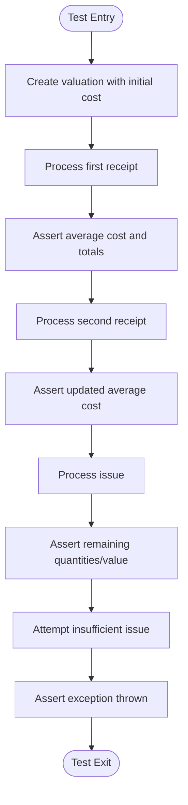

**Diagram sources**
- [MaterialCostValuationTests.cs](file://src/tests/ErpSystem.IntegrationTests/Finance/MaterialCostValuationTests.cs#L12-L125)

**Section sources**
- [MaterialCostValuationTests.cs](file://src/tests/ErpSystem.IntegrationTests/Finance/MaterialCostValuationTests.cs#L1-L126)

### MRP Calculation and Workflow
Validates reordering rules, procurement suggestions, and workflow enforcement.

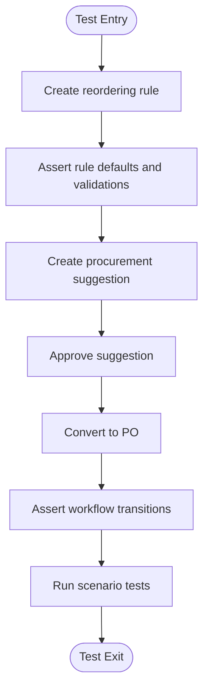

**Diagram sources**
- [MrpCalculationTests.cs](file://src/tests/ErpSystem.IntegrationTests/Mrp/MrpCalculationTests.cs#L12-L194)

**Section sources**
- [MrpCalculationTests.cs](file://src/tests/ErpSystem.IntegrationTests/Mrp/MrpCalculationTests.cs#L1-L195)

### Quality Control Workflow
Validates quality point definitions, pass/fail workflows, and alert tracking.

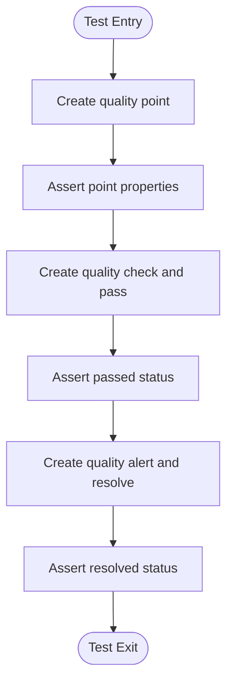

**Diagram sources**
- [QualityWorkflowTests.cs](file://src/tests/ErpSystem.IntegrationTests/Quality/QualityWorkflowTests.cs#L12-L74)

**Section sources**
- [QualityWorkflowTests.cs](file://src/tests/ErpSystem.IntegrationTests/Quality/QualityWorkflowTests.cs#L1-L75)

## Dependency Analysis
The integration test project depends on:
- Service projects for the workflows being tested
- Testing frameworks: xUnit, FluentAssertions
- ASP.NET Core testing utilities and in-memory Entity Framework provider
- Moq for mocking Dapr client
- MediatR for command/query orchestration

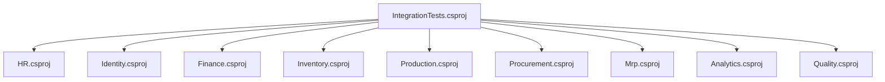

**Diagram sources**
- [ErpSystem.IntegrationTests.csproj](file://src/Tests/ErpSystem.IntegrationTests/ErpSystem.IntegrationTests.csproj#L27-L41)

**Section sources**
- [ErpSystem.IntegrationTests.csproj](file://src/Tests/ErpSystem.IntegrationTests/ErpSystem.IntegrationTests.csproj#L1-L44)

## Performance Considerations
- Asynchronous projections and outbox processing: The system relies on outbox processing and domain event dispatchers. In tests, explicit delays are used to allow projections to complete. In performance/load tests, consider:
  - Measuring end-to-end latency from command submission to read-model availability
  - Monitoring outbox batch processing throughput and error rates
  - Validating domain event dispatch timing and concurrency
- Database contention: In-memory databases reduce IO overhead but do not reflect disk-bound performance. For realistic performance testing, use lightweight ephemeral databases or containerized instances.
- Event bus overhead: The test event bus posts events over HTTP. In performance tests, measure event serialization, network latency, and receiver-side processing time.

[No sources needed since this section provides general guidance]

## Troubleshooting Guide
Common issues and debugging techniques:
- Missing or delayed projections: Add controlled delays around event publishing and assertion points. Verify that domain events are dispatched and outbox messages are processed.
- Cross-service event routing: Ensure the TestEventBus endpoint matches the receiving controller route. Validate HTTP status codes and payload shape.
- Inconsistent read model state: Confirm that the receiving service’s read model is updated after event handling. Use scoped contexts to query the read database directly.
- Flaky tests due to timing: Prefer deterministic waits or polling with bounded retries. Avoid hard-coded sleeps; consider retry policies or explicit readiness checks.
- Assertion failures: Capture and log exception details, stack traces, and inner exceptions for failing tests to accelerate diagnosis.

**Section sources**
- [IntegrationTestBase.cs](file://src/tests/ErpSystem.IntegrationTests/IntegrationTestBase.cs#L179-L187)
- [GLTests.cs](file://src/tests/ErpSystem.IntegrationTests/GLTests.cs#L78-L87)
- [HRToIdentityTests.cs](file://src/tests/ErpSystem.IntegrationTests/HRToIdentityTests.cs#L84-L95)
- [ProcurementToInventoryTests.cs](file://src/tests/ErpSystem.IntegrationTests/ProcurementToInventoryTests.cs#L66-L79)
- [ProductionToInventoryTests.cs](file://src/tests/ErpSystem.IntegrationTests/ProductionToInventoryTests.cs#L59-L70)
- [SalesToInventoryTests.cs](file://src/tests/ErpSystem.IntegrationTests/SalesToInventoryTests.cs#L73-L86)

## Conclusion
The testing strategy leverages a robust integration test framework that simulates cross-service workflows using in-memory databases and a test event bus. The 21 passing tests cover critical business scenarios spanning finance, procurement, inventory, production, sales, HR, identity, analytics, MRP, and quality. The approach provides strong confidence in event-driven integrations and domain logic correctness, with clear patterns for extending coverage and maintaining reliability during continuous integration and performance testing.

[No sources needed since this section summarizes without analyzing specific files]

## Appendices

### Writing New Integration Tests
- Use IntegrationTestBase to bootstrap the minimal set of services required for the scenario.
- Replace persistence with in-memory databases and inject the TestEventBus pointing to the receiving service endpoint.
- Orchestrate commands via MediatR and assert outcomes using queries or direct read model access.
- Add controlled delays only when asynchronous processing is expected; otherwise, rely on synchronous handlers in tests.

**Section sources**
- [IntegrationTestBase.cs](file://src/tests/ErpSystem.IntegrationTests/IntegrationTestBase.cs#L21-L187)
- [GLTests.cs](file://src/tests/ErpSystem.IntegrationTests/GLTests.cs#L11-L87)
- [ProcurementToInventoryTests.cs](file://src/tests/ErpSystem.IntegrationTests/ProcurementToInventoryTests.cs#L14-L79)

### Test Data Management
- Prefer deterministic identifiers and controlled timestamps for reproducibility.
- Initialize read models explicitly when needed (e.g., inventory stock) before asserting downstream effects.
- Use scoped service containers to query read databases directly for verification.

**Section sources**
- [ProductionToInventoryTests.cs](file://src/tests/ErpSystem.IntegrationTests/ProductionToInventoryTests.cs#L37-L57)
- [SalesToInventoryTests.cs](file://src/tests/ErpSystem.IntegrationTests/SalesToInventoryTests.cs#L39-L71)

### Continuous Integration Testing
- Run the integration test project with coverage collection enabled.
- Ensure CI environments provide sufficient resources for concurrent service bootstrapping.
- Use containerized infrastructure for services requiring external dependencies (e.g., pub/sub) when not using the test event bus.

**Section sources**
- [ErpSystem.IntegrationTests.csproj](file://src/Tests/ErpSystem.IntegrationTests/ErpSystem.IntegrationTests.csproj#L10-L21)

### Performance and Load Testing Guidance
- Measure end-to-end latency for each major workflow and track error rates.
- Monitor outbox processing metrics and adjust batch sizes and intervals.
- Validate event bus throughput and payload sizes; consider compression or batching for high-volume scenarios.

[No sources needed since this section provides general guidance]