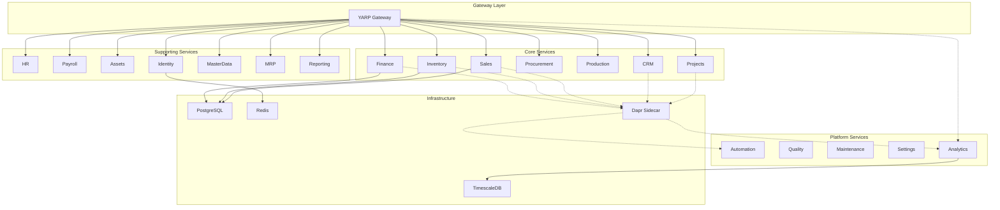
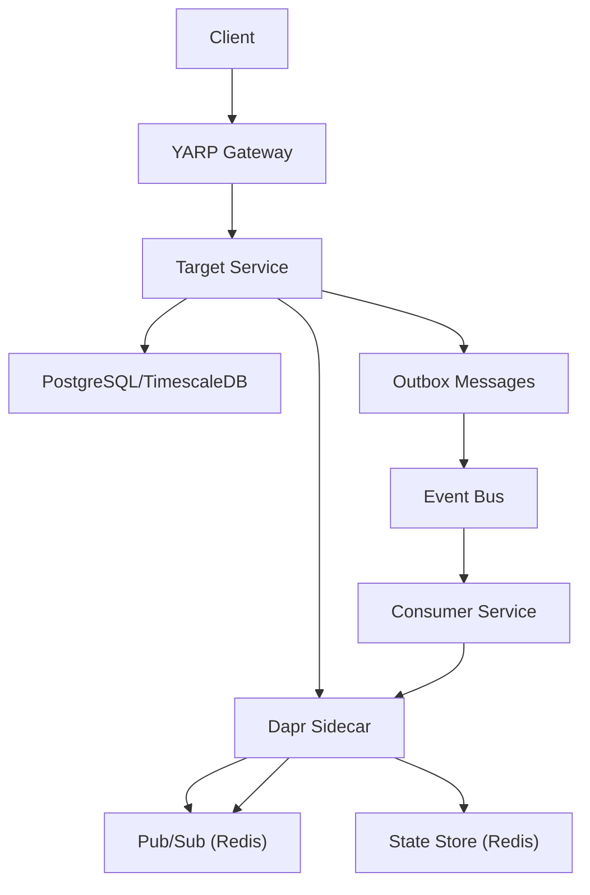
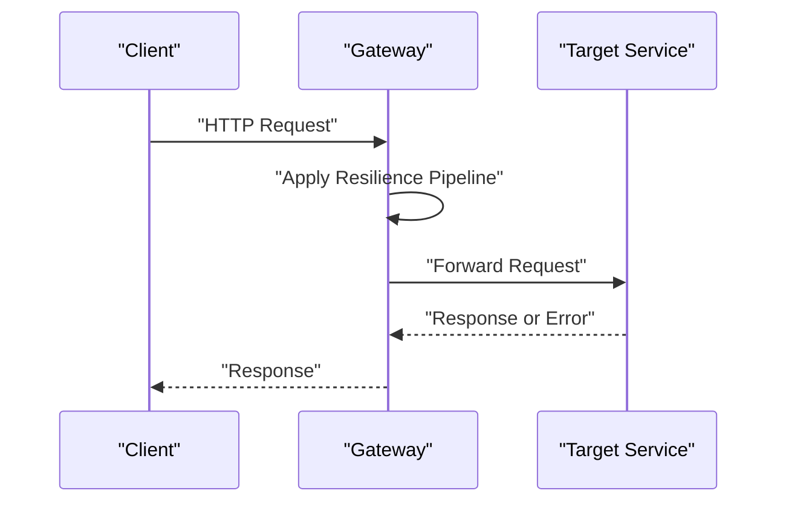
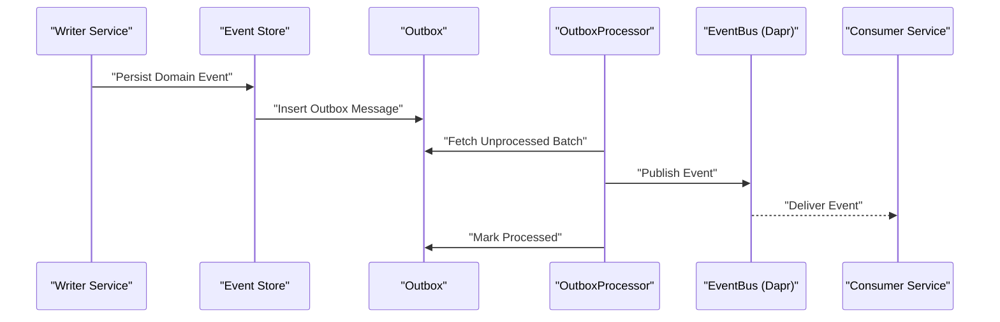
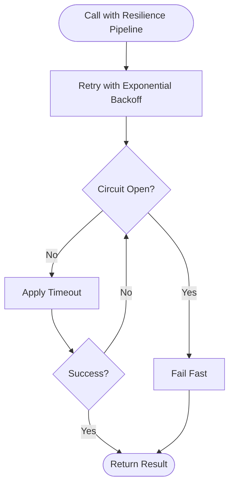
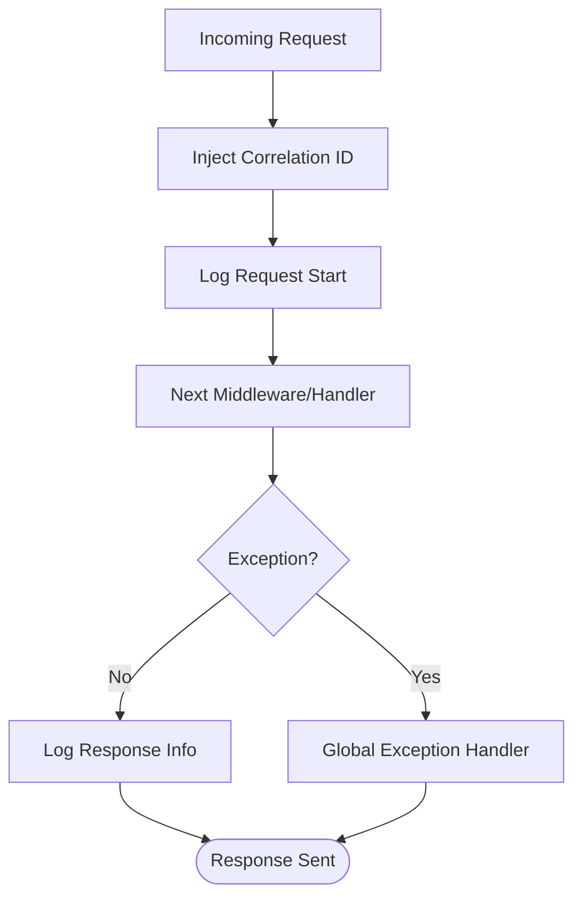
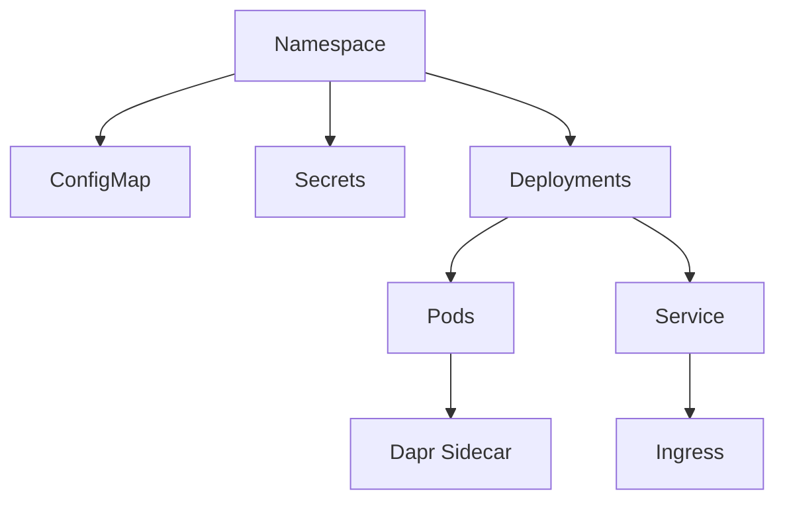

# Troubleshooting and FAQ

<cite>
**Referenced Files in This Document**
- [README.md](file://README.md)
- [DEVELOPMENT_PLAN.md](file://DEVELOPMENT_PLAN.md)
- [Program.cs](file://src/Gateways/ErpSystem.Gateway/Program.cs)
- [Program.cs](file://src/Services/Finance/Program.cs)
- [Program.cs](file://src/Services/Identity/Program.cs)
- [DaprEventBus.cs](file://src/BuildingBlocks/ErpSystem.BuildingBlocks/EventBus/DaprEventBus.cs)
- [OutboxProcessor.cs](file://src/BuildingBlocks/ErpSystem.BuildingBlocks/Outbox/OutboxProcessor.cs)
- [ResiliencePolicies.cs](file://src/BuildingBlocks/ErpSystem.BuildingBlocks/Resilience/ResiliencePolicies.cs)
- [Middlewares.cs](file://src/BuildingBlocks/ErpSystem.BuildingBlocks/Middleware/Middlewares.cs)
- [AuthExtensions.cs](file://src/BuildingBlocks/ErpSystem.BuildingBlocks/Auth/AuthExtensions.cs)
- [DependencyInjection.cs](file://src/BuildingBlocks/ErpSystem.BuildingBlocks/DependencyInjection.cs)
- [values.yaml](file://deploy/helm/erp-system/values.yaml)
- [deployment.yaml](file://deploy/helm/erp-system/templates/deployment.yaml)
- [configmap.yaml](file://deploy/k8s/configmap.yaml)
- [secrets.yaml](file://deploy/k8s/secrets.yaml)
- [namespace.yaml](file://deploy/k8s/namespace.yaml)
</cite>

## Table of Contents
1. [Introduction](#introduction)
2. [Project Structure](#project-structure)
3. [Core Components](#core-components)
4. [Architecture Overview](#architecture-overview)
5. [Detailed Component Analysis](#detailed-component-analysis)
6. [Dependency Analysis](#dependency-analysis)
7. [Performance Considerations](#performance-considerations)
8. [Troubleshooting Guide](#troubleshooting-guide)
9. [FAQ](#faq)
10. [Recovery Procedures](#recovery-procedures)
11. [Escalation and Support](#escalation-and-support)
12. [Conclusion](#conclusion)

## Introduction
This document provides comprehensive troubleshooting and FAQ guidance for the ERP microservices system. It focuses on diagnosing and resolving common issues during development, deployment, and operations, including database connectivity, inter-service communication, event processing, performance tuning, memory optimization, scaling, distributed system debugging, log analysis, monitoring, and recovery procedures. It also answers frequently asked questions about architecture and operational procedures.

## Project Structure
The system follows a cloud-native microservices architecture with Dapr sidecars, PostgreSQL/TimescaleDB for persistence, Redis for caching/pub-sub/state, and Kubernetes/Helm for deployment. The gateway (YARP) routes traffic to services, while each domain service encapsulates domain logic, event sourcing, and projections.

**Diagram sources**
- [README.md](file://README.md#L130-L183)

**Section sources**
- [README.md](file://README.md#L130-L183)
- [README.md](file://README.md#L289-L322)

## Core Components
- Gateway and Resilience: The gateway configures global resilience policies (retry, circuit breaker, timeout) and rate limiting. It acts as the single entry point for clients.
- Event Bus and Outbox: Dapr-backed event bus publishes domain events; OutboxProcessor reliably delivers outbox messages to the event bus.
- Resilience Policies: Centralized Polly resilience pipelines for HTTP and general operations.
- Middleware: Request logging, correlation ID propagation, and global exception handling for consistent diagnostics and error responses.
- Authentication: Signature verification middleware and extension points for API client verification.
- Dependency Injection: Shared building blocks registration for validators, behaviors, and user context.

**Section sources**
- [Program.cs](file://src/Gateways/ErpSystem.Gateway/Program.cs#L30-L58)
- [DaprEventBus.cs](file://src/BuildingBlocks/ErpSystem.BuildingBlocks/EventBus/DaprEventBus.cs#L11-L21)
- [OutboxProcessor.cs](file://src/BuildingBlocks/ErpSystem.BuildingBlocks/Outbox/OutboxProcessor.cs#L8-L27)
- [ResiliencePolicies.cs](file://src/BuildingBlocks/ErpSystem.BuildingBlocks/Resilience/ResiliencePolicies.cs#L13-L90)
- [Middlewares.cs](file://src/BuildingBlocks/ErpSystem.BuildingBlocks/Middleware/Middlewares.cs#L10-L49)
- [AuthExtensions.cs](file://src/BuildingBlocks/ErpSystem.BuildingBlocks/Auth/AuthExtensions.cs#L6-L18)
- [DependencyInjection.cs](file://src/BuildingBlocks/ErpSystem.BuildingBlocks/DependencyInjection.cs#L10-L29)

## Architecture Overview
The system leverages Dapr for service invocation, pub/sub, and state management, enabling loose coupling and resilient inter-service communication. Event sourcing and CQRS are used across services, with projections feeding read-side databases. Kubernetes and Helm manage deployments, with ConfigMaps and Secrets providing environment-specific configuration.

**Diagram sources**
- [README.md](file://README.md#L130-L183)
- [DaprEventBus.cs](file://src/BuildingBlocks/ErpSystem.BuildingBlocks/EventBus/DaprEventBus.cs#L11-L21)
- [OutboxProcessor.cs](file://src/BuildingBlocks/ErpSystem.BuildingBlocks/Outbox/OutboxProcessor.cs#L29-L70)

## Detailed Component Analysis

### Gateway Resilience and Routing
- Resilience pipeline: Retry with exponential backoff and jitter, circuit breaker, and timeout configured globally for outbound calls.
- Rate limiting: Protects backend services from overload.
- Health checks: Liveness/readiness endpoints exposed for probes.

**Diagram sources**
- [Program.cs](file://src/Gateways/ErpSystem.Gateway/Program.cs#L30-L58)

**Section sources**
- [Program.cs](file://src/Gateways/ErpSystem.Gateway/Program.cs#L30-L58)
- [Program.cs](file://src/Gateways/ErpSystem.Gateway/Program.cs#L60-L81)

### Event Bus and Outbox Reliability
- Event publishing: Uses Dapr pub/sub with topic derived from event type name.
- Outbox processing: Background service batches and publishes outbox messages, marking processed/failed states.

**Diagram sources**
- [DaprEventBus.cs](file://src/BuildingBlocks/ErpSystem.BuildingBlocks/EventBus/DaprEventBus.cs#L15-L20)
- [OutboxProcessor.cs](file://src/BuildingBlocks/ErpSystem.BuildingBlocks/Outbox/OutboxProcessor.cs#L29-L70)

**Section sources**
- [DaprEventBus.cs](file://src/BuildingBlocks/ErpSystem.BuildingBlocks/EventBus/DaprEventBus.cs#L11-L31)
- [OutboxProcessor.cs](file://src/BuildingBlocks/ErpSystem.BuildingBlocks/Outbox/OutboxProcessor.cs#L8-L72)

### Resilience Policies
- Preconfigured pipelines for retry, circuit breaker, timeout, and combined HTTP retry strategies.
- Tunable parameters for throughput, break duration, and timeouts.

**Diagram sources**
- [ResiliencePolicies.cs](file://src/BuildingBlocks/ErpSystem.BuildingBlocks/Resilience/ResiliencePolicies.cs#L18-L90)

**Section sources**
- [ResiliencePolicies.cs](file://src/BuildingBlocks/ErpSystem.BuildingBlocks/Resilience/ResiliencePolicies.cs#L13-L111)

### Middleware Diagnostics
- Request logging: Captures method, path, status code, and elapsed time per request.
- Correlation ID: Propagates X-Correlation-ID header for end-to-end tracing.
- Global exception handler: Normalizes error responses across services.

**Diagram sources**
- [Middlewares.cs](file://src/BuildingBlocks/ErpSystem.BuildingBlocks/Middleware/Middlewares.cs#L10-L49)
- [Middlewares.cs](file://src/BuildingBlocks/ErpSystem.BuildingBlocks/Middleware/Middlewares.cs#L73-L124)

**Section sources**
- [Middlewares.cs](file://src/BuildingBlocks/ErpSystem.BuildingBlocks/Middleware/Middlewares.cs#L10-L124)

### Authentication and Signature Verification
- Signature verification middleware and DI extension enable verifying external API calls.
- Requires an implementation of IApiClientRepository to be registered by consuming applications.

**Section sources**
- [AuthExtensions.cs](file://src/BuildingBlocks/ErpSystem.BuildingBlocks/Auth/AuthExtensions.cs#L6-L18)

### Dependency Injection and Shared Building Blocks
- Registers validators, MediatR behaviors (logging, validation), and user context.
- Supports scanning assemblies for building blocks registration.

**Section sources**
- [DependencyInjection.cs](file://src/BuildingBlocks/ErpSystem.BuildingBlocks/DependencyInjection.cs#L10-L31)

## Dependency Analysis
- Kubernetes namespace, ConfigMap, and Secrets define environment and credentials.
- Helm values configure replicas, resource requests/limits, ingress, database, Redis, and Dapr components.
- Deployments annotate Dapr sidecar configuration and expose health probes.

**Diagram sources**
- [namespace.yaml](file://deploy/k8s/namespace.yaml#L1-L8)
- [configmap.yaml](file://deploy/k8s/configmap.yaml#L1-L25)
- [secrets.yaml](file://deploy/k8s/secrets.yaml#L1-L19)
- [values.yaml](file://deploy/helm/erp-system/values.yaml#L10-L58)
- [deployment.yaml](file://deploy/helm/erp-system/templates/deployment.yaml#L1-L58)

**Section sources**
- [namespace.yaml](file://deploy/k8s/namespace.yaml#L1-L8)
- [configmap.yaml](file://deploy/k8s/configmap.yaml#L1-L25)
- [secrets.yaml](file://deploy/k8s/secrets.yaml#L1-L19)
- [values.yaml](file://deploy/helm/erp-system/values.yaml#L1-L127)
- [deployment.yaml](file://deploy/helm/erp-system/templates/deployment.yaml#L1-L58)

## Performance Considerations
- Resilience tuning: Adjust retry attempts, backoff jitter, circuit breaker thresholds, and timeouts to balance reliability and latency.
- Resource allocation: Increase CPU/memory requests/limits per service in Helm values for higher loads; ensure adequate database connections.
- Database optimization: Use TimescaleDB for time-series analytics; optimize projections and indexes; batch reads/writes where appropriate.
- Caching: Leverage Redis for session/state; monitor hit rates and eviction policies.
- Gateway load: Enable rate limiting and circuit breaking at the gateway to prevent overload.

[No sources needed since this section provides general guidance]

## Troubleshooting Guide

### Database Connectivity Problems
Symptoms:
- Startup migrations fail or database not ready.
- Queries time out or return connection errors.
- Read model projections not updating.

Common causes and fixes:
- Verify connection strings in ConfigMap and Secrets match cluster DNS names and credentials.
- Ensure PostgreSQL/ TimescaleDB is reachable from the service’s namespace and that network policies allow egress.
- Confirm database initialization scripts ran and that the target database exists.
- Check service health endpoints (/health) to confirm DB readiness.
- For local Docker Compose, ensure volumes and ports are correctly mapped.

Operational steps:
- Inspect service logs for DB connection errors.
- Validate ConfigMap/Secrets injection at runtime.
- Confirm environment variables (ASPNETCORE_ENVIRONMENT) are set appropriately.

**Section sources**
- [configmap.yaml](file://deploy/k8s/configmap.yaml#L11-L12)
- [secrets.yaml](file://deploy/k8s/secrets.yaml#L8-L9)
- [Program.cs](file://src/Services/Finance/Program.cs#L20-L24)
- [Program.cs](file://src/Services/Identity/Program.cs#L20-L24)
- [deployment.yaml](file://deploy/helm/erp-system/templates/deployment.yaml#L44-L55)

### Service Communication Failures
Symptoms:
- Gateway returns 502/503 or timeouts.
- Circuit breaker trips and requests fail fast.
- Inter-service calls hang or return errors.

Common causes and fixes:
- Validate Dapr sidecar is enabled and app-id matches service name.
- Confirm pub/sub/state stores are reachable (Redis).
- Check service discovery and internal DNS resolution (e.g., service FQDN).
- Review resilience pipeline configuration (retry/backoff/circuit breaker).
- Ensure health probes (/health) are reachable and returning healthy status.

Operational steps:
- Check gateway logs for upstream failures.
- Inspect Dapr sidecar logs for binding errors.
- Use kubectl exec to curl service endpoints internally.
- Temporarily disable circuit breaker to isolate transient vs persistent failures.

**Section sources**
- [deployment.yaml](file://deploy/helm/erp-system/templates/deployment.yaml#L22-L26)
- [values.yaml](file://deploy/helm/erp-system/values.yaml#L117-L123)
- [Program.cs](file://src/Gateways/ErpSystem.Gateway/Program.cs#L30-L58)
- [Program.cs](file://src/Gateways/ErpSystem.Gateway/Program.cs#L60-L81)

### Event Processing Issues
Symptoms:
- Outbox messages remain unprocessed.
- Consumers do not receive events or receive duplicates.
- Event projections lag behind writes.

Common causes and fixes:
- Confirm OutboxProcessor is running and has DB/repository access.
- Check OutboxProcessor logs for exceptions and failed message markers.
- Validate Dapr pub/sub component configuration and topic names.
- Ensure consumers subscribe to topics and handle idempotency.

Operational steps:
- Inspect OutboxProcessor logs and metrics.
- Manually inspect outbox table for stuck messages.
- Replay events from the event store if needed.
- Monitor consumer lag and scale consumers if necessary.

**Section sources**
- [OutboxProcessor.cs](file://src/BuildingBlocks/ErpSystem.BuildingBlocks/Outbox/OutboxProcessor.cs#L8-L72)
- [DaprEventBus.cs](file://src/BuildingBlocks/ErpSystem.BuildingBlocks/EventBus/DaprEventBus.cs#L11-L21)

### Performance and Memory Optimization
Symptoms:
- High latency, frequent GC pressure, or pod restarts (OOMKILLED).
- Slow queries or long-running projections.

Common causes and fixes:
- Increase resource requests/limits in Helm values for CPU and memory.
- Tune resilience parameters to reduce retries under load.
- Optimize database queries and indexes; avoid N+1 selects.
- Use caching for hotspots; monitor cache hit ratios.
- Scale replicas horizontally for stateless services.

Operational steps:
- Review CPU/memory usage via metrics and autoscaling.
- Profile services to identify hotspots.
- Apply pagination and streaming for large datasets.

**Section sources**
- [values.yaml](file://deploy/helm/erp-system/values.yaml#L11-L19)
- [values.yaml](file://deploy/helm/erp-system/values.yaml#L22-L85)
- [ResiliencePolicies.cs](file://src/BuildingBlocks/ErpSystem.BuildingBlocks/Resilience/ResiliencePolicies.cs#L18-L90)

### Scaling Challenges
Symptoms:
- Gateway overload, timeouts, or 429 responses.
- Database contention or slow writes.

Common causes and fixes:
- Enable rate limiting at the gateway to protect downstream.
- Increase gateway replicas and tune timeouts.
- Scale stateless services; keep stateful components (DB/Redis) sized appropriately.
- Use read replicas or partitioning for heavy reads.

Operational steps:
- Observe gateway health and error rates.
- Monitor DB connection pool exhaustion.
- Adjust replica counts and resource limits incrementally.

**Section sources**
- [Program.cs](file://src/Gateways/ErpSystem.Gateway/Program.cs#L60-L68)
- [values.yaml](file://deploy/helm/erp-system/values.yaml#L11-L19)
- [values.yaml](file://deploy/helm/erp-system/values.yaml#L22-L85)

### Debugging Techniques for Distributed Systems
- Correlation ID: Ensure X-Correlation-ID is propagated across services for end-to-end tracing.
- Structured logs: Use request logging middleware to capture method, path, status, and elapsed time.
- Centralized logging: Aggregate logs from pods and sidecars.
- Tracing: Integrate distributed tracing with Dapr and your telemetry stack.

Operational steps:
- Search logs by correlation ID across gateway and target services.
- Validate middleware registration order and presence.
- Use kubectl logs and describe events for pod-level insights.

**Section sources**
- [Middlewares.cs](file://src/BuildingBlocks/ErpSystem.BuildingBlocks/Middleware/Middlewares.cs#L54-L68)
- [Middlewares.cs](file://src/BuildingBlocks/ErpSystem.BuildingBlocks/Middleware/Middlewares.cs#L10-L49)

### Log Analysis Strategies
- Request logging: Capture start/completion and exceptions with timing.
- Global exception handling: Normalize error responses for easier analysis.
- Health endpoints: Use /health and readiness probes to detect partial outages.

Operational steps:
- Filter logs by correlation ID and timestamps.
- Alert on error rate spikes and high latency percentiles.
- Archive and query logs using your platform’s logging solution.

**Section sources**
- [Middlewares.cs](file://src/BuildingBlocks/ErpSystem.BuildingBlocks/Middleware/Middlewares.cs#L73-L124)
- [Program.cs](file://src/Gateways/ErpSystem.Gateway/Program.cs#L60-L81)

### Monitoring Approaches
- Health checks: Exposed at /health for liveness/readiness.
- Resilience observability: Track circuit breaker state and retry metrics.
- Dapr observability: Enable Dapr dashboards and OTLP exporters.

Operational steps:
- Configure Prometheus/Grafana or your platform’s monitoring stack.
- Monitor service mesh metrics (latency, error rate, throughput).
- Set up alerts for circuit breaker trips and timeouts.

**Section sources**
- [Program.cs](file://src/Gateways/ErpSystem.Gateway/Program.cs#L60-L81)
- [ResiliencePolicies.cs](file://src/BuildingBlocks/ErpSystem.BuildingBlocks/Resilience/ResiliencePolicies.cs#L18-L90)

## FAQ

Q: Why does the gateway return 503 during startup?
A: The gateway applies resilience policies and rate limiting. If upstream services are slow to become ready, the circuit breaker may trip temporarily. Check /health endpoints and Dapr sidecar logs.

Q: How do I verify Dapr pub/sub is working?
A: Confirm Dapr sidecar is enabled on deployments and that the pub/sub component is configured to Redis. Check logs for publish/subscribe errors and ensure topic names match event type names.

Q: What should I check if outbox messages are not being delivered?
A: Verify OutboxProcessor is running, repository access is configured, and event bus is reachable. Inspect logs for exceptions and review failed message markers.

Q: How do I tune resilience for my workload?
A: Adjust retry attempts, backoff jitter, circuit breaker thresholds, and timeouts in the gateway and service resilience pipelines. Start conservative and increase gradually.

Q: How are secrets managed in Kubernetes?
A: Secrets are stored in Kubernetes Secrets and injected via envFrom. Ensure keys match your service configuration and rotate secrets regularly.

Q: How do I scale services?
A: Increase replica counts in Helm values for stateless services. For stateful components, scale DB/Redis appropriately and monitor resource utilization.

Q: How do I debug cross-service calls?
A: Use correlation ID propagation, structured request logs, and centralized logging. Trace requests from gateway to target service and Dapr sidecar.

Q: What database technologies are used?
A: PostgreSQL/TimescaleDB for relational/event sourcing and time-series analytics; Redis for caching and Dapr pub/sub/state.

Q: How are services deployed?
A: Kubernetes manifests and Helm charts orchestrate deployments, services, ingress, ConfigMaps, and Secrets. Dapr sidecars are annotated automatically.

Q: How do I validate authentication signatures?
A: Register signature verification middleware and provide an implementation of IApiClientRepository in the consuming application.

**Section sources**
- [Program.cs](file://src/Gateways/ErpSystem.Gateway/Program.cs#L30-L58)
- [deployment.yaml](file://deploy/helm/erp-system/templates/deployment.yaml#L22-L26)
- [OutboxProcessor.cs](file://src/BuildingBlocks/ErpSystem.BuildingBlocks/Outbox/OutboxProcessor.cs#L8-L72)
- [values.yaml](file://deploy/helm/erp-system/values.yaml#L11-L19)
- [secrets.yaml](file://deploy/k8s/secrets.yaml#L1-L19)
- [README.md](file://README.md#L167-L171)
- [AuthExtensions.cs](file://src/BuildingBlocks/ErpSystem.BuildingBlocks/Auth/AuthExtensions.cs#L6-L18)

## Recovery Procedures

### System Failures
- Isolate the failing component using health checks and circuit breaker state.
- Roll back recent changes and re-deploy stable images.
- Restart pods with backoff to avoid thundering herd.

Operational steps:
- Drain traffic from unhealthy nodes.
- Recreate failed pods and monitor readiness.

**Section sources**
- [Program.cs](file://src/Gateways/ErpSystem.Gateway/Program.cs#L60-L81)
- [deployment.yaml](file://deploy/helm/erp-system/templates/deployment.yaml#L44-L55)

### Data Corruption or Event Sourcing Issues
- Rebuild read models from event store if projections are inconsistent.
- Validate event ordering and replay events where necessary.
- Use backup/restore procedures for PostgreSQL/TimescaleDB.

Operational steps:
- Identify missing or duplicated events in outbox.
- Recreate projections and re-run OutboxProcessor.

**Section sources**
- [OutboxProcessor.cs](file://src/BuildingBlocks/ErpSystem.BuildingBlocks/Outbox/OutboxProcessor.cs#L29-L70)
- [Program.cs](file://src/Services/Finance/Program.cs#L63-L71)
- [Program.cs](file://src/Services/Identity/Program.cs#L58-L66)

### Disaster Recovery Scenarios
- Restore PostgreSQL/TimescaleDB from backups.
- Recreate namespaces, ConfigMaps, and Secrets.
- Reapply Helm releases and verify Dapr sidecars.

Operational steps:
- Validate ingress and service endpoints after restore.
- Confirm event bus and pub/sub components are functional.

**Section sources**
- [namespace.yaml](file://deploy/k8s/namespace.yaml#L1-L8)
- [configmap.yaml](file://deploy/k8s/configmap.yaml#L1-L25)
- [secrets.yaml](file://deploy/k8s/secrets.yaml#L1-L19)
- [values.yaml](file://deploy/helm/erp-system/values.yaml#L1-L127)

## Escalation and Support
- Tier 1: Local development issues (dependencies, ports, credentials).
- Tier 2: Cluster-level issues (network policies, secrets, Dapr sidecars).
- Tier 3: Cross-service reliability and performance (resilience tuning, DB optimization).
- Support channels: GitHub Issues, Discussions, and internal Slack channel.

[No sources needed since this section provides general guidance]

## Conclusion
This guide consolidates practical troubleshooting, performance tuning, and recovery procedures for the ERP microservices system. By leveraging resilience policies, structured logging, health checks, and Dapr observability, teams can diagnose and resolve issues efficiently. Use the provided diagrams and references to map observed symptoms to actionable remediation steps.