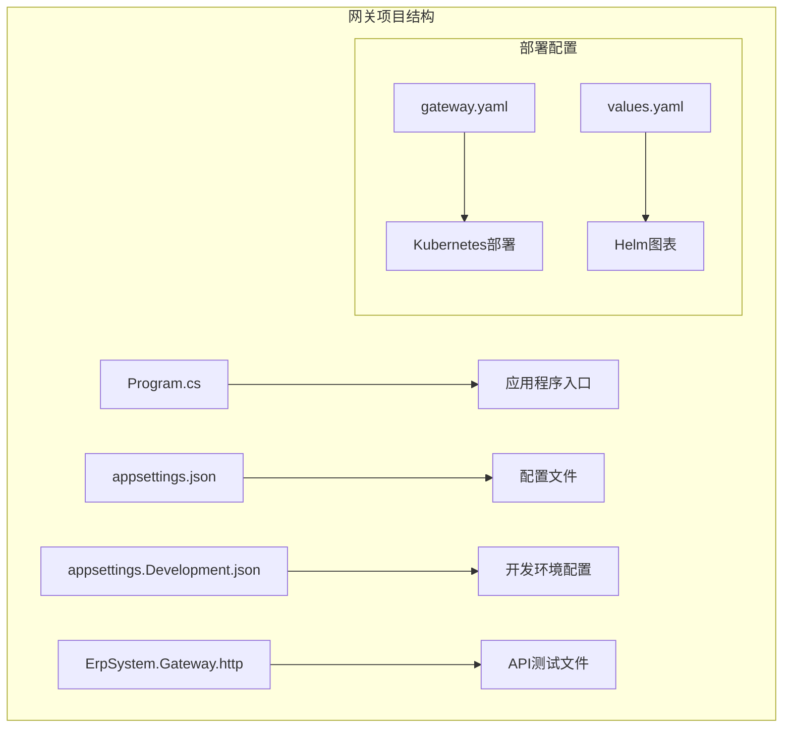
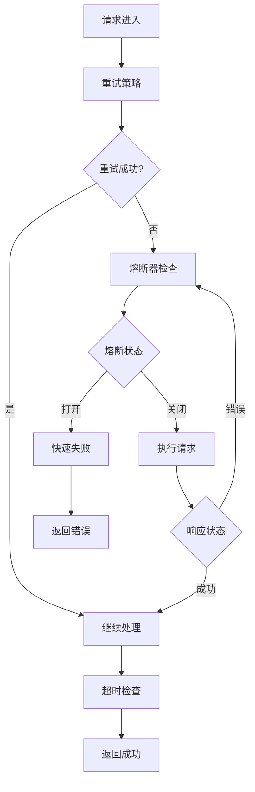
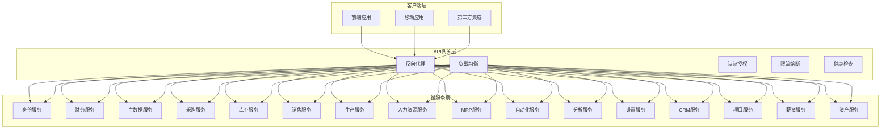
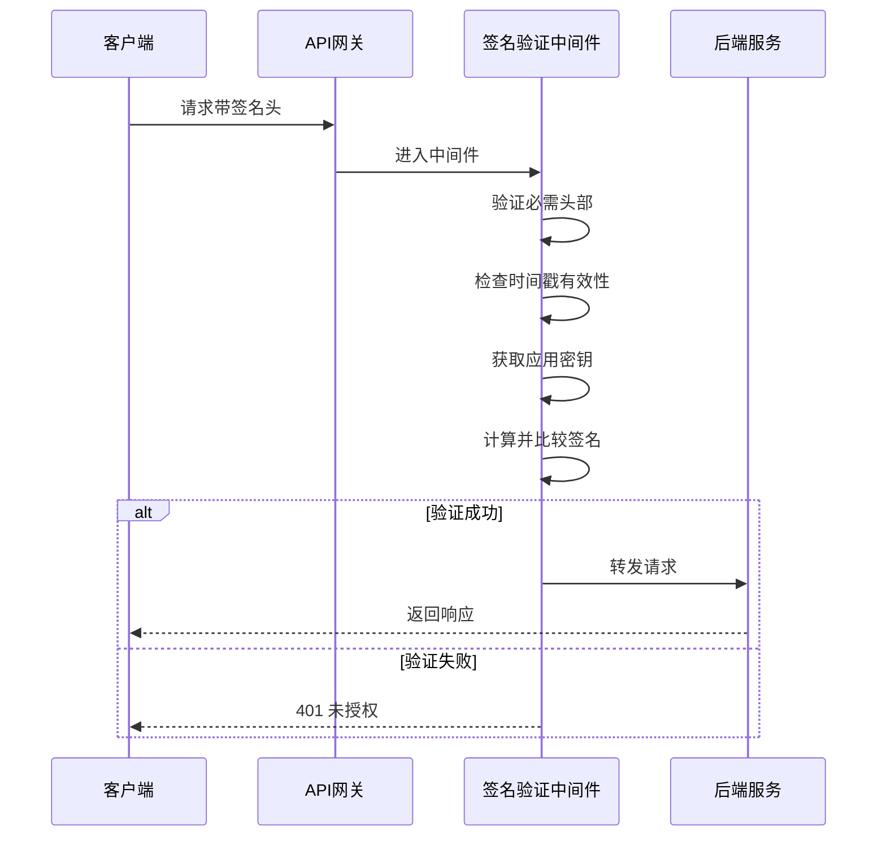
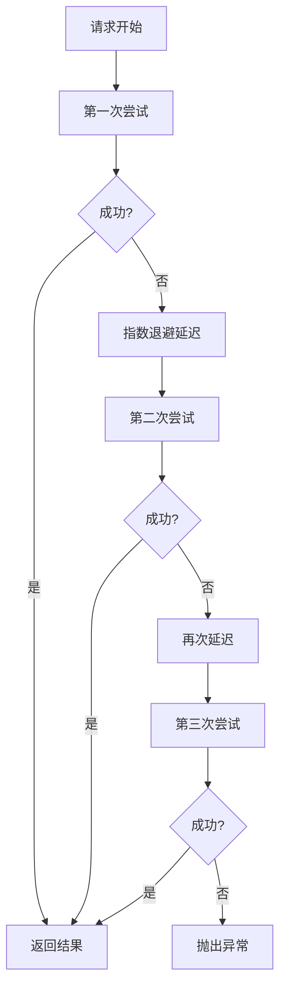
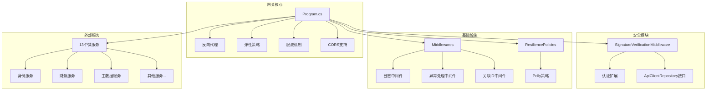

# API网关API

<cite>
**本文档引用的文件**
- [Program.cs](file://src/Gateways/ErpSystem.Gateway/Program.cs)
- [appsettings.json](file://src/Gateways/ErpSystem.Gateway/appsettings.json)
- [appsettings.Development.json](file://src/Gateways/ErpSystem.Gateway/appsettings.Development.json)
- [ErpSystem.Gateway.http](file://src/Gateways/ErpSystem.Gateway/ErpSystem.Gateway.http)
- [gateway.yaml](file://deploy/k8s/services/gateway.yaml)
- [values.yaml](file://deploy/helm/erp-system/values.yaml)
- [AuthController.cs](file://src/Services/Identity/ErpSystem.Identity/API/AuthController.cs)
- [InvoicesController.cs](file://src/Services/Finance/ErpSystem.Finance/API/InvoicesController.cs)
- [MasterControllers.cs](file://src/Services/MasterData/ErpSystem.MasterData/Controllers/MasterControllers.cs)
- [SignatureVerificationMiddleware.cs](file://src/BuildingBlocks/ErpSystem.BuildingBlocks/Auth/SignatureVerificationMiddleware.cs)
- [AuthExtensions.cs](file://src/BuildingBlocks/ErpSystem.BuildingBlocks/Auth/AuthExtensions.cs)
- [Middlewares.cs](file://src/BuildingBlocks/ErpSystem.BuildingBlocks/Middleware/Middlewares.cs)
- [ResiliencePolicies.cs](file://src/BuildingBlocks/ErpSystem.BuildingBlocks/Resilience/ResiliencePolicies.cs)
</cite>

## 目录
1. [简介](#简介)
2. [项目结构](#项目结构)
3. [核心组件](#核心组件)
4. [架构概览](#架构概览)
5. [详细组件分析](#详细组件分析)
6. [依赖关系分析](#依赖关系分析)
7. [性能考虑](#性能考虑)
8. [故障排除指南](#故障排除指南)
9. [结论](#结论)
10. [附录](#附录)

## 简介

本文件为ERP微服务系统中的API网关提供完整的API文档。该网关基于ASP.NET Core构建，集成了反向代理、负载均衡、认证授权、限流熔断、健康检查等核心功能。网关通过统一入口为13个微服务提供路由转发能力，支持服务发现、流量控制、安全过滤和监控统计。

## 项目结构

API网关位于`src/Gateways/ErpSystem.Gateway`目录下，采用标准的ASP.NET Core项目结构：



**图表来源**
- [Program.cs](file://src/Gateways/ErpSystem.Gateway/Program.cs#L1-L107)
- [appsettings.json](file://src/Gateways/ErpSystem.Gateway/appsettings.json#L1-L229)

**章节来源**
- [Program.cs](file://src/Gateways/ErpSystem.Gateway/Program.cs#L1-L107)
- [appsettings.json](file://src/Gateways/ErpSystem.Gateway/appsettings.json#L1-L229)

## 核心组件

### 反向代理配置

网关使用ASP.NET Core的内置反向代理功能，通过配置文件定义路由规则和集群设置：

| 组件 | 功能描述 | 配置位置 |
|------|----------|----------|
| 路由规则 | 定义URL路径到服务集群的映射 | ReverseProxy.Routes |
| 集群配置 | 定义后端服务地址和负载均衡策略 | ReverseProxy.Clusters |
| 负载均衡 | 支持轮询、粘性会话等策略 | Clusters.Destinations |

### 企业级弹性（Resilience）

网关实现了标准化的弹性管道，包含重试、熔断器和超时机制：



**图表来源**
- [Program.cs](file://src/Gateways/ErpSystem.Gateway/Program.cs#L31-L58)

### 限流机制

网关集成了速率限制功能，防止后端服务被过载：

- 拒绝状态码：429 Too Many Requests
- 全局配置：适用于所有路由
- 可扩展：支持按客户端、IP地址等维度进行限流

### CORS跨域支持

默认启用CORS策略，允许任意源、头和方法：

- 允许任意Origin
- 允许任意Header  
- 允许任意Method

**章节来源**
- [Program.cs](file://src/Gateways/ErpSystem.Gateway/Program.cs#L10-L20)
- [Program.cs](file://src/Gateways/ErpSystem.Gateway/Program.cs#L31-L58)
- [Program.cs](file://src/Gateways/ErpSystem.Gateway/Program.cs#L61-L64)

## 架构概览

API网关采用微服务架构中的统一入口模式，为13个微服务提供集中式管理：



**图表来源**
- [appsettings.json](file://src/Gateways/ErpSystem.Gateway/appsettings.json#L9-L113)
- [appsettings.json](file://src/Gateways/ErpSystem.Gateway/appsettings.json#L114-L227)

## 详细组件分析

### 认证授权组件

网关实现了基于签名验证的安全机制，确保只有合法的应用程序可以访问后端服务。

#### 签名验证中间件



**图表来源**
- [SignatureVerificationMiddleware.cs](file://src/BuildingBlocks/ErpSystem.BuildingBlocks/Auth/SignatureVerificationMiddleware.cs#L16-L76)

#### 安全头部要求

签名验证需要以下头部信息：

| 头部名称 | 必需 | 描述 | 示例值 |
|----------|------|------|--------|
| X-AppId | 是 | 应用程序标识符 | app-123 |
| X-Timestamp | 是 | 请求时间戳（秒） | 1700000000 |
| X-Nonce | 是 | 随机数 | abc123def456 |
| X-Signature | 是 | 签名值 | SHA256哈希 |

#### 签名计算算法

签名计算公式：`HMAC-SHA256(AppId + Timestamp + Nonce + Body, Secret)`

验证逻辑：
1. 检查时间戳是否在5分钟有效期内
2. 从存储中获取应用程序密钥
3. 重新计算签名并与请求签名比较
4. 支持大小写不敏感的比较

**章节来源**
- [SignatureVerificationMiddleware.cs](file://src/BuildingBlocks/ErpSystem.BuildingBlocks/Auth/SignatureVerificationMiddleware.cs#L1-L85)
- [AuthExtensions.cs](file://src/BuildingBlocks/ErpSystem.BuildingBlocks/Auth/AuthExtensions.cs#L1-L18)

### 路由转发组件

网关通过配置文件定义了13个主要微服务的路由规则：

#### 路由配置表

| 服务名称 | 基础路径 | 集群ID | 目标地址 |
|----------|----------|--------|----------|
| 身份服务 | `/api/v1/identity/{**remainder}` | `identity-cluster` | `http://localhost:5080` |
| 主数据服务 | `/api/v1/masterdata/{**remainder}` | `masterdata-cluster` | `http://localhost:5064` |
| 财务服务 | `/api/v1/finance/{**remainder}` | `finance-cluster` | `http://localhost:5275` |
| 采购服务 | `/api/v1/procurement/{**remainder}` | `procurement-cluster` | `http://localhost:5155` |
| 库存服务 | `/api/v1/inventory/{**remainder}` | `inventory-cluster` | `http://localhost:5011` |
| 销售服务 | `/api/v1/sales/{**remainder}` | `sales-cluster` | `http://localhost:5151` |
| 生产服务 | `/api/v1/production/{**remainder}` | `production-cluster` | `http://localhost:5013` |
| 人力资源服务 | `/api/v1/hr/{**remainder}` | `hr-cluster` | `http://localhost:5007` |
| MRP服务 | `/api/v1/mrp/{**remainder}` | `mrp-cluster` | `http://localhost:59652` |
| 自动化服务 | `/api/v1/automation/{**remainder}` | `automation-cluster` | `http://localhost:59649` |
| 分析服务 | `/api/v1/analytics/{**remainder}` | `analytics-cluster` | `http://localhost:59654` |
| 设置服务 | `/api/v1/settings/{**remainder}` | `settings-cluster` | `http://localhost:5090` |
| CRM服务 | `/api/v1/crm/{**remainder}` | `crm-cluster` | `http://localhost:5110` |
| 项目服务 | `/api/v1/projects/{**remainder}` | `projects-cluster` | `http://localhost:5111` |
| 薪资服务 | `/api/v1/payroll/{**remainder}` | `payroll-cluster` | `http://localhost:5112` |
| 资产服务 | `/api/v1/assets/{**remainder}` | `assets-cluster` | `http://localhost:5113` |

#### WebSocket路由

网关还支持WebSocket连接：
- 路径：`/hubs/analytics/{**remainder}`
- 使用相同的`analytics-cluster`集群

**章节来源**
- [appsettings.json](file://src/Gateways/ErpSystem.Gateway/appsettings.json#L9-L113)
- [appsettings.json](file://src/Gateways/ErpSystem.Gateway/appsettings.json#L114-L227)

### 弹性设计组件

网关实现了企业级的弹性设计，确保系统在面对故障时能够保持稳定。

#### 重试策略



**图表来源**
- [Program.cs](file://src/Gateways/ErpSystem.Gateway/Program.cs#L35-L42)

#### 熔断器策略

熔断器参数配置：
- 失败比率阈值：50%
- 采样时间窗口：30秒
- 最小吞吐量：20次请求
- 熔断持续时间：30秒

#### 超时策略

- 默认超时时间：10秒
- 快速失败机制
- 资源释放保护

**章节来源**
- [Program.cs](file://src/Gateways/ErpSystem.Gateway/Program.cs#L31-L58)
- [ResiliencePolicies.cs](file://src/BuildingBlocks/ErpSystem.BuildingBlocks/Resilience/ResiliencePolicies.cs#L13-L110)

### 中间件组件

网关集成了多个中间件组件，提供日志记录、异常处理和请求跟踪功能。

#### 请求日志中间件

记录每个请求的详细信息：
- 请求ID（X-Correlation-ID）
- HTTP方法和路径
- 响应状态码
- 处理耗时（毫秒）
- 请求时间戳

#### 全局异常处理中间件

统一处理各种异常类型：

| 异常类型 | HTTP状态码 | 响应格式 |
|----------|------------|----------|
| FluentValidation.ValidationException | 400 | ValidationError |
| UnauthorizedAccessException | 403 | Forbidden |
| KeyNotFoundException | 404 | NotFound |
| 其他异常 | 500 | InternalServerError |

#### 关联ID中间件

为每个请求生成唯一的关联ID：
- 自动生成或接收X-Correlation-ID
- 在响应头中返回
- 支持分布式追踪

**章节来源**
- [Middlewares.cs](file://src/BuildingBlocks/ErpSystem.BuildingBlocks/Middleware/Middlewares.cs#L10-L124)

## 依赖关系分析

网关的依赖关系体现了清晰的关注点分离：



**图表来源**
- [Program.cs](file://src/Gateways/ErpSystem.Gateway/Program.cs#L1-L107)
- [SignatureVerificationMiddleware.cs](file://src/BuildingBlocks/ErpSystem.BuildingBlocks/Auth/SignatureVerificationMiddleware.cs#L9-L12)
- [Middlewares.cs](file://src/BuildingBlocks/ErpSystem.BuildingBlocks/Middleware/Middlewares.cs#L1-L125)
- [ResiliencePolicies.cs](file://src/BuildingBlocks/ErpSystem.BuildingBlocks/Resilience/ResiliencePolicies.cs#L1-L111)

**章节来源**
- [Program.cs](file://src/Gateways/ErpSystem.Gateway/Program.cs#L1-L107)
- [SignatureVerificationMiddleware.cs](file://src/BuildingBlocks/ErpSystem.BuildingBlocks/Auth/SignatureVerificationMiddleware.cs#L1-L85)
- [Middlewares.cs](file://src/BuildingBlocks/ErpSystem.BuildingBlocks/Middleware/Middlewares.cs#L1-L125)

## 性能考虑

### 负载均衡策略

网关当前配置为单目的地集群，支持未来扩展：
- 支持多目的地负载均衡
- 可配置轮询、权重、粘性会话等策略
- 与Kubernetes服务发现集成

### 缓存策略

建议实施的缓存层次：
- **网关级缓存**：静态资源和频繁查询结果
- **服务级缓存**：业务数据缓存
- **CDN缓存**：公共静态内容

### 监控指标

推荐收集的关键性能指标：
- 请求延迟分布
- 错误率和熔断触发次数
- 吞吐量和并发请求数
- 资源使用率（CPU、内存、网络）

## 故障排除指南

### 常见问题诊断

#### 401 未授权错误
**可能原因**：
- 缺少必要的签名头部
- 时间戳超出5分钟有效期
- 应用程序ID无效
- 签名计算错误

**解决步骤**：
1. 验证所有必需头部是否存在
2. 检查服务器时间同步
3. 确认应用程序密钥正确
4. 重新计算签名值

#### 429 请求过多错误
**可能原因**：
- 速率限制触发
- 客户端请求过于频繁

**解决步骤**：
1. 检查客户端速率限制配置
2. 实现指数退避重试
3. 调整网关限流参数

#### 504 网关超时错误
**可能原因**：
- 后端服务响应超时
- 网关超时设置过短

**解决步骤**：
1. 检查后端服务性能
2. 调整超时参数
3. 实施异步处理

**章节来源**
- [SignatureVerificationMiddleware.cs](file://src/BuildingBlocks/ErpSystem.BuildingBlocks/Auth/SignatureVerificationMiddleware.cs#L20-L73)
- [Program.cs](file://src/Gateways/ErpSystem.Gateway/Program.cs#L61-L64)

## 结论

API网关作为ERP微服务系统的核心组件，提供了完整的路由转发、负载均衡、认证授权、限流熔断和监控功能。通过模块化的架构设计和企业级的弹性策略，确保了系统的高可用性和可扩展性。

网关的设计充分考虑了微服务架构的最佳实践，为13个核心业务服务提供了统一的入口点，简化了客户端集成复杂度，同时保证了系统的安全性和稳定性。

## 附录

### API调用示例

#### 基本HTTP请求格式

```http
GET /api/v1/identity/auth/login
Host: gateway.erp-system.local
Content-Type: application/json
X-AppId: YOUR_APP_ID
X-Timestamp: 1700000000
X-Nonce: UNIQUE_NONCE
X-Signature: CALCULATED_SIGNATURE

{
  "username": "user@example.com",
  "password": "secure_password"
}
```

#### 健康检查

```http
GET /health
Host: gateway.erp-system.local
```

#### 开发环境配置

网关在开发环境中自动暴露OpenAPI文档：
- 文档访问：`https://localhost:5072/swagger`
- 自动代码生成支持

**章节来源**
- [ErpSystem.Gateway.http](file://src/Gateways/ErpSystem.Gateway/ErpSystem.Gateway.http#L1-L7)
- [appsettings.Development.json](file://src/Gateways/ErpSystem.Gateway/appsettings.Development.json#L1-L9)