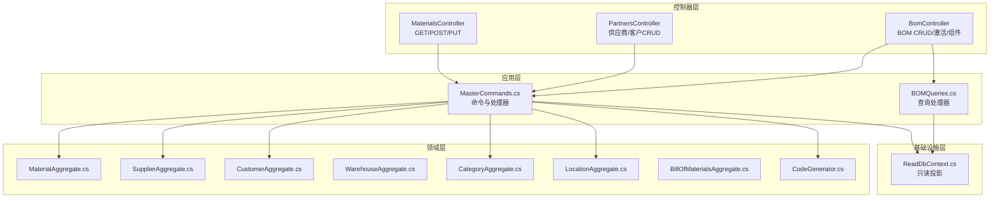
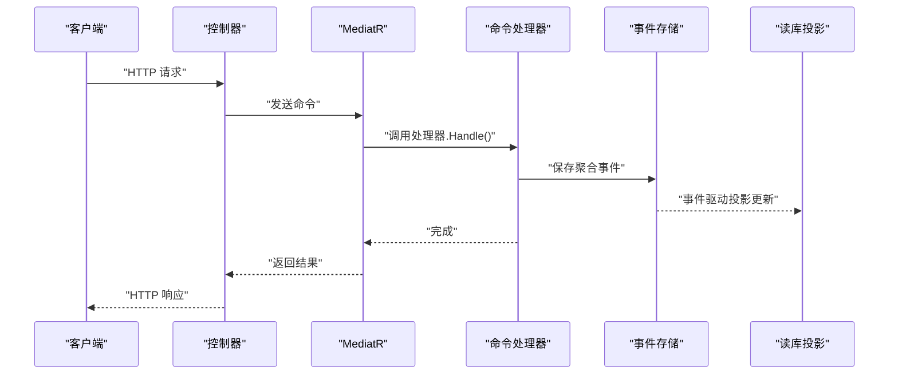
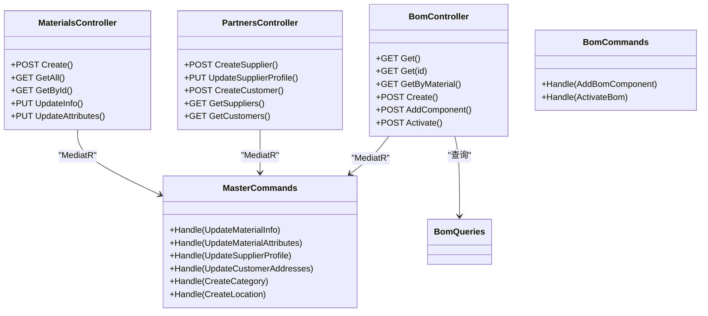

# 主数据服务API

<cite>
**本文引用的文件**
- [MasterControllers.cs](file://src/Services/MasterData/ErpSystem.MasterData/Controllers/MasterControllers.cs)
- [BOMController.cs](file://src/Services/MasterData/ErpSystem.MasterData/Controllers/BOMController.cs)
- [MasterCommands.cs](file://src/Services/MasterData/ErpSystem.MasterData/Application/MasterCommands.cs)
- [BOMCommands.cs](file://src/Services/MasterData/ErpSystem.MasterData/Application/BOMCommands.cs)
- [BOMQueries.cs](file://src/Services/MasterData/ErpSystem.MasterData/Application/BOMQueries.cs)
- [MaterialAggregate.cs](file://src/Services/MasterData/ErpSystem.MasterData/Domain/MaterialAggregate.cs)
- [SupplierAggregate.cs](file://src/Services/MasterData/ErpSystem.MasterData/Domain/SupplierAggregate.cs)
- [CustomerAggregate.cs](file://src/Services/MasterData/ErpSystem.MasterData/Domain/CustomerAggregate.cs)
- [WarehouseAggregate.cs](file://src/Services/MasterData/ErpSystem.MasterData/Domain/WarehouseAggregate.cs)
- [CategoryAggregate.cs](file://src/Services/MasterData/ErpSystem.MasterData/Domain/CategoryAggregate.cs)
- [LocationAggregate.cs](file://src/Services/MasterData/ErpSystem.MasterData/Domain/LocationAggregate.cs)
- [BillOfMaterialsAggregate.cs](file://src/Services/MasterData/ErpSystem.MasterData/Domain/BillOfMaterialsAggregate.cs)
- [ReadDbContext.cs](file://src/Services/MasterData/ErpSystem.MasterData/Infrastructure/ReadDbContext.cs)
- [CodeGenerator.cs](file://src/Services/MasterData/ErpSystem.MasterData/Domain/CodeGenerator.cs)
- [PRD-01-MasterData-Service.md](file://docs/PRD-01-MasterData-Service.md)
</cite>

## 目录
1. [简介](#简介)
2. [项目结构](#项目结构)
3. [核心组件](#核心组件)
4. [架构总览](#架构总览)
5. [详细组件分析](#详细组件分析)
6. [依赖分析](#依赖分析)
7. [性能考虑](#性能考虑)
8. [故障排查指南](#故障排查指南)
9. [结论](#结论)
10. [附录](#附录)

## 简介
本文件为“主数据服务”提供的REST API详细文档，覆盖物料管理、供应商管理、客户管理、仓库管理、BOM管理等核心领域。内容包含HTTP方法、URL模式、请求/响应结构、数据验证规则、CRUD操作语义、编码规则、分类体系与关联关系，并提供主数据同步、批量导入导出与数据一致性保障的使用示例与最佳实践。

## 项目结构
主数据服务采用分层架构：控制器层暴露REST API；应用层通过CQRS模式组织命令与查询；领域层实现聚合与不变式；基础设施层提供只读投影与读库上下文；代码生成器负责主数据编码规则。

图表来源
- [MasterControllers.cs](file://src/Services/MasterData/ErpSystem.MasterData/Controllers/MasterControllers.cs#L11-L78)
- [BOMController.cs](file://src/Services/MasterData/ErpSystem.MasterData/Controllers/BOMController.cs#L10-L53)
- [MasterCommands.cs](file://src/Services/MasterData/ErpSystem.MasterData/Application/MasterCommands.cs#L44-L109)
- [BOMQueries.cs](file://src/Services/MasterData/ErpSystem.MasterData/Application/BOMQueries.cs#L10-L40)
- [MaterialAggregate.cs](file://src/Services/MasterData/ErpSystem.MasterData/Domain/MaterialAggregate.cs#L84-L178)
- [SupplierAggregate.cs](file://src/Services/MasterData/ErpSystem.MasterData/Domain/SupplierAggregate.cs#L66-L125)
- [CustomerAggregate.cs](file://src/Services/MasterData/ErpSystem.MasterData/Domain/CustomerAggregate.cs#L46-L96)
- [WarehouseAggregate.cs](file://src/Services/MasterData/ErpSystem.MasterData/Domain/WarehouseAggregate.cs#L18-L44)
- [CategoryAggregate.cs](file://src/Services/MasterData/ErpSystem.MasterData/Domain/CategoryAggregate.cs#L27-L67)
- [LocationAggregate.cs](file://src/Services/MasterData/ErpSystem.MasterData/Domain/LocationAggregate.cs#L21-L49)
- [BillOfMaterialsAggregate.cs](file://src/Services/MasterData/ErpSystem.MasterData/Domain/BillOfMaterialsAggregate.cs#L55-L125)
- [ReadDbContext.cs](file://src/Services/MasterData/ErpSystem.MasterData/Infrastructure/ReadDbContext.cs#L5-L47)
- [CodeGenerator.cs](file://src/Services/MasterData/ErpSystem.MasterData/Domain/CodeGenerator.cs#L11-L22)

章节来源
- [MasterControllers.cs](file://src/Services/MasterData/ErpSystem.MasterData/Controllers/MasterControllers.cs#L1-L79)
- [BOMController.cs](file://src/Services/MasterData/ErpSystem.MasterData/Controllers/BOMController.cs#L1-L54)
- [ReadDbContext.cs](file://src/Services/MasterData/ErpSystem.MasterData/Infrastructure/ReadDbContext.cs#L1-L125)

## 核心组件
- 控制器层：暴露REST端点，路由到MediatR命令与查询。
- 应用层：定义命令、查询与处理器，协调事件存储与读库投影。
- 领域层：实现聚合根与不变式，定义领域事件与状态变迁。
- 基础设施层：EF Core只读上下文，映射JSON字段的读模型。
- 编码规则：统一的代码生成器，确保物料/供应商/客户/仓库编码唯一且可追溯。

章节来源
- [MasterCommands.cs](file://src/Services/MasterData/ErpSystem.MasterData/Application/MasterCommands.cs#L44-L109)
- [BOMCommands.cs](file://src/Services/MasterData/ErpSystem.MasterData/Application/BOMCommands.cs#L27-L48)
- [CodeGenerator.cs](file://src/Services/MasterData/ErpSystem.MasterData/Domain/CodeGenerator.cs#L3-L22)

## 架构总览
主数据服务遵循CQRS与事件溯源思想：写模型通过命令处理器应用到聚合，产生领域事件；读模型由事件投影生成，供查询使用。控制器仅负责编排，不直接访问数据库。

图表来源
- [MasterControllers.cs](file://src/Services/MasterData/ErpSystem.MasterData/Controllers/MasterControllers.cs#L13-L44)
- [BOMController.cs](file://src/Services/MasterData/ErpSystem.MasterData/Controllers/BOMController.cs#L32-L52)
- [MasterCommands.cs](file://src/Services/MasterData/ErpSystem.MasterData/Application/MasterCommands.cs#L44-L109)
- [BOMCommands.cs](file://src/Services/MasterData/ErpSystem.MasterData/Application/BOMCommands.cs#L27-L48)
- [ReadDbContext.cs](file://src/Services/MasterData/ErpSystem.MasterData/Infrastructure/ReadDbContext.cs#L15-L47)

## 详细组件分析

### 物料管理API
- 路由前缀：/api/v1/materials
- 支持操作：创建、查询列表、按ID查询、更新基础信息、更新属性
- 关键不变式：
  - 物料编码唯一，生成规则见“编码规则”
  - 类型不可变，需重建
  - 基础信息更新触发领域事件，记录历史
- 读模型字段（部分）：物料编码、名称、类型、单位、分类、成本明细、属性集合、是否启用、制造商、规格

章节来源
- [MasterControllers.cs](file://src/Services/MasterData/ErpSystem.MasterData/Controllers/MasterControllers.cs#L11-L45)
- [MaterialAggregate.cs](file://src/Services/MasterData/ErpSystem.MasterData/Domain/MaterialAggregate.cs#L84-L178)
- [ReadDbContext.cs](file://src/Services/MasterData/ErpSystem.MasterData/Infrastructure/ReadDbContext.cs#L51-L65)

#### 物料API定义
- POST /api/v1/materials
  - 请求体：CreateMaterialRequest（名称、类型、单位、分类、初始成本）
  - 响应：201 + Location指向新创建物料
- GET /api/v1/materials
  - 响应：物料列表（读模型）
- GET /api/v1/materials/{id}
  - 响应：指定物料（读模型），不存在返回404
- PUT /api/v1/materials/{id}/info
  - 请求体：UpdateMaterialInfoCommand（名称、描述、规格、品牌、制造商）
  - 校验：路径参数与命令中的物料ID一致
  - 响应：204
- PUT /api/v1/materials/{id}/attributes
  - 请求体：UpdateMaterialAttributesCommand（属性列表）
  - 校验：路径参数与命令中的物料ID一致
  - 响应：204

章节来源
- [MasterControllers.cs](file://src/Services/MasterData/ErpSystem.MasterData/Controllers/MasterControllers.cs#L13-L44)
- [MasterCommands.cs](file://src/Services/MasterData/ErpSystem.MasterData/Application/MasterCommands.cs#L9-L24)

### 供应商管理API
- 路由前缀：/api/v1/partners
- 支持操作：创建供应商、更新供应商档案、创建客户、查询供应商/客户列表
- 关键不变式：
  - 供应商联系人/银行账户支持多条，支持主联系人与默认账户
  - 黑名单状态与等级变更通过领域事件记录
- 读模型字段（部分）：编码、名称、类型、等级、黑名单标记、联系人JSON、银行账户JSON

章节来源
- [MasterControllers.cs](file://src/Services/MasterData/ErpSystem.MasterData/Controllers/MasterControllers.cs#L49-L78)
- [SupplierAggregate.cs](file://src/Services/MasterData/ErpSystem.MasterData/Domain/SupplierAggregate.cs#L66-L125)
- [ReadDbContext.cs](file://src/Services/MasterData/ErpSystem.MasterData/Infrastructure/ReadDbContext.cs#L76-L86)

#### 供应商API定义
- POST /api/v1/partners/suppliers
  - 请求体：CreateSupplierRequest（名称、类型、统一社会信用代码）
  - 响应：200 + 供应商ID
- PUT /api/v1/partners/suppliers/{id}/profile
  - 请求体：UpdateSupplierProfileCommand（联系人列表、银行账户列表）
  - 校验：路径参数与命令中的供应商ID一致
  - 响应：204
- POST /api/v1/partners/customers
  - 请求体：CreateCustomerRequest（名称、类型）
  - 响应：200 + 客户ID
- GET /api/v1/partners/suppliers
  - 响应：供应商列表（读模型）
- GET /api/v1/partners/customers
  - 响应：客户列表（读模型）

章节来源
- [MasterControllers.cs](file://src/Services/MasterData/ErpSystem.MasterData/Controllers/MasterControllers.cs#L51-L77)
- [MasterCommands.cs](file://src/Services/MasterData/ErpSystem.MasterData/Application/MasterCommands.cs#L28-L34)

### 客户管理API
- 路由前缀：/api/v1/partners
- 支持操作：创建客户、查询客户列表
- 关键不变式：
  - 收货地址支持多条，默认地址标识
  - 信用额度与账期变更通过领域事件记录
- 读模型字段（部分）：编码、名称、类型、信用额度、地址JSON

章节来源
- [MasterControllers.cs](file://src/Services/MasterData/ErpSystem.MasterData/Controllers/MasterControllers.cs#L66-L77)
- [CustomerAggregate.cs](file://src/Services/MasterData/ErpSystem.MasterData/Domain/CustomerAggregate.cs#L46-L96)
- [ReadDbContext.cs](file://src/Services/MasterData/ErpSystem.MasterData/Infrastructure/ReadDbContext.cs#L88-L96)

### 仓库与库位管理API
- 仓库：仓库聚合提供创建能力，读模型包含编码、名称、类型等
- 库位：库位聚合支持创建，读模型包含仓库ID、编码、名称、类型
- 说明：当前仓库与库位API未在控制器中显式暴露，但领域模型与读模型已就绪，便于后续扩展

章节来源
- [WarehouseAggregate.cs](file://src/Services/MasterData/ErpSystem.MasterData/Domain/WarehouseAggregate.cs#L18-L44)
- [LocationAggregate.cs](file://src/Services/MasterData/ErpSystem.MasterData/Domain/LocationAggregate.cs#L21-L49)
- [ReadDbContext.cs](file://src/Services/MasterData/ErpSystem.MasterData/Infrastructure/ReadDbContext.cs#L98-L113)

### BOM管理API
- 路由前缀：/api/bom
- 支持操作：查询全部BOM、按ID查询、按父物料查询、创建BOM、添加子项、激活BOM
- 关键不变式：
  - 仅草稿BOM可添加子项
  - 禁止自身作为自己的子项
  - 激活前必须至少有一个子项
  - 状态枚举：草稿/激活/作废

章节来源
- [BOMController.cs](file://src/Services/MasterData/ErpSystem.MasterData/Controllers/BOMController.cs#L10-L53)
- [BOMQueries.cs](file://src/Services/MasterData/ErpSystem.MasterData/Application/BOMQueries.cs#L10-L40)
- [BillOfMaterialsAggregate.cs](file://src/Services/MasterData/ErpSystem.MasterData/Domain/BillOfMaterialsAggregate.cs#L55-L125)

#### BOM API定义
- GET /api/bom
  - 响应：BOM列表（读模型）
- GET /api/bom/{id}
  - 响应：指定BOM（读模型），不存在返回404
- GET /api/bom/material/{materialId}
  - 响应：父物料对应的所有BOM（读模型）
- POST /api/bom
  - 请求体：CreateBomRequest（父物料ID、名称、版本、生效日期）
  - 响应：201 + Location指向新创建BOM
- POST /api/bom/{id}/components
  - 请求体：AddBomComponentCommand（BOM ID、子项物料ID、数量、备注）
  - 校验：路径参数与命令中的BOM ID一致
  - 响应：200
- POST /api/bom/{id}/activate
  - 响应：200

章节来源
- [BOMController.cs](file://src/Services/MasterData/ErpSystem.MasterData/Controllers/BOMController.cs#L12-L52)
- [BOMCommands.cs](file://src/Services/MasterData/ErpSystem.MasterData/Application/BOMCommands.cs#L9-L21)

### 编码规则与分类体系
- 编码规则（代码生成器）：
  - 物料：MAT-YYYYMMDD-XXXX
  - 供应商：SUP-YYYYMMDD-XXX
  - 客户：CUS-YYYYMMDD-XXX
  - 仓库：WH-XXX
- 分类体系：
  - 物料分类支持最多5级树形结构
  - 分类移动/合并受深度限制

章节来源
- [CodeGenerator.cs](file://src/Services/MasterData/ErpSystem.MasterData/Domain/CodeGenerator.cs#L11-L22)
- [CategoryAggregate.cs](file://src/Services/MasterData/ErpSystem.MasterData/Domain/CategoryAggregate.cs#L34-L47)
- [PRD-01-MasterData-Service.md](file://docs/PRD-01-MasterData-Service.md#L34-L52)

### 数据验证规则
- 物料
  - 编码唯一、类型不可变
  - 名称+规格在同分类下唯一
- 供应商
  - 统一社会信用代码唯一
  - 联系人/银行账户支持多条
- 客户
  - 地址支持多条，默认地址标识
- BOM
  - 仅草稿可添加子项
  - 禁止自引用
  - 激活前必须非空

章节来源
- [MaterialAggregate.cs](file://src/Services/MasterData/ErpSystem.MasterData/Domain/MaterialAggregate.cs#L116-L142)
- [SupplierAggregate.cs](file://src/Services/MasterData/ErpSystem.MasterData/Domain/SupplierAggregate.cs#L88-L91)
- [CustomerAggregate.cs](file://src/Services/MasterData/ErpSystem.MasterData/Domain/CustomerAggregate.cs#L70-L73)
- [BillOfMaterialsAggregate.cs](file://src/Services/MasterData/ErpSystem.MasterData/Domain/BillOfMaterialsAggregate.cs#L78-L96)

### 主数据同步、批量导入导出与一致性
- 同步机制
  - 写模型产生领域事件，读模型通过事件投影更新
  - 其他服务订阅事件实现数据同步
- 批量导入导出
  - 建议通过命令批量发送，结合幂等性与事务一致性
  - 导出采用读模型JSON格式，便于下游消费
- 一致性保障
  - 事件存储保证写入顺序与可追溯
  - 读模型字段使用JSONB存储复杂对象，查询时避免N+1

章节来源
- [MasterCommands.cs](file://src/Services/MasterData/ErpSystem.MasterData/Application/MasterCommands.cs#L44-L109)
- [ReadDbContext.cs](file://src/Services/MasterData/ErpSystem.MasterData/Infrastructure/ReadDbContext.cs#L15-L47)
- [PRD-01-MasterData-Service.md](file://docs/PRD-01-MasterData-Service.md#L720-L739)

## 依赖分析

图表来源
- [MasterControllers.cs](file://src/Services/MasterData/ErpSystem.MasterData/Controllers/MasterControllers.cs#L11-L78)
- [BOMController.cs](file://src/Services/MasterData/ErpSystem.MasterData/Controllers/BOMController.cs#L10-L53)
- [MasterCommands.cs](file://src/Services/MasterData/ErpSystem.MasterData/Application/MasterCommands.cs#L44-L109)
- [BOMCommands.cs](file://src/Services/MasterData/ErpSystem.MasterData/Application/BOMCommands.cs#L27-L48)

## 性能考虑
- 查询性能
  - 使用只读上下文与投影表，避免跨服务JOIN
  - JSONB字段按需查询，避免SELECT *
- 写入性能
  - 事件存储顺序写，降低锁竞争
  - 批量命令通过队列异步处理
- 缓存策略
  - 对热点字典（单位、分类、类型）进行缓存
  - 读模型定期刷新，避免陈旧数据

## 故障排查指南
- 400错误
  - 路径ID与命令ID不一致
  - BOM状态不允许添加子项
- 404错误
  - 查询不存在的物料/BOM
- 409/冲突
  - 编码重复（物料/供应商）
  - BOM自引用或激活前为空
- 日志与审计
  - 检查领域事件是否正确发布
  - 核对读模型投影是否更新成功

章节来源
- [MasterControllers.cs](file://src/Services/MasterData/ErpSystem.MasterData/Controllers/MasterControllers.cs#L33-L43)
- [BOMController.cs](file://src/Services/MasterData/ErpSystem.MasterData/Controllers/BOMController.cs#L42-L51)
- [BOMCommands.cs](file://src/Services/MasterData/ErpSystem.MasterData/Application/BOMCommands.cs#L34-L47)

## 结论
主数据服务通过清晰的分层与CQRS架构，提供了稳定、可扩展的主数据管理能力。物料、供应商、客户、仓库与BOM的API覆盖了核心业务场景，配合事件驱动的读模型与严格的领域不变式，能够满足企业主数据的一致性与可追溯性要求。建议在生产环境中结合幂等性、批量处理与监控告警，进一步提升可靠性与可观测性。

## 附录

### API使用示例（概念性）
- 创建物料
  - POST /api/v1/materials
  - 请求体包含名称、类型、单位、分类、初始成本
  - 成功返回201，Location指向新ID
- 添加BOM子项
  - POST /api/bom/{id}/components
  - 请求体包含子项物料ID、数量、备注
  - 成功返回200
- 激活BOM
  - POST /api/bom/{id}/activate
  - 成功返回200

章节来源
- [MasterControllers.cs](file://src/Services/MasterData/ErpSystem.MasterData/Controllers/MasterControllers.cs#L13-L18)
- [BOMController.cs](file://src/Services/MasterData/ErpSystem.MasterData/Controllers/BOMController.cs#L39-L52)