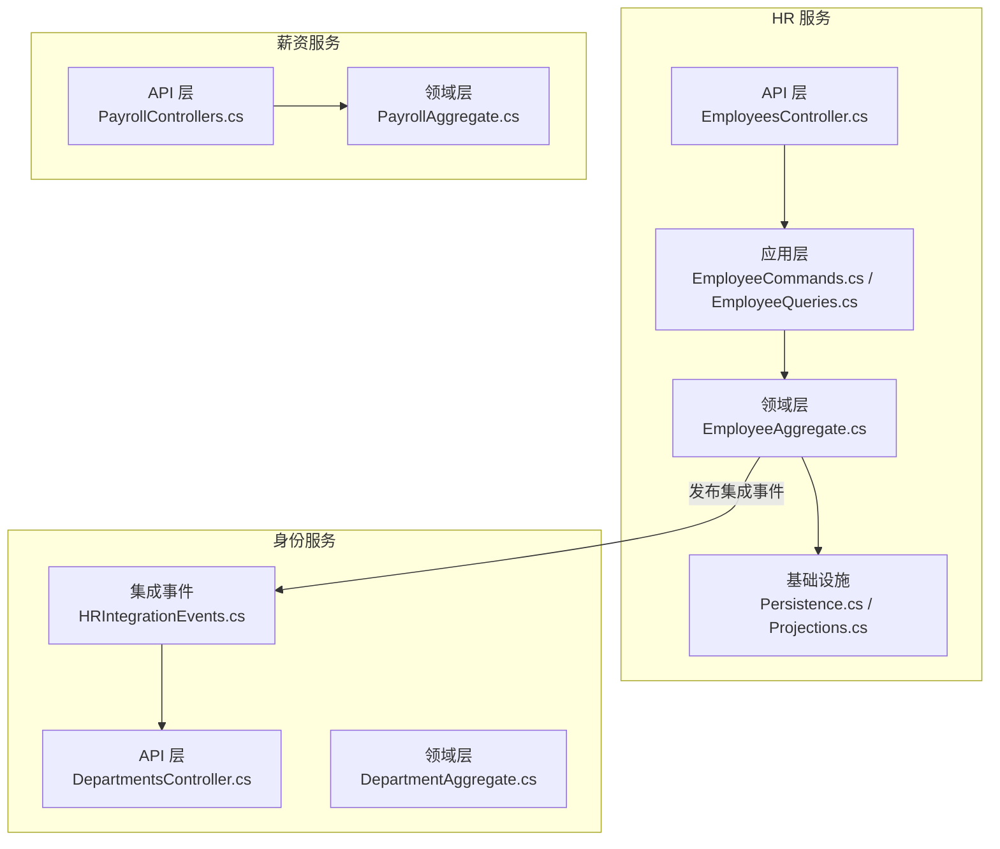
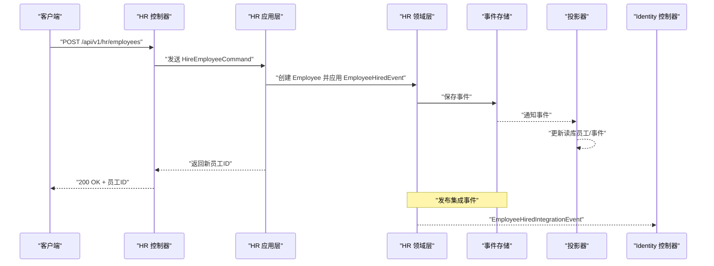
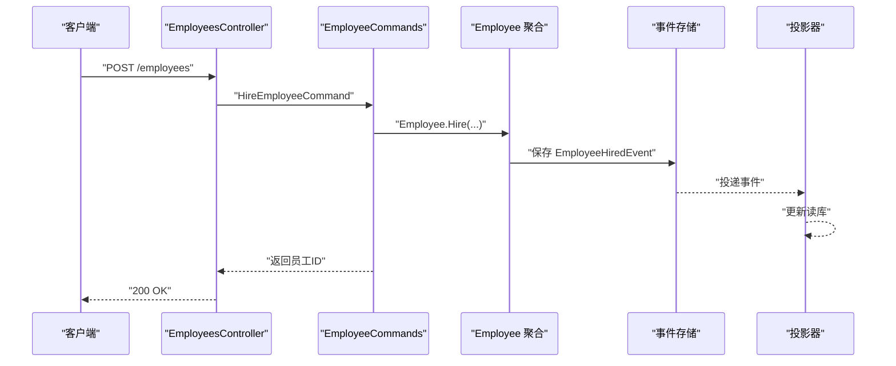
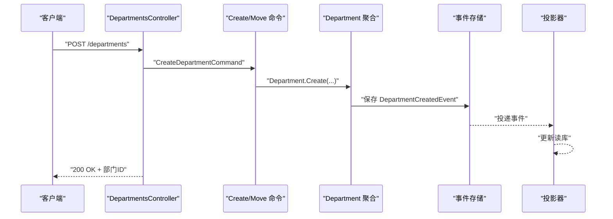
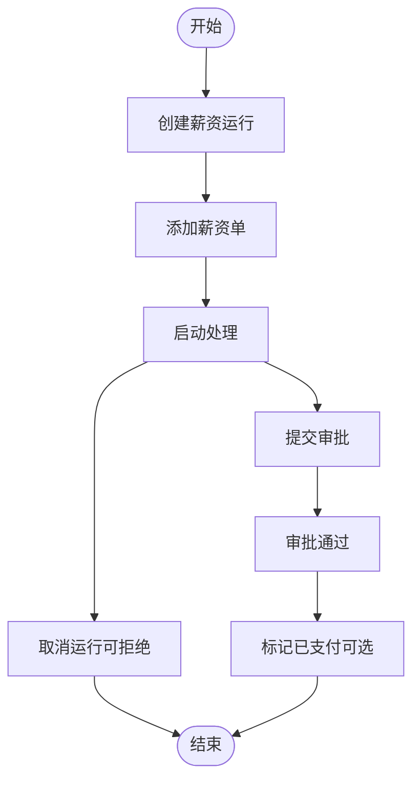
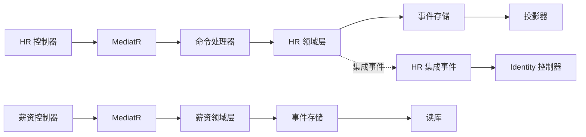

# 人力资源服务API

<cite>
**本文档引用的文件**
- [EmployeesController.cs](file://src/Services/HR/ErpSystem.HR/API/EmployeesController.cs)
- [EmployeeCommands.cs](file://src/Services/HR/ErpSystem.HR/Application/EmployeeCommands.cs)
- [EmployeeQueries.cs](file://src/Services/HR/ErpSystem.HR/Application/EmployeeQueries.cs)
- [EmployeeAggregate.cs](file://src/Services/HR/ErpSystem.HR/Domain/EmployeeAggregate.cs)
- [Persistence.cs](file://src/Services/HR/ErpSystem.HR/Infrastructure/Persistence.cs)
- [Projections.cs](file://src/Services/HR/ErpSystem.HR/Infrastructure/Projections.cs)
- [Program.cs（HR）](file://src/Services/HR/ErpSystem.HR/Program.cs)
- [PayrollControllers.cs](file://src/Services/Payroll/ErpSystem.Payroll/API/PayrollControllers.cs)
- [PayrollAggregate.cs](file://src/Services/Payroll/ErpSystem.Payroll/Domain/PayrollAggregate.cs)
- [Program.cs（Payroll）](file://src/Services/Payroll/ErpSystem.Payroll/Program.cs)
- [DepartmentsController.cs](file://src/Services/Identity/ErpSystem.Identity/API/DepartmentsController.cs)
- [DepartmentAggregate.cs](file://src/Services/Identity/ErpSystem.Identity/Domain/DepartmentAggregate.cs)
- [HRIntegrationEvents.cs](file://src/Services/Identity/ErpSystem.Identity/Application/IntegrationEvents/HRIntegrationEvents.cs)
</cite>

## 目录
1. [简介](#简介)
2. [项目结构](#项目结构)
3. [核心组件](#核心组件)
4. [架构总览](#架构总览)
5. [详细组件分析](#详细组件分析)
6. [依赖关系分析](#依赖关系分析)
7. [性能考虑](#性能考虑)
8. [故障排除指南](#故障排除指南)
9. [结论](#结论)
10. [附录：API使用示例](#附录api使用示例)

## 简介
本文件为 ERP 微服务系统中“人力资源服务”提供的完整 API 文档，覆盖员工管理、组织架构与薪资计算三大领域。内容包含：
- 员工生命周期管理：入职、查询、检索、部门调动、晋升、离职及事件审计
- 组织架构管理：部门创建、树形移动
- 薪资结构与薪资发放：薪资结构定义、组件与扣款、薪资月度运行、薪资单查询与统计
- 数据模型与事件驱动架构：基于事件溯源与读库投影的实现方式
- 使用示例与最佳实践：帮助快速集成与排障

## 项目结构
人力资源服务由以下模块组成：
- API 层：暴露 REST 接口（员工、薪资、薪资单）
- 应用层：命令与查询（CQRS），封装业务流程
- 领域层：聚合与领域事件（员工、薪资结构、薪资运行、薪资单）
- 基础设施层：事件存储、读库投影、EF Core 模型
- 集成事件：与身份服务（Identity）的集成事件（入职、离职）

**图表来源**
- [EmployeesController.cs](file://src/Services/HR/ErpSystem.HR/API/EmployeesController.cs#L1-L48)
- [EmployeeCommands.cs](file://src/Services/HR/ErpSystem.HR/Application/EmployeeCommands.cs#L1-L112)
- [EmployeeAggregate.cs](file://src/Services/HR/ErpSystem.HR/Domain/EmployeeAggregate.cs#L1-L151)
- [Persistence.cs](file://src/Services/HR/ErpSystem.HR/Infrastructure/Persistence.cs#L1-L64)
- [Projections.cs](file://src/Services/HR/ErpSystem.HR/Infrastructure/Projections.cs#L1-L125)
- [PayrollControllers.cs](file://src/Services/Payroll/ErpSystem.Payroll/API/PayrollControllers.cs#L1-L278)
- [PayrollAggregate.cs](file://src/Services/Payroll/ErpSystem.Payroll/Domain/PayrollAggregate.cs#L1-L429)
- [HRIntegrationEvents.cs](file://src/Services/Identity/ErpSystem.Identity/Application/IntegrationEvents/HRIntegrationEvents.cs#L1-L22)
- [DepartmentsController.cs](file://src/Services/Identity/ErpSystem.Identity/API/DepartmentsController.cs#L1-L37)
- [DepartmentAggregate.cs](file://src/Services/Identity/ErpSystem.Identity/Domain/DepartmentAggregate.cs#L1-L56)

**章节来源**
- [Program.cs（HR）](file://src/Services/HR/ErpSystem.HR/Program.cs#L1-L72)
- [Program.cs（Payroll）](file://src/Services/Payroll/ErpSystem.Payroll/Program.cs#L1-L45)

## 核心组件
- 员工聚合与事件：负责员工状态变更（入职、调动、晋升、离职）与领域事件发布
- 事件存储与读库：事件溯源持久化 + 投影生成只读视图
- CQRS 查询：支持按条件分页检索、事件历史查询
- 集成事件：向身份服务发布入职/离职事件，触发账户创建/禁用
- 薪资结构与薪资运行：薪资结构定义、组件/扣款、薪资月度运行、薪资单生成与审批

**章节来源**
- [EmployeeAggregate.cs](file://src/Services/HR/ErpSystem.HR/Domain/EmployeeAggregate.cs#L1-L151)
- [Persistence.cs](file://src/Services/HR/ErpSystem.HR/Infrastructure/Persistence.cs#L1-L64)
- [Projections.cs](file://src/Services/HR/ErpSystem.HR/Infrastructure/Projections.cs#L1-L125)
- [EmployeeQueries.cs](file://src/Services/HR/ErpSystem.HR/Application/EmployeeQueries.cs#L1-L44)
- [HRIntegrationEvents.cs](file://src/Services/Identity/ErpSystem.Identity/Application/IntegrationEvents/HRIntegrationEvents.cs#L1-L22)
- [PayrollAggregate.cs](file://src/Services/Payroll/ErpSystem.Payroll/Domain/PayrollAggregate.cs#L1-L429)

## 架构总览
HR 服务采用事件驱动架构：
- 写模型：命令处理器执行业务规则，产生领域事件，写入事件存储
- 读模型：投影器监听事件，更新只读数据库（员工、事件历史）
- API 层：控制器通过 MediatR 发送命令/查询，返回结果
- 集成：HR 向 Identity 发布入职/离职事件，触发用户账户生命周期同步

**图表来源**
- [EmployeesController.cs](file://src/Services/HR/ErpSystem.HR/API/EmployeesController.cs#L1-L48)
- [EmployeeCommands.cs](file://src/Services/HR/ErpSystem.HR/Application/EmployeeCommands.cs#L1-L112)
- [EmployeeAggregate.cs](file://src/Services/HR/ErpSystem.HR/Domain/EmployeeAggregate.cs#L1-L151)
- [Projections.cs](file://src/Services/HR/ErpSystem.HR/Infrastructure/Projections.cs#L1-L125)
- [HRIntegrationEvents.cs](file://src/Services/Identity/ErpSystem.Identity/Application/IntegrationEvents/HRIntegrationEvents.cs#L1-L22)

## 详细组件分析

### 员工管理 API
- 基础路径：/api/v1/hr/employees
- 支持操作：
  - 入职：POST /api/v1/hr/employees
  - 查询单个：GET /api/v1/hr/employees/{id}
  - 搜索：GET /api/v1/hr/employees?fullName=&departmentId=&status=&page=
  - 部门调动：POST /api/v1/hr/employees/{id}/transfer
  - 晋升：POST /api/v1/hr/employees/{id}/promote
  - 离职：POST /api/v1/hr/employees/{id}/terminate
  - 事件历史：GET /api/v1/hr/employees/{id}/events

请求/响应要点：
- 入职：请求体包含员工基础信息、雇佣类型、所属公司/部门/岗位、成本中心、邮箱等；返回新员工ID
- 调动/晋升/离职：请求体包含生效日期与原因；成功返回布尔值
- 搜索：支持姓名模糊匹配、部门过滤、状态过滤、分页参数
- 事件历史：返回该员工的事件列表（含时间戳与描述）

**图表来源**
- [EmployeesController.cs](file://src/Services/HR/ErpSystem.HR/API/EmployeesController.cs#L1-L48)
- [EmployeeCommands.cs](file://src/Services/HR/ErpSystem.HR/Application/EmployeeCommands.cs#L1-L112)
- [EmployeeAggregate.cs](file://src/Services/HR/ErpSystem.HR/Domain/EmployeeAggregate.cs#L1-L151)
- [Projections.cs](file://src/Services/HR/ErpSystem.HR/Infrastructure/Projections.cs#L1-L125)

**章节来源**
- [EmployeesController.cs](file://src/Services/HR/ErpSystem.HR/API/EmployeesController.cs#L1-L48)
- [EmployeeCommands.cs](file://src/Services/HR/ErpSystem.HR/Application/EmployeeCommands.cs#L1-L112)
- [EmployeeQueries.cs](file://src/Services/HR/ErpSystem.HR/Application/EmployeeQueries.cs#L1-L44)
- [EmployeeAggregate.cs](file://src/Services/HR/ErpSystem.HR/Domain/EmployeeAggregate.cs#L1-L151)
- [Persistence.cs](file://src/Services/HR/ErpSystem.HR/Infrastructure/Persistence.cs#L1-L64)
- [Projections.cs](file://src/Services/HR/ErpSystem.HR/Infrastructure/Projections.cs#L1-L125)

### 组织架构 API
- 基础路径：/api/v1/identity/departments
- 支持操作：
  - 创建部门：POST /api/v1/identity/departments
  - 获取全部（平面）：GET /api/v1/identity/departments
  - 移动部门（树形调整）：POST /api/v1/identity/departments/{id}/move

说明：
- 返回平面列表，客户端可依据 ParentId 重建树形结构
- 移动部门时需校验路径一致性（请求体中的部门ID与路径参数一致）

**图表来源**
- [DepartmentsController.cs](file://src/Services/Identity/ErpSystem.Identity/API/DepartmentsController.cs#L1-L37)
- [DepartmentAggregate.cs](file://src/Services/Identity/ErpSystem.Identity/Domain/DepartmentAggregate.cs#L1-L56)

**章节来源**
- [DepartmentsController.cs](file://src/Services/Identity/ErpSystem.Identity/API/DepartmentsController.cs#L1-L37)
- [DepartmentAggregate.cs](file://src/Services/Identity/ErpSystem.Identity/Domain/DepartmentAggregate.cs#L1-L56)

### 薪资结构与薪资运行 API
- 薪资结构（Salary Structures）
  - GET /api/v1/payroll/salary-structures?isActive=（可选）
  - GET /api/v1/payroll/salary-structures/{id}
  - POST /api/v1/payroll/salary-structures
  - POST /api/v1/payroll/salary-structures/{id}/components
  - POST /api/v1/payroll/salary-structures/{id}/deductions

- 薪资运行（Payroll Runs）
  - GET /api/v1/payroll/payroll-runs?year=&month=&status=
  - GET /api/v1/payroll/payroll-runs/{id}
  - POST /api/v1/payroll/payroll-runs
  - POST /api/v1/payroll/payroll-runs/{id}/payslips
  - POST /api/v1/payroll/payroll-runs/{id}/start-processing
  - POST /api/v1/payroll/payroll-runs/{id}/submit
  - POST /api/v1/payroll/payroll-runs/{id}/approve
  - POST /api/v1/payroll/payroll-runs/{id}/cancel
  - GET /api/v1/payroll/payroll-runs/statistics?year=

- 薪资单（Payslips）
  - GET /api/v1/payroll/payslips?payrollRunId=&employeeId=&year=&month=
  - GET /api/v1/payroll/payslips/{id}
  - GET /api/v1/payroll/payslips/employee/{employeeId}?year=
  
关键流程：
- 创建薪资结构：设置名称、基本工资、币种、描述；可追加组件与扣款
- 创建薪资运行：生成运行号、年月、付款日期、描述；后续添加薪资单
- 启动处理/提交/审批/取消：严格的状态机控制
- 薪资单：按员工维度生成，支持按运行或员工查询与统计

**图表来源**
- [PayrollControllers.cs](file://src/Services/Payroll/ErpSystem.Payroll/API/PayrollControllers.cs#L1-L278)
- [PayrollAggregate.cs](file://src/Services/Payroll/ErpSystem.Payroll/Domain/PayrollAggregate.cs#L1-L429)

**章节来源**
- [PayrollControllers.cs](file://src/Services/Payroll/ErpSystem.Payroll/API/PayrollControllers.cs#L1-L278)
- [PayrollAggregate.cs](file://src/Services/Payroll/ErpSystem.Payroll/Domain/PayrollAggregate.cs#L1-L429)

## 依赖关系分析
- HR 服务依赖事件总线与 MediatR 实现命令/查询分发
- 事件存储负责事件溯源，投影器将事件转换为读库视图
- 薪资服务同样采用事件存储与读库投影
- HR 通过集成事件与 Identity 服务交互，实现账户生命周期联动

**图表来源**
- [Program.cs（HR）](file://src/Services/HR/ErpSystem.HR/Program.cs#L1-L72)
- [Program.cs（Payroll）](file://src/Services/Payroll/ErpSystem.Payroll/Program.cs#L1-L45)
- [Projections.cs](file://src/Services/HR/ErpSystem.HR/Infrastructure/Projections.cs#L1-L125)
- [HRIntegrationEvents.cs](file://src/Services/Identity/ErpSystem.Identity/Application/IntegrationEvents/HRIntegrationEvents.cs#L1-L22)

**章节来源**
- [Program.cs（HR）](file://src/Services/HR/ErpSystem.HR/Program.cs#L1-L72)
- [Program.cs（Payroll）](file://src/Services/Payroll/ErpSystem.Payroll/Program.cs#L1-L45)

## 性能考虑
- 分页与筛选：员工搜索支持分页与多条件过滤，建议在高基数场景下配合索引优化
- 事件投影：读库更新在事件到达后异步进行，写路径无阻塞
- 薪资运行状态机：严格的前置检查避免无效操作，减少回滚成本
- 连接池与数据库：确保连接字符串配置合理，生产环境启用连接复用与超时策略

## 故障排除指南
- 员工不存在：命令处理器在加载聚合失败时抛出异常，调用方应处理 404 场景
- 状态非法：如对已离职员工执行调动/晋升，或对非草稿运行执行某些操作，会抛出异常
- 集成事件未到达：检查事件总线配置与订阅，确认事件序列化类型映射正确
- 数据库未初始化：开发环境可通过程序入口自动创建数据库，生产环境请使用迁移脚本

**章节来源**
- [EmployeeCommands.cs](file://src/Services/HR/ErpSystem.HR/Application/EmployeeCommands.cs#L1-L112)
- [PayrollAggregate.cs](file://src/Services/Payroll/ErpSystem.Payroll/Domain/PayrollAggregate.cs#L1-L429)
- [Program.cs（HR）](file://src/Services/HR/ErpSystem.HR/Program.cs#L1-L72)
- [Program.cs（Payroll）](file://src/Services/Payroll/ErpSystem.Payroll/Program.cs#L1-L45)

## 结论
本 API 文档覆盖了 HR 服务的核心能力：员工全生命周期管理、组织架构维护、薪资结构与薪资运行。通过事件驱动架构，系统实现了高内聚、低耦合的数据一致性与可观测性。建议在生产环境中结合监控与告警，持续优化查询与事件处理性能。

## 附录：API使用示例
以下示例仅给出请求路径与关键字段说明，便于快速集成与测试。

- 员工入职
  - 方法与路径：POST /api/v1/hr/employees
  - 请求体字段：fullName, gender, dateOfBirth, idType, idNumber, hireDate, employmentType, companyId, departmentId, positionId, managerEmployeeId, costCenterId, email
  - 成功响应：返回新员工ID

- 员工查询与搜索
  - 单个查询：GET /api/v1/hr/employees/{id}
  - 搜索：GET /api/v1/hr/employees?fullName=&departmentId=&status=&page=
  - 事件历史：GET /api/v1/hr/employees/{id}/events

- 员工异动
  - 调动：POST /api/v1/hr/employees/{id}/transfer（请求体含 toDepartmentId, toPositionId, effectiveDate, reason）
  - 晋升：POST /api/v1/hr/employees/{id}/promote（请求体含 toPositionId, effectiveDate, reason）
  - 离职：POST /api/v1/hr/employees/{id}/terminate（请求体含 terminationDate, reason, note）

- 薪资结构
  - 创建结构：POST /api/v1/payroll/salary-structures（请求体含 name, baseSalary, currency, description）
  - 添加组件：POST /api/v1/payroll/salary-structures/{id}/components（请求体含 name, type, amount, isPercentage, isTaxable）
  - 添加扣款：POST /api/v1/payroll/salary-structures/{id}/deductions（请求体含 name, type, amount, isPercentage）

- 薪资运行
  - 创建运行：POST /api/v1/payroll/payroll-runs（请求体含 year, month, paymentDate, description）
  - 添加薪资单：POST /api/v1/payroll/payroll-runs/{id}/payslips（请求体含 employeeId, employeeName, grossAmount, totalDeductions）
  - 流程控制：POST /api/v1/payroll/payroll-runs/{id}/start-processing, submit, approve, cancel
  - 统计：GET /api/v1/payroll/payroll-runs/statistics?year=

- 薪资单查询
  - GET /api/v1/payroll/payslips?payrollRunId=&employeeId=&year=&month=
  - GET /api/v1/payroll/payslips/{id}
  - GET /api/v1/payroll/payslips/employee/{employeeId}?year=

**章节来源**
- [EmployeesController.cs](file://src/Services/HR/ErpSystem.HR/API/EmployeesController.cs#L1-L48)
- [PayrollControllers.cs](file://src/Services/Payroll/ErpSystem.Payroll/API/PayrollControllers.cs#L1-L278)