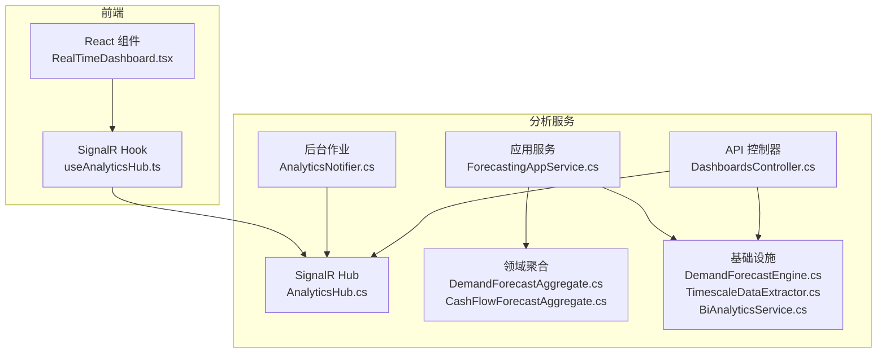
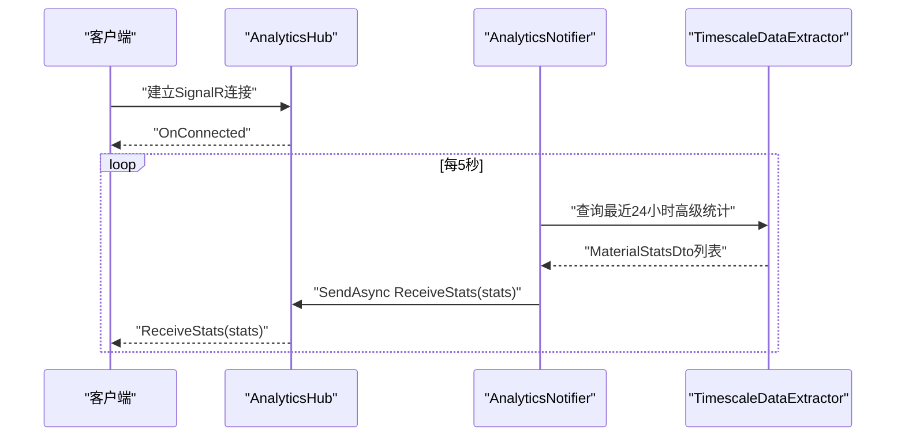
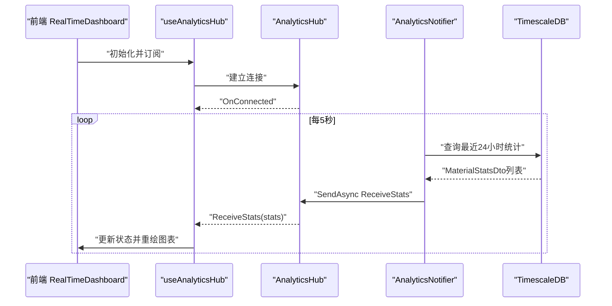
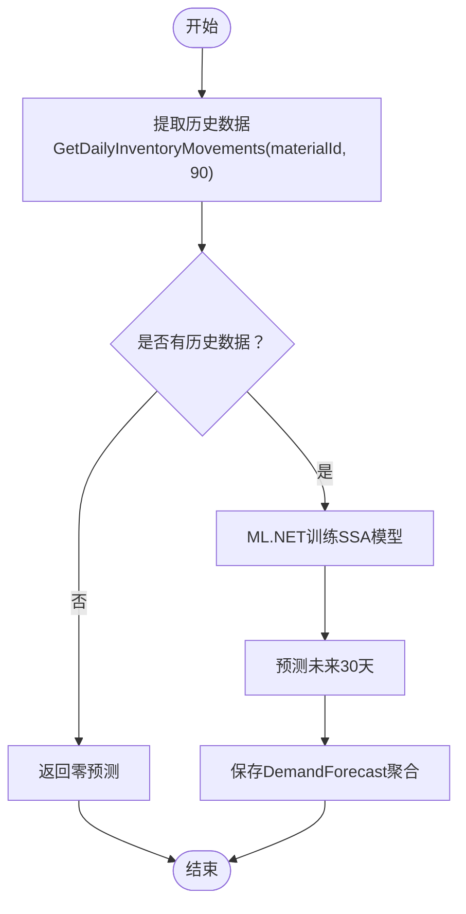
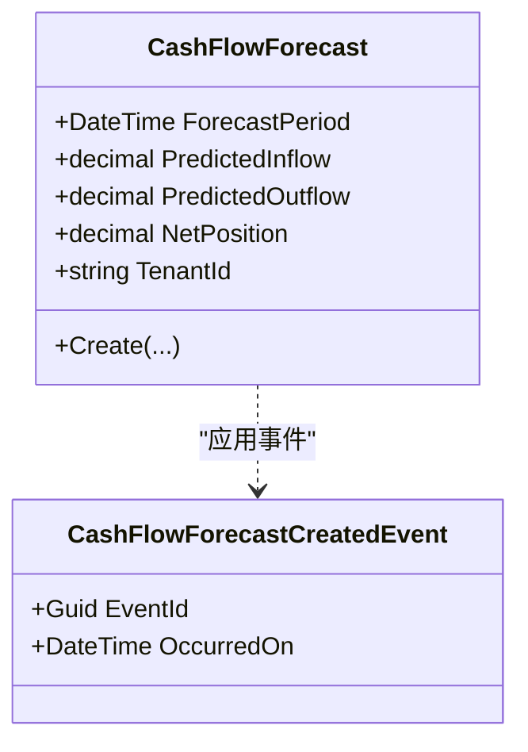
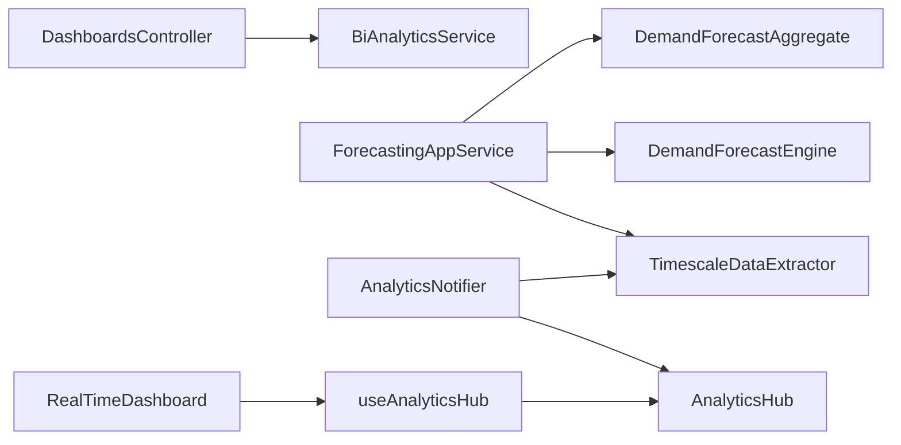

# 分析服务API

<cite>
**本文档引用的文件**
- [DashboardsController.cs](file://src/Services/Analytics/ErpSystem.Analytics/API/DashboardsController.cs)
- [AnalyticsHub.cs](file://src/Services/Analytics/ErpSystem.Analytics/API/Hubs/AnalyticsHub.cs)
- [ForecastingAppService.cs](file://src/Services/Analytics/ErpSystem.Analytics/Application/ForecastingAppService.cs)
- [Program.cs](file://src/Services/Analytics/ErpSystem.Analytics/Program.cs)
- [appsettings.json](file://src/Services/Analytics/ErpSystem.Analytics/appsettings.json)
- [CashFlowForecastAggregate.cs](file://src/Services/Analytics/ErpSystem.Analytics/Domain/CashFlowForecastAggregate.cs)
- [DemandForecastAggregate.cs](file://src/Services/Analytics/ErpSystem.Analytics/Domain/DemandForecastAggregate.cs)
- [DemandForecastEngine.cs](file://src/Services/Analytics/ErpSystem.Analytics/Infrastructure/DemandForecastEngine.cs)
- [TimescaleDataExtractor.cs](file://src/Services/Analytics/ErpSystem.Analytics/Infrastructure/TimescaleDataExtractor.cs)
- [BiAnalyticsService.cs](file://src/Services/Analytics/ErpSystem.Analytics/Infrastructure/BiAnalyticsService.cs)
- [AnalyticsNotifier.cs](file://src/Services/Analytics/ErpSystem.Analytics/Infrastructure/BackgroundJobs/AnalyticsNotifier.cs)
- [useAnalyticsHub.ts](file://src/Web/ErpSystem.Web/src/hooks/useAnalyticsHub.ts)
- [RealTimeDashboard.tsx](file://src/Web/ErpSystem.Web/src/components/RealTimeDashboard.tsx)
- [PredictiveAnalyticsTests.cs](file://src/Tests/ErpSystem.IntegrationTests/Analytics/PredictiveAnalyticsTests.cs)
</cite>

## 目录
1. [简介](#简介)
2. [项目结构](#项目结构)
3. [核心组件](#核心组件)
4. [架构总览](#架构总览)
5. [详细组件分析](#详细组件分析)
6. [依赖关系分析](#依赖关系分析)
7. [性能考虑](#性能考虑)
8. [故障排除指南](#故障排除指南)
9. [结论](#结论)
10. [附录](#附录)

## 简介
本文件为分析服务的完整API文档，覆盖以下能力：
- 实时分析：通过SignalR推送库存实时统计（每5秒一次）
- 预测分析：基于ML.NET的需求预测与现金流预测
- 仪表板：库存周转率、设备综合效率(OEE)等BI指标查询
- 历史数据分析：从TimescaleDB提取时间序列数据进行建模与展示

文档包含REST API与WebSocket接口定义、请求/响应模式、实时通信协议细节，并提供实际调用示例与最佳实践。

## 项目结构
分析服务采用分层架构，包含API控制器、应用服务、领域聚合、基础设施（含ML引擎、数据提取器、SignalR）以及前端集成。

图表来源
- [DashboardsController.cs](file://src/Services/Analytics/ErpSystem.Analytics/API/DashboardsController.cs#L1-L26)
- [AnalyticsHub.cs](file://src/Services/Analytics/ErpSystem.Analytics/API/Hubs/AnalyticsHub.cs#L1-L13)
- [ForecastingAppService.cs](file://src/Services/Analytics/ErpSystem.Analytics/Application/ForecastingAppService.cs#L1-L42)
- [DemandForecastAggregate.cs](file://src/Services/Analytics/ErpSystem.Analytics/Domain/DemandForecastAggregate.cs#L1-L69)
- [CashFlowForecastAggregate.cs](file://src/Services/Analytics/ErpSystem.Analytics/Domain/CashFlowForecastAggregate.cs#L1-L60)
- [DemandForecastEngine.cs](file://src/Services/Analytics/ErpSystem.Analytics/Infrastructure/DemandForecastEngine.cs#L1-L62)
- [TimescaleDataExtractor.cs](file://src/Services/Analytics/ErpSystem.Analytics/Infrastructure/TimescaleDataExtractor.cs#L1-L142)
- [BiAnalyticsService.cs](file://src/Services/Analytics/ErpSystem.Analytics/Infrastructure/BiAnalyticsService.cs#L1-L93)
- [AnalyticsNotifier.cs](file://src/Services/Analytics/ErpSystem.Analytics/Infrastructure/BackgroundJobs/AnalyticsNotifier.cs#L1-L38)
- [RealTimeDashboard.tsx](file://src/Web/ErpSystem.Web/src/components/RealTimeDashboard.tsx#L1-L47)
- [useAnalyticsHub.ts](file://src/Web/ErpSystem.Web/src/hooks/useAnalyticsHub.ts#L1-L51)

章节来源
- [Program.cs](file://src/Services/Analytics/ErpSystem.Analytics/Program.cs#L1-L83)
- [appsettings.json](file://src/Services/Analytics/ErpSystem.Analytics/appsettings.json#L1-L12)

## 核心组件
- REST API控制器：提供BI仪表板查询接口
- 应用服务：协调预测任务（历史数据提取、ML预测、事件存储）
- 领域聚合：需求预测与现金流预测的聚合根
- 基础设施：ML.NET预测引擎、TimescaleDB数据提取器、BI查询服务
- SignalR Hub：实时推送库存统计
- 后台作业：周期性抓取实时统计并广播

章节来源
- [DashboardsController.cs](file://src/Services/Analytics/ErpSystem.Analytics/API/DashboardsController.cs#L1-L26)
- [ForecastingAppService.cs](file://src/Services/Analytics/ErpSystem.Analytics/Application/ForecastingAppService.cs#L1-L42)
- [DemandForecastAggregate.cs](file://src/Services/Analytics/ErpSystem.Analytics/Domain/DemandForecastAggregate.cs#L1-L69)
- [CashFlowForecastAggregate.cs](file://src/Services/Analytics/ErpSystem.Analytics/Domain/CashFlowForecastAggregate.cs#L1-L60)
- [DemandForecastEngine.cs](file://src/Services/Analytics/ErpSystem.Analytics/Infrastructure/DemandForecastEngine.cs#L1-L62)
- [TimescaleDataExtractor.cs](file://src/Services/Analytics/ErpSystem.Analytics/Infrastructure/TimescaleDataExtractor.cs#L1-L142)
- [BiAnalyticsService.cs](file://src/Services/Analytics/ErpSystem.Analytics/Infrastructure/BiAnalyticsService.cs#L1-L93)
- [AnalyticsHub.cs](file://src/Services/Analytics/ErpSystem.Analytics/API/Hubs/AnalyticsHub.cs#L1-L13)
- [AnalyticsNotifier.cs](file://src/Services/Analytics/ErpSystem.Analytics/Infrastructure/BackgroundJobs/AnalyticsNotifier.cs#L1-L38)

## 架构总览
分析服务通过SignalR实现实时推送，通过REST API提供历史分析与BI查询，应用服务协调预测流程并将结果持久化为事件聚合。

图表来源
- [AnalyticsHub.cs](file://src/Services/Analytics/ErpSystem.Analytics/API/Hubs/AnalyticsHub.cs#L1-L13)
- [AnalyticsNotifier.cs](file://src/Services/Analytics/ErpSystem.Analytics/Infrastructure/BackgroundJobs/AnalyticsNotifier.cs#L1-L38)
- [TimescaleDataExtractor.cs](file://src/Services/Analytics/ErpSystem.Analytics/Infrastructure/TimescaleDataExtractor.cs#L88-L131)

## 详细组件分析

### REST API：仪表板与BI查询
- 路由前缀：`/api/v1/Dashboards`
- 认证：默认使用租户标识（当前示例中为固定值，建议从上下文或Header注入）

1) GET /api/v1/Dashboards/inventory-turnover
- 功能：计算库存周转率（COGS/平均库存）
- 查询参数：
  - days: 整数，默认30天
- 请求头：无特殊要求
- 成功响应：数组，元素包含材料ID、COGS、平均库存值、周转率
- 失败响应：标准错误码

2) GET /api/v1/Dashboards/oee
- 功能：返回设备OEE指标（可用性、性能、质量、总OEE）
- 查询参数：无
- 成功响应：数组，元素为设备ID及各项指标
- 失败响应：标准错误码

章节来源
- [DashboardsController.cs](file://src/Services/Analytics/ErpSystem.Analytics/API/DashboardsController.cs#L1-L26)
- [BiAnalyticsService.cs](file://src/Services/Analytics/ErpSystem.Analytics/Infrastructure/BiAnalyticsService.cs#L16-L87)

### WebSocket：实时分析（SignalR）
- Hub路径：`/hubs/analytics`
- 连接建立：前端通过`useAnalyticsHub`自动重连
- 事件名：`ReceiveStats`
- 推送内容：MaterialStatsDto数组（最近24小时的高级统计快照）
- 推送频率：每5秒一次
- 前端消费：RealTimeDashboard组件接收并渲染图表

图表来源
- [useAnalyticsHub.ts](file://src/Web/ErpSystem.Web/src/hooks/useAnalyticsHub.ts#L1-L51)
- [RealTimeDashboard.tsx](file://src/Web/ErpSystem.Web/src/components/RealTimeDashboard.tsx#L1-L47)
- [AnalyticsHub.cs](file://src/Services/Analytics/ErpSystem.Analytics/API/Hubs/AnalyticsHub.cs#L1-L13)
- [AnalyticsNotifier.cs](file://src/Services/Analytics/ErpSystem.Analytics/Infrastructure/BackgroundJobs/AnalyticsNotifier.cs#L1-L38)
- [TimescaleDataExtractor.cs](file://src/Services/Analytics/ErpSystem.Analytics/Infrastructure/TimescaleDataExtractor.cs#L88-L131)

章节来源
- [Program.cs](file://src/Services/Analytics/ErpSystem.Analytics/Program.cs#L56-L56)
- [useAnalyticsHub.ts](file://src/Web/ErpSystem.Web/src/hooks/useAnalyticsHub.ts#L1-L51)
- [RealTimeDashboard.tsx](file://src/Web/ErpSystem.Web/src/components/RealTimeDashboard.tsx#L1-L47)

### 预测分析：需求预测
- 触发方式：应用服务执行预测流程
- 数据源：TimescaleDB（最近90天日度库存变动）
- 算法：ML.NET SSA时间序列预测
- 输出：未来30天预测量与置信度
- 存储：事件溯源（DemandForecast聚合）

图表来源
- [ForecastingAppService.cs](file://src/Services/Analytics/ErpSystem.Analytics/Application/ForecastingAppService.cs#L18-L40)
- [TimescaleDataExtractor.cs](file://src/Services/Analytics/ErpSystem.Analytics/Infrastructure/TimescaleDataExtractor.cs#L15-L48)
- [DemandForecastEngine.cs](file://src/Services/Analytics/ErpSystem.Analytics/Infrastructure/DemandForecastEngine.cs#L13-L45)
- [DemandForecastAggregate.cs](file://src/Services/Analytics/ErpSystem.Analytics/Domain/DemandForecastAggregate.cs#L17-L37)

章节来源
- [ForecastingAppService.cs](file://src/Services/Analytics/ErpSystem.Analytics/Application/ForecastingAppService.cs#L1-L42)
- [PredictiveAnalyticsTests.cs](file://src/Tests/ErpSystem.IntegrationTests/Analytics/PredictiveAnalyticsTests.cs#L1-L47)

### 现金流分析（领域模型）
- 聚合：CashFlowForecast
- 字段：预测期间、预测流入、预测流出、净头寸、租户ID
- 事件：CashFlowForecastCreatedEvent
- 用途：用于预测财务流动性，支持现金流分析与预警

图表来源
- [CashFlowForecastAggregate.cs](file://src/Services/Analytics/ErpSystem.Analytics/Domain/CashFlowForecastAggregate.cs#L1-L60)

章节来源
- [CashFlowForecastAggregate.cs](file://src/Services/Analytics/ErpSystem.Analytics/Domain/CashFlowForecastAggregate.cs#L1-L60)

### BI分析服务（数据库查询）
- 连接字符串键：`AnalyticsConnection`
- 功能：
  - 库存周转率：按材料聚合COGS与平均库存，计算周转率
  - OEE仪表板：模拟设备可用性、性能、质量与总OEE

章节来源
- [BiAnalyticsService.cs](file://src/Services/Analytics/ErpSystem.Analytics/Infrastructure/BiAnalyticsService.cs#L1-L93)
- [appsettings.json](file://src/Services/Analytics/ErpSystem.Analytics/appsettings.json#L8-L10)

### 数据提取器（TimescaleDB）
- 方法：
  - GetDailyInventoryMovements：按日聚合库存变动（负值表示出库）
  - GetDailyCashFlow：按日聚合成本/价值
  - GetRealTimeStats：获取最近24小时高级统计（中位数、均值、标准差）
- 用途：为预测与实时仪表板提供数据

章节来源
- [TimescaleDataExtractor.cs](file://src/Services/Analytics/ErpSystem.Analytics/Infrastructure/TimescaleDataExtractor.cs#L1-L142)

### SignalR通知器（后台作业）
- 周期：每5秒
- 逻辑：从TimescaleDB提取实时统计，推送到所有连接的客户端
- 错误处理：捕获异常并记录日志

章节来源
- [AnalyticsNotifier.cs](file://src/Services/Analytics/ErpSystem.Analytics/Infrastructure/BackgroundJobs/AnalyticsNotifier.cs#L1-L38)

## 依赖关系分析
- 控制器依赖BI服务；应用服务依赖ML引擎与数据提取器；聚合依赖事件存储；SignalR Hub由后台作业驱动；前端通过React Hook消费Hub事件。

图表来源
- [DashboardsController.cs](file://src/Services/Analytics/ErpSystem.Analytics/API/DashboardsController.cs#L1-L26)
- [ForecastingAppService.cs](file://src/Services/Analytics/ErpSystem.Analytics/Application/ForecastingAppService.cs#L1-L42)
- [DemandForecastEngine.cs](file://src/Services/Analytics/ErpSystem.Analytics/Infrastructure/DemandForecastEngine.cs#L1-L62)
- [TimescaleDataExtractor.cs](file://src/Services/Analytics/ErpSystem.Analytics/Infrastructure/TimescaleDataExtractor.cs#L1-L142)
- [DemandForecastAggregate.cs](file://src/Services/Analytics/ErpSystem.Analytics/Domain/DemandForecastAggregate.cs#L1-L69)
- [AnalyticsNotifier.cs](file://src/Services/Analytics/ErpSystem.Analytics/Infrastructure/BackgroundJobs/AnalyticsNotifier.cs#L1-L38)
- [AnalyticsHub.cs](file://src/Services/Analytics/ErpSystem.Analytics/API/Hubs/AnalyticsHub.cs#L1-L13)
- [RealTimeDashboard.tsx](file://src/Web/ErpSystem.Web/src/components/RealTimeDashboard.tsx#L1-L47)
- [useAnalyticsHub.ts](file://src/Web/ErpSystem.Web/src/hooks/useAnalyticsHub.ts#L1-L51)

## 性能考虑
- 实时推送频率：每5秒一次，可根据业务调整；过低影响实时性，过高增加数据库与网络压力
- 查询优化：TimescaleDB连续聚合与时间分桶可显著提升BI查询性能
- ML预测：SSA模型训练与预测在后台执行，避免阻塞请求；建议缓存近期预测结果
- 事件存储：事件溯源写入需关注批量提交与索引设计

## 故障排除指南
- 连接失败：检查SignalR Hub URL与跨域配置；确认后端已映射Hub路径
- 无实时数据：确认AnalyticsNotifier后台作业运行正常；检查TimescaleDB连接字符串与表存在性
- 预测结果异常：验证历史数据是否为空或格式正确；查看ML.NET模型训练日志
- BI查询超时：检查连续聚合是否启用；优化WHERE条件与时间范围

章节来源
- [Program.cs](file://src/Services/Analytics/ErpSystem.Analytics/Program.cs#L56-L56)
- [AnalyticsNotifier.cs](file://src/Services/Analytics/ErpSystem.Analytics/Infrastructure/BackgroundJobs/AnalyticsNotifier.cs#L31-L35)
- [TimescaleDataExtractor.cs](file://src/Services/Analytics/ErpSystem.Analytics/Infrastructure/TimescaleDataExtractor.cs#L123-L128)

## 结论
分析服务提供了完整的实时与历史分析能力：通过REST API实现BI查询，通过SignalR实现低延迟实时推送，通过应用服务与ML引擎实现预测建模，并以事件溯源持久化结果。该架构具备良好的扩展性与可观测性，适合在微服务环境中提供智能化决策支持。

## 附录

### API清单与示例

- 仪表板查询
  - GET /api/v1/Dashboards/inventory-turnover?days=30
  - GET /api/v1/Dashboards/oee

- 实时推送
  - Hub: /hubs/analytics
  - 事件: ReceiveStats
  - 频率: 每5秒
  - 示例数据字段：hour、materialId、medianChange、averageChange、stdDevChange

- 预测分析触发（应用服务）
  - RunMaterialDemandForecast(tenantId, materialId, warehouseId)
  - 内部流程：提取90天历史 -> SSA预测30天 -> 保存DemandForecast聚合

- 现金流预测（领域模型）
  - CashFlowForecast：预测期间、流入/流出、净头寸、租户ID

章节来源
- [DashboardsController.cs](file://src/Services/Analytics/ErpSystem.Analytics/API/DashboardsController.cs#L10-L24)
- [Program.cs](file://src/Services/Analytics/ErpSystem.Analytics/Program.cs#L56-L56)
- [ForecastingAppService.cs](file://src/Services/Analytics/ErpSystem.Analytics/Application/ForecastingAppService.cs#L18-L40)
- [CashFlowForecastAggregate.cs](file://src/Services/Analytics/ErpSystem.Analytics/Domain/CashFlowForecastAggregate.cs#L8-L32)
- [useAnalyticsHub.ts](file://src/Web/ErpSystem.Web/src/hooks/useAnalyticsHub.ts#L12-L47)