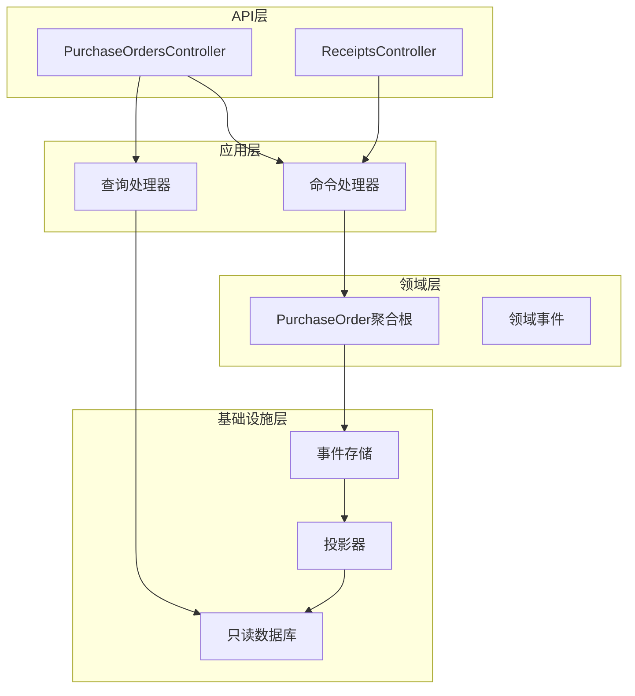
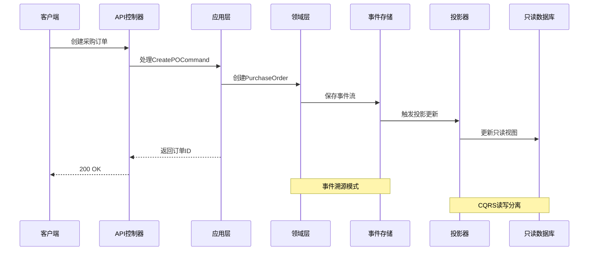
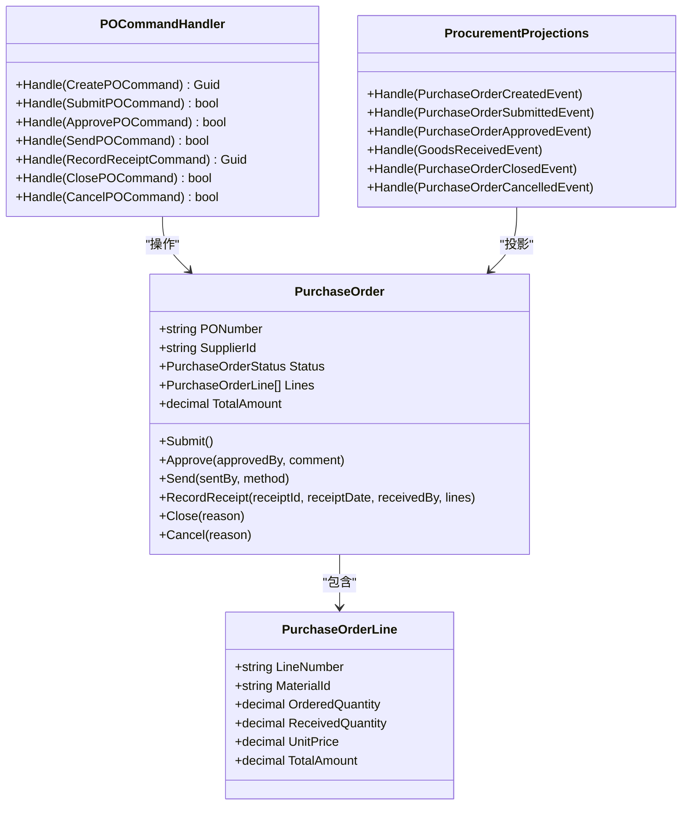
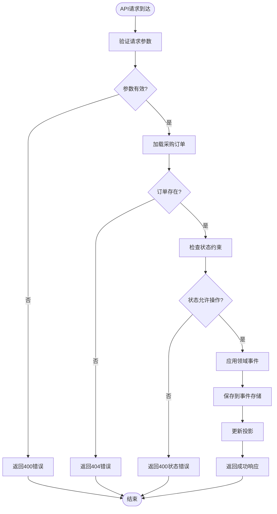

# 采购管理服务API

<cite>
**本文档引用的文件**
- [ProcurementController.cs](file://src/Services/Procurement/ErpSystem.Procurement/API/ProcurementController.cs)
- [PurchaseOrderCommands.cs](file://src/Services/Procurement/ErpSystem.Procurement/Application/PurchaseOrderCommands.cs)
- [ProcurementQueries.cs](file://src/Services/Procurement/ErpSystem.Procurement/Application/ProcurementQueries.cs)
- [PurchaseOrderAggregate.cs](file://src/Services/Procurement/ErpSystem.Procurement/Domain/PurchaseOrderAggregate.cs)
- [Projections.cs](file://src/Services/Procurement/ErpSystem.Procurement/Infrastructure/Projections.cs)
- [Persistence.cs](file://src/Services/Procurement/ErpSystem.Procurement/Infrastructure/Persistence.cs)
- [ProcurementEvents.cs](file://src/Services/Procurement/ErpSystem.Procurement/Domain/ProcurementEvents.cs)
- [ProcurementToInventoryTests.cs](file://src/tests/ErpSystem.IntegrationTests/ProcurementToInventoryTests.cs)
- [api.ts](file://src/Web/ErpSystem.Web/src/services/api.ts)
- [Procurement.tsx](file://src/Web/ErpSystem.Web/src/pages/Procurement.tsx)
</cite>

## 目录
1. [简介](#简介)
2. [项目结构](#项目结构)
3. [核心组件](#核心组件)
4. [架构概览](#架构概览)
5. [详细组件分析](#详细组件分析)
6. [依赖关系分析](#依赖关系分析)
7. [性能考虑](#性能考虑)
8. [故障排除指南](#故障排除指南)
9. [结论](#结论)

## 简介
本文件为采购管理服务的详细API文档，涵盖采购订单、采购收货、供应商管理等所有REST API端点。文档包含HTTP方法、URL模式、请求/响应模式以及采购流程控制。详细说明采购申请审批、采购订单执行、收货检验、供应商结算等功能的API接口，并提供采购流程的完整API调用序列和状态管理示例。

## 项目结构
采购管理服务采用分层架构，主要包含以下层次：
- API层：负责接收HTTP请求并返回响应
- 应用层：处理业务逻辑和命令/查询协调
- 领域层：维护核心业务规则和状态管理
- 基础设施层：提供事件存储、投影和数据访问

**图表来源**
- [ProcurementController.cs](file://src/Services/Procurement/ErpSystem.Procurement/API/ProcurementController.cs#L1-L62)
- [PurchaseOrderCommands.cs](file://src/Services/Procurement/ErpSystem.Procurement/Application/PurchaseOrderCommands.cs#L22-L112)
- [Projections.cs](file://src/Services/Procurement/ErpSystem.Procurement/Infrastructure/Projections.cs#L7-L119)

**章节来源**
- [ProcurementController.cs](file://src/Services/Procurement/ErpSystem.Procurement/API/ProcurementController.cs#L1-L62)
- [PurchaseOrderCommands.cs](file://src/Services/Procurement/ErpSystem.Procurement/Application/PurchaseOrderCommands.cs#L1-L112)

## 核心组件
采购管理服务的核心组件包括：

### 采购订单状态管理
采购订单支持以下状态流转：
- 草稿(Draft) → 待审批(PendingApproval) → 已批准(Approved) → 已发送(SentToSupplier) → 部分收货(PartiallyReceived) → 全部收货(FullyReceived) → 关闭(Closed) → 取消(Cancelled)

### 价格历史追踪
系统自动追踪供应商价格历史，在采购订单批准时记录材料单价信息。

**章节来源**
- [PurchaseOrderAggregate.cs](file://src/Services/Procurement/ErpSystem.Procurement/Domain/PurchaseOrderAggregate.cs#L5-L15)
- [Projections.cs](file://src/Services/Procurement/ErpSystem.Procurement/Infrastructure/Projections.cs#L45-L60)

## 架构概览
采购管理服务采用事件驱动架构，通过CQRS模式分离读写操作：

**图表来源**
- [PurchaseOrderCommands.cs](file://src/Services/Procurement/ErpSystem.Procurement/Application/PurchaseOrderCommands.cs#L31-L38)
- [Projections.cs](file://src/Services/Procurement/ErpSystem.Procurement/Infrastructure/Projections.cs#L16-L32)

## 详细组件分析

### 采购订单API

#### 创建采购订单
- **HTTP方法**: POST
- **URL模式**: `/api/v1/procurement/purchase-orders`
- **请求体**: 包含供应商信息、订单日期、币种和订单明细
- **响应**: 返回新创建的采购订单ID

#### 搜索采购订单
- **HTTP方法**: GET
- **URL模式**: `/api/v1/procurement/purchase-orders`
- **查询参数**: 
  - supplierId: 供应商ID
  - status: 订单状态
  - page: 页码，默认1
- **响应**: 返回订单列表

#### 获取采购订单详情
- **HTTP方法**: GET
- **URL模式**: `/api/v1/procurement/purchase-orders/{id}`
- **路径参数**: 订单ID
- **响应**: 返回指定订单详情

#### 提交采购订单
- **HTTP方法**: POST
- **URL模式**: `/api/v1/procurement/purchase-orders/{id}/submit`
- **路径参数**: 订单ID
- **前置条件**: 订单必须处于草稿状态
- **响应**: 返回提交结果

#### 审批采购订单
- **HTTP方法**: POST
- **URL模式**: `/api/v1/procurement/purchase-orders/{id}/approve`
- **请求体**: 
  - approvedBy: 审批人
  - comment: 审批意见
- **前置条件**: 订单必须处于待审批状态
- **响应**: 返回审批结果

#### 发送采购订单
- **HTTP方法**: POST
- **URL模式**: `/api/v1/procurement/purchase-orders/{id}/send`
- **请求体**:
  - sentBy: 发送人
  - method: 发送方式
- **前置条件**: 订单必须处于已批准状态
- **响应**: 返回发送结果

#### 关闭采购订单
- **HTTP方法**: POST
- **URL模式**: `/api/v1/procurement/purchase-orders/{id}/close`
- **请求体**: 关闭原因
- **响应**: 返回关闭结果

#### 取消采购订单
- **HTTP方法**: POST
- **URL模式**: `/api/v1/procurement/purchase-orders/{id}/cancel`
- **请求体**: 取消原因
- **前置条件**: 订单必须处于草稿、待审批或已批准状态且无收货记录
- **响应**: 返回取消结果

#### 获取价格历史
- **HTTP方法**: GET
- **URL模式**: `/api/v1/procurement/purchase-orders/prices`
- **查询参数**:
  - materialId: 材料ID
  - supplierId: 供应商ID(可选)
- **响应**: 返回价格历史记录

**章节来源**
- [ProcurementController.cs](file://src/Services/Procurement/ErpSystem.Procurement/API/ProcurementController.cs#L11-L48)
- [PurchaseOrderCommands.cs](file://src/Services/Procurement/ErpSystem.Procurement/Application/PurchaseOrderCommands.cs#L8-L20)

### 采购收货API

#### 录入采购收货
- **HTTP方法**: POST
- **URL模式**: `/api/v1/procurement/receipts`
- **请求体**: 包含收货日期、收货人和收货明细
- **响应**: 返回收货单ID

收货流程会触发集成事件，通知库存管理系统进行库存更新。

**章节来源**
- [ProcurementController.cs](file://src/Services/Procurement/ErpSystem.Procurement/API/ProcurementController.cs#L59-L61)
- [PurchaseOrderCommands.cs](file://src/Services/Procurement/ErpSystem.Procurement/Application/PurchaseOrderCommands.cs#L18-L92)

### 供应商管理API
基于主数据服务，供应商管理API包括：
- 创建供应商
- 供应商绩效评分
- 供应商黑名单管理
- 供应商查询和详情

**章节来源**
- [PRD-01-MasterData-Service.md](file://docs/PRD-01-MasterData-Service.md#L601-L628)

## 依赖关系分析

### 类关系图

**图表来源**
- [PurchaseOrderAggregate.cs](file://src/Services/Procurement/ErpSystem.Procurement/Domain/PurchaseOrderAggregate.cs#L85-L202)
- [PurchaseOrderCommands.cs](file://src/Services/Procurement/ErpSystem.Procurement/Application/PurchaseOrderCommands.cs#L22-L112)
- [Projections.cs](file://src/Services/Procurement/ErpSystem.Procurement/Infrastructure/Projections.cs#L7-L119)

### 数据流图

**图表来源**
- [PurchaseOrderAggregate.cs](file://src/Services/Procurement/ErpSystem.Procurement/Domain/PurchaseOrderAggregate.cs#L109-L156)
- [PurchaseOrderCommands.cs](file://src/Services/Procurement/ErpSystem.Procurement/Application/PurchaseOrderCommands.cs#L40-L110)

## 性能考虑
- **事件存储**: 使用PostgreSQL的jsonb类型存储事件负载，支持高效的事件查询和回放
- **读写分离**: 通过投影器维护只读数据库，查询操作直接访问只读数据库
- **批量查询**: 支持分页查询，避免一次性返回大量数据
- **缓存策略**: 可在应用层添加适当的缓存机制，减少重复查询

## 故障排除指南

### 常见错误及解决方案
1. **订单状态错误**: 当订单状态不允许当前操作时，系统会抛出状态异常
   - 解决方案: 检查订单当前状态，按正确顺序执行操作

2. **订单不存在**: 尝试操作不存在的订单ID
   - 解决方案: 先验证订单ID的有效性

3. **收货数量超限**: 收货数量超过订单订购数量
   - 解决方案: 确保收货数量不超过剩余未收货数量

4. **取消订单失败**: 订单已有收货记录无法取消
   - 解决方案: 先处理相关收货，或调整业务流程

**章节来源**
- [PurchaseOrderAggregate.cs](file://src/Services/Procurement/ErpSystem.Procurement/Domain/PurchaseOrderAggregate.cs#L111-L156)
- [PurchaseOrderCommands.cs](file://src/Services/Procurement/ErpSystem.Procurement/Application/PurchaseOrderCommands.cs#L42-L110)

## 结论
采购管理服务提供了完整的采购生命周期管理API，包括采购订单创建、审批、执行、收货和结算等核心功能。通过事件驱动架构和CQRS模式，系统实现了良好的可扩展性和可维护性。建议在生产环境中结合监控和日志系统，确保系统的稳定运行。